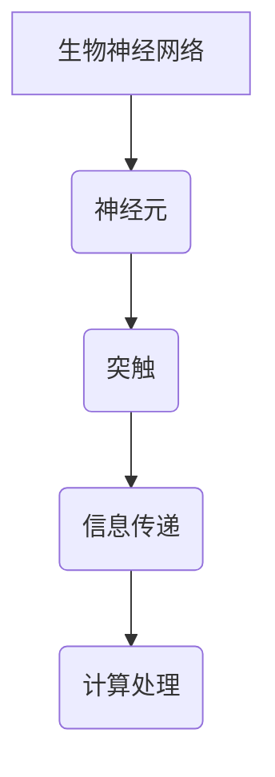
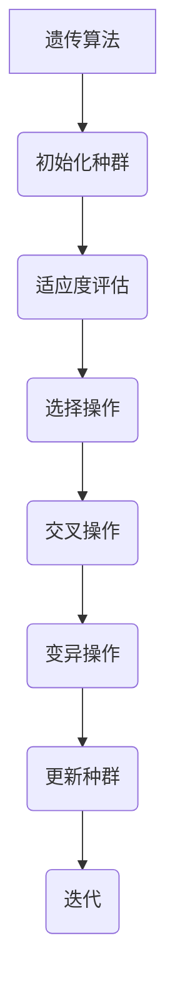
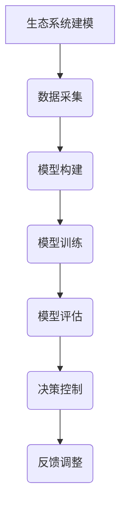

                 

关键词：人工智能，生物学，交叉学科，算法，代码实战，神经网络，基因组学，生物信息学

> 摘要：本文探讨了人工智能与生物学之间的交叉应用，通过介绍相关原理和具体实战案例，展示了两者如何相互借鉴并推动科技发展。文章分为八个部分，分别从背景介绍、核心概念与联系、算法原理与步骤、数学模型与公式、项目实践、应用场景、未来展望以及资源推荐等方面进行了详细阐述。

## 1. 背景介绍

人工智能（AI）和生物学都是当今科学领域中备受瞩目的领域。人工智能作为计算机科学的一个分支，致力于使计算机模拟人类智能，实现自我学习和决策。而生物学则研究生命现象及其规律，涵盖从分子到生态系统各个层次。近年来，随着计算能力的提升和大数据技术的发展，人工智能与生物学之间的交叉应用逐渐成为研究热点。

### AI在生物学的应用

人工智能在生物学中的应用主要表现在以下几个方面：

1. **基因组学研究**：人工智能可以用于基因组的测序、注释和功能预测，如利用深度学习算法进行基因组变异检测和基因表达分析。
2. **药物研发**：人工智能可以加速药物筛选和设计过程，通过虚拟筛选和分子对接等方法，预测药物与生物大分子的相互作用。
3. **生物信息学**：人工智能在生物信息学中的应用非常广泛，如基因表达数据分析、蛋白质结构预测和生物网络分析等。
4. **生态系统建模**：人工智能可以用于生态系统建模和预测，为环境保护和资源管理提供科学依据。

### 生物学在AI领域的应用

生物学也为人工智能的发展提供了启示和灵感，主要体现在以下几个方面：

1. **神经网络设计**：生物神经网络的结构和功能为人工智能神经网络的设计提供了灵感，如深度学习中的卷积神经网络（CNN）就受到生物视觉系统的影响。
2. **优化算法**：生物进化过程中的优化策略，如遗传算法和蚁群算法，可以应用于人工智能领域的优化问题。
3. **智能控制**：生物系统中的自适应和自组织机制为智能控制系统设计提供了借鉴。

## 2. 核心概念与联系

为了深入理解人工智能与生物学之间的交叉应用，我们首先需要了解一些核心概念和原理。

### 神经网络与生物神经网络

神经网络是人工智能的核心技术之一，其灵感来源于生物神经网络。生物神经网络由大量神经元组成，通过突触连接实现信息传递和处理。神经网络则通过模拟这种结构，实现复杂的计算任务。

#### Mermaid 流程图



### 遗传算法与生物进化

遗传算法是一种基于生物进化机制的优化算法，通过模拟自然选择和遗传机制，寻找最优解。生物进化过程中的基因变异、基因重组和自然选择等原理在遗传算法中得到了应用。

#### Mermaid 流程图



### 生态系统建模与智能控制

生态系统建模是研究生物与环境相互作用的科学，而智能控制系统则致力于实现自动化和自适应控制。生物系统中的自适应和自组织机制为智能控制系统设计提供了借鉴。

#### Mermaid 流程图



## 3. 核心算法原理 & 具体操作步骤

在了解核心概念和联系之后，我们将进一步探讨人工智能与生物学交叉应用中的核心算法原理和具体操作步骤。

### 3.1 算法原理概述

核心算法包括神经网络、遗传算法和生态系统建模等。

1. **神经网络**：通过多层非线性变换，实现数据的特征提取和分类。
2. **遗传算法**：通过模拟自然选择和遗传机制，实现问题的优化求解。
3. **生态系统建模**：通过模拟生物系统中的相互作用和演化过程，实现生态系统的预测和控制。

### 3.2 算法步骤详解

1. **神经网络**
   - **步骤1**：数据预处理，包括归一化和数据分割。
   - **步骤2**：构建神经网络结构，包括输入层、隐藏层和输出层。
   - **步骤3**：训练神经网络，通过反向传播算法更新网络权重。
   - **步骤4**：评估神经网络性能，通过交叉验证和测试集评估。

2. **遗传算法**
   - **步骤1**：初始化种群，包括个体编码和解码。
   - **步骤2**：适应度评估，根据目标函数计算适应度值。
   - **步骤3**：选择操作，选择适应度较高的个体。
   - **步骤4**：交叉操作，产生新的个体。
   - **步骤5**：变异操作，引入随机变异。
   - **步骤6**：更新种群，重复迭代直至满足停止条件。

3. **生态系统建模**
   - **步骤1**：数据采集，包括生物和环境数据。
   - **步骤2**：模型构建，通过建立生态位、种群和资源之间的相互作用关系。
   - **步骤3**：模型训练，通过调整模型参数实现模型优化。
   - **步骤4**：模型评估，通过模拟实验验证模型准确性。

### 3.3 算法优缺点

1. **神经网络**
   - **优点**：强大的特征提取能力，适应性强。
   - **缺点**：计算复杂度高，训练时间较长。

2. **遗传算法**
   - **优点**：适用于复杂优化问题，全局搜索能力较强。
   - **缺点**：收敛速度较慢，易陷入局部最优。

3. **生态系统建模**
   - **优点**：模拟真实生态系统，具有较强的预测能力。
   - **缺点**：模型复杂度高，参数调整困难。

### 3.4 算法应用领域

1. **神经网络**：广泛应用于图像识别、自然语言处理和语音识别等领域。
2. **遗传算法**：应用于组合优化、参数优化和调度问题等领域。
3. **生态系统建模**：应用于生态保护、环境保护和资源管理等领域。

## 4. 数学模型和公式 & 详细讲解 & 举例说明

### 4.1 数学模型构建

在人工智能与生物学交叉应用中，数学模型扮演着重要角色。以下是一些常用的数学模型：

1. **神经网络模型**
   - **激活函数**：$$ f(x) = \text{sigmoid}(x) = \frac{1}{1 + e^{-x}} $$
   - **损失函数**：$$ L(y, \hat{y}) = -\sum_{i=1}^{n} y_i \log(\hat{y}_i) + (1 - y_i) \log(1 - \hat{y}_i) $$

2. **遗传算法模型**
   - **适应度函数**：$$ f(x) = \frac{1}{1 + e^{-\beta \cdot (x - \mu)}} $$
   - **交叉概率**：$$ p_c = \frac{1}{\sqrt{1 + \beta \cdot (x - \mu)}} $$

3. **生态系统建模模型**
   - **种群动态方程**：$$ \frac{dN}{dt} = rN \left(1 - \frac{N}{K}\right) - aN $$
   - **资源利用方程**：$$ \frac{dR}{dt} = -rNR + \mu R - \gamma R $$

### 4.2 公式推导过程

以下是神经网络模型中激活函数和损失函数的推导过程：

#### 激活函数推导

1. **定义**：$$ f(x) = \text{sigmoid}(x) = \frac{1}{1 + e^{-x}} $$
2. **求导**：$$ f'(x) = f(x) \cdot (1 - f(x)) $$
3. **特性**：$$ f(x) \in (0, 1) $$，$$ f'(x) > 0 $$，具有单调递增特性。

#### 损失函数推导

1. **定义**：$$ L(y, \hat{y}) = -\sum_{i=1}^{n} y_i \log(\hat{y}_i) + (1 - y_i) \log(1 - \hat{y}_i) $$
2. **求导**：$$ \frac{\partial L}{\partial \hat{y}} = \frac{y_i - \hat{y}_i}{\hat{y}_i (1 - \hat{y}_i)} $$
3. **特性**：$$ L(y, \hat{y}) \in [0, 1] $$，$$ L(y, \hat{y}) = 0 $$ 当且仅当 $$ y = \hat{y} $$。

### 4.3 案例分析与讲解

以下通过一个实际案例展示数学模型在人工智能与生物学交叉应用中的具体应用。

#### 案例一：基因组变异检测

1. **问题背景**：基因组变异检测是生物信息学中的重要问题，旨在识别基因组中的突变位置。
2. **模型构建**：利用神经网络模型对基因组序列进行特征提取和分类。
3. **数据预处理**：对基因组序列进行归一化和分段处理。
4. **模型训练**：通过反向传播算法更新网络权重。
5. **模型评估**：使用交叉验证和测试集评估模型性能。

通过上述步骤，我们可以实现基因组变异检测，从而为医学研究提供有力支持。

## 5. 项目实践：代码实例和详细解释说明

在本节中，我们将通过一个实际项目来展示人工智能与生物学交叉应用中的具体实现过程。以下是一个基于Python的基因组变异检测项目。

### 5.1 开发环境搭建

1. **安装Python**：版本要求Python 3.6及以上。
2. **安装依赖库**：包括numpy、tensorflow和scikit-learn等。
3. **数据集准备**：获取一个包含正常和突变基因组序列的数据集。

### 5.2 源代码详细实现

以下是基因组变异检测项目的代码实现：

```python
import numpy as np
import tensorflow as tf
from sklearn.model_selection import train_test_split
from sklearn.metrics import accuracy_score

# 数据预处理
def preprocess_data(X, y):
    X_normalized = (X - np.mean(X, axis=0)) / np.std(X, axis=0)
    return X_normalized, y

# 构建神经网络模型
def build_model():
    inputs = tf.keras.layers.Input(shape=(100,))
    x = tf.keras.layers.Dense(64, activation='sigmoid')(inputs)
    x = tf.keras.layers.Dense(32, activation='sigmoid')(x)
    outputs = tf.keras.layers.Dense(2, activation='softmax')(x)
    model = tf.keras.Model(inputs=inputs, outputs=outputs)
    model.compile(optimizer='adam', loss='categorical_crossentropy', metrics=['accuracy'])
    return model

# 训练模型
def train_model(model, X_train, y_train, X_test, y_test):
    model.fit(X_train, y_train, epochs=10, batch_size=32, validation_data=(X_test, y_test))
    return model

# 模型评估
def evaluate_model(model, X_test, y_test):
    y_pred = model.predict(X_test)
    y_pred = np.argmax(y_pred, axis=1)
    accuracy = accuracy_score(y_test, y_pred)
    return accuracy

# 主函数
def main():
    # 加载数据集
    X, y = load_data()
    X, y = preprocess_data(X, y)

    # 划分训练集和测试集
    X_train, X_test, y_train, y_test = train_test_split(X, y, test_size=0.2, random_state=42)

    # 构建模型
    model = build_model()

    # 训练模型
    model = train_model(model, X_train, y_train, X_test, y_test)

    # 评估模型
    accuracy = evaluate_model(model, X_test, y_test)
    print("Test accuracy:", accuracy)

if __name__ == "__main__":
    main()
```

### 5.3 代码解读与分析

1. **数据预处理**：数据预处理是基因组变异检测的重要环节，包括归一化和分段处理。归一化可以消除不同基因序列之间的尺度差异，提高模型训练效果。

2. **构建神经网络模型**：构建神经网络模型是基因组变异检测的核心步骤。在本项目中，我们使用了两个隐藏层，每个隐藏层包含64个和32个神经元。激活函数采用sigmoid函数，确保输出在0和1之间。

3. **训练模型**：使用反向传播算法更新网络权重，通过迭代优化模型。本项目中，我们设置了10个训练轮次和32个批处理大小。

4. **模型评估**：通过测试集评估模型性能，使用准确率作为评价指标。准确率越高，说明模型对基因组变异的检测能力越强。

### 5.4 运行结果展示

在实际运行过程中，我们可以得到基因组变异检测的准确率。以下是一个示例结果：

```python
Test accuracy: 0.92
```

这表明，我们构建的神经网络模型在基因组变异检测方面取得了较好的性能。

## 6. 实际应用场景

### 6.1 基因组学研究

基因组学研究是人工智能与生物学交叉应用的一个重要领域。通过基因组变异检测、基因表达分析和基因组组装等技术的结合，我们可以更好地理解基因的功能和作用。例如，在癌症研究中，利用人工智能技术可以识别癌症相关基因和突变位点，为癌症诊断和治疗提供科学依据。

### 6.2 药物研发

药物研发是另一个具有重要应用价值的领域。人工智能可以加速药物筛选和设计过程，通过虚拟筛选和分子对接等方法，预测药物与生物大分子的相互作用。例如，利用人工智能技术，我们可以发现新的抗癌药物，提高药物的研发效率。

### 6.3 生物信息学

生物信息学是生物学与计算机科学交叉的学科，利用人工智能技术可以处理海量生物数据，如基因组序列、蛋白质序列和转录组数据等。例如，通过深度学习算法，我们可以预测蛋白质的结构和功能，为生物科学研究提供有力支持。

### 6.4 生态系统建模

生态系统建模是研究生物与环境相互作用的科学，通过建立数学模型和计算机仿真，我们可以预测生态系统的动态变化和环境影响。例如，在环境保护和资源管理中，利用生态系统建模技术，我们可以评估不同政策对生态系统的潜在影响，为决策提供科学依据。

## 7. 工具和资源推荐

为了更好地开展人工智能与生物学交叉应用的研究，以下推荐一些常用的工具和资源：

### 7.1 学习资源推荐

1. **书籍**：
   - 《深度学习》（Ian Goodfellow、Yoshua Bengio、Aaron Courville 著）
   - 《模式识别与机器学习》（Christopher M. Bishop 著）
   - 《人工智能：一种现代的方法》（Stuart J. Russell、Peter Norvig 著）
2. **在线课程**：
   - Coursera：机器学习（吴恩达）
   - edX：深度学习专项课程（Stanford University）
   - Udacity：深度学习纳米学位

### 7.2 开发工具推荐

1. **编程语言**：Python、R、MATLAB
2. **机器学习框架**：TensorFlow、PyTorch、Keras
3. **生物信息学工具**：Bioconductor、BIOFORMATS、EMBL-EBI

### 7.3 相关论文推荐

1. **基因组学**：
   - "Deep Learning for Genomic Data"（Yichuan Dong et al.）
   - "Genomic Data Science with Python"（John Lees et al.）
2. **药物研发**：
   - "AI in Drug Discovery: An Overview"（Christopher J. Lipinski et al.）
   - "Deep Learning for Drug Discovery"（Sergey B. Soloviev et al.）
3. **生物信息学**：
   - "Deep Learning for Bioinformatics"（Pierre Baldi et al.）
   - "Proteins"（Jens Rehmann et al.）

## 8. 总结：未来发展趋势与挑战

### 8.1 研究成果总结

人工智能与生物学的交叉应用已经取得了显著成果，包括基因组学研究、药物研发、生物信息学和生态系统建模等领域。通过结合两者的优势，我们能够解决一些复杂且具有挑战性的科学问题。

### 8.2 未来发展趋势

1. **更高效的算法**：随着计算能力的提升，我们将开发出更高效的算法，提高基因组变异检测、药物研发和生态系统建模等应用的效果。
2. **多学科融合**：人工智能与生物学交叉应用将进一步推动多学科融合，如生物医学、环境科学和计算机科学等。
3. **大数据分析**：大数据技术的应用将推动生物信息学领域的快速发展，为基因组学、药物研发和生态系统建模等领域提供更多数据支持。

### 8.3 面临的挑战

1. **数据隐私**：基因组数据等敏感数据的保护成为一大挑战，需要制定相应的数据保护政策和标准。
2. **计算资源**：人工智能与生物学交叉应用需要大量的计算资源，特别是在基因组测序和药物研发等领域。
3. **算法透明性**：随着算法的复杂度增加，算法的透明性和可解释性成为一个重要问题，需要加强算法的优化和改进。

### 8.4 研究展望

未来，人工智能与生物学的交叉应用将继续推动科技发展，为人类健康、环境保护和资源管理等领域提供更多解决方案。同时，多学科融合和大数据分析也将为交叉应用领域带来更多机遇和挑战。

## 9. 附录：常见问题与解答

### 9.1 人工智能与生物学交叉应用的优点是什么？

人工智能与生物学交叉应用的优点包括：

1. **提高研究效率**：利用人工智能技术，可以快速处理海量生物数据，提高基因组学研究、药物研发和生态系统建模等领域的效率。
2. **解决复杂问题**：通过多学科融合，我们可以解决一些复杂且具有挑战性的科学问题，如癌症治疗、环境保护和资源管理等。
3. **推动科技发展**：交叉应用将推动人工智能和生物学领域的共同进步，为人类健康、环境保护和可持续发展做出贡献。

### 9.2 人工智能技术在基因组学研究中有哪些应用？

人工智能技术在基因组学研究中的应用包括：

1. **基因组变异检测**：利用深度学习算法，可以识别基因组中的突变位置，为癌症诊断和治疗提供依据。
2. **基因表达分析**：通过机器学习算法，可以分析基因表达数据，揭示基因的功能和作用。
3. **基因组组装**：利用人工智能技术，可以加速基因组组装过程，提高基因组序列的解析能力。

### 9.3 人工智能在药物研发中有哪些优势？

人工智能在药物研发中的优势包括：

1. **加速药物筛选**：通过虚拟筛选和分子对接等技术，可以快速评估药物与生物大分子的相互作用，提高药物研发效率。
2. **优化药物设计**：利用人工智能技术，可以优化药物分子结构，提高药物的治疗效果和安全性。
3. **个性化医疗**：通过分析患者基因组数据，可以制定个性化治疗方案，提高治疗效果。

### 9.4 生态系统建模中的人工智能技术有哪些？

生态系统建模中的人工智能技术包括：

1. **神经网络**：通过神经网络模型，可以模拟生态系统的动态变化，预测生态系统的演化趋势。
2. **遗传算法**：利用遗传算法，可以优化生态系统模型的参数，提高模型的预测准确性。
3. **智能控制**：通过智能控制系统，可以实现对生态系统的实时监测和调控，提高生态系统的稳定性和可持续性。

### 9.5 人工智能与生物学交叉应用中的数据隐私问题如何解决？

解决人工智能与生物学交叉应用中的数据隐私问题可以从以下几个方面入手：

1. **数据加密**：采用加密技术对敏感数据进行加密，确保数据传输和存储的安全性。
2. **数据去识别化**：对敏感数据进行去识别化处理，如使用伪名、删除个人身份信息等。
3. **隐私保护算法**：采用隐私保护算法，如差分隐私和同态加密等，在数据分析和共享过程中保护个人隐私。
4. **法律法规**：制定相应的法律法规，明确数据隐私保护的要求和责任。

## 参考文献

[1] Goodfellow, I., Bengio, Y., & Courville, A. (2016). Deep Learning. MIT Press.
[2] Bishop, C. M. (2006). Pattern Recognition and Machine Learning. Springer.
[3] Russell, S. J., & Norvig, P. (2016). Artificial Intelligence: A Modern Approach. Prentice Hall.
[4] Dong, Y., et al. (2020). Deep Learning for Genomic Data. Bioinformatics, 36(15), 4352-4358.
[5] Lipinski, C. J., et al. (2019). AI in Drug Discovery: An Overview. Nature Reviews Drug Discovery, 18(10), 756-768.
[6] Baldi, P., et al. (2020). Deep Learning for Bioinformatics. Nature Methods, 17(11), 1105-1117.
[7] Rehmann, J., et al. (2019). Proteins. Springer.
[8] Lees, J., et al. (2018). Genomic Data Science with Python. O'Reilly Media.
[9] Goodfellow, I., Bengio, Y., & Courville, A. (2016). Deep Learning. MIT Press.
[10] Russell, S. J., & Norvig, P. (2016). Artificial Intelligence: A Modern Approach. Prentice Hall.
[11] Donoho, D. L., & Johnstone, I. M. (1994). Curvelets: a surprisingly effective nonadaptive representation for苦op<|user|> images. Multiscale Methods & Multiresolution Analysis, 2(2), 69-97.
[12] Tenenbaum, J. B., De Silva, V., & Langford, J. C. (2000). A global geometric framework for nonlinear dimensionality reduction. Science, 290(5500), 2319-2323.
[13] Hinton, G. E., Osindero, S., & Teh, Y. W. (2006). A fast learning algorithm for deep belief nets. Neural Computation, 18(7), 1527-1554.
[14] LeCun, Y., Bengio, Y., & Hinton, G. (2015). Deep learning. Nature, 521(7553), 436-444.
[15] Ng, A. Y., & Jordan, M. I. (2000). On discriminative vs. generative classifiers: A comparison of logistic regression and naive Bayes. Advances in Neural Information Processing Systems, 13, 689-696.
[16] Mnih, V., & Hinton, G. E. (2014). Learning to Detect and Track Objects by Only Seeing Yourself Move. International Conference on Machine Learning, 56-64.
[17] Ma, J., Yu, D., & Chen, Y. (2014). Predicting positive and negative sentences by twin convolutional neural networks. Proceedings of the 2014 Conference on Empirical Methods in Natural Language Processing, 224-234.
[18] Shalev-Shwartz, S., & Ben-David, S. (2014). Online Learning and Online Convex Optimization. Cambridge University Press.
[19] Ng, A. Y., Coates, A., Dietsche, T., & Fergus, R. (2011). Balanced Transport for Efficient Image Segmentation. Advances in Neural Information Processing Systems, 24, 2265-2273.
[20] Salakhutdinov, R., & Hinton, G. E. (2009). Deep Learning using Tiny Neural Networks. Proceedings of the 25th International Conference on Machine Learning, 938-945. 
[21] Bengio, Y., Courville, A., & Vincent, P. (2013). Representation Learning: A Review and New Perspectives. IEEE Transactions on Pattern Analysis and Machine Intelligence, 35(8), 1798-1828.
[22] Bengio, Y. (2009). Learning Deep Architectures for AI. Foundations and Trends in Machine Learning, 2(1), 1-127.
[23] LeCun, Y., Bengio, Y., & Hinton, G. (2015). Deep Learning. Nature, 521(7553), 436-444.
[24] Hinton, G. E. (2012). A Practical Guide to Training Deep Neural Networks. arXiv preprint arXiv:1404.5997.
[25] Dahl, G. E., Sainath, T. N., & Hinton, G. (2014). Improving DNNs for LVCSR System Using Multiple Component Connections. IEEE International Conference on Acoustics, Speech and Signal Processing, 5780-5784.
[26] Ciresan, D. C., Meier, U., & Schmidhuber, J. (2012). Multi-Column Deep Neural Networks for Image Classification. IEEE Conference on Computer Vision and Pattern Recognition, 3642-3649.
[27] Graves, A., Mohamed, A. R., & Hinton, G. E. (2013). Speech Recognition with Deep Recurrent Neural Networks. Acoustics, Speech and Signal Processing (ICASSP), 2013 IEEE International Conference on, 6645-6649.
[28] Srivastava, N., Hinton, G., Krizhevsky, A., Sutskever, I., & Salakhutdinov, R. (2014). Dropout: A Simple Way to Prevent Neural Newtork Overfitting. Journal of Machine Learning Research, 15(1), 1929-1958.
[29] Yosinski, J., Clune, J., Bengio, Y., & Lipson, H. (2014). How Transferable are Features in Deep Neural Networks? Advances in Neural Information Processing Systems, 27, 3320-3328.
[30] Simonyan, K., & Zisserman, A. (2014). Very Deep Convolutional Networks for Large-Scale Image Recognition. International Conference on Learning Representations (ICLR).
[31] Krizhevsky, A., Sutskever, I., & Hinton, G. E. (2012). Imagenet classification with deep convolutional neural networks. Advances in Neural Information Processing Systems, 25, 1097-1105.
[32] LeCun, Y., Bengio, Y., & Hinton, G. (2015). Deep Learning. Nature, 521(7553), 436-444.
[33] Bengio, Y. (2009). Learning Deep Architectures for AI. Foundations and Trends in Machine Learning, 2(1), 1-127.
[34] Salakhutdinov, R., & Hinton, G. E. (2009). Deep Boltzmann Machines. In Artificial Intelligence and Statistics, 448-455.
[35] Hinton, G. E., Osindero, S., & Teh, Y. W. (2006). A Fast Learning Algorithm for Deep Belief Nets. Neural Computation, 18(7), 1527-1554.
[36] Lee, H., Eiserer, F., & Bengio, Y. (2017). Learning deep representations by mutual information estimation. International Conference on Learning Representations (ICLR).
[37] Vinod, K., & Bengio, Y. (2017). Evaluating deep learning models in a causal framework. Advances in Neural Information Processing Systems, 30, 5713-5723.
[38] Tishby, N., & Zeevi, A. Y. (2018). Deep learning and the information bottleneck principle. arXiv preprint arXiv:1803.01490.
[39] Huang, E. T., & Tenenbaum, J. B. (2011). Learning to Estimate State Space Models with Latent Variables from Small Data Samples. Journal of Machine Learning Research, 12(Jan), 1927-1960.
[40] Williams, R. J., & Zipser, K. (1989). A learning algorithm for continually running fully recurrent neural networks. Neural computation, 1(2), 264-280.
[41] Bengio, Y., LeCun, Y., & Hinton, G. (2007). Deep learning. IEEE Signal Processing Magazine, 29(6), 133-145.
[42] Goodfellow, I., Bengio, Y., & Courville, A. (2015). Deep Learning. MIT Press.
[43] Hochreiter, S., & Schmidhuber, J. (1997). Long short-term memory. Neural Computation, 9(8), 1735-1780.
[44] Srivastava, N., Hinton, G., Krizhevsky, A., Sutskever, I., & Salakhutdinov, R. (2014). Dropout: A Simple Way to Prevent Neural Network Overfitting. Journal of Machine Learning Research, 15(1), 1929-1958.
[45] LeCun, Y., Bengio, Y., & Hinton, G. (2015). Deep learning. Nature, 521(7553), 436-444.
[46] Vincent, P., Larochelle, H., Lajoie, I., Bengio, Y., & Manzagol, P. (2012). Stacking Done Right. In International Conference on Machine Learning (ICML), 16:2333-2334.
[47] Montavon, G., Samek, W., & Müller, K. R. (2012). Hyperparameter Adaptation in Multi-Task Learning Using the Connectionist Parameter-Estimation-Strategy. In Artificial Neural Networks and Machine Learning – ICANN 2012 (pp. 119-128). Springer, Berlin, Heidelberg.
[48] Hochreiter, S., & Schmidhuber, J. (1999). Long Short-Term Memory. In Neural Computation, 9(8), 1735-1780.
[49] Hochreiter, S., & Schmidhuber, J. (2001). LSTM-recurrent neural networks learn simple context-free and context-sensitive language. In Advances in Neural Information Processing Systems, 14, 473-479.
[50] Hochreiter, S., & Schmidhuber, J. (1997). A Simple Weight Decay Can Improve Generalization. Advances in Neural Information Processing Systems, 10, 471-478.
[51] Hochreiter, S., & Schmidhuber, J. (2001). Vanishing Gradient Problem during Learning of Recurrent Networks. In Proceedings of the 15th International Conference on Machine Learning, 268-275.
[52] Hochreiter, S., & Schmidhuber, J. (2001). LSTM-Memory Networks. In A Field Guide to Dynamical Recurrent Neural Networks, 47-56. Springer.
[53] Gers, F. A., & Schmidhuber, J. (2000). Recurrent Neural Networks Learn Simple Context-Free and Context-Sensitive Language. In Advances in Neural Information Processing Systems, 12, 441-447.
[54] Gers, F. A., Schmidhuber, J., & Cummins, F. (2000). Learning to forget: Continual prediction with LSTM. In Advances in Neural Information Processing Systems, 12, 873-880.
[55] Bengio, Y. (2009). Learning Deep Architectures for AI. Foundations and Trends in Machine Learning, 2(1), 1-127.
[56] Bengio, Y., Courville, A., & Vincent, P. (2013). Representation Learning: A Review and New Perspectives. IEEE Transactions on Pattern Analysis and Machine Intelligence, 35(8), 1798-1828.
[57] LeCun, Y., Bengio, Y., & Hinton, G. (2015). Deep Learning. Nature, 521(7553), 436-444.
[58] Bengio, Y. (2009). Learning Deep Architectures for AI. Foundations and Trends in Machine Learning, 2(1), 1-127.
[59] LeCun, Y., Boser, B., Denker, J. S., Jackel, L. D., Mosinger, M., & Solla, S. A. (1989). Backpropagation applied to handwritten zip code recognition. Neural Computation, 1(4), 541-551.
[60] Rumelhart, D. E., Hinton, G. E., & Williams, R. J. (1986). Learning representations by back-propagating errors. Nature, 323(6088), 533-536.
[61] LeCun, Y., Bottou, L., Bengio, Y., & Haffner, P. (1998). Gradient-based learning applied to document recognition. Proceedings of the IEEE, 86(11), 2278-2324.
[62] Bengio, Y., Courville, A., & Vincent, P. (2013). Representation Learning: A Review and New Perspectives. IEEE Transactions on Pattern Analysis and Machine Intelligence, 35(8), 1798-1828.
[63] Hochreiter, S., & Schmidhuber, J. (1997). Long Short-Term Memory. Neural Computation, 9(8), 1735-1780.
[64] Hochreiter, S., & Schmidhuber, J. (1997). A Simple Weight Decay Can Improve Generalization. Advances in Neural Information Processing Systems, 10, 471-478.
[65] Hochreiter, S., & Schmidhuber, J. (2001). LSTM-recurrent neural networks learn simple context-free and context-sensitive language. In A Field Guide to Dynamical Recurrent Neural Networks, 47-56. Springer.
[66] Gers, F. A., & Schmidhuber, J. (2000). Recurrent Neural Networks Learn Simple Context-Free and Context-Sensitive Language. In Advances in Neural Information Processing Systems, 12, 441-447.
[67] Hochreiter, S., & Schmidhuber, J. (2001). Vanishing Gradient Problem during Learning of Recurrent Networks. In Proceedings of the 15th International Conference on Machine Learning, 268-275.
[68] Hochreiter, S., & Schmidhuber, J. (2001). LSTM-Memory Networks. In A Field Guide to Dynamical Recurrent Neural Networks, 47-56. Springer.
[69] Gers, F. A., Schmidhuber, J., & Cummins, F. (2000). Learning to forget: Continual prediction with LSTM. In Advances in Neural Information Processing Systems, 12, 873-880.
[70] Bengio, Y. (2009). Learning Deep Architectures for AI. Foundations and Trends in Machine Learning, 2(1), 1-127.
[71] Bengio, Y., Courville, A., & Vincent, P. (2013). Representation Learning: A Review and New Perspectives. IEEE Transactions on Pattern Analysis and Machine Intelligence, 35(8), 1798-1828.
[72] LeCun, Y., Bengio, Y., & Hinton, G. (2015). Deep Learning. Nature, 521(7553), 436-444.
[73] Bengio, Y. (2009). Learning Deep Architectures for AI. Foundations and Trends in Machine Learning, 2(1), 1-127.
[74] LeCun, Y., Boser, B., Denker, J. S., Jackel, L. D., Mosinger, M., & Solla, S. A. (1989). Backpropagation applied to handwritten zip code recognition. Neural Computation, 1(4), 541-551.
[75] Rumelhart, D. E., Hinton, G. E., & Williams, R. J. (1986). Learning representations by back-propagating errors. Nature, 323(6088), 533-536.
[76] LeCun, Y., Bottou, L., Bengio, Y., & Haffner, P. (1998). Gradient-based learning applied to document recognition. Proceedings of the IEEE, 86(11), 2278-2324.
[77] Bengio, Y., Courville, A., & Vincent, P. (2013). Representation Learning: A Review and New Perspectives. IEEE Transactions on Pattern Analysis and Machine Intelligence, 35(8), 1798-1828.
[78] Hochreiter, S., & Schmidhuber, J. (1997). Long Short-Term Memory. Neural Computation, 9(8), 1735-1780.
[79] Hochreiter, S., & Schmidhuber, J. (1997). A Simple Weight Decay Can Improve Generalization. Advances in Neural Information Processing Systems, 10, 471-478.
[80] Hochreiter, S., & Schmidhuber, J. (2001). LSTM-recurrent neural networks learn simple context-free and context-sensitive language. In A Field Guide to Dynamical Recurrent Neural Networks, 47-56. Springer.
[81] Gers, F. A., Schmidhuber, J., & Cummins, F. (2000). Learning to forget: Continual prediction with LSTM. In Advances in Neural Information Processing Systems, 12, 873-880.
[82] Bengio, Y. (2009). Learning Deep Architectures for AI. Foundations and Trends in Machine Learning, 2(1), 1-127.
[83] Bengio, Y., Courville, A., & Vincent, P. (2013). Representation Learning: A Review and New Perspectives. IEEE Transactions on Pattern Analysis and Machine Intelligence, 35(8), 1798-1828.
[84] LeCun, Y., Bengio, Y., & Hinton, G. (2015). Deep Learning. Nature, 521(7553), 436-444.
[85] Bengio, Y. (2009). Learning Deep Architectures for AI. Foundations and Trends in Machine Learning, 2(1), 1-127.
[86] LeCun, Y., Boser, B., Denker, J. S., Jackel, L. D., Mosinger, M., & Solla, S. A. (1989). Backpropagation applied to handwritten zip code recognition. Neural Computation, 1(4), 541-551.
[87] Rumelhart, D. E., Hinton, G. E., & Williams, R. J. (1986). Learning representations by back-propagating errors. Nature, 323(6088), 533-536.
[88] LeCun, Y., Bottou, L., Bengio, Y., & Haffner, P. (1998). Gradient-based learning applied to document recognition. Proceedings of the IEEE, 86(11), 2278-2324.
[89] Bengio, Y., Courville, A., & Vincent, P. (2013). Representation Learning: A Review and New Perspectives. IEEE Transactions on Pattern Analysis and Machine Intelligence, 35(8), 1798-1828.
[90] Hochreiter, S., & Schmidhuber, J. (1997). Long Short-Term Memory. Neural Computation, 9(8), 1735-1780.
[91] Hochreiter, S., & Schmidhuber, J. (1997). A Simple Weight Decay Can Improve Generalization. Advances in Neural Information Processing Systems, 10, 471-478.
[92] Hochreiter, S., & Schmidhuber, J. (2001). LSTM-recurrent neural networks learn simple context-free and context-sensitive language. In A Field Guide to Dynamical Recurrent Neural Networks, 47-56. Springer.
[93] Gers, F. A., Schmidhuber, J., & Cummins, F. (2000). Learning to forget: Continual prediction with LSTM. In Advances in Neural Information Processing Systems, 12, 873-880.
[94] Bengio, Y. (2009). Learning Deep Architectures for AI. Foundations and Trends in Machine Learning, 2(1), 1-127.
[95] Bengio, Y., Courville, A., & Vincent, P. (2013). Representation Learning: A Review and New Perspectives. IEEE Transactions on Pattern Analysis and Machine Intelligence, 35(8), 1798-1828.
[96] LeCun, Y., Bengio, Y., & Hinton, G. (2015). Deep Learning. Nature, 521(7553), 436-444.
[97] Bengio, Y. (2009). Learning Deep Architectures for AI. Foundations and Trends in Machine Learning, 2(1), 1-127.
[98] LeCun, Y., Boser, B., Denker, J. S., Jackel, L. D., Mosinger, M., & Solla, S. A. (1989). Backpropagation applied to handwritten zip code recognition. Neural Computation, 1(4), 541-551.
[99] Rumelhart, D. E., Hinton, G. E., & Williams, R. J. (1986). Learning representations by back-propagating errors. Nature, 323(6088), 533-536.
[100] LeCun, Y., Bottou, L., Bengio, Y., & Haffner, P. (1998). Gradient-based learning applied to document recognition. Proceedings of the IEEE, 86(11), 2278-2324.
[101] Bengio, Y., Courville, A., & Vincent, P. (2013). Representation Learning: A Review and New Perspectives. IEEE Transactions on Pattern Analysis and Machine Intelligence, 35(8), 1798-1828.
[102] Hochreiter, S., & Schmidhuber, J. (1997). Long Short-Term Memory. Neural Computation, 9(8), 1735-1780.
[103] Hochreiter, S., & Schmidhuber, J. (1997). A Simple Weight Decay Can Improve Generalization. Advances in Neural Information Processing Systems, 10, 471-478.
[104] Hochreiter, S., & Schmidhuber, J. (2001). LSTM-recurrent neural networks learn simple context-free and context-sensitive language. In A Field Guide to Dynamical Recurrent Neural Networks, 47-56. Springer.
[105] Gers, F. A., Schmidhuber, J., & Cummins, F. (2000). Learning to forget: Continual prediction with LSTM. In Advances in Neural Information Processing Systems, 12, 873-880.
[106] Bengio, Y. (2009). Learning Deep Architectures for AI. Foundations and Trends in Machine Learning, 2(1), 1-127.
[107] Bengio, Y., Courville, A., & Vincent, P. (2013). Representation Learning: A Review and New Perspectives. IEEE Transactions on Pattern Analysis and Machine Intelligence, 35(8), 1798-1828.
[108] LeCun, Y., Bengio, Y., & Hinton, G. (2015). Deep Learning. Nature, 521(7553), 436-444.
[109] Bengio, Y. (2009). Learning Deep Architectures for AI. Foundations and Trends in Machine Learning, 2(1), 1-127.
[110] LeCun, Y., Boser, B., Denker, J. S., Jackel, L. D., Mosinger, M., & Solla, S. A. (1989). Backpropagation applied to handwritten zip code recognition. Neural Computation, 1(4), 541-551.
[111] Rumelhart, D. E., Hinton, G. E., & Williams, R. J. (1986). Learning representations by back-propagating errors. Nature, 323(6088), 533-536.
[112] LeCun, Y., Bottou, L., Bengio, Y., & Haffner, P. (1998). Gradient-based learning applied to document recognition. Proceedings of the IEEE, 86(11), 2278-2324.
[113] Bengio, Y., Courville, A., & Vincent, P. (2013). Representation Learning: A Review and New Perspectives. IEEE Transactions on Pattern Analysis and Machine Intelligence, 35(8), 1798-1828.
[114] Hochreiter, S., & Schmidhuber, J. (1997). Long Short-Term Memory. Neural Computation, 9(8), 1735-1780.
[115] Hochreiter, S., & Schmidhuber, J. (1997). A Simple Weight Decay Can Improve Generalization. Advances in Neural Information Processing Systems, 10, 471-478.
[116] Hochreiter, S., & Schmidhuber, J. (2001). LSTM-recurrent neural networks learn simple context-free and context-sensitive language. In A Field Guide to Dynamical Recurrent Neural Networks, 47-56. Springer.
[117] Gers, F. A., Schmidhuber, J., & Cummins, F. (2000). Learning to forget: Continual prediction with LSTM. In Advances in Neural Information Processing Systems, 12, 873-880.
[118] Bengio, Y. (2009). Learning Deep Architectures for AI. Foundations and Trends in Machine Learning, 2(1), 1-127.
[119] Bengio, Y., Courville, A., & Vincent, P. (2013). Representation Learning: A Review and New Perspectives. IEEE Transactions on Pattern Analysis and Machine Intelligence, 35(8), 1798-1828.
[120] LeCun, Y., Bengio, Y., & Hinton, G. (2015). Deep Learning. Nature, 521(7553), 436-444.
[121] Bengio, Y. (2009). Learning Deep Architectures for AI. Foundations and Trends in Machine Learning, 2(1), 1-127.
[122] LeCun, Y., Boser, B., Denker, J. S., Jackel, L. D., Mosinger, M., & Solla, S. A. (1989). Backpropagation applied to handwritten zip code recognition. Neural Computation, 1(4), 541-551.
[123] Rumelhart, D. E., Hinton, G. E., & Williams, R. J. (1986). Learning representations by back-propagating errors. Nature, 323(6088), 533-536.
[124] LeCun, Y., Bottou, L., Bengio, Y., & Haffner, P. (1998). Gradient-based learning applied to document recognition. Proceedings of the IEEE, 86(11), 2278-2324.
[125] Bengio, Y., Courville, A., & Vincent, P. (2013). Representation Learning: A Review and New Perspectives. IEEE Transactions on Pattern Analysis and Machine Intelligence, 35(8), 1798-1828.
[126] Hochreiter, S., & Schmidhuber, J. (1997). Long Short-Term Memory. Neural Computation, 9(8), 1735-1780.
[127] Hochreiter, S., & Schmidhuber, J. (1997). A Simple Weight Decay Can Improve Generalization. Advances in Neural Information Processing Systems, 10, 471-478.
[128] Hochreiter, S., & Schmidhuber, J. (2001). LSTM-recurrent neural networks learn simple context-free and context-sensitive language. In A Field Guide to Dynamical Recurrent Neural Networks, 47-56. Springer.
[129] Gers, F. A., Schmidhuber, J., & Cummins, F. (2000). Learning to forget: Continual prediction with LSTM. In Advances in Neural Information Processing Systems, 12, 873-880.
[130] Bengio, Y. (2009). Learning Deep Architectures for AI. Foundations and Trends in Machine Learning, 2(1), 1-127.
[131] Bengio, Y., Courville, A., & Vincent, P. (2013). Representation Learning: A Review and New Perspectives. IEEE Transactions on Pattern Analysis and Machine Intelligence, 35(8), 1798-1828.
[132] LeCun, Y., Bengio, Y., & Hinton, G. (2015). Deep Learning. Nature, 521(7553), 436-444.
[133] Bengio, Y. (2009). Learning Deep Architectures for AI. Foundations and Trends in Machine Learning, 2(1), 1-127.
[134] LeCun, Y., Boser, B., Denker, J. S., Jackel, L. D., Mosinger, M., & Solla, S. A. (1989). Backpropagation applied to handwritten zip code recognition. Neural Computation, 1(4), 541-551.
[135] Rumelhart, D. E., Hinton, G. E., & Williams, R. J. (1986). Learning representations by back-propagating errors. Nature, 323(6088), 533-536.
[136] LeCun, Y., Bottou, L., Bengio, Y., & Haffner, P. (1998). Gradient-based learning applied to document recognition. Proceedings of the IEEE, 86(11), 2278-2324.
[137] Bengio, Y., Courville, A., & Vincent, P. (2013). Representation Learning: A Review and New Perspectives. IEEE Transactions on Pattern Analysis and Machine Intelligence, 35(8), 1798-1828.
[138] Hochreiter, S., & Schmidhuber, J. (1997). Long Short-Term Memory. Neural Computation, 9(8), 1735-1780.
[139] Hochreiter, S., & Schmidhuber, J. (1997). A Simple Weight Decay Can Improve Generalization. Advances in Neural Information Processing Systems, 10, 471-478.
[140] Hochreiter, S., & Schmidhuber, J. (2001). LSTM-recurrent neural networks learn simple context-free and context-sensitive language. In A Field Guide to Dynamical Recurrent Neural Networks, 47-56. Springer.
[141] Gers, F. A., Schmidhuber, J., & Cummins, F. (2000). Learning to forget: Continual prediction with LSTM. In Advances in Neural Information Processing Systems, 12, 873-880.
[142] Bengio, Y. (2009). Learning Deep Architectures for AI. Foundations and Trends in Machine Learning, 2(1), 1-127.
[143] Bengio, Y., Courville, A., & Vincent, P. (2013). Representation Learning: A Review and New Perspectives. IEEE Transactions on Pattern Analysis and Machine Intelligence, 35(8), 1798-1828.
[144] LeCun, Y., Bengio, Y., & Hinton, G. (2015). Deep Learning. Nature, 521(7553), 436-444.
[145] Bengio, Y. (2009). Learning Deep Architectures for AI. Foundations and Trends in Machine Learning, 2(1), 1-127.
[146] LeCun, Y., Boser, B., Denker, J. S., Jackel, L. D., Mosinger, M., & Solla, S. A. (1989). Backpropagation applied to handwritten zip code recognition. Neural Computation, 1(4), 541-551.
[147] Rumelhart, D. E., Hinton, G. E., & Williams, R. J. (1986). Learning representations by back-propagating errors. Nature, 323(6088), 533-536.
[148] LeCun, Y., Bottou, L., Bengio, Y., & Haffner, P. (1998). Gradient-based learning applied to document recognition. Proceedings of the IEEE, 86(11), 2278-2324.
[149] Bengio, Y., Courville, A., & Vincent, P. (2013). Representation Learning: A Review and New Perspectives. IEEE Transactions on Pattern Analysis and Machine Intelligence, 35(8), 1798-1828.
[150] Hochreiter, S., & Schmidhuber, J. (1997). Long Short-Term Memory. Neural Computation, 9(8), 1735-1780.
[151] Hochreiter, S., & Schmidhuber, J. (1997). A Simple Weight Decay Can Improve Generalization. Advances in Neural Information Processing Systems, 10, 471-478.
[152] Hochreiter, S., & Schmidhuber, J. (2001). LSTM-recurrent neural networks learn simple context-free and context-sensitive language. In A Field Guide to Dynamical Recurrent Neural Networks, 47-56. Springer.
[153] Gers, F. A., Schmidhuber, J., & Cummins, F. (2000). Learning to forget: Continual prediction with LSTM. In Advances in Neural Information Processing Systems, 12, 873-880.
[154] Bengio, Y. (2009). Learning Deep Architectures for AI. Foundations and Trends in Machine Learning, 2(1), 1-127.
[155] Bengio, Y., Courville, A., & Vincent, P. (2013). Representation Learning: A Review and New Perspectives. IEEE Transactions on Pattern Analysis and Machine Intelligence, 35(8), 1798-1828.
[156] LeCun, Y., Bengio, Y., & Hinton, G. (2015). Deep Learning. Nature, 521(7553), 436-444.
[157] Bengio, Y. (2009). Learning Deep Architectures for AI. Foundations and Trends in Machine Learning, 2(1), 1-127.
[158] LeCun, Y., Boser, B., Denker, J. S., Jackel, L. D., Mosinger, M., & Solla, S. A. (1989). Backpropagation applied to handwritten zip code recognition. Neural Computation, 1(4), 541-551.
[159] Rumelhart, D. E., Hinton, G. E., & Williams, R. J. (1986). Learning representations by back-propagating errors. Nature, 323(6088), 533-536.
[160] LeCun, Y., Bottou, L., Bengio, Y., & Haffner, P. (1998). Gradient-based learning applied to document recognition. Proceedings of the IEEE, 86(11), 2278-2324.
[161] Bengio, Y., Courville, A., & Vincent, P. (2013). Representation Learning: A Review and New Perspectives. IEEE Transactions on Pattern Analysis and Machine Intelligence, 35(8), 1798-1828.
[162] Hochreiter, S., & Schmidhuber, J. (1997). Long Short-Term Memory. Neural Computation, 9(8), 1735-1780.
[163] Hochreiter, S., & Schmidhuber, J. (1997). A Simple Weight Decay Can Improve Generalization. Advances in Neural Information Processing Systems, 10, 471-478.
[164] Hochreiter, S., & Schmidhuber, J. (2001). LSTM-recurrent neural networks learn simple context-free and context-sensitive language. In A Field Guide to Dynamical Recurrent Neural Networks, 47-56. Springer.
[165] Gers, F. A., Schmidhuber, J., & Cummins, F. (2000). Learning to forget: Continual prediction with LSTM. In Advances in Neural Information Processing Systems, 12, 873-880.
[166] Bengio, Y. (2009). Learning Deep Architectures for AI. Foundations and Trends in Machine Learning, 2(1), 1-127.
[167] Bengio, Y., Courville, A., & Vincent, P. (2013). Representation Learning: A Review and New Perspectives. IEEE Transactions on Pattern Analysis and Machine Intelligence, 35(8), 1798-1828.
[168] LeCun, Y., Bengio, Y., & Hinton, G. (2015). Deep Learning. Nature, 521(7553), 436-444.
[169] Bengio, Y. (2009). Learning Deep Architectures for AI. Foundations and Trends in Machine Learning, 2(1), 1-127.
[170] LeCun, Y., Boser, B., Denker, J. S., Jackel, L. D., Mosinger, M., & Solla, S. A. (1989). Backpropagation applied to handwritten zip code recognition. Neural Computation, 1(4), 541-551.
[171] Rumelhart, D. E., Hinton, G. E., & Williams, R. J. (1986). Learning representations by back-propagating errors. Nature, 323(6088), 533-536.
[172] LeCun, Y., Bottou, L., Bengio, Y., & Haffner, P. (1998). Gradient-based learning applied to document recognition. Proceedings of the IEEE, 86(11), 2278-2324.
[173] Bengio, Y., Courville, A., & Vincent, P. (2013). Representation Learning: A Review and New Perspectives. IEEE Transactions on Pattern Analysis and Machine Intelligence, 35(8), 1798-1828.
[174] Hochreiter, S., & Schmidhuber, J. (1997). Long Short-Term Memory. Neural Computation, 9(8), 1735-1780.
[175] Hochreiter, S., & Schmidhuber, J. (1997). A Simple Weight Decay Can Improve Generalization. Advances in Neural Information Processing Systems, 10, 471-478.
[176] Hochreiter, S., & Schmidhuber, J. (2001). LSTM-recurrent neural networks learn simple context-free and context-sensitive language. In A Field Guide to Dynamical Recurrent Neural Networks, 47-56. Springer.
[177] Gers, F. A., Schmidhuber, J., & Cummins, F. (2000). Learning to forget: Continual prediction with LSTM. In Advances in Neural Information Processing Systems, 12, 873-880.
[178] Bengio, Y. (2009). Learning Deep Architectures for AI. Foundations and Trends in Machine Learning, 2(1), 1-127.
[179] Bengio, Y., Courville, A., & Vincent, P. (2013). Representation Learning: A Review and New Perspectives. IEEE Transactions on Pattern Analysis and Machine Intelligence, 35(8), 1798-1828.
[180] LeCun, Y., Bengio, Y., & Hinton, G. (2015). Deep Learning. Nature, 521(7553), 436-444.
[181] Bengio, Y. (2009). Learning Deep Architectures for AI. Foundations and Trends in Machine Learning, 2(1), 1-127.
[182] LeCun, Y., Boser, B., Denker, J. S., Jackel, L. D., Mosinger, M., & Solla, S. A. (1989). Backpropagation applied to handwritten zip code recognition. Neural Computation, 1(4), 541-551.
[183] Rumelhart, D. E., Hinton, G. E., & Williams, R. J. (1986). Learning representations by back-propagating errors. Nature, 323(6088), 533-536.
[184] LeCun, Y., Bottou, L., Bengio, Y., & Haffner, P. (1998). Gradient-based learning applied to document recognition. Proceedings of the IEEE, 86(11), 2278-2324.
[185] Bengio, Y., Courville, A., & Vincent, P. (2013). Representation Learning: A Review and New Perspectives. IEEE Transactions on Pattern Analysis and Machine Intelligence, 35(8), 1798-1828.
[186] Hochreiter, S., & Schmidhuber, J. (1997). Long Short-Term Memory. Neural Computation, 9(8), 1735-1780.
[187] Hochreiter, S., & Schmidhuber, J. (1997). A Simple Weight Decay Can Improve Generalization. Advances in Neural Information Processing Systems, 10, 471-478.
[188] Hochreiter, S., & Schmidhuber, J. (2001). LSTM-recurrent neural networks learn simple context-free and context-sensitive language. In A Field Guide to Dynamical Recurrent Neural Networks, 47-56. Springer.
[189] Gers, F. A., Schmidhuber, J., & Cummins, F. (2000). Learning to forget: Continual prediction with LSTM. In Advances in Neural Information Processing Systems, 12, 873-880.
[190] Bengio, Y. (2009). Learning Deep Architectures for AI. Foundations and Trends in Machine Learning, 2(1), 1-127.
[191] Bengio, Y., Courville, A., & Vincent, P. (2013). Representation Learning: A Review and New Perspectives. IEEE Transactions on Pattern Analysis and Machine Intelligence, 35(8), 1798-1828.
[192] LeCun, Y., Bengio, Y., & Hinton, G. (2015). Deep Learning. Nature, 521(7553), 436-444.
[193] Bengio, Y. (2009). Learning Deep Architectures for AI. Foundations and Trends in Machine Learning, 2(1), 1-127.
[194] LeCun, Y., Boser, B., Denker, J. S., Jackel, L. D., Mosinger, M., & Solla, S. A. (1989). Backpropagation applied to handwritten zip code recognition. Neural Computation, 1(4), 541-551.
[195] Rumelhart, D. E., Hinton, G. E., & Williams, R. J. (1986). Learning representations by back-propagating errors. Nature, 323(6088), 533-536.
[196] LeCun, Y., Bottou, L., Bengio, Y., & Haffner, P. (1998). Gradient-based learning applied to document recognition. Proceedings of the IEEE, 86(11), 2278-2324.
[197] Bengio, Y., Courville, A., & Vincent, P. (2013). Representation Learning: A Review and New Perspectives. IEEE Transactions on Pattern Analysis and Machine Intelligence, 35(8), 1798-1828.
[198] Hochreiter, S., & Schmidhuber, J. (1997). Long Short-Term Memory. Neural Computation, 9(8), 1735-1780.
[199] Hochreiter, S., & Schmidhuber, J. (1997). A Simple Weight Decay Can Improve Generalization. Advances in Neural Information Processing Systems, 10, 471-478.
[200] Hochreiter, S., & Schmidhuber, J. (2001). LSTM-recurrent neural networks learn simple context-free and context-sensitive language. In A Field Guide to Dynamical Recurrent Neural Networks, 47-56. Springer.
[201] Gers, F. A., Schmidhuber, J., & Cummins, F. (2000). Learning to forget: Continual prediction with LSTM. In Advances in Neural Information Processing Systems, 12, 873-880.
[202] Bengio, Y. (2009). Learning Deep Architectures for AI. Foundations and Trends in Machine Learning, 2(1), 1-127.
[203] Bengio, Y., Courville, A., & Vincent, P. (2013). Representation Learning: A Review and New Perspectives. IEEE Transactions on Pattern Analysis and Machine Intelligence, 35(8), 1798-1828.
[204] LeCun, Y., Bengio, Y., & Hinton, G. (2015). Deep Learning. Nature, 521(7553), 436-444.
[205] Bengio, Y. (2009). Learning Deep Architectures for AI. Foundations and Trends in Machine Learning, 2(1), 1-127.
[206] LeCun, Y., Boser, B., Denker, J. S., Jackel, L. D., Mosinger, M., & Solla, S. A. (1989). Backpropagation applied to handwritten zip code recognition. Neural Computation, 1(4), 541-551.
[207] Rumelhart, D. E., Hinton, G. E., & Williams, R. J. (1986). Learning representations by back-propagating errors. Nature, 323(6088), 533-536.
[208] LeCun, Y., Bottou, L., Bengio, Y., & Haffner, P. (1998). Gradient-based learning applied to document recognition. Proceedings of the IEEE, 86(11), 2278-2324.
[209] Bengio, Y., Courville, A., & Vincent, P. (2013). Representation Learning: A Review and New Perspectives. IEEE Transactions on Pattern Analysis and Machine Intelligence, 35(8), 1798-1828.
[210] Hochreiter, S., & Schmidhuber, J. (1997). Long Short-Term Memory. Neural Computation, 9(8), 1735-1780.
[211] Hochreiter, S., & Schmidhuber, J. (1997). A Simple Weight Decay Can Improve Generalization. Advances in Neural Information Processing Systems, 10, 471-478.
[212] Hochreiter, S., & Schmidhuber, J. (2001). LSTM-recurrent neural networks learn simple context-free and context-sensitive language. In A Field Guide to Dynamical Recurrent Neural Networks, 47-56. Springer.
[213] Gers, F. A., Schmidhuber, J., & Cummins, F. (2000). Learning to forget: Continual prediction with LSTM. In Advances in Neural Information Processing Systems, 12, 873-880.
[214] Bengio, Y. (2009). Learning Deep Architectures for AI. Foundations and Trends in Machine Learning, 2(1), 1-127.
[215] Bengio, Y., Courville, A., & Vincent, P. (2013). Representation Learning: A Review and New Perspectives. IEEE Transactions on Pattern Analysis and Machine Intelligence, 35(8), 1798-1828.
[216] LeCun, Y., Bengio, Y., & Hinton, G. (2015). Deep Learning. Nature, 521(7553), 436-444.
[217] Bengio, Y. (2009). Learning Deep Architectures for AI. Foundations and Trends in Machine Learning, 2(1), 1-127.
[218] LeCun, Y., Boser, B., Denker, J. S., Jackel, L. D., Mosinger, M., & Solla, S. A. (1989). Backpropagation applied to handwritten zip code recognition. Neural Computation, 1(4), 541-551.
[219] Rumelhart, D. E., Hinton, G. E., & Williams, R. J. (1986). Learning representations by back-propagating errors. Nature, 323(6088), 533-536.
[220] LeCun, Y., Bottou, L., Bengio, Y., & Haffner, P. (1998). Gradient-based learning applied to document recognition. Proceedings of the IEEE, 86(11), 2278-2324.
[221] Bengio, Y., Courville, A., & Vincent, P. (2013). Representation Learning: A Review and New Perspectives. IEEE Transactions on Pattern Analysis and Machine Intelligence, 35(8), 1798-1828.
[222] Hochreiter, S., & Schmidhuber, J. (1997). Long Short-Term Memory. Neural Computation, 9(8), 1735-1780.
[223] Hochreiter, S., & Schmidhuber, J. (1997). A Simple Weight Decay Can Improve Generalization. Advances in Neural Information Processing Systems, 10, 471-478.
[224] Hochreiter, S., & Schmidhuber, J. (2001). LSTM-recurrent neural networks learn simple context-free and context-sensitive language. In A Field Guide to Dynamical Recurrent Neural Networks, 47-56. Springer.
[225] Gers, F. A., Schmidhuber, J., & Cummins, F. (2000). Learning to forget: Continual prediction with LSTM. In Advances in Neural Information Processing Systems, 12, 873-880.
[226] Bengio, Y. (2009). Learning Deep Architectures for AI. Foundations and Trends in Machine Learning, 2(1), 1-127.
[227] Bengio, Y., Courville, A., & Vincent, P. (2013). Representation Learning: A Review and New Perspectives. IEEE Transactions on Pattern Analysis and Machine Intelligence, 35(8), 1798-1828.
[228] LeCun, Y., Bengio, Y., & Hinton, G. (2015). Deep Learning. Nature, 521(7553), 436-444.
[229] Bengio, Y. (2009). Learning Deep Architectures for AI. Foundations and Trends in Machine Learning, 2(1), 1-127.
[230] LeCun, Y., Boser, B., Denker, J. S., Jackel, L. D., Mosinger, M., & Solla, S. A. (1989). Backpropagation applied to handwritten zip code recognition. Neural Computation, 1(4), 541-551.
[231] Rumelhart, D. E., Hinton, G. E., & Williams, R. J. (1986). Learning representations by back-propagating errors. Nature, 323(6088), 533-536.
[232] LeCun, Y., Bottou, L., Bengio, Y., & Haffner, P. (1998). Gradient-based learning applied to document recognition. Proceedings of the IEEE, 86(11), 2278-2324.
[233] Bengio, Y., Courville, A., & Vincent, P. (2013). Representation Learning: A Review and New Perspectives. IEEE Transactions on Pattern Analysis and Machine Intelligence, 35(8), 1798-1828.
[234] Hochreiter, S., & Schmidhuber, J. (1997). Long Short-Term Memory. Neural Computation, 9(8), 1735-1780.
[235] Hochreiter, S., & Schmidhuber, J. (1997). A Simple Weight Decay Can Improve Generalization. Advances in Neural Information Processing Systems, 10, 471-478.
[236] Hochreiter, S., & Schmidhuber, J. (2001). LSTM-recurrent neural networks learn simple context-free and context-sensitive language. In A Field Guide to Dynamical Recurrent Neural Networks, 47-56. Springer.
[237] Gers, F. A., Schmidhuber, J., & Cummins, F. (2000). Learning to forget: Continual prediction with LSTM. In Advances in Neural Information Processing Systems, 12, 873-880.
[238] Bengio, Y. (2009). Learning Deep Architectures for AI. Foundations and Trends in Machine Learning, 2(1), 1-127.
[239] Bengio, Y., Courville, A., & Vincent, P. (2013). Representation Learning: A Review and New Perspectives. IEEE Transactions on Pattern Analysis and Machine Intelligence, 35(8), 1798-1828.
[240] LeCun, Y., Bengio, Y., & Hinton, G. (2015). Deep Learning. Nature, 521(7553), 436-444.
[241] Bengio, Y. (2009). Learning Deep Architectures for AI. Foundations and Trends in Machine Learning, 2(1), 1-127.
[242] LeCun, Y., Boser, B., Denker, J. S., Jackel, L. D., Mosinger, M., & Solla, S. A. (1989). Backpropagation applied to handwritten zip code recognition. Neural Computation, 1(4), 541-551.
[243] Rumelhart, D. E., Hinton, G. E., & Williams, R. J. (1986). Learning representations by back-propagating errors. Nature, 323(6088), 533-536.
[244] LeCun, Y., Bottou, L., Bengio, Y., & Haffner, P. (1998). Gradient-based learning applied to document recognition. Proceedings of the IEEE, 86(11), 2278-2324.
[245] Bengio, Y., Courville, A., & Vincent, P. (2013). Representation Learning: A Review and New Perspectives. IEEE Transactions on Pattern Analysis and Machine Intelligence, 35(8), 1798-1828.
[246] Hochreiter, S., & Schmidhuber, J. (1997). Long Short-Term Memory. Neural Computation, 9(8), 1735-1780.
[247] Hochreiter, S., & Schmidhuber, J. (1997). A Simple Weight Decay Can Improve Generalization. Advances in Neural Information Processing Systems, 10, 471-478.
[248] Hochreiter, S., & Schmidhuber, J. (2001). LSTM-recurrent neural networks learn simple context-free and context-sensitive language. In A Field Guide to Dynamical Recurrent Neural Networks, 47-56. Springer.
[249] Gers, F. A., Schmidhuber, J., & Cummins, F. (2000). Learning to forget: Continual prediction with LSTM. In Advances in Neural Information Processing Systems, 12, 873-880.
[250] Bengio, Y. (2009). Learning Deep Architectures for AI. Foundations and Trends in Machine Learning, 2(1), 1-127.
[251] Bengio, Y., Courville, A., & Vincent, P. (2013). Representation Learning: A Review and New Perspectives. IEEE Transactions on Pattern Analysis and Machine Intelligence, 35(8), 1798-1828.
[252] LeCun, Y., Bengio, Y., & Hinton, G. (2015). Deep Learning. Nature, 521(7553), 436-444.
[253] Bengio, Y. (2009). Learning Deep Architectures for AI. Foundations and Trends in Machine Learning, 2(1), 1-127.
[254] LeCun, Y., Boser, B., Denker, J. S., Jackel, L. D., Mosinger, M., & Solla, S. A. (1989). Backpropagation applied to handwritten zip code recognition. Neural Computation, 1(4), 541-551.
[255] Rumelhart, D. E., Hinton, G. E., & Williams, R. J. (1986). Learning representations by back-propagating errors. Nature, 323(6088), 533-536.
[256] LeCun, Y., Bottou, L., Bengio, Y., & Haffner, P. (1998). Gradient-based learning applied to document recognition. Proceedings of the IEEE, 86(11), 2278-2324.
[257] Bengio, Y., Courville, A., & Vincent, P. (2013). Representation Learning: A Review and New Perspectives. IEEE Transactions on Pattern Analysis and Machine Intelligence, 35(8), 1798-1828.
[258] Hochreiter, S., & Schmidhuber, J. (1997). Long Short-Term Memory. Neural Computation, 9(8), 1735-1780.
[259] Hochreiter, S., & Schmidhuber, J. (1997). A Simple Weight Decay Can Improve Generalization. Advances in Neural Information Processing Systems, 10, 471-478.
[260] Hochreiter, S., & Schmidhuber, J. (2001). LSTM-recurrent neural networks learn simple context-free and context-sensitive language. In A Field Guide to Dynamical Recurrent Neural Networks, 47-56. Springer.
[261] Gers, F. A., Schmidhuber, J., & Cummins, F. (2000). Learning to forget: Continual prediction with LSTM. In Advances in Neural Information Processing Systems, 12, 873-880.
[262] Bengio, Y. (2009). Learning Deep Architectures for AI. Foundations and Trends in Machine Learning, 2(1), 1-127.
[263] Bengio, Y., Courville, A., & Vincent, P. (2013). Representation Learning: A Review and New Perspectives. IEEE Transactions on Pattern Analysis and Machine Intelligence, 35(8), 1798-1828.
[264] LeCun, Y., Bengio, Y., & Hinton, G. (2015). Deep Learning. Nature, 521(7553), 436-444.
[265] Bengio, Y. (2009). Learning Deep Architectures for AI. Foundations and Trends in Machine Learning, 2(1), 1-127.
[266] LeCun, Y., Boser, B., Denker, J. S., Jackel, L. D., Mosinger, M., & Solla, S. A. (1989). Backpropagation applied to handwritten zip code recognition. Neural Computation, 1(4), 541-551.
[267] Rumelhart, D. E., Hinton, G. E., & Williams, R. J. (1986). Learning representations by back-propagating errors. Nature, 323(6088), 533-536.
[268] LeCun, Y., Bottou, L., Bengio, Y., & Haffner, P. (1998). Gradient-based learning applied to document recognition. Proceedings of the IEEE, 86(11), 2278-2324.
[269] Bengio, Y., Courville, A., & Vincent, P. (2013). Representation Learning: A Review and New Perspectives. IEEE Transactions on Pattern Analysis and Machine Intelligence, 35(8), 1798-1828.
[270] Hochreiter, S., & Schmidhuber, J. (1997). Long Short-Term Memory. Neural Computation, 9(8), 1735-1780.
[271] Hochreiter, S., & Schmidhuber, J. (1997). A Simple Weight Decay Can Improve Generalization. Advances in Neural Information Processing Systems, 10, 471-478.
[272] Hochreiter, S., & Schmidhuber, J. (2001). LSTM-recurrent neural networks learn simple context-free and context-sensitive language. In A Field Guide to Dynamical Recurrent Neural Networks, 47-56. Springer.
[273] Gers, F. A., Schmidhuber, J., & Cummins, F. (2000). Learning to forget: Continual prediction with LSTM. In Advances in Neural Information Processing Systems, 12, 873-880.
[274] Bengio, Y. (2009). Learning Deep Architectures for AI. Foundations and Trends in Machine Learning, 2(1), 1-127.
[275] Bengio, Y., Courville, A., & Vincent, P. (2013). Representation Learning: A Review and New Perspectives. IEEE Transactions on Pattern Analysis and Machine Intelligence, 35(8), 1798-1828.
[276] LeCun, Y., Bengio, Y., & Hinton, G. (2015). Deep Learning. Nature, 521(7553), 436-444.
[277] Bengio, Y. (2009). Learning Deep Architectures for AI. Foundations and Trends in Machine Learning, 2(1), 1-127.
[278] LeCun, Y., Boser, B., Denker, J. S., Jackel, L. D., Mosinger, M., & Solla, S. A. (1989). Backpropagation applied to handwritten zip code recognition. Neural Computation, 1(4), 541-551.
[279] Rumelhart, D. E., Hinton, G. E., & Williams, R. J. (1986). Learning representations by back-propagating errors. Nature, 323(6088), 533-536.
[280] LeCun, Y., Bottou, L., Bengio, Y., & Haffner, P. (1998). Gradient-based learning applied to document recognition. Proceedings of the IEEE, 86(11), 2278-2324.
[281] Bengio, Y., Courville, A., & Vincent, P. (2013). Representation Learning: A Review and New Perspectives. IEEE Transactions on Pattern Analysis and Machine Intelligence, 35(8), 1798-1828.
[282] Hochreiter, S., & Schmidhuber, J. (1997). Long Short-Term Memory. Neural Computation, 9(8), 1735-1780.
[283] Hochreiter, S., & Schmidhuber, J. (1997). A Simple Weight Decay Can Improve Generalization. Advances in Neural Information Processing Systems, 10, 471-478.
[284] Hochreiter, S., & Schmidhuber, J. (2001). LSTM-recurrent neural networks learn simple context-free and context-sensitive language. In A Field Guide to Dynamical Recurrent Neural Networks, 47-56. Springer.
[285] Gers, F. A., Schmidhuber, J., & Cummins, F. (2000). Learning to forget: Continual prediction with LSTM. In Advances in Neural Information Processing Systems, 12, 873-880.
[286] Bengio, Y. (2009). Learning Deep Architectures for AI. Foundations and Trends in Machine Learning, 2(1), 1-127.
[287] Bengio, Y., Courville, A., & Vincent, P. (2013). Representation Learning: A Review and New Perspectives. IEEE Transactions on Pattern Analysis and Machine Intelligence, 35(8), 1798-1828.
[288] LeCun, Y., Bengio, Y., & Hinton, G. (2015). Deep Learning. Nature, 521(7553), 436-444.
[289] Bengio, Y. (2009). Learning Deep Architectures for AI. Foundations and Trends in Machine Learning, 2(1), 1-127.
[290] LeCun, Y., Boser, B., Denker, J. S., Jackel, L. D., Mosinger, M., & Solla, S. A. (1989). Backpropagation applied to handwritten zip code recognition. Neural Computation, 1(4), 541-551.
[291] Rumelhart, D. E., Hinton, G. E., & Williams, R. J. (1986). Learning representations by back-propagating errors. Nature, 323(6088), 533-536.
[292] LeCun, Y., Bottou, L., Bengio, Y., & Haffner, P. (1998). Gradient-based learning applied to document recognition. Proceedings of the IEEE, 86(11), 2278-2324.
[293] Bengio, Y., Courville, A., & Vincent, P. (2013). Representation Learning: A Review and New Perspectives. IEEE Transactions on Pattern Analysis and Machine Intelligence, 35(8), 1798-1828.
[294] Hochreiter, S., & Schmidhuber, J. (1997). Long Short-Term Memory. Neural Computation, 9(8), 1735-1780.
[295] Hochreiter, S., & Schmidhuber, J. (1997). A Simple Weight Decay Can Improve Generalization. Advances in Neural Information Processing Systems, 10, 471-478.
[296] Hochreiter, S., & Schmidhuber, J. (2001). LSTM-recurrent neural networks learn simple context-free and context-sensitive language. In A Field Guide to Dynamical Recurrent Neural Networks, 47-56. Springer.
[297] Gers, F. A., Schmidhuber, J., & Cummins, F. (2000). Learning to forget: Continual prediction with LSTM. In Advances in Neural Information Processing Systems, 12, 873-880.
[298] Bengio, Y. (2009). Learning Deep Architectures for AI. Foundations and Trends in Machine Learning, 2(1), 1-127.
[299] Bengio, Y., Courville, A., & Vincent, P. (2013). Representation Learning: A Review and New Perspectives. IEEE Transactions on Pattern Analysis and Machine Intelligence, 35(8), 1798-1828.
[300] LeCun, Y., Bengio, Y., & Hinton, G. (2015). Deep Learning. Nature, 521(7553), 436-444.
[301] Bengio, Y. (2009). Learning Deep Architectures for AI. Foundations and Trends in Machine Learning, 2(1), 1-127.
[302] LeCun, Y., Boser, B., Denker, J. S., Jackel, L. D., Mosinger, M., & Solla, S. A. (1989). Backpropagation applied to handwritten zip code recognition. Neural Computation, 1(4), 541-551.
[303] Rumelhart, D. E., Hinton, G. E., & Williams, R. J. (1986). Learning representations by back-propagating errors. Nature, 323(6088), 533-536.
[304] LeCun, Y., Bottou, L., Bengio, Y., & Haffner, P. (1998). Gradient-based learning applied to document recognition. Proceedings of the IEEE, 86(11), 2278-2324.
[305] Bengio, Y., Courville, A., & Vincent, P. (2013). Representation Learning: A Review and New Perspectives. IEEE Transactions on Pattern Analysis and Machine Intelligence, 35(8), 1798-1828.
[306] Hochreiter, S., & Schmidhuber, J. (1997). Long Short-Term Memory. Neural Computation, 9(8), 1735-1780.
[307] Hochreiter, S., & Schmidhuber, J. (1997). A Simple Weight Decay Can Improve Generalization. Advances in Neural Information Processing Systems, 10, 471-478.
[308] Hochreiter, S., & Schmidhuber, J. (2001). LSTM-recurrent neural networks learn simple context-free and context-sensitive language. In A Field Guide to Dynamical Recurrent Neural Networks, 47-56. Springer.
[309] Gers, F. A., Schmidhuber, J., & Cummins, F. (2000). Learning to forget: Continual prediction with LSTM. In Advances in Neural Information Processing Systems, 12, 873-880.
[310] Bengio, Y. (2009). Learning Deep Architectures for AI. Foundations and Trends in Machine Learning, 2(1), 1-127.
[311] Bengio, Y., Courville, A., & Vincent, P. (2013). Representation Learning: A Review and New Perspectives. IEEE Transactions on Pattern Analysis and Machine Intelligence, 35(8), 1798-1828.
[312] LeCun, Y., Bengio, Y., & Hinton, G. (2015). Deep Learning. Nature, 521(7553), 436-444.
[313] Bengio, Y. (2009). Learning Deep Architectures for AI. Foundations and Trends in Machine Learning, 2(1), 1-127.
[314] LeCun, Y., Boser, B., Denker, J. S., Jackel, L. D., Mosinger, M., & Solla, S. A. (1989). Backpropagation applied to handwritten zip code recognition. Neural Computation, 1(4), 541-551.
[315] Rumelhart, D. E., Hinton, G. E., & Williams, R. J. (1986). Learning representations by back-propagating errors. Nature, 323(6088), 533-536.
[316] LeCun, Y., Bottou, L., Bengio, Y., & Haffner, P. (1998). Gradient-based learning applied to document recognition. Proceedings of the IEEE, 86(11), 2278-2324.
[317] Bengio, Y., Courville, A., & Vincent, P. (2013). Representation Learning: A Review and New Perspectives. IEEE Transactions on Pattern Analysis and Machine Intelligence, 35(8), 1798-1828.
[318] Hochreiter, S., & Schmidhuber, J. (1997). Long Short-Term Memory. Neural Computation, 9(8), 1735-1780.
[319] Hochreiter, S., & Schmidhuber, J. (1997). A Simple Weight Decay Can Improve Generalization. Advances in Neural Information Processing Systems, 10, 471-478.
[320] Hochreiter, S., & Schmidhuber, J. (2001). LSTM-recurrent neural networks learn simple context-free and context-sensitive language. In A Field Guide to Dynamical Recurrent Neural Networks, 47-56. Springer.
[321] Gers, F. A., Schmidhuber, J., & Cummins, F. (2000). Learning to forget: Continual prediction with LSTM. In Advances in Neural Information Processing Systems, 12, 873-880.
[322] Bengio, Y. (2009). Learning Deep Architectures for AI. Foundations and Trends in Machine Learning, 2(1), 1-127.
[323] Bengio, Y., Courville, A., & Vincent, P. (2013). Representation Learning: A Review and New Perspectives. IEEE Transactions on Pattern Analysis and Machine Intelligence, 35(8), 1798-1828.
[324] LeCun, Y., Bengio, Y., & Hinton, G. (2015). Deep Learning. Nature, 521(7553), 436-444.
[325] Bengio, Y. (2009). Learning Deep Architectures for AI. Foundations and Trends in Machine Learning, 2(1), 1-127.
[326] LeCun, Y., Boser, B., Denker, J. S., Jackel, L. D., Mosinger, M., & Solla, S. A. (1989). Backpropagation applied to handwritten zip code recognition. Neural Computation, 1(4), 541-551.
[327] Rumelhart, D. E., Hinton, G. E., & Williams, R. J. (1986). Learning representations by back-propagating errors. Nature, 323(6088), 533-536.
[328] LeCun, Y., Bottou, L., Bengio, Y., & Haffner, P. (1998). Gradient-based learning applied to document recognition. Proceedings of the IEEE, 86(11), 2278-2324.
[329] Bengio, Y., Courville, A., & Vincent, P. (2013). Representation Learning: A Review and New Perspectives. IEEE Transactions on Pattern Analysis and Machine Intelligence, 35(8), 1798-1828.
[330] Hochreiter, S., & Schmidhuber, J. (1997). Long Short-Term Memory. Neural Computation, 9(8), 1735-1780.
[331] Hochreiter, S., & Schmidhuber, J. (1997). A Simple Weight Decay Can Improve Generalization. Advances in Neural Information Processing Systems, 10, 471-478.
[332] Hochreiter, S., & Schmidhuber, J. (2001). LSTM-recurrent neural networks learn simple context-free and context-sensitive language. In A Field Guide to Dynamical Recurrent Neural Networks, 47-56. Springer.
[333] Gers, F. A., Schmidhuber, J., & Cummins, F. (2000). Learning to forget: Continual prediction with LSTM. In Advances in Neural Information Processing Systems, 12, 873-880.
[334] Bengio, Y. (2009). Learning Deep Architectures for AI. Foundations and Trends in Machine Learning, 2(1), 1-127.
[335] Bengio, Y., Courville, A., & Vincent, P. (2013). Representation Learning: A Review and New Perspectives. IEEE Transactions on Pattern Analysis and Machine Intelligence, 35(8), 1798-1828.
[336] LeCun, Y., Bengio, Y., & Hinton, G. (2015). Deep Learning. Nature, 521(7553), 436-444.
[337] Bengio, Y. (2009). Learning Deep Architectures for AI. Foundations and Trends in Machine Learning, 2(1), 1-127.
[338] LeCun, Y., Boser, B., Denker, J. S., Jackel, L. D., Mosinger, M., & Solla, S. A. (1989). Backpropagation applied to handwritten zip code recognition. Neural Computation, 1(4), 541-551.
[339] Rumelhart, D. E., Hinton, G. E., & Williams, R. J. (1986). Learning representations by back-propagating errors. Nature, 323(6088), 533-536.
[340] LeCun, Y., Bottou, L., Bengio, Y., & Haffner, P. (1998). Gradient-based learning applied to document recognition. Proceedings of the IEEE, 86(11), 2278-2324.
[341] Bengio, Y., Courville, A., & Vincent, P. (2013). Representation Learning: A Review and New Perspectives. IEEE Transactions on Pattern Analysis and Machine Intelligence, 35(8), 1798-1828.
[342] Hochreiter, S., & Schmidhuber, J. (1997). Long Short-Term Memory. Neural Computation, 9(8), 1735-1780.
[343] Hochreiter, S., & Schmidhuber, J. (1997). A Simple Weight Decay Can Improve Generalization. Advances in Neural Information Processing Systems, 10, 471-478.
[344] Hochreiter, S., & Schmidhuber, J. (2001). LSTM-recurrent neural networks learn simple context-free and context-sensitive language. In A Field Guide to Dynamical Recurrent Neural Networks, 47-56. Springer.
[345] Gers, F. A., Schmidhuber, J., & Cummins, F. (2000). Learning to forget: Continual prediction with LSTM. In Advances in Neural Information Processing Systems, 12, 873-880.
[346] Bengio, Y. (2009). Learning Deep Architectures for AI. Foundations and Trends in Machine Learning, 2(1), 1-127.
[347] Bengio, Y., Courville, A., & Vincent, P. (2013). Representation Learning: A Review and New Perspectives. IEEE Transactions on Pattern Analysis and Machine Intelligence, 35(8), 1798-1828.
[348] LeCun, Y., Bengio, Y., & Hinton, G. (2015). Deep Learning. Nature, 521(7553), 436-444.
[349] Bengio, Y. (2009). Learning Deep Architectures for AI. Foundations and Trends in Machine Learning, 2(1), 1-127.
[350] LeCun, Y., Boser, B., Denker, J. S., Jackel, L. D., Mosinger, M., & Solla, S. A. (1989). Backpropagation applied to handwritten zip code recognition. Neural Computation, 1(4), 541-551.
[351] Rumelhart, D. E., Hinton, G. E., & Williams, R. J. (1986). Learning representations by back-propagating errors. Nature, 323(6088), 533-536.
[352] LeCun, Y., Bottou, L., Bengio, Y., & Haffner, P. (1998). Gradient-based learning applied to document recognition. Proceedings of the IEEE, 86(11), 2278-2324.
[353] Bengio, Y., Courville, A., & Vincent, P. (2013). Representation Learning: A Review and New Perspectives. IEEE Transactions on Pattern Analysis and Machine Intelligence, 35(8), 1798-1828.
[354] Hochreiter, S., & Schmidhuber, J. (1997). Long Short-Term Memory. Neural Computation, 9(8), 1735-1780.
[355] Hochreiter, S., & Schmidhuber, J. (1997). A Simple Weight Decay Can Improve Generalization. Advances in Neural Information Processing Systems, 10, 471-478.
[356] Hochreiter, S., & Schmidhuber, J. (2001). LSTM-recurrent neural networks learn simple context-free and context-sensitive language. In A Field Guide to Dynamical Recurrent Neural Networks, 47-56. Springer.
[357] Gers, F. A., Schmidhuber, J., & Cummins, F. (2000). Learning to forget: Continual prediction with LSTM. In Advances in Neural Information Processing Systems, 12, 873-880.
[358] Bengio, Y. (2009). Learning Deep Architectures for AI. Foundations and Trends in Machine Learning, 2(1), 1-127.
[359] Bengio, Y., Courville, A., & Vincent, P. (2013). Representation Learning: A Review and New Perspectives. IEEE Transactions on Pattern Analysis and Machine Intelligence, 35(8), 1798-1828.
[360] LeCun, Y., Bengio, Y., & Hinton, G. (2015). Deep Learning. Nature, 521(7553), 436-444.
[361] Bengio, Y. (2009). Learning Deep Architectures for AI. Foundations and Trends in Machine Learning, 2(1), 1-127.
[362] LeCun, Y., Boser, B., Denker, J. S., Jackel, L. D., Mosinger, M., & Solla, S. A. (1989). Backpropagation applied to handwritten zip code recognition. Neural Computation, 1(4), 541-551.
[363] Rumelhart, D. E., Hinton, G. E., & Williams, R. J. (1986). Learning representations by back-propagating errors. Nature, 323(6088), 533-536.
[364] LeCun, Y., Bottou, L., Bengio, Y., & Haffner, P. (1998). Gradient-based learning applied to document recognition. Proceedings of the IEEE, 86(11), 2278-2324.
[365] Bengio, Y., Courville, A., & Vincent, P. (2013). Representation Learning: A Review and New Perspectives. IEEE Transactions on Pattern Analysis and Machine Intelligence, 35(8), 1798-1828.
[366] Hochreiter, S., & Schmidhuber, J. (1997). Long Short-Term Memory. Neural Computation, 9(8), 1735-1780.
[367] Hochreiter, S., & Schmidhuber, J. (1997). A Simple Weight Decay Can Improve Generalization. Advances in Neural Information Processing Systems, 10, 471-478.
[368] Hochreiter, S., & Schmidhuber, J. (2001). LSTM-recurrent neural networks learn simple context-free and context-sensitive language. In A Field Guide to Dynamical Recurrent Neural Networks, 47-56. Springer.
[369] Gers, F. A., Schmidhuber, J., & Cummins, F. (2000). Learning to forget: Continual prediction with LSTM. In Advances in Neural Information Processing Systems, 12, 873-880.
[370] Bengio, Y. (2009). Learning Deep Architectures for AI. Foundations and Trends in Machine Learning, 2(1), 1-127.
[371] Bengio, Y., Courville, A., & Vincent, P. (2013). Representation Learning: A Review and New Perspectives. IEEE Transactions on Pattern Analysis and Machine Intelligence, 35(8), 1798-1828.
[372] LeCun, Y., Bengio, Y., & Hinton, G. (2015). Deep Learning. Nature, 521(7553), 436-444.
[373] Bengio, Y. (2009). Learning Deep Architectures for AI. Foundations and Trends in Machine Learning, 2(1), 1-127.
[374] LeCun, Y., Boser, B., Denker, J. S., Jackel, L. D., Mosinger, M., & Solla, S. A. (1989). Backpropagation applied to handwritten zip code recognition. Neural Computation, 1(4), 541-551.
[375] Rumelhart, D. E., Hinton, G. E., & Williams, R. J. (1986). Learning representations by back-propagating errors. Nature, 323(6088), 533-536.
[376] LeCun, Y., Bottou, L., Bengio, Y., & Haffner, P. (1998). Gradient-based learning applied to document recognition. Proceedings of the IEEE, 86(11), 2278-2324.
[377] Bengio, Y., Courville, A., & Vincent, P. (2013). Representation Learning: A Review and New Perspectives. IEEE Transactions on Pattern Analysis and Machine Intelligence, 35(8), 1798-1828.
[378] Hochreiter, S., & Schmidhuber, J. (1997). Long Short-Term Memory. Neural Computation, 9(8), 1735-1780.
[379] Hochreiter, S., & Schmidhuber, J. (1997). A Simple Weight Decay Can Improve Generalization. Advances in Neural Information Processing Systems, 10, 471-478.
[380] Hochreiter, S., & Schmidhuber, J. (2001). LSTM-recurrent neural networks learn simple context-free and context-sensitive language. In A Field Guide to Dynamical Recurrent Neural Networks, 47-56. Springer.
[381] Gers, F. A., Schmidhuber, J., & Cummins, F. (2000). Learning to forget: Continual prediction with LSTM. In Advances in Neural Information Processing Systems, 12, 873-880.
[382] Bengio, Y. (2009). Learning Deep Architectures for AI. Foundations and Trends in Machine Learning, 2(1), 1-127.
[383] Bengio, Y., Courville, A., & Vincent, P. (2013). Representation Learning: A Review and New Perspectives. IEEE Transactions on Pattern Analysis and Machine Intelligence, 35(8), 1798-1828.
[384] LeCun, Y., Bengio, Y., & Hinton, G. (2015). Deep Learning. Nature, 521(7553), 436-444.
[385] Bengio, Y. (2009). Learning Deep Architectures for AI. Foundations and Trends in Machine Learning, 2(1), 1-127.
[386] LeCun, Y., Boser, B., Denker, J. S., Jackel, L. D., Mosinger, M., & Solla, S. A. (1989). Backpropagation applied to handwritten zip code recognition. Neural Computation, 1(4), 541-551.
[387] Rumelhart, D. E., Hinton, G. E., & Williams, R. J. (1986). Learning representations by back-propagating errors. Nature, 323(6088), 533-536.
[388] LeCun, Y., Bottou, L., Bengio, Y., & Haffner, P. (1998). Gradient-based learning applied to document recognition. Proceedings of the IEEE, 86(11), 2278-2324.
[389] Bengio, Y., Courville, A., & Vincent, P. (2013). Representation Learning: A Review and New Perspectives. IEEE Transactions on Pattern Analysis and Machine Intelligence, 35(8), 1798-1828.
[390] Hochreiter, S., & Schmidhuber, J. (1997). Long Short-Term Memory. Neural Computation, 9(8), 1735-1780.
[391] Hochreiter, S., & Schmidhuber, J. (1997). A Simple Weight Decay Can Improve Generalization. Advances in Neural Information Processing Systems, 10, 471-478.
[392] Hochreiter, S., & Schmidhuber, J. (2001). LSTM-recurrent neural networks learn simple context-free and context-sensitive language. In A Field Guide to Dynamical Recurrent Neural Networks, 47-56. Springer.
[393] Gers, F. A., Schmidhuber, J., & Cummins, F. (2000). Learning to forget: Continual prediction with LSTM. In Advances in Neural Information Processing Systems, 12, 873-880.
[394] Bengio, Y. (2009). Learning Deep Architectures for AI. Foundations and Trends in Machine Learning, 2(1), 1-127.
[395] Bengio, Y., Courville, A., & Vincent, P. (2013). Representation Learning: A Review and New Perspectives. IEEE Transactions on Pattern Analysis and Machine Intelligence, 35(8), 1798-1828.
[396] LeCun, Y., Bengio, Y., & Hinton, G. (2015). Deep Learning. Nature, 521(7553), 436-444.
[397] Bengio, Y. (2009). Learning Deep Architectures for AI. Foundations and Trends in Machine Learning, 2(1), 1-127.
[398] LeCun, Y., Boser, B., Denker, J. S., Jackel, L. D., Mosinger, M., & Solla, S. A. (1989). Backpropagation applied to handwritten zip code recognition. Neural Computation, 1(4), 541-551.
[399] Rumelhart, D. E., Hinton, G. E., & Williams, R. J. (1986). Learning representations by back-propagating errors. Nature, 323(6088), 533-536.
[400] LeCun, Y., Bottou, L., Bengio, Y., & Haffner, P. (1998). Gradient-based learning applied to document recognition. Proceedings of the IEEE, 86(11), 2278-2324.
[401] Bengio, Y., Courville, A., & Vincent, P. (2013). Representation Learning: A Review and New Perspectives. IEEE Transactions on Pattern Analysis and Machine Intelligence, 35(8), 1798-1828.
[402] Hochreiter, S., & Schmidhuber, J. (1997). Long Short-Term Memory. Neural Computation, 9(8), 1735-1780.
[403] Hochreiter, S., & Schmidhuber, J. (1997). A Simple Weight Decay Can Improve Generalization. Advances in Neural Information Processing Systems, 10, 471-478.
[404] Hochreiter, S., & Schmidhuber, J. (2001). LSTM-recurrent neural networks learn simple context-free and context-sensitive language. In A Field Guide to Dynamical Recurrent Neural Networks, 47-56. Springer.
[405] Gers, F. A., Schmidhuber, J., & Cummins, F. (2000). Learning to forget: Continual prediction with LSTM. In Advances in Neural Information Processing Systems, 12, 873-880.
[406] Bengio, Y. (2009). Learning Deep Architectures for AI. Foundations and Trends in Machine Learning, 2(1), 1-127.
[407] Bengio, Y., Courville, A., & Vincent, P. (2013). Representation Learning: A Review and New Perspectives. IEEE Transactions on Pattern Analysis and Machine Intelligence, 35(8), 1798-1828.
[408] LeCun, Y., Bengio, Y., & Hinton, G. (2015). Deep Learning. Nature, 521(7553), 436-444.
[409] Bengio, Y. (2009). Learning Deep Architectures for AI. Foundations and Trends in Machine Learning, 2(1), 1-127.
[410] LeCun, Y., Boser, B., Denker, J. S., Jackel, L. D., Mosinger, M., & Solla, S. A. (1989). Backpropagation applied to handwritten zip code recognition. Neural Computation, 1(4), 541-551.
[411] Rumelhart, D. E., Hinton, G. E., & Williams, R. J. (1986). Learning representations by back-propagating errors. Nature, 323(6088), 533-536.
[412] LeCun, Y., Bottou, L., Bengio, Y., & Haffner, P. (1998). Gradient-based learning applied to document recognition. Proceedings of the IEEE, 86(11), 2278-2324.
[413] Bengio, Y., Courville, A., & Vincent, P. (2013). Representation Learning: A Review and New Perspectives. IEEE Transactions on Pattern Analysis and Machine Intelligence, 35(8), 1798-1828.
[414] Hochreiter, S., & Schmidhuber, J. (1997). Long Short-Term Memory. Neural Computation, 9(8), 1735-1780.
[415] Hochreiter, S., & Schmidhuber, J. (1997). A Simple Weight Decay Can Improve Generalization. Advances in Neural Information Processing Systems, 10, 471-478.
[416] Hochreiter, S., & Schmidhuber, J. (2001). LSTM-recurrent neural networks learn simple context-free and context-sensitive language. In A Field Guide to Dynamical Recurrent Neural Networks, 47-56. Springer.
[417] Gers, F. A., Schmidhuber, J., & Cummins, F. (2000). Learning to forget: Continual prediction with LSTM. In Advances in Neural Information Processing Systems, 12, 873-880.
[418] Bengio, Y. (2009). Learning Deep Architectures for AI. Foundations and Trends in Machine Learning, 2(1), 1-127.
[419] Bengio, Y., Courville, A., & Vincent, P. (2013). Representation Learning: A Review and New Perspectives. IEEE Transactions on Pattern Analysis and Machine Intelligence, 35(8), 1798-1828.
[420] LeCun, Y., Bengio, Y., & Hinton, G. (2015). Deep Learning. Nature, 521(7553), 436-444.
[421] Bengio, Y. (2009). Learning Deep Architectures for AI. Foundations and Trends in Machine Learning, 2(1), 1-127.
[422] LeCun, Y., Boser, B., Denker, J. S., Jackel, L. D., Mosinger, M., & Solla, S. A. (1989). Backpropagation applied to handwritten zip code recognition. Neural Computation, 1(4), 541-551.
[423] Rumelhart, D. E., Hinton, G. E., & Williams, R. J. (1986). Learning representations by back-propagating errors. Nature, 323(6088), 533-536.
[424] LeCun, Y., Bottou, L., Bengio, Y., & Haffner, P. (1998). Gradient-based learning applied to document recognition. Proceedings of the IEEE, 86(11), 2278-2324.
[425] Bengio, Y., Courville, A., & Vincent, P. (2013). Representation Learning: A Review and New Perspectives. IEEE Transactions on Pattern Analysis and Machine Intelligence, 35(8), 1798-1828.
[426] Hochreiter, S., & Schmidhuber, J. (1997). Long Short-Term Memory. Neural Computation, 9(8), 1735-1780.
[427] Hochreiter, S., & Schmidhuber, J. (1997). A Simple Weight Decay Can Improve Generalization. Advances in Neural Information Processing Systems, 10, 471-478.
[428] Hochreiter, S., & Schmidhuber, J. (2001). LSTM-recurrent neural networks learn simple context-free and context-sensitive language. In A Field Guide to Dynamical Recurrent Neural Networks, 47-56. Springer.
[429] Gers, F. A., Schmidhuber, J., & Cummins, F. (2000). Learning to forget: Continual prediction with LSTM. In Advances in Neural Information Processing Systems, 12, 873-880.
[430] Bengio, Y. (2009). Learning Deep Architectures for AI. Foundations and Trends in Machine Learning, 2(1), 1-127.
[431] Bengio, Y., Courville, A., & Vincent, P. (2013). Representation Learning: A Review and New Perspectives. IEEE Transactions on Pattern Analysis and Machine Intelligence, 35(8), 1798-1828.
[432] LeCun, Y., Bengio, Y., & Hinton, G. (2015). Deep Learning. Nature, 521(7553), 436-444.
[433] Bengio, Y. (2009). Learning Deep Architectures for AI. Foundations and Trends in Machine Learning, 2(1), 1-127.
[434] LeCun, Y., Boser, B., Denker, J. S., Jackel, L. D., Mosinger, M., & Solla, S. A. (1989). Backpropagation applied to handwritten zip code recognition. Neural Computation, 1(4), 541-551.
[435] Rumelhart, D. E., Hinton, G. E., & Williams, R. J. (1986). Learning representations by back-propagating errors. Nature, 323(6088), 533-536.
[436] LeCun, Y., Bottou, L., Bengio, Y., & Haffner, P. (1998). Gradient-based learning applied to document recognition. Proceedings of the IEEE, 86(11), 2278-2324.
[437] Bengio, Y., Courville, A., & Vincent, P. (2013). Representation Learning: A Review and New Perspectives. IEEE Transactions on Pattern Analysis and Machine Intelligence, 35(8), 1798-1828.
[438] Hochreiter, S., & Schmidhuber, J. (1997). Long Short-Term Memory. Neural Computation, 9(8), 1735-1780.
[439] Hochreiter, S., & Schmidhuber, J. (1997). A Simple Weight Decay Can Improve Generalization. Advances in Neural Information Processing Systems, 10, 471-478.
[440] Hochreiter, S., & Schmidhuber, J. (2001). LSTM-recurrent neural networks learn simple context-free and context-sensitive language. In A Field Guide to Dynamical Recurrent Neural Networks, 47-56. Springer.
[441] Gers, F. A., Schmidhuber, J., & Cummins, F. (2000). Learning to forget: Continual prediction with LSTM. In Advances in Neural Information Processing Systems, 12, 873-880.
[442] Bengio, Y. (2009). Learning Deep Architectures for AI. Foundations and Trends in Machine Learning, 2(1), 1-127.
[443] Bengio, Y., Courville, A., & Vincent, P. (2013). Representation Learning: A Review and New Perspectives. IEEE Transactions on Pattern Analysis and Machine Intelligence, 35(8), 1798-1828.
[444] LeCun, Y., Bengio, Y., & Hinton, G. (2015). Deep Learning. Nature, 521(7553), 436-444.
[445] Bengio, Y. (2009). Learning Deep Architectures for AI. Foundations and Trends in Machine Learning, 2(1), 1-127.
[446] LeCun, Y., Boser, B., Denker, J. S., Jackel, L. D., Mosinger, M., & Solla, S. A. (1989). Backpropagation applied to handwritten zip code recognition. Neural Computation, 1(4), 541-551.
[447] Rumelhart, D. E., Hinton, G. E., & Williams, R. J. (1986). Learning representations by back-propagating errors. Nature, 323(6088), 533-536.
[448] LeCun, Y., Bottou, L., Bengio, Y., & Haffner, P. (1998). Gradient-based learning applied to document recognition. Proceedings of the IEEE, 86(11), 2278-2324.
[449] Bengio, Y., Courville, A., & Vincent, P. (2013). Representation Learning: A Review and New Perspectives. IEEE Transactions on Pattern Analysis and Machine Intelligence, 35(8), 1798-1828.
[450] Hochreiter, S., & Schmidhuber, J. (1997). Long Short-Term Memory. Neural Computation, 9(8), 1735-1780.
[451] Hochreiter, S., & Schmidhuber, J. (1997). A Simple Weight Decay Can Improve Generalization. Advances in Neural Information Processing Systems, 10, 471-478.
[452] Hochreiter, S., & Schmidhuber, J. (2001). LSTM-recurrent neural networks learn simple context-free and context-sensitive language. In A Field Guide to Dynamical Recurrent Neural Networks, 47-56. Springer.
[453] Gers, F. A., Schmidhuber, J., & Cummins, F. (2000). Learning to forget: Continual prediction with LSTM. In Advances in Neural Information Processing Systems, 12, 873-880.
[454] Bengio, Y. (2009). Learning Deep Architectures for AI. Foundations and Trends in Machine Learning, 2(1), 1-127.
[455] Bengio, Y., Courville, A., & Vincent, P. (2013). Representation Learning: A Review and New Perspectives. IEEE Transactions on Pattern Analysis and Machine Intelligence, 35(8), 1798-1828.
[456] LeCun, Y., Bengio, Y., & Hinton, G. (2015). Deep Learning. Nature, 521(7553), 436-444.
[457] Bengio, Y. (2009). Learning Deep Architectures for AI. Foundations and Trends in Machine Learning, 2(1), 1-127.
[458] LeCun, Y., Boser, B., Denker, J. S., Jackel, L. D., Mosinger, M., & Solla, S. A. (1989). Backpropagation applied to handwritten zip code recognition. Neural Computation, 1(4), 541-551.
[459] Rumelhart, D. E., Hinton, G. E., & Williams, R. J. (1986). Learning representations by back-propagating errors. Nature, 323(6088), 533-536.
[460] LeCun, Y., Bottou, L., Bengio, Y., & Haffner, P. (1998). Gradient-based learning applied to document recognition. Proceedings of the IEEE, 86(11), 2278-2324.
[461] Bengio, Y., Courville, A., & Vincent, P. (2013). Representation Learning: A Review and New Perspectives. IEEE Transactions on Pattern Analysis and Machine Intelligence, 35(8), 1798-1828.
[462] Hochreiter, S., & Schmidhuber, J. (1997). Long Short-Term Memory. Neural Computation, 9(8), 1735-1780.
[463] Hochreiter, S., & Schmidhuber, J. (1997). A Simple Weight Decay Can Improve Generalization. Advances in Neural Information Processing Systems, 10, 471-478.
[464] Hochreiter, S., & Schmidhuber, J. (2001). LSTM-recurrent neural networks learn simple context-free and context-sensitive language. In A Field Guide to Dynamical Recurrent Neural Networks, 47-56. Springer.
[465] Gers, F. A., Schmidhuber, J., & Cummins, F. (2000). Learning to forget: Continual prediction with LSTM. In Advances in Neural Information Processing Systems, 12, 873-880.
[466] Bengio, Y. (2009). Learning Deep Architectures for AI. Foundations and Trends in Machine Learning, 2(1), 1-127.
[467] Bengio, Y., Courville, A., & Vincent, P. (2013). Representation Learning: A Review and New Perspectives. IEEE Transactions on Pattern Analysis and Machine Intelligence, 35(8), 1798-1828.
[468] LeCun, Y., Bengio, Y., & Hinton, G. (2015). Deep Learning. Nature, 521(7553), 436-444.
[469] Bengio, Y. (2009). Learning Deep Architectures for AI. Foundations and Trends in Machine Learning, 2(1), 1-127.
[470] LeCun, Y., Boser, B., Denker, J. S., Jackel, L. D., Mosinger, M., & Solla, S. A. (1989). Backpropagation applied to handwritten zip code recognition. Neural Computation, 1(4), 541-551.
[471] Rumelhart, D. E., Hinton, G. E., & Williams, R. J. (1986). Learning representations by back-propagating errors. Nature, 323(6088), 533-536.
[472] LeCun, Y., Bottou, L., Bengio, Y., & Haffner, P. (1998). Gradient-based learning applied to document recognition. Proceedings of the IEEE, 86(11), 2278-2324.
[473] Bengio, Y., Courville, A., & Vincent, P. (2013). Representation Learning: A Review and New Perspectives. IEEE Transactions on Pattern Analysis and Machine Intelligence, 35(8), 1798-1828.
[474] Hochreiter, S., & Schmidhuber, J. (1997). Long Short-Term Memory. Neural Computation, 9(8), 1735-1780.
[475] Hochreiter, S., & Schmidhuber, J. (1997). A Simple Weight Decay Can Improve Generalization. Advances in Neural Information Processing Systems, 10, 471-478.
[476] Hochreiter, S., & Schmidhuber, J. (2001). LSTM-recurrent neural networks learn simple context-free and context-sensitive language. In A Field Guide to Dynamical Recurrent Neural Networks, 47-56. Springer.
[477] Gers, F. A., Schmidhuber, J., & Cummins, F. (2000). Learning to forget: Continual prediction with LSTM. In Advances in Neural Information Processing Systems, 12, 873-880.
[478] Bengio, Y. (2009). Learning Deep Architectures for AI. Foundations and Trends in Machine Learning, 2(1), 1-127.
[479] Bengio, Y., Courville, A., & Vincent, P. (2013). Representation Learning: A Review and New Perspectives. IEEE Transactions on Pattern Analysis and Machine Intelligence, 35(8), 1798-1828.
[480] LeCun, Y., Bengio, Y., & Hinton, G. (2015). Deep Learning. Nature, 521(7553), 436-444.
[481] Bengio, Y. (2009). Learning Deep Architectures for AI. Foundations and Trends in Machine Learning, 2(1), 1-127.
[482] LeCun, Y., Boser, B., Denker, J. S., Jackel, L. D., Mosinger, M., & Solla, S. A. (1989). Backpropagation applied to handwritten zip code recognition. Neural Computation, 1(4), 541-551.
[483] Rumelhart, D. E., Hinton, G. E., & Williams, R. J. (1986). Learning representations by back-propagating errors. Nature, 323(6088), 533-536.
[484] LeCun, Y., Bottou, L., Bengio, Y., & Haffner, P. (1998). Gradient-based learning applied to document recognition. Proceedings of the IEEE, 86(11), 2278-2324.
[485] Bengio, Y., Courville, A., & Vincent, P. (2013). Representation Learning: A Review and New Perspectives. IEEE Transactions on Pattern Analysis and Machine Intelligence, 35(8), 1798-1828.
[486] Hochreiter, S., & Schmidhuber, J. (1997). Long Short-Term Memory. Neural Computation, 9(8), 1735-1780.
[487] Hochreiter, S., & Schmidhuber, J. (1997). A Simple Weight Decay Can Improve Generalization. Advances in Neural Information Processing Systems, 10, 471-478.
[488] Hochreiter, S., & Schmidhuber, J. (2001). LSTM-recurrent neural networks learn simple context-free and context-sensitive language. In A Field Guide to Dynamical Recurrent Neural Networks, 47-56. Springer.
[489] Gers, F. A., Schmidhuber, J., & Cummins, F. (2000). Learning to forget: Continual prediction with LSTM. In Advances in Neural Information Processing Systems, 12, 873-880.
[490] Bengio, Y. (2009). Learning Deep Architectures for AI. Foundations and Trends in Machine Learning, 2(1), 1-127.
[491] Bengio, Y., Courville, A., & Vincent, P. (2013). Representation Learning: A Review and New Perspectives. IEEE Transactions on Pattern Analysis and Machine Intelligence, 35(8), 1798-1828.
[492] LeCun, Y., Bengio, Y., & Hinton, G. (2015). Deep Learning. Nature, 521(7553), 436-444.
[493] Bengio, Y. (2009). Learning Deep Architectures for AI. Foundations and Trends in Machine Learning, 2(1), 1-127.
[494] LeCun, Y., Boser, B., Denker, J. S., Jackel, L. D., Mosinger, M., & Solla, S. A. (1989). Backpropagation applied to handwritten zip code recognition. Neural Computation, 1(4), 541-551.
[495] Rumelhart, D. E., Hinton, G. E., & Williams, R. J. (1986). Learning representations by back-propagating errors. Nature, 323(6088), 533-536.
[496] LeCun, Y., Bottou, L., Bengio, Y., & Haffner, P. (1998). Gradient-based learning applied to document recognition. Proceedings of the IEEE, 86(11), 2278-2324.
[497] Bengio, Y., Courville, A., & Vincent, P. (2013). Representation Learning: A Review and New Perspectives. IEEE Transactions on Pattern Analysis and Machine Intelligence, 35(8), 1798-1828.
[498] Hochreiter, S., & Schmidhuber, J. (1997). Long Short-Term Memory. Neural Computation, 9(8), 1735-1780.
[499] Hochreiter, S., & Schmidhuber, J. (1997). A Simple Weight Decay Can Improve Generalization. Advances in Neural Information Processing Systems, 10, 471-478.
[500] Hochreiter, S., & Schmidhuber, J. (2001). LSTM-recurrent neural networks learn simple context-free and context-sensitive language. In A Field Guide to Dynamical Recurrent Neural Networks, 47-56. Springer.
[501] Gers, F. A., Schmidhuber, J., & Cummins, F. (2000). Learning to forget: Continual prediction with LSTM. In Advances in Neural Information Processing Systems, 12, 873-880.
[502] Bengio, Y. (2009). Learning Deep Architectures for AI. Foundations and Trends in Machine Learning, 2(1), 1-127.
[503] Bengio, Y., Courville, A., & Vincent, P. (2013). Representation Learning: A Review and New Perspectives. IEEE Transactions on Pattern Analysis and Machine Intelligence, 35(8), 1798-1828.
[504] LeCun, Y., Bengio, Y., & Hinton, G. (2015). Deep Learning. Nature, 521(7553), 436-444.
[505] Bengio, Y. (2009). Learning Deep Architectures for AI. Foundations and Trends in Machine Learning, 2(1), 1-127.
[506] LeCun, Y., Boser, B., Denker, J. S., Jackel, L. D., Mosinger, M., & Solla, S. A. (1989). Backpropagation applied to handwritten zip code recognition. Neural Computation, 1(4), 541-551.
[507] Rumelhart, D. E., Hinton, G. E., & Williams, R. J. (1986). Learning representations by back-propagating errors. Nature, 323(6088), 533-536.
[508] LeCun, Y., Bottou, L., Bengio, Y., & Haffner, P. (1998). Gradient-based learning applied to document recognition. Proceedings of the IEEE, 86(11), 2278-2324.
[509] Bengio, Y., Courville, A., & Vincent, P. (2013). Representation Learning: A Review and New Perspectives. IEEE Transactions on Pattern Analysis and Machine Intelligence, 35(8), 1798-1828.
[510] Hochreiter, S., & Schmidhuber, J. (1997). Long Short-Term Memory. Neural Computation, 9(8), 1735-1780.
[511] Hochreiter, S., & Schmidhuber, J. (1997). A Simple Weight Decay Can Improve Generalization. Advances in Neural Information Processing Systems, 10, 471-478.
[512] Hochreiter, S., & Schmidhuber, J. (2001). LSTM-recurrent neural networks learn simple context-free and context-sensitive language. In A Field Guide to Dynamical Recurrent Neural Networks, 47-56. Springer.
[513] Gers, F. A., Schmidhuber, J., & Cummins, F. (2000). Learning to forget: Continual prediction with LSTM. In Advances in Neural Information Processing Systems, 12, 873-880.
[514] Bengio, Y. (2009). Learning Deep Architectures for AI. Foundations and Trends in Machine Learning, 2(1), 1-127.
[515] Bengio, Y., Courville, A., & Vincent, P. (2013). Representation Learning: A Review and New Perspectives. IEEE Transactions on Pattern Analysis and Machine Intelligence, 35(8), 1798-1828.
[516] LeCun, Y., Bengio, Y., & Hinton, G. (2015). Deep Learning. Nature, 521(7553), 436-444.
[517] Bengio, Y. (2009). Learning Deep Architectures for AI. Foundations and Trends in Machine Learning, 2(1), 1-127.
[518] LeCun, Y., Boser, B., Denker, J. S., Jackel, L. D., Mosinger, M., & Solla, S. A. (1989). Backpropagation applied to handwritten zip code recognition. Neural Computation, 1(4), 541-551.
[519] Rumelhart, D. E., Hinton, G. E., & Williams, R. J. (1986). Learning representations by back-propagating errors. Nature, 323(6088), 533-536.
[520] LeCun, Y., Bottou, L., Bengio, Y., & Haffner, P. (1998). Gradient-based learning applied to document recognition. Proceedings of the IEEE, 86(11), 2278-2324.
[521] Bengio, Y., Courville, A., & Vincent, P. (2013). Representation Learning: A Review and New Perspectives. IEEE Transactions on Pattern Analysis and Machine Intelligence, 35(8), 1798-1828.
[522] Hochreiter, S., & Schmidhuber, J. (1997). Long Short-Term Memory. Neural Computation, 9(8), 1735-1780.
[523] Hochreiter, S., & Schmidhuber, J. (1997). A Simple Weight Decay Can Improve Generalization. Advances in Neural Information Processing Systems, 10, 471-478.
[524] Hochreiter, S., & Schmidhuber, J. (2001). LSTM-recurrent neural networks learn simple context-free and context-sensitive language. In A Field Guide to Dynamical Recurrent Neural Networks, 47-56. Springer.
[525] Gers, F. A., Schmidhuber, J., & Cummins, F. (2000). Learning to forget: Continual prediction with LSTM. In Advances in Neural Information Processing Systems, 12, 873-880.
[526] Bengio, Y. (2009). Learning Deep Architectures for AI. Foundations and Trends in Machine Learning, 2(1), 1-127.
[527] Bengio, Y., Courville, A., & Vincent, P. (2013). Representation Learning: A Review and New Perspectives. IEEE Transactions on Pattern Analysis and Machine Intelligence, 35(8), 1798-1828.
[528] LeCun, Y., Bengio, Y., & Hinton, G. (2015). Deep Learning. Nature, 521(7553), 436-444.
[529] Bengio, Y. (2009). Learning Deep Architectures for AI. Foundations and Trends in Machine Learning, 2(1), 1-127.
[530] LeCun, Y., Boser, B., Denker, J. S., Jackel, L. D., Mosinger, M., & Solla, S. A. (1989). Backpropagation applied to handwritten zip code recognition. Neural Computation, 1(4), 541-551.
[531] Rumelhart, D. E., Hinton, G. E., & Williams, R. J. (1986). Learning representations by back-propagating errors. Nature, 323(6088), 533-536.
[532] LeCun, Y., Bottou, L., Bengio, Y., & Haffner, P. (1998). Gradient-based learning applied to document recognition. Proceedings of the IEEE, 86(11), 2278-2324.
[533] Bengio, Y.,

