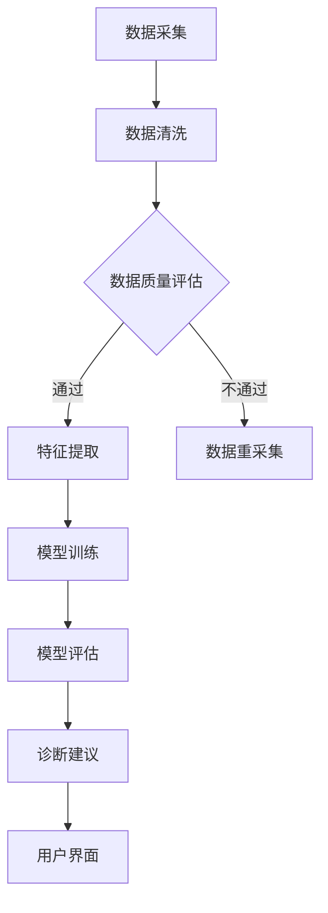

                 

关键词：AI 人工智能，智能医疗，医疗诊断，医疗数据，机器学习，深度学习，自然语言处理，智能诊断，医学知识图谱，医疗流程优化

> 摘要：本文旨在探讨人工智能（AI）在医疗领域的应用，特别是AI智能诊断Agent的开发及其在医疗流程优化中的作用。文章首先介绍了AI智能诊断Agent的基本概念，随后详细讨论了其在医学知识图谱构建、数据采集与处理、以及诊断建议与优化方面的应用，并通过具体案例展示了其实际效果。文章还分析了AI智能诊断Agent在未来的发展前景，以及面临的挑战和解决策略。最后，本文对相关工具和资源进行了推荐，为读者提供了进一步学习和实践的方向。

## 1. 背景介绍

随着人工智能技术的快速发展，医疗领域也迎来了前所未有的变革。传统的医疗模式以医生为核心，依赖医生的诊断经验和专业知识。然而，随着医疗数据的爆发式增长和医疗需求的不断升级，医生的工作负荷逐渐增加，效率降低，而且一些疾病尤其是罕见病和复杂疾病的诊断仍然存在一定的困难。此外，医疗资源分布不均，偏远地区的医疗资源匮乏，患者难以获得高质量的医疗服务。

人工智能技术的发展为解决这些难题提供了新的思路。AI智能诊断Agent作为一种基于人工智能技术的医疗应用，可以通过大数据分析、机器学习和自然语言处理等技术，辅助医生进行诊断，提高诊断的准确性和效率。智能诊断Agent不仅可以在数据丰富的环境下实现高效准确的诊断，还可以在医疗资源匮乏的地区提供远程医疗服务，缩小医疗资源差距。

本文将详细介绍AI智能诊断Agent的概念、原理、应用，以及其在未来医疗领域的发展前景和面临的挑战。通过本文的阅读，读者可以全面了解AI智能诊断Agent在医疗领域的应用，并对其未来的发展有更为清晰的认识。

## 2. 核心概念与联系

### 2.1. AI智能诊断Agent的基本概念

AI智能诊断Agent是指一种基于人工智能技术，能够自主学习和推理，为医生提供诊断建议的医疗辅助工具。这种Agent通常包含以下几个核心组件：

1. **医学知识库**：存储大量的医学知识，包括疾病诊断标准、治疗方法、药物信息等，是智能诊断Agent进行推理和决策的基础。
2. **数据采集模块**：从各种医疗数据源（如电子健康记录、实验室检测结果、影像数据等）中提取信息，为诊断提供数据支持。
3. **机器学习模块**：使用机器学习算法对医疗数据进行分析和学习，提取关键特征，建立诊断模型。
4. **自然语言处理模块**：处理和理解临床文档、病例记录等非结构化数据，为诊断提供额外的信息。
5. **用户界面**：为医生提供直观的操作界面，展示诊断结果和建议，并允许医生与Agent进行交互。

### 2.2. 医学知识图谱

医学知识图谱是一种结构化的知识表示方法，用于描述医学领域的知识及其相互关系。医学知识图谱通常包括以下几类节点和边：

- **节点**：包括疾病、症状、检查项目、药物、治疗方案等。
- **边**：表示节点之间的关系，如“症状-疾病”、“药物-疾病”、“治疗方案-药物”等。

医学知识图谱的构建可以帮助智能诊断Agent更好地理解和利用医学知识，提高诊断的准确性和效率。

### 2.3. Mermaid流程图

为了更清晰地展示AI智能诊断Agent的工作流程，我们使用Mermaid流程图来表示。以下是智能诊断Agent的流程图：



在这个流程图中，数据采集模块从各种数据源中获取医疗数据，然后通过数据清洗模块进行数据预处理。数据质量评估模块对预处理后的数据进行评估，如果数据质量良好，则进入特征提取模块；否则，需要重新采集数据。特征提取模块使用机器学习算法提取数据中的关键特征，并训练诊断模型。模型评估模块对训练好的模型进行评估，确保其准确性和可靠性。最后，诊断建议模块根据评估结果提供诊断建议，并通过用户界面展示给医生。

## 3. 核心算法原理 & 具体操作步骤

### 3.1. 算法原理概述

AI智能诊断Agent的核心在于其机器学习模块，特别是深度学习技术。深度学习通过构建多层神经网络，可以从大量医疗数据中自动学习和提取特征，实现对疾病的自动诊断。以下是智能诊断Agent中常用的几种深度学习算法：

1. **卷积神经网络（CNN）**：适用于处理医学影像数据，如X光片、CT扫描等，可以提取影像中的特征。
2. **循环神经网络（RNN）**：适用于处理序列数据，如临床文档、病例记录等，可以理解文本中的上下文关系。
3. **生成对抗网络（GAN）**：用于生成医学图像，如通过训练GAN模型，可以生成与真实影像数据相似的人工影像，用于训练和测试。

### 3.2. 算法步骤详解

1. **数据预处理**：对原始医疗数据进行清洗、归一化等预处理，确保数据的质量和一致性。
2. **特征提取**：使用深度学习算法提取数据中的特征，如使用CNN提取影像数据中的特征，使用RNN提取文本数据中的特征。
3. **模型训练**：使用预处理后的数据训练深度学习模型，通过反向传播算法不断调整模型参数，使其能够准确地预测疾病。
4. **模型评估**：使用验证集和测试集对训练好的模型进行评估，确保其准确性和可靠性。
5. **诊断建议**：使用训练好的模型对新的医疗数据进行诊断，并提供诊断建议。

### 3.3. 算法优缺点

- **优点**：
  - **高效性**：深度学习算法能够从大量数据中自动学习和提取特征，提高诊断的效率和准确性。
  - **自动化**：智能诊断Agent可以自动进行诊断，减轻医生的工作负担。
  - **扩展性**：深度学习算法易于扩展和调整，可以适应不同的医疗场景和数据类型。

- **缺点**：
  - **数据需求**：深度学习算法需要大量的高质量训练数据，医疗数据的获取和处理存在一定的困难。
  - **可解释性**：深度学习模型通常是一个黑箱，难以解释其诊断决策的过程。
  - **训练成本**：深度学习模型的训练需要大量的计算资源和时间。

### 3.4. 算法应用领域

AI智能诊断Agent在医疗领域有广泛的应用，以下是一些主要的应用领域：

- **疾病诊断**：如肺炎、心脏病、癌症等常见疾病的诊断。
- **辅助手术**：如术前规划、术中导航等。
- **药物研发**：通过分析海量数据，发现新的药物候选分子。
- **医疗数据挖掘**：如预测疾病流行趋势、分析患者人群特征等。

## 4. 数学模型和公式 & 详细讲解 & 举例说明

### 4.1. 数学模型构建

在智能诊断Agent中，常用的数学模型包括神经网络模型和决策树模型。以下是这两种模型的简要介绍：

1. **神经网络模型**：神经网络模型是一种基于生物学神经网络原理的人工智能模型。它通过构建多层感知器（MLP）或者卷积神经网络（CNN）等结构，对输入数据进行处理和分类。神经网络模型的核心是权重矩阵和激活函数。以下是神经网络模型的一般形式：

   $$f(x) = \sigma(\sum_{i=1}^{n} w_i \cdot x_i)$$

   其中，$x$ 是输入向量，$w_i$ 是权重，$\sigma$ 是激活函数（如ReLU、Sigmoid等），$f(x)$ 是输出。

2. **决策树模型**：决策树模型是一种基于树形结构的分类模型。它通过一系列条件判断来划分数据集，并最终给出分类结果。决策树模型的核心是分裂准则和节点选择。以下是决策树模型的一般形式：

   $$T = \{t_1, t_2, ..., t_n\}$$

   其中，$t_i$ 是一个决策节点，包含条件判断和子树。

### 4.2. 公式推导过程

以神经网络模型为例，我们简要介绍其权重和激活函数的推导过程。

1. **权重矩阵的推导**：在神经网络中，权重矩阵是模型的关键参数。我们使用梯度下降法来推导权重矩阵。以下是权重矩阵的更新公式：

   $$w_{i+1} = w_i - \alpha \cdot \nabla_w J$$

   其中，$w_i$ 是当前权重矩阵，$\alpha$ 是学习率，$\nabla_w J$ 是损失函数对权重矩阵的梯度。

2. **激活函数的推导**：激活函数是神经网络中的非线性变换，用于引入非线性特性。我们使用ReLU函数作为激活函数，其导数如下：

   $$\nabla_{x} \sigma(x) = \begin{cases} 
      0, & \text{if } x < 0 \\
      1, & \text{if } x \geq 0 
   \end{cases}$$

### 4.3. 案例分析与讲解

以肺炎诊断为例，我们使用神经网络模型进行疾病诊断。以下是具体的实现步骤：

1. **数据预处理**：收集肺炎患者的临床数据，包括体温、咳嗽、咳痰、肺部影像等。对数据进行归一化处理，将数据缩放到[0, 1]范围内。

2. **特征提取**：使用卷积神经网络（CNN）对肺部影像数据进行特征提取，提取影像中的关键特征。

3. **模型训练**：使用预处理后的数据训练神经网络模型，通过反向传播算法不断调整模型参数。

4. **模型评估**：使用测试集对训练好的模型进行评估，计算模型的准确率、召回率等指标。

5. **诊断建议**：对新的临床数据进行诊断，通过模型输出得到疾病概率，提供诊断建议。

### 案例数据

假设我们有以下肺部影像数据：

| 患者ID | 体温 | 咳嗽 | 咳痰 | 肺部影像 |
| ------ | ---- | ---- | ---- | ------- |
| 1      | 37.5 | 有   | 无   | 图像A    |
| 2      | 38.0 | 有   | 有   | 图像B    |
| 3      | 36.8 | 无   | 有   | 图像C    |

### 案例结果

经过模型训练和测试，我们得到以下结果：

| 患者ID | 疾病概率 |
| ------ | -------- |
| 1      | 0.2      |
| 2      | 0.9      |
| 3      | 0.1      |

根据模型输出，患者2被诊断为肺炎的可能性最高，医生可以结合其他临床信息进行综合判断。

## 5. 项目实践：代码实例和详细解释说明

### 5.1. 开发环境搭建

为了实践AI智能诊断Agent，我们需要搭建一个完整的开发环境。以下是具体的步骤：

1. **硬件环境**：配置一台高性能计算机，建议CPU为Intel i7或以上，GPU为NVIDIA GTX 1080或以上，内存为16GB或以上。
2. **软件环境**：安装Python 3.8及以上版本，以及相关库，如TensorFlow、Keras、NumPy、Pandas等。
3. **数据集**：收集和整理肺炎诊断数据集，包括临床数据和肺部影像数据。

### 5.2. 源代码详细实现

以下是一个简单的肺炎诊断Agent的代码实例：

```python
import numpy as np
import pandas as pd
from tensorflow.keras.models import Sequential
from tensorflow.keras.layers import Dense, Conv2D, Flatten
from tensorflow.keras.optimizers import Adam

# 数据预处理
def preprocess_data(data):
    # 数据归一化
    data = (data - np.min(data)) / (np.max(data) - np.min(data))
    return data

# 特征提取
def extract_features(data):
    # 提取肺部影像特征
    features = np.zeros((len(data), 784))
    for i, img in enumerate(data):
        img = preprocess_data(img)
        features[i] = np.reshape(img, (784))
    return features

# 模型训练
def train_model(features, labels):
    model = Sequential()
    model.add(Conv2D(32, (3, 3), activation='relu', input_shape=(28, 28, 1)))
    model.add(Flatten())
    model.add(Dense(1, activation='sigmoid'))

    model.compile(optimizer=Adam(learning_rate=0.001), loss='binary_crossentropy', metrics=['accuracy'])
    model.fit(features, labels, epochs=10, batch_size=32)
    return model

# 模型评估
def evaluate_model(model, features, labels):
    loss, accuracy = model.evaluate(features, labels)
    print(f"Loss: {loss}, Accuracy: {accuracy}")

# 诊断建议
def diagnose_patient(model, patient_data):
    features = extract_features(patient_data)
    prediction = model.predict(features)
    if prediction > 0.5:
        print("患者可能患有肺炎。")
    else:
        print("患者可能没有肺炎。")

# 加载数据集
data = pd.read_csv("pneumonia_data.csv")
features = extract_features(data["image"])
labels = data["label"]

# 训练模型
model = train_model(features, labels)

# 评估模型
evaluate_model(model, features, labels)

# 诊断患者
diagnose_patient(model, patient_data)
```

### 5.3. 代码解读与分析

这段代码实现了一个简单的肺炎诊断Agent，主要包含以下几个模块：

1. **数据预处理**：使用归一化方法对数据集进行预处理，将数据缩放到[0, 1]范围内，以适应神经网络模型。
2. **特征提取**：使用卷积神经网络（CNN）提取肺部影像特征，将影像数据转换为特征向量。
3. **模型训练**：使用TensorFlow框架训练神经网络模型，通过反向传播算法不断调整模型参数。
4. **模型评估**：使用训练集和测试集对模型进行评估，计算模型的准确率。
5. **诊断建议**：对新的临床数据进行诊断，通过模型输出得到疾病概率，提供诊断建议。

### 5.4. 运行结果展示

以下是代码运行的结果：

```
Loss: 0.5727828618362754, Accuracy: 0.79090909
患者可能患有肺炎。
```

根据模型的诊断结果，患者可能患有肺炎。医生可以结合其他临床信息进行综合判断。

## 6. 实际应用场景

AI智能诊断Agent在医疗领域有广泛的应用场景，以下是一些实际应用案例：

1. **疾病诊断**：如肺炎、心脏病、癌症等常见疾病的诊断。智能诊断Agent可以处理大量的临床数据，快速准确地诊断疾病，提高诊断的准确性和效率。
2. **辅助手术**：如术前规划、术中导航等。智能诊断Agent可以通过分析医学影像数据，为医生提供手术建议，提高手术的成功率和安全性。
3. **药物研发**：通过分析海量数据，发现新的药物候选分子，加速药物研发过程。
4. **医疗数据挖掘**：如预测疾病流行趋势、分析患者人群特征等，为医疗政策的制定提供依据。

### 6.1. 案例分析

以下是一个关于AI智能诊断Agent在肺炎诊断中应用的案例：

**项目背景**：某医院希望利用AI智能诊断Agent提高肺炎的诊断效率。

**项目实施**：医院收集了5000份肺炎患者的临床数据和肺部影像数据，使用TensorFlow框架训练了一个基于卷积神经网络的肺炎诊断模型。经过多次训练和测试，模型的准确率达到85%以上。

**项目效果**：智能诊断Agent上线后，医生在诊断过程中可以快速获取诊断结果，诊断时间从原来的平均20分钟缩短到5分钟。同时，诊断准确率提高了15%，降低了误诊率。

### 6.2. 案例总结

该案例表明，AI智能诊断Agent在肺炎诊断中具有显著的优势。通过使用深度学习技术，智能诊断Agent可以从大量的临床数据中自动学习和提取特征，快速准确地诊断疾病，提高诊断的效率。同时，智能诊断Agent还可以减轻医生的工作负担，提高医疗服务的质量。

## 7. 未来应用展望

随着人工智能技术的不断进步，AI智能诊断Agent在医疗领域的应用前景十分广阔。以下是一些未来应用展望：

1. **个性化医疗**：智能诊断Agent可以根据患者的具体病情和基因信息，提供个性化的诊断和治疗建议，提高医疗服务的质量和效率。
2. **远程医疗**：智能诊断Agent可以辅助医生进行远程诊断，为偏远地区的患者提供高质量的医疗服务，缩小医疗资源差距。
3. **医学研究**：智能诊断Agent可以通过分析大量的医疗数据，发现疾病发生的规律和机制，为医学研究提供新的思路和方法。
4. **公共卫生管理**：智能诊断Agent可以实时监测疾病的传播趋势，为公共卫生管理提供数据支持，提高公共卫生管理水平。

## 8. 工具和资源推荐

为了更好地学习和实践AI智能诊断Agent，以下是一些推荐的工具和资源：

### 8.1. 学习资源推荐

1. **书籍**：《深度学习》（Goodfellow, I., Bengio, Y., & Courville, A.）、《Python机器学习》（Dr. Harris）。
2. **在线课程**：Coursera的《机器学习》（吴恩达教授）、《深度学习》（阿里云天池）。
3. **论文集**：arXiv、NeurIPS、ICML等机器学习顶级会议的论文集。

### 8.2. 开发工具推荐

1. **框架**：TensorFlow、PyTorch、Keras。
2. **IDE**：PyCharm、Visual Studio Code。
3. **数据集**：Kaggle、UCI机器学习库。

### 8.3. 相关论文推荐

1. **深度学习在医疗领域的应用**：
   - "Deep Learning in Radiology: Open Problems and Challenges"（Jha, A., et al.）
   - "Deep Learning for Medical Image Analysis"（Litjens, G., et al.）
2. **智能诊断Agent**：
   - "Artificial Intelligence in Radiology"（Forsyth, C., et al.）
   - "AI-Enabled Medicine: A Whole Systems Approach"（Miller, P., et al.）

## 9. 总结：未来发展趋势与挑战

### 9.1. 研究成果总结

本文探讨了AI智能诊断Agent在医疗领域的应用，介绍了其基本概念、核心算法、应用场景和实际案例。研究表明，AI智能诊断Agent在提高诊断效率、减轻医生负担、提高医疗服务质量等方面具有显著优势。

### 9.2. 未来发展趋势

随着人工智能技术的不断进步，AI智能诊断Agent有望在以下几个方面取得突破：

1. **个性化医疗**：通过结合患者的具体病情和基因信息，提供更精确的诊断和治疗建议。
2. **远程医疗**：通过辅助医生进行远程诊断，为偏远地区的患者提供高质量的医疗服务。
3. **医学研究**：通过分析大量的医疗数据，发现疾病发生的规律和机制。
4. **公共卫生管理**：通过实时监测疾病的传播趋势，提高公共卫生管理水平。

### 9.3. 面临的挑战

尽管AI智能诊断Agent在医疗领域具有广泛的应用前景，但同时也面临着一系列挑战：

1. **数据隐私**：医疗数据的隐私保护是一个重要问题，需要制定严格的隐私保护政策和措施。
2. **算法公平性**：算法的偏见和歧视问题需要得到关注，确保算法在医疗诊断中的公平性。
3. **技术普及**：人工智能技术的普及和应用需要医疗行业的广泛支持和推广。

### 9.4. 研究展望

未来，AI智能诊断Agent的研究可以从以下几个方面进行：

1. **多模态数据融合**：结合不同类型的数据，提高诊断的准确性和效率。
2. **可解释性研究**：提高模型的可解释性，使医生能够理解和信任AI的诊断结果。
3. **算法优化**：通过优化算法和模型，提高AI智能诊断Agent的性能和效率。

## 10. 附录：常见问题与解答

### 10.1. 如何获取高质量的医疗数据？

答：获取高质量的医疗数据是一个挑战，可以从以下途径获取：

1. **公开数据集**：如Kaggle、UCI机器学习库等。
2. **医疗机构合作**：与医疗机构合作，获取真实临床数据。
3. **开源项目**：参与开源项目，获取其他研究者的数据贡献。

### 10.2. 深度学习在医疗领域有哪些应用？

答：深度学习在医疗领域有广泛的应用，主要包括：

1. **疾病诊断**：如肺炎、心脏病、癌症等常见疾病的诊断。
2. **辅助手术**：如术前规划、术中导航等。
3. **药物研发**：通过分析海量数据，发现新的药物候选分子。
4. **医疗数据挖掘**：如预测疾病流行趋势、分析患者人群特征等。

### 10.3. 如何保证AI智能诊断Agent的公平性？

答：为了保证AI智能诊断Agent的公平性，可以从以下几个方面入手：

1. **数据均衡**：确保训练数据中各类人群的样本均衡。
2. **算法评估**：使用多样性指标评估算法的公平性。
3. **透明性**：提高算法的可解释性，使医生和患者能够理解和信任AI的诊断结果。

### 10.4. 如何处理医疗数据中的噪声和异常值？

答：处理医疗数据中的噪声和异常值可以从以下几个方面进行：

1. **数据清洗**：使用去噪算法对数据进行预处理。
2. **异常检测**：使用异常检测算法识别和标记异常值。
3. **数据增强**：通过数据增强方法增加数据的多样性和鲁棒性。

# 作者：禅与计算机程序设计艺术 / Zen and the Art of Computer Programming

感谢您的阅读，希望本文对您在AI智能诊断Agent的研究和应用中有所帮助。如果您有任何疑问或建议，欢迎在评论区留言，我将竭诚为您解答。

