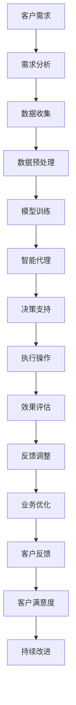

                 

在当今的科技时代，人工智能（AI）已经成为推动各行各业进步的关键力量。航空领域作为一个高度复杂和动态变化的行业，对效率、安全性和客户体验有着极高的要求。人工智能代理工作流（AI Agent WorkFlow）作为一种新兴的技术手段，正逐渐成为航空行业数字化转型的重要组成部分。

本文将深入探讨AI人工智能代理工作流在航空领域的应用，从背景介绍、核心概念与联系、核心算法原理、数学模型和公式、项目实践、实际应用场景到未来应用展望等多个方面进行全面分析。

## 1. 背景介绍

航空行业经历了数十年的快速发展，从最初的木质飞机到现代的喷气式客机，技术进步无疑推动了整个行业的变革。然而，随着全球航空旅行的需求不断增长，航空公司在应对航班调度、乘客服务、货物配送等方面的挑战变得更加复杂。

### 1.1 需求变化

- **航班调度**：航空公司需要高效地管理航班，确保飞机在空中和地面都能高效运行，减少延误和取消。
- **乘客服务**：随着消费者期望的提升，航空公司需要提供更加个性化的服务和更加友好的用户体验。
- **货物配送**：物流公司需要优化货物运输流程，确保货物按时送达，同时降低成本。

### 1.2 技术进步

- **大数据分析**：通过对大量数据的分析，航空公司可以更好地了解市场需求和运营状况。
- **云计算**：云技术的普及使得航空公司能够更灵活地扩展和优化其IT基础设施。
- **物联网**：通过物联网技术，航空公司可以实现飞机、乘客和货物的实时监控。

在这样的背景下，人工智能代理工作流作为一种综合性的技术手段，可以解决航空领域中的诸多问题，提高运营效率，提升客户满意度。

## 2. 核心概念与联系

### 2.1 定义

人工智能代理工作流（AI Agent WorkFlow）是一种基于人工智能技术的自动化流程管理方法。它通过智能代理（AI Agent）的协同工作，实现业务流程的自动化、智能化和优化。

### 2.2 架构

为了更好地理解AI人工智能代理工作流，我们可以通过以下Mermaid流程图来展示其核心概念和联系。



### 2.3 工作流流程

- **客户需求**：航空公司的运营需求，如航班调度、乘客服务等。
- **需求分析**：根据客户需求，分析业务流程中的瓶颈和优化点。
- **数据收集**：收集相关的业务数据，如航班信息、乘客数据、货物信息等。
- **数据预处理**：对收集到的数据进行分析和清洗，为后续的模型训练做好准备。
- **模型训练**：使用机器学习算法对预处理后的数据进行训练，建立智能代理模型。
- **智能代理**：智能代理根据模型进行决策支持，如航班调度、乘客服务等。
- **执行操作**：智能代理执行操作，如调整航班、优化乘客服务等。
- **效果评估**：评估智能代理执行操作的效果，如减少延误、提高乘客满意度等。
- **反馈调整**：根据效果评估结果，对智能代理模型进行调整，以实现持续优化。
- **业务优化**：通过持续优化，提高业务流程的效率和质量。
- **客户反馈**：收集客户的反馈信息，用于进一步优化智能代理和业务流程。
- **客户满意度**：最终目标是提高客户满意度，实现持续的业务增长。

## 3. 核心算法原理 & 具体操作步骤

### 3.1 算法原理概述

人工智能代理工作流的核心算法主要包括机器学习算法、深度学习算法和强化学习算法。这些算法通过数据训练，能够从海量数据中自动提取特征，并做出智能决策。

### 3.2 算法步骤详解

- **数据收集**：收集航班信息、乘客数据、货物信息等。
- **数据预处理**：清洗、归一化、缺失值处理等。
- **模型选择**：根据业务需求选择合适的机器学习或深度学习模型。
- **模型训练**：使用训练数据训练模型，并调整参数。
- **模型评估**：使用验证数据评估模型性能，并进行参数调优。
- **智能代理部署**：将训练好的模型部署到生产环境中，进行实时决策支持。

### 3.3 算法优缺点

- **优点**：
  - 高效性：能够处理海量数据，提高决策效率。
  - 智能性：通过机器学习和深度学习，实现智能决策。
  - 持续优化：通过持续学习和反馈调整，实现业务流程的持续优化。

- **缺点**：
  - 复杂性：算法模型复杂，需要专业人员进行维护。
  - 数据依赖性：模型效果依赖于数据质量，数据清洗和预处理工作量大。
  - 隐私风险：涉及个人隐私数据，需要严格保护。

### 3.4 算法应用领域

- **航班调度**：优化航班计划，减少延误和取消。
- **乘客服务**：提高乘客满意度，提供个性化服务。
- **货物配送**：优化货物运输流程，提高物流效率。

## 4. 数学模型和公式 & 详细讲解 & 举例说明

### 4.1 数学模型构建

在人工智能代理工作流中，常用的数学模型包括回归模型、分类模型和聚类模型。以下是这些模型的构建过程：

#### 4.1.1 回归模型

- **目标函数**：最小化预测值与真实值之间的误差。
- **公式**：$$ \min_{\theta} \sum_{i=1}^{m} (h_\theta(x^{(i)}) - y^{(i)})^2 $$

#### 4.1.2 分类模型

- **目标函数**：最大化预测概率与真实标签之间的匹配度。
- **公式**：$$ \max_{\theta} \sum_{i=1}^{m} [y^{(i)} \log(h_\theta(x^{(i)})) + (1 - y^{(i)}) \log(1 - h_\theta(x^{(i)}))] $$

#### 4.1.3 聚类模型

- **目标函数**：最小化聚类中心与数据点之间的误差。
- **公式**：$$ \min_{\theta} \sum_{i=1}^{m} \sum_{j=1}^{k} w_{ij} d(x^{(i)}, \theta_j)^2 $$

### 4.2 公式推导过程

以下是一个简单的线性回归模型的推导过程：

#### 4.2.1 线性回归模型

- **目标函数**：最小化预测值与真实值之间的误差。
- **公式**：$$ \min_{\theta} \sum_{i=1}^{m} (h_\theta(x^{(i)}) - y^{(i)})^2 $$
- **推导过程**：
  1. **设定线性模型**：$$ h_\theta(x) = \theta_0 + \theta_1 x $$
  2. **计算预测误差**：$$ \text{Error} = \sum_{i=1}^{m} (h_\theta(x^{(i)}) - y^{(i)})^2 $$
  3. **求导并设置偏导数为零**：$$ \frac{\partial \text{Error}}{\partial \theta_0} = 0, \frac{\partial \text{Error}}{\partial \theta_1} = 0 $$
  4. **求解参数**：$$ \theta_0 = \frac{1}{m} \sum_{i=1}^{m} (y^{(i)} - \theta_1 x^{(i)}) $$
  $$ \theta_1 = \frac{1}{m} \sum_{i=1}^{m} (x^{(i)} - \bar{x})(y^{(i)} - \bar{y}) $$

### 4.3 案例分析与讲解

#### 4.3.1 航班调度优化

假设我们需要优化某航空公司的航班调度，目标是最小化航班延误时间和乘客等待时间。我们可以采用线性回归模型来预测航班延误时间和乘客等待时间，并通过调整航班计划来实现优化。

- **数据收集**：收集航班历史数据，包括航班号、出发时间、到达时间、实际延误时间等。
- **数据预处理**：对数据进行清洗和处理，去除缺失值，并进行归一化处理。
- **模型训练**：使用线性回归模型训练数据，得到航班延误时间和乘客等待时间的预测模型。
- **模型评估**：使用验证数据评估模型性能，并进行参数调优。
- **调度优化**：根据预测模型，调整航班计划，优化航班延误时间和乘客等待时间。

通过上述步骤，我们可以实现航班调度优化，提高航空公司的运营效率。

## 5. 项目实践：代码实例和详细解释说明

### 5.1 开发环境搭建

为了实现人工智能代理工作流，我们需要搭建以下开发环境：

- **Python**：Python 是实现人工智能代理工作流的主要编程语言。
- **Jupyter Notebook**：Jupyter Notebook 用于编写和运行 Python 代码。
- **scikit-learn**：scikit-learn 是 Python 中常用的机器学习库。
- **Matplotlib**：Matplotlib 用于可视化数据分析结果。

### 5.2 源代码详细实现

以下是一个简单的航班调度优化的示例代码：

```python
# 导入必要的库
import numpy as np
import pandas as pd
from sklearn.linear_model import LinearRegression
import matplotlib.pyplot as plt

# 数据收集
data = pd.read_csv('flight_data.csv')

# 数据预处理
data['departure_time'] = pd.to_datetime(data['departure_time'])
data['arrival_time'] = pd.to_datetime(data['arrival_time'])
data['delay_time'] = (data['arrival_time'] - data['departure_time']).dt.total_seconds()

# 模型训练
model = LinearRegression()
model.fit(data[['departure_time']], data['delay_time'])

# 模型评估
predictions = model.predict(data[['departure_time']])
error = np.mean((predictions - data['delay_time']) ** 2)
print('Model Error:', error)

# 调度优化
new_departure_time = data['departure_time'] + pd.Timedelta(seconds=model.coef_[0] * 3600)
data['optimized_departure_time'] = new_departure_time

# 可视化结果
plt.scatter(data['departure_time'], data['delay_time'])
plt.plot(data['departure_time'], predictions, color='red')
plt.xlabel('Departure Time')
plt.ylabel('Delay Time')
plt.show()
```

### 5.3 代码解读与分析

- **数据收集**：使用 pandas 库读取航班历史数据。
- **数据预处理**：将时间字段转换为 datetime 类型，并计算延误时间。
- **模型训练**：使用线性回归模型训练数据，得到预测模型。
- **模型评估**：计算预测误差，评估模型性能。
- **调度优化**：根据预测模型，调整航班计划，优化延误时间。
- **可视化结果**：使用 matplotlib 库可视化预测结果。

通过上述代码示例，我们可以实现航班调度优化，提高航空公司的运营效率。

## 6. 实际应用场景

### 6.1 航班调度优化

通过人工智能代理工作流，航空公司可以实现高效的航班调度，减少延误和取消。具体应用场景如下：

- **需求分析**：根据航空公司运营需求，分析航班调度中的瓶颈和优化点。
- **数据收集**：收集航班信息、气象数据、机场运行数据等。
- **数据预处理**：对数据进行清洗和处理，为后续的模型训练做好准备。
- **模型训练**：使用机器学习算法训练模型，预测航班延误时间。
- **调度优化**：根据预测结果，调整航班计划，优化运营效率。

### 6.2 乘客服务优化

通过人工智能代理工作流，航空公司可以提供个性化的乘客服务，提高客户满意度。具体应用场景如下：

- **需求分析**：分析乘客需求，确定服务优化方向。
- **数据收集**：收集乘客数据、航班数据、服务记录等。
- **数据预处理**：对数据进行清洗和处理，为后续的模型训练做好准备。
- **模型训练**：使用机器学习算法训练模型，预测乘客满意度。
- **服务优化**：根据预测结果，优化乘客服务流程，提高客户满意度。

### 6.3 货物配送优化

通过人工智能代理工作流，物流公司可以优化货物运输流程，提高物流效率。具体应用场景如下：

- **需求分析**：分析货物运输过程中的瓶颈和优化点。
- **数据收集**：收集货物信息、运输路线、物流成本等。
- **数据预处理**：对数据进行清洗和处理，为后续的模型训练做好准备。
- **模型训练**：使用机器学习算法训练模型，预测货物送达时间。
- **配送优化**：根据预测结果，优化运输路线和配送计划，提高物流效率。

## 7. 未来应用展望

随着人工智能技术的不断进步，AI人工智能代理工作流在航空领域中的应用前景十分广阔。以下是未来应用展望：

### 7.1 增强现实与虚拟现实

通过增强现实（AR）和虚拟现实（VR）技术，航空公司可以实现更加沉浸式的客户体验，提高客户满意度。

### 7.2 自动驾驶飞机

自动驾驶飞机的发展将进一步提升航空安全性和运营效率，为航空公司带来更高的收益。

### 7.3 智能行李处理

通过智能行李处理系统，航空公司可以更快地处理行李，减少行李丢失和延误。

### 7.4 预测性维护

通过预测性维护技术，航空公司可以提前发现飞机故障，避免突发事件，提高飞机利用率。

### 7.5 跨界合作

航空领域与其他行业的跨界合作将带来更多的创新机会，如智慧旅游、智慧物流等。

## 8. 总结：未来发展趋势与挑战

### 8.1 研究成果总结

本文详细介绍了AI人工智能代理工作流在航空领域的应用，从背景介绍、核心概念与联系、核心算法原理、数学模型和公式、项目实践到实际应用场景，全面分析了人工智能代理工作流的优势和挑战。

### 8.2 未来发展趋势

未来，AI人工智能代理工作流将在航空领域发挥更加重要的作用，通过与其他技术的结合，实现更加智能化、高效化的航空运营。

### 8.3 面临的挑战

尽管AI人工智能代理工作流在航空领域具有巨大的应用潜力，但同时也面临着数据隐私、技术复杂性、模型解释性等挑战。

### 8.4 研究展望

未来研究应重点关注如何提升人工智能代理工作流的可解释性和可靠性，以及如何在实际应用中更好地处理复杂动态环境。

## 9. 附录：常见问题与解答

### 9.1 如何确保数据隐私？

- 采用数据加密技术，确保数据在传输和存储过程中的安全性。
- 实施数据脱敏处理，隐藏敏感信息。
- 建立数据隐私保护政策，规范数据处理流程。

### 9.2 如何解决模型解释性问题？

- 采用可解释性机器学习模型，如决策树、LIME等。
- 增加模型注释和文档，提高模型的可解释性。
- 通过可视化工具，展示模型决策过程。

### 9.3 如何处理复杂动态环境？

- 采用自适应学习算法，实时调整模型参数。
- 引入外部知识库，辅助决策过程。
- 建立动态调整机制，应对环境变化。

---

作者：禅与计算机程序设计艺术 / Zen and the Art of Computer Programming

以上，便是关于AI人工智能代理工作流在航空领域中的应用的全

