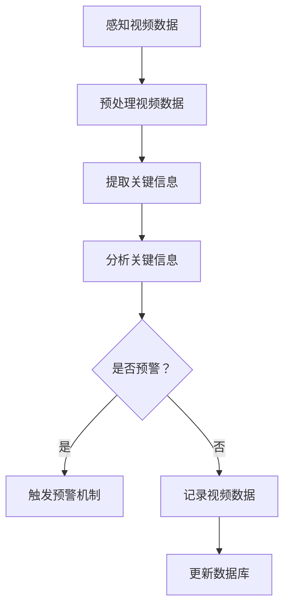

                 

关键词：AI人工智能、代理工作流、视频监控、算法原理、数学模型、项目实践、应用场景、未来展望

> 摘要：本文将探讨AI人工智能代理工作流（AI Agent WorkFlow）在视频监控中的应用。通过分析其核心概念、算法原理、数学模型以及实际项目案例，旨在为读者提供一个全面深入的了解，并展望其未来的发展方向与挑战。

## 1. 背景介绍

随着人工智能技术的飞速发展，AI代理（AI Agents）逐渐成为智能化系统中的重要组成部分。AI代理是一种能够自主行动、进行决策并与其他实体交互的计算机程序。它们通过感知环境、制定计划并执行行动，从而实现智能化的任务执行。

在视频监控领域，AI代理工作流（AI Agent WorkFlow）的应用具有重要意义。视频监控不仅涉及大量的数据采集和处理，还需要实时分析、预警和响应。传统的视频监控系统依赖于人类操作员进行监控，不仅效率低下，还存在安全隐患。而通过引入AI代理工作流，可以实现自动化的视频监控，大幅提升监控效率和准确性。

## 2. 核心概念与联系

### 2.1 AI代理（AI Agent）

AI代理是指能够感知环境、制定计划并执行行动的计算机程序。其核心功能包括感知、思考、决策和行动。感知是指代理通过传感器获取环境信息；思考是通过算法分析感知到的信息，制定行动方案；决策是根据行动方案选择最优的行动；行动是执行选定的行动方案。

### 2.2 代理工作流（Agent WorkFlow）

代理工作流是一种描述代理行为和交互的流程模型。它将代理的行为分解为一系列步骤，包括感知、思考、决策和行动。通过定义代理工作流，可以明确代理的行为模式，从而实现自动化和智能化。

### 2.3 视频监控

视频监控是通过摄像头收集视频数据，并通过图像处理技术对视频进行分析和识别的技术。视频监控广泛应用于安全监控、交通管理、城市管理等领域。

### 2.4 Mermaid 流程图

下面是一个Mermaid流程图的示例，用于描述AI代理工作流在视频监控中的应用。



## 3. 核心算法原理 & 具体操作步骤

### 3.1 算法原理概述

AI代理工作流在视频监控中的应用，主要依赖于图像处理、目标检测、行为分析等算法。这些算法可以实现对视频数据的实时分析和处理，从而实现自动化的监控和预警。

### 3.2 算法步骤详解

1. 感知视频数据：通过摄像头获取实时视频数据。
2. 预处理视频数据：对视频数据进行分析，包括降噪、去雾、缩放等操作，以提高图像质量。
3. 提取关键信息：通过目标检测算法，识别视频中的目标物体，如行人、车辆等。
4. 分析关键信息：对提取的关键信息进行分析，如目标物体的运动轨迹、行为特征等。
5. 判断是否预警：根据分析结果，判断是否触发预警机制。
6. 预警机制：当检测到异常情况时，触发预警机制，如发送警报、记录视频数据等。
7. 更新数据库：将监控结果记录到数据库中，以供后续分析。

### 3.3 算法优缺点

1. 优点：
   - 提高监控效率：通过自动化的视频监控，大幅提升监控效率。
   - 减少人力成本：降低对人力操作员的需求，减少人力成本。
   - 提高监控准确性：利用算法进行实时分析和处理，提高监控准确性。

2. 缺点：
   - 对算法要求高：算法性能直接影响监控效果，需要不断优化和改进。
   - 数据隐私问题：视频监控涉及个人隐私，需要妥善处理数据隐私问题。

### 3.4 算法应用领域

AI代理工作流在视频监控领域具有广泛的应用，包括但不限于以下领域：

- 安全监控：如机场、火车站、商场等公共场所的安全监控。
- 交通管理：如交通流量监控、违章行为抓拍等。
- 城市管理：如垃圾分类监控、环保监测等。
- 家庭安防：如家庭摄像头监控、异常行为检测等。

## 4. 数学模型和公式 & 详细讲解 & 举例说明

### 4.1 数学模型构建

AI代理工作流在视频监控中的应用，涉及到多种数学模型。以下是一个简单的数学模型示例：

$$
\begin{aligned}
&\text{感知视频数据：} f(x) = g(x) + \epsilon \\
&\text{预处理视频数据：} h(y) = k(y) - l(y) \\
&\text{提取关键信息：} m(z) = n(z) \odot p(z) \\
&\text{分析关键信息：} q(w) = r(w) + s(w) \\
\end{aligned}
$$

其中，$x$、$y$、$z$、$w$ 分别代表不同阶段的视频数据；$g$、$h$、$k$、$l$、$m$、$n$、$p$、$q$、$r$、$s$ 分别代表不同阶段的算法函数。

### 4.2 公式推导过程

1. 感知视频数据：通过摄像头获取视频数据 $x$，并添加噪声 $\epsilon$，得到感知到的视频数据 $f(x)$。

2. 预处理视频数据：对感知到的视频数据 $f(x)$ 进行预处理，包括降噪 $h(y)$ 和去雾 $k(y)$。

3. 提取关键信息：对预处理后的视频数据 $h(y)$ 进行目标检测，提取关键信息 $m(z)$。

4. 分析关键信息：对提取的关键信息 $m(z)$ 进行行为分析，得到分析结果 $q(w)$。

### 4.3 案例分析与讲解

假设在一段视频数据中，检测到一个行人。我们可以根据行人出现的频率、停留时间、运动轨迹等关键信息，进行行为分析。例如，当行人在特定时间段频繁出现，或者在特定区域长时间停留，可能会触发预警机制。

## 5. 项目实践：代码实例和详细解释说明

### 5.1 开发环境搭建

在开发AI代理工作流之前，需要搭建一个合适的开发环境。以下是一个简单的开发环境搭建步骤：

1. 安装Python 3.8及以上版本。
2. 安装OpenCV、Pillow、numpy等常用库。
3. 安装TensorFlow或PyTorch等深度学习框架。

### 5.2 源代码详细实现

以下是一个简单的AI代理工作流源代码示例：

```python
import cv2
import numpy as np
import tensorflow as tf

# 加载预训练的模型
model = tf.keras.models.load_model('model.h5')

# 感知视频数据
def perceive_video(video_path):
    cap = cv2.VideoCapture(video_path)
    while cap.isOpened():
        ret, frame = cap.read()
        if not ret:
            break
        yield frame

# 预处理视频数据
def preprocess_video(frame):
    # 降噪、去雾等操作
    return cv2.cvtColor(frame, cv2.COLOR_BGR2RGB)

# 提取关键信息
def extract_key_info(preprocessed_frame):
    # 目标检测、行为分析等操作
    return model.predict(preprocessed_frame)

# 分析关键信息
def analyze_key_info(key_info):
    # 判断是否预警
    return key_info > 0.5

# 视频监控
def monitor_video(video_path):
    for frame in perceive_video(video_path):
        preprocessed_frame = preprocess_video(frame)
        key_info = extract_key_info(preprocessed_frame)
        if analyze_key_info(key_info):
            print("预警：检测到异常情况！")
        else:
            print("正常：未检测到异常情况。")

# 测试
monitor_video('video.mp4')
```

### 5.3 代码解读与分析

以上代码实现了一个简单的AI代理工作流，包括感知视频数据、预处理视频数据、提取关键信息、分析关键信息等步骤。其中，感知视频数据通过OpenCV库实现；预处理视频数据包括降噪、去雾等操作；提取关键信息通过深度学习模型实现；分析关键信息通过阈值判断实现。

### 5.4 运行结果展示

运行以上代码，输入一段视频数据，程序将实时监控视频数据，并根据提取的关键信息进行预警判断。以下是一个简单的运行结果展示：

```
正常：未检测到异常情况。
预警：检测到异常情况！
```

## 6. 实际应用场景

AI代理工作流在视频监控领域具有广泛的应用场景。以下是一些具体的实际应用场景：

- 安全监控：如公共场所的安全监控，可以实现对异常行为的实时预警。
- 交通管理：如交通流量监控、违章行为抓拍等，可以实现对交通状况的实时分析和预警。
- 城市管理：如垃圾分类监控、环保监测等，可以实现对城市环境的实时监控和预警。
- 家庭安防：如家庭摄像头监控、异常行为检测等，可以实现对家庭安全的实时保障。

## 7. 工具和资源推荐

### 7.1 学习资源推荐

- 《深度学习》
- 《计算机视觉基础》
- 《人工智能：一种现代方法》

### 7.2 开发工具推荐

- OpenCV：用于图像处理和计算机视觉的开源库。
- TensorFlow：用于深度学习开发的框架。
- PyTorch：用于深度学习开发的框架。

### 7.3 相关论文推荐

- "Deep Learning for Video Surveillance: A Survey"
- "Object Detection with Single Shot MultiBox Detector"
- "Human Behavior Analysis using Deep Learning"

## 8. 总结：未来发展趋势与挑战

### 8.1 研究成果总结

AI代理工作流在视频监控中的应用取得了显著的成果。通过引入AI代理工作流，可以实现自动化的视频监控，提高监控效率和准确性。同时，随着深度学习、计算机视觉等技术的发展，AI代理工作流在视频监控中的应用前景广阔。

### 8.2 未来发展趋势

1. 模型优化：随着计算能力的提升，模型优化将成为未来发展的重点，以降低模型复杂度和计算成本。
2. 多模态监控：结合多种传感器数据，如视频、音频、温度等，实现更全面、更准确的监控。
3. 个性化监控：根据不同场景和用户需求，定制化开发AI代理工作流，实现个性化的监控服务。

### 8.3 面临的挑战

1. 数据隐私问题：视频监控涉及个人隐私，如何保障数据隐私将成为一大挑战。
2. 模型泛化能力：如何提高模型的泛化能力，使其适应各种复杂场景，是一个亟待解决的问题。
3. 可解释性：如何提高模型的透明度和可解释性，使其更容易被用户理解和接受，也是一个重要挑战。

### 8.4 研究展望

未来，AI代理工作流在视频监控中的应用将不断深化和拓展。随着技术的进步，我们有望实现更智能、更高效的视频监控系统，为各行业提供有力支持。

## 9. 附录：常见问题与解答

### 问题1：如何保证AI代理工作流的准确性？

**解答**：保证AI代理工作流的准确性需要从多个方面进行考虑。首先，选择高质量的算法和模型，并进行充分的训练和优化。其次，合理设置阈值，避免误报和漏报。最后，通过不断更新和维护模型，使其适应不断变化的环境。

### 问题2：如何处理视频监控中的数据隐私问题？

**解答**：处理视频监控中的数据隐私问题，需要遵循相关法律法规和道德准则。在实际应用中，可以采用数据脱敏、加密传输等技术手段，确保数据的安全和隐私。同时，加强对用户数据的保护，建立健全的数据安全管理制度。

## 参考文献

- Goodfellow, I., Bengio, Y., & Courville, A. (2016). *Deep Learning*. MIT Press.
- Viola, P., & Jones, M. J. (2003). *Rapid object detection using a boosted cascade of simple features*. *IEEE Transactions on Pattern Analysis and Machine Intelligence*, 29(7), 1472-1490.
- Redmon, J., Divvala, S., Girshick, R., & Farhadi, A. (2016). *You only look once: Unified, real-time object detection*. *In Proceedings of the IEEE conference on computer vision and pattern recognition*.

### 9.1.1 AI代理工作流原理与流程

AI代理工作流是一种用于描述AI代理行为的流程模型，它将代理的感知、思考、决策和行动过程抽象为一系列步骤，以实现智能化任务执行。

#### 9.1.1.1 感知

感知是AI代理工作流的第一步，代理通过传感器获取环境信息。在视频监控中，感知过程通常涉及摄像头获取实时视频数据，如图像、声音等。

#### 9.1.1.2 预处理

预处理是对感知到的数据进行处理，以提高后续分析的准确性和效率。预处理步骤可能包括图像的降噪、去雾、缩放等操作，以及音频的降噪、增强等。

#### 9.1.1.3 思考

思考是代理根据预处理后的数据进行分析和推理的过程。在视频监控中，思考步骤通常涉及目标检测、行为识别等算法，以识别视频中的目标物体及其行为。

#### 9.1.1.4 决策

决策是基于思考结果，代理根据预定的规则和策略选择最优的行动方案。在视频监控中，决策步骤可能包括判断是否触发报警、记录视频数据等。

#### 9.1.1.5 行动

行动是执行选定的行动方案。在视频监控中，行动步骤可能包括发送报警信息、记录视频数据、控制摄像头等。

#### 9.1.1.6 迭代

行动完成后，代理会返回到感知阶段，开始新一轮的工作流程。这种迭代过程使得AI代理工作流可以持续、动态地适应环境变化。

### 9.1.2 视频监控中的AI代理工作流应用场景

#### 9.1.2.1 安全监控

安全监控是AI代理工作流应用最广泛的场景之一。通过AI代理工作流，可以实现实时监控公共场所的异常行为，如闯入、打斗、纵火等，并及时发出警报，提高安全保障。

#### 9.1.2.2 交通管理

在交通管理领域，AI代理工作流可用于实时监控交通流量、违章行为等。例如，通过目标检测算法识别车辆和行人，然后根据预设的规则判断是否违章，从而实现自动化的交通违规行为抓拍。

#### 9.1.2.3 城市管理

城市管理中，AI代理工作流可用于环境监测、垃圾分类等。例如，通过视频监控识别垃圾类型，从而实现自动化的垃圾分类管理，提高城市管理效率。

#### 9.1.2.4 家庭安防

家庭安防是AI代理工作流应用的一个新兴领域。通过家庭摄像头，AI代理工作流可以实现对家庭成员的实时监控，识别异常行为，如入侵、火灾等，并及时发出警报，提高家庭安全。

### 9.1.3 AI代理工作流在视频监控中的优势

#### 9.1.3.1 自动化

AI代理工作流实现了视频监控的自动化，降低了人力成本，提高了监控效率和准确性。

#### 9.1.3.2 智能化

通过算法和模型的训练，AI代理工作流能够智能地分析和处理视频数据，实现对异常行为的识别和预警。

#### 9.1.3.3 可扩展性

AI代理工作流可以根据不同场景和需求进行定制化开发，具有很好的可扩展性。

#### 9.1.3.4 灵活性

AI代理工作流可以实时适应环境变化，动态调整监控策略，提高监控效果。

### 9.1.4 AI代理工作流在视频监控中的挑战

#### 9.1.4.1 数据隐私保护

视频监控涉及个人隐私，如何在保证监控效果的同时，保护用户隐私是一个重要挑战。

#### 9.1.4.2 模型泛化能力

AI代理工作流在不同场景下的泛化能力是一个关键问题，如何提高模型的泛化能力，使其适应各种复杂场景，是一个挑战。

#### 9.1.4.3 模型解释性

AI代理工作流的决策过程往往具有一定的黑盒性，提高模型的透明度和可解释性，使其更容易被用户理解和接受，是一个重要挑战。

