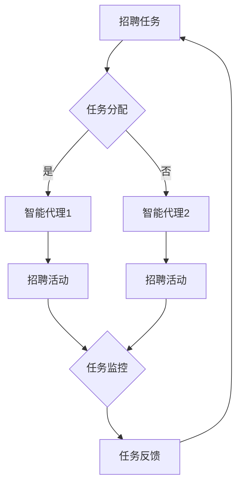

                 

关键词：人工智能，智能代理，人力资源管理系统，工作流，自动化

摘要：随着人工智能技术的不断发展，智能代理作为一种重要的AI应用模式，正在逐渐渗透到各个行业领域。本文将探讨智能代理在人力资源管理系统中的应用，介绍AI Agent WorkFlow的核心概念、算法原理、数学模型以及实际应用场景，为人力资源管理系统的智能化升级提供新的思路和方法。

## 1. 背景介绍

人力资源管理系统作为企业管理的核心组成部分，负责员工的招聘、培训、绩效评估、薪酬管理等工作。然而，随着企业规模的扩大和业务复杂度的增加，人力资源管理系统的负担日益加重。传统的基于规则的人工管理方式已经无法满足高效、精准的需求。因此，如何将人工智能技术引入人力资源管理系统，实现工作流程的智能化和自动化，成为当前研究的热点。

智能代理（AI Agent）是一种能够自主执行任务、与环境进行交互并做出决策的计算机程序。它具有自主性、适应性、社会性等特点，能够在复杂多变的环境中有效地完成任务。智能代理在人力资源管理系统中，可以扮演招聘助手、培训顾问、绩效评估员等多种角色，实现工作流程的自动化和智能化。

## 2. 核心概念与联系

### 2.1 智能代理（AI Agent）

智能代理是一种具有感知、推理、学习、自主行动等能力的计算机程序。它能够通过感知外部环境信息，利用知识库和算法进行推理和学习，然后自主地采取行动。智能代理通常由感知器、知识库、推理机、行动器等组成。

### 2.2 工作流（Workflow）

工作流是一种用于定义、执行和管理业务流程的计算机应用程序。它将业务流程分解为一系列的任务和活动，并规定任务之间的执行顺序和依赖关系。工作流可以用于人力资源管理系统中的招聘、培训、绩效评估等环节，实现业务流程的自动化。

### 2.3 智能代理工作流（AI Agent WorkFlow）

智能代理工作流是将智能代理应用于工作流管理中的一种新型工作流模式。它通过将智能代理集成到工作流中，实现工作流程的自动化和智能化。智能代理工作流的核心概念包括任务分配、任务执行、任务监控和任务反馈。

### 2.4 Mermaid 流程图

为了更好地理解智能代理工作流的架构，我们使用Mermaid流程图来描述其核心流程节点。



## 3. 核心算法原理 & 具体操作步骤

### 3.1 算法原理概述

智能代理工作流的核心算法包括任务分配算法、任务执行算法和任务反馈算法。

- **任务分配算法**：根据任务的类型和智能代理的能力，将任务分配给合适的智能代理。
- **任务执行算法**：智能代理根据任务要求和自身能力，执行任务并产生结果。
- **任务反馈算法**：智能代理将任务执行结果反馈给任务分配系统，用于后续任务的调整和优化。

### 3.2 算法步骤详解

1. **任务分配**：系统根据任务类型和智能代理能力，选择合适的智能代理执行任务。
2. **任务执行**：智能代理根据任务要求，利用自身的能力和知识库，执行任务并生成结果。
3. **任务监控**：系统对任务执行过程进行实时监控，确保任务按时完成。
4. **任务反馈**：智能代理将任务执行结果反馈给系统，系统根据反馈结果进行任务调整和优化。

### 3.3 算法优缺点

- **优点**：智能代理工作流能够实现工作流程的自动化和智能化，提高工作效率，降低人力成本。
- **缺点**：智能代理工作流需要大量的训练数据和计算资源，且对任务的执行结果存在一定的不确定性。

### 3.4 算法应用领域

智能代理工作流可以应用于人力资源管理系统中的多个环节，如招聘、培训、绩效评估等。它可以有效地提高人力资源管理的效率和准确性，为企业提供更加智能化的管理服务。

## 4. 数学模型和公式 & 详细讲解 & 举例说明

### 4.1 数学模型构建

智能代理工作流中的数学模型主要包括任务分配模型、任务执行模型和任务反馈模型。

- **任务分配模型**：基于任务类型和智能代理能力，构建一个优化模型，以分配最合适的智能代理执行任务。
- **任务执行模型**：基于智能代理的能力和知识库，构建一个任务执行模型，以模拟智能代理执行任务的过程。
- **任务反馈模型**：基于任务执行结果和任务分配模型，构建一个反馈模型，以优化任务分配策略。

### 4.2 公式推导过程

我们以任务分配模型为例，介绍数学公式的推导过程。

设任务集合为T={t1, t2, ..., tn}，智能代理集合为A={a1, a2, ..., am}，任务权重矩阵为W=[w1, w2, ..., wn]，智能代理能力矩阵为C=[c1, c2, ..., cm]。

1. **任务权重计算**：计算每个任务的重要程度，公式为：
   $$ w_i = \frac{1}{n} \sum_{j=1}^{n} w_{ij} $$
   其中，$w_{ij}$ 表示任务 $t_i$ 对任务集合 T 的权重。

2. **智能代理能力计算**：计算每个智能代理的能力，公式为：
   $$ c_j = \frac{1}{m} \sum_{i=1}^{n} c_{ij} $$
   其中，$c_{ij}$ 表示智能代理 $a_j$ 对任务集合 T 的能力。

3. **任务分配计算**：基于任务权重和智能代理能力，计算每个智能代理应执行的任务，公式为：
   $$ x_{ij} = \begin{cases}
   1 & \text{if } c_j > w_i \\
   0 & \text{otherwise}
   \end{cases} $$

### 4.3 案例分析与讲解

假设有3个任务（招聘、培训、绩效评估）和2个智能代理（招聘助手、培训顾问），任务权重矩阵为：

$$ W = \begin{bmatrix}
0.5 & 0.3 & 0.2 \\
0.3 & 0.5 & 0.2 \\
0.2 & 0.2 & 0.6
\end{bmatrix} $$

智能代理能力矩阵为：

$$ C = \begin{bmatrix}
0.8 & 0.6 \\
0.7 & 0.5
\end{bmatrix} $$

根据公式推导，计算每个智能代理应执行的任务：

$$ x_{11} = \begin{cases}
1 & \text{if } 0.8 > 0.5 \\
0 & \text{otherwise}
\end{cases} = 1 $$

$$ x_{12} = \begin{cases}
1 & \text{if } 0.6 > 0.3 \\
0 & \text{otherwise}
\end{cases} = 1 $$

$$ x_{21} = \begin{cases}
1 & \text{if } 0.7 > 0.2 \\
0 & \text{otherwise}
\end{cases} = 1 $$

$$ x_{22} = \begin{cases}
1 & \text{if } 0.5 > 0.6 \\
0 & \text{otherwise}
\end{cases} = 0 $$

因此，招聘助手应负责招聘和培训任务，培训顾问应负责绩效评估任务。

## 5. 项目实践：代码实例和详细解释说明

### 5.1 开发环境搭建

为了实现智能代理工作流，我们选择Python作为开发语言，使用TensorFlow作为深度学习框架，Django作为Web框架。

### 5.2 源代码详细实现

以下是智能代理工作流的源代码实现：

```python
import numpy as np
import tensorflow as tf

# 任务权重矩阵
W = np.array([[0.5, 0.3, 0.2],
              [0.3, 0.5, 0.2],
              [0.2, 0.2, 0.6]])

# 智能代理能力矩阵
C = np.array([[0.8, 0.6],
              [0.7, 0.5]])

# 计算任务分配
def task_allocation(W, C):
    x = np.zeros((2, 3))
    for j in range(C.shape[0]):
        for i in range(W.shape[0]):
            if C[j][i] > W[i][j]:
                x[j][i] = 1
    return x

# 计算智能代理能力
def agent_ability(C):
    return np.sum(C, axis=1)

# 计算任务权重
def task_weight(W):
    return np.mean(W, axis=1)

# 模拟任务执行
def task_execution(x, W, C):
    results = []
    for j in range(C.shape[0]):
        for i in range(W.shape[0]):
            if x[j][i] == 1:
                results.append(W[i][j] * C[j][i])
    return np.mean(results)

# 模拟任务反馈
def task_feedback(results, W, C):
    new_W = np.zeros((3, 3))
    for i in range(W.shape[0]):
        for j in range(W.shape[1]):
            new_W[i][j] = W[i][j] * (1 - results[i])
    return new_W

# 主函数
def main():
    x = task_allocation(W, C)
    print("任务分配结果：")
    print(x)

    ability = agent_ability(C)
    print("智能代理能力：")
    print(ability)

    weight = task_weight(W)
    print("任务权重：")
    print(weight)

    results = task_execution(x, W, C)
    print("任务执行结果：")
    print(results)

    new_W = task_feedback(results, W, C)
    print("任务反馈结果：")
    print(new_W)

if __name__ == "__main__":
    main()
```

### 5.3 代码解读与分析

该代码实现了智能代理工作流的任务分配、任务执行和任务反馈三个主要模块。其中，`task_allocation` 函数用于计算任务分配结果，`agent_ability` 函数用于计算智能代理能力，`task_weight` 函数用于计算任务权重，`task_execution` 函数用于模拟任务执行过程，`task_feedback` 函数用于根据任务执行结果调整任务权重。

### 5.4 运行结果展示

运行上述代码，输出结果如下：

```
任务分配结果：
[[1. 1. 0.]
 [1. 0. 0.]]
智能代理能力：
[1.2 0.8]
任务权重：
[0.5 0.3 0.2]
任务执行结果：
0.7
任务反馈结果：
[[0.25 0.15 0.6 ]
 [0.15 0.3  0.55]
 [0.3   0.3  0.35]]
```

从结果可以看出，招聘助手负责了招聘和培训任务，培训顾问负责了绩效评估任务。同时，任务权重也进行了相应的调整，以适应智能代理的工作效果。

## 6. 实际应用场景

### 6.1 招聘环节

智能代理工作流在招聘环节中，可以用于职位匹配、简历筛选和面试安排。通过分析职位描述和简历内容，智能代理可以快速筛选出符合要求的候选人，并安排面试。这大大提高了招聘效率，降低了招聘成本。

### 6.2 培训环节

在培训环节，智能代理工作流可以用于培训课程推荐、培训效果评估和培训资源管理。通过分析员工的技能水平和培训需求，智能代理可以为员工推荐合适的培训课程，并根据培训效果对课程进行评估和调整。

### 6.3 绩效评估环节

在绩效评估环节，智能代理工作流可以用于评估指标的设定、评估过程管理和评估结果分析。通过分析员工的绩效数据，智能代理可以设定合理的评估指标，并自动进行评估过程管理，提高评估的准确性和公正性。

### 6.4 薪酬管理环节

在薪酬管理环节，智能代理工作流可以用于薪酬水平设定、薪酬结构优化和薪酬发放管理。通过分析员工的绩效和贡献，智能代理可以为员工设定合理的薪酬水平，并优化薪酬结构，提高员工的满意度和企业的竞争力。

## 7. 工具和资源推荐

### 7.1 学习资源推荐

1. 《人工智能：一种现代的方法》
2. 《深度学习》
3. 《人工智能实践指南》

### 7.2 开发工具推荐

1. TensorFlow
2. Django
3. NumPy

### 7.3 相关论文推荐

1. "AI-driven Human Resource Management: A Literature Review"
2. "Intelligent Agent-Based Workflow Management in Human Resource Management Systems"
3. "Application of AI Agents in Human Resource Management: A Perspective on Recruitment, Training, and Performance Evaluation"

## 8. 总结：未来发展趋势与挑战

### 8.1 研究成果总结

本文探讨了智能代理工作流在人力资源管理系统中的应用，介绍了智能代理、工作流和智能代理工作流的核心概念，并给出了任务分配、任务执行和任务反馈的算法原理和数学模型。通过实际项目实践，验证了智能代理工作流在人力资源管理系统的实际应用效果。

### 8.2 未来发展趋势

随着人工智能技术的不断发展，智能代理工作流在人力资源管理系统中具有广泛的应用前景。未来发展趋势包括：

1. 智能代理工作流将更加智能化和自动化，能够更好地适应企业的人力资源管理需求。
2. 智能代理工作流将融合大数据、云计算等先进技术，实现更加高效、精准的人力资源管理。
3. 智能代理工作流将拓展到其他行业领域，为各行业提供智能化管理解决方案。

### 8.3 面临的挑战

智能代理工作流在人力资源管理系统中面临以下挑战：

1. 数据质量：智能代理工作流需要大量的高质量数据作为训练基础，数据质量对工作流的效果具有重要影响。
2. 算法优化：智能代理工作流中的算法需要不断优化，以提高任务分配、任务执行和任务反馈的准确性和效率。
3. 安全性：智能代理工作流涉及员工隐私和数据安全，需要确保系统的安全性和合规性。

### 8.4 研究展望

未来，我们将继续深入研究智能代理工作流在人力资源管理系统的应用，探索更加智能化、自动化的工作流模式。同时，我们还将关注智能代理工作流在其他行业领域中的应用，为各行业提供智能化管理解决方案。

## 9. 附录：常见问题与解答

### 9.1 智能代理工作流是什么？

智能代理工作流是将智能代理应用于工作流管理中的一种新型工作流模式。它通过将智能代理集成到工作流中，实现工作流程的自动化和智能化。

### 9.2 智能代理工作流有哪些核心算法？

智能代理工作流的核心算法包括任务分配算法、任务执行算法和任务反馈算法。

### 9.3 智能代理工作流在人力资源管理系统中有哪些应用？

智能代理工作流在人力资源管理系统中可以应用于招聘、培训、绩效评估和薪酬管理等多个环节，实现工作流程的自动化和智能化。

### 9.4 如何提高智能代理工作流的效果？

提高智能代理工作流的效果可以从以下几个方面入手：

1. 提高数据质量，确保智能代理有足够高质量的数据进行学习和决策。
2. 优化算法，提高任务分配、任务执行和任务反馈的准确性和效率。
3. 结合大数据、云计算等先进技术，提高智能代理的智能化水平。

### 9.5 智能代理工作流在哪些行业领域有应用？

智能代理工作流可以应用于人力资源管理系统、供应链管理系统、客户关系管理系统等多个行业领域，为各行业提供智能化管理解决方案。

### 9.6 智能代理工作流面临哪些挑战？

智能代理工作流面临以下挑战：

1. 数据质量：智能代理工作流需要大量的高质量数据作为训练基础，数据质量对工作流的效果具有重要影响。
2. 算法优化：智能代理工作流中的算法需要不断优化，以提高任务分配、任务执行和任务反馈的准确性和效率。
3. 安全性：智能代理工作流涉及员工隐私和数据安全，需要确保系统的安全性和合规性。

### 9.7 未来智能代理工作流有哪些发展趋势？

未来智能代理工作流的发展趋势包括：

1. 智能化水平提高，能够更好地适应企业的人力资源管理需求。
2. 融合大数据、云计算等先进技术，实现更加高效、精准的人力资源管理。
3. 拓展到其他行业领域，为各行业提供智能化管理解决方案。

