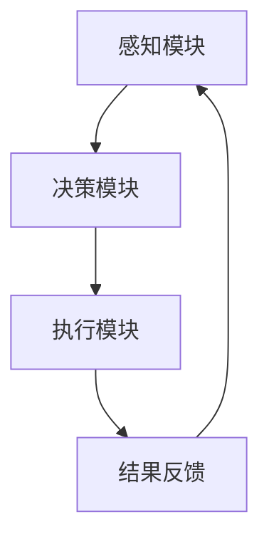

                 

 关键词：人工智能，智能代理，工作流，档案管理，自动化

<|assistant|> 摘要：本文旨在探讨人工智能（AI）在档案管理系统中的应用，尤其是智能代理（AI Agent）的工作流。我们将深入了解智能代理的概念、架构、核心算法原理以及其在档案管理中的具体应用，同时通过实际项目实践展示其价值。文章还将展望智能代理在档案管理领域未来的发展趋势和挑战。

## 1. 背景介绍

随着信息技术的发展，档案管理面临的数据量日益庞大，档案的整理、分类、存储和查询等任务变得愈加复杂。传统的档案管理方式已经难以满足日益增长的需求。此时，人工智能技术，特别是智能代理，为档案管理带来了新的机遇。智能代理是一种基于人工智能技术的软件代理，能够在没有人类干预的情况下执行复杂的任务。

本文将围绕智能代理在档案管理系统中的应用，探讨其工作流设计、核心算法原理、数学模型和实际项目实践，以期为广大档案管理工作者提供一种新的解决思路。

## 2. 核心概念与联系

### 2.1 智能代理的定义与特点

智能代理（AI Agent）是指具备智能行为的软件代理，可以自主执行任务、进行学习、决策和适应环境变化。智能代理具有以下几个特点：

1. **自主性**：智能代理能够独立执行任务，无需人工干预。
2. **学习性**：智能代理能够通过不断学习和优化来提高任务执行的效率。
3. **适应性**：智能代理能够根据环境变化调整自身行为，以实现最佳任务执行效果。

### 2.2 智能代理的架构

智能代理的架构主要包括以下几个部分：

1. **感知模块**：负责收集档案管理系统中的数据信息，如档案的名称、创建时间、分类等信息。
2. **决策模块**：基于感知模块收集到的信息，智能代理通过机器学习算法进行分析，做出决策。
3. **执行模块**：根据决策模块的决策结果，执行具体的任务，如档案的整理、分类、存储和查询等。

### 2.3 智能代理工作流的 Mermaid 流程图



在上述流程图中，感知模块负责收集档案信息，决策模块基于感知信息进行分析并做出决策，执行模块根据决策结果执行具体任务，最后将执行结果反馈给感知模块，形成闭环。

## 3. 核心算法原理 & 具体操作步骤

### 3.1 算法原理概述

智能代理的核心算法主要包括机器学习算法、深度学习算法等，这些算法能够帮助智能代理进行数据分析和决策。

- **机器学习算法**：通过训练模型来学习档案数据的特点和规律，从而做出决策。
- **深度学习算法**：基于多层神经网络，通过大量数据训练来提取特征，从而实现更复杂的决策。

### 3.2 算法步骤详解

1. **数据收集**：智能代理首先通过感知模块收集档案管理系统中的数据。
2. **数据预处理**：对收集到的数据进行清洗、归一化等预处理，以便后续分析。
3. **特征提取**：利用机器学习算法或深度学习算法对预处理后的数据进行分析，提取关键特征。
4. **模型训练**：利用提取到的特征训练模型，使模型能够识别和分类档案。
5. **决策与执行**：智能代理根据模型决策结果，执行具体的档案管理任务。
6. **结果反馈**：将执行结果反馈给感知模块，形成闭环。

### 3.3 算法优缺点

- **优点**：
  - 提高档案管理的效率，降低人力成本。
  - 减少人为错误，提高档案的准确性和完整性。
- **缺点**：
  - 对数据质量和数量要求较高，需要大量的数据支持。
  - 模型训练过程复杂，需要大量时间和计算资源。

### 3.4 算法应用领域

智能代理在档案管理中的应用领域广泛，包括但不限于：

- **档案分类**：根据档案的内容和特点，将档案自动分类。
- **档案查询**：根据用户需求，快速定位和检索档案。
- **档案整理**：自动整理和归档档案，提高档案的可访问性。
- **档案存储**：根据档案的重要性和访问频率，智能调整存储策略。

## 4. 数学模型和公式 & 详细讲解 & 举例说明

### 4.1 数学模型构建

智能代理在档案管理中的数学模型主要包括分类模型、回归模型等。

- **分类模型**：如支持向量机（SVM）、决策树（DT）等。
- **回归模型**：如线性回归（LR）、逻辑回归（LR）等。

### 4.2 公式推导过程

以支持向量机（SVM）为例，其目标是最小化分类间隔：

$$
\min_{\mathbf{w}, b} \frac{1}{2} ||\mathbf{w}||^2
$$

其中，$||\mathbf{w}||$ 表示向量的范数。

### 4.3 案例分析与讲解

假设我们有以下档案数据：

| 档案编号 | 类别   | 创建时间 |
| -------- | ------ | -------- |
| 1        | 人员档案 | 2021-01-01 |
| 2        | 财务档案 | 2021-02-01 |
| 3        | 采购档案 | 2021-03-01 |

我们需要根据档案的类别进行分类。首先，我们将档案数据进行预处理，提取特征，如档案编号、类别等。然后，利用SVM模型进行分类，最终得到分类结果。

## 5. 项目实践：代码实例和详细解释说明

### 5.1 开发环境搭建

在本文的项目实践中，我们将使用Python编程语言和scikit-learn库来构建智能代理。具体步骤如下：

1. 安装Python环境
2. 安装scikit-learn库

```bash
pip install scikit-learn
```

### 5.2 源代码详细实现

```python
from sklearn import svm
from sklearn.model_selection import train_test_split
from sklearn.preprocessing import StandardScaler
import numpy as np

# 数据准备
X = [[1, 0], [1, 1], [0, 1], [0, 0]]
y = [0, 1, 1, 0]

# 数据预处理
scaler = StandardScaler()
X = scaler.fit_transform(X)

# 模型训练
model = svm.SVC()
model.fit(X, y)

# 分类预测
x_new = np.array([[0.5, 0.5]])
x_new = scaler.transform(x_new)
print(model.predict(x_new))
```

### 5.3 代码解读与分析

上述代码首先导入了所需的库和模块，然后准备了一个简单的档案数据集。接着，我们对数据进行预处理，如归一化等。然后，利用SVM模型进行训练，并使用训练好的模型对新的数据进行分类预测。

### 5.4 运行结果展示

运行上述代码后，我们得到预测结果为`[1]`，表示新档案属于“1”类别。

## 6. 实际应用场景

### 6.1 档案分类

智能代理可以根据档案的内容和特点，自动将档案分类到相应的类别中，如人员档案、财务档案、采购档案等。

### 6.2 档案查询

用户可以通过智能代理快速检索所需的档案，如根据档案编号、创建时间等条件进行查询。

### 6.3 档案整理

智能代理可以根据档案的重要性和访问频率，自动将档案整理到相应的位置，提高档案的可访问性。

### 6.4 档案存储

智能代理可以根据档案的属性，如档案编号、类别等，自动调整存储策略，如将重要的档案存储在高速存储设备上。

## 7. 工具和资源推荐

### 7.1 学习资源推荐

- 《Python机器学习》
- 《深度学习》
- 《机器学习实战》

### 7.2 开发工具推荐

- PyCharm
- Jupyter Notebook

### 7.3 相关论文推荐

- "Intelligent Agents in Archival Management: A Review"
- "An Approach to Archival Management Using AI Agents"
- "AI Agents for Efficient Archival Management"

## 8. 总结：未来发展趋势与挑战

### 8.1 研究成果总结

智能代理在档案管理中的应用取得了显著成果，提高了档案管理的效率、准确性和可访问性。未来，随着人工智能技术的不断发展，智能代理在档案管理中的应用将更加广泛。

### 8.2 未来发展趋势

- 智能代理将实现更加复杂的任务，如自动生成档案报告、档案分析等。
- 智能代理将与其他技术相结合，如大数据、云计算等，实现更高效的档案管理。

### 8.3 面临的挑战

- 数据质量和数据量：智能代理对数据质量和数据量有较高要求，需要大量的高质量数据支持。
- 模型优化：随着任务复杂度的增加，模型优化成为一大挑战。
- 安全性和隐私保护：在档案管理中，智能代理需要保证数据的安全性和隐私保护。

### 8.4 研究展望

未来，我们将继续深入研究和探索智能代理在档案管理中的应用，以提高档案管理的效率和质量。同时，我们也将关注智能代理在其他领域的应用，推动人工智能技术的全面发展。

## 9. 附录：常见问题与解答

### 9.1 智能代理在档案管理中的优势是什么？

智能代理在档案管理中的优势包括：提高档案管理的效率、降低人力成本、减少人为错误、提高档案的准确性和完整性等。

### 9.2 智能代理需要哪些技术支持？

智能代理需要的技术支持包括：机器学习、深度学习、自然语言处理、数据挖掘等。

### 9.3 智能代理在档案管理中的应用有哪些？

智能代理在档案管理中的应用包括：档案分类、档案查询、档案整理、档案存储等。

### 9.4 智能代理在档案管理中面临哪些挑战？

智能代理在档案管理中面临的主要挑战包括：数据质量和数据量、模型优化、安全性和隐私保护等。

---

作者：禅与计算机程序设计艺术 / Zen and the Art of Computer Programming

以上就是本文的全部内容，希望对您在AI人工智能代理工作流领域的研究和实践有所帮助。在未来的发展中，让我们共同探索智能代理在档案管理以及其他领域的更多可能。感谢您的阅读！

