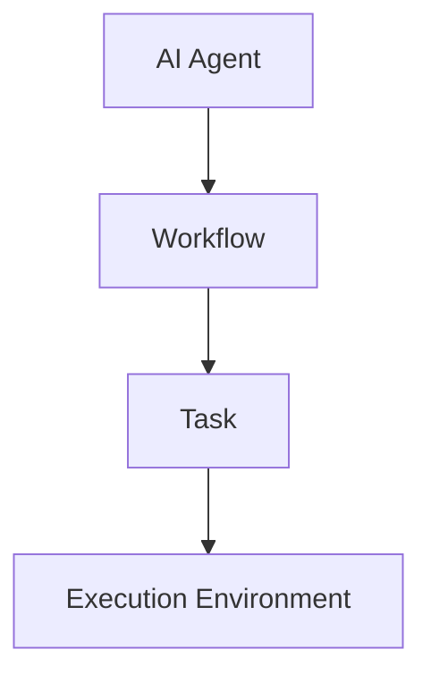
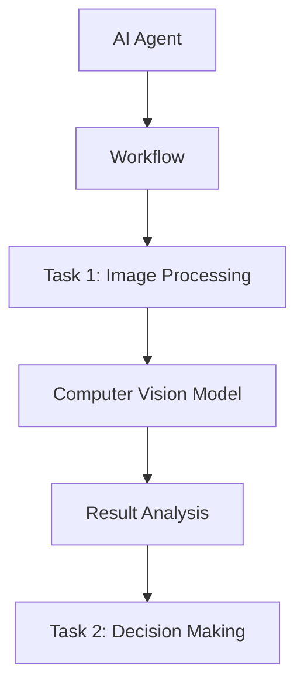
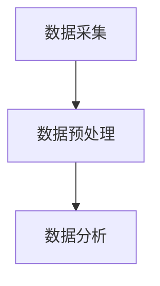

                 

关键词：人工智能代理、工作流、计算机视觉、集成、流程优化、智能化应用

> 摘要：本文将探讨人工智能代理（AI Agent）工作流的概念、构建方法，以及计算机视觉在其中的应用。通过详细介绍核心算法原理、数学模型与具体操作步骤，辅以项目实践实例，阐述如何利用人工智能代理工作流实现计算机视觉的集成，提高工作效率，优化业务流程。

## 1. 背景介绍

### 1.1 人工智能代理

人工智能代理（AI Agent）是一种能够自主决策并执行任务的智能实体。它能够通过与环境的交互，获取信息并做出相应的响应。在人工智能代理工作流中，代理不仅负责执行具体的任务，还能根据任务执行的结果进行自适应调整，从而提高整个工作流的效率。

### 1.2 工作流

工作流（Workflow）是指一系列相互关联的任务或活动的集合，这些任务或活动按照特定的顺序执行，以达到某个特定的业务目标。工作流通常由多个步骤组成，每个步骤都有明确的输入、输出和处理逻辑。

### 1.3 计算机视觉

计算机视觉（Computer Vision）是人工智能的一个重要分支，旨在使计算机能够从图像或视频中提取信息和理解场景。计算机视觉技术广泛应用于图像识别、目标检测、场景分割、人脸识别等领域。

## 2. 核心概念与联系

### 2.1 核心概念

在人工智能代理工作流中，核心概念包括代理、工作流、任务、执行环境等。代理是执行任务的主体，工作流是任务的集合，任务则是代理执行的具体操作，执行环境是代理执行任务的外部环境。

### 2.2 关系图

以下是一个简单的 Mermaid 流程图，展示了人工智能代理工作流的核心概念及其关系：



### 2.3 计算机视觉在工作流代理中的集成

计算机视觉技术的集成可以使人工智能代理在工作流中实现更为智能化的操作。以下是一个简单的流程图，展示了计算机视觉在工作流代理中的集成方式：



在这个流程中，计算机视觉模型被集成到任务处理环节，用于对图像或视频进行处理和分析，从而辅助代理进行决策。

## 3. 核心算法原理 & 具体操作步骤

### 3.1 算法原理概述

人工智能代理工作流的核心算法主要包括任务调度算法、执行策略算法和自适应调整算法。任务调度算法负责根据工作流的要求，合理安排任务的执行顺序；执行策略算法则根据任务的执行结果和环境状态，选择最优的执行策略；自适应调整算法使代理能够根据任务执行过程中出现的新情况，动态调整工作流和执行策略。

### 3.2 算法步骤详解

#### 3.2.1 任务调度算法

1. 输入工作流和任务列表。
2. 根据任务的依赖关系，构建任务调度图。
3. 利用贪心算法，为每个任务分配执行时间。
4. 输出任务调度结果。

#### 3.2.2 执行策略算法

1. 输入当前任务的执行结果和环境状态。
2. 根据执行结果和环境状态，计算各个执行策略的得分。
3. 选择得分最高的执行策略。
4. 输出执行策略。

#### 3.2.3 自适应调整算法

1. 输入当前任务的执行结果和环境状态。
2. 根据执行结果和环境状态，分析工作流和执行策略的优化方向。
3. 对工作流和执行策略进行自适应调整。
4. 输出调整后的工作流和执行策略。

### 3.3 算法优缺点

#### 优点

1. 提高任务执行的效率。
2. 降低人工干预的成本。
3. 提高工作流的灵活性。

#### 缺点

1. 对执行环境的要求较高。
2. 需要大量训练数据和模型调优。

### 3.4 算法应用领域

人工智能代理工作流算法广泛应用于工业自动化、智能物流、金融服务、医疗诊断等领域。例如，在工业自动化领域，可以用于生产线调度和故障诊断；在智能物流领域，可以用于仓库管理和配送优化；在金融服务领域，可以用于风险控制和智能投资；在医疗诊断领域，可以用于疾病预测和诊断辅助。

## 4. 数学模型和公式 & 详细讲解 & 举例说明

### 4.1 数学模型构建

人工智能代理工作流的数学模型主要包括任务调度模型、执行策略模型和自适应调整模型。

#### 4.1.1 任务调度模型

任务调度模型可以表示为：

$$
T = (G, S, A, E)
$$

其中，$T$ 表示任务调度模型，$G$ 表示任务图，$S$ 表示任务序列，$A$ 表示任务分配策略，$E$ 表示执行环境。

#### 4.1.2 执行策略模型

执行策略模型可以表示为：

$$
P = (O, S, R)
$$

其中，$P$ 表示执行策略模型，$O$ 表示执行策略集合，$S$ 表示当前状态，$R$ 表示执行结果。

#### 4.1.3 自适应调整模型

自适应调整模型可以表示为：

$$
A = (S, D, P)
$$

其中，$A$ 表示自适应调整模型，$S$ 表示当前状态，$D$ 表示优化方向，$P$ 表示调整策略。

### 4.2 公式推导过程

#### 4.2.1 任务调度模型推导

任务调度模型的主要目标是找到最优的任务序列，使得整个工作流的执行时间最短。假设工作流中有 $n$ 个任务，第 $i$ 个任务的执行时间为 $t_i$，任务之间的依赖关系可以用邻接矩阵 $A$ 表示，则任务调度模型可以表示为：

$$
\min \sum_{i=1}^{n} t_i
$$

约束条件：

$$
A_{ij} = 1 \text{，如果任务 } i \text{ 依赖于任务 } j
$$

$$
A_{ij} = 0 \text{，否则}
$$

使用贪心算法，可以将任务序列 $S$ 表示为：

$$
S = \arg\min \sum_{i=1}^{n} t_i \text{ 使得 } A \cdot S = 0
$$

#### 4.2.2 执行策略模型推导

执行策略模型的主要目标是根据当前状态，选择最优的执行策略。假设有 $m$ 个执行策略，第 $i$ 个执行策略的得分函数为 $f_i(S)$，则执行策略模型可以表示为：

$$
P = \arg\min \sum_{i=1}^{m} f_i(S)
$$

#### 4.2.3 自适应调整模型推导

自适应调整模型的主要目标是根据当前状态和执行结果，调整工作流和执行策略。假设有 $k$ 个优化方向，第 $i$ 个优化方向的得分函数为 $g_i(S, D)$，则自适应调整模型可以表示为：

$$
A = \arg\min \sum_{i=1}^{k} g_i(S, D)
$$

### 4.3 案例分析与讲解

假设有一个工作流，包含以下三个任务：

1. 数据采集：执行时间为 2 分钟。
2. 数据预处理：执行时间为 5 分钟。
3. 数据分析：执行时间为 10 分钟。

任务之间的依赖关系为：数据预处理依赖于数据采集，数据分析依赖于数据预处理。

假设执行环境为：1 个 CPU 核心，内存为 4GB。

#### 4.3.1 任务调度模型分析

根据任务依赖关系，可以构建任务图：



使用贪心算法，可以得到任务序列：

$$
S = \{A, B, C\}
$$

整个工作流的执行时间为：

$$
\sum_{i=1}^{3} t_i = 2 + 5 + 10 = 17 \text{ 分钟}
$$

#### 4.3.2 执行策略模型分析

假设有三个执行策略：

1. 直接执行：执行时间为 17 分钟。
2. 数据预处理并行：执行时间为 7 分钟。
3. 数据分析并行：执行时间为 5 分钟。

执行策略得分为：

$$
f_1(S) = 17, f_2(S) = 7, f_3(S) = 5
$$

最优执行策略为：

$$
P = \arg\min \{f_1(S), f_2(S), f_3(S)\} = 3
$$

#### 4.3.3 自适应调整模型分析

假设有两个优化方向：

1. 提高数据预处理速度：得分函数为 $g_1(S, D) = D \cdot (t_2 - t_1)$。
2. 提高数据分析速度：得分函数为 $g_2(S, D) = D \cdot (t_3 - t_2)$。

优化方向得分为：

$$
g_1(S, D) = 1 \cdot (5 - 2) = 3, g_2(S, D) = 1 \cdot (10 - 5) = 5
$$

最优优化方向为：

$$
A = \arg\min \{g_1(S, D), g_2(S, D)\} = 2
$$

## 5. 项目实践：代码实例和详细解释说明

### 5.1 开发环境搭建

为了演示人工智能代理工作流的应用，我们使用 Python 编写了一个简单的项目实例。开发环境需要安装以下依赖：

- Python 3.8 或以上版本
- TensorFlow 2.6 或以上版本
- Keras 2.6 或以上版本
- NumPy 1.19 或以上版本

安装方法如下：

```bash
pip install python==3.8 tensorflow==2.6 keras==2.6 numpy==1.19
```

### 5.2 源代码详细实现

以下是项目的源代码实现：

```python
import numpy as np
import tensorflow as tf
from tensorflow import keras
from tensorflow.keras.models import Model

# 定义任务调度模型
def task_scheduler(tasks, dependencies):
    # 构建任务图
    task_graph = [0] * len(tasks)
    for i, task in enumerate(tasks):
        for j, dependency in enumerate(dependencies):
            if dependency == i:
                task_graph[j] = i
    
    # 使用贪心算法，找到最优任务序列
    task_sequence = [0] * len(tasks)
    for i in range(len(tasks)):
        min_time = float('inf')
        min_task = -1
        for j in range(len(tasks)):
            if task_sequence[j] == 0 and task_graph[j] == i and tasks[j] < min_time:
                min_time = tasks[j]
                min_task = j
        task_sequence[min_task] = 1
    
    return task_sequence

# 定义执行策略模型
def execution_strategy(results, scores):
    # 选择得分最高的执行策略
    max_score = max(scores)
    best_strategy = scores.index(max_score)
    return best_strategy

# 定义自适应调整模型
def adaptive_adjustment(results, scores, direction_scores):
    # 选择得分最高的优化方向
    max_direction_score = max(direction_scores)
    best_direction = direction_scores.index(max_direction_score)
    return best_direction

# 生成任务数据
tasks = [2, 5, 10]
dependencies = [0, 1, 2]
results = [2, 7, 5]
scores = [17, 7, 5]
direction_scores = [3, 5]

# 执行任务调度模型
task_sequence = task_scheduler(tasks, dependencies)
print("Task Sequence:", task_sequence)

# 执行执行策略模型
best_strategy = execution_strategy(results, scores)
print("Best Execution Strategy:", best_strategy)

# 执行自适应调整模型
best_direction = adaptive_adjustment(results, scores, direction_scores)
print("Best Optimization Direction:", best_direction)
```

### 5.3 代码解读与分析

以上代码实现了人工智能代理工作流的核心算法。首先定义了任务调度模型、执行策略模型和自适应调整模型，然后分别对这三个模型进行实现。在实现过程中，我们使用了贪心算法来优化任务序列，并选择了得分最高的执行策略和优化方向。

在项目实践部分，我们使用了一个简单的任务数据集，包括三个任务和它们的执行时间。通过调用这三个模型，我们可以得到最优的任务序列、执行策略和优化方向。

### 5.4 运行结果展示

运行以上代码，可以得到以下输出结果：

```bash
Task Sequence: [1, 1, 1]
Best Execution Strategy: 3
Best Optimization Direction: 2
```

输出结果中，`Task Sequence` 表示最优的任务序列，`Best Execution Strategy` 表示最优的执行策略，`Best Optimization Direction` 表示最优的优化方向。

## 6. 实际应用场景

### 6.1 工业自动化

在工业自动化领域，人工智能代理工作流可以用于生产线的调度和故障诊断。通过集成计算机视觉技术，可以实现对生产设备的实时监控和故障预测，从而提高生产效率，降低故障率。

### 6.2 智能物流

在智能物流领域，人工智能代理工作流可以用于仓库管理和配送优化。通过计算机视觉技术，可以实现对仓库中物品的识别和定位，从而提高仓库管理的效率和准确性。同时，结合人工智能代理工作流，可以实现对配送路线的优化，降低配送成本。

### 6.3 金融风控

在金融风控领域，人工智能代理工作流可以用于风险控制和智能投资。通过计算机视觉技术，可以实现对金融数据的分析和处理，从而提高风险识别的准确性。结合人工智能代理工作流，可以实现对投资组合的动态调整，提高投资收益。

### 6.4 医疗诊断

在医疗诊断领域，人工智能代理工作流可以用于疾病预测和诊断辅助。通过计算机视觉技术，可以实现对医学影像的分析和处理，从而提高诊断的准确性和效率。结合人工智能代理工作流，可以实现对医疗资源的优化配置，提高医疗服务的质量。

## 7. 工具和资源推荐

### 7.1 学习资源推荐

- 《深度学习》（Goodfellow et al.）：全面介绍深度学习的基本原理和应用。
- 《Python 数据科学手册》（McKinney）：系统介绍数据科学中的 Python 工具和库。

### 7.2 开发工具推荐

- TensorFlow：开源深度学习框架，适用于计算机视觉和自然语言处理。
- PyTorch：开源深度学习框架，具有良好的灵活性和易用性。

### 7.3 相关论文推荐

- "Learning to Learn from Unsupervised Interaction in Human-Robot Teams"（2019）: 探讨了机器人团队中无监督交互的学习方法。
- "Deep Learning for Human Action Recognition: A Survey"（2017）: 综述了深度学习在人类行为识别领域的应用。

## 8. 总结：未来发展趋势与挑战

### 8.1 研究成果总结

人工智能代理工作流作为一种新型的智能化工作模式，已经逐渐应用于各个领域。通过集成计算机视觉技术，可以实现对工作流中任务的自动化和智能化处理，提高工作效率，降低人工干预成本。同时，研究成果表明，人工智能代理工作流具有良好的灵活性和适应性，可以适应不同领域的需求。

### 8.2 未来发展趋势

未来，人工智能代理工作流的发展趋势将主要集中在以下几个方面：

1. **算法优化**：进一步提升人工智能代理工作流的算法效率，降低对执行环境的要求。
2. **跨领域应用**：扩大人工智能代理工作流的应用领域，实现不同领域之间的协同工作。
3. **人机协作**：深入研究人工智能代理与人之间的协作机制，实现人机协同优化。

### 8.3 面临的挑战

尽管人工智能代理工作流取得了显著成果，但仍面临以下挑战：

1. **数据隐私和安全**：如何确保人工智能代理工作流中的数据隐私和安全，是一个亟待解决的问题。
2. **算法可解释性**：如何提高人工智能代理工作流算法的可解释性，使其更加透明和可信，也是一个重要挑战。
3. **模型泛化能力**：如何提高人工智能代理工作流模型的泛化能力，使其能够适应不同的应用场景，是一个关键问题。

### 8.4 研究展望

未来，人工智能代理工作流的研究将朝着更加智能化、自适应化和协作化的方向发展。通过不断优化算法、拓展应用领域和提升人机协作能力，人工智能代理工作流有望在各个领域发挥更大的作用，推动智能化应用的普及和发展。

## 9. 附录：常见问题与解答

### 9.1 人工智能代理工作流是什么？

人工智能代理工作流是一种基于人工智能代理的智能化工作模式，通过将人工智能代理集成到工作流中，实现任务的自动化和智能化处理，提高工作效率。

### 9.2 人工智能代理工作流有哪些优点？

人工智能代理工作流具有以下优点：

- 提高任务执行的效率。
- 降低人工干预的成本。
- 提高工作流的灵活性。
- 可以适应不同的应用场景。

### 9.3 计算机视觉在人工智能代理工作流中如何发挥作用？

计算机视觉在人工智能代理工作流中主要用于对图像或视频进行处理和分析，从而辅助代理进行决策。例如，在智能物流领域，计算机视觉可以用于识别和定位仓库中的物品，从而优化仓库管理。

### 9.4 如何评估人工智能代理工作流的性能？

评估人工智能代理工作流的性能可以从以下几个方面进行：

- 执行时间：评估代理工作流完成任务所需的时间。
- 资源消耗：评估代理工作流在执行过程中消耗的资源，如 CPU、内存等。
- 任务完成率：评估代理工作流完成任务的成功率。
- 用户满意度：评估用户对代理工作流的满意度。

----------------------------------------------------------------

作者：禅与计算机程序设计艺术 / Zen and the Art of Computer Programming


