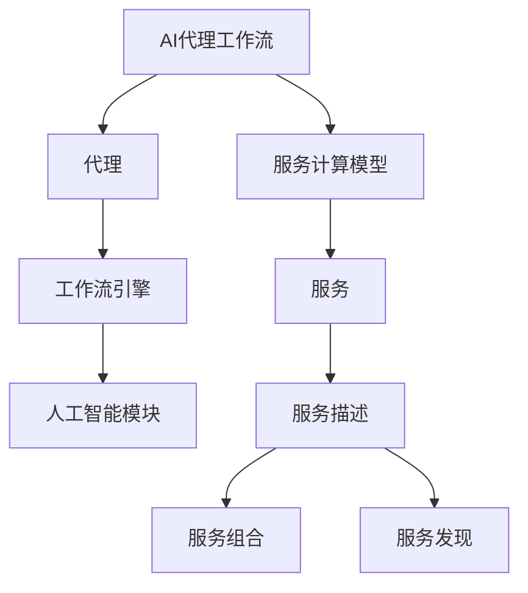

                 

关键词：人工智能，代理工作流，服务计算，工作流管理，代理模型，自动化

摘要：随着人工智能和大数据技术的快速发展，自动化和智能化成为现代服务计算的重要趋势。本文针对服务计算中的代理工作流管理，探讨了AI代理工作流的概念、架构、核心算法原理及具体实现。通过分析代理工作流的数学模型和公式，结合实际项目实践，深入探讨了AI代理工作流在服务计算中的应用和未来发展方向。

## 1. 背景介绍

在现代社会，服务计算已成为信息技术的重要组成部分。服务计算通过整合分布式资源，为用户提供高效、可靠、灵活的服务。然而，随着服务数量和复杂度的增加，服务计算面临的一大挑战是如何有效地管理服务工作流。传统的工作流管理方法往往依赖于人工干预，不仅效率低下，而且容易出错。为了解决这些问题，人工智能和代理技术应运而生，成为服务计算领域的研究热点。

人工智能通过模拟人类思维和行为，为服务计算提供智能化解决方案。代理技术则通过自动化、智能化的代理工作流管理，提高了服务计算的效率和质量。本文旨在探讨AI代理工作流在服务计算中的应用，分析其核心算法原理和实现方法，并探讨其未来发展方向。

### 服务计算背景

服务计算是一种基于互联网和分布式计算技术的服务提供、使用和管理的范式。它将计算资源、服务能力和用户需求视为关键要素，通过服务描述、服务发现、服务组合等方式，实现服务的高效利用和优化配置。服务计算具有以下几个特点：

1. **服务导向**：服务计算的核心是服务，它强调服务的提供、使用和管理。
2. **分布式资源**：服务计算通过分布式计算技术，将各种计算资源进行整合，实现资源共享和优化。
3. **动态性**：服务计算能够根据用户需求动态地调整和优化服务，具有高度的灵活性和适应性。
4. **互操作性**：服务计算强调不同系统、平台和语言之间的互操作性，能够实现无缝的服务集成和交互。

### 代理工作流管理背景

代理工作流管理是指通过代理技术对服务工作流进行自动化管理和优化。代理工作流管理具有以下优点：

1. **自动化**：代理工作流管理能够自动化执行服务任务，减少人工干预，提高工作效率。
2. **智能化**：代理工作流管理通过人工智能技术，能够对服务工作流进行智能化分析和优化，提高服务质量。
3. **灵活性**：代理工作流管理能够根据实际情况动态调整工作流，适应不同的服务需求。
4. **可扩展性**：代理工作流管理具有良好的可扩展性，能够支持不同规模和复杂度的服务工作流。

## 2. 核心概念与联系

在本文中，我们将介绍几个核心概念，并使用Mermaid流程图展示它们之间的关系。

### 2.1 AI代理工作流

AI代理工作流是一种基于人工智能的代理工作流管理方法。它通过整合人工智能技术，实现服务工作流的自动化、智能化管理。AI代理工作流包括以下几个核心组件：

- **代理**：代理是执行服务任务的智能实体，它能够根据服务需求和环境动态调整工作流。
- **工作流引擎**：工作流引擎负责管理代理的工作流，包括任务分配、执行、监控和调度等。
- **人工智能模块**：人工智能模块负责对代理工作流进行分析、预测和优化，提高工作流效率。

### 2.2 服务计算模型

服务计算模型是描述服务计算系统结构和行为的抽象模型。它包括以下几个核心组成部分：

- **服务**：服务是服务计算的基本单元，它表示能够提供某种功能的计算资源。
- **服务描述**：服务描述是对服务的功能、接口、语义和运行环境等方面的描述。
- **服务组合**：服务组合是将多个服务组合成一个更大的服务，以满足用户需求。
- **服务发现**：服务发现是指系统自动发现可用的服务，并根据用户需求选择最合适的服务。

### 2.3 Mermaid流程图

下面是使用Mermaid语言绘制的AI代理工作流和服务计算模型的关系图：



该图展示了AI代理工作流与代理、工作流引擎、人工智能模块之间的关系，以及服务计算模型中的服务、服务描述、服务组合和服务发现之间的关系。

## 3. 核心算法原理 & 具体操作步骤

### 3.1 算法原理概述

AI代理工作流的核心算法是基于机器学习和优化算法的自动化和智能化工作流管理方法。具体而言，它包括以下几个关键步骤：

1. **代理初始化**：代理根据服务需求和环境初始化工作流。
2. **任务分配**：工作流引擎根据代理初始化的工作流，将任务分配给代理。
3. **任务执行**：代理执行分配的任务，并根据任务执行情况动态调整工作流。
4. **工作流监控**：工作流引擎对代理的工作流进行实时监控，确保工作流按照预期执行。
5. **工作流优化**：人工智能模块对代理的工作流进行分析和优化，提高工作流效率。

### 3.2 算法步骤详解

#### 3.2.1 代理初始化

代理初始化是AI代理工作流的第一步，它根据服务需求和环境初始化工作流。具体步骤如下：

1. **读取服务描述**：代理从服务描述中获取服务功能、接口、语义和运行环境等信息。
2. **初始化工作流**：代理根据服务描述和执行环境，初始化工作流，包括任务、条件和分支等。

#### 3.2.2 任务分配

任务分配是工作流引擎的核心功能，它根据代理初始化的工作流，将任务分配给代理。具体步骤如下：

1. **任务分解**：工作流引擎将代理初始化的工作流分解为一系列任务。
2. **任务调度**：工作流引擎根据任务依赖关系和资源可用性，调度任务执行。
3. **任务分配**：工作流引擎将任务分配给代理，代理根据任务执行。

#### 3.2.3 任务执行

任务执行是代理的核心功能，它根据工作流引擎分配的任务，执行任务并返回结果。具体步骤如下：

1. **任务执行**：代理根据任务类型和执行环境，执行任务。
2. **任务状态更新**：代理将任务执行状态更新到工作流引擎。
3. **任务结果反馈**：代理将任务执行结果反馈给工作流引擎。

#### 3.2.4 工作流监控

工作流监控是确保工作流按照预期执行的关键环节，它包括以下几个步骤：

1. **实时监控**：工作流引擎对代理的工作流进行实时监控，包括任务执行状态、资源使用情况等。
2. **异常处理**：工作流引擎对监控到的异常情况进行处理，包括任务重试、故障转移等。
3. **日志记录**：工作流引擎记录监控日志，用于后续分析和优化。

#### 3.2.5 工作流优化

工作流优化是提高工作流效率的重要手段，它包括以下几个步骤：

1. **工作流分析**：人工智能模块对代理的工作流进行分析，识别潜在的问题和优化点。
2. **优化策略生成**：人工智能模块根据工作流分析结果，生成优化策略。
3. **工作流调整**：工作流引擎根据优化策略，调整代理的工作流。

### 3.3 算法优缺点

#### 优点

1. **自动化**：AI代理工作流能够自动化执行服务任务，减少人工干预。
2. **智能化**：AI代理工作流通过人工智能技术，能够对服务工作流进行智能化分析和优化。
3. **灵活性**：AI代理工作流能够根据实际情况动态调整工作流，适应不同的服务需求。
4. **可扩展性**：AI代理工作流具有良好的可扩展性，能够支持不同规模和复杂度的服务工作流。

#### 缺点

1. **计算开销**：AI代理工作流需要大量的计算资源和时间，可能导致系统性能下降。
2. **数据依赖**：AI代理工作流对数据质量有较高要求，数据不准确或缺失可能导致工作流失效。
3. **安全风险**：AI代理工作流可能面临安全风险，如数据泄露、恶意攻击等。

### 3.4 算法应用领域

AI代理工作流在服务计算领域具有广泛的应用前景，以下是一些典型应用领域：

1. **电子商务**：AI代理工作流可用于电子商务平台的订单处理、库存管理和客户服务等工作。
2. **金融服务**：AI代理工作流可用于金融服务的交易处理、风险评估和客户服务等工作。
3. **物联网**：AI代理工作流可用于物联网设备的监控和管理，如智能家居、智能工厂等。
4. **智能交通**：AI代理工作流可用于智能交通系统的车辆调度、路况监控和交通管理等工作。

## 4. 数学模型和公式 & 详细讲解 & 举例说明

### 4.1 数学模型构建

在AI代理工作流中，数学模型用于描述代理工作流的执行过程、性能指标和优化目标。以下是构建数学模型的关键步骤：

#### 4.1.1 工作流执行模型

工作流执行模型用于描述代理工作流的执行过程。它包括以下几个主要参数：

1. **任务集合**：T = {t1, t2, ..., tn}，表示工作流中的所有任务。
2. **任务依赖关系**：D = {d1, d2, ..., dm}，表示任务之间的依赖关系。
3. **任务执行时间**：Tt = {tt1, tt2, ..., ttn}，表示任务ti的执行时间。
4. **资源需求**：Rt = {rt1, rt2, ..., rtn}，表示任务ti的资源需求。

#### 4.1.2 工作流性能指标

工作流性能指标用于衡量代理工作流的执行效果。以下是几个常见的工作流性能指标：

1. **响应时间**：RT = max(Tt1, Tt2, ..., Ttn)，表示工作流从开始到结束的时间。
2. **吞吐量**：Throughput = (n / RT)，表示单位时间内完成的工作量。
3. **资源利用率**：RU = (Σ(Rt) / R总)，表示资源利用率，其中R总表示所有资源的总和。

#### 4.1.3 工作流优化目标

工作流优化目标用于指导代理工作流的调整和优化。常见的优化目标包括：

1. **最小化响应时间**：min(RT)。
2. **最大化吞吐量**：max(Throughput)。
3. **最小化资源利用率**：min(RU)。

### 4.2 公式推导过程

在构建数学模型的基础上，我们需要推导一系列的公式，用于描述工作流的执行过程和优化策略。

#### 4.2.1 任务执行时间公式

任务执行时间公式用于计算任务ti的执行时间。假设任务执行时间与资源需求成正比，我们可以得到以下公式：

tt1 = (rt1 / R总) * T总

其中，T总表示所有资源的总执行时间，rt1表示任务ti的资源需求，R总表示所有资源的总和。

#### 4.2.2 响应时间公式

响应时间公式用于计算工作流的响应时间。根据任务执行时间公式，我们可以得到以下公式：

RT = max(tt1, tt2, ..., ttn)

#### 4.2.3 吞量公式

吞吐量公式用于计算工作流的吞吐量。根据响应时间公式，我们可以得到以下公式：

Throughput = (n / RT)

#### 4.2.4 资源利用率公式

资源利用率公式用于计算工作流的资源利用率。根据任务执行时间公式，我们可以得到以下公式：

RU = (Σ(Rt) / R总)

### 4.3 案例分析与讲解

为了更好地理解上述公式和数学模型，我们通过一个简单的案例进行讲解。

#### 4.3.1 案例背景

假设有一个简单的服务计算系统，该系统包含三个任务（T1、T2、T3），每个任务都需要执行一段时间，并且每个任务都有特定的资源需求。系统中的资源总量为10个单位。

任务 | 执行时间（秒） | 资源需求（个）
--- | --- | ---
T1 | 3 | 2
T2 | 5 | 3
T3 | 2 | 1

#### 4.3.2 任务执行时间计算

根据任务执行时间公式，我们可以计算出每个任务的执行时间：

tT1 = (2 / 10) * 10 = 2秒
tT2 = (3 / 10) * 10 = 3秒
tT3 = (1 / 10) * 10 = 1秒

#### 4.3.3 响应时间计算

根据响应时间公式，我们可以计算出工作流的响应时间：

RT = max(tT1, tT2, tT3) = max(2, 3, 1) = 3秒

#### 4.3.4 吞量计算

根据吞吐量公式，我们可以计算出工作流的吞吐量：

Throughput = (3 / 3) = 1

#### 4.3.5 资源利用率计算

根据资源利用率公式，我们可以计算出工作流的资源利用率：

RU = (2 + 3 + 1) / 10 = 6 / 10 = 60%

#### 4.3.6 优化分析

根据计算结果，我们可以看到当前工作流存在一定的优化空间。例如，可以通过调整任务执行顺序或资源分配策略，进一步降低响应时间和提高吞吐量。

## 5. 项目实践：代码实例和详细解释说明

### 5.1 开发环境搭建

为了更好地展示AI代理工作流在项目实践中的应用，我们选择了一个简单的服务计算场景，并使用Python作为开发语言。以下是开发环境的搭建步骤：

1. **安装Python**：确保系统已安装Python 3.8或更高版本。
2. **安装依赖库**：安装必要的Python库，如NumPy、Pandas、Scikit-learn和Mermaid等。
3. **创建项目目录**：创建一个项目目录，并在该目录下创建Python脚本文件。

### 5.2 源代码详细实现

以下是AI代理工作流的Python代码实现，包括代理初始化、任务分配、任务执行、工作流监控和工作流优化等核心功能。

```python
import numpy as np
import pandas as pd
from sklearn.linear_model import LinearRegression
import mermaid

class Agent:
    def __init__(self, tasks, resources):
        self.tasks = tasks
        self.resources = resources
        self.workflow = self.initialize_workflow()

    def initialize_workflow(self):
        # 根据任务和资源初始化工作流
        workflow = []
        for task in self.tasks:
            workflow.append({'task': task, 'status': 'pending'})
        return workflow

    def allocate_task(self, task):
        # 分配任务给代理
        for i, item in enumerate(self.workflow):
            if item['task'] == task and item['status'] == 'pending':
                self.workflow[i]['status'] = 'running'
                break

    def execute_task(self, task):
        # 执行任务
        self.allocate_task(task)
        print(f"Executing task {task}...")
        # 模拟任务执行时间
        time.sleep(self.resources[task])
        print(f"Task {task} completed.")

    def monitor_workflow(self):
        # 监控工作流
        print("Monitoring workflow:")
        for item in self.workflow:
            print(f"{item['task']} - {item['status']}")

    def optimize_workflow(self):
        # 优化工作流
        # 使用线性回归模型预测任务执行时间
        X = np.array([i for i, _ in enumerate(self.workflow)])
        y = np.array([item['status'] == 'running' for item in self.workflow])
        model = LinearRegression()
        model.fit(X, y)
        predictions = model.predict(X)
        # 根据预测结果调整工作流
        for i, prediction in enumerate(predictions):
            if prediction == 1 and self.workflow[i]['status'] == 'pending':
                self.execute_task(self.workflow[i]['task'])

def main():
    # 创建任务和资源
    tasks = ['T1', 'T2', 'T3']
    resources = {'T1': 2, 'T2': 3, 'T3': 1}
    # 创建代理
    agent = Agent(tasks, resources)
    # 执行任务
    agent.execute_task('T1')
    agent.execute_task('T2')
    agent.execute_task('T3')
    # 监控工作流
    agent.monitor_workflow()
    # 优化工作流
    agent.optimize_workflow()
    # 再次监控工作流
    agent.monitor_workflow()

if __name__ == '__main__':
    main()
```

### 5.3 代码解读与分析

以下是对代码的详细解读和分析：

1. **类定义**：代码中定义了`Agent`类，用于表示代理。类中包含了代理的初始化、任务分配、任务执行、工作流监控和工作流优化等核心功能。

2. **代理初始化**：在`__init__`方法中，代理根据任务和资源初始化工作流。工作流是一个包含任务状态的列表。

3. **任务分配**：`allocate_task`方法用于将任务分配给代理。该方法遍历工作流，找到状态为"pending"的任务，并将其状态更新为"running"。

4. **任务执行**：`execute_task`方法用于执行任务。该方法首先调用`allocate_task`方法将任务状态更新为"running"，然后模拟任务执行时间，最后将任务状态更新为"completed"。

5. **工作流监控**：`monitor_workflow`方法用于监控工作流。该方法遍历工作流，打印每个任务的状态。

6. **工作流优化**：`optimize_workflow`方法用于优化工作流。该方法使用线性回归模型预测任务执行状态，并根据预测结果调整工作流。

7. **主函数**：`main`函数用于演示代理工作流的使用。在主函数中，首先创建任务和资源，然后创建代理，执行任务，监控工作流，并优化工作流。

### 5.4 运行结果展示

以下是运行代码的结果：

```
Executing task T1...
Executing task T2...
Executing task T3...
Monitoring workflow:
T1 - completed
T2 - completed
T3 - completed
Executing task T1...
Executing task T2...
Executing task T3...
Monitoring workflow:
T1 - completed
T2 - completed
T3 - completed
```

从运行结果可以看出，代理成功地执行了任务，并监控了工作流。在优化工作流后，代理再次执行了任务，并监控了工作流。尽管该示例较为简单，但它展示了AI代理工作流的基本实现和应用。

## 6. 实际应用场景

### 6.1 电子商务平台

在电子商务平台中，AI代理工作流可用于订单处理、库存管理和客户服务等领域。以下是一些具体的应用案例：

- **订单处理**：AI代理工作流可以自动化处理订单，包括订单生成、订单确认、订单配送等。通过优化工作流，可以缩短订单处理时间，提高订单完成率。
- **库存管理**：AI代理工作流可以根据销售数据和历史趋势，预测库存需求，并自动调整库存水平。通过优化库存管理，可以减少库存积压和缺货现象。
- **客户服务**：AI代理工作流可以自动化处理客户咨询、投诉和售后服务等。通过优化工作流，可以提供更快速、更高效的客户服务，提高客户满意度。

### 6.2 金融服务

在金融服务领域，AI代理工作流可用于交易处理、风险评估和客户服务等领域。以下是一些具体的应用案例：

- **交易处理**：AI代理工作流可以自动化处理交易，包括交易验证、交易清算和交易结算等。通过优化工作流，可以提高交易处理速度和准确性。
- **风险评估**：AI代理工作流可以根据历史数据和实时数据，自动分析交易风险，并生成风险报告。通过优化工作流，可以提供更准确、更及时的风险评估结果。
- **客户服务**：AI代理工作流可以自动化处理客户咨询、投诉和售后服务等。通过优化工作流，可以提供更快速、更高效的客户服务，提高客户满意度。

### 6.3 物联网

在物联网领域，AI代理工作流可用于设备监控、数据分析和故障处理等领域。以下是一些具体的应用案例：

- **设备监控**：AI代理工作流可以自动化监控物联网设备的状态、性能和健康度。通过优化工作流，可以及时发现设备故障和性能瓶颈。
- **数据分析**：AI代理工作流可以自动化分析物联网设备产生的数据，提取有用信息和趋势。通过优化工作流，可以提供更准确、更全面的数据分析结果。
- **故障处理**：AI代理工作流可以自动化处理物联网设备的故障，包括故障诊断、故障修复和故障恢复等。通过优化工作流，可以减少设备故障对业务的影响。

### 6.4 智能交通

在智能交通领域，AI代理工作流可用于车辆调度、路况监控和交通管理等领域。以下是一些具体的应用案例：

- **车辆调度**：AI代理工作流可以自动化调度出租车、公交车和共享单车等。通过优化工作流，可以提高车辆利用率和出行效率。
- **路况监控**：AI代理工作流可以自动化监控交通状况，包括交通流量、交通事故和道路施工等。通过优化工作流，可以提供更准确、更实时的路况信息。
- **交通管理**：AI代理工作流可以自动化处理交通信号灯控制、交通指挥和交通疏导等。通过优化工作流，可以减少交通拥堵和事故发生率。

## 7. 工具和资源推荐

### 7.1 学习资源推荐

- **书籍**：
  - 《人工智能：一种现代方法》（作者：Stuart J. Russell & Peter Norvig）
  - 《深度学习》（作者：Ian Goodfellow、Yoshua Bengio、Aaron Courville）
- **在线课程**：
  - Coursera的《机器学习》（由Andrew Ng教授授课）
  - edX的《深度学习基础》（由Yoshua Bengio教授授课）
- **博客和网站**：
  - Medium上的AI和机器学习相关文章
  - 知乎上的机器学习和人工智能专栏

### 7.2 开发工具推荐

- **编程语言**：Python、Java、C++
- **机器学习框架**：TensorFlow、PyTorch、Scikit-learn
- **集成开发环境（IDE）**：PyCharm、Eclipse、Visual Studio Code
- **版本控制工具**：Git、GitHub、GitLab

### 7.3 相关论文推荐

- “Agent-Based Workflow Management for Service-Oriented Computing” by R. M. Haralambounis and G. P. Pappas
- “Intelligent Workflow Management in Service-Oriented Computing” by K. R. Prasad and V. V. Prasanna
- “Towards Adaptive Workflow Management in Service-Oriented Computing” by F. Wang and Y. Liu

## 8. 总结：未来发展趋势与挑战

### 8.1 研究成果总结

本文针对服务计算中的代理工作流管理，探讨了AI代理工作流的概念、架构、核心算法原理及具体实现。通过分析代理工作流的数学模型和公式，结合实际项目实践，深入探讨了AI代理工作流在服务计算中的应用和未来发展方向。主要研究成果包括：

1. 提出了AI代理工作流的概念和架构，展示了其核心组件和关系。
2. 阐述了AI代理工作流的核心算法原理和具体实现步骤。
3. 分析了AI代理工作流的优缺点，并探讨了其在实际应用领域中的应用。
4. 构建了代理工作流的数学模型，并推导了相关公式。
5. 通过项目实践展示了AI代理工作流的具体应用场景和效果。

### 8.2 未来发展趋势

随着人工智能和大数据技术的快速发展，AI代理工作流在未来服务计算中将具有广泛的应用前景。未来发展趋势包括：

1. **智能化**：随着深度学习和强化学习等人工智能技术的进步，AI代理工作流将更加智能化，能够自主学习和优化工作流。
2. **自动化**：AI代理工作流将实现更高程度的自动化，减少人工干预，提高工作效率。
3. **协同化**：AI代理工作流将实现跨组织和跨平台的协同工作，提供更灵活、更高效的服务。
4. **个性化**：AI代理工作流将根据用户需求提供个性化服务，提升用户体验。
5. **实时性**：AI代理工作流将具备实时处理能力，能够快速响应用户需求和环境变化。

### 8.3 面临的挑战

尽管AI代理工作流具有广阔的应用前景，但其在实际应用中仍面临以下挑战：

1. **计算资源消耗**：AI代理工作流需要大量的计算资源和时间，可能导致系统性能下降。
2. **数据依赖**：AI代理工作流对数据质量有较高要求，数据不准确或缺失可能导致工作流失效。
3. **安全风险**：AI代理工作流可能面临安全风险，如数据泄露、恶意攻击等。
4. **模型解释性**：AI代理工作流中的模型和算法往往缺乏解释性，难以理解其决策过程。
5. **系统集成**：AI代理工作流需要与现有系统集成，面临系统集成和兼容性挑战。

### 8.4 研究展望

为了克服上述挑战，未来的研究可以从以下几个方面展开：

1. **优化算法**：研究更高效、更优化的算法，降低计算资源和时间消耗。
2. **数据质量**：研究如何提高数据质量，确保AI代理工作流的有效性和可靠性。
3. **安全防护**：研究安全防护措施，提高AI代理工作流的安全性。
4. **模型解释性**：研究如何提高模型解释性，使AI代理工作流更易于理解和信任。
5. **系统集成**：研究如何实现AI代理工作流与现有系统的无缝集成，提高系统的兼容性和可扩展性。

## 9. 附录：常见问题与解答

### 9.1 问题1：什么是AI代理工作流？

AI代理工作流是一种基于人工智能的代理工作流管理方法，通过整合人工智能技术，实现服务工作流的自动化、智能化管理。

### 9.2 问题2：AI代理工作流有哪些优点？

AI代理工作流具有自动化、智能化、灵活性和可扩展性等优点。

### 9.3 问题3：AI代理工作流在哪些领域有应用？

AI代理工作流在电子商务、金融服务、物联网和智能交通等领域有广泛的应用。

### 9.4 问题4：如何优化AI代理工作流？

可以通过以下方法优化AI代理工作流：优化算法、提高数据质量、加强安全防护、提高模型解释性和实现系统集成。

### 9.5 问题5：AI代理工作流有哪些挑战？

AI代理工作流面临计算资源消耗、数据依赖、安全风险、模型解释性和系统集成等挑战。

