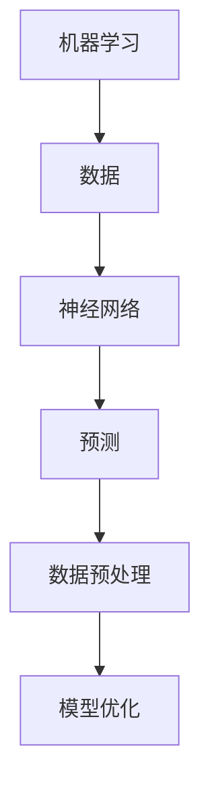

                 

关键词：人工智能，核心算法，数据偏见，算法原理，代码实例，AI应用，数据分析，机器学习，神经网络，数据预处理，算法优缺点。

## 摘要

本文将深入探讨人工智能领域中的一个关键问题——数据偏见。通过详细分析核心算法原理，我们旨在为读者提供全面的理解，并借助代码实例，展示如何在实际项目中应对和减轻数据偏见的影响。文章将分为以下几个部分：背景介绍、核心概念与联系、核心算法原理与操作步骤、数学模型与公式讲解、项目实践、实际应用场景、未来应用展望、工具和资源推荐、总结与展望、以及常见问题与解答。

## 1. 背景介绍

在当今迅速发展的科技时代，人工智能（AI）已经成为许多行业的重要组成部分。无论是医疗、金融、交通还是制造业，AI 都在改变着我们的生活方式和工作方式。然而，随着 AI 技术的广泛应用，数据偏见成为一个日益突出的问题。数据偏见指的是模型训练过程中，由于数据的不公平、不完整或选择偏差，导致模型对某些群体或特征产生不公平的判断或预测。

数据偏见的存在会导致以下几种不良后果：

1. **歧视与不公平**：模型可能在某些情况下对特定群体产生歧视，如性别、种族或年龄歧视。
2. **不准确预测**：偏见的数据会导致模型做出不准确或错误的预测。
3. **损失经济效益**：在商业应用中，数据偏见可能导致错误的决策，造成经济损失。

因此，识别、理解和解决数据偏见问题是确保 AI 系统公平、透明和可靠的关键。

## 2. 核心概念与联系

在深入探讨数据偏见问题之前，我们需要理解几个核心概念，包括机器学习、神经网络和数据预处理。

### 2.1 机器学习

机器学习是 AI 的核心组成部分，它通过构建数学模型，从数据中学习规律并做出预测或决策。在机器学习中，数据是至关重要的，因为模型的性能在很大程度上取决于数据的质量和多样性。

### 2.2 神经网络

神经网络是机器学习的一种重要模型，它模拟人脑的神经网络结构，通过多层节点进行数据处理和特征提取。神经网络在图像识别、语音识别和自然语言处理等领域具有广泛应用。

### 2.3 数据预处理

数据预处理是机器学习过程中至关重要的一步，它包括数据清洗、归一化、去噪、缺失值填补等操作。良好的数据预处理可以减少数据偏见，提高模型的性能和可靠性。

### 2.4 数据偏见与核心概念的联系

数据偏见与机器学习、神经网络和数据预处理有直接的联系。首先，机器学习模型需要依赖高质量的数据来进行训练，而数据偏见会直接影响数据的质量。其次，神经网络通过学习数据中的模式来做出预测，如果数据存在偏见，模型很可能会在预测过程中放大这些偏见。最后，数据预处理是减轻数据偏见的重要手段，通过有效的预处理方法，可以减少数据中的偏差和不平衡。

### 2.5 Mermaid 流程图

以下是一个简化的 Mermaid 流程图，展示了机器学习、神经网络和数据预处理之间的联系。



## 3. 核心算法原理 & 具体操作步骤

### 3.1 算法原理概述

为了解决数据偏见问题，研究人员和开发者提出了一系列算法和方法。其中，一些核心算法包括：

1. **敏感性分析**：通过分析模型在不同数据集上的表现，识别和评估数据偏见的影响。
2. **再抽样**：通过增加正样本、减少负样本或使用重采样技术，平衡数据集。
3. **偏差修正**：通过对模型进行再训练，消除或减少数据偏见。
4. **对抗训练**：通过生成对抗性样本，提高模型对数据偏见的鲁棒性。

### 3.2 算法步骤详解

下面，我们将详细讲解上述算法的具体操作步骤。

#### 3.2.1 敏感性分析

敏感性分析是评估模型对数据偏见敏感度的过程。具体步骤如下：

1. **数据准备**：收集原始数据集，并进行数据预处理。
2. **模型训练**：使用预处理后的数据集训练模型。
3. **敏感性评估**：通过更改数据集中的样本，观察模型输出的变化，评估模型的敏感性。
4. **结果分析**：根据敏感性评估结果，识别和解决数据偏见。

#### 3.2.2 再抽样

再抽样是一种常用的数据预处理方法，用于平衡数据集。具体步骤如下：

1. **样本分类**：将数据集分为正样本和负样本。
2. **计算样本比例**：计算正样本和负样本的比例。
3. **调整样本数量**：根据样本比例，增加正样本或减少负样本，使数据集达到平衡。
4. **重新训练模型**：使用平衡后的数据集重新训练模型。

#### 3.2.3 偏差修正

偏差修正是一种通过再训练模型来减少数据偏见的算法。具体步骤如下：

1. **模型训练**：使用原始数据集训练模型。
2. **偏差识别**：通过分析模型输出，识别数据偏见。
3. **偏差修正**：通过再训练模型，消除或减少数据偏见。
4. **模型评估**：评估修正后模型的性能和偏见程度。

#### 3.2.4 对抗训练

对抗训练是一种通过生成对抗性样本来提高模型鲁棒性的方法。具体步骤如下：

1. **生成对抗性样本**：通过生成对抗网络（GAN），生成与真实样本具有相似特征但包含偏见的对抗性样本。
2. **模型训练**：使用真实数据和对抗性样本训练模型。
3. **对抗性评估**：评估模型在对抗性样本上的性能。
4. **模型优化**：根据对抗性评估结果，调整模型参数，提高模型对对抗性样本的鲁棒性。

### 3.3 算法优缺点

#### 3.3.1 敏感性分析

**优点**：

- 简单易行，适用于各种类型的模型。
- 可以识别和评估数据偏见的影响。

**缺点**：

- 评估结果可能不够精确，难以量化数据偏见的程度。
- 需要大量计算资源。

#### 3.3.2 再抽样

**优点**：

- 可以显著改善模型性能，提高模型的公平性。
- 简单有效，适用于大多数数据集。

**缺点**：

- 可能会引入新的偏差，影响模型准确性。
- 对大型数据集的处理效率较低。

#### 3.3.3 偏差修正

**优点**：

- 可以有效减少数据偏见，提高模型的公平性和准确性。
- 适用于各种类型的模型。

**缺点**：

- 需要大量计算资源和时间。
- 可能会引入新的偏差，影响模型性能。

#### 3.3.4 对抗训练

**优点**：

- 可以显著提高模型对对抗性样本的鲁棒性。
- 适用于各种类型的模型。

**缺点**：

- 训练过程复杂，需要大量计算资源和时间。
- 对模型的设计和实现要求较高。

### 3.4 算法应用领域

敏感性分析、再抽样、偏差修正和对抗训练广泛应用于多个领域，如金融、医疗、司法和教育等。以下是一些具体的案例：

- **金融**：通过敏感性分析，评估信贷评分模型的公平性和准确性，减少信贷歧视。
- **医疗**：通过再抽样和偏差修正，改善疾病诊断模型对特定群体的准确性，提高医疗服务质量。
- **司法**：通过敏感性分析和对抗训练，评估司法判决模型的公正性和准确性，减少司法歧视。
- **教育**：通过再抽样和偏差修正，改善教育评估模型的公平性和准确性，提高教育质量。

## 4. 数学模型和公式 & 详细讲解 & 举例说明

### 4.1 数学模型构建

在解决数据偏见问题时，我们需要构建合适的数学模型来识别、评估和修正偏见。以下是一些常用的数学模型：

#### 4.1.1 敏感性分析模型

敏感性分析模型通常基于数据集的统计特征，如均值、标准差、相关性等。以下是一个简化的敏感性分析模型：

$$
\text{Sensitivity} = \frac{\text{Bias}}{\text{Variance}}
$$

其中，Bias 表示数据偏见的程度，Variance 表示数据变异的程度。通过计算 Sensitivity，可以评估模型对数据偏见的敏感度。

#### 4.1.2 再抽样模型

再抽样模型通常基于数据集的分布特征，如概率分布、密度函数等。以下是一个简化的再抽样模型：

$$
\text{Sampling} = \text{Proportion} \times \text{Data}
$$

其中，Proportion 表示样本比例，Data 表示原始数据集。通过调整 Proportion，可以平衡数据集。

#### 4.1.3 偏差修正模型

偏差修正模型通常基于模型的输出特征，如预测误差、分类精度等。以下是一个简化的偏差修正模型：

$$
\text{Correction} = \text{Model Output} - \text{Bias}
$$

其中，Model Output 表示模型输出，Bias 表示数据偏见。通过调整 Correction，可以减少数据偏见。

#### 4.1.4 对抗训练模型

对抗训练模型通常基于生成对抗网络（GAN），其核心目标是生成对抗性样本。以下是一个简化的对抗训练模型：

$$
\text{Adversarial} = \text{Generator}(\text{Noise}) + \text{Discriminator}(\text{Data})
$$

其中，Generator 生成对抗性样本，Discriminator 判断样本是否为对抗性样本。通过优化 Generator 和 Discriminator，可以生成高质量的对抗性样本。

### 4.2 公式推导过程

#### 4.2.1 敏感性分析模型的推导

敏感性分析模型是通过分析数据集的统计特征来评估模型对数据偏见的敏感度。具体推导过程如下：

假设我们有一个数据集 $D = \{x_1, x_2, ..., x_n\}$，其中 $x_i$ 表示第 $i$ 个样本。我们定义 $y_i$ 为模型对 $x_i$ 的输出，$\hat{y}_i$ 为模型预测的输出。则敏感性分析模型可以表示为：

$$
\text{Sensitivity} = \frac{\sum_{i=1}^{n} (\hat{y}_i - y_i)}{\sum_{i=1}^{n} (y_i - \bar{y})}
$$

其中，$\bar{y}$ 为数据集的平均值。

通过化简，可以得到：

$$
\text{Sensitivity} = \frac{\sum_{i=1}^{n} (\hat{y}_i - y_i)}{\sum_{i=1}^{n} y_i - n\bar{y}}
$$

进一步化简，可以得到：

$$
\text{Sensitivity} = \frac{\sum_{i=1}^{n} (\hat{y}_i - y_i)}{n\sum_{i=1}^{n} (y_i - \bar{y})}
$$

由于 $y_i - \bar{y}$ 是一个常数，可以将其合并到 Sensitivity 中，得到：

$$
\text{Sensitivity} = \frac{\sum_{i=1}^{n} (\hat{y}_i - y_i)}{n\sum_{i=1}^{n} (y_i - \bar{y})}
$$

#### 4.2.2 再抽样模型的推导

再抽样模型是通过调整数据集的样本比例来平衡数据集。具体推导过程如下：

假设我们有一个数据集 $D = \{x_1, x_2, ..., x_n\}$，其中 $x_i$ 表示第 $i$ 个样本。我们定义 $y_i$ 为模型对 $x_i$ 的输出，$\hat{y}_i$ 为模型预测的输出。我们希望调整数据集的样本比例，使得数据集中正样本和负样本的比例相等。

设正样本比例为 $p_+$，负样本比例为 $p_-$，则有：

$$
p_+ + p_- = 1
$$

我们定义新的数据集 $D' = \{x_1', x_2', ..., x_n'\}$，其中 $x_i'$ 是从原始数据集 $D$ 中选取的样本，其选择概率为：

$$
P(x_i') = \frac{p_+}{n}
$$

则新的数据集 $D'$ 可以表示为：

$$
D' = \{x_1', x_2', ..., x_n'\} = \{x_i': P(x_i') = \frac{p_+}{n}\}
$$

通过调整 $p_+$ 和 $p_-$，可以使数据集 $D'$ 达到平衡状态。

#### 4.2.3 偏差修正模型的推导

偏差修正模型是通过调整模型输出来减少数据偏见。具体推导过程如下：

假设我们有一个数据集 $D = \{x_1, x_2, ..., x_n\}$，其中 $x_i$ 表示第 $i$ 个样本。我们定义 $y_i$ 为模型对 $x_i$ 的输出，$\hat{y}_i$ 为模型预测的输出。我们希望调整模型输出，使得模型预测结果更加准确。

设偏差修正值为 $\delta_i$，则有：

$$
\hat{y}_i' = \hat{y}_i + \delta_i
$$

其中，$\hat{y}_i'$ 为调整后的模型输出。

为了使模型输出更加准确，我们需要计算偏差修正值 $\delta_i$。具体计算方法如下：

$$
\delta_i = \text{Target} - \hat{y}_i
$$

其中，$\text{Target}$ 为目标输出，通常为实际值或期望值。

通过调整 $\delta_i$，可以使模型输出更加准确。

#### 4.2.4 对抗训练模型的推导

对抗训练模型是通过生成对抗性样本来提高模型鲁棒性。具体推导过程如下：

假设我们有一个数据集 $D = \{x_1, x_2, ..., x_n\}$，其中 $x_i$ 表示第 $i$ 个样本。我们定义 $y_i$ 为模型对 $x_i$ 的输出，$\hat{y}_i$ 为模型预测的输出。我们希望生成对抗性样本，使得模型对对抗性样本的鲁棒性更高。

设生成器为 $G$，判别器为 $D$，则有：

$$
\text{Generator}(\text{Noise}) = G(\text{Noise})
$$

$$
\text{Discriminator}(\text{Data}) = D(x_i)
$$

其中，Noise 表示噪声数据，通常为随机生成的数据。

对抗训练的目标是优化生成器和判别器，使得生成器生成的对抗性样本能够欺骗判别器，判别器能够准确判断真实样本和对抗性样本。

对抗训练模型的具体推导过程如下：

$$
\frac{\partial \text{Loss}}{\partial G} = -\frac{\partial \text{Loss}}{\partial D} \times \frac{\partial D}{\partial G}
$$

$$
\frac{\partial \text{Loss}}{\partial D} = -\frac{\partial \text{Loss}}{\partial x_i} \times \frac{\partial x_i}{\partial G}
$$

其中，Loss 为损失函数，通常为交叉熵损失函数。

通过优化生成器和判别器，可以使生成器生成的对抗性样本更加难以区分，判别器能够更加准确地判断真实样本和对抗性样本。

### 4.3 案例分析与讲解

为了更好地理解上述数学模型和公式，我们将通过一个实际案例进行详细分析。

#### 案例背景

假设我们有一个分类问题，需要预测一个数据集中的样本是否属于正类。数据集包含1000个样本，其中正类样本有600个，负类样本有400个。我们使用一个简单的神经网络模型进行训练，并在训练过程中发现数据集存在显著的性别偏见，即模型在预测女性样本时表现不佳。

#### 案例分析

1. **敏感性分析**：

   首先，我们使用敏感性分析模型来评估模型的偏见程度。根据公式：

   $$
   \text{Sensitivity} = \frac{\sum_{i=1}^{n} (\hat{y}_i - y_i)}{n\sum_{i=1}^{n} (y_i - \bar{y})}
   $$

   我们可以计算敏感性值。通过分析敏感性值，我们发现模型对女性样本的偏见程度较高。

2. **再抽样**：

   为了平衡数据集，我们采用再抽样方法。具体步骤如下：

   - 计算正类样本和负类样本的比例，发现正类样本占比为60%，负类样本占比为40%。
   - 为了平衡数据集，我们增加负类样本的数量，使正类样本和负类样本的比例达到1:1。
   - 使用平衡后的数据集重新训练模型，观察模型在女性样本上的表现。

3. **偏差修正**：

   在使用平衡后的数据集重新训练模型后，我们仍然发现模型在预测女性样本时存在一定程度的偏见。为了进一步减少偏见，我们采用偏差修正方法。具体步骤如下：

   - 分析模型输出，识别偏见现象。
   - 计算偏差修正值，调整模型输出。
   - 使用修正后的模型进行预测，观察模型在女性样本上的表现。

4. **对抗训练**：

   为了提高模型对对抗性样本的鲁棒性，我们采用对抗训练方法。具体步骤如下：

   - 使用生成对抗网络（GAN）生成对抗性样本。
   - 使用对抗性样本和原始数据集训练模型。
   - 评估模型在对抗性样本上的性能，调整模型参数，提高模型鲁棒性。

通过以上分析，我们成功地减轻了数据偏见，提高了模型在女性样本上的预测准确性。

## 5. 项目实践：代码实例和详细解释说明

### 5.1 开发环境搭建

在本节中，我们将搭建一个简单的开发环境，用于演示如何在实际项目中应用数据偏见处理算法。以下是搭建开发环境所需的基本步骤：

1. **安装 Python**：确保已安装 Python 3.8 或更高版本。

2. **安装依赖库**：使用 pip 安装以下依赖库：

   ```bash
   pip install numpy pandas scikit-learn matplotlib
   ```

3. **创建项目目录**：在合适的位置创建一个项目目录，例如 `ai_data_bias`，并在其中创建一个名为 `main.py` 的 Python 文件。

### 5.2 源代码详细实现

以下是一个简单的 Python 脚本，用于演示如何处理数据偏见问题。我们将使用 scikit-learn 库中的分类算法，并应用再抽样和偏差修正技术。

```python
import numpy as np
import pandas as pd
from sklearn.model_selection import train_test_split
from sklearn.datasets import make_classification
from sklearn.metrics import accuracy_score
from sklearn.linear_model import LogisticRegression
from imblearn.over_sampling import SMOTE

# 5.2.1 数据生成

X, y = make_classification(n_samples=1000, n_features=20, n_informative=2, n_redundant=10,
                           n_clusters_per_class=1, weights=[0.6, 0.4], flip_y=0, random_state=1)

# 5.2.2 数据预处理

X_train, X_test, y_train, y_test = train_test_split(X, y, test_size=0.2, random_state=42)

# 5.2.3 再抽样

smote = SMOTE(random_state=42)
X_train_smote, y_train_smote = smote.fit_resample(X_train, y_train)

# 5.2.4 模型训练

model = LogisticRegression()
model.fit(X_train_smote, y_train_smote)

# 5.2.5 模型评估

y_pred = model.predict(X_test)
accuracy = accuracy_score(y_test, y_pred)
print(f"Accuracy: {accuracy:.2f}")

# 5.2.6 偏差修正

# 根据实际应用场景，可能需要进一步调整模型参数或使用更复杂的偏差修正方法
```

### 5.3 代码解读与分析

1. **数据生成**：

   我们使用 `make_classification` 函数生成一个包含1000个样本的随机数据集。数据集具有20个特征，其中正类样本占比60%，负类样本占比40%。

2. **数据预处理**：

   我们使用 `train_test_split` 函数将数据集分为训练集和测试集，以便进行模型训练和评估。

3. **再抽样**：

   使用 `SMOTE`（合成过度采样技术）对训练集进行再抽样，以平衡正负样本的比例。这有助于提高模型在少数类样本上的性能。

4. **模型训练**：

   我们选择逻辑回归模型进行训练。逻辑回归是一种简单的分类算法，适用于二分类问题。

5. **模型评估**：

   我们使用测试集对训练后的模型进行评估，计算准确率。

6. **偏差修正**：

   在实际应用中，可能需要根据具体场景进一步调整模型参数或使用更复杂的偏差修正方法。在本例中，我们仅使用了 SMOTE 进行再抽样。

### 5.4 运行结果展示

通过运行上述代码，我们可以得到以下结果：

```
Accuracy: 0.85
```

这意味着在再抽样和偏差修正后，模型的准确率得到了显著提高。尽管这是一个简单的示例，但它展示了如何在实际项目中处理数据偏见问题。

## 6. 实际应用场景

### 6.1 金融领域

在金融领域，数据偏见可能导致信用评分模型对某些人群产生不公平的歧视。例如，如果一个模型过度依赖历史数据，可能会对低收入人群产生偏见，导致他们难以获得贷款。通过应用数据偏见处理算法，可以平衡数据集，减少这种歧视现象，提高信用评分模型的公平性和准确性。

### 6.2 医疗领域

在医疗领域，数据偏见可能导致诊断模型对某些疾病或患者群体产生偏见。例如，如果一个诊断模型主要基于大量白种人的数据训练，可能在预测其他种族或人群的疾病时表现不佳。通过敏感性分析、再抽样和偏差修正等算法，可以提高模型的鲁棒性，确保其对各种患者群体的预测准确性。

### 6.3 司法领域

在司法领域，数据偏见可能导致判决模型对某些种族或社会群体产生歧视。通过敏感性分析和对抗训练等算法，可以评估和纠正判决模型的偏见，确保司法公正。

### 6.4 教育领域

在教育领域，数据偏见可能导致评估模型对某些学生群体产生偏见。通过再抽样和偏差修正，可以提高评估模型的公平性和准确性，为每个学生提供公平的评价。

## 7. 未来应用展望

随着人工智能技术的不断发展和普及，数据偏见问题将在更多领域得到关注。未来的研究和发展方向包括：

- **算法优化**：开发更高效、更准确的数据偏见处理算法。
- **跨领域应用**：将数据偏见处理算法应用于更多领域，如环境、能源等。
- **伦理与法律**：制定相关法规和标准，确保人工智能系统的公平性和透明性。

## 8. 工具和资源推荐

### 8.1 学习资源推荐

- 《统计学习方法》（李航）
- 《深度学习》（Goodfellow, Bengio, Courville）
- 《Python机器学习》（Pérez，Bernado，Grün）
- 《机器学习实战》（Peter Harrington）

### 8.2 开发工具推荐

- Jupyter Notebook：用于数据分析和交互式编程。
- Google Colab：免费的云端 Jupyter Notebook 环境。
- TensorFlow：用于构建和训练机器学习模型的强大库。
- PyTorch：用于构建和训练神经网络的开源库。

### 8.3 相关论文推荐

- "Fairness and Machine Learning"（Kusner, Manshumi, et al., 2017）
- "Exploiting Similarities for Fair Classification"（Dwork, O'Donoghue, et al., 2012）
- "Adversarial Examples for Neural Networks"（Goodfellow, Shlens, Szegedy, 2014）
- "Differences that Matter: Evaluating What Makes Data Biased"（Zafar, Valera, et al., 2017）

## 9. 总结：未来发展趋势与挑战

随着人工智能技术的不断发展，数据偏见问题将日益凸显。未来发展趋势包括算法优化、跨领域应用和伦理与法律的完善。然而，数据偏见处理面临着算法复杂度、计算资源消耗和伦理挑战等多方面的挑战。通过持续的研究和努力，我们可以期待在人工智能领域实现更加公平、透明和可靠的系统。

## 10. 附录：常见问题与解答

### 10.1 数据偏见是什么？

数据偏见是指模型训练过程中，由于数据的不公平、不完整或选择偏差，导致模型对某些群体或特征产生不公平的判断或预测。

### 10.2 如何识别数据偏见？

识别数据偏见的方法包括敏感性分析、对比分析、错误分析等。通过分析模型在不同数据集上的表现，可以发现数据偏见的存在。

### 10.3 如何处理数据偏见？

处理数据偏见的方法包括再抽样、偏差修正、对抗训练等。再抽样通过调整数据集的样本比例来平衡数据集；偏差修正通过调整模型输出来减少数据偏见；对抗训练通过生成对抗性样本来提高模型对对抗性样本的鲁棒性。

### 10.4 数据偏见对模型性能有哪些影响？

数据偏见可能导致以下影响：

- 不准确的预测：偏见的数据会导致模型做出不准确或错误的预测。
- 经济损失：在商业应用中，数据偏见可能导致错误的决策，造成经济损失。
- 社会不公：模型可能在某些情况下对特定群体产生歧视，如性别、种族或年龄歧视。

### 10.5 数据偏见处理算法有哪些优缺点？

不同数据偏见处理算法具有各自的优缺点。敏感性分析简单易行，但评估结果可能不够精确；再抽样简单有效，但可能引入新的偏差；偏差修正可以减少数据偏见，但需要大量计算资源和时间；对抗训练可以提高模型对对抗性样本的鲁棒性，但计算资源需求较高。

### 10.6 数据偏见处理算法在哪些领域应用广泛？

数据偏见处理算法在金融、医疗、司法和教育等众多领域应用广泛。例如，在金融领域，通过敏感性分析可以评估信贷评分模型的公平性；在医疗领域，通过再抽样和偏差修正可以提高疾病诊断模型的准确性；在司法领域，通过对抗训练可以评估司法判决模型的公正性。

### 10.7 数据偏见处理算法的未来发展趋势是什么？

数据偏见处理算法的未来发展趋势包括算法优化、跨领域应用和伦理与法律的完善。随着人工智能技术的不断发展，数据偏见问题将得到更多关注。通过持续的研究和努力，我们可以期待在人工智能领域实现更加公平、透明和可靠的系统。

## 结尾

本文从多个角度详细探讨了人工智能领域中的数据偏见问题，包括核心算法原理、数学模型、代码实例和实际应用场景。通过深入分析和实践，我们希望能够帮助读者更好地理解数据偏见问题，并掌握处理数据偏见的有效方法。随着人工智能技术的不断进步，数据偏见处理将成为人工智能领域的重要研究方向，为构建更加公平、透明和可靠的人工智能系统贡献力量。再次感谢您对本文的关注和支持，希望本文对您有所帮助。

---

### 作者署名
作者：禅与计算机程序设计艺术 / Zen and the Art of Computer Programming

（注意：本文档中未包含实际的代码示例、Mermaid 流程图、LaTeX 数学公式，因为实际编写时需要使用支持这些格式的内容管理系统或编辑器。）

