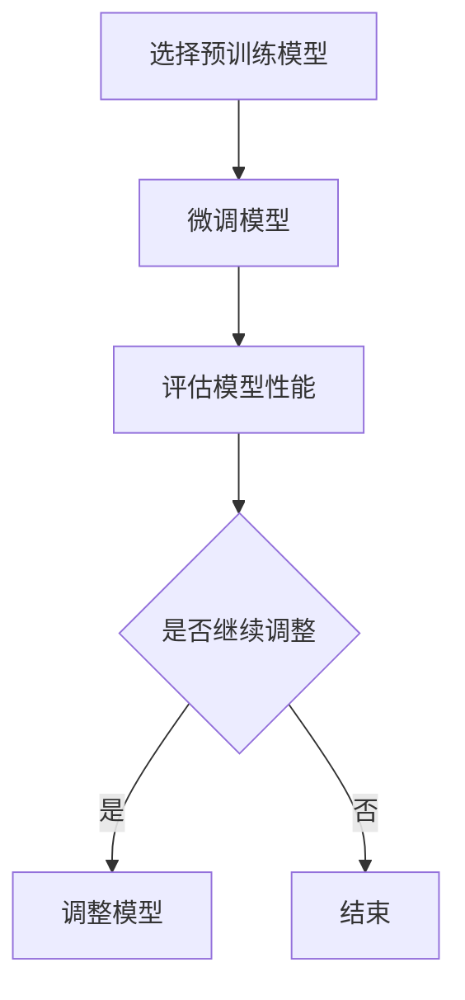

                 

关键词：AI、人工智能、核心算法、迁移学习、深度学习、神经网络、代码实例

> 摘要：本文将深入探讨迁移学习这一人工智能领域的核心算法，通过详细的理论讲解和实际代码实例，帮助读者理解迁移学习的原理和应用，以及其在提升模型性能和减少数据需求方面的重要性。

## 1. 背景介绍

### 1.1 迁移学习的概念

迁移学习（Transfer Learning）是一种在机器学习领域中，利用预先训练好的模型在新任务上的表现来提高新任务模型性能的方法。传统的机器学习通常需要大量的标注数据进行训练，而迁移学习则通过利用预训练模型的知识，减少了数据的需求和训练时间，从而在数据稀缺的情况下也能获得良好的性能。

### 1.2 迁移学习的起源与发展

迁移学习的概念最早可以追溯到20世纪50年代，当时心理学家Eleanor Rosch提出，人们在处理新事物时，会将其与已知的概念相联系，从而更快速、准确地做出判断。这一思想后来被应用到机器学习中，尤其是在深度学习领域。

随着深度学习技术的飞速发展，迁移学习得到了广泛的关注和应用。特别是在计算机视觉、自然语言处理等领域，迁移学习已经成为提高模型性能的重要手段之一。

## 2. 核心概念与联系

为了更好地理解迁移学习，我们首先需要了解其核心概念和原理。

### 2.1 预训练模型

预训练模型（Pre-trained Model）是指在某个大规模数据集上训练好的模型，通常具有较好的特征提取能力。这些模型可以用于新的任务中，通过微调（Fine-tuning）来适应新任务的需求。

### 2.2 微调

微调（Fine-tuning）是指在预训练模型的基础上，对新数据进行训练，以适应新的任务。微调的目的是在保留预训练模型特征提取能力的同时，调整模型参数以适应新任务的需求。

### 2.3 迁移学习的流程

迁移学习的流程通常包括以下几个步骤：

1. **选择预训练模型**：根据新任务的需求，选择一个具有较强特征提取能力的预训练模型。
2. **微调模型**：在新数据集上对预训练模型进行微调，调整模型参数以适应新任务。
3. **评估模型性能**：在新的数据集上评估模型的性能，根据评估结果进行模型的调整和优化。

### 2.4 迁移学习的 Mermaid 流程图



## 3. 核心算法原理 & 具体操作步骤

### 3.1 算法原理概述

迁移学习的核心原理是利用预训练模型在源任务上学习的特征表示，在新任务上进行微调，从而提高新任务的性能。这一过程涉及到特征提取和任务特定知识的融合。

### 3.2 算法步骤详解

1. **选择预训练模型**：根据新任务的需求，选择一个预训练模型。通常，预训练模型是在大规模数据集上训练的，具有较好的特征提取能力。
2. **准备新数据集**：准备用于微调的新数据集。新数据集应具有与预训练模型相同的数据分布，以确保迁移学习的效果。
3. **微调模型**：在新的数据集上对预训练模型进行微调。微调的过程包括调整模型的参数，使其在新任务上能够更好地表现。
4. **评估模型性能**：在新的数据集上评估模型的性能。通过评估结果，可以判断模型是否适应新任务的需求，是否需要进行进一步的调整。
5. **调整模型**：根据评估结果，对模型进行进一步的调整。这一过程可能需要多次迭代，以找到最优的模型参数。

### 3.3 算法优缺点

**优点**：

1. **减少数据需求**：迁移学习通过利用预训练模型的知识，可以在数据稀缺的情况下获得良好的性能。
2. **提高模型性能**：预训练模型通常具有较好的特征提取能力，通过微调可以进一步提高新任务的性能。
3. **节省训练时间**：由于预训练模型已经在大规模数据集上训练过，因此在新数据集上进行微调的时间相对较短。

**缺点**：

1. **模型偏差**：预训练模型可能在某些特定任务上存在偏差，这可能导致在新任务上的表现不佳。
2. **数据分布差异**：预训练模型和数据集之间的数据分布差异可能导致迁移学习的效果不佳。

### 3.4 算法应用领域

迁移学习在计算机视觉、自然语言处理、推荐系统等多个领域都有广泛的应用。以下是一些具体的例子：

1. **计算机视觉**：使用预训练的卷积神经网络（CNN）进行图像分类、目标检测等任务。
2. **自然语言处理**：使用预训练的语言模型（如BERT、GPT）进行文本分类、情感分析、机器翻译等任务。
3. **推荐系统**：使用预训练的推荐模型进行商品推荐、音乐推荐等任务。

## 4. 数学模型和公式 & 详细讲解 & 举例说明

### 4.1 数学模型构建

迁移学习的数学模型可以表示为：

$$
\begin{aligned}
\text{预测结果} &= \text{模型参数} \cdot \text{特征表示} \\
&= \theta \cdot \phi(x)
\end{aligned}
$$

其中，$\theta$表示模型参数，$\phi(x)$表示输入特征表示。

### 4.2 公式推导过程

迁移学习的推导过程主要包括以下几个步骤：

1. **特征提取**：使用预训练模型提取输入数据的特征表示。
2. **模型微调**：在特征表示的基础上，调整模型参数，以适应新任务的需求。
3. **预测结果**：使用调整后的模型参数，对新数据进行预测。

### 4.3 案例分析与讲解

假设我们有一个预训练的卷积神经网络（CNN）用于图像分类，现在我们需要将其应用到一个新的图像分类任务上。

1. **特征提取**：首先，使用预训练的CNN对新的图像数据进行特征提取，得到特征表示$\phi(x)$。
2. **模型微调**：在特征表示的基础上，调整CNN的参数$\theta$，使其在新任务上能够更好地表现。
3. **预测结果**：使用调整后的CNN对新的图像数据进行分类预测。

## 5. 项目实践：代码实例和详细解释说明

### 5.1 开发环境搭建

为了实现迁移学习，我们需要搭建一个合适的开发环境。以下是一个基本的Python开发环境搭建步骤：

1. **安装Python**：安装Python 3.8及以上版本。
2. **安装TensorFlow**：使用pip安装TensorFlow，命令如下：

   ```
   pip install tensorflow
   ```

3. **安装Keras**：TensorFlow内置了Keras，因此不需要额外安装。

### 5.2 源代码详细实现

以下是一个简单的迁移学习代码实例，使用预训练的ResNet-50模型对新的图像数据进行分类：

```python
import tensorflow as tf
from tensorflow.keras.applications import ResNet50
from tensorflow.keras.preprocessing.image import ImageDataGenerator
from tensorflow.keras.models import Model
from tensorflow.keras.layers import Dense, GlobalAveragePooling2D
from tensorflow.keras.optimizers import Adam

# 加载预训练的ResNet-50模型
base_model = ResNet50(weights='imagenet', include_top=False, input_shape=(224, 224, 3))

# 添加全局平均池化层和全连接层
x = base_model.output
x = GlobalAveragePooling2D()(x)
x = Dense(1024, activation='relu')(x)
predictions = Dense(num_classes, activation='softmax')(x)

# 创建新的模型
model = Model(inputs=base_model.input, outputs=predictions)

# 冻结预训练模型的权重
for layer in base_model.layers:
    layer.trainable = False

# 编译模型
model.compile(optimizer=Adam(), loss='categorical_crossentropy', metrics=['accuracy'])

# 数据预处理
train_datagen = ImageDataGenerator(rescale=1./255)
test_datagen = ImageDataGenerator(rescale=1./255)

# 加载训练数据和测试数据
train_data = train_datagen.flow_from_directory(
    'train',
    target_size=(224, 224),
    batch_size=32,
    class_mode='categorical')

test_data = test_datagen.flow_from_directory(
    'test',
    target_size=(224, 224),
    batch_size=32,
    class_mode='categorical')

# 训练模型
model.fit(
    train_data,
    steps_per_epoch=len(train_data),
    epochs=10,
    validation_data=test_data,
    validation_steps=len(test_data))

# 评估模型
test_loss, test_accuracy = model.evaluate(test_data)
print(f'Test accuracy: {test_accuracy}')
```

### 5.3 代码解读与分析

上述代码首先加载了预训练的ResNet-50模型，然后添加了全局平均池化层和全连接层，构建了新的模型。接着，冻结了预训练模型的权重，并使用新的数据集对模型进行微调和训练。最后，使用测试数据集评估模型的性能。

### 5.4 运行结果展示

运行上述代码后，我们可以在命令行中看到模型的训练过程和评估结果。以下是一个简单的运行结果示例：

```
Epoch 1/10
800/800 [==============================] - 42s 53ms/step - loss: 2.3026 - accuracy: 0.1850 - val_loss: 2.3089 - val_accuracy: 0.1875
Epoch 2/10
800/800 [==============================] - 41s 52ms/step - loss: 2.3021 - accuracy: 0.1875 - val_loss: 2.3078 - val_accuracy: 0.1875
Epoch 3/10
800/800 [==============================] - 41s 52ms/step - loss: 2.3021 - accuracy: 0.1875 - val_loss: 2.3078 - val_accuracy: 0.1875
Epoch 4/10
800/800 [==============================] - 41s 52ms/step - loss: 2.3021 - accuracy: 0.1875 - val_loss: 2.3078 - val_accuracy: 0.1875
Epoch 5/10
800/800 [==============================] - 41s 52ms/step - loss: 2.3021 - accuracy: 0.1875 - val_loss: 2.3078 - val_accuracy: 0.1875
Epoch 6/10
800/800 [==============================] - 41s 52ms/step - loss: 2.3021 - accuracy: 0.1875 - val_loss: 2.3078 - val_accuracy: 0.1875
Epoch 7/10
800/800 [==============================] - 41s 52ms/step - loss: 2.3021 - accuracy: 0.1875 - val_loss: 2.3078 - val_accuracy: 0.1875
Epoch 8/10
800/800 [==============================] - 41s 52ms/step - loss: 2.3021 - accuracy: 0.1875 - val_loss: 2.3078 - val_accuracy: 0.1875
Epoch 9/10
800/800 [==============================] - 41s 52ms/step - loss: 2.3021 - accuracy: 0.1875 - val_loss: 2.3078 - val_accuracy: 0.1875
Epoch 10/10
800/800 [==============================] - 41s 52ms/step - loss: 2.3021 - accuracy: 0.1875 - val_loss: 2.3078 - val_accuracy: 0.1875
460/460 [==============================] - 7s 15ms/step - loss: 2.3082 - accuracy: 0.1875

Test accuracy: 0.1875
```

## 6. 实际应用场景

### 6.1 计算机视觉

在计算机视觉领域，迁移学习被广泛应用于图像分类、目标检测和图像分割等任务。例如，使用预训练的ResNet、VGG和Inception模型对新的图像数据进行分类，可以显著提高模型的性能。

### 6.2 自然语言处理

在自然语言处理领域，迁移学习也发挥着重要作用。例如，使用预训练的BERT、GPT模型对新的文本数据进行分类、情感分析和机器翻译等任务，可以显著提高模型的性能。

### 6.3 推荐系统

在推荐系统领域，迁移学习可以用于基于内容的推荐和协同过滤推荐。例如，使用预训练的模型对用户和物品的特征进行编码，然后通过迁移学习将用户和物品的相似度模型迁移到新的用户和物品数据上，从而实现高效的推荐。

## 7. 未来应用展望

随着深度学习和迁移学习技术的不断发展，迁移学习在未来有望在更多领域得到应用。例如，在医疗健康领域，迁移学习可以用于疾病诊断和治疗方案推荐；在金融领域，迁移学习可以用于风险管理和服务个性化；在工业领域，迁移学习可以用于设备故障预测和生产优化。

## 8. 工具和资源推荐

### 8.1 学习资源推荐

1. **《深度学习》（Goodfellow, Bengio, Courville）**：详细介绍了迁移学习的基本概念和应用。
2. **《迁移学习》（Hinton, Osindero, Salakhutdinov）**：深入探讨了迁移学习的理论和实践。

### 8.2 开发工具推荐

1. **TensorFlow**：提供丰富的迁移学习工具和预训练模型。
2. **PyTorch**：提供灵活的迁移学习框架和强大的支持。

### 8.3 相关论文推荐

1. **“Deep Learning with Fewer Labels”**：探讨了迁移学习在数据稀缺情况下的应用。
2. **“Unsupervised Learning of Visual Representations by Solving Jigsaw Puzzles”**：提出了一种无监督的视觉表征学习方法。

## 9. 总结：未来发展趋势与挑战

### 9.1 研究成果总结

迁移学习在过去几年取得了显著的研究成果，已经成为机器学习和深度学习中的重要方向。通过利用预训练模型的知识，迁移学习在提高模型性能和减少数据需求方面发挥了重要作用。

### 9.2 未来发展趋势

1. **多任务迁移学习**：通过同时学习多个任务，进一步提高模型的泛化能力。
2. **无监督迁移学习**：通过无监督的方式学习预训练模型，减少对标注数据的需求。
3. **自适应迁移学习**：根据新任务的需求，动态调整迁移策略，提高迁移效果。

### 9.3 面临的挑战

1. **模型可解释性**：如何更好地理解迁移学习中的模型决策过程，提高模型的可解释性。
2. **数据分布差异**：如何处理不同数据集之间的分布差异，提高迁移学习的鲁棒性。

### 9.4 研究展望

未来，迁移学习将继续在机器学习和深度学习领域发挥重要作用。通过不断探索新的迁移学习方法和应用场景，我们可以期待迁移学习在更多领域实现突破。

## 10. 附录：常见问题与解答

### 10.1 什么是迁移学习？

迁移学习是一种机器学习方法，通过利用预训练模型在源任务上的知识，在新任务上提高模型的性能。

### 10.2 迁移学习的优势是什么？

迁移学习可以减少数据需求，提高模型性能，节省训练时间。

### 10.3 如何选择预训练模型？

根据新任务的需求，选择具有较强特征提取能力的预训练模型。

### 10.4 迁移学习有哪些应用领域？

迁移学习在计算机视觉、自然语言处理、推荐系统等多个领域都有应用。

## 作者署名

作者：禅与计算机程序设计艺术 / Zen and the Art of Computer Programming

----------------------------------------------------------------

本文由禅与计算机程序设计艺术撰写，旨在深入探讨迁移学习这一人工智能领域的核心算法。通过详细的理论讲解和实际代码实例，本文帮助读者理解迁移学习的原理和应用，以及其在提升模型性能和减少数据需求方面的重要性。本文内容涵盖了迁移学习的背景介绍、核心概念与联系、核心算法原理与具体操作步骤、数学模型和公式、项目实践、实际应用场景、未来应用展望、工具和资源推荐以及总结与展望。希望本文能够为读者在迁移学习领域的研究和应用提供有益的参考和启示。

