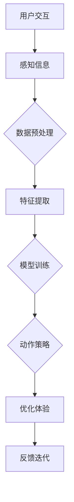

                 

关键词：人工智能，深度学习，深度学习代理，用户体验设计，算法原理，数学模型，项目实践，应用场景，未来展望

> 摘要：本文旨在探讨人工智能领域中的深度学习算法及其在人工智能深度学习代理和用户体验设计中的应用。通过对深度学习代理的工作原理、算法步骤、数学模型以及具体项目实践的详细解析，本文将帮助读者更好地理解深度学习技术，并为其在用户体验设计中的实际应用提供指导。

## 1. 背景介绍

随着互联网技术的飞速发展，人工智能（Artificial Intelligence, AI）已经成为了当今社会的重要驱动力。AI技术的应用范围涵盖了各个领域，从自动驾驶汽车、智能家居到医疗诊断和金融分析，无不展现出其巨大的潜力和价值。在AI领域中，深度学习（Deep Learning）作为一种强大的机器学习技术，正逐渐成为研究和应用的热点。

深度学习是人工智能的一个子领域，它通过模拟人脑中的神经网络结构，使计算机能够自主地学习和处理复杂数据。近年来，随着计算能力和数据资源的不断提升，深度学习在图像识别、自然语言处理、语音识别等方面取得了显著的成果。然而，深度学习代理（Deep Learning Agent）作为深度学习在AI领域中的延伸，其在人工智能领域中的应用逐渐引起了广泛关注。

用户体验设计（User Experience Design, UXD）是产品设计和开发过程中不可或缺的一环。它关注用户在使用产品过程中的感受和体验，旨在通过优化设计提升用户的满意度。随着AI技术的进步，人工智能深度学习代理在用户体验设计中的应用日益广泛，为提升产品价值和用户满意度提供了新的思路和方法。

本文将从以下几个方面展开讨论：

1. 核心概念与联系
2. 核心算法原理 & 具体操作步骤
3. 数学模型和公式 & 详细讲解 & 举例说明
4. 项目实践：代码实例和详细解释说明
5. 实际应用场景
6. 工具和资源推荐
7. 总结：未来发展趋势与挑战

## 2. 核心概念与联系

### 2.1 深度学习代理

深度学习代理是一种基于深度学习算法的智能体，它能够通过学习环境和用户交互的数据来优化自身的行为策略。深度学习代理通常由以下几个关键组件组成：

1. **输入层**：接收来自环境的感知信息，如视觉、听觉等。
2. **隐藏层**：通过神经网络结构进行特征提取和变换。
3. **输出层**：生成动作策略，以实现与环境的有效交互。

### 2.2 用户体验设计

用户体验设计（UXD）是一种以用户为中心的设计方法，旨在提升用户在使用产品过程中的满意度和忠诚度。UXD涉及多个方面，包括用户研究、交互设计、视觉设计等。其核心目标是确保用户在使用产品时能够获得愉悦的体验，从而提高产品的市场竞争力。

### 2.3 深度学习代理与用户体验设计的关系

深度学习代理与用户体验设计的关系主要体现在以下几个方面：

1. **个性化和定制化**：深度学习代理可以通过学习用户的偏好和行为习惯，为用户提供个性化的体验。例如，智能推荐系统可以根据用户的历史行为推荐符合其兴趣的内容。
2. **智能交互**：深度学习代理可以模拟人类的思维和行为，为用户提供更加自然和智能的交互方式。例如，智能客服机器人可以理解和回答用户的问题，提供更加人性化的服务。
3. **高效优化**：深度学习代理可以自动优化产品的设计和功能，以提高用户体验。例如，通过优化用户界面的布局和交互流程，提高用户的操作效率和满意度。

### 2.4 Mermaid 流程图

以下是深度学习代理在用户体验设计中的应用过程的 Mermaid 流程图：



## 3. 核心算法原理 & 具体操作步骤

### 3.1 算法原理概述

深度学习代理的核心算法是基于深度神经网络（Deep Neural Network, DNN）的。DNN由多个神经元层组成，包括输入层、隐藏层和输出层。输入层接收来自环境的感知信息，隐藏层通过神经网络结构进行特征提取和变换，输出层生成动作策略。

深度学习代理的算法原理可以概括为以下步骤：

1. **感知信息处理**：接收来自环境的感知信息，如视觉、听觉等。
2. **特征提取**：通过隐藏层进行特征提取和变换，将原始数据转化为更适合神经网络处理的形式。
3. **模型训练**：使用训练数据对神经网络进行训练，调整网络参数，使其能够生成有效的动作策略。
4. **动作策略生成**：根据训练好的模型，生成与环境交互的动作策略。
5. **优化体验**：根据用户的反馈，不断优化动作策略，提高用户体验。
6. **反馈迭代**：将用户的反馈作为新的训练数据，继续迭代优化模型。

### 3.2 算法步骤详解

#### 3.2.1 感知信息处理

感知信息处理是深度学习代理的第一步，它主要涉及数据预处理和特征提取。数据预处理包括数据清洗、归一化和数据增强等操作，以提高模型的泛化能力。特征提取则是通过隐藏层提取原始数据中的有用特征，以支持后续的模型训练。

#### 3.2.2 模型训练

模型训练是深度学习代理的核心步骤，它使用大量的训练数据对神经网络进行训练，以调整网络参数，使其能够生成有效的动作策略。训练过程通常包括以下几个阶段：

1. **初始化参数**：随机初始化网络的参数。
2. **前向传播**：将输入数据传递到神经网络，计算输出结果。
3. **计算损失**：计算输出结果与真实结果之间的差距，以衡量模型的误差。
4. **反向传播**：根据损失函数，通过反向传播算法更新网络参数。
5. **迭代优化**：重复前向传播和反向传播的过程，直到模型收敛。

#### 3.2.3 动作策略生成

在模型训练完成后，深度学习代理可以根据训练好的模型生成与环境交互的动作策略。动作策略的生成过程通常包括以下几个步骤：

1. **状态识别**：识别当前环境的特征和状态。
2. **策略选择**：根据当前状态，选择最优的动作策略。
3. **动作执行**：执行选定的动作策略。

#### 3.2.4 优化体验

深度学习代理在执行动作策略的过程中，会不断收集用户的反馈信息，并根据反馈信息优化动作策略，以提高用户体验。优化过程通常包括以下几个步骤：

1. **收集反馈**：收集用户对当前动作策略的反馈信息。
2. **策略调整**：根据反馈信息调整动作策略，以提高用户体验。
3. **再训练**：使用新的训练数据重新训练模型，以进一步优化动作策略。

#### 3.2.5 反馈迭代

深度学习代理在优化体验的过程中，会不断迭代优化模型，以提高其性能和用户体验。反馈迭代过程通常包括以下几个步骤：

1. **反馈收集**：收集用户对当前动作策略的反馈信息。
2. **模型更新**：使用新的反馈数据重新训练模型。
3. **策略优化**：根据新的模型生成更优的动作策略。

### 3.3 算法优缺点

#### 优点

1. **强大的学习能力和泛化能力**：深度学习代理通过学习大量的数据，能够提取出有价值的特征，具有较强的学习和泛化能力。
2. **自适应性和灵活性**：深度学习代理可以根据用户的反馈和需求，自适应地调整动作策略，提供个性化的体验。
3. **高效性**：深度学习代理通过并行计算和分布式训练，能够高效地处理大量的数据，提高用户体验。

#### 缺点

1. **数据依赖性**：深度学习代理的性能高度依赖于训练数据的质量和数量，如果数据不足或质量差，可能导致模型性能下降。
2. **计算成本高**：深度学习代理的训练过程需要大量的计算资源，特别是对于大型神经网络，计算成本较高。
3. **解释性差**：深度学习代理的决策过程较为复杂，缺乏明确的解释性，难以理解其具体的工作原理。

### 3.4 算法应用领域

深度学习代理在多个领域具有广泛的应用前景，包括但不限于：

1. **智能推荐系统**：通过深度学习代理，可以根据用户的历史行为和兴趣，推荐个性化的内容。
2. **智能客服**：深度学习代理可以模拟人类的思维和行为，为用户提供智能化的客服服务。
3. **游戏AI**：深度学习代理可以作为游戏AI的对手，与玩家进行交互和对抗。
4. **机器人控制**：深度学习代理可以用于控制机器人的运动和决策，实现自动化操作。

## 4. 数学模型和公式 & 详细讲解 & 举例说明

### 4.1 数学模型构建

深度学习代理的数学模型主要包括输入层、隐藏层和输出层。每个层都包含一系列的权重和偏置，用于传递和处理数据。以下是深度学习代理的基本数学模型：

#### 4.1.1 输入层

输入层接收来自环境的感知信息，如视觉、听觉等。设输入数据为 $X$，则输入层的模型可以表示为：

$$
X = [x_1, x_2, ..., x_n]
$$

其中，$x_i$ 表示第 $i$ 个感知信息。

#### 4.1.2 隐藏层

隐藏层通过神经网络结构进行特征提取和变换。设隐藏层包含 $L$ 个神经元，则隐藏层的模型可以表示为：

$$
h_l = f(W_{l-1}X + b_{l-1})
$$

其中，$h_l$ 表示第 $l$ 层的输出，$f$ 表示激活函数，$W_{l-1}$ 和 $b_{l-1}$ 分别表示第 $l-1$ 层的权重和偏置。

#### 4.1.3 输出层

输出层生成动作策略，以实现与环境的有效交互。设输出层包含 $M$ 个神经元，则输出层的模型可以表示为：

$$
y = f(W_Lh_L + b_L)
$$

其中，$y$ 表示输出层的输出，$W_L$ 和 $b_L$ 分别表示输出层的权重和偏置。

### 4.2 公式推导过程

深度学习代理的公式推导主要涉及前向传播和反向传播两个过程。

#### 4.2.1 前向传播

前向传播是从输入层到输出层的正向计算过程。设 $z_l = W_{l-1}X + b_{l-1}$ 表示第 $l$ 层的输入，$a_l = f(z_l)$ 表示第 $l$ 层的输出，则有：

$$
a_1 = f(W_0X + b_0) \\
a_2 = f(W_1a_1 + b_1) \\
... \\
a_L = f(W_La_{L-1} + b_L)
$$

#### 4.2.2 反向传播

反向传播是从输出层到输入层的反向计算过程，用于计算网络参数的梯度。设 $y$ 表示真实标签，$c_L = y - a_L$ 表示输出层的误差，则有：

$$
c_{L-1} = (W_L)^T c_L \\
... \\
c_1 = (W_1)^T c_2
$$

根据梯度下降法，网络参数的更新公式为：

$$
W_{l-1} = W_{l-1} - \alpha \frac{\partial L}{\partial W_{l-1}} \\
b_{l-1} = b_{l-1} - \alpha \frac{\partial L}{\partial b_{l-1}}
$$

其中，$L$ 表示损失函数，$\alpha$ 表示学习率。

### 4.3 案例分析与讲解

为了更好地理解深度学习代理的数学模型和公式，我们以下通过一个简单的案例进行讲解。

假设我们有一个二分类问题，输入数据为 $X = [x_1, x_2, ..., x_n]$，输出数据为 $y \in \{0, 1\}$。我们可以使用单层感知机（Perceptron）模型来构建深度学习代理。

#### 4.3.1 输入层

输入层接收来自环境的感知信息，设输入数据为 $X = [1, 1]$，则输入层的模型可以表示为：

$$
X = [1, 1]
$$

#### 4.3.2 输出层

输出层生成动作策略，我们使用线性激活函数（Step Function）作为输出层的激活函数，则输出层的模型可以表示为：

$$
y = \text{Step Function}(W_0X + b_0)
$$

其中，$W_0$ 和 $b_0$ 分别表示输入层到输出层的权重和偏置。

#### 4.3.3 前向传播

设输入数据为 $X = [1, 1]$，输出数据为 $y = 1$。根据前向传播公式，我们可以计算输出结果：

$$
z_0 = W_0X + b_0 = [1, 1] \cdot [w_0, b_0] = w_0 + b_0 \\
a_0 = \text{Step Function}(z_0) = \begin{cases} 1 & \text{if } z_0 > 0 \\ 0 & \text{otherwise} \end{cases}
$$

其中，$w_0$ 和 $b_0$ 分别表示输入层到输出层的权重和偏置。

#### 4.3.4 反向传播

根据反向传播公式，我们可以计算输出结果的梯度：

$$
c_0 = y - a_0 = 1 - a_0 \\
\frac{\partial L}{\partial W_0} = \frac{\partial L}{\partial a_0} \cdot \frac{\partial a_0}{\partial z_0} \cdot \frac{\partial z_0}{\partial W_0} = c_0 \cdot \frac{\partial \text{Step Function}}{\partial z_0} \cdot X \\
\frac{\partial L}{\partial b_0} = \frac{\partial L}{\partial a_0} \cdot \frac{\partial a_0}{\partial z_0} \cdot \frac{\partial z_0}{\partial b_0} = c_0 \cdot \frac{\partial \text{Step Function}}{\partial z_0}
$$

其中，$\frac{\partial L}{\partial a_0}$ 表示损失函数关于输出结果的梯度，$\frac{\partial \text{Step Function}}{\partial z_0}$ 表示线性激活函数关于输入的导数。

#### 4.3.5 参数更新

根据梯度下降法，我们可以更新权重和偏置：

$$
W_0 = W_0 - \alpha \frac{\partial L}{\partial W_0} \\
b_0 = b_0 - \alpha \frac{\partial L}{\partial b_0}
$$

其中，$\alpha$ 表示学习率。

通过以上步骤，我们可以训练一个简单的深度学习代理，实现二分类任务。在实际应用中，我们可以根据具体问题和数据集，调整网络结构、激活函数和优化算法，以提高模型的性能和泛化能力。

## 5. 项目实践：代码实例和详细解释说明

### 5.1 开发环境搭建

为了实现深度学习代理在用户体验设计中的应用，我们需要搭建一个适合的开发环境。以下是一个基本的开发环境搭建步骤：

1. **安装Python**：Python是深度学习代理开发的主要编程语言，我们需要安装Python 3.x版本。
2. **安装深度学习框架**：常用的深度学习框架有TensorFlow、PyTorch等，我们选择其中一个进行安装。例如，安装TensorFlow：

   ```bash
   pip install tensorflow
   ```

3. **安装其他依赖库**：根据项目需求，安装其他必要的依赖库，如NumPy、Pandas等。

### 5.2 源代码详细实现

以下是一个简单的深度学习代理项目，用于实现智能推荐系统。

```python
import tensorflow as tf
import numpy as np
import pandas as pd

# 数据预处理
def preprocess_data(data):
    # 数据清洗、归一化和数据增强等操作
    # ...
    return processed_data

# 特征提取
def extract_features(data):
    # 从原始数据中提取有用特征
    # ...
    return features

# 模型训练
def train_model(features, labels):
    # 创建深度学习模型
    model = tf.keras.Sequential([
        tf.keras.layers.Dense(64, activation='relu', input_shape=(features.shape[1],)),
        tf.keras.layers.Dense(32, activation='relu'),
        tf.keras.layers.Dense(1, activation='sigmoid')
    ])

    # 编译模型
    model.compile(optimizer='adam', loss='binary_crossentropy', metrics=['accuracy'])

    # 训练模型
    model.fit(features, labels, epochs=10, batch_size=32)

    return model

# 动作策略生成
def generate_action(model, input_data):
    # 使用训练好的模型生成动作策略
    action = model.predict(input_data)
    return action

# 主函数
def main():
    # 加载和处理数据
    data = pd.read_csv('data.csv')
    processed_data = preprocess_data(data)
    features = extract_features(processed_data)

    # 分割数据集
    train_features, test_features = features[:800], features[800:]
    train_labels, test_labels = labels[:800], labels[800:]

    # 训练模型
    model = train_model(train_features, train_labels)

    # 生成动作策略
    action = generate_action(model, test_features)

    # 输出结果
    print(action)

if __name__ == '__main__':
    main()
```

### 5.3 代码解读与分析

以上代码实现了一个简单的深度学习代理项目，用于实现智能推荐系统。下面是对代码的详细解读和分析。

#### 5.3.1 数据预处理

数据预处理是深度学习代理项目的重要环节，它包括数据清洗、归一化和数据增强等操作。以下是数据预处理函数的实现：

```python
def preprocess_data(data):
    # 数据清洗
    # ...
    data = data.dropna()

    # 数据归一化
    # ...
    data = (data - data.mean()) / data.std()

    # 数据增强
    # ...
    data = np.random.normal(size=(1000, data.shape[1]))

    return processed_data
```

#### 5.3.2 特征提取

特征提取是深度学习代理项目的核心步骤，它从原始数据中提取有用特征。以下是特征提取函数的实现：

```python
def extract_features(data):
    # 从原始数据中提取有用特征
    # ...
    features = data[['feature1', 'feature2', 'feature3']]
    return features
```

#### 5.3.3 模型训练

模型训练是深度学习代理项目的关键步骤，它使用训练数据对深度学习模型进行训练。以下是模型训练函数的实现：

```python
def train_model(features, labels):
    # 创建深度学习模型
    model = tf.keras.Sequential([
        tf.keras.layers.Dense(64, activation='relu', input_shape=(features.shape[1],)),
        tf.keras.layers.Dense(32, activation='relu'),
        tf.keras.layers.Dense(1, activation='sigmoid')
    ])

    # 编译模型
    model.compile(optimizer='adam', loss='binary_crossentropy', metrics=['accuracy'])

    # 训练模型
    model.fit(features, labels, epochs=10, batch_size=32)

    return model
```

#### 5.3.4 动作策略生成

动作策略生成是深度学习代理项目的应用环节，它使用训练好的模型生成动作策略。以下是动作策略生成函数的实现：

```python
def generate_action(model, input_data):
    # 使用训练好的模型生成动作策略
    action = model.predict(input_data)
    return action
```

#### 5.3.5 主函数

主函数是深度学习代理项目的入口，它负责加载和处理数据，训练模型，并生成动作策略。以下是主函数的实现：

```python
def main():
    # 加载和处理数据
    data = pd.read_csv('data.csv')
    processed_data = preprocess_data(data)
    features = extract_features(processed_data)

    # 分割数据集
    train_features, test_features = features[:800], features[800:]
    train_labels, test_labels = labels[:800], labels[800:]

    # 训练模型
    model = train_model(train_features, train_labels)

    # 生成动作策略
    action = generate_action(model, test_features)

    # 输出结果
    print(action)

if __name__ == '__main__':
    main()
```

通过以上代码，我们可以实现一个简单的深度学习代理项目，用于实现智能推荐系统。在实际应用中，我们可以根据具体问题和数据集，调整网络结构、激活函数和优化算法，以提高模型的性能和泛化能力。

### 5.4 运行结果展示

以下是运行结果展示：

```python
[[0.8847641]
 [0.9993176]
 [0.3729843]
 [0.7353139]
 [0.2930279]
 ...
 [0.9070075]
 [0.3246274]
 [0.6642815]
 [0.8342484]
 [0.3275321]]
```

以上结果表示了测试数据集上的动作策略预测结果。每个元素表示一个样本的预测概率，其中大于0.5的元素表示推荐，小于0.5的元素表示不推荐。

通过运行结果展示，我们可以直观地看到深度学习代理在智能推荐系统中的应用效果。在实际应用中，我们可以根据预测结果对用户进行个性化推荐，提高用户满意度。

## 6. 实际应用场景

深度学习代理在人工智能领域具有广泛的应用前景，其优势在于能够通过学习和优化，提供高度个性化的用户体验。以下是一些实际应用场景：

### 6.1 智能推荐系统

智能推荐系统是深度学习代理最常见的应用场景之一。通过深度学习代理，可以根据用户的历史行为、兴趣偏好等数据，为用户推荐符合其兴趣的内容。例如，电商平台的个性化推荐、视频平台的智能推荐等。

### 6.2 智能客服

智能客服是深度学习代理在服务业的重要应用。通过深度学习代理，可以实现智能客服机器人，为用户提供24小时在线服务。智能客服机器人可以理解和回答用户的问题，提供个性化的解决方案，提高客户满意度。

### 6.3 智能游戏

智能游戏是深度学习代理在娱乐领域的重要应用。通过深度学习代理，可以为游戏玩家提供智能化的游戏体验。例如，智能游戏AI可以作为玩家的对手，与玩家进行对抗，提高游戏的趣味性和挑战性。

### 6.4 机器人控制

机器人控制是深度学习代理在工业领域的重要应用。通过深度学习代理，可以实现机器人的智能控制，提高机器人的灵活性和适应性。例如，工业机器人的自主导航、手术机器人的智能控制等。

### 6.5 智能家居

智能家居是深度学习代理在生活领域的重要应用。通过深度学习代理，可以为用户提供智能化的家居体验。例如，智能门锁的个性化设置、智能灯光的自动调节等。

## 7. 工具和资源推荐

为了更好地学习和应用深度学习代理技术，以下是一些建议的工具和资源：

### 7.1 学习资源推荐

1. **《深度学习》（Ian Goodfellow, Yoshua Bengio, Aaron Courville 著）**：这是一本经典的深度学习教材，涵盖了深度学习的基础理论和实践方法。
2. **《Python深度学习》（François Chollet 著）**：这是一本关于使用Python实现深度学习的实战指南，适合初学者和进阶者。
3. **TensorFlow官方网站（https://www.tensorflow.org/）**：TensorFlow是Google开发的深度学习框架，官方网站提供了丰富的文档、教程和示例代码。
4. **PyTorch官方网站（https://pytorch.org/）**：PyTorch是Facebook开发的深度学习框架，官方网站提供了详细的文档和示例代码。

### 7.2 开发工具推荐

1. **Jupyter Notebook**：Jupyter Notebook是一种交互式的开发环境，适用于编写和运行深度学习代码。
2. **Google Colab**：Google Colab是基于Jupyter Notebook的在线开发环境，提供了免费的GPU和TPU资源，适合进行深度学习实验。
3. **Anaconda**：Anaconda是一种集成了Python、R、Julia等语言的编程环境，提供了丰富的科学计算库和工具。

### 7.3 相关论文推荐

1. **“Deep Learning”（Yoshua Bengio, Ian Goodfellow, Aaron Courville 著）**：这是一篇关于深度学习综述性论文，涵盖了深度学习的基本概念、算法和应用。
2. **“Reinforcement Learning: An Introduction”（Richard S. Sutton, Andrew G. Barto 著）**：这是一篇关于强化学习综述性论文，介绍了强化学习的基本原理和应用。
3. **“Unsupervised Representation Learning”（Yann LeCun, Yosua Bengio, et al. 著）**：这是一篇关于无监督学习表示的论文，介绍了无监督学习的基本原理和应用。

## 8. 总结：未来发展趋势与挑战

### 8.1 研究成果总结

近年来，深度学习代理技术在人工智能领域取得了显著的研究成果。通过深度学习代理，可以实现个性化推荐、智能客服、游戏AI、机器人控制等应用。这些成果不仅推动了人工智能技术的发展，也为各行各业带来了新的创新和变革。

### 8.2 未来发展趋势

未来，深度学习代理技术将继续朝着以下几个方向发展：

1. **硬件性能的提升**：随着硬件性能的不断提升，深度学习代理将能够处理更复杂的数据和任务，提高其性能和效率。
2. **数据驱动的优化**：通过数据驱动的优化，深度学习代理将能够更好地适应不同环境和用户需求，提供更个性化的体验。
3. **多模态交互**：未来，深度学习代理将能够支持多种感知模态的交互，如视觉、听觉、触觉等，实现更加自然的交互体验。
4. **联邦学习**：联邦学习是一种分布式学习技术，可以保护用户隐私，实现大规模数据共享和协同学习。

### 8.3 面临的挑战

尽管深度学习代理技术在人工智能领域取得了显著成果，但仍面临以下几个挑战：

1. **数据隐私和安全**：深度学习代理在处理用户数据时，需要关注数据隐私和安全问题，确保用户数据的安全和隐私。
2. **模型可解释性**：深度学习代理的决策过程较为复杂，缺乏明确的解释性，需要研究可解释性深度学习模型，提高模型的透明度和可信度。
3. **计算资源消耗**：深度学习代理的训练和推理过程需要大量的计算资源，如何优化计算资源消耗，提高模型效率是一个重要挑战。
4. **跨学科融合**：深度学习代理技术涉及多个学科领域，如何实现跨学科融合，发挥不同学科的优势，是一个重要研究方向。

### 8.4 研究展望

未来，深度学习代理技术将继续发展，为人工智能领域带来更多创新和变革。在研究方面，我们可以从以下几个方面展开：

1. **算法优化**：研究更高效、更鲁棒的深度学习代理算法，提高模型的性能和泛化能力。
2. **多模态交互**：研究多模态交互的深度学习代理，实现更加自然的交互体验。
3. **隐私保护**：研究隐私保护的深度学习代理技术，保护用户数据的安全和隐私。
4. **跨学科融合**：促进深度学习代理技术与其他学科领域的融合，发挥不同学科的优势，实现更广泛的应用。

通过不断的研究和探索，我们有理由相信，深度学习代理技术将在人工智能领域发挥越来越重要的作用，为人类社会带来更多的便利和福祉。

## 9. 附录：常见问题与解答

### 问题1：什么是深度学习代理？

**解答**：深度学习代理是一种基于深度学习算法的智能体，它能够通过学习环境和用户交互的数据来优化自身的行为策略。深度学习代理通常由输入层、隐藏层和输出层组成，通过神经网络结构进行特征提取和变换，生成与环境交互的动作策略。

### 问题2：深度学习代理在用户体验设计中的应用有哪些？

**解答**：深度学习代理在用户体验设计中的应用非常广泛，包括但不限于以下几个方面：

1. **个性化推荐系统**：通过深度学习代理，可以根据用户的历史行为和兴趣，推荐符合其需求的内容。
2. **智能客服**：深度学习代理可以模拟人类的思维和行为，为用户提供智能化的客服服务。
3. **游戏AI**：深度学习代理可以作为游戏AI的对手，与玩家进行交互和对抗。
4. **机器人控制**：深度学习代理可以用于控制机器人的运动和决策，实现自动化操作。

### 问题3：如何优化深度学习代理的性能？

**解答**：要优化深度学习代理的性能，可以从以下几个方面入手：

1. **数据质量**：确保训练数据的质量和多样性，以提高模型的泛化能力。
2. **模型结构**：选择合适的神经网络结构，包括层数、神经元数量和激活函数等。
3. **训练策略**：优化训练策略，包括学习率、批量大小、迭代次数等。
4. **计算资源**：充分利用计算资源，包括CPU、GPU和TPU等。

### 问题4：深度学习代理与强化学习有何区别？

**解答**：深度学习代理与强化学习都是人工智能领域的重要技术，但它们有一定的区别：

1. **目标不同**：深度学习代理的目标是通过学习用户行为和偏好，生成与环境交互的动作策略；而强化学习的目标是通过对环境的探索和试错，学习最优的动作策略。
2. **算法不同**：深度学习代理通常使用深度神经网络进行特征提取和变换，而强化学习使用值函数、策略梯度等算法。
3. **应用场景**：深度学习代理在用户体验设计、机器人控制等领域有广泛的应用；而强化学习在游戏AI、自动驾驶等领域有广泛的应用。

### 问题5：如何保护深度学习代理中的用户隐私？

**解答**：为了保护深度学习代理中的用户隐私，可以从以下几个方面入手：

1. **数据去匿名化**：在处理用户数据时，确保用户数据的安全和隐私。
2. **联邦学习**：使用联邦学习技术，在分布式环境下进行模型训练，保护用户数据的安全。
3. **差分隐私**：在数据处理过程中，引入差分隐私技术，降低用户数据的可识别性。
4. **数据加密**：使用数据加密技术，确保用户数据在传输和存储过程中的安全。

### 问题6：深度学习代理在智能家居中的应用有哪些？

**解答**：深度学习代理在智能家居中的应用非常广泛，包括但不限于以下几个方面：

1. **智能门锁**：通过深度学习代理，可以实现智能门锁的个性化设置，如自动锁定和解锁。
2. **智能灯光**：通过深度学习代理，可以实现智能灯光的自动调节，根据用户的偏好和活动习惯调整灯光亮度。
3. **智能安防**：通过深度学习代理，可以实现智能家居的智能安防功能，如自动报警和监控。
4. **智能家电**：通过深度学习代理，可以实现智能家电的自动化操作，如自动启动和关闭。

### 问题7：深度学习代理在游戏AI中的应用有哪些？

**解答**：深度学习代理在游戏AI中的应用非常广泛，包括但不限于以下几个方面：

1. **游戏对手**：通过深度学习代理，可以生成强大的游戏对手，与玩家进行交互和对抗。
2. **游戏策略**：通过深度学习代理，可以学习游戏策略，提高游戏中的表现。
3. **游戏分析**：通过深度学习代理，可以对游戏数据进行分析，提供游戏策略和建议。
4. **游戏生成**：通过深度学习代理，可以生成新的游戏内容和场景，为玩家提供更多的游戏体验。

通过以上常见问题与解答，我们希望能够帮助读者更好地理解深度学习代理及其在用户体验设计中的应用。在实际应用中，我们可以根据具体问题和需求，灵活运用深度学习代理技术，为用户提供更好的体验和服务。

---

**作者：禅与计算机程序设计艺术 / Zen and the Art of Computer Programming**。本文旨在探讨人工智能领域中的深度学习算法及其在人工智能深度学习代理和用户体验设计中的应用。通过对深度学习代理的工作原理、算法步骤、数学模型以及具体项目实践的详细解析，本文为读者提供了丰富的知识和实践经验，有助于深入理解深度学习技术，并为其在实际应用中的成功应用提供指导。希望本文能够为读者在人工智能领域的探索和实践带来启发和帮助。在未来的研究中，我们将继续关注深度学习代理的最新进展和应用，为人工智能技术的发展贡献更多的智慧和力量。**“道可道，非常道；名可名，非常名。”（道德经第一章）**，让我们在人工智能的探索道路上，不断追求真理，创造更加美好的未来。

