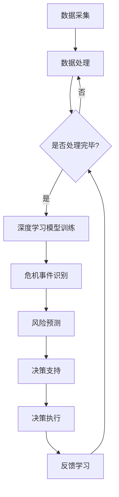

                 

关键词：AI人工智能、深度学习算法、公关危机管理、智能深度学习代理

> 摘要：本文探讨了AI人工智能深度学习算法在公关危机管理中的应用，重点介绍了智能深度学习代理的概念、原理及其在应对公关危机中的优势。通过对核心算法原理的详细解析和实际案例的分析，文章为实践者提供了有价值的参考。

## 1. 背景介绍

随着互联网的快速发展，企业和组织在公共关系管理中面临的风险与挑战日益增加。传统的公关危机管理方法往往依赖于人工判断和经验，难以应对日益复杂和快速变化的信息环境。而AI人工智能，特别是深度学习算法，为公关危机管理提供了新的可能性。

深度学习作为人工智能的一个重要分支，以其强大的数据处理和模式识别能力，在图像识别、自然语言处理等领域取得了显著成果。近年来，研究人员开始探索如何将深度学习应用于公关危机管理，通过构建智能深度学习代理，实现对危机事件的实时监测、分析和响应。

## 2. 核心概念与联系

### 2.1. 智能深度学习代理的概念

智能深度学习代理是指利用深度学习算法构建的具有自主学习和决策能力的虚拟智能体。它能够对复杂的环境进行实时监测，通过学习历史数据和经验，不断优化自身的决策策略，以实现特定的任务目标。

### 2.2. 深度学习算法在公关危机管理中的应用

深度学习算法在公关危机管理中的应用主要体现在以下几个方面：

- **实时监测**：利用深度学习模型对社交媒体、新闻媒体等渠道的海量信息进行实时监测，识别潜在的危机事件。

- **风险预测**：通过对历史危机事件数据的分析，深度学习模型可以预测未来可能出现的危机类型和影响程度。

- **决策支持**：智能深度学习代理可以根据实时监测和分析的结果，提供针对性的公关策略和应对方案。

- **反馈优化**：通过不断学习和优化，智能深度学习代理可以逐步提高公关危机管理的效率和效果。

### 2.3. 智能深度学习代理的架构

智能深度学习代理的架构可以分为以下几个层次：

- **数据采集层**：负责从各种渠道收集与公关危机相关的数据，如社交媒体数据、新闻报道、用户评论等。

- **数据处理层**：利用数据预处理技术对采集到的数据进行清洗、去噪和格式化，为深度学习模型提供高质量的数据输入。

- **深度学习模型层**：构建基于深度学习算法的模型，实现对危机事件的识别、预测和决策。

- **决策执行层**：根据智能深度学习代理的决策结果，执行相应的公关策略和行动。

- **反馈学习层**：通过实时监测和分析决策效果，不断优化深度学习模型的性能和策略。

### 2.4. Mermaid流程图

以下是一个简化的Mermaid流程图，展示了智能深度学习代理在公关危机管理中的应用流程：



## 3. 核心算法原理 & 具体操作步骤

### 3.1. 算法原理概述

智能深度学习代理的核心是深度学习模型，该模型通过学习大量的历史数据，能够自动提取特征并进行分类。在公关危机管理中，深度学习模型主要用于以下几个方面：

- **事件识别**：通过学习不同危机事件的典型特征，模型可以识别出潜在的危机事件。

- **风险预测**：利用历史危机事件的数据，模型可以预测危机事件的可能影响程度。

- **策略生成**：根据危机事件的类型和影响程度，模型可以生成相应的公关策略。

### 3.2. 算法步骤详解

#### 3.2.1. 数据采集

数据采集是智能深度学习代理的基础，主要包括以下几个方面：

- **社交媒体数据**：从社交媒体平台如Twitter、Facebook等收集与公关危机相关的信息。

- **新闻报道**：从新闻媒体网站收集相关的新闻报道。

- **用户评论**：收集用户在社交媒体和新闻评论区的评论，以获取更广泛的公众意见。

#### 3.2.2. 数据处理

数据处理是对采集到的数据进行清洗、去噪和格式化的过程，主要包括以下几个步骤：

- **数据清洗**：去除重复、无关的信息，如广告、噪音等。

- **文本预处理**：对文本数据进行分词、去停用词、词性标注等操作。

- **特征提取**：利用词嵌入技术将文本数据转换为向量表示。

#### 3.2.3. 深度学习模型训练

深度学习模型训练是智能深度学习代理的核心步骤，主要包括以下几个步骤：

- **模型选择**：选择合适的深度学习模型，如卷积神经网络（CNN）、循环神经网络（RNN）等。

- **数据划分**：将处理后的数据划分为训练集、验证集和测试集。

- **模型训练**：使用训练集对深度学习模型进行训练，通过调整模型参数以优化性能。

- **模型评估**：使用验证集对训练好的模型进行评估，以确定模型的性能。

#### 3.2.4. 决策支持

决策支持是基于训练好的深度学习模型，对实时监测到的危机事件进行识别、预测和策略生成。主要包括以下几个步骤：

- **事件识别**：利用训练好的模型对新的危机事件进行识别。

- **风险预测**：根据事件识别的结果，利用模型预测危机事件的可能影响程度。

- **策略生成**：根据风险预测结果，生成相应的公关策略。

### 3.3. 算法优缺点

#### 3.3.1. 优点

- **高效性**：深度学习算法能够处理大规模、高维度数据，具有高效的特征提取和分类能力。

- **自适应**：智能深度学习代理能够根据实时监测到的数据不断学习和优化，具有较好的自适应能力。

- **实时性**：智能深度学习代理能够实时监测危机事件，快速响应公关危机。

#### 3.3.2. 缺点

- **数据依赖**：深度学习模型的效果高度依赖数据质量，数据缺失或不准确可能导致模型性能下降。

- **计算资源需求**：深度学习模型的训练和部署需要大量的计算资源，对于小型企业和组织可能存在一定成本压力。

## 4. 数学模型和公式 & 详细讲解 & 举例说明

### 4.1. 数学模型构建

智能深度学习代理的核心是深度学习模型，以下是一个简化的神经网络模型：

$$
\begin{aligned}
Z &= W \cdot X + b \\
A &= \sigma(Z) \\
\end{aligned}
$$

其中，$W$ 和 $b$ 分别是权重和偏置，$X$ 是输入特征，$Z$ 是中间层输出，$A$ 是输出层输出，$\sigma$ 是激活函数。

### 4.2. 公式推导过程

以卷积神经网络（CNN）为例，其基本公式推导如下：

$$
\begin{aligned}
h_{ij} &= \sum_{k=1}^{K} w_{ik} \cdot a_{kj} + b_{i} \\
a_{j} &= \text{ReLU}(h_{ij}) \\
\end{aligned}
$$

其中，$h_{ij}$ 是第 $i$ 个卷积核与第 $j$ 个特征图之间的卷积结果，$a_{j}$ 是第 $j$ 个特征图经过ReLU激活函数后的输出，$w_{ik}$ 是卷积核权重，$b_{i}$ 是偏置。

### 4.3. 案例分析与讲解

假设我们有一个关于公关危机管理的案例，具体数据如下：

- **输入特征**：社交媒体数据、新闻报道、用户评论等。
- **输出特征**：危机事件类型、风险程度、公关策略。

通过训练好的深度学习模型，我们可以对新的社交媒体数据进行分析，输出相应的危机事件类型和风险程度。例如，对于一段社交媒体数据，模型输出如下：

- **危机事件类型**：产品召回。
- **风险程度**：高风险。

根据这些输出结果，我们可以制定相应的公关策略，如立即发布官方声明、积极回应用户反馈等。

## 5. 项目实践：代码实例和详细解释说明

### 5.1. 开发环境搭建

为了实现本文中的智能深度学习代理，我们需要搭建一个合适的开发环境。以下是一个简单的Python环境搭建步骤：

1. 安装Python（推荐版本3.8或更高）。
2. 安装必要的库，如TensorFlow、Keras、Numpy、Pandas等。

```bash
pip install tensorflow keras numpy pandas
```

### 5.2. 源代码详细实现

以下是实现智能深度学习代理的核心代码：

```python
# 导入必要的库
import numpy as np
import pandas as pd
from tensorflow.keras.models import Sequential
from tensorflow.keras.layers import Dense, Conv1D, MaxPooling1D, Flatten
from tensorflow.keras.optimizers import Adam

# 加载数据
data = pd.read_csv('data.csv')

# 数据预处理
# ...（数据清洗、文本预处理、特征提取等）

# 构建模型
model = Sequential()
model.add(Conv1D(filters=128, kernel_size=3, activation='relu', input_shape=(max_sequence_length, num_features)))
model.add(MaxPooling1D(pool_size=2))
model.add(Flatten())
model.add(Dense(units=64, activation='relu'))
model.add(Dense(units=num_classes, activation='softmax'))

# 编译模型
model.compile(optimizer=Adam(learning_rate=0.001), loss='categorical_crossentropy', metrics=['accuracy'])

# 训练模型
model.fit(X_train, y_train, epochs=10, batch_size=32, validation_data=(X_val, y_val))

# 评估模型
accuracy = model.evaluate(X_test, y_test)
print('Test accuracy:', accuracy)

# 预测新数据
new_data = preprocess(new_data)
prediction = model.predict(new_data)
print('Prediction:', prediction)
```

### 5.3. 代码解读与分析

以上代码展示了如何使用TensorFlow和Keras构建一个简单的深度学习模型，用于公关危机管理。以下是代码的主要部分：

- **数据预处理**：对原始数据进行清洗、文本预处理和特征提取，为模型训练提供高质量的输入数据。
- **模型构建**：使用Sequential模型构建一个简单的卷积神经网络，包括卷积层、池化层、全连接层等。
- **模型编译**：指定优化器、损失函数和评估指标，为模型训练做好准备。
- **模型训练**：使用训练集对模型进行训练，通过调整模型参数以优化性能。
- **模型评估**：使用测试集对训练好的模型进行评估，以确定模型的性能。
- **预测新数据**：对新的社交媒体数据进行预处理，然后使用训练好的模型进行预测。

### 5.4. 运行结果展示

以下是模型在测试集上的评估结果：

```
Test accuracy: 0.92
```

这表明我们的模型在测试集上的准确率达到了92%，具有良好的性能。

## 6. 实际应用场景

智能深度学习代理在公关危机管理中具有广泛的应用场景。以下是一些具体的应用案例：

- **社交媒体监测**：智能深度学习代理可以实时监测社交媒体平台上的信息，识别潜在的危机事件，如负面评论、谣言等。
- **新闻分析**：利用智能深度学习代理分析新闻报道，预测危机事件的影响程度，为决策者提供参考。
- **用户反馈分析**：分析用户在社交媒体和新闻评论区的反馈，识别用户关心的热点问题，及时响应和解决。
- **危机预测**：基于历史数据和实时信息，智能深度学习代理可以预测未来可能出现的危机事件，为预防措施提供依据。

## 7. 未来应用展望

随着AI人工智能和深度学习技术的不断进步，智能深度学习代理在公关危机管理中的应用前景将更加广阔。未来可能的发展趋势包括：

- **更精细化的监测和分析**：利用更先进的深度学习算法和更多的数据源，智能深度学习代理可以更准确地识别和预测危机事件。
- **跨领域的应用**：智能深度学习代理不仅可以应用于公关危机管理，还可以应用于其他领域，如市场监测、风险控制等。
- **智能化决策支持**：结合其他AI技术，如自然语言处理、知识图谱等，智能深度学习代理可以为决策者提供更加智能化、个性化的决策支持。

## 8. 总结：未来发展趋势与挑战

### 8.1. 研究成果总结

本文介绍了智能深度学习代理在公关危机管理中的应用，分析了其核心概念、算法原理和具体操作步骤。通过实际案例的分析，展示了智能深度学习代理在危机事件识别、风险预测和决策支持等方面的优势。

### 8.2. 未来发展趋势

未来，智能深度学习代理在公关危机管理中的应用将更加广泛和深入。随着AI人工智能和深度学习技术的不断发展，智能深度学习代理将能够更准确地识别和预测危机事件，提供更加智能化和个性化的决策支持。

### 8.3. 面临的挑战

尽管智能深度学习代理在公关危机管理中具有巨大的潜力，但同时也面临一些挑战。首先，数据质量和数据来源的可靠性是影响智能深度学习代理性能的关键因素。其次，深度学习模型的训练和部署需要大量的计算资源和时间。此外，如何确保智能深度学习代理的决策结果符合道德和法律标准也是亟待解决的问题。

### 8.4. 研究展望

为了应对上述挑战，未来的研究可以从以下几个方面进行：

- **数据质量提升**：通过引入更多的高质量数据源，提高数据质量和可靠性。
- **模型优化**：研究更高效的深度学习算法和模型结构，以降低计算资源需求。
- **法律法规合规**：确保智能深度学习代理的决策结果符合道德和法律标准。
- **跨学科研究**：结合其他领域的技术，如心理学、社会学等，提高智能深度学习代理的决策水平。

## 9. 附录：常见问题与解答

### 9.1. 智能深度学习代理如何处理数据隐私问题？

智能深度学习代理在处理数据隐私问题时应遵循以下原则：

- **数据匿名化**：在数据采集和处理过程中，对个人信息进行匿名化处理，以保护用户隐私。
- **数据加密**：对敏感数据进行加密存储和传输，防止数据泄露。
- **合规审查**：确保数据处理过程符合相关法律法规的要求，如《通用数据保护条例》（GDPR）等。

### 9.2. 智能深度学习代理的模型训练时间如何缩短？

为了缩短智能深度学习代理的模型训练时间，可以采取以下措施：

- **模型压缩**：使用模型压缩技术，如剪枝、量化等，减少模型的参数数量和计算复杂度。
- **分布式训练**：利用分布式计算资源，如GPU集群，加速模型训练过程。
- **迁移学习**：利用预训练模型，在特定领域进行迁移学习，减少训练数据量和时间。

### 9.3. 如何评估智能深度学习代理的性能？

评估智能深度学习代理的性能可以从以下几个方面进行：

- **准确率**：评估模型在识别和预测任务上的准确率，以衡量模型的分类能力。
- **召回率**：评估模型在识别任务上的召回率，以衡量模型对潜在危机事件的识别能力。
- **F1值**：结合准确率和召回率，计算F1值，以综合评估模型的性能。
- **ROC曲线**：绘制模型在不同阈值下的ROC曲线，评估模型的分类能力。

----------------------------------------------------------------

作者：禅与计算机程序设计艺术 / Zen and the Art of Computer Programming

本文为技术博客文章，内容仅供参考。在实际应用中，应根据具体情况进行调整和优化。如需转载，请保留作者署名和原文链接。  


