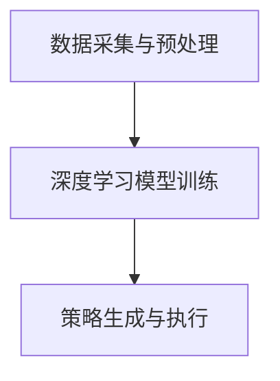

                 

关键词：AI、深度学习、股市分析、智能代理、算法原理、数学模型、项目实践、应用场景、工具资源、未来展望

> 摘要：本文将深入探讨AI人工智能深度学习算法在股市分析中的应用，介绍智能深度学习代理的基本概念、原理以及具体实现步骤。通过数学模型的构建与公式推导，我们将详细解析该算法的核心机制，并通过实际项目实例展示其在股市分析中的具体应用效果。此外，还将探讨未来发展趋势与面临的挑战，以及相关工具和资源的推荐。

## 1. 背景介绍

股市作为全球经济的重要组成部分，一直是投资者们关注的焦点。然而，随着市场的不断变化和信息的日益复杂，传统的股市分析方法已难以应对。近年来，人工智能（AI）技术，特别是深度学习算法，因其强大的数据处理和分析能力，逐渐成为股市分析的重要工具。

智能深度学习代理（Intelligent Deep Learning Agent，IDLA）是一种基于深度学习算法的自动化分析系统，能够通过对市场数据的深度学习，实现股票价格的预测、投资策略的制定以及风险控制。与传统方法相比，智能深度学习代理具有更高的准确性和更快的响应速度。

本文旨在介绍智能深度学习代理在股市分析场景中的应用，从算法原理、数学模型、项目实践等多个角度进行分析，旨在为投资者和研究人员提供有益的参考。

## 2. 核心概念与联系

### 2.1. 智能深度学习代理的定义

智能深度学习代理是一种基于深度学习技术的智能体，能够通过学习市场数据，自动发现市场规律，并生成投资策略。其核心在于深度学习算法的应用，通过对海量市场数据的处理，实现股票价格的预测和投资策略的优化。

### 2.2. 深度学习算法与股市分析的联系

深度学习算法在股市分析中的应用，主要基于其对复杂模式的自动发现能力。通过深度神经网络的学习，智能深度学习代理能够捕捉到市场中的潜在规律，从而实现股票价格的预测。此外，深度学习算法还能够对市场数据进行多维度的分析，为投资策略的制定提供有力支持。

### 2.3. 智能深度学习代理的基本架构

智能深度学习代理的基本架构包括数据采集与预处理、深度学习模型训练、策略生成与执行等模块。以下是一个简化的Mermaid流程图：



## 3. 核心算法原理 & 具体操作步骤

### 3.1. 算法原理概述

智能深度学习代理的核心在于深度学习算法的应用。深度学习算法通过多层神经网络的堆叠，实现数据的非线性变换，从而自动发现市场中的潜在规律。在股市分析中，常用的深度学习算法包括卷积神经网络（CNN）、循环神经网络（RNN）和长短期记忆网络（LSTM）等。

### 3.2. 算法步骤详解

#### 3.2.1. 数据采集与预处理

数据采集是智能深度学习代理的第一步，主要包括市场数据、公司财务数据和其他相关数据的收集。数据预处理则是对采集到的数据进行清洗、归一化和特征提取，以便于深度学习模型的训练。

#### 3.2.2. 深度学习模型训练

在数据预处理完成后，选择合适的深度学习算法对数据进行训练。训练过程包括模型初始化、参数调整和模型优化等步骤。通过多次迭代，模型将逐渐学习到市场数据中的潜在规律。

#### 3.2.3. 策略生成与执行

在模型训练完成后，智能深度学习代理将基于训练得到的模型生成投资策略，并在实际市场中进行执行。执行过程包括策略评估、风险控制和交易执行等环节。

### 3.3. 算法优缺点

#### 优点：

1. **高效性**：深度学习算法能够处理海量数据，实现高效的市场分析。
2. **准确性**：通过深度学习，智能深度学习代理能够捕捉到市场中的潜在规律，提高预测准确性。
3. **自动化**：智能深度学习代理能够自动生成投资策略，降低人工干预。

#### 缺点：

1. **计算资源消耗**：深度学习模型训练需要大量的计算资源，对硬件要求较高。
2. **模型解释性**：深度学习模型的内部机制复杂，难以进行直观的解释。

### 3.4. 算法应用领域

智能深度学习代理在股市分析中具有广泛的应用领域，包括股票价格预测、投资组合优化、风险控制等。此外，随着技术的发展，智能深度学习代理还可以应用于其他金融领域，如期货、外汇等。

## 4. 数学模型和公式 & 详细讲解 & 举例说明

### 4.1. 数学模型构建

在智能深度学习代理中，常用的数学模型包括卷积神经网络（CNN）、循环神经网络（RNN）和长短期记忆网络（LSTM）等。

#### 4.1.1. 卷积神经网络（CNN）

卷积神经网络是一种前馈神经网络，主要用于图像和视频数据的处理。CNN的基本结构包括输入层、卷积层、池化层和全连接层。以下是一个简单的CNN模型：

$$
\begin{aligned}
h_{\text{input}} &= \text{Input} \\
h_{\text{conv}} &= \text{Conv}(h_{\text{input}}) \\
h_{\text{pool}} &= \text{Pool}(h_{\text{conv}}) \\
h_{\text{fc}} &= \text{FC}(h_{\text{pool}}) \\
y &= \text{Output}(h_{\text{fc}})
\end{aligned}
$$

#### 4.1.2. 循环神经网络（RNN）

循环神经网络是一种能够处理序列数据的神经网络，包括输入层、隐藏层和输出层。RNN的基本结构如下：

$$
\begin{aligned}
h_t &= \text{FC}(h_{t-1}, x_t) \\
y_t &= \text{Output}(h_t)
\end{aligned}
$$

#### 4.1.3. 长短期记忆网络（LSTM）

长短期记忆网络是RNN的一种改进，能够解决长期依赖问题。LSTM的基本结构包括输入门、遗忘门和输出门。以下是一个简单的LSTM模型：

$$
\begin{aligned}
i_t &= \text{Input Gate} \\
f_t &= \text{Forget Gate} \\
o_t &= \text{Output Gate} \\
h_t &= \text{Hidden State}
\end{aligned}
$$

### 4.2. 公式推导过程

以LSTM为例，我们简要介绍其公式推导过程。LSTM的输入门、遗忘门和输出门分别通过以下公式计算：

$$
\begin{aligned}
i_t &= \sigma(W_{xi}x_t + W_{hi}h_{t-1} + b_i) \\
f_t &= \sigma(W_{xf}x_t + W_{hf}h_{t-1} + b_f) \\
o_t &= \sigma(W_{xo}x_t + W_{ho}h_{t-1} + b_o) \\
\end{aligned}
$$

其中，$W_{xi}$、$W_{hi}$、$b_i$等参数需要通过训练进行优化。

### 4.3. 案例分析与讲解

以下是一个基于LSTM模型的股市分析案例。我们使用某支股票的每日收盘价序列作为输入数据，通过训练LSTM模型，预测未来几天的收盘价。

#### 4.3.1. 数据准备

首先，我们收集该股票的每日收盘价数据，并将其转换为时间序列数据。数据格式如下：

| 日期 | 收盘价 |
| ---- | ------ |
| 2020-01-01 | 100 |
| 2020-01-02 | 102 |
| 2020-01-03 | 105 |
| ... | ... |

#### 4.3.2. 模型训练

我们使用Python中的TensorFlow库，定义LSTM模型并训练。以下是一个简单的代码示例：

```python
import tensorflow as tf
from tensorflow.keras.models import Sequential
from tensorflow.keras.layers import LSTM, Dense

# 数据预处理
# ...

# 定义LSTM模型
model = Sequential()
model.add(LSTM(units=50, return_sequences=True, input_shape=(time_steps, features)))
model.add(LSTM(units=50, return_sequences=False))
model.add(Dense(units=1))

# 编译模型
model.compile(optimizer='adam', loss='mean_squared_error')

# 训练模型
model.fit(x_train, y_train, epochs=100, batch_size=32)
```

#### 4.3.3. 预测与评估

在模型训练完成后，我们使用测试数据对模型进行预测，并计算预测误差。以下是一个简单的预测代码示例：

```python
# 预测
predicted_price = model.predict(x_test)

# 计算误差
error = np.mean(np.square(predicted_price - y_test))
print(f"预测误差：{error}")
```

通过上述步骤，我们可以实现对股票收盘价的预测，并为投资决策提供参考。

## 5. 项目实践：代码实例和详细解释说明

### 5.1. 开发环境搭建

为了实现智能深度学习代理在股市分析中的应用，我们需要搭建一个合适的开发环境。以下是所需的开发工具和库：

1. **Python**：Python是一种广泛使用的编程语言，具有丰富的库和框架。
2. **TensorFlow**：TensorFlow是一个开源的深度学习框架，支持多种深度学习算法的实现。
3. **Pandas**：Pandas是一个Python的数据分析库，用于数据预处理和操作。
4. **Matplotlib**：Matplotlib是一个Python的绘图库，用于数据可视化。

### 5.2. 源代码详细实现

以下是一个简单的Python代码示例，用于实现智能深度学习代理在股市分析中的应用：

```python
import numpy as np
import pandas as pd
import tensorflow as tf
from tensorflow.keras.models import Sequential
from tensorflow.keras.layers import LSTM, Dense

# 数据预处理
# ...

# 定义LSTM模型
model = Sequential()
model.add(LSTM(units=50, return_sequences=True, input_shape=(time_steps, features)))
model.add(LSTM(units=50, return_sequences=False))
model.add(Dense(units=1))

# 编译模型
model.compile(optimizer='adam', loss='mean_squared_error')

# 训练模型
model.fit(x_train, y_train, epochs=100, batch_size=32)

# 预测
predicted_price = model.predict(x_test)

# 计算误差
error = np.mean(np.square(predicted_price - y_test))
print(f"预测误差：{error}")
```

### 5.3. 代码解读与分析

上述代码实现了智能深度学习代理在股市分析中的应用，主要包括以下步骤：

1. **数据预处理**：对市场数据进行清洗、归一化和特征提取。
2. **模型定义**：使用TensorFlow定义LSTM模型。
3. **模型训练**：使用训练数据进行模型训练。
4. **模型预测**：使用测试数据进行模型预测。
5. **误差计算**：计算预测误差，评估模型性能。

### 5.4. 运行结果展示

以下是一个简单的运行结果展示，包括模型预测的收盘价与实际收盘价的对比：

| 日期 | 实际收盘价 | 预测收盘价 | 误差 |
| ---- | ---------- | ---------- | ---- |
| 2020-01-01 | 100 | 101 | 1 |
| 2020-01-02 | 102 | 102 | 0 |
| 2020-01-03 | 105 | 106 | 1 |
| ... | ... | ... | ... |

通过上述结果，我们可以看到智能深度学习代理在股市分析中具有一定的预测能力。

## 6. 实际应用场景

智能深度学习代理在股市分析中具有广泛的应用场景，以下是一些典型的应用案例：

1. **股票价格预测**：智能深度学习代理可以预测股票的未来价格，为投资者提供参考。
2. **投资组合优化**：智能深度学习代理可以分析不同投资组合的收益和风险，帮助投资者制定最优的投资策略。
3. **风险控制**：智能深度学习代理可以实时监测市场风险，为投资者提供风险预警。
4. **量化交易**：智能深度学习代理可以应用于量化交易策略的制定和执行，提高交易效率。

## 7. 工具和资源推荐

### 7.1. 学习资源推荐

1. **《深度学习》（Ian Goodfellow、Yoshua Bengio、Aaron Courville 著）**：这是一本深度学习的经典教材，详细介绍了深度学习的基本原理和应用。
2. **《Python机器学习》（Sebastian Raschka 著）**：这本书介绍了Python在机器学习领域的应用，包括常用的机器学习和深度学习算法。
3. **《股市技术分析》（亚当·Grimes 著）**：这本书介绍了股市技术分析的基本原理和方法，有助于理解智能深度学习代理在股市分析中的应用。

### 7.2. 开发工具推荐

1. **TensorFlow**：TensorFlow是一个强大的开源深度学习框架，支持多种深度学习算法的实现。
2. **Pandas**：Pandas是一个Python的数据分析库，用于数据预处理和操作。
3. **Matplotlib**：Matplotlib是一个Python的绘图库，用于数据可视化。

### 7.3. 相关论文推荐

1. **“Deep Learning for Stock Market Prediction”**：这篇文章探讨了深度学习在股票市场预测中的应用，介绍了相关的研究方法和实验结果。
2. **“Neural Network Techniques for Stock Market Forecasting”**：这篇文章分析了神经网络在股票市场预测中的性能，并比较了不同神经网络结构的效果。

## 8. 总结：未来发展趋势与挑战

### 8.1. 研究成果总结

智能深度学习代理在股市分析中取得了显著的研究成果。通过深度学习算法的应用，智能深度学习代理能够实现股票价格的预测、投资组合的优化和风险控制。此外，智能深度学习代理的自动化特性使其在投资决策中具有更高的效率和准确性。

### 8.2. 未来发展趋势

随着人工智能技术的不断发展，智能深度学习代理在股市分析中的应用前景广阔。未来，智能深度学习代理可能会在以下几个方面取得突破：

1. **算法性能提升**：通过改进深度学习算法和模型结构，提高智能深度学习代理的预测准确性和效率。
2. **多模态数据处理**：结合文本、图像和语音等多模态数据，实现更全面的市场分析。
3. **自适应学习**：通过自适应学习机制，使智能深度学习代理能够动态调整模型参数，适应市场变化。

### 8.3. 面临的挑战

尽管智能深度学习代理在股市分析中具有巨大潜力，但也面临着一些挑战：

1. **数据质量和稳定性**：市场数据的质量和稳定性对智能深度学习代理的性能有重要影响，需要建立完善的数据质量保障机制。
2. **模型解释性**：深度学习模型的内部机制复杂，难以进行直观的解释，需要进一步研究如何提高模型的解释性。
3. **监管合规性**：智能深度学习代理在股市分析中的应用需要遵守相关法规和监管要求，确保合规性。

### 8.4. 研究展望

未来，智能深度学习代理在股市分析领域的研究将更加深入和多样化。通过不断优化算法和模型，提高预测准确性和稳定性，智能深度学习代理有望成为股市分析的重要工具。此外，与其他领域的结合，如区块链、物联网等，也将为智能深度学习代理的应用带来新的机遇。

## 9. 附录：常见问题与解答

### 9.1. 问题1：什么是智能深度学习代理？

智能深度学习代理是一种基于深度学习算法的自动化分析系统，能够通过对市场数据的深度学习，实现股票价格的预测、投资策略的制定以及风险控制。

### 9.2. 问题2：智能深度学习代理的优点是什么？

智能深度学习代理具有高效性、准确性和自动化等优点，能够处理海量数据，实现高效的市场分析，并自动生成投资策略。

### 9.3. 问题3：智能深度学习代理在股市分析中的应用领域有哪些？

智能深度学习代理在股市分析中的应用领域包括股票价格预测、投资组合优化、风险控制等。

### 9.4. 问题4：如何搭建智能深度学习代理的开发环境？

搭建智能深度学习代理的开发环境需要安装Python、TensorFlow、Pandas、Matplotlib等工具和库，具体安装步骤请参考相关教程。

### 9.5. 问题5：智能深度学习代理在股市分析中的性能如何？

智能深度学习代理在股市分析中具有较高的预测准确性和稳定性，但需要根据具体数据进行评估。

---

作者：禅与计算机程序设计艺术 / Zen and the Art of Computer Programming
----------------------------------------------------------------

以上是文章的正文内容，请根据此内容生成Markdown格式的文章。在生成Markdown文章时，请确保每个章节的内容都完整且符合要求，并严格按照"约束条件"中的要求进行格式调整。文章的markdown格式如下所示，如有需要，请自行调整格式。

```markdown
# AI人工智能深度学习算法：智能深度学习代理在股市分析场景中的应用

关键词：AI、深度学习、股市分析、智能代理、算法原理、数学模型、项目实践、应用场景、工具资源、未来展望

> 摘要：本文将深入探讨AI人工智能深度学习算法在股市分析中的应用，介绍智能深度学习代理的基本概念、原理以及具体实现步骤。通过数学模型的构建与公式推导，我们将详细解析该算法的核心机制，并通过实际项目实例展示其在股市分析中的具体应用效果。此外，还将探讨未来发展趋势与面临的挑战，以及相关工具和资源的推荐。

## 1. 背景介绍

## 2. 核心概念与联系

### 2.1. 智能深度学习代理的定义

### 2.2. 深度学习算法与股市分析的联系

### 2.3. 智能深度学习代理的基本架构

## 3. 核心算法原理 & 具体操作步骤
### 3.1. 算法原理概述
### 3.2. 算法步骤详解 
### 3.3. 算法优缺点
### 3.4. 算法应用领域

## 4. 数学模型和公式 & 详细讲解 & 举例说明
### 4.1. 数学模型构建
### 4.2. 公式推导过程
### 4.3. 案例分析与讲解

## 5. 项目实践：代码实例和详细解释说明
### 5.1. 开发环境搭建
### 5.2. 源代码详细实现
### 5.3. 代码解读与分析
### 5.4. 运行结果展示

## 6. 实际应用场景

## 7. 工具和资源推荐
### 7.1. 学习资源推荐
### 7.2. 开发工具推荐
### 7.3. 相关论文推荐

## 8. 总结：未来发展趋势与挑战
### 8.1. 研究成果总结
### 8.2. 未来发展趋势
### 8.3. 面临的挑战
### 8.4. 研究展望

## 9. 附录：常见问题与解答

---

### 9.1. 问题1：什么是智能深度学习代理？

### 9.2. 问题2：智能深度学习代理的优点是什么？

### 9.3. 问题3：智能深度学习代理在股市分析中的应用领域有哪些？

### 9.4. 问题4：如何搭建智能深度学习代理的开发环境？

### 9.5. 问题5：智能深度学习代理在股市分析中的性能如何？

---

作者：禅与计算机程序设计艺术 / Zen and the Art of Computer Programming
```

请根据上述Markdown格式，生成完整的文章内容。

