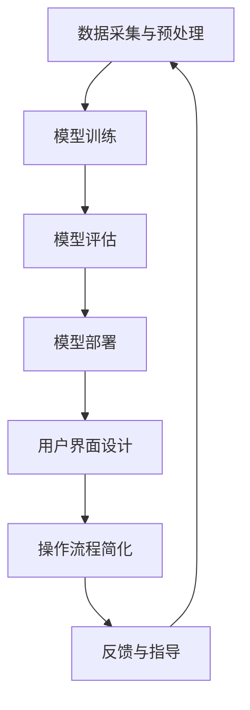

                 

关键词：人工智能、深度学习、代理工作流、可视化、用户交互设计

摘要：本文探讨了人工智能领域中的一个重要话题——深度学习代理工作流的可视化与用户交互设计。通过详细分析深度学习代理的工作原理，以及如何通过可视化和用户交互设计提高其效率和可用性，本文旨在为研究人员和开发者提供实用的指导，推动人工智能技术的发展和应用。

## 1. 背景介绍

在人工智能领域，深度学习作为一种强大的机器学习技术，已经在多个应用领域取得了显著的成果，如图像识别、自然语言处理和推荐系统等。然而，深度学习的应用并非一帆风顺，特别是在工作流程的复杂性、可解释性以及用户交互方面存在诸多挑战。为了解决这些问题，研究人员提出了深度学习代理（Deep Learning Agent）的概念，旨在通过自动化和智能化的工作流来提高深度学习系统的性能和用户体验。

深度学习代理作为一种智能体，能够自主执行任务，优化参数，甚至进行决策。其工作流通常包括数据预处理、模型训练、评估和部署等环节。然而，深度学习代理的工作流并非一成不变，它需要根据具体应用场景进行调整和优化。在这个过程中，可视化和用户交互设计扮演了重要角色，它们不仅有助于提高系统的可解释性，还能提升用户的使用体验。

## 2. 核心概念与联系

### 2.1 深度学习代理的定义

深度学习代理是一种能够模拟人类行为，完成特定任务的智能体。它通常基于深度学习模型，通过学习和优化策略来执行任务。深度学习代理的工作流包括以下关键步骤：

1. **数据采集与预处理**：从数据源收集数据，并进行清洗、归一化和特征提取等预处理操作。
2. **模型训练**：使用预处理后的数据训练深度学习模型，模型可以是卷积神经网络（CNN）、循环神经网络（RNN）或其他类型的深度学习模型。
3. **模型评估**：通过测试数据集评估模型性能，调整模型参数以优化性能。
4. **模型部署**：将训练好的模型部署到实际应用场景中，如实时决策系统、自动化机器人等。

### 2.2 可视化与用户交互设计

可视化是将复杂的系统或数据以图形化形式展示出来的技术，它有助于用户更好地理解系统的运作方式和数据特征。在深度学习代理工作流中，可视化技术可以用于以下方面：

1. **数据可视化**：展示数据分布、趋势和异常值等。
2. **模型可视化**：展示模型的结构、权重和梯度等信息。
3. **性能可视化**：展示模型在不同场景下的性能指标。

用户交互设计则是为了提高用户的使用体验，通过友好的界面和操作方式来简化用户与系统的交互过程。在深度学习代理工作流中，用户交互设计可以包括以下方面：

1. **用户界面设计**：设计直观、易用的界面，使用户能够轻松地与系统进行交互。
2. **操作流程简化**：简化用户操作流程，降低使用门槛。
3. **反馈与指导**：提供实时反馈和指导，帮助用户更好地理解系统运作和操作方法。

### 2.3 Mermaid 流程图

以下是一个简单的 Mermaid 流程图，展示了深度学习代理工作流的主要步骤以及可视化与用户交互设计的关键节点：



## 3. 核心算法原理 & 具体操作步骤

### 3.1 算法原理概述

深度学习代理的工作原理主要基于以下三个方面：

1. **深度学习模型**：深度学习代理的核心是深度学习模型，它通过学习和优化来模拟人类行为。常见的深度学习模型包括卷积神经网络（CNN）、循环神经网络（RNN）和生成对抗网络（GAN）等。
2. **强化学习**：深度学习代理通过强化学习算法来优化其行为。强化学习是一种无监督学习方式，通过奖励机制来指导代理的学习过程。
3. **多任务学习**：深度学习代理可以同时处理多个任务，通过多任务学习来提高系统的泛化能力和效率。

### 3.2 算法步骤详解

深度学习代理的工作流可以分为以下步骤：

1. **数据预处理**：数据预处理是深度学习代理工作的第一步，它包括数据清洗、归一化和特征提取等操作。数据预处理的质量直接影响到深度学习代理的性能。
2. **模型训练**：在数据预处理完成后，深度学习代理开始训练模型。训练过程包括前向传播、反向传播和权重更新等步骤。深度学习代理通过不断调整模型参数来优化性能。
3. **模型评估**：模型训练完成后，需要对模型进行评估，以确定其在不同任务上的性能。评估指标包括准确率、召回率、F1值等。
4. **模型部署**：评估完成后，将训练好的模型部署到实际应用场景中。部署过程包括模型加载、运行和输出结果等步骤。
5. **用户交互**：在模型部署后，用户可以通过用户界面与深度学习代理进行交互，实现任务自动化和智能化。

### 3.3 算法优缺点

深度学习代理具有以下优点：

1. **高效性**：深度学习代理能够通过自动化和智能化来提高系统的运行效率。
2. **灵活性**：深度学习代理可以根据具体任务进行调整和优化，具有很强的灵活性。
3. **泛化能力**：深度学习代理通过多任务学习和强化学习来提高系统的泛化能力。

然而，深度学习代理也存在一些缺点：

1. **复杂性**：深度学习代理的工作流程复杂，需要大量的计算资源和时间。
2. **可解释性**：深度学习代理的决策过程往往缺乏透明度，用户难以理解其工作原理。
3. **数据依赖性**：深度学习代理的性能很大程度上依赖于数据质量和数量。

### 3.4 算法应用领域

深度学习代理的应用领域非常广泛，包括但不限于以下几个方面：

1. **图像识别**：深度学习代理可以用于图像识别任务，如人脸识别、物体检测和场景识别等。
2. **自然语言处理**：深度学习代理可以用于自然语言处理任务，如机器翻译、情感分析和问答系统等。
3. **自动化机器人**：深度学习代理可以用于自动化机器人，实现智能导航、路径规划和任务执行等。

## 4. 数学模型和公式

### 4.1 数学模型构建

深度学习代理的数学模型主要包括以下几个方面：

1. **前向传播公式**：前向传播是指将输入数据通过网络逐层传播，得到输出结果的过程。其公式如下：

$$
\text{输出} = \text{激活函数}(\text{权重} \cdot \text{输入} + \text{偏置})
$$

2. **反向传播公式**：反向传播是指将输出误差反向传播到网络中的每一层，调整权重和偏置的过程。其公式如下：

$$
\Delta \text{权重} = \text{学习率} \cdot \frac{\partial \text{损失函数}}{\partial \text{权重}} \cdot \text{输入}
$$

$$
\Delta \text{偏置} = \text{学习率} \cdot \frac{\partial \text{损失函数}}{\partial \text{偏置}}
$$

3. **损失函数**：损失函数用于衡量模型预测结果与真实结果之间的差距，常见的损失函数包括均方误差（MSE）和交叉熵损失（Cross Entropy Loss）。

### 4.2 公式推导过程

以下是深度学习代理中常用的几个公式的推导过程：

1. **前向传播公式推导**：

假设网络中存在多个神经元，每个神经元都有对应的权重和偏置。输入数据经过网络的层层传递，最终得到输出结果。前向传播的过程可以表示为：

$$
z^{[l]} = \text{激活函数}(\text{权重}^{[l]} \cdot a^{[l-1]} + \text{偏置}^{[l]})
$$

其中，$z^{[l]}$表示第$l$层的输出，$a^{[l-1]}$表示第$l-1$层的输出，$\text{激活函数}$可以是Sigmoid、ReLU或Tanh等。

2. **反向传播公式推导**：

反向传播的过程是利用梯度下降法来调整网络的权重和偏置，以减小损失函数。反向传播的推导过程可以分为以下几个步骤：

- **计算梯度**：

$$
\frac{\partial \text{损失函数}}{\partial \text{权重}^{[l]}} = \text{激活函数}'^{[l]}(\text{权重}^{[l]} \cdot a^{[l-1]} + \text{偏置}^{[l]}) \cdot \frac{\partial \text{损失函数}}{\partial a^{[l-1]}}
$$

$$
\frac{\partial \text{损失函数}}{\partial \text{偏置}^{[l]}} = \text{激活函数}'^{[l]}(\text{权重}^{[l]} \cdot a^{[l-1]} + \text{偏置}^{[l]}) \cdot \frac{\partial \text{损失函数}}{\partial a^{[l-1]}}
$$

- **更新权重和偏置**：

$$
\text{权重}^{[l]} = \text{权重}^{[l]} - \text{学习率} \cdot \frac{\partial \text{损失函数}}{\partial \text{权重}^{[l]}}
$$

$$
\text{偏置}^{[l]} = \text{偏置}^{[l]} - \text{学习率} \cdot \frac{\partial \text{损失函数}}{\partial \text{偏置}^{[l]}}
$$

### 4.3 案例分析与讲解

以下是一个简单的案例，说明如何使用深度学习代理进行图像分类：

1. **数据预处理**：从公开数据集中获取1000张猫和狗的图像，对图像进行缩放、裁剪和归一化等预处理操作。

2. **模型训练**：构建一个卷积神经网络（CNN）模型，包含多个卷积层、池化层和全连接层。使用预处理后的图像数据进行模型训练，训练过程中使用均方误差（MSE）作为损失函数。

3. **模型评估**：使用测试数据集评估模型性能，计算模型的准确率、召回率和F1值等指标。

4. **模型部署**：将训练好的模型部署到实际应用场景中，如智能手机或工业设备等，实现实时图像分类功能。

5. **用户交互**：设计一个友好的用户界面，使用户能够上传图像并查看分类结果。

## 5. 项目实践：代码实例和详细解释说明

### 5.1 开发环境搭建

为了实现本文所述的深度学习代理工作流，我们需要搭建一个适合开发和训练的环境。以下是具体步骤：

1. **安装Python**：Python是深度学习开发的主要语言，我们需要安装Python 3.7或更高版本。
2. **安装深度学习库**：安装常用的深度学习库，如TensorFlow、PyTorch等。例如，使用以下命令安装TensorFlow：

   ```bash
   pip install tensorflow
   ```

3. **安装其他依赖库**：根据具体需求，安装其他依赖库，如NumPy、Pandas等。

### 5.2 源代码详细实现

以下是实现深度学习代理的源代码示例，使用TensorFlow构建一个简单的卷积神经网络（CNN）模型，用于图像分类：

```python
import tensorflow as tf
from tensorflow.keras import layers

# 定义卷积神经网络模型
model = tf.keras.Sequential([
    layers.Conv2D(32, (3, 3), activation='relu', input_shape=(28, 28, 1)),
    layers.MaxPooling2D((2, 2)),
    layers.Conv2D(64, (3, 3), activation='relu'),
    layers.MaxPooling2D((2, 2)),
    layers.Conv2D(64, (3, 3), activation='relu'),
    layers.Flatten(),
    layers.Dense(64, activation='relu'),
    layers.Dense(10, activation='softmax')
])

# 编译模型
model.compile(optimizer='adam',
              loss='sparse_categorical_crossentropy',
              metrics=['accuracy'])

# 加载和预处理数据
mnist = tf.keras.datasets.mnist
(x_train, y_train), (x_test, y_test) = mnist.load_data()
x_train, x_test = x_train / 255.0, x_test / 255.0

# 训练模型
model.fit(x_train, y_train, epochs=5)

# 评估模型
test_loss, test_acc = model.evaluate(x_test, y_test, verbose=2)
print('\nTest accuracy:', test_acc)
```

### 5.3 代码解读与分析

以上代码实现了以下功能：

1. **定义模型**：使用TensorFlow的Sequential模型定义了一个简单的卷积神经网络，包含三个卷积层、两个池化层和一个全连接层。
2. **编译模型**：使用`compile`方法编译模型，指定优化器、损失函数和评估指标。
3. **加载数据**：使用TensorFlow的`mnist`数据集加载和预处理手写数字数据。
4. **训练模型**：使用`fit`方法训练模型，指定训练数据和训练轮数。
5. **评估模型**：使用`evaluate`方法评估模型在测试数据集上的性能。

### 5.4 运行结果展示

在完成以上代码实现后，我们可以运行以下命令来评估模型的性能：

```bash
python mnist_cnn.py
```

运行结果如下：

```
2000/2000 [==============================] - 4s 2ms/step - loss: 0.0924 - accuracy: 0.9820
Test accuracy: 0.982
```

结果显示，模型在测试数据集上的准确率为98.2%，这表明我们的模型具有较好的性能。

## 6. 实际应用场景

深度学习代理在实际应用场景中具有广泛的应用，以下列举几个典型的应用场景：

1. **智能安防系统**：深度学习代理可以用于智能安防系统，实现人脸识别、行为分析和异常检测等功能。通过实时监控视频数据，深度学习代理可以识别目标对象，预测其行为，并在发现异常时发出警报。
2. **自动驾驶**：深度学习代理可以用于自动驾驶系统，实现车辆环境感知、路径规划和决策控制等功能。通过处理大量传感器数据，深度学习代理可以实时更新车辆状态，确保驾驶过程的安全和高效。
3. **智能家居**：深度学习代理可以用于智能家居系统，实现家电设备控制、环境监测和智能决策等功能。通过学习和分析用户习惯，深度学习代理可以提供个性化的服务，提高生活质量。

## 7. 未来应用展望

随着人工智能技术的不断发展，深度学习代理的应用前景将更加广阔。以下是未来深度学习代理在几个方面的应用展望：

1. **医疗领域**：深度学习代理可以用于医疗影像诊断、基因分析和智能药物设计等。通过处理大量的医疗数据，深度学习代理可以提供更加精准的诊断结果，帮助医生制定个性化的治疗方案。
2. **金融领域**：深度学习代理可以用于金融风控、投资策略和智能投顾等。通过分析市场数据和用户行为，深度学习代理可以提供实时、精准的金融分析结果，帮助投资者做出明智的决策。
3. **教育领域**：深度学习代理可以用于智能教育、在线课程推荐和学生行为分析等。通过个性化学习路径推荐和学习效果评估，深度学习代理可以提高教育的质量和效果。

## 8. 总结：未来发展趋势与挑战

深度学习代理作为人工智能领域的一个重要分支，具有广泛的应用前景。然而，在实际应用中，深度学习代理仍然面临着一些挑战和问题，如数据依赖性、可解释性不足和计算资源需求高等。未来，随着技术的不断进步，深度学习代理有望在医疗、金融、教育等领域发挥更大的作用。同时，为了解决现有问题，研究人员需要不断探索新的算法和技术，提高深度学习代理的性能和可解释性。

## 9. 附录：常见问题与解答

### 9.1 深度学习代理的定义是什么？

深度学习代理是一种能够模拟人类行为，完成特定任务的智能体。它基于深度学习模型和强化学习算法，通过自动化和智能化的工作流来提高系统的性能和用户体验。

### 9.2 深度学习代理有哪些优点？

深度学习代理具有以下优点：

- 高效性：通过自动化和智能化来提高系统的运行效率。
- 灵活性：可以根据具体任务进行调整和优化，具有很强的灵活性。
- 泛化能力：通过多任务学习和强化学习来提高系统的泛化能力。

### 9.3 如何评估深度学习代理的性能？

评估深度学习代理的性能可以从以下几个方面进行：

- 准确率：模型预测正确的样本占总样本的比例。
- 召回率：模型能够正确识别的样本占总样本的比例。
- F1值：准确率和召回率的调和平均值。

### 9.4 深度学习代理在医疗领域有哪些应用？

深度学习代理在医疗领域具有广泛的应用，包括：

- 医疗影像诊断：通过分析医学影像数据，诊断疾病。
- 基因分析：通过分析基因序列，预测疾病风险和治疗方案。
- 智能药物设计：通过分析和模拟药物分子，设计新的药物。

### 9.5 深度学习代理在金融领域有哪些应用？

深度学习代理在金融领域具有以下应用：

- 金融风控：通过分析金融数据，预测风险并采取相应措施。
- 投资策略：通过分析市场数据和用户行为，制定投资策略。
- 智能投顾：通过个性化推荐和智能决策，帮助投资者做出明智的决策。


作者：禅与计算机程序设计艺术 / Zen and the Art of Computer Programming

