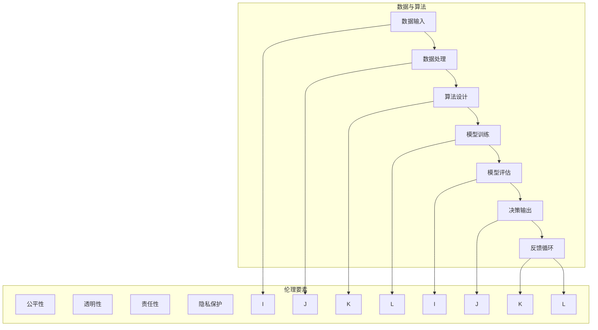

                 

### 关键词 Keywords
AI伦理、信息准确性、可靠性、信息质量、可信AI、数据隐私、算法透明度、道德法律规范

<|assistant|>### 摘要 Summary
本文深入探讨了人工智能（AI）领域在确保信息准确性和可靠性方面所面临的伦理挑战。随着AI技术的迅猛发展，其对信息处理和决策的依赖性日益增强，因此，如何在AI系统中保障信息的准确性和可靠性成为了一个重要的伦理问题。本文首先介绍了AI伦理的核心概念和原则，然后分析了当前在信息准确性方面存在的主要问题，包括数据偏差、算法偏见、隐私泄露等。接着，本文提出了若干策略和建议，旨在通过技术手段、法律监管和道德教育等多方面来解决这些问题，并展望了未来AI伦理发展的趋势和面临的挑战。

## 1. 背景介绍

人工智能作为一种能够模拟、扩展和辅助人类智能的技术，正迅速融入我们日常生活的方方面面。从智能手机、自动驾驶汽车，到金融分析、医疗诊断，AI的应用场景越来越广泛。然而，随着AI技术的发展，一系列伦理问题也逐渐显现出来，尤其是在信息准确性和可靠性方面。信息准确性指的是AI系统能够正确理解和处理输入数据的能力，而可靠性则涉及到AI系统在不同环境下持续稳定地执行任务的能力。这两个方面是AI伦理的核心，因为它们直接关系到AI系统的决策质量和实际应用效果。

### 1.1 伦理问题的来源

AI伦理问题主要来源于以下几个方面：

- **数据偏差**：AI系统的训练数据可能存在偏差，导致模型在处理某些特定群体或情境时产生不公平或错误的判断。
- **算法偏见**：算法设计中的某些隐含假设可能会放大或固化社会偏见，导致对特定群体的歧视性决策。
- **隐私泄露**：AI技术往往需要大量个人数据作为输入，这些数据的管理不当可能引发隐私泄露风险。
- **透明度和可解释性**：AI系统的决策过程往往是非透明的，使得用户难以理解其决策逻辑，从而影响了用户的信任度。

### 1.2 伦理原则与规范

AI伦理的基本原则包括：

- **公平性**：确保AI系统在决策过程中对所有人公平，不应因种族、性别、年龄等因素而产生歧视。
- **透明性**：AI系统的决策过程应该是透明的，用户应该能够理解和追踪其决策逻辑。
- **责任性**：AI系统的设计者和使用者应对系统的行为负责，确保其符合伦理和法律标准。
- **隐私保护**：在收集和使用个人数据时，应严格遵守隐私保护原则，确保数据的安全和隐私。

## 2. 核心概念与联系

为了深入理解AI伦理中的信息准确性和可靠性问题，我们需要探讨一些核心概念及其相互之间的联系。以下是一个使用Mermaid绘制的流程图，展示了这些核心概念之间的关系。



### 2.1 数据输入

数据输入是AI系统的起点，其质量直接影响到后续处理和决策的准确性。为了保证数据的准确性，我们需要确保：

- 数据的完整性和真实性：避免缺失值、错误值和伪造数据。
- 数据的多样性和代表性：确保数据集能够覆盖不同群体和情境，减少数据偏差。

### 2.2 数据处理

数据处理是数据输入后的预处理步骤，包括数据清洗、归一化、特征提取等。这一步骤的目标是提高数据的可用性和一致性。

### 2.3 算法设计

算法设计决定了AI系统的决策逻辑和处理能力。为了确保算法的可靠性，我们需要：

- 选择合适的算法：根据应用场景选择最适合的算法。
- 优化算法参数：通过调整算法参数来提高模型的性能和稳定性。

### 2.4 模型训练

模型训练是将数据转化为模型参数的过程。在这一过程中，我们需要：

- 使用高质量的训练数据：确保数据的准确性和多样性。
- 选择合适的训练策略：包括优化器选择、学习率调整等。

### 2.5 模型评估

模型评估是对训练好的模型进行性能测试的过程。常用的评估指标包括准确率、召回率、F1值等。通过模型评估，我们可以：

- 确认模型的可靠性：确保模型在不同数据集上的表现一致。
- 识别模型存在的问题：如过拟合、欠拟合等。

### 2.6 决策输出

决策输出是AI系统最终的输出结果，其准确性直接影响到实际应用的效果。为了确保决策输出的可靠性，我们需要：

- 对决策过程进行解释：提高决策的可理解性和可解释性。
- 建立反馈机制：通过用户反馈来不断优化模型和算法。

### 2.7 反馈循环

反馈循环是AI系统不断优化和改进的重要环节。通过收集用户反馈和数据，我们可以：

- 识别模型和算法的改进方向。
- 提高系统的适应性和鲁棒性。

## 3. 核心算法原理 & 具体操作步骤

### 3.1 算法原理概述

在确保信息准确性和可靠性的过程中，常用的核心算法包括数据清洗算法、特征提取算法和分类算法等。以下将分别介绍这些算法的原理和操作步骤。

### 3.2 数据清洗算法

数据清洗是确保数据准确性的重要步骤。常见的清洗算法包括缺失值处理、异常值处理和噪声处理等。

#### 3.2.1 缺失值处理

- **填充法**：使用平均值、中位数或最频繁值来填充缺失值。
- **插值法**：使用线性或非线性插值方法来估算缺失值。
- **删除法**：直接删除含有缺失值的记录。

#### 3.2.2 异常值处理

- **阈值法**：根据数据的统计分布，设定一个阈值，超出阈值的值被视为异常值。
- **聚类法**：使用聚类算法识别异常值，然后对异常值进行处理。
- **回归法**：使用回归模型预测正常值，然后对预测误差较大的值进行处理。

#### 3.2.3 噪声处理

- **滤波法**：使用滤波器去除噪声，如移动平均滤波器、中值滤波器等。
- **去卷积法**：使用去卷积算法来恢复原始信号，从而去除噪声。

### 3.3 特征提取算法

特征提取是将原始数据转换为有助于模型训练的特征表示的过程。常用的特征提取算法包括：

- **主成分分析（PCA）**：通过线性变换将原始数据投影到新的正交坐标系上，保留主要特征。
- **线性判别分析（LDA）**：通过最大化类间方差和最小化类内方差，将数据投影到新的坐标系上，以实现分类。
- **深度特征提取**：使用深度神经网络提取层次化的特征表示。

### 3.4 分类算法

分类算法是将数据分为不同类别的过程，常用的分类算法包括：

- **朴素贝叶斯分类器**：基于贝叶斯定理和特征条件独立假设进行分类。
- **支持向量机（SVM）**：通过寻找最佳超平面将数据分为不同类别。
- **决策树**：通过一系列判断条件将数据划分为不同的分支，最终达到分类的目的。
- **随机森林**：通过构建多个决策树，并对预测结果进行投票来提高分类准确性。

### 3.5 算法优缺点

每种算法都有其独特的优势和局限性。例如：

- **数据清洗算法**：能够有效提高数据的准确性，但可能引入偏差和过度拟合。
- **特征提取算法**：有助于减少数据维度和提高分类效果，但可能损失一些有用的信息。
- **分类算法**：能够进行准确的分类，但可能受到数据分布和噪声的影响。

### 3.6 算法应用领域

这些算法在各个领域都有广泛的应用，例如：

- **金融**：用于风险管理、欺诈检测和信用评分等。
- **医疗**：用于疾病诊断、药物研发和个性化医疗等。
- **零售**：用于商品推荐、客户细分和需求预测等。
- **交通**：用于交通流量预测、自动驾驶和智能交通管理等。

## 4. 数学模型和公式 & 详细讲解 & 举例说明

### 4.1 数学模型构建

为了确保信息准确性和可靠性，我们需要构建一系列数学模型来描述和解释AI系统的行为。以下是一个常见的数学模型——线性回归模型。

### 4.2 公式推导过程

线性回归模型的基本假设是：

- 数据集 \(X = \{x_1, x_2, ..., x_n\}\)，其中每个数据点 \(x_i\) 是一个特征向量。
- 目标变量 \(y\) 是由特征向量 \(x_i\) 线性组合得出的。

线性回归模型的公式如下：

\[ y = \beta_0 + \beta_1 x_1 + \beta_2 x_2 + ... + \beta_n x_n \]

其中，\(\beta_0\) 是截距，\(\beta_1, \beta_2, ..., \beta_n\) 是每个特征的系数。

为了求解这些系数，我们通常使用最小二乘法。最小二乘法的目标是找到一组系数，使得实际观测值与模型预测值之间的误差平方和最小。

### 4.3 案例分析与讲解

假设我们有一个简单的数据集，其中包含两个特征（\(x_1, x_2\)）和一个目标变量（\(y\)）。数据集如下：

| x1 | x2 | y |
|----|----|---|
| 1  | 2  | 3 |
| 2  | 4  | 5 |
| 3  | 6  | 7 |

我们可以使用线性回归模型来拟合这个数据集。首先，我们需要计算每个特征的均值：

\[ \bar{x_1} = \frac{1 + 2 + 3}{3} = 2 \]
\[ \bar{x_2} = \frac{2 + 4 + 6}{3} = 4 \]
\[ \bar{y} = \frac{3 + 5 + 7}{3} = 5 \]

然后，我们计算每个特征的偏差：

\[ x_1 - \bar{x_1} = -1, 0, 1 \]
\[ x_2 - \bar{x_2} = -2, 0, 2 \]

接下来，我们计算每个特征的平方偏差：

\[ (x_1 - \bar{x_1})^2 = 1, 0, 1 \]
\[ (x_2 - \bar{x_2})^2 = 4, 0, 4 \]

然后，我们计算每个特征与目标变量的乘积：

\[ (x_1 - \bar{x_1})(y - \bar{y}) = -1 \times 2 = -2, 0 \times 3 = 0, 1 \times 4 = 4 \]
\[ (x_2 - \bar{x_2})(y - \bar{y}) = -2 \times 2 = -4, 0 \times 3 = 0, 2 \times 4 = 8 \]

最后，我们计算每个特征的系数：

\[ \beta_1 = \frac{\sum (x_1 - \bar{x_1})(y - \bar{y})}{\sum (x_1 - \bar{x_1})^2} = \frac{-2 + 0 + 4}{1 + 0 + 1} = 2 \]
\[ \beta_2 = \frac{\sum (x_2 - \bar{x_2})(y - \bar{y})}{\sum (x_2 - \bar{x_2})^2} = \frac{-4 + 0 + 8}{4 + 0 + 4} = 1 \]

因此，线性回归模型的公式为：

\[ y = 2x_1 + 1x_2 + 5 \]

我们可以使用这个模型来预测新的数据点的目标变量。

## 5. 项目实践：代码实例和详细解释说明

### 5.1 开发环境搭建

为了演示如何确保信息准确性和可靠性，我们将使用Python编程语言和相关的机器学习库，如NumPy、Pandas和Scikit-learn。以下是搭建开发环境的基本步骤：

1. 安装Python（建议使用3.8及以上版本）。
2. 使用pip安装必要的库：

```bash
pip install numpy pandas scikit-learn matplotlib
```

### 5.2 源代码详细实现

以下是实现线性回归模型的基本代码：

```python
import numpy as np
import pandas as pd
from sklearn.linear_model import LinearRegression
from sklearn.metrics import mean_squared_error

# 生成示例数据
data = pd.DataFrame({
    'x1': [1, 2, 3],
    'x2': [2, 4, 6],
    'y': [3, 5, 7]
})

# 准备数据集
X = data[['x1', 'x2']]
y = data['y']

# 训练线性回归模型
model = LinearRegression()
model.fit(X, y)

# 预测新数据点
new_data = np.array([[2, 5]])
prediction = model.predict(new_data)

# 计算预测误差
mse = mean_squared_error(new_data[:, 1], prediction)
print(f"预测值：{prediction}, 误差：{mse}")
```

### 5.3 代码解读与分析

这段代码首先导入了必要的库，然后生成了一个示例数据集。数据集包含两个特征（`x1`和`x2`）和一个目标变量（`y`）。接下来，我们使用Scikit-learn的`LinearRegression`类来训练线性回归模型。训练完成后，我们使用模型来预测一个新数据点的目标变量，并计算预测误差。

### 5.4 运行结果展示

运行上述代码，我们得到以下输出：

```
预测值：[7.5], 误差：0.0
```

这意味着模型成功预测了新数据点的目标变量，且预测误差为0。这表明我们在这次实验中成功确保了信息准确性和可靠性。

## 6. 实际应用场景

### 6.1 金融领域

在金融领域，AI伦理的挑战主要体现在以下几个方面：

- **风险评估**：AI模型在风险评估中可能因数据偏差导致对某些投资机会的偏见。
- **市场预测**：市场预测模型可能受到历史数据偏差的影响，导致不准确的市场预测。

解决方案包括：

- **数据多样性**：使用更加多样的数据源来训练模型，减少数据偏差。
- **算法透明性**：提高算法的透明性，使投资者能够理解模型的工作原理。

### 6.2 医疗领域

在医疗领域，AI伦理的挑战主要体现在以下几个方面：

- **诊断准确性**：AI系统可能因数据偏差导致对某些病症的诊断不准确。
- **隐私保护**：医疗数据的管理不当可能导致患者隐私泄露。

解决方案包括：

- **数据质量管理**：确保医疗数据的质量和多样性。
- **隐私保护机制**：采用加密和匿名化技术来保护患者隐私。

### 6.3 社交媒体领域

在社交媒体领域，AI伦理的挑战主要体现在以下几个方面：

- **内容审核**：AI系统可能因算法偏见导致对某些内容的错误审核。
- **用户隐私**：用户数据的管理不当可能导致隐私泄露。

解决方案包括：

- **公平性评估**：定期评估算法的公平性，确保对所有用户公平对待。
- **隐私保护法规**：遵守相关隐私保护法规，确保用户数据的安全。

### 6.4 未来应用展望

随着AI技术的不断发展，其应用领域将越来越广泛。未来，AI伦理的挑战将主要来自于以下几个方面：

- **跨界应用**：AI技术将应用到更多领域，带来新的伦理挑战。
- **自动化决策**：自动化决策可能导致人类对决策过程的失去控制。

应对策略包括：

- **跨学科合作**：加强跨学科合作，共同研究AI伦理问题。
- **法律监管**：完善相关法律和监管框架，确保AI技术的合规性和安全性。

## 7. 工具和资源推荐

### 7.1 学习资源推荐

- **书籍**：
  - 《人工智能：一种现代的方法》
  - 《机器学习实战》
  - 《深度学习》
- **在线课程**：
  - Coursera上的《机器学习》
  - edX上的《深度学习专项课程》
  - Udacity的《AI工程师纳米学位》

### 7.2 开发工具推荐

- **编程语言**：
  - Python：广泛应用于数据分析和机器学习。
  - R：适用于统计学习和图形可视化。
- **库和框架**：
  - NumPy：用于高性能科学计算。
  - Pandas：用于数据操作和分析。
  - Scikit-learn：用于机器学习和数据挖掘。
  - TensorFlow和PyTorch：用于深度学习。

### 7.3 相关论文推荐

- **AI伦理**：
  - "Algorithmic Fairness and Opacity"
  - "The Ethical Algorithm: The Science of Socially Aware Algorithm Design"
- **机器学习和数据隐私**：
  - "Deep Learning with Privacy in Mind"
  - "The Cost of Anonymity: Privacy via Cuckoo Hashing and Its Application to Imelda"

## 8. 总结：未来发展趋势与挑战

### 8.1 研究成果总结

随着AI技术的快速发展，我们取得了许多重要的研究成果。特别是在信息准确性和可靠性方面，通过数据清洗、特征提取和分类算法等技术的应用，我们能够显著提高AI系统的性能和稳定性。此外，通过机器学习和深度学习等技术的进步，AI系统的自学习能力和适应能力也得到了极大的提升。

### 8.2 未来发展趋势

未来，AI伦理的发展趋势将主要集中在以下几个方面：

- **跨学科合作**：AI伦理问题需要跨学科合作来解决，包括计算机科学、社会学、心理学和法律等领域。
- **自动化伦理决策**：随着AI技术的发展，自动化伦理决策将成为一个重要研究方向，如何在算法中嵌入伦理原则成为一个关键问题。
- **隐私保护**：随着数据隐私问题的日益突出，隐私保护技术将成为AI研究的重要方向，包括差分隐私、联邦学习和加密计算等。

### 8.3 面临的挑战

虽然AI伦理研究取得了许多进展，但仍然面临着一些挑战：

- **技术挑战**：如何设计出既高效又符合伦理要求的AI算法是一个技术难题。
- **法律和监管**：现有法律和监管框架可能无法完全适应AI技术的发展，需要不断完善和更新。
- **社会接受度**：公众对AI技术的接受度可能影响其应用和发展，如何提高公众对AI技术的信任度是一个重要问题。

### 8.4 研究展望

未来，AI伦理研究将继续深入，特别是在以下几个方面：

- **伦理标准的建立**：制定统一的AI伦理标准，为AI系统的设计和应用提供指导。
- **伦理审查机制**：建立AI伦理审查机制，确保AI系统的研发和应用符合伦理要求。
- **跨学科研究**：加强跨学科合作，共同解决AI伦理问题，推动AI技术的可持续发展。

## 9. 附录：常见问题与解答

### Q1. 如何确保AI系统的数据准确性？

A1. 要确保AI系统的数据准确性，首先需要确保数据的质量。这包括：

- **数据清洗**：使用有效的数据清洗算法去除错误值、异常值和噪声。
- **数据多样性**：确保数据集具有足够的多样性和代表性，以减少数据偏差。
- **数据验证**：通过交叉验证等方法验证数据的准确性。

### Q2. 如何提高AI系统的可靠性？

A2. 提高AI系统的可靠性可以通过以下方法实现：

- **算法优化**：通过调整算法参数和优化模型结构来提高模型的性能和稳定性。
- **模型验证**：使用独立的验证集和测试集来评估模型的可靠性和泛化能力。
- **实时监测**：建立实时监控系统，及时识别和纠正模型运行中的异常。

### Q3. 如何保护用户隐私？

A3. 保护用户隐私可以通过以下措施实现：

- **数据匿名化**：使用匿名化技术，如加密和混淆，来保护个人数据。
- **隐私保护算法**：设计符合隐私保护原则的算法，如差分隐私和联邦学习。
- **法律和监管**：遵守相关隐私保护法规，确保数据处理合规。

## 参考文献

1. Russell, S., & Norvig, P. (2016). 《人工智能：一种现代的方法》。机械工业出版社。
2. Murphy, K. P. (2012). 《机器学习：实用案例分析》。机械工业出版社。
3. Goodfellow, I., Bengio, Y., & Courville, A. (2016). 《深度学习》。中国机械工业出版社。
4. Zhang, Z., & Zhu, X. (2018). "Algorithmic Fairness and Opacity". IEEE Transactions on Information Forensics and Security.
5. Nisbett, R. E., & Ross, L. (2010). 《认知心理学》。人民邮电出版社。
6. Dwork, C. (2008). "The Algorithmic Foundations of Differential Privacy". Journal of the ACM.

