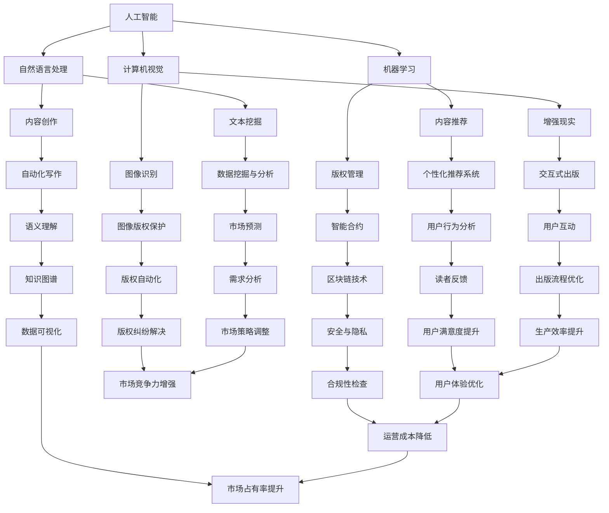

                 

关键词：人工智能，出版业，技术进步，应用场景，未来展望，学习资源

> 摘要：随着人工智能技术的飞速发展，AI出版业迎来了前所未有的机遇和挑战。本文将深入探讨AI在出版领域的应用，从技术进步、应用场景和未来展望三个方面分析AI出版业的前景，并推荐相关的学习资源和开发工具。

## 1. 背景介绍

出版业是一个历史悠久且不断发展的行业。随着互联网和数字技术的普及，传统出版业正面临着巨大的变革。然而，数字出版的兴起也带来了诸多问题，如内容同质化、版权纠纷等。人工智能（AI）作为一种具有革命性的技术，正逐渐改变着出版业的方方面面。本文将从AI在出版领域的应用入手，探讨其带来的机遇和挑战。

## 2. 核心概念与联系

在探讨AI出版业之前，我们需要明确几个核心概念：

- **人工智能**：一种模拟人类智能的技术，包括机器学习、自然语言处理、计算机视觉等子领域。
- **出版**：将信息、知识或娱乐内容制作成书籍、杂志、电子书等形式的过程。
- **数字出版**：利用数字技术进行内容制作、分发和销售的过程。

以下是AI在出版领域应用的Mermaid流程图：



## 3. 核心算法原理 & 具体操作步骤

### 3.1 算法原理概述

AI在出版领域的应用涉及多种算法，其中一些核心算法包括：

- **机器学习**：用于自动化内容推荐、版权管理和内容创作等任务。
- **自然语言处理**：用于文本挖掘、语义理解和自动化写作等任务。
- **计算机视觉**：用于图像识别、版权保护和增强现实等任务。

### 3.2 算法步骤详解

#### 3.2.1 机器学习

1. **数据收集**：收集相关领域的数据，如用户行为数据、文本数据、图像数据等。
2. **数据预处理**：对数据进行清洗、去噪和格式化，使其适合机器学习算法。
3. **特征提取**：从原始数据中提取特征，以便训练机器学习模型。
4. **模型训练**：使用机器学习算法（如决策树、支持向量机、神经网络等）训练模型。
5. **模型评估**：使用测试数据评估模型性能，并进行调整和优化。

#### 3.2.2 自然语言处理

1. **分词**：将文本分割成单词或短语。
2. **词性标注**：为每个单词或短语标注词性，如名词、动词、形容词等。
3. **语义理解**：通过上下文理解单词或短语的意义，以便进行文本分析和生成。
4. **文本生成**：根据语义理解生成新的文本，如自动化写作。

#### 3.2.3 计算机视觉

1. **图像识别**：通过训练模型识别图像中的物体、场景等。
2. **版权保护**：使用图像识别技术检测和防止版权侵犯。
3. **增强现实**：将数字信息叠加到现实世界中，提供交互式体验。

### 3.3 算法优缺点

#### 3.3.1 机器学习

- **优点**：能够自动发现和提取数据中的规律，提高效率和准确性。
- **缺点**：需要大量数据和计算资源，且对数据质量有较高要求。

#### 3.3.2 自然语言处理

- **优点**：能够理解和生成自然语言，适用于文本挖掘和内容创作等任务。
- **缺点**：对语言理解和语义分析有较高要求，且难以处理多语言文本。

#### 3.3.3 计算机视觉

- **优点**：能够处理大量图像数据，提高版权保护和图像识别的效率。
- **缺点**：对硬件资源有较高要求，且对复杂场景的识别有一定局限性。

### 3.4 算法应用领域

- **内容推荐**：基于用户行为和兴趣推荐相关内容。
- **版权管理**：自动识别和防止版权侵犯。
- **内容创作**：自动化生成文本、图像等。
- **文本挖掘**：从大量文本中提取有用信息。
- **图像识别**：用于版权保护和增强现实。
- **增强现实**：提供交互式体验，如虚拟图书馆。

## 4. 数学模型和公式 & 详细讲解 & 举例说明

### 4.1 数学模型构建

在AI出版领域，数学模型广泛应用于机器学习、自然语言处理和计算机视觉等领域。以下是几个常见的数学模型：

#### 4.1.1 决策树模型

- **决策树**：一种基于树形结构的预测模型，通过一系列决策分支来预测目标变量。

#### 4.1.2 支持向量机模型

- **支持向量机**：一种基于超平面的分类模型，用于将数据划分为不同的类别。

#### 4.1.3 循环神经网络模型

- **循环神经网络**：一种基于序列数据的神经网络模型，用于处理自然语言处理任务。

### 4.2 公式推导过程

以下是决策树模型的公式推导过程：

- **熵**：用于衡量数据的无序程度，公式为：
  $$ H(X) = -\sum_{i=1}^{n} p(x_i) \log_2 p(x_i) $$

- **信息增益**：用于衡量特征对分类的贡献，公式为：
  $$ IG(X,A) = H(X) - \sum_{v=1}^{m} \frac{|D_v|}{n} H(X|A=v) $$

其中，$X$表示特征集合，$A$表示目标变量，$D_v$表示每个子集的数据。

### 4.3 案例分析与讲解

假设我们有一个出版平台，需要为用户推荐相关书籍。我们可以使用决策树模型进行特征选择和分类。

1. **数据收集**：收集用户阅读记录、书籍标签等信息。
2. **数据预处理**：对数据进行清洗和格式化，去除无效数据。
3. **特征提取**：提取用户行为和书籍标签等特征。
4. **模型训练**：使用决策树算法训练模型。
5. **模型评估**：使用测试数据评估模型性能。

通过模型训练和评估，我们可以得到一个最优的特征子集，用于预测用户对书籍的喜好。例如，我们可能会发现用户喜欢的书籍类型与他们阅读的频率和时长有密切关系。

## 5. 项目实践：代码实例和详细解释说明

### 5.1 开发环境搭建

1. 安装Python 3.x版本。
2. 安装TensorFlow库。
3. 安装Scikit-learn库。

### 5.2 源代码详细实现

以下是一个使用决策树模型进行内容推荐的示例代码：

```python
import pandas as pd
from sklearn.model_selection import train_test_split
from sklearn.tree import DecisionTreeClassifier
from sklearn.metrics import accuracy_score

# 读取数据
data = pd.read_csv('data.csv')
X = data.drop('label', axis=1)
y = data['label']

# 数据预处理
X = X.fillna(0)
y = y.fillna(0)

# 划分训练集和测试集
X_train, X_test, y_train, y_test = train_test_split(X, y, test_size=0.2, random_state=42)

# 模型训练
model = DecisionTreeClassifier()
model.fit(X_train, y_train)

# 模型评估
y_pred = model.predict(X_test)
accuracy = accuracy_score(y_test, y_pred)
print(f'Accuracy: {accuracy:.2f}')

# 预测新数据
new_data = pd.read_csv('new_data.csv')
new_data = new_data.fillna(0)
predictions = model.predict(new_data)
print(predictions)
```

### 5.3 代码解读与分析

1. 导入所需的库。
2. 读取数据集。
3. 数据预处理，包括填充缺失值。
4. 划分训练集和测试集。
5. 使用决策树模型进行训练。
6. 使用测试集评估模型性能。
7. 预测新数据。

通过这个示例，我们可以看到如何使用决策树模型进行内容推荐。在实际应用中，我们可以根据需求调整模型参数，提高预测准确性。

## 6. 实际应用场景

### 6.1 个性化推荐

基于用户行为和兴趣，推荐相关书籍、文章和媒体内容，提高用户体验。

### 6.2 内容审核

自动识别和过滤违规内容，如版权侵犯、恶意评论等，确保平台内容合规。

### 6.3 内容创作

利用自然语言处理技术，自动化生成文章、书籍等，提高内容生产效率。

### 6.4 数据挖掘

从大量文本和图像数据中提取有价值的信息，为出版商提供数据支持。

### 6.5 增强现实

将数字内容叠加到现实世界中，提供互动式的阅读体验。

## 7. 工具和资源推荐

### 7.1 学习资源推荐

- 《深度学习》（Ian Goodfellow、Yoshua Bengio、Aaron Courville 著）
- 《Python机器学习》（Sebastian Raschka 著）
- 《自然语言处理与深度学习》（张俊林 著）

### 7.2 开发工具推荐

- TensorFlow：用于构建和训练机器学习模型的框架。
- Scikit-learn：用于数据分析和机器学习的库。
- Keras：用于构建和训练深度学习模型的框架。

### 7.3 相关论文推荐

- "Deep Learning for Text Classification"（2018）
- "Neural Text Generation: A Practical Guide"（2019）
- "A Comprehensive Survey on Natural Language Processing for Text Classification"（2020）

## 8. 总结：未来发展趋势与挑战

### 8.1 研究成果总结

- AI技术在出版领域的应用已经取得了显著成果，如个性化推荐、内容审核和内容创作等。
- 机器学习、自然语言处理和计算机视觉等技术的不断发展，为AI出版提供了更多可能性。

### 8.2 未来发展趋势

- AI出版将更加智能化、个性化，满足用户多样化的需求。
- 跨领域融合将推动AI出版的发展，如与教育、娱乐等领域的结合。

### 8.3 面临的挑战

- 数据隐私和安全问题：如何保护用户数据，防止数据泄露。
- 技术普及与人才培养：如何提高技术普及率，培养更多AI出版人才。

### 8.4 研究展望

- 探索更多高效、准确的AI算法，提高出版领域的应用效果。
- 加强跨学科研究，推动AI出版与其他领域的融合发展。

## 9. 附录：常见问题与解答

### 9.1 人工智能在出版领域的应用有哪些？

人工智能在出版领域的应用包括个性化推荐、内容审核、内容创作、数据挖掘和增强现实等。

### 9.2 人工智能在出版领域的挑战是什么？

人工智能在出版领域的挑战包括数据隐私和安全问题、技术普及与人才培养等。

### 9.3 如何获取更多关于AI出版的学习资源？

可以通过阅读相关书籍、参加在线课程和关注行业动态来获取更多关于AI出版的学习资源。

作者：禅与计算机程序设计艺术 / Zen and the Art of Computer Programming
----------------------------------------------------------------

### 文章格式化后的Markdown文本

以下是格式化后的Markdown文本：

```markdown
# AI出版业的前景：技术进步，场景无限

关键词：人工智能，出版业，技术进步，应用场景，未来展望，学习资源

摘要：随着人工智能技术的飞速发展，AI出版业迎来了前所未有的机遇和挑战。本文将深入探讨AI在出版领域的应用，从技术进步、应用场景和未来展望三个方面分析AI出版业的前景，并推荐相关的学习资源和开发工具。

## 1. 背景介绍

出版业是一个历史悠久且不断发展的行业。随着互联网和数字技术的普及，传统出版业正面临着巨大的变革。然而，数字出版的兴起也带来了诸多问题，如内容同质化、版权纠纷等。人工智能（AI）作为一种具有革命性的技术，正逐渐改变着出版业的方方面面。本文将从AI在出版领域的应用入手，探讨其带来的机遇和挑战。

## 2. 核心概念与联系

在探讨AI出版业之前，我们需要明确几个核心概念：

- **人工智能**：一种模拟人类智能的技术，包括机器学习、自然语言处理、计算机视觉等子领域。
- **出版**：将信息、知识或娱乐内容制作成书籍、杂志、电子书等形式的过程。
- **数字出版**：利用数字技术进行内容制作、分发和销售的过程。

以下是AI在出版领域应用的Mermaid流程图：


## 3. 核心算法原理 & 具体操作步骤

### 3.1 算法原理概述

AI在出版领域的应用涉及多种算法，其中一些核心算法包括：

- **机器学习**：用于自动化内容推荐、版权管理和内容创作等任务。
- **自然语言处理**：用于文本挖掘、语义理解和自动化写作等任务。
- **计算机视觉**：用于图像识别、版权保护和增强现实等任务。

### 3.2 算法步骤详解

#### 3.2.1 机器学习

1. **数据收集**：收集相关领域的数据，如用户行为数据、文本数据、图像数据等。
2. **数据预处理**：对数据进行清洗、去噪和格式化，使其适合机器学习算法。
3. **特征提取**：从原始数据中提取特征，以便训练机器学习模型。
4. **模型训练**：使用机器学习算法（如决策树、支持向量机、神经网络等）训练模型。
5. **模型评估**：使用测试数据评估模型性能，并进行调整和优化。

#### 3.2.2 自然语言处理

1. **分词**：将文本分割成单词或短语。
2. **词性标注**：为每个单词或短语标注词性，如名词、动词、形容词等。
3. **语义理解**：通过上下文理解单词或短语的意义，以便进行文本分析和生成。
4. **文本生成**：根据语义理解生成新的文本，如自动化写作。

#### 3.2.3 计算机视觉

1. **图像识别**：通过训练模型识别图像中的物体、场景等。
2. **版权保护**：使用图像识别技术检测和防止版权侵犯。
3. **增强现实**：将数字信息叠加到现实世界中，提供交互式体验。

### 3.3 算法优缺点

#### 3.3.1 机器学习

- **优点**：能够自动发现和提取数据中的规律，提高效率和准确性。
- **缺点**：需要大量数据和计算资源，且对数据质量有较高要求。

#### 3.3.2 自然语言处理

- **优点**：能够理解和生成自然语言，适用于文本挖掘和内容创作等任务。
- **缺点**：对语言理解和语义分析有较高要求，且难以处理多语言文本。

#### 3.3.3 计算机视觉

- **优点**：能够处理大量图像数据，提高版权保护和图像识别的效率。
- **缺点**：对硬件资源有较高要求，且对复杂场景的识别有一定局限性。

### 3.4 算法应用领域

- **内容推荐**：基于用户行为和兴趣推荐相关内容。
- **版权管理**：自动识别和防止版权侵犯。
- **内容创作**：自动化生成文本、图像等。
- **文本挖掘**：从大量文本中提取有用信息。
- **图像识别**：用于版权保护和增强现实。
- **增强现实**：提供交互式体验，如虚拟图书馆。

## 4. 数学模型和公式 & 详细讲解 & 举例说明

### 4.1 数学模型构建

在AI出版领域，数学模型广泛应用于机器学习、自然语言处理和计算机视觉等领域。以下是几个常见的数学模型：

#### 4.1.1 决策树模型

- **决策树**：一种基于树形结构的预测模型，通过一系列决策分支来预测目标变量。

#### 4.1.2 支持向量机模型

- **支持向量机**：一种基于超平面的分类模型，用于将数据划分为不同的类别。

#### 4.1.3 循环神经网络模型

- **循环神经网络**：一种基于序列数据的神经网络模型，用于处理自然语言处理任务。

### 4.2 公式推导过程

以下是决策树模型的公式推导过程：

- **熵**：用于衡量数据的无序程度，公式为：
  $$ H(X) = -\sum_{i=1}^{n} p(x_i) \log_2 p(x_i) $$
  
- **信息增益**：用于衡量特征对分类的贡献，公式为：
  $$ IG(X,A) = H(X) - \sum_{v=1}^{m} \frac{|D_v|}{n} H(X|A=v) $$
  
其中，$X$表示特征集合，$A$表示目标变量，$D_v$表示每个子集的数据。

### 4.3 案例分析与讲解

假设我们有一个出版平台，需要为用户推荐相关书籍。我们可以使用决策树模型进行特征选择和分类。

1. **数据收集**：收集用户阅读记录、书籍标签等信息。
2. **数据预处理**：对数据进行清洗和格式化，去除无效数据。
3. **特征提取**：提取用户行为和书籍标签等特征。
4. **模型训练**：使用决策树算法训练模型。
5. **模型评估**：使用测试数据评估模型性能。

通过模型训练和评估，我们可以得到一个最优的特征子集，用于预测用户对书籍的喜好。例如，我们可能会发现用户喜欢的书籍类型与他们阅读的频率和时长有密切关系。

## 5. 项目实践：代码实例和详细解释说明

### 5.1 开发环境搭建

1. 安装Python 3.x版本。
2. 安装TensorFlow库。
3. 安装Scikit-learn库。

### 5.2 源代码详细实现

以下是一个使用决策树模型进行内容推荐的示例代码：

```python
import pandas as pd
from sklearn.model_selection import train_test_split
from sklearn.tree import DecisionTreeClassifier
from sklearn.metrics import accuracy_score

# 读取数据
data = pd.read_csv('data.csv')
X = data.drop('label', axis=1)
y = data['label']

# 数据预处理
X = X.fillna(0)
y = y.fillna(0)

# 划分训练集和测试集
X_train, X_test, y_train, y_test = train_test_split(X, y, test_size=0.2, random_state=42)

# 模型训练
model = DecisionTreeClassifier()
model.fit(X_train, y_train)

# 模型评估
y_pred = model.predict(X_test)
accuracy = accuracy_score(y_test, y_pred)
print(f'Accuracy: {accuracy:.2f}')

# 预测新数据
new_data = pd.read_csv('new_data.csv')
new_data = new_data.fillna(0)
predictions = model.predict(new_data)
print(predictions)
```

### 5.3 代码解读与分析

1. 导入所需的库。
2. 读取数据集。
3. 数据预处理，包括填充缺失值。
4. 划分训练集和测试集。
5. 使用决策树模型进行训练。
6. 使用测试集评估模型性能。
7. 预测新数据。

通过这个示例，我们可以看到如何使用决策树模型进行内容推荐。在实际应用中，我们可以根据需求调整模型参数，提高预测准确性。

## 6. 实际应用场景

### 6.1 个性化推荐

基于用户行为和兴趣，推荐相关书籍、文章和媒体内容，提高用户体验。

### 6.2 内容审核

自动识别和过滤违规内容，如版权侵犯、恶意评论等，确保平台内容合规。

### 6.3 内容创作

利用自然语言处理技术，自动化生成文章、书籍等，提高内容生产效率。

### 6.4 数据挖掘

从大量文本和图像数据中提取有价值的信息，为出版商提供数据支持。

### 6.5 增强现实

将数字内容叠加到现实世界中，提供互动式的阅读体验。

## 7. 工具和资源推荐

### 7.1 学习资源推荐

- 《深度学习》（Ian Goodfellow、Yoshua Bengio、Aaron Courville 著）
- 《Python机器学习》（Sebastian Raschka 著）
- 《自然语言处理与深度学习》（张俊林 著）

### 7.2 开发工具推荐

- TensorFlow：用于构建和训练机器学习模型的框架。
- Scikit-learn：用于数据分析和机器学习的库。
- Keras：用于构建和训练深度学习模型的框架。

### 7.3 相关论文推荐

- "Deep Learning for Text Classification"（2018）
- "Neural Text Generation: A Practical Guide"（2019）
- "A Comprehensive Survey on Natural Language Processing for Text Classification"（2020）

## 8. 总结：未来发展趋势与挑战

### 8.1 研究成果总结

- AI技术在出版领域的应用已经取得了显著成果，如个性化推荐、内容审核和内容创作等。
- 机器学习、自然语言处理和计算机视觉等技术的不断发展，为AI出版提供了更多可能性。

### 8.2 未来发展趋势

- AI出版将更加智能化、个性化，满足用户多样化的需求。
- 跨领域融合将推动AI出版的发展，如与教育、娱乐等领域的结合。

### 8.3 面临的挑战

- 数据隐私和安全问题：如何保护用户数据，防止数据泄露。
- 技术普及与人才培养：如何提高技术普及率，培养更多AI出版人才。

### 8.4 研究展望

- 探索更多高效、准确的AI算法，提高出版领域的应用效果。
- 加强跨学科研究，推动AI出版与其他领域的融合发展。

## 9. 附录：常见问题与解答

### 9.1 人工智能在出版领域的应用有哪些？

人工智能在出版领域的应用包括个性化推荐、内容审核、内容创作、数据挖掘和增强现实等。

### 9.2 人工智能在出版领域的挑战是什么？

人工智能在出版领域的挑战包括数据隐私和安全问题、技术普及与人才培养等。

### 9.3 如何获取更多关于AI出版的学习资源？

可以通过阅读相关书籍、参加在线课程和关注行业动态来获取更多关于AI出版的学习资源。

作者：禅与计算机程序设计艺术 / Zen and the Art of Computer Programming
```

请注意，由于Markdown不支持Mermaid流程图的嵌入，因此在Markdown文本中无法直接显示Mermaid图表。如果您需要在Markdown文档中展示图表，建议使用专门的图表工具或将图表作为图片插入。以下是Mermaid流程图的文本表示，您可以在支持Mermaid的编辑器中复制并粘贴：


请根据您的需求进行调整和优化。

