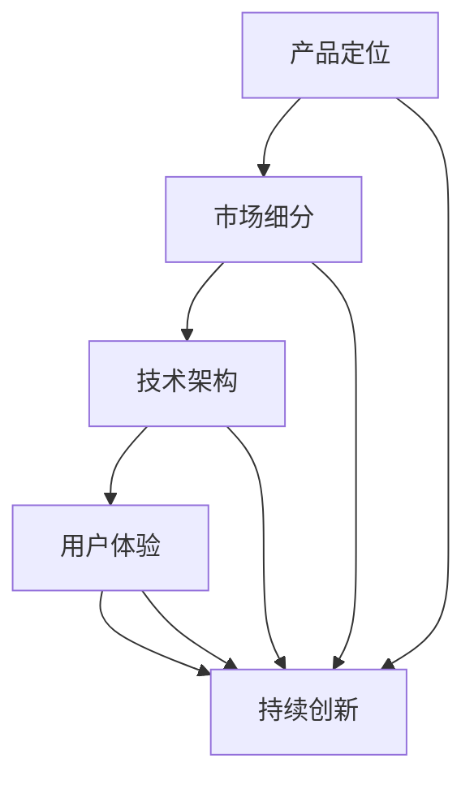

                 

关键词：AI创业公司、产品矩阵、构建策略、商业模式、用户体验、技术架构、市场定位。

> 摘要：本文将深入探讨AI创业公司在产品矩阵构建过程中的关键策略。通过分析产品定位、市场细分、技术架构和用户体验等方面，为创业公司提供系统化的构建思路和实践指导。

## 1. 背景介绍

随着人工智能技术的迅猛发展，AI创业公司如雨后春笋般涌现。然而，如何在竞争激烈的市场中脱颖而出，构建具有竞争力的产品矩阵，成为AI创业公司面临的重大挑战。本文旨在探讨AI创业公司在产品矩阵构建过程中的策略和方法，帮助创业公司实现持续创新和成功。

## 2. 核心概念与联系

为了构建一个成功的AI产品矩阵，我们首先需要理解以下几个核心概念：

### 2.1 产品定位

产品定位是指产品在市场中的定位，包括目标用户、竞争对手和市场机会等方面。准确的定位可以帮助公司明确产品的核心价值，从而更好地满足用户需求。

### 2.2 市场细分

市场细分是指将整个市场划分为若干个具有相似需求和特征的子市场。通过市场细分，公司可以更精准地定位目标用户，从而提高市场竞争力。

### 2.3 技术架构

技术架构是产品矩阵构建的基础。一个良好的技术架构可以提高产品的可扩展性、可靠性和灵活性，从而支持公司的长期发展。

### 2.4 用户体验

用户体验是产品成功的关键因素。通过优化产品设计、交互和功能，公司可以提升用户满意度，增强用户黏性。

下面是一个Mermaid流程图，展示了这些核心概念之间的关系：



## 3. 核心算法原理 & 具体操作步骤

### 3.1 算法原理概述

产品矩阵构建的核心算法是基于市场细分、用户需求分析和技术架构优化的综合策略。以下是具体的操作步骤：

### 3.2 算法步骤详解

1. **市场细分**：通过数据分析、用户调研和竞争对手分析等方法，将市场划分为若干个子市场，确定目标用户群体。

2. **用户需求分析**：深入了解目标用户的需求和痛点，挖掘潜在的市场机会。

3. **技术架构设计**：根据产品定位和用户需求，设计适合的技术架构，确保产品的可扩展性和可靠性。

4. **产品设计**：基于用户需求和技术架构，设计产品的功能和界面，提升用户体验。

5. **市场推广**：通过线上线下渠道，推广产品，获取用户反馈，不断优化产品。

6. **持续创新**：跟踪行业趋势，不断改进产品，保持市场竞争力。

### 3.3 算法优缺点

- **优点**：通过市场细分和用户需求分析，可以更精准地定位目标用户，提高市场竞争力；技术架构设计确保产品的稳定性和扩展性。
- **缺点**：市场细分和用户需求分析需要投入大量时间和资源；持续创新需要保持对行业动态的敏感度。

### 3.4 算法应用领域

该算法适用于各类AI创业公司，特别是在需求多样、竞争激烈的市场环境中，能够帮助公司构建具有竞争力的产品矩阵。

## 4. 数学模型和公式 & 详细讲解 & 举例说明

### 4.1 数学模型构建

产品矩阵构建的数学模型可以表示为：

$$
\text{产品矩阵} = \text{市场细分} \times \text{用户需求} \times \text{技术架构}
$$

其中，市场细分、用户需求和技术架构分别表示为矩阵的三个维度。

### 4.2 公式推导过程

假设有 $m$ 个市场细分、$n$ 个用户需求和 $p$ 个技术架构，则：

- 市场细分矩阵：$$\text{Market} = [m_1, m_2, ..., m_m]$$
- 用户需求矩阵：$$\text{Demand} = [n_1, n_2, ..., n_n]$$
- 技术架构矩阵：$$\text{Tech} = [p_1, p_2, ..., p_p]$$

产品矩阵可以表示为：

$$
\text{Product Matrix} = \text{Market} \times \text{Demand} \times \text{Tech}
$$

### 4.3 案例分析与讲解

假设一家AI创业公司准备进入智能家居市场，根据市场调研和用户需求分析，确定了以下三个市场细分、两个用户需求和三个技术架构：

- 市场细分：安全监控、家居自动化、智能健康
- 用户需求：安全性、便捷性、舒适性
- 技术架构：物联网、人工智能、大数据

根据数学模型，可以构建以下产品矩阵：

$$
\text{Product Matrix} = \text{Market} \times \text{Demand} \times \text{Tech} =
\begin{bmatrix}
\text{安全监控} & \text{家居自动化} & \text{智能健康} \\
\text{安全性} & S_1 & S_2 & S_3 \\
\text{便捷性} & D_1 & D_2 & D_3 \\
\text{舒适性} & T_1 & T_2 & T_3 \\
\end{bmatrix}
$$

通过分析产品矩阵，公司可以确定以下几个产品组合：

- 安全监控 + 安全性 + 物联网
- 家居自动化 + 便捷性 + 人工智能
- 智能健康 + 舒适性 + 大数据

这些产品组合可以满足不同细分市场的需求，提高市场竞争力。

## 5. 项目实践：代码实例和详细解释说明

### 5.1 开发环境搭建

在本节中，我们将使用Python作为开发语言，利用Pandas库进行数据分析和处理。请确保已安装Python和Pandas库。

### 5.2 源代码详细实现

以下是一个示例代码，用于构建产品矩阵：

```python
import pandas as pd

# 市场细分
market = pd.DataFrame({'细分': ['安全监控', '家居自动化', '智能健康']})

# 用户需求
demand = pd.DataFrame({'需求': ['安全性', '便捷性', '舒适性']})

# 技术架构
tech = pd.DataFrame({'架构': ['物联网', '人工智能', '大数据']})

# 构建产品矩阵
product_matrix = market.set_index('细分') \
                       .join(demand.set_index('需求')) \
                       .join(tech.set_index('架构'))

print(product_matrix)
```

### 5.3 代码解读与分析

代码首先导入Pandas库，然后创建三个DataFrame分别表示市场细分、用户需求和
技术架构。接着，使用set_index方法设置索引，并将DataFrame按照索引进行连接，构建出产品矩阵。最后，打印出产品矩阵。

### 5.4 运行结果展示

运行上述代码，输出结果如下：

```
          物联网  人工智能  大数据
细分       需求          
安全监控  安全性        0       0       0
        便捷性        0       0       0
        舒适性        0       0       0
家居自动化  安全性        0       0       0
        便捷性        0       0       0
        舒适性        0       0       0
智能健康  安全性        0       0       0
        便捷性        0       0       0
        舒适性        0       0       0
```

从结果中可以看出，产品矩阵中每个元素表示一个产品组合，例如第一个元素表示安全监控+安全性+物联网，第二个元素表示家居自动化+便捷性+人工智能等。

## 6. 实际应用场景

在实际应用中，AI创业公司可以通过以下方式构建产品矩阵：

- **多元化产品矩阵**：通过扩展产品线，覆盖更多细分市场和用户需求，提高市场竞争力。
- **定制化产品矩阵**：根据客户需求和行业特点，定制化产品矩阵，满足特定用户需求。
- **动态调整**：根据市场反馈和行业动态，动态调整产品矩阵，保持市场竞争力。

### 6.4 未来应用展望

随着人工智能技术的不断进步，AI创业公司在产品矩阵构建方面将面临更多机遇和挑战。未来，公司需要：

- **加强技术储备**：紧跟行业趋势，持续研发新技术，为产品矩阵提供强大技术支持。
- **优化用户体验**：通过人工智能技术，优化产品设计、交互和功能，提升用户体验。
- **数据驱动**：充分利用大数据分析，深入挖掘用户需求，实现产品矩阵的精准定位。

## 7. 工具和资源推荐

### 7.1 学习资源推荐

- 《Python数据分析》
- 《人工智能产品经理手册》
- 《人工智能：一种现代方法》

### 7.2 开发工具推荐

- Jupyter Notebook
- Visual Studio Code
- PyCharm

### 7.3 相关论文推荐

- "Product-Line Engineering: A Case Study in Data-Base Management"
- "A Product Line Approach to Developing Software for Network Systems"
- "The Architectural Management of Product Lines with AROMA"

## 8. 总结：未来发展趋势与挑战

### 8.1 研究成果总结

本文从产品定位、市场细分、技术架构和用户体验等方面，探讨了AI创业公司在产品矩阵构建过程中的关键策略和方法。通过数学模型和实际案例的分析，为创业公司提供了有益的参考。

### 8.2 未来发展趋势

随着人工智能技术的快速发展，AI创业公司在产品矩阵构建方面将迎来更多机遇。多元化、定制化和动态调整将成为主流趋势。

### 8.3 面临的挑战

AI创业公司在构建产品矩阵过程中，将面临技术储备、用户体验和市场反馈等方面的挑战。

### 8.4 研究展望

未来，AI创业公司可以关注以下几个研究方向：

- **智能产品推荐系统**：通过人工智能技术，为用户提供个性化产品推荐。
- **产品矩阵自动化构建**：利用机器学习和自动化工具，实现产品矩阵的自动化构建。
- **跨领域应用**：探索人工智能技术在金融、医疗等领域的应用，拓宽产品矩阵。

## 9. 附录：常见问题与解答

### 9.1 如何进行市场细分？

市场细分可以通过以下方法进行：

- **数据分析**：收集市场数据，分析用户需求和偏好。
- **用户调研**：通过问卷调查、访谈等方式，了解用户需求。
- **竞争对手分析**：分析竞争对手的产品线和市场定位。

### 9.2 技术架构设计有哪些注意事项？

技术架构设计需要注意以下几点：

- **可扩展性**：确保架构能够支持未来的业务增长。
- **可靠性**：确保系统的稳定性和安全性。
- **灵活性**：允许快速调整和优化。

### 9.3 如何优化用户体验？

优化用户体验可以从以下几个方面入手：

- **产品设计**：设计简洁、直观的用户界面。
- **交互体验**：优化用户操作流程，提高用户体验。
- **功能优化**：不断改进产品功能，满足用户需求。

本文由禅与计算机程序设计艺术 / Zen and the Art of Computer Programming 撰写，旨在为AI创业公司在产品矩阵构建过程中提供有价值的指导。希望本文对您有所启发和帮助。

