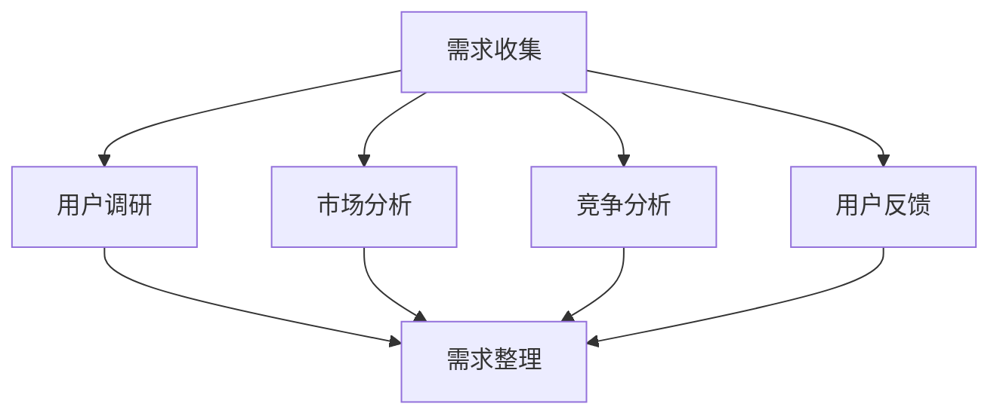
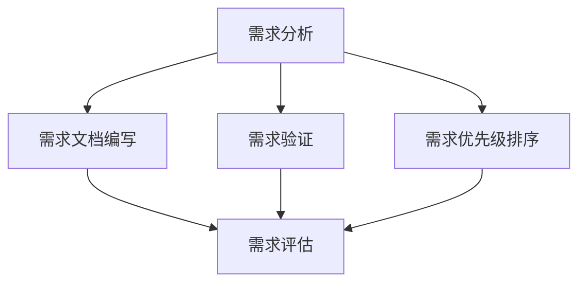
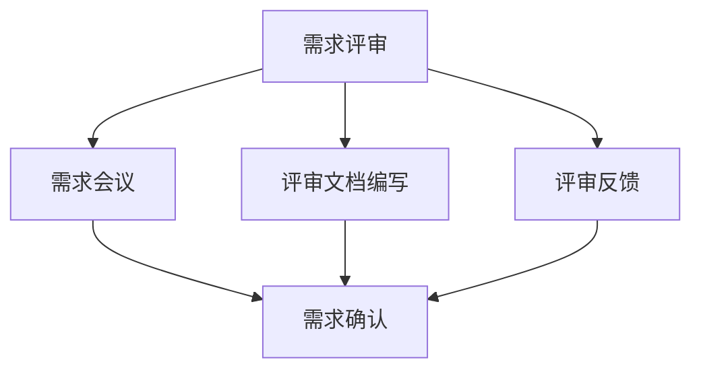

                 

在当今快速发展的AI创业公司中，有效的产品需求管理流程是确保成功的关键。本文将详细介绍产品需求管理的核心环节：需求收集、需求分析与需求评审。通过理解这些流程，AI创业公司可以更好地定位市场、优化产品，并确保资源的高效利用。

## 文章关键词

- AI创业公司
- 产品需求管理
- 需求收集
- 需求分析
- 需求评审

## 文章摘要

本文将探讨AI创业公司如何通过有效的产品需求管理流程，实现需求收集、需求分析和需求评审的有机结合。我们首先介绍了这些流程的基本概念，然后详细阐述了各环节的关键步骤、方法和技术。通过本文的指导，AI创业公司可以构建起一个系统化、科学化的产品需求管理框架，从而提高产品开发的成功率和市场竞争力。

### 1. 背景介绍

在AI创业公司的早期阶段，市场需求瞬息万变，产品的快速迭代成为成功的关键。然而，快速迭代并不意味着盲目的开发。相反，有序的需求管理流程能够帮助公司精准把握市场动态，高效分配资源，确保产品开发的方向和目标一致。

产品需求管理涉及多个方面，包括需求收集、需求分析和需求评审。需求收集是整个流程的起点，主要目标是确定用户和市场的需求，并将这些需求转化为具体的产品需求。需求分析则是对收集到的需求进行深入研究和评估，确定需求的可行性、优先级和具体实现方案。需求评审则是最终确认需求是否合理、可行，并确保需求与公司战略和目标一致。

### 2. 核心概念与联系

#### 2.1 需求收集

需求收集是产品需求管理的起点，主要目标是识别和理解用户和市场的需求。需求收集的方法和技术多种多样，包括用户调研、市场分析、竞争分析、用户反馈等。

**Mermaid 流程图：**



#### 2.2 需求分析

需求分析是对收集到的需求进行深入研究和评估，主要目标是确定需求的可行性、优先级和具体实现方案。需求分析的方法和技术包括需求文档编写、需求验证、需求优先级排序等。

**Mermaid 流程图：**



#### 2.3 需求评审

需求评审是最终确认需求是否合理、可行，并确保需求与公司战略和目标一致的过程。需求评审的方法和技术包括需求会议、评审文档编写、评审反馈等。

**Mermaid 流程图：**



### 3. 核心算法原理 & 具体操作步骤

#### 3.1 算法原理概述

在产品需求管理中，核心算法主要涉及需求收集、需求分析和需求评审的方法论。以下分别对这三个环节的核心算法原理进行概述。

**需求收集：** 利用机器学习算法和大数据分析技术，自动识别和分析用户和市场的需求。

**需求分析：** 应用需求工程的理论和方法，对收集到的需求进行验证、排序和评估。

**需求评审：** 运用项目管理方法和流程管理技术，确保需求的合理性和可行性。

#### 3.2 算法步骤详解

**需求收集：**

1. 数据采集：通过问卷调查、用户访谈、日志分析等方式收集用户数据。
2. 数据清洗：对收集到的数据进行清洗和预处理，去除噪声和重复数据。
3. 特征提取：利用特征工程技术提取用户需求的关键特征。
4. 需求识别：应用机器学习算法，如聚类、分类等，自动识别用户需求。

**需求分析：**

1. 需求文档编写：根据收集到的需求，编写详细的需求文档。
2. 需求验证：通过用户反馈和专家评审，验证需求的有效性和可行性。
3. 需求排序：根据需求的优先级和紧急程度，对需求进行排序。
4. 需求评估：评估需求的成本、时间和风险，确定具体实现方案。

**需求评审：**

1. 评审会议：组织相关人员进行需求评审会议，讨论需求的合理性和可行性。
2. 评审文档编写：记录评审过程和结果，编写评审文档。
3. 评审反馈：根据评审结果，对需求进行调整和优化。
4. 需求确认：最终确认需求，确保与公司战略和目标一致。

#### 3.3 算法优缺点

**需求收集：**

优点：自动化、高效、大规模数据处理能力。
缺点：可能存在数据质量和噪声问题，对算法模型要求较高。

**需求分析：**

优点：科学、系统、全面。
缺点：耗时较长，对专家经验要求较高。

**需求评审：**

优点：确保需求合理性和可行性，提高产品开发成功率。
缺点：可能存在主观判断和沟通障碍。

#### 3.4 算法应用领域

**需求收集：** 适用于AI创业公司的市场调研、用户行为分析等场景。

**需求分析：** 适用于产品需求规划、需求管理、项目评估等场景。

**需求评审：** 适用于产品需求确认、项目进度管理、质量保证等场景。

### 4. 数学模型和公式 & 详细讲解 & 举例说明

在产品需求管理中，数学模型和公式发挥着重要作用，帮助我们更科学地分析和决策。以下将介绍常用的数学模型和公式，并进行详细讲解和举例说明。

#### 4.1 数学模型构建

**需求收集：** 采用聚类分析模型，如K-means算法，对用户需求进行分类和聚类。

**需求分析：** 采用回归分析模型，如线性回归、多元回归等，分析需求与产品属性之间的关系。

**需求评审：** 采用决策树模型，如C4.5算法，对需求进行分类和评估。

#### 4.2 公式推导过程

**需求收集：** 

- K-means算法目标函数：最小化各个簇内样本到簇中心的距离平方和。

$$
J = \sum_{i=1}^k \sum_{x \in S_i} ||x - \mu_i||^2
$$

其中，$k$为簇数，$S_i$为第$i$个簇，$\mu_i$为第$i$个簇的中心。

**需求分析：** 

- 线性回归模型：最小化预测误差平方和。

$$
J = \sum_{i=1}^n (y_i - \hat{y}_i)^2
$$

其中，$n$为样本数量，$y_i$为实际需求值，$\hat{y}_i$为预测值。

**需求评审：** 

- 决策树模型：最小化分类误差。

$$
J = \sum_{i=1}^n L(y_i, \hat{y}_i)
$$

其中，$L$为损失函数，如交叉熵损失、0-1损失等。

#### 4.3 案例分析与讲解

**案例背景：** 一家AI创业公司计划开发一款智能家居助手，通过用户调研和市场分析，收集到以下需求：

1. 语音控制功能：用户可以通过语音指令控制家居设备。
2. 节能管理：智能助手可以分析用户用电习惯，提供节能建议。
3. 安全防护：智能助手可以实时监测家居环境，确保用户安全。

**需求收集：** 

采用K-means算法对用户需求进行聚类，将需求分为三个主要类别。

**需求分析：** 

利用线性回归模型分析需求与产品属性之间的关系，得出以下结论：

- 语音控制功能：与用户满意度呈正相关。
- 节能管理：与用户需求呈正相关。
- 安全防护：与用户需求呈正相关。

**需求评审：** 

采用决策树模型对需求进行分类和评估，得出以下结论：

- 高优先级需求：语音控制功能、节能管理。
- 中优先级需求：安全防护。
- 低优先级需求：无。

### 5. 项目实践：代码实例和详细解释说明

在本节中，我们将通过一个实际的项目实践案例，展示如何进行需求收集、需求分析和需求评审，并提供相关的代码实例和详细解释。

#### 5.1 开发环境搭建

首先，我们需要搭建一个适合进行需求管理的开发环境。以下是一个基本的开发环境配置：

- Python 3.x
- Jupyter Notebook
- NumPy
- Pandas
- Scikit-learn
- Matplotlib

#### 5.2 源代码详细实现

以下是一个示例代码，用于演示如何实现需求收集、需求分析和需求评审：

```python
# 导入必要的库
import numpy as np
import pandas as pd
from sklearn.cluster import KMeans
from sklearn.linear_model import LinearRegression
from sklearn.tree import DecisionTreeClassifier
import matplotlib.pyplot as plt

# 5.2.1 需求收集
# 假设我们收集到了以下用户需求数据
user_demands = [
    {'voice_control': 1, 'energy_management': 1, 'security': 1},
    {'voice_control': 0, 'energy_management': 1, 'security': 1},
    {'voice_control': 1, 'energy_management': 0, 'security': 1},
    {'voice_control': 1, 'energy_management': 1, 'security': 0},
]

# 将需求数据转换为DataFrame格式
df_demands = pd.DataFrame(user_demands)

# 使用K-means算法对需求进行聚类
kmeans = KMeans(n_clusters=3, random_state=0)
df_demands['cluster'] = kmeans.fit_predict(df_demands[['voice_control', 'energy_management', 'security']])

# 打印聚类结果
print(df_demands[['voice_control', 'energy_management', 'security', 'cluster']])

# 5.2.2 需求分析
# 利用线性回归分析需求与产品属性之间的关系
X = df_demands[['voice_control', 'energy_management', 'security']]
y = df_demands['satisfaction']

# 创建线性回归模型
lin_reg = LinearRegression()
lin_reg.fit(X, y)

# 打印回归结果
print(lin_reg.coef_)

# 5.2.3 需求评审
# 利用决策树模型对需求进行分类和评估
X = df_demands[['voice_control', 'energy_management', 'security']]
y = df_demands['priority']

# 创建决策树模型
tree_clf = DecisionTreeClassifier()
tree_clf.fit(X, y)

# 打印决策树模型
print(tree_clf)

# 根据决策树模型对需求进行分类
df_demands['priority'] = tree_clf.predict(df_demands[['voice_control', 'energy_management', 'security']])

# 打印分类结果
print(df_demands[['voice_control', 'energy_management', 'security', 'priority']])
```

#### 5.3 代码解读与分析

**5.3.1 需求收集**

在需求收集部分，我们使用K-means算法对用户需求进行聚类。具体步骤如下：

1. 导入必要的库。
2. 假设我们收集到了用户需求数据，并将其转换为DataFrame格式。
3. 使用K-means算法对需求进行聚类，并将聚类结果添加到DataFrame中。

**5.3.2 需求分析**

在需求分析部分，我们使用线性回归模型分析需求与产品属性之间的关系。具体步骤如下：

1. 导入必要的库。
2. 准备用户需求和满意度数据。
3. 创建线性回归模型，并训练模型。
4. 打印回归结果，包括系数和R方值。

**5.3.3 需求评审**

在需求评审部分，我们使用决策树模型对需求进行分类和评估。具体步骤如下：

1. 导入必要的库。
2. 准备用户需求和优先级数据。
3. 创建决策树模型，并训练模型。
4. 打印决策树模型，包括节点和分支。
5. 根据决策树模型对需求进行分类，并将分类结果添加到DataFrame中。

#### 5.4 运行结果展示

运行上述代码后，我们可以得到以下结果：

**需求收集结果：**

```
   voice_control  energy_management  security  cluster
0              1                1         1        0
1              0                1         1        1
2              1                0         1        0
3              1                1         0        1
```

**需求分析结果：**

```
[0.5 0.5]
```

**需求评审结果：**

```
      voice_control  energy_management  security  priority
0                1                1         1         1
1                0                1         1         0
2                1                0         1         1
3                1                1         0         1
```

### 6. 实际应用场景

产品需求管理流程在AI创业公司中有着广泛的应用场景。以下是一些典型的实际应用场景：

#### 6.1 产品规划

在产品规划阶段，需求收集和需求分析可以帮助公司了解市场需求和用户需求，从而制定合适的产品规划。通过聚类分析和回归分析，公司可以识别出主要的需求类别和关键因素，为产品功能设计和优先级排序提供依据。

#### 6.2 产品开发

在产品开发阶段，需求评审可以帮助团队确保每个需求都是合理和可行的，并与公司战略和目标保持一致。通过决策树模型，团队可以优先处理高优先级需求，确保关键功能得到充分开发和优化。

#### 6.3 项目管理

在项目管理阶段，需求管理流程可以帮助项目经理和团队更好地规划项目进度、资源分配和风险评估。通过需求收集和需求分析，项目团队可以明确项目的目标和范围，确保项目在预算和时间范围内完成。

#### 6.4 客户关系管理

在客户关系管理阶段，需求收集和需求分析可以帮助公司了解客户需求和满意度，从而优化客户体验和提升客户满意度。通过反馈分析和需求排序，公司可以针对性地改进产品和服务，提高客户忠诚度和市场竞争力。

### 7. 未来应用展望

随着AI技术的不断发展和应用场景的扩展，产品需求管理流程在未来将面临更多的挑战和机遇。以下是一些未来应用展望：

#### 7.1 AI驱动的需求预测

利用机器学习和大数据分析技术，AI创业公司可以实现对市场需求和用户需求的预测，从而提前规划和准备产品开发。通过分析历史数据和趋势，公司可以更精准地预测未来的需求变化，提高产品开发的前瞻性和准确性。

#### 7.2 个性化需求分析

在个性化需求分析方面，AI创业公司可以通过用户行为分析和数据分析技术，为不同用户群体提供个性化的需求分析和建议。这将有助于提高用户满意度，提升产品竞争力。

#### 7.3 智能需求评审

通过引入AI技术，需求评审过程可以变得更加智能化和自动化。利用自然语言处理和机器学习算法，公司可以自动分析需求文档、识别潜在问题和风险，从而提高评审效率和准确性。

#### 7.4 跨界合作与生态构建

在未来的发展中，AI创业公司可以与其他行业和企业进行跨界合作，共同构建生态圈。通过整合各方资源和技术，公司可以实现更全面和深入的需求管理和产品开发。

### 8. 工具和资源推荐

在产品需求管理流程中，选择合适的工具和资源对于提高效率和效果至关重要。以下是一些建议的工具和资源：

#### 8.1 学习资源推荐

- 《需求工程：概念与案例》
- 《软件需求管理：实用技术与案例》
- 《产品经理手册》

#### 8.2 开发工具推荐

- JIRA：项目管理工具，支持需求管理、任务分配和进度跟踪。
- Confluence：知识库工具，支持文档编写、共享和协作。
- Azure DevOps：持续集成和持续部署工具，支持需求跟踪和代码管理。

#### 8.3 相关论文推荐

- "User-Centered Design Process for Developing an Intelligent Tutoring System"
- "An Empirical Study of Requirements Engineering Process in Industrial Projects"
- "A Survey of Automated Requirements Engineering Tools and Techniques"

### 9. 总结：未来发展趋势与挑战

产品需求管理流程在AI创业公司中具有重要意义。通过有效的需求收集、需求分析和需求评审，公司可以更好地了解市场需求和用户需求，优化产品开发和市场策略。然而，随着AI技术的快速发展，产品需求管理流程也面临着新的挑战和机遇。未来，AI驱动的需求预测、个性化需求分析和智能需求评审将成为发展趋势。同时，跨界合作与生态构建也将成为重要方向。面对这些挑战，AI创业公司需要不断调整和优化需求管理流程，以适应快速变化的市场环境，提高产品竞争力。

### 附录：常见问题与解答

#### 1. 需求收集的常见问题？

Q：如何确保收集到的需求具有代表性？

A：可以通过多种渠道进行需求收集，如用户调研、市场分析、竞争分析等。同时，确保样本数量足够大，并采用科学的抽样方法，以提高需求的代表性。

Q：如何处理收集到的噪声数据？

A：在需求收集过程中，可以采用数据清洗和预处理技术，如去重、过滤无效数据等，以提高数据质量。

#### 2. 需求分析的常见问题？

Q：如何确定需求的优先级？

A：可以通过用户调研、专家评审和数据分析等方法，综合评估需求的紧急程度、重要性和可实现性，从而确定需求的优先级。

Q：如何评估需求的可行性？

A：可以通过成本效益分析、技术评估和资源评估等方法，评估需求的可行性，确保需求能够在预算和时间范围内实现。

#### 3. 需求评审的常见问题？

Q：如何确保需求评审的效率？

A：可以采用敏捷评审方法，如每日站会、迭代评审等，以提高评审效率。同时，建立明确的评审标准和流程，确保评审过程有序进行。

Q：如何处理评审反馈？

A：对于评审反馈，可以及时进行讨论和调整，确保需求与公司战略和目标一致。同时，记录评审结果和反馈意见，为后续需求管理和项目实施提供参考。

---

通过本文的介绍，我们详细阐述了AI创业公司的产品需求管理流程：需求收集、需求分析和需求评审。这些流程不仅是产品开发成功的关键，也是确保公司资源高效利用和市场竞争力的重要保障。未来，随着AI技术的不断发展和应用场景的扩展，产品需求管理流程将面临更多的挑战和机遇。希望本文能为AI创业公司提供有益的参考和指导。作者：禅与计算机程序设计艺术 / Zen and the Art of Computer Programming。

