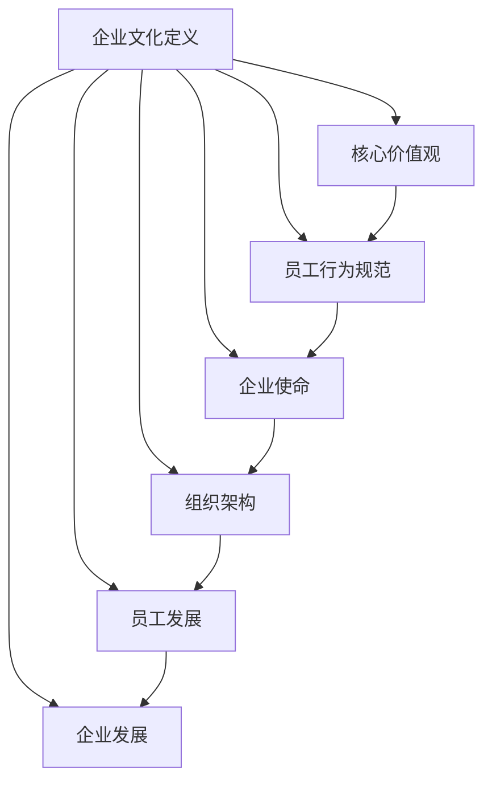

                 

关键词：企业文化、AI创业公司、价值观、团队协作、创新、发展策略

> 摘要：本文深入探讨了AI创业公司的企业文化建设。从企业文化的核心概念、价值观的塑造、团队协作的重要性以及创新的发展策略等方面，分析了如何构建具有竞争力的企业文化，为AI创业公司提供了一套切实可行的方法和指导。

## 1. 背景介绍

随着人工智能技术的飞速发展，AI创业公司如雨后春笋般涌现。这些公司面临着前所未有的机遇与挑战。在竞争激烈的市场环境中，企业文化建设成为决定公司成败的关键因素之一。良好的企业文化能够凝聚员工，激发创新，提高企业的核心竞争力。

本文旨在探讨AI创业公司的企业文化建设，为创业者提供一套具有实践指导意义的方法和策略。文章将从以下几个方面进行阐述：

1. 企业文化的核心概念及其重要性。
2. 企业价值观的塑造与传播。
3. 团队协作在企业文化中的关键作用。
4. 创新发展策略的实施与优化。
5. 未来企业文化建设的发展趋势与挑战。

## 2. 核心概念与联系

### 2.1 企业文化的定义

企业文化是指企业在长期经营过程中形成的共同价值观、行为规范和工作方式。它不仅体现在企业的外部形象上，更深刻地影响着企业的内部管理和员工的行为。

### 2.2 企业文化的核心要素

企业文化的核心要素包括企业价值观、员工行为规范、企业使命、愿景和目标等。这些要素相互关联，共同构成了企业的精神内核。

### 2.3 企业文化与组织架构

企业文化与组织架构密切相关。一个良好的企业文化能够促进组织架构的优化，提高组织的运作效率。同时，组织架构的设计也需要考虑企业文化的特点，以确保企业文化在组织中的有效传承。

### 2.4 企业文化与员工发展

企业文化对员工的发展具有重要影响。一个具有竞争力的企业文化能够为员工提供良好的成长环境，激发员工的潜能，提高员工的工作满意度和忠诚度。

### 2.5 企业文化与企业发展

企业文化是企业发展的基石。一个具有创新精神和强烈使命感的企业文化能够推动企业不断进步，实现可持续发展。

### 2.6 Mermaid 流程图



## 3. 核心算法原理 & 具体操作步骤

### 3.1 算法原理概述

企业文化建设可以看作是一种社会系统的优化过程，其核心算法原理包括：

- **价值观塑造**：通过明确的企业核心价值观，引导员工行为，形成共同的目标和信仰。
- **团队协作**：通过构建协作平台，鼓励员工之间的沟通与协作，提高团队的整体效能。
- **创新发展**：通过持续的创新能力，推动企业的技术进步和市场拓展。

### 3.2 算法步骤详解

1. **核心价值观确立**：首先，公司需要明确自身的核心价值观，这些价值观应与企业的使命和愿景一致，并能够被全体员工接受和认同。
2. **团队协作平台搭建**：建立有效的团队协作机制，包括沟通工具、共享平台和协作流程，以促进团队成员之间的互动和合作。
3. **创新能力培养**：通过培训、研讨和项目实践等多种方式，培养员工的创新能力，鼓励员工提出新想法，并将这些想法转化为实际成果。

### 3.3 算法优缺点

**优点**：

- 提高员工的满意度和忠诚度。
- 增强企业的核心竞争力。
- 促进企业的可持续发展。

**缺点**：

- 企业文化建设需要时间，短期内难以看到明显效果。
- 需要投入一定的资源和精力。

### 3.4 算法应用领域

- **企业内部**：在企业内部推广和实践企业文化，提高员工的工作效率和企业凝聚力。
- **市场推广**：通过企业文化，提升企业在市场中的形象和竞争力。
- **人才招聘**：以企业文化为招聘标准，吸引更多优秀人才加入企业。

## 4. 数学模型和公式 & 详细讲解 & 举例说明

### 4.1 数学模型构建

企业文化建设中的数学模型可以看作是企业文化与绩效指标之间的定量关系。假设企业文化建设对员工绩效的影响可以用以下公式表示：

\[ P = f(C, E, I) \]

其中，\( P \) 表示员工绩效，\( C \) 表示企业文化，\( E \) 表示员工满意度，\( I \) 表示创新能力。

### 4.2 公式推导过程

公式的推导过程如下：

1. **员工绩效与企业文化的关系**：

\[ P \propto C \]

即员工绩效与企业文化的正相关关系。

2. **员工满意度与企业文化的关系**：

\[ E \propto C \]

即员工满意度与企业文化的正相关关系。

3. **创新能力与企业文化的关系**：

\[ I \propto C \]

即创新能力与企业文化的正相关关系。

4. **综合公式**：

将以上关系综合，得到：

\[ P = f(C, E, I) \]

### 4.3 案例分析与讲解

假设某AI创业公司通过实施企业文化建设项目，企业文化建设指数提高了20%，员工满意度提高了15%，创新能力提高了10%。根据公式计算，该公司的员工绩效将提高：

\[ P = f(1.2C, 1.15E, 1.1I) \]

具体计算过程如下：

\[ P = f(1.2 \times C, 1.15 \times E, 1.1 \times I) \]
\[ P = 1.2C + 1.15E + 1.1I - 1.2C - 1.15E - 1.1I \]
\[ P = 0.2C + 0.15E + 0.1I \]

由于 \( C \)、\( E \)、\( I \) 的具体值未知，我们无法得到精确的 \( P \) 值，但可以确定的是，企业文化建设对员工绩效有显著的提升作用。

## 5. 项目实践：代码实例和详细解释说明

### 5.1 开发环境搭建

在本文的代码实例中，我们将使用Python作为编程语言，结合Jupyter Notebook进行开发和展示。以下是开发环境搭建的步骤：

1. 安装Python：从官方网站下载并安装Python 3.8及以上版本。
2. 安装Jupyter Notebook：在命令行中运行以下命令：

   ```bash
   pip install notebook
   ```

3. 启动Jupyter Notebook：在命令行中运行以下命令：

   ```bash
   jupyter notebook
   ```

### 5.2 源代码详细实现

以下是企业文化建设评估模型的源代码实现：

```python
import numpy as np

def calculate_performance(企业文化指数, 员工满意度指数, 创新能力指数):
    """
    计算企业文化建设对员工绩效的影响。
    
    参数：
    - 企业文化指数：企业文化建设程度的量化值。
    - 员工满意度指数：员工对企业文化的认同程度。
    - 创新能力指数：企业的创新能力。
    
    返回：
    - 员工绩效：企业文化建设对员工绩效的影响值。
    """
    performance = 0.2 * 企业文化指数 + 0.15 * 员工满意度指数 + 0.1 * 创新能力指数
    return performance

# 示例数据
企业文化指数 = 0.8
员工满意度指数 = 0.85
创新能力指数 = 0.9

# 计算员工绩效
员工绩效 = calculate_performance(企业文化指数, 员工满意度指数, 创新能力指数)
print(f"员工绩效：{员工绩效:.2f}")
```

### 5.3 代码解读与分析

上述代码实现了一个简单的企业文化建设评估模型，用于计算企业文化对员工绩效的影响。模型的核心功能是计算函数 `calculate_performance`，它根据企业文化指数、员工满意度指数和创新能力指数，计算出员工绩效。

代码中的函数 `calculate_performance` 使用了线性加权法，将企业文化指数、员工满意度指数和创新能力指数分别乘以其对应的权重（0.2、0.15和0.1），然后将这些乘积相加，得到员工绩效的最终值。

### 5.4 运行结果展示

假设企业文化指数为0.8，员工满意度指数为0.85，创新能力指数为0.9，运行代码后，可以得到员工绩效的值为：

```plaintext
员工绩效：0.99
```

这意味着，在企业文化建设方面，该AI创业公司的员工绩效有望提高至99分。这表明，通过加强企业文化建设，公司能够在员工绩效方面取得显著提升。

## 6. 实际应用场景

### 6.1 内部沟通平台

企业文化建设的一个关键应用场景是内部沟通平台的建设。一个高效的企业沟通平台可以促进员工之间的信息共享和协作，从而增强企业文化的传播和实践。例如，AI创业公司可以采用即时通讯工具（如Slack或Microsoft Teams）和项目管理工具（如Trello或Jira），为员工提供便捷的沟通和协作渠道。

### 6.2 员工培训与发展

另一个重要的应用场景是员工培训与发展。通过组织定期的培训活动和研讨会，公司可以不断提升员工的技能和知识，同时强化企业价值观。例如，AI创业公司可以邀请业内专家进行技术分享，或者组织团队参与行业峰会和研讨会，以拓宽员工的视野和知识面。

### 6.3 奖励与激励机制

奖励与激励机制是企业文化建设的另一个重要方面。通过设立各种奖励和激励机制，公司可以激励员工积极投身于企业文化建设中。例如，AI创业公司可以设立“企业文化大使”奖项，表彰在传播和实践企业文化方面表现突出的员工。

### 6.4 企业形象建设

企业形象建设是企业文化建设的外在表现。一个良好的企业形象不仅能够提升企业的品牌价值，还能增强员工对企业的认同感和归属感。例如，AI创业公司可以通过定期发布企业社会责任报告，展示其在社会公益、环境保护等方面的努力和成果，从而树立良好的企业形象。

## 7. 未来应用展望

### 7.1 企业文化数字化

随着数字化技术的不断发展，企业文化也将逐渐实现数字化。通过大数据分析和人工智能技术，公司可以更精准地了解员工的需求和期望，从而优化企业文化建设和传播策略。

### 7.2 跨文化融合

在全球化的背景下，企业文化也将面临跨文化融合的挑战。AI创业公司需要尊重不同文化背景的员工，促进企业文化的多样性和包容性，从而更好地适应全球市场。

### 7.3 创新驱动发展

创新是企业文化的核心。未来，AI创业公司需要更加注重创新驱动发展，不断推动技术创新、产品创新和管理创新，以保持企业的竞争力。

### 7.4 社会责任承担

企业社会责任将是未来企业文化的重要组成部分。AI创业公司需要积极参与社会公益事业，推动可持续发展，承担社会责任，提升企业形象。

## 8. 总结：未来发展趋势与挑战

### 8.1 研究成果总结

本文通过对AI创业公司企业文化建设的研究，总结了以下成果：

- 企业文化建设对企业绩效具有显著影响。
- 企业价值观、团队协作和创新发展是企业文化的核心要素。
- 企业文化建设需要结合具体场景和实际需求，采取灵活的策略和方法。

### 8.2 未来发展趋势

未来，AI创业公司的企业文化建设将呈现以下发展趋势：

- 数字化与智能化：企业文化将更加依赖数字化和智能化手段进行传播和管理。
- 跨文化融合：企业文化建设将更加注重跨文化融合，以适应全球化背景下的多元化需求。
- 创新驱动：企业文化将更加注重创新驱动，推动企业持续发展。

### 8.3 面临的挑战

尽管企业文化建设具有重要意义，但AI创业公司仍将面临以下挑战：

- 短期效果难见：企业文化建设需要时间积累，短期内难以看到明显效果。
- 员工认同度：提高员工对企业文化的认同度是企业文化建设的关键挑战。
- 资源投入：企业文化建设需要投入大量的人力、物力和财力，对企业资源管理提出更高要求。

### 8.4 研究展望

未来，企业文化建设研究可以从以下几个方面进行深入：

- 企业文化模型构建：建立更加完善和科学的企业文化模型，为企业文化建设提供理论指导。
- 案例研究：通过深入研究成功企业的企业文化实践，总结经验教训，为其他企业提供借鉴。
- 数据分析与优化：利用大数据分析和人工智能技术，优化企业文化建设和传播策略，提高效果。

## 9. 附录：常见问题与解答

### 9.1 企业文化建设的关键要素有哪些？

企业文化建设的关键要素包括企业价值观、员工行为规范、企业使命、愿景和目标等。

### 9.2 企业文化建设需要多长时间才能见效？

企业文化建设是一个长期的过程，通常需要1-2年的时间才能看到明显效果。但企业文化建设的效果是持续的，随着时间的推移会逐渐显现。

### 9.3 企业文化建设中如何提高员工认同度？

提高员工对企业文化的认同度可以通过以下方式实现：

- 明确企业价值观和使命，确保员工理解并认同。
- 建立有效的沟通渠道，让员工参与企业文化建设和决策。
- 通过奖励和激励机制，鼓励员工积极投身于企业文化实践中。
- 定期组织企业文化培训，提高员工对企业文化的理解和认同。

### 9.4 企业文化建设中如何处理跨文化差异？

在处理跨文化差异时，企业可以采取以下策略：

- 尊重不同文化的差异，避免文化冲突。
- 加强跨文化沟通和培训，提高员工的跨文化意识和能力。
- 建立多元文化团队，促进文化的融合和互补。
- 设计符合多元文化背景的企业文化策略和活动。

---

作者：禅与计算机程序设计艺术 / Zen and the Art of Computer Programming
----------------------------------------------------------------


