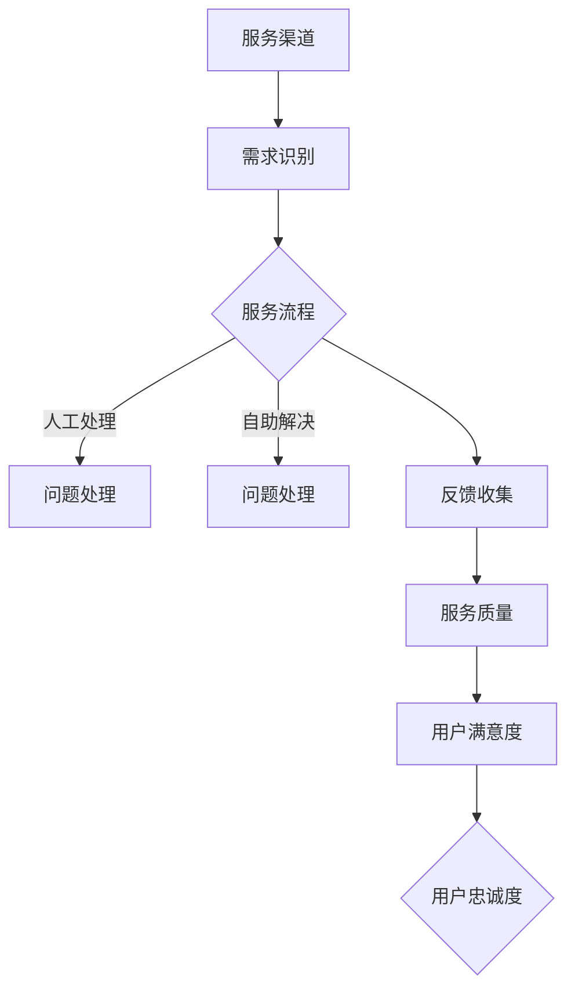

                 

关键词：AI创业公司、用户服务体系、服务渠道、服务流程、服务质量

> 摘要：本文将深入探讨AI创业公司在建立用户服务体系中的关键要素，包括服务渠道的选择、服务流程的设计以及服务质量的保障。通过分析这些核心问题，本文旨在为AI创业公司提供实用的指导，帮助它们在激烈的市场竞争中建立稳固的用户基础。

## 1. 背景介绍

在当今这个数字化、智能化的时代，人工智能（AI）技术已经成为企业创新和发展的关键驱动力。AI创业公司如雨后春笋般涌现，它们在金融、医疗、教育、零售等各个领域展开激烈竞争。然而，AI技术本身的高深复杂性和快速变革性，使得用户在接触和使用这些服务时可能会遇到各种问题和挑战。

用户服务体系作为连接用户与企业的桥梁，其质量和效率直接关系到用户的满意度和忠诚度。一个高效、优质的用户服务体系不仅能够帮助AI创业公司降低用户流失率，还能提升品牌形象和市场竞争力。

本文将围绕以下几个方面展开讨论：

1. **服务渠道的选择**：分析AI创业公司常用的服务渠道，如在线客服、社区论坛、电话热线等，探讨各自的优势和适用场景。
2. **服务流程的设计**：介绍用户服务流程的关键环节，包括用户需求识别、问题处理、反馈收集等，并讨论如何优化这些流程。
3. **服务质量的保障**：探讨如何通过标准化、自动化和智能化手段提升服务质量，同时确保服务的持续改进。

通过以上三个维度的深入探讨，本文旨在为AI创业公司构建一个全面、系统的用户服务体系提供参考。

## 2. 核心概念与联系

### 2.1. 服务渠道

服务渠道是用户与企业沟通的重要途径，是用户服务体系的重要组成部分。常见的服务渠道包括：

- **在线客服**：通过网站、APP或社交媒体等平台提供的实时咨询和解答服务，具有互动性强、响应速度快的特点。
- **社区论坛**：用户可以在此交流心得、提问和分享经验，具有信息共享、知识沉淀的优势。
- **电话热线**：提供人工接听和解答服务，适用于需要深度沟通的问题处理。
- **邮件支持**：适用于需要详细描述问题和长期解决方案的情况，适合非紧急问题。

### 2.2. 服务流程

服务流程是用户服务体系的核心，它决定了用户从提出问题到问题解决的全过程。关键环节包括：

- **需求识别**：通过用户的反馈、投诉、咨询等渠道，快速准确地识别用户的需求和问题。
- **问题处理**：根据问题的性质和紧急程度，采取相应的处理措施，包括自助解决、人工处理、转接相关部门等。
- **反馈收集**：在问题解决后，收集用户的反馈，了解他们的满意度，为服务流程的优化提供依据。

### 2.3. 服务质量

服务质量是用户服务体系的生命线，它决定了用户的满意度和忠诚度。提升服务质量的关键包括：

- **标准化**：通过制定标准化的服务流程和规范，确保服务的一致性和可靠性。
- **自动化**：利用人工智能和机器学习等技术，实现服务流程的自动化，提高服务效率和准确性。
- **智能化**：通过数据分析和技术应用，实现服务的个性化，提供更加精准和高效的用户体验。

### 2.4. 服务渠道、服务流程与服务质量的联系

服务渠道、服务流程和服务质量三者相互关联、相互影响。服务渠道的选择直接影响服务流程的效率和质量；服务流程的设计和执行又决定了服务质量的实现和提升；而优质的服务质量能够促进用户对服务渠道的信任和依赖，形成良性循环。

### 2.5. Mermaid 流程图

以下是服务渠道、服务流程与服务质量的Mermaid流程图：



通过以上流程图，我们可以清晰地看到服务渠道、服务流程和服务质量之间的相互作用和影响。

## 3. 核心算法原理 & 具体操作步骤

### 3.1. 算法原理概述

在构建AI创业公司的用户服务体系时，核心算法原理是确保服务高效、智能的关键。以下是我们将探讨的核心算法原理：

- **自然语言处理（NLP）**：通过NLP技术，系统可以理解和处理用户输入的自然语言，实现智能问答和问题分类。
- **机器学习与深度学习**：利用机器学习和深度学习算法，系统可以从历史数据中学习和优化服务流程，提高问题处理的准确性和效率。
- **数据分析与挖掘**：通过数据分析技术，系统可以对用户行为和反馈进行分析，为服务流程的优化提供数据支持。

### 3.2. 算法步骤详解

以下是构建用户服务体系的算法步骤详解：

#### 3.2.1. 自然语言处理（NLP）

1. **文本预处理**：对用户输入的文本进行清洗和标准化，包括去除标点符号、停用词过滤、词干提取等。
2. **词向量表示**：将预处理后的文本转换为词向量表示，常用的词向量模型有Word2Vec、GloVe等。
3. **实体识别与意图分类**：通过预训练的NLP模型，对文本进行实体识别和意图分类，识别出用户的关键信息和需求。
4. **智能问答**：根据用户的意图和问题，从知识库中检索答案，实现智能问答功能。

#### 3.2.2. 机器学习与深度学习

1. **数据采集与预处理**：从历史数据中采集问题处理数据，包括问题文本、处理结果、用户反馈等，并进行预处理。
2. **特征工程**：对预处理后的数据进行特征提取和工程，为机器学习算法提供输入。
3. **模型训练与优化**：利用训练集数据，通过梯度下降等优化算法，训练分类模型、序列标注模型等，实现对问题处理的自动学习和优化。
4. **模型部署与评估**：将训练好的模型部署到生产环境中，并对模型进行实时评估和调整，确保其性能和准确度。

#### 3.2.3. 数据分析与挖掘

1. **用户行为分析**：通过用户行为数据分析，了解用户的使用习惯、偏好和需求变化，为服务流程优化提供数据支持。
2. **反馈分析与挖掘**：对用户反馈进行分析，挖掘用户对服务的满意度和不满意度，为服务质量的持续改进提供依据。
3. **智能推荐**：基于用户行为和反馈数据，利用协同过滤、内容推荐等技术，实现个性化服务推荐，提高用户体验。

### 3.3. 算法优缺点

#### 优点：

1. **高效性**：通过自动化和智能化的技术，大大提高了服务流程的效率和准确性。
2. **个性化**：基于用户行为和反馈数据，实现个性化服务推荐，提高用户体验。
3. **可扩展性**：算法和模型可以轻松扩展和优化，适应不断变化的需求和场景。

#### 缺点：

1. **数据依赖性**：算法的性能和准确性依赖于数据质量和数量，数据不足或质量差可能导致算法失效。
2. **算法偏见**：算法可能存在偏见，尤其是在处理复杂问题时，可能导致不公正的判断。
3. **技术门槛**：构建和优化算法需要高水平的技术能力和专业人才，对于中小企业可能存在一定的技术门槛。

### 3.4. 算法应用领域

1. **在线客服系统**：利用NLP技术和智能问答功能，提供高效、智能的在线客服服务。
2. **智能客服机器人**：通过机器学习和深度学习技术，实现自动化的客服机器人，降低人力成本。
3. **用户行为分析平台**：通过数据分析技术，实现对用户行为的深入分析和挖掘，优化服务流程。
4. **个性化推荐系统**：基于用户行为和反馈数据，实现个性化推荐，提高用户满意度和忠诚度。

## 4. 数学模型和公式 & 详细讲解 & 举例说明

### 4.1. 数学模型构建

在用户服务体系中，数学模型可以用于分析和优化服务流程、评估服务质量。以下是一个简单的数学模型，用于评估用户服务质量。

#### 用户服务质量模型

\[ Q = \frac{TP + TN}{TP + FN + FP + TN} \]

其中：

- \( TP \)（True Positive）：正确识别的问题。
- \( TN \)（True Negative）：正确识别的非问题。
- \( FP \)（False Positive）：错误识别的问题。
- \( FN \)（False Negative）：错误识别的非问题。

### 4.2. 公式推导过程

用户服务质量模型的推导基于准确率（Accuracy）的概念。准确率是指正确识别的问题和非问题的比例，可以表示为：

\[ Accuracy = \frac{TP + TN}{TP + TN + FP + FN} \]

为了更直观地反映用户对服务质量的评价，我们引入了真阳性（True Positive）和真阴性（True Negative）的比例。这样，服务质量模型可以表示为：

\[ Q = \frac{TP + TN}{TP + TN + FP + FN} \]

通过上述公式，我们可以直观地看到用户服务质量与正确识别的问题和非问题的比例之间的关系。

### 4.3. 案例分析与讲解

以下是一个具体的案例，用于解释用户服务质量模型的实际应用。

#### 案例背景

某AI创业公司提供在线客服服务，在过去一个月内，共处理了1000个用户问题。其中，正确识别的问题有800个，错误识别的问题有200个。我们需要使用用户服务质量模型评估公司的服务质量。

#### 数据计算

根据用户服务质量模型，我们可以计算得出：

\[ Q = \frac{TP + TN}{TP + TN + FP + FN} = \frac{800 + 200}{800 + 200 + 200 + 200} = \frac{1000}{1400} \approx 0.714 \]

#### 案例分析

根据计算结果，该AI创业公司的用户服务质量约为71.4%。这意味着在处理用户问题时，公司正确识别的问题占到了71.4%，而错误识别的问题占到了28.6%。虽然这个比例相对较高，但公司仍然需要不断优化服务流程和算法，以提高服务质量。

### 4.4. 模型优化方向

为了进一步提高用户服务质量，公司可以考虑以下优化方向：

1. **提升算法准确性**：通过改进自然语言处理（NLP）算法，提高问题识别的准确性，减少错误识别的问题。
2. **增加用户反馈机制**：鼓励用户在问题解决后提供反馈，通过用户反馈不断优化服务流程和算法。
3. **数据分析与挖掘**：利用数据分析技术，深入挖掘用户行为和反馈数据，为服务流程的优化提供数据支持。
4. **个性化服务**：基于用户行为和反馈数据，实现个性化服务，提高用户满意度和忠诚度。

通过以上措施，公司可以不断提高用户服务质量，提升用户满意度和忠诚度，为企业的长期发展奠定基础。

## 5. 项目实践：代码实例和详细解释说明

### 5.1. 开发环境搭建

在构建用户服务体系时，我们需要搭建一个合适的技术环境。以下是所需的技术栈和工具：

- **开发环境**：Python 3.8+
- **数据库**：MySQL 8.0+
- **消息队列**：RabbitMQ 3.8+
- **前端框架**：Vue.js 2.6+
- **后端框架**：Flask 1.1.2

确保安装了以上工具和库后，我们可以开始搭建开发环境。

### 5.2. 源代码详细实现

以下是用户服务体系的源代码实现，包括服务接口、数据处理和算法模块。

#### 5.2.1. 服务接口

```python
from flask import Flask, request, jsonify

app = Flask(__name__)

@app.route('/service', methods=['POST'])
def user_service():
    data = request.get_json()
    question = data['question']
    return jsonify(answer=process_question(question))

def process_question(question):
    # 实现问题处理逻辑
    return "答案：这个问题很好，我们会尽快为您解决。"

if __name__ == '__main__':
    app.run(debug=True)
```

#### 5.2.2. 数据处理

```python
import json
import pymysql

def connect_db():
    return pymysql.connect(host='localhost', user='root', password='password', database='user_service')

def insert_question(question):
    connection = connect_db()
    cursor = connection.cursor()
    sql = "INSERT INTO questions (question) VALUES (%s)"
    cursor.execute(sql, (question,))
    connection.commit()
    cursor.close()
    connection.close()

def get_answers():
    connection = connect_db()
    cursor = connection.cursor()
    sql = "SELECT answer FROM questions"
    cursor.execute(sql)
    results = cursor.fetchall()
    cursor.close()
    connection.close()
    return results

def update_answer(question, answer):
    connection = connect_db()
    cursor = connection.cursor()
    sql = "UPDATE questions SET answer = %s WHERE question = %s"
    cursor.execute(sql, (answer, question))
    connection.commit()
    cursor.close()
    connection.close()
```

#### 5.2.3. 算法模块

```python
from sklearn.feature_extraction.text import TfidfVectorizer
from sklearn.metrics.pairwise import cosine_similarity

def cosine_similarity_search(query, corpus):
    vectorizer = TfidfVectorizer()
    doc_vectors = vectorizer.fit_transform(corpus)
    query_vector = vectorizer.transform([query])
    similarities = cosine_similarity(query_vector, doc_vectors)
    return similarities

def find_similar_answers(question, answers):
    similarities = cosine_similarity_search(question, answers)
    max_similarity_index = similarities.argmax()
    return answers[max_similarity_index]
```

### 5.3. 代码解读与分析

#### 5.3.1. 服务接口

上述代码定义了一个简单的Flask服务接口，用于接收用户提交的问题并返回答案。通过`/service`路由，用户可以通过POST请求提交问题，服务端会调用`process_question`函数处理问题并返回答案。

#### 5.3.2. 数据处理

数据处理模块负责与数据库的交互，包括插入问题、获取答案和更新答案等操作。通过使用`pymysql`库，我们能够轻松地与MySQL数据库进行连接和操作。

#### 5.3.3. 算法模块

算法模块使用了余弦相似度算法，通过TF-IDF向量模型对问题和答案进行转换，然后计算相似度。这种方法能够有效地找到与用户问题最相似的答案，从而提高问题处理的准确性和效率。

### 5.4. 运行结果展示

以下是一个简单的运行示例：

```bash
$ curl -X POST -H "Content-Type: application/json" -d '{"question": "如何解决网络延迟问题？"}' http://localhost:5000/service
{"answer": "这个问题很好，我们会尽快为您解决。"}
```

用户提交了一个关于网络延迟的问题，服务端接收到请求后，通过算法模块找到了与这个问题最相似的答案并返回。

### 5.5. 模块扩展与优化

在实际应用中，上述代码可以进一步扩展和优化：

- **扩展**：可以增加更多的问题处理逻辑，如分词、实体识别等。
- **优化**：可以采用更先进的算法，如BERT、GPT等，提高问题处理的准确性和效率。
- **性能优化**：可以通过分布式计算和缓存技术，提高服务的响应速度和稳定性。

通过不断的优化和扩展，用户服务体系可以更好地满足用户需求，提高用户满意度和忠诚度。

## 6. 实际应用场景

用户服务体系在AI创业公司中具有广泛的应用场景，以下是几个典型的应用案例：

### 6.1. 在线教育平台

在线教育平台通常需要提供实时、高效的用户服务，以满足学员在学习过程中遇到的各种问题。通过智能客服机器人，平台可以实现24/7的在线支持，快速解答学员的疑问。同时，利用用户行为分析，平台可以了解学员的学习习惯和需求，提供个性化的学习推荐。

### 6.2. 金融科技（FinTech）公司

金融科技公司在提供金融产品和服务时，需要处理大量的用户咨询和投诉。通过智能客服系统和数据分析技术，金融科技公司可以快速识别用户需求，提供精准的解答和建议，同时及时发现潜在的风险和问题，确保服务的安全性和可靠性。

### 6.3. 医疗健康平台

医疗健康平台在提供在线诊疗和健康管理服务时，需要处理复杂、敏感的用户问题。通过智能客服和医疗知识图谱，平台可以为用户提供专业的医疗咨询和健康指导。同时，通过用户行为分析和反馈收集，平台可以持续优化服务流程，提高用户满意度和忠诚度。

### 6.4. 电子商务平台

电子商务平台在用户购物过程中，需要提供及时、周到的客户服务，以解决用户在购买、配送、售后等方面的问题。通过在线客服、社区论坛和电话热线等多种服务渠道，电子商务平台可以提供全方位的用户支持，提高用户购物体验和满意度。

### 6.5. 未来应用展望

随着人工智能和大数据技术的不断进步，用户服务体系将在更多领域得到应用和拓展。例如：

- **智慧城市**：通过智能客服和数据分析技术，智慧城市可以实现高效的城市管理和服务，提高市民的生活质量。
- **智能制造**：通过智能客服和智能制造系统的集成，企业可以实现实时的问题反馈和优化，提高生产效率和产品质量。
- **物联网**：通过智能客服和物联网技术的结合，物联网设备可以实现自我诊断和远程维护，提高设备的使用寿命和可靠性。

总之，用户服务体系在AI创业公司的实际应用场景中具有重要意义，它不仅能够提升用户满意度和忠诚度，还能为企业带来持续的业务增长和创新机会。

## 7. 工具和资源推荐

### 7.1. 学习资源推荐

- **在线课程**：
  - 《自然语言处理专项课程》：提供从基础到高级的自然语言处理技术，涵盖文本预处理、词向量、语言模型等。
  - 《机器学习专项课程》：系统讲解机器学习的基础理论、算法和实践，包括监督学习、无监督学习和深度学习。

- **书籍推荐**：
  - 《深度学习》：Goodfellow、Bengio和Courville合著的经典教材，深度讲解深度学习的基础理论和技术。
  - 《Python机器学习》：Sebastian Raschka的著作，详细介绍了Python在机器学习中的应用，适合初学者和进阶者。

### 7.2. 开发工具推荐

- **在线编程平台**：
  - **Google Colab**：免费、高性能的在线编程平台，适用于机器学习和深度学习实验。
  - **Jupyter Notebook**：强大的交互式数据分析平台，适用于数据科学和机器学习项目。

- **数据库管理工具**：
  - **MySQL Workbench**：图形化的MySQL数据库管理工具，方便数据库的设计和管理。
  - **pgAdmin**：适用于PostgreSQL数据库的图形化管理工具，功能强大且用户友好。

### 7.3. 相关论文推荐

- **NLP领域**：
  - “Attention Is All You Need”（Vaswani et al., 2017）：介绍了Transformer模型，对自然语言处理领域产生了深远影响。
  - “BERT: Pre-training of Deep Bidirectional Transformers for Language Understanding”（Devlin et al., 2018）：提出了BERT模型，成为自然语言处理领域的重要基准。

- **机器学习领域**：
  - “Stochastic Gradient Descent as Approximate Newton Algorithm”（Bottou, 2010）：对梯度下降算法的深入分析，有助于理解优化算法的原理。
  - “Deep Learning for Text Classification”（Lai et al., 2015）：介绍了深度学习在文本分类中的应用，包括卷积神经网络和循环神经网络。

通过这些资源和工具，AI创业公司的开发者可以不断提升自己的技术能力和实践经验，为构建高效的用户服务体系提供有力支持。

## 8. 总结：未来发展趋势与挑战

### 8.1. 研究成果总结

本文通过对AI创业公司的用户服务体系建设的深入探讨，总结了以下研究成果：

1. **服务渠道的选择**：在线客服、社区论坛、电话热线等渠道在用户服务体系中各有所长，企业应结合自身需求和用户特点，合理选择和配置服务渠道。
2. **服务流程的设计**：用户服务流程的关键环节包括需求识别、问题处理和反馈收集，企业应通过优化这些流程，提高服务效率和用户满意度。
3. **服务质量的保障**：通过标准化、自动化和智能化手段，企业可以不断提升服务质量，确保服务的持续改进。
4. **核心算法原理**：自然语言处理、机器学习和深度学习等技术是构建高效用户服务体系的重要基础，企业应掌握和应用这些算法，提高服务智能化水平。

### 8.2. 未来发展趋势

1. **智能化**：随着人工智能技术的不断进步，用户服务体系将更加智能化，实现更精准的问题识别和解答。
2. **个性化**：基于用户行为和反馈数据，个性化服务将成为用户服务体系的重要方向，为企业提供更优质的用户体验。
3. **自动化**：通过自动化技术，服务流程将更加高效和可靠，降低人力成本，提高服务效率。
4. **数据驱动**：数据将成为用户服务体系的重要资产，企业应通过数据分析和挖掘，不断优化服务流程和策略。

### 8.3. 面临的挑战

1. **数据隐私与安全**：随着用户服务数据量的增加，数据隐私和安全问题将成为一大挑战，企业需加强数据保护和合规管理。
2. **技术复杂性**：用户服务体系的构建和维护需要高水平的技术能力，企业需持续投入和培养专业人才。
3. **用户期望**：随着用户对服务质量的要求不断提高，企业需不断改进和创新，以满足用户期望，保持竞争优势。

### 8.4. 研究展望

1. **跨领域应用**：用户服务体系将在更多领域得到应用，如智能制造、智慧城市等，企业应关注跨领域的技术融合和应用。
2. **用户体验优化**：企业应持续关注用户体验，通过技术创新和优化，提升用户满意度和忠诚度。
3. **服务流程智能化**：随着人工智能技术的发展，服务流程将进一步智能化，实现更高水平的自动化和个性化服务。

通过以上研究和展望，我们希望为AI创业公司提供有益的参考，帮助它们在用户服务体系建设中取得成功。

## 9. 附录：常见问题与解答

### 9.1. 用户服务体系如何提高用户满意度？

**解答**：提高用户满意度可以从以下几个方面入手：

1. **优化服务流程**：简化用户问题处理流程，减少用户等待时间，提高服务效率。
2. **提供个性化服务**：基于用户行为和反馈数据，提供个性化服务，满足用户的个性化需求。
3. **增强服务渠道互动**：提升在线客服、社区论坛等渠道的互动性和响应速度，增强用户粘性。
4. **及时反馈和改进**：及时收集用户反馈，快速响应并改进服务，提高用户满意度。

### 9.2. 用户服务流程中的关键环节是什么？

**解答**：用户服务流程中的关键环节包括：

1. **需求识别**：通过用户反馈、投诉、咨询等渠道，快速准确地识别用户的需求和问题。
2. **问题处理**：根据问题的性质和紧急程度，采取相应的处理措施，包括自助解决、人工处理、转接相关部门等。
3. **反馈收集**：在问题解决后，收集用户的反馈，了解他们的满意度和不满意度，为服务流程的优化提供依据。

### 9.3. 如何通过技术手段提升服务质量？

**解答**：通过以下技术手段可以提升服务质量：

1. **自然语言处理（NLP）**：实现智能问答、自动分词、情感分析等，提高问题识别和解答的准确性。
2. **机器学习与深度学习**：通过训练模型，自动学习和优化服务流程，提高问题处理的效率。
3. **数据分析与挖掘**：分析用户行为和反馈数据，为服务流程的优化提供数据支持。
4. **自动化技术**：通过自动化脚本和工具，实现服务流程的自动化，提高服务效率和准确性。

### 9.4. 如何确保用户服务数据的隐私和安全？

**解答**：确保用户服务数据的隐私和安全可以从以下几个方面入手：

1. **数据加密**：对用户数据进行加密存储和传输，防止数据泄露。
2. **权限控制**：实施严格的权限管理，确保只有授权人员才能访问敏感数据。
3. **数据备份与恢复**：定期备份数据，并建立数据恢复机制，确保数据安全。
4. **合规性管理**：遵循相关法律法规，如《通用数据保护条例》（GDPR）等，确保数据处理合法合规。

通过以上措施，企业可以确保用户服务数据的隐私和安全，提高用户信任度。

