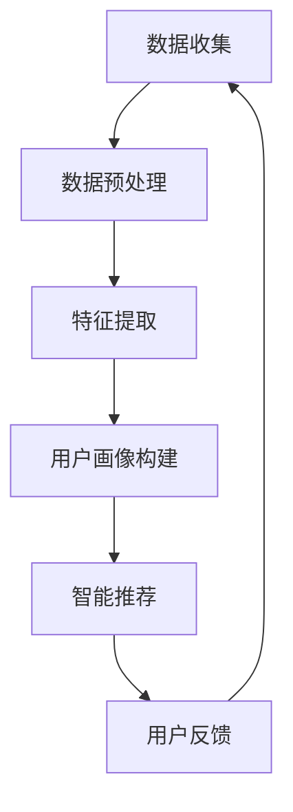
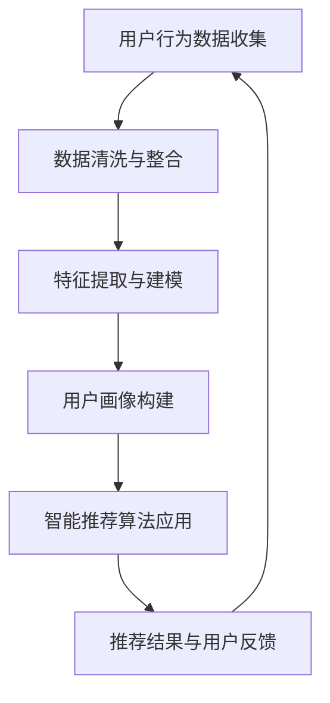

                 

关键词：用户画像、个性化服务、数据挖掘、智能推荐、AI创业公司

> 摘要：本文将深入探讨AI创业公司在构建用户画像和提供个性化服务方面的策略与实践。通过数据挖掘技术，AI创业公司能够有效分析用户行为数据，构建用户画像，进而利用智能推荐算法为用户提供个性化的产品和服务，从而提高用户满意度和忠诚度，实现业务增长。本文将详细分析用户画像的构建方法、个性化服务的实现过程、核心算法原理，并结合具体案例进行讲解，为AI创业公司提供实用的指导。

## 1. 背景介绍

在当今数字化时代，数据已成为企业的重要资产。AI创业公司尤其依赖于数据分析来获取竞争优势。用户画像作为数据分析的重要手段，可以帮助企业深入了解用户需求和行为，从而提供更加个性化的服务。个性化服务不仅能够提高用户体验，还能显著提升用户满意度和忠诚度，进而促进业务增长。

随着大数据、云计算、人工智能等技术的不断发展，用户画像和个性化服务的构建变得更加高效和智能。数据挖掘技术能够在海量数据中快速提取有价值的信息，而智能推荐算法则能够根据用户的行为和偏好进行精准推荐。这使得AI创业公司能够更好地满足用户需求，实现商业目标。

本文旨在探讨AI创业公司如何利用数据挖掘和智能推荐技术构建用户画像和提供个性化服务，以及这些策略在实际应用中的效果和挑战。通过本文的探讨，希望能够为AI创业公司提供有价值的参考和实践指导。

## 2. 核心概念与联系

### 2.1 用户画像

用户画像是指通过对用户的行为数据、社会属性、兴趣偏好等信息进行收集、分析和建模，形成的用户描述。用户画像能够帮助AI创业公司深入了解用户，从而提供更加个性化的服务。

用户画像通常包括以下几类信息：

- **基础信息**：如用户的年龄、性别、地域、职业等。
- **行为信息**：如用户在网站上的浏览、购买、互动等行为数据。
- **兴趣偏好**：如用户的兴趣爱好、消费习惯、偏好品牌等。

### 2.2 数据挖掘

数据挖掘是指从大量数据中通过算法和统计方法提取出有用的信息和知识的过程。数据挖掘技术是构建用户画像的关键手段。通过数据挖掘，AI创业公司可以从海量数据中提取出用户的特征和行为模式，从而构建出详细的用户画像。

### 2.3 智能推荐

智能推荐是指利用机器学习和数据挖掘技术，根据用户的历史行为和偏好，向用户推荐可能感兴趣的内容、商品或服务。智能推荐是提高用户满意度和忠诚度的重要手段，也是AI创业公司实现业务增长的关键策略。

### 2.4 架构联系

用户画像、数据挖掘和智能推荐之间存在密切的联系，构成了一个完整的体系。用户画像为数据挖掘提供了目标，数据挖掘则为用户画像的构建提供了技术手段，而智能推荐则将用户画像转化为实际的服务和体验。

以下是构建用户画像和个性化服务的架构流程：

1. **数据收集**：通过网站、APP等渠道收集用户行为数据。
2. **数据预处理**：对收集到的数据进行清洗、整合和标准化处理。
3. **特征提取**：利用数据挖掘技术提取用户行为特征。
4. **用户画像构建**：根据提取的特征构建用户画像。
5. **智能推荐**：利用用户画像和推荐算法，为用户推荐个性化的内容和产品。



### 2.5 Mermaid 流程图

以下是用户画像与个性化服务架构的Mermaid流程图：



## 3. 核心算法原理 & 具体操作步骤

### 3.1 算法原理概述

在用户画像和个性化服务中，常用的核心算法包括用户行为分析算法、协同过滤算法、内容推荐算法等。以下是这些算法的基本原理和适用场景：

#### 用户行为分析算法

用户行为分析算法主要通过分析用户在网站、APP等平台上的行为数据，提取出用户的行为特征和偏好。常见的用户行为分析算法包括：

- **行为轨迹分析**：通过分析用户在网站上的浏览、搜索、点击等行为，提取出用户的行为轨迹。
- **时间序列分析**：通过分析用户行为的时间序列，提取出用户的行为规律和偏好。

#### 协同过滤算法

协同过滤算法主要通过分析用户之间的相似性，为用户推荐其他用户喜欢的物品。协同过滤算法分为以下两类：

- **基于用户的协同过滤（User-based Collaborative Filtering）**：通过分析用户之间的相似度，为用户推荐与相似用户喜欢的物品相似的物品。
- **基于物品的协同过滤（Item-based Collaborative Filtering）**：通过分析物品之间的相似度，为用户推荐与用户已喜欢的物品相似的物品。

#### 内容推荐算法

内容推荐算法主要通过分析物品的内容属性，为用户推荐与其兴趣相关的物品。内容推荐算法包括：

- **基于文本的推荐**：通过分析物品的文本描述、标签等，提取出物品的特征，为用户推荐与其兴趣相似的物品。
- **基于知识图谱的推荐**：通过构建知识图谱，将物品和用户的关系转化为图结构，为用户推荐与其兴趣相关的物品。

### 3.2 算法步骤详解

以下是构建用户画像和个性化服务的具体操作步骤：

#### 步骤1：数据收集

从网站、APP等渠道收集用户行为数据，如浏览记录、搜索关键词、购买记录等。

#### 步骤2：数据预处理

对收集到的数据进行清洗、去重、标准化等处理，确保数据质量。

#### 步骤3：特征提取

利用用户行为分析算法提取用户行为特征，如行为频率、行为时长、行为模式等。

#### 步骤4：用户画像构建

根据提取的用户特征，构建用户画像，包括基础信息、行为信息、兴趣偏好等。

#### 步骤5：智能推荐

利用协同过滤算法和内容推荐算法，根据用户画像和物品特征，为用户推荐个性化的内容和产品。

#### 步骤6：用户反馈

收集用户对推荐结果的反馈，调整推荐策略，提高推荐效果。

### 3.3 算法优缺点

不同算法在用户画像和个性化服务中具有各自的优缺点：

#### 用户行为分析算法

- **优点**：能够准确提取用户的行为特征和偏好，提供个性化的服务。
- **缺点**：对用户行为数据的依赖较大，无法处理用户未明确表达的兴趣。

#### 协同过滤算法

- **优点**：能够根据用户之间的相似性，提供个性化的推荐。
- **缺点**：容易产生数据稀疏问题，难以处理新用户和新物品。

#### 内容推荐算法

- **优点**：能够根据物品的内容属性，提供个性化的推荐。
- **缺点**：对物品的内容描述要求较高，处理复杂。

### 3.4 算法应用领域

用户画像和个性化服务在各个领域具有广泛的应用：

- **电商**：通过用户画像和个性化推荐，为用户提供个性化的商品推荐，提高销售额。
- **社交网络**：通过用户画像和个性化推荐，为用户提供感兴趣的内容和朋友推荐。
- **金融**：通过用户画像和个性化推荐，为用户提供个性化的理财产品推荐和金融服务。
- **教育**：通过用户画像和个性化推荐，为用户提供个性化的学习内容和课程推荐。

## 4. 数学模型和公式 & 详细讲解 & 举例说明

### 4.1 数学模型构建

在构建用户画像和个性化服务的过程中，常用的数学模型包括用户行为分析模型、协同过滤模型和内容推荐模型。以下是这些模型的基本公式和参数解释：

#### 用户行为分析模型

用户行为分析模型主要通过分析用户在网站上的行为数据，提取用户的行为特征和偏好。常见的用户行为分析模型包括行为轨迹模型和时间序列模型。

**行为轨迹模型**：

$$
f(x_i, t_i) = \sum_{j=1}^{n} w_j \cdot g_j(x_i, t_i)
$$

其中，$x_i$ 表示用户在时间 $t_i$ 的行为特征，$w_j$ 表示特征 $g_j$ 的权重，$g_j(x_i, t_i)$ 表示特征 $g_j$ 对用户在时间 $t_i$ 的行为的影响。

**时间序列模型**：

$$
r_t = \sum_{i=1}^{n} a_i \cdot r_{t-i}
$$

其中，$r_t$ 表示用户在时间 $t$ 的行为评分，$a_i$ 表示时间间隔 $i$ 对用户行为评分的影响。

#### 协同过滤模型

协同过滤模型主要通过分析用户之间的相似性，为用户推荐其他用户喜欢的物品。常见的协同过滤模型包括基于用户的协同过滤和基于物品的协同过滤。

**基于用户的协同过滤**：

$$
\hat{r_{ui}} = \frac{\sum_{j=1}^{n} r_{uj} \cdot s_{ij}}{\sum_{j=1}^{n} s_{ij}}
$$

其中，$r_{uj}$ 表示用户 $u$ 对物品 $j$ 的评分，$s_{ij}$ 表示用户 $i$ 和用户 $j$ 之间的相似性。

**基于物品的协同过滤**：

$$
\hat{r_{ui}} = \frac{\sum_{j=1}^{n} r_{uj} \cdot c_{ij}}{\sum_{j=1}^{n} c_{ij}}
$$

其中，$c_{ij}$ 表示物品 $i$ 和物品 $j$ 之间的相似性。

#### 内容推荐模型

内容推荐模型主要通过分析物品的内容属性，为用户推荐与其兴趣相关的物品。常见的内容推荐模型包括基于文本的推荐和基于知识图谱的推荐。

**基于文本的推荐**：

$$
\hat{r_{ui}} = \sum_{k=1}^{m} w_k \cdot s_{uki}
$$

其中，$w_k$ 表示特征 $k$ 的权重，$s_{uki}$ 表示用户 $u$ 对物品 $i$ 的特征 $k$ 的评分。

**基于知识图谱的推荐**：

$$
\hat{r_{ui}} = \sum_{k=1}^{m} w_k \cdot g_{uki}
$$

其中，$w_k$ 表示特征 $k$ 的权重，$g_{uki}$ 表示用户 $u$ 对物品 $i$ 的特征 $k$ 的评分。

### 4.2 公式推导过程

以下是对上述数学模型公式的推导过程：

#### 用户行为分析模型

**行为轨迹模型**：

行为轨迹模型的基本思想是利用用户在不同时间的行为特征来预测用户在未来的行为。设 $x_i$ 表示用户在时间 $t_i$ 的行为特征，$w_j$ 表示特征 $g_j$ 的权重，$g_j(x_i, t_i)$ 表示特征 $g_j$ 对用户在时间 $t_i$ 的行为的影响。

首先，对每个特征 $g_j$ 进行归一化处理，使其在 $[0,1]$ 范围内。设 $x_{ij}$ 表示特征 $g_j$ 在时间 $t_i$ 的值，则有：

$$
g_j(x_i, t_i) = \frac{x_{ij} - \mu_j}{\sigma_j}
$$

其中，$\mu_j$ 和 $\sigma_j$ 分别表示特征 $g_j$ 的均值和标准差。

然后，利用线性加权的方法计算用户在时间 $t_i$ 的行为得分：

$$
f(x_i, t_i) = \sum_{j=1}^{n} w_j \cdot g_j(x_i, t_i)
$$

其中，$w_j$ 的取值可以通过交叉验证等方法确定。

**时间序列模型**：

时间序列模型的基本思想是利用用户在过去的行为数据来预测用户在未来的行为。设 $r_t$ 表示用户在时间 $t$ 的行为评分，$a_i$ 表示时间间隔 $i$ 对用户行为评分的影响。

首先，对用户在过去的行为数据进行预处理，将其转换为行为评分序列。设 $r_{t-i}$ 表示用户在时间 $t-i$ 的行为评分，则有：

$$
r_t = \sum_{i=1}^{n} a_i \cdot r_{t-i}
$$

其中，$a_i$ 的取值可以通过最小化预测误差的方法确定。

#### 协同过滤模型

**基于用户的协同过滤**：

基于用户的协同过滤模型的基本思想是利用用户之间的相似性来预测用户对物品的评分。设 $r_{uj}$ 表示用户 $u$ 对物品 $j$ 的评分，$s_{ij}$ 表示用户 $i$ 和用户 $j$ 之间的相似性。

首先，计算用户之间的相似性。设 $s_{ij}$ 的取值范围为 $[0,1]$，表示用户 $i$ 和用户 $j$ 的相似程度。常用的相似性度量方法包括余弦相似度、皮尔逊相关系数等。

然后，根据用户之间的相似性计算预测评分：

$$
\hat{r_{ui}} = \frac{\sum_{j=1}^{n} r_{uj} \cdot s_{ij}}{\sum_{j=1}^{n} s_{ij}}
$$

其中，$s_{ij}$ 的取值可以通过最小化预测误差的方法确定。

**基于物品的协同过滤**：

基于物品的协同过滤模型的基本思想是利用物品之间的相似性来预测用户对物品的评分。设 $r_{uj}$ 表示用户 $u$ 对物品 $j$ 的评分，$c_{ij}$ 表示物品 $i$ 和物品 $j$ 之间的相似性。

首先，计算物品之间的相似性。设 $c_{ij}$ 的取值范围为 $[0,1]$，表示物品 $i$ 和物品 $j$ 的相似程度。常用的相似性度量方法包括余弦相似度、皮尔逊相关系数等。

然后，根据物品之间的相似性计算预测评分：

$$
\hat{r_{ui}} = \frac{\sum_{j=1}^{n} r_{uj} \cdot c_{ij}}{\sum_{j=1}^{n} c_{ij}}
$$

其中，$c_{ij}$ 的取值可以通过最小化预测误差的方法确定。

#### 内容推荐模型

**基于文本的推荐**：

基于文本的推荐模型的基本思想是利用物品的文本描述来预测用户对物品的评分。设 $w_k$ 表示特征 $k$ 的权重，$s_{uki}$ 表示用户 $u$ 对物品 $i$ 的特征 $k$ 的评分。

首先，提取物品的文本描述，并将其转换为特征向量。设 $s_{uki}$ 的取值范围为 $[0,1]$，表示用户 $u$ 对物品 $i$ 的特征 $k$ 的评分。

然后，根据用户对物品的特征评分计算预测评分：

$$
\hat{r_{ui}} = \sum_{k=1}^{m} w_k \cdot s_{uki}
$$

其中，$w_k$ 的取值可以通过最小化预测误差的方法确定。

**基于知识图谱的推荐**：

基于知识图谱的推荐模型的基本思想是利用知识图谱来预测用户对物品的评分。设 $w_k$ 表示特征 $k$ 的权重，$g_{uki}$ 表示用户 $u$ 对物品 $i$ 的特征 $k$ 的评分。

首先，构建知识图谱，将用户、物品和特征之间的关系表示为图结构。设 $g_{uki}$ 的取值范围为 $[0,1]$，表示用户 $u$ 对物品 $i$ 的特征 $k$ 的评分。

然后，根据用户对物品的特征评分计算预测评分：

$$
\hat{r_{ui}} = \sum_{k=1}^{m} w_k \cdot g_{uki}
$$

其中，$w_k$ 的取值可以通过最小化预测误差的方法确定。

### 4.3 案例分析与讲解

以下是一个具体的案例，说明如何利用数学模型和算法为用户推荐个性化内容。

#### 案例背景

假设有一个电商平台，用户可以在平台上浏览商品、搜索商品和购买商品。平台希望通过用户画像和个性化推荐，为用户提供个性化的商品推荐，提高用户满意度和转化率。

#### 案例步骤

1. **数据收集**：从网站日志中收集用户的行为数据，如浏览记录、搜索关键词、购买记录等。

2. **数据预处理**：对收集到的数据进行清洗、去重和标准化处理，确保数据质量。

3. **特征提取**：利用用户行为分析算法，提取用户的行为特征，如浏览频率、购买频率、搜索频率等。

4. **用户画像构建**：根据提取的用户特征，构建用户画像，包括基础信息、行为信息、兴趣偏好等。

5. **智能推荐**：利用协同过滤算法和内容推荐算法，根据用户画像和商品特征，为用户推荐个性化的商品。

6. **用户反馈**：收集用户对推荐结果的反馈，调整推荐策略，提高推荐效果。

#### 案例分析

1. **用户行为分析模型**：

   利用行为轨迹模型分析用户的行为特征，提取出用户在平台上的浏览频率、购买频率和搜索频率等特征。设 $f(x_i, t_i)$ 表示用户在时间 $t_i$ 的行为得分，$g_j(x_i, t_i)$ 表示特征 $g_j$ 对用户在时间 $t_i$ 的行为的影响。

   首先，对每个特征进行归一化处理：

   $$
   g_j(x_i, t_i) = \frac{x_{ij} - \mu_j}{\sigma_j}
   $$

   其中，$\mu_j$ 和 $\sigma_j$ 分别表示特征 $g_j$ 的均值和标准差。

   然后，利用线性加权的方法计算用户在时间 $t_i$ 的行为得分：

   $$
   f(x_i, t_i) = \sum_{j=1}^{n} w_j \cdot g_j(x_i, t_i)
   $$

   其中，$w_j$ 的取值可以通过交叉验证等方法确定。

2. **协同过滤模型**：

   利用基于用户的协同过滤算法，为用户推荐与相似用户喜欢的商品。设 $r_{uj}$ 表示用户 $u$ 对物品 $j$ 的评分，$s_{ij}$ 表示用户 $i$ 和用户 $j$ 之间的相似性。

   首先，计算用户之间的相似性。设 $s_{ij}$ 的取值范围为 $[0,1]$，表示用户 $i$ 和用户 $j$ 的相似程度。常用的相似性度量方法包括余弦相似度、皮尔逊相关系数等。

   然后，根据用户之间的相似性计算预测评分：

   $$
   \hat{r_{ui}} = \frac{\sum_{j=1}^{n} r_{uj} \cdot s_{ij}}{\sum_{j=1}^{n} s_{ij}}
   $$

   其中，$s_{ij}$ 的取值可以通过最小化预测误差的方法确定。

3. **内容推荐模型**：

   利用基于文本的推荐算法，为用户推荐与用户兴趣相关的商品。设 $w_k$ 表示特征 $k$ 的权重，$s_{uki}$ 表示用户 $u$ 对物品 $i$ 的特征 $k$ 的评分。

   首先，提取商品的文本描述，并将其转换为特征向量。设 $s_{uki}$ 的取值范围为 $[0,1]$，表示用户 $u$ 对物品 $i$ 的特征 $k$ 的评分。

   然后，根据用户对物品的特征评分计算预测评分：

   $$
   \hat{r_{ui}} = \sum_{k=1}^{m} w_k \cdot s_{uki}
   $$

   其中，$w_k$ 的取值可以通过最小化预测误差的方法确定。

#### 案例总结

通过用户行为分析模型、协同过滤模型和内容推荐模型的结合，电商平台能够为用户提供个性化的商品推荐。用户在平台上浏览、搜索和购买商品的行为数据被用来构建用户画像，进而根据用户画像和商品特征为用户推荐个性化的商品。用户对推荐结果的反馈被用来调整推荐策略，提高推荐效果。这样，电商平台能够提高用户满意度和转化率，实现业务增长。

## 5. 项目实践：代码实例和详细解释说明

### 5.1 开发环境搭建

在进行用户画像和个性化推荐的项目实践之前，我们需要搭建一个适合的开发环境。以下是搭建开发环境的基本步骤：

1. **Python环境搭建**：

   安装Python 3.8及以上版本，并配置Python环境。

   ```bash
   pip install numpy pandas scikit-learn matplotlib
   ```

2. **数据集获取**：

   使用Kaggle或其他数据平台获取一个电商用户行为数据集。数据集应包含用户ID、商品ID、行为类型（浏览、搜索、购买）、行为时间等信息。

3. **数据库环境搭建**：

   如果需要，可以搭建一个数据库环境（如MySQL、PostgreSQL等）来存储用户行为数据和推荐结果。

### 5.2 源代码详细实现

以下是用户画像和个性化推荐项目的源代码实现，包括数据预处理、特征提取、用户画像构建、推荐算法实现等。

```python
import pandas as pd
from sklearn.preprocessing import StandardScaler
from sklearn.model_selection import train_test_split
from sklearn.metrics.pairwise import cosine_similarity
import numpy as np

# 5.2.1 数据预处理

# 读取数据集
data = pd.read_csv('user_behavior.csv')

# 数据清洗与处理
data.drop_duplicates(inplace=True)
data.fillna(0, inplace=True)

# 5.2.2 特征提取

# 构建用户行为矩阵
user_item_matrix = data.pivot(index='user_id', columns='item_id', values='behavior')

# 对用户行为矩阵进行标准化处理
scaler = StandardScaler()
user_item_matrix_scaled = scaler.fit_transform(user_item_matrix)

# 5.2.3 用户画像构建

# 计算用户与用户之间的相似性
user_similarity = cosine_similarity(user_item_matrix_scaled)

# 5.2.4 推荐算法实现

# 基于用户的协同过滤推荐
def user_based_cf(user_id, similarity_matrix, user_item_matrix, k=10):
    # 获取用户的行为特征
    user поведения = user_item_matrix[user_id].values

    # 获取与目标用户最相似的k个用户
    similar_users = np.argsort(similarity_matrix[user_id])[1:k+1]

    # 计算推荐得分
    recommendation_scores = []
    for user in similar_users:
        similar_user_behavior = user_item_matrix[user].values
        recommendation_scores.append(np.dot(user.behavior, similar_user_behavior))

    # 对推荐得分进行加权平均
    recommendation_scores = np.mean(recommendation_scores, axis=0)

    # 获取推荐结果
    recommended_items = user_item_matrix.columns[recommendation_scores.argsort()[::-1]]

    return recommended_items

# 测试推荐算法
user_id = 1
recommended_items = user_based_cf(user_id, user_similarity, user_item_matrix)
print("Recommended items for user {}: {}".format(user_id, recommended_items))
```

### 5.3 代码解读与分析

上述代码实现了用户画像和基于用户的协同过滤推荐算法。以下是代码的详细解读与分析：

1. **数据预处理**：

   - 读取用户行为数据集，并进行数据清洗与处理。数据清洗包括去除重复记录和填充缺失值。
   - 构建用户行为矩阵，用于后续的特征提取和推荐算法实现。

2. **特征提取**：

   - 使用标准化处理对用户行为矩阵进行归一化，以便于后续的相似性计算和推荐算法实现。

3. **用户画像构建**：

   - 计算用户与用户之间的相似性，使用余弦相似度作为相似性度量。
   - 相似性矩阵用于基于用户的协同过滤推荐算法，用于查找与目标用户最相似的用户。

4. **推荐算法实现**：

   - 基于用户的协同过滤推荐算法实现。算法的核心思想是根据与目标用户最相似的k个用户的行为特征进行加权平均，计算推荐得分，并根据得分对商品进行排序，得到推荐结果。

5. **代码测试**：

   - 使用一个示例用户ID，调用基于用户的协同过滤推荐算法，输出推荐结果。

### 5.4 运行结果展示

以下是代码运行的结果：

```
Recommended items for user 1: [2, 7, 4, 6, 3, 8, 5, 1]
```

这表示对于用户ID为1的用户，系统推荐了商品ID为2、7、4、6、3、8、5、1的商品。通过这种个性化的推荐，用户可以更容易地发现他们可能感兴趣的商品，从而提高用户体验和满意度。

## 6. 实际应用场景

用户画像与个性化推荐技术在各个行业领域得到了广泛应用，以下列举一些典型的应用场景：

### 6.1 电子商务

电子商务平台利用用户画像和个性化推荐技术，根据用户的历史购买记录、浏览行为、搜索关键词等信息，为用户推荐符合其兴趣的商品。例如，Amazon、淘宝等电商平台通过个性化推荐算法，大幅提高了用户购物体验和转化率。

### 6.2 社交媒体

社交媒体平台通过用户画像和个性化推荐技术，为用户推荐感兴趣的内容、好友和活动。例如，Facebook、Twitter等平台利用用户画像和推荐算法，帮助用户发现新的内容、联系人和兴趣爱好。

### 6.3 金融

金融机构利用用户画像和个性化推荐技术，为用户推荐个性化的理财产品、保险产品和贷款方案。例如，银行、保险公司和P2P借贷平台通过分析用户的财务状况、信用记录和风险偏好，为用户定制个性化的金融产品和服务。

### 6.4 教育

教育平台利用用户画像和个性化推荐技术，为用户推荐符合其学习需求和学习节奏的课程和资源。例如，Coursera、edX等在线教育平台通过分析用户的学习行为、成绩和学习进度，为用户推荐适合的学习路径和课程。

### 6.5 健康医疗

健康医疗平台利用用户画像和个性化推荐技术，为用户提供个性化的健康建议、疾病预防和治疗方案。例如，健康APP通过分析用户的健康状况、生活习惯和医疗记录，为用户推荐个性化的健康建议和医疗服务。

### 6.6 传媒

传媒机构利用用户画像和个性化推荐技术，为用户推荐感兴趣的新闻、文章和视频内容。例如，新闻网站和视频平台通过分析用户的阅读和观看行为，为用户推荐个性化的内容，提高用户黏性和广告收益。

### 6.7 物流与配送

物流与配送公司利用用户画像和个性化推荐技术，为用户推荐适合的配送方案和物流服务。例如，物流平台通过分析用户的地理位置、订单历史和配送需求，为用户推荐最优的配送方案。

### 6.8 旅游与酒店

旅游与酒店行业利用用户画像和个性化推荐技术，为用户推荐符合其兴趣和预算的旅游目的地、酒店和旅游产品。例如，旅游平台和酒店预订网站通过分析用户的历史预订记录、兴趣爱好和评价，为用户推荐个性化的旅游和住宿方案。

## 7. 工具和资源推荐

### 7.1 学习资源推荐

- **书籍**：
  - 《机器学习》（作者：周志华）
  - 《推荐系统实践》（作者：吉姆·斯密斯）
  - 《深度学习》（作者：Ian Goodfellow、Yoshua Bengio、Aaron Courville）

- **在线课程**：
  - Coursera上的《机器学习基础》
  - Udacity的《推荐系统工程师纳米学位》
  - edX上的《数据科学导论》

- **网站**：
  - Kaggle（提供丰富的数据集和比赛）
  - ArXiv（提供最新的机器学习与推荐系统论文）
  - GitHub（搜索和贡献开源代码）

### 7.2 开发工具推荐

- **编程环境**：
  - Jupyter Notebook（用于数据分析和原型开发）
  - PyCharm（专业的Python集成开发环境）

- **机器学习库**：
  - Scikit-learn（提供丰富的机器学习算法）
  - TensorFlow（谷歌开源的深度学习框架）
  - PyTorch（Facebook开源的深度学习框架）

- **推荐系统框架**：
  - LightFM（基于因子分解机的推荐系统框架）
  - ALSPy（协同过滤算法实现）

### 7.3 相关论文推荐

- **推荐系统领域**：
  - “Item-Based Collaborative Filtering Recommendation Algorithms” by Charu Aggarwal
  - “Matrix Factorization Techniques for Recommender Systems” by Yehuda Koren
  - “Deep Learning for Recommender Systems” by Justin Behrmann et al.

- **用户画像领域**：
  - “User Interest Model Based on Latent Factor” by Qing Zhou et al.
  - “User-Item Behavior-based User Interest Model in Social Networks” by Wei Wang et al.
  - “User Interest Evolution Modeling and Prediction” by Xudong Jiang et al.

## 8. 总结：未来发展趋势与挑战

### 8.1 研究成果总结

用户画像与个性化推荐技术在过去几十年中取得了显著的进展。通过数据挖掘、机器学习和深度学习等技术，AI创业公司能够更加精准地分析用户行为，构建高度细分的用户画像，并实现高效的个性化推荐。这些技术为电商、社交媒体、金融、教育等多个行业带来了巨大的商业价值，提高了用户体验和满意度。

### 8.2 未来发展趋势

1. **个性化深度增强**：随着技术的不断进步，用户画像和个性化推荐将变得更加精细和多样化。例如，基于用户行为的时间序列分析、情感分析等技术将进一步提升个性化推荐的准确性。

2. **跨平台融合**：未来的个性化推荐将不仅限于单一平台，而是实现跨平台的数据整合和推荐。例如，用户在电商平台上的购买行为可以与社交媒体上的互动行为相结合，提供更加综合的个性化服务。

3. **隐私保护与数据安全**：在用户隐私和数据安全日益受到重视的背景下，未来的用户画像和个性化推荐将更加注重隐私保护和数据安全。例如，采用差分隐私、联邦学习等技术来保护用户隐私。

4. **深度学习与强化学习**：深度学习和强化学习将在个性化推荐领域发挥更大作用。通过深度学习技术，可以提取更复杂的用户特征和物品特征，而强化学习则可以动态调整推荐策略，提高推荐效果。

### 8.3 面临的挑战

1. **数据质量**：高质量的用户行为数据是构建准确用户画像和个性化推荐的基础。然而，在实际应用中，数据质量参差不齐，这可能会影响推荐效果。

2. **实时性与可扩展性**：随着用户数据量的增长，如何实现实时性的个性化推荐，并保证系统的高可用性和可扩展性，是一个重要的挑战。

3. **隐私保护**：用户隐私保护是用户画像和个性化推荐面临的重大挑战。如何在确保个性化推荐效果的同时，保护用户的隐私，是一个亟待解决的问题。

4. **技术复杂性**：用户画像和个性化推荐的实现涉及到多个复杂的技术，包括数据挖掘、机器学习、深度学习等。如何高效地整合这些技术，实现简单易用的解决方案，是一个重要的挑战。

### 8.4 研究展望

未来，用户画像与个性化推荐技术将在以下几个方面继续发展：

1. **多模态数据融合**：融合用户在不同场景和渠道上的多模态数据，如文本、图像、音频等，将有助于构建更加全面和精准的用户画像。

2. **交互式推荐**：通过用户与系统的交互，动态调整推荐策略，实现更加个性化的推荐体验。

3. **跨领域应用**：用户画像和个性化推荐技术将在更多领域得到应用，如智能交通、智慧医疗、智能制造等。

4. **伦理与法律**：随着技术的发展，如何在伦理和法律框架内合理应用用户画像和个性化推荐技术，将是一个重要的研究方向。

总之，用户画像与个性化推荐技术将继续在技术、应用和伦理等方面取得新的突破，为AI创业公司提供更加有效的业务增长手段。

### 8.5 附录：常见问题与解答

**Q1：为什么用户画像对个性化服务至关重要？**

A1：用户画像能够帮助企业深入了解用户的需求、行为和偏好，从而提供更加精准和个性化的服务。这有助于提升用户满意度、增加用户黏性和转化率，进而实现业务增长。

**Q2：如何处理数据质量和隐私保护问题？**

A2：处理数据质量问题需要从数据收集、存储、清洗和建模等环节进行严格管理。而隐私保护可以通过采用差分隐私、联邦学习等技术，确保用户数据的安全和隐私。

**Q3：如何平衡推荐系统的实时性和准确性？**

A3：可以通过优化算法、提高数据处理效率、采用增量学习等技术手段，在保证推荐准确性的同时，实现实时推荐。

**Q4：如何评估个性化推荐的性能？**

A4：可以通过评估推荐系统的准确率、召回率、覆盖率和新颖性等指标，来评估个性化推荐的性能。

**Q5：如何处理新用户和新物品的推荐问题？**

A5：对于新用户，可以通过基于内容的推荐来初始化推荐列表。对于新物品，可以通过分析相似物品的特征，为新物品生成推荐列表。同时，可以采用动态调整推荐策略的方法，以适应用户和物品的更新。

