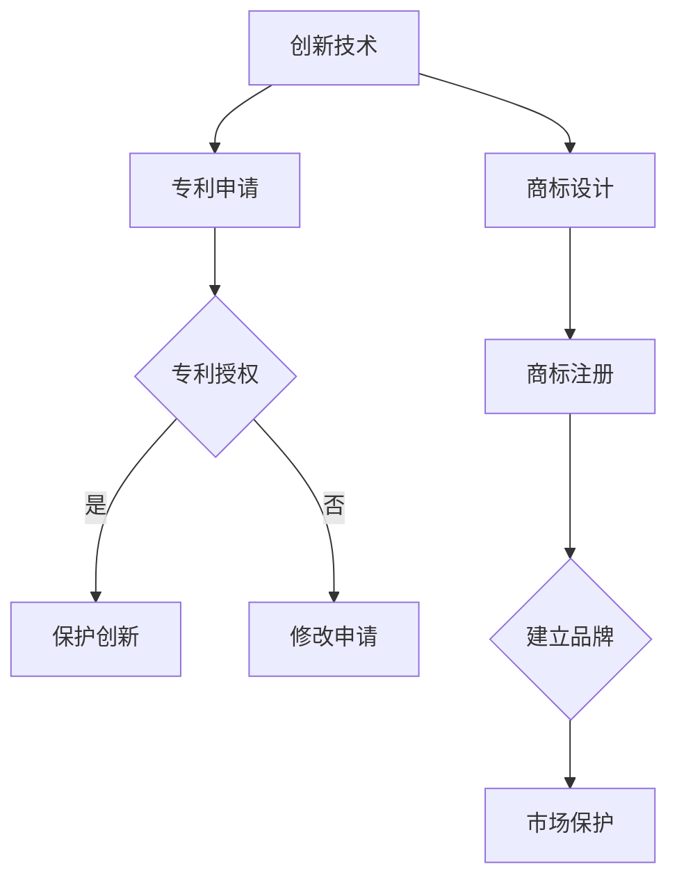

                 

关键词：AI创业公司，知识产权，专利申请，商标注册

摘要：随着人工智能技术的快速发展，AI创业公司如雨后春笋般涌现。然而，在市场竞争激烈的环境下，如何合理布局知识产权，尤其是专利申请和商标注册，成为创业公司成功的关键。本文将深入探讨AI创业公司的知识产权布局策略，帮助创业者更好地保护自己的创新成果，提升市场竞争力。

## 1. 背景介绍

近年来，人工智能（AI）技术的迅猛发展引发了全球范围内的广泛关注。从智能助手到自动驾驶，从医疗诊断到金融风控，AI技术的应用已经渗透到各行各业。随着技术的不断进步，越来越多的创业者投身于AI领域，希望能够在这个新兴的市场中分得一杯羹。

然而，AI创业公司在快速发展的同时，也面临着巨大的挑战。首先，市场竞争日益激烈，许多公司都在追求相同的创新点，导致产品同质化严重。其次，知识产权的保护问题成为制约创业公司发展的关键因素。如果创业公司的知识产权得不到有效保护，那么在市场上就可能被竞争对手抄袭、侵权，从而导致巨大的经济损失。

因此，如何在激烈的市场竞争中保护自己的知识产权，尤其是专利申请和商标注册，成为AI创业公司必须要解决的问题。本文将结合实际案例，深入分析AI创业公司的知识产权布局策略，为创业者提供实用的指导。

## 2. 核心概念与联系

### 2.1 知识产权的定义与分类

知识产权是指人们对其智力劳动成果所依法享有的专有权利。根据世界知识产权组织（WIPO）的分类，知识产权主要包括以下几种类型：

- **专利权**：指发明人对其发明创造所享有的专有权利。
- **商标权**：指商标注册人对其商标所享有的专有权利。
- **著作权**：指作者对其作品所享有的专有权利。
- **商业秘密**：指不为公众所知悉，能为权利人带来经济利益，具有实用性并经权利人采取保密措施的技术信息和经营信息。

在本文中，我们主要关注专利权和商标权的保护策略。

### 2.2 专利权与商标权的联系

专利权与商标权虽然属于不同的知识产权类别，但在保护创新成果方面具有密切的联系。

- **专利权**：专利权是创业公司对技术创新的核心保护手段。通过专利申请，创业公司可以将自己的技术方案公开并申请法律保护，防止竞争对手抄袭、侵权。专利权通常包括发明、实用新型和外观设计三种类型，其中发明专利的保护范围最广，但要求的技术创新程度也最高。

- **商标权**：商标权则是创业公司对品牌形象的保护。通过商标注册，创业公司可以在市场上建立独特的品牌标识，提高品牌知名度和市场影响力。商标权不仅保护创业公司的品牌形象，还可以防止竞争对手使用相似的商标，从而避免消费者混淆。

### 2.3 Mermaid 流程图

为了更好地理解专利权和商标权的保护过程，我们可以使用Mermaid流程图来展示它们的基本流程。



## 3. 核心算法原理 & 具体操作步骤

### 3.1 算法原理概述

知识产权布局的核心在于保护创业公司的创新成果，防止竞争对手抄袭、侵权。具体来说，专利申请和商标注册的算法原理如下：

- **专利申请**：通过分析技术创新点，编写专利申请文件，向国家知识产权局提交申请。国家知识产权局会对申请进行审查，如果符合条件，将授予专利权。

- **商标注册**：设计具有独特性的商标，向国家知识产权局提交商标注册申请。国家知识产权局会对申请进行审查，如果符合条件，将授予商标权。

### 3.2 算法步骤详解

#### 3.2.1 专利申请

1. **技术创新点分析**：首先，需要对创业公司的技术创新点进行详细分析，确定可以申请专利的技术方案。

2. **专利申请文件编写**：根据技术创新点，编写专利申请文件，包括专利说明书、权利要求书、摘要等。

3. **提交申请**：将专利申请文件提交给国家知识产权局。

4. **审查与授权**：国家知识产权局对申请进行初步审查、实质审查，如果符合条件，将授予专利权。

#### 3.2.2 商标注册

1. **商标设计**：设计具有独特性的商标，可以是文字、图形、颜色或者其组合。

2. **提交申请**：将商标设计提交给国家知识产权局。

3. **审查与授权**：国家知识产权局对申请进行初步审查、实质审查，如果符合条件，将授予商标权。

### 3.3 算法优缺点

#### 3.3.1 专利申请的优点

- **保护范围广**：专利权可以保护技术创新的核心，防止竞争对手抄袭、侵权。

- **提高市场竞争力**：拥有专利权可以提升创业公司在市场中的竞争力，增加消费者的信任度。

#### 3.3.1 专利申请的缺点

- **申请流程复杂**：专利申请需要撰写专利文件、提交申请、审查等多个环节，流程复杂。

- **费用较高**：专利申请需要支付申请费、审查费、维护费等，费用较高。

#### 3.3.2 商标注册的优点

- **保护品牌形象**：商标注册可以保护创业公司的品牌形象，防止竞争对手使用相似的商标。

- **提高品牌知名度**：商标注册可以提高创业公司的品牌知名度，增加市场影响力。

#### 3.3.2 商标注册的缺点

- **保护范围有限**：商标权只能保护商标本身，不能保护技术创新。

- **费用较高**：商标注册需要支付申请费、审查费、维护费等，费用较高。

### 3.4 算法应用领域

#### 3.4.1 专利申请的应用领域

- **技术创新领域**：如人工智能、物联网、生物科技等。

- **传统行业领域**：如制造业、农业等。

#### 3.4.2 商标注册的应用领域

- **消费领域**：如食品、化妆品、电子产品等。

- **服务业领域**：如餐饮、旅游、咨询等。

## 4. 数学模型和公式 & 详细讲解 & 举例说明

### 4.1 数学模型构建

在知识产权布局中，我们可以使用以下数学模型来评估专利申请和商标注册的效益：

效益 = 保护成本 × 预期收益

其中：

- 保护成本包括专利申请费、审查费、维护费等。

- 预期收益包括市场竞争优势、品牌知名度提升、潜在客户增加等。

### 4.2 公式推导过程

假设：

- 专利申请费用为 C1。

- 商标注册费用为 C2。

- 预期收益为 R。

那么，专利申请和商标注册的效益可以表示为：

效益 = (C1 + C2) × R

### 4.3 案例分析与讲解

#### 4.3.1 专利申请案例

某AI创业公司研发了一种基于深度学习的图像识别技术，并决定申请专利。

- 专利申请费用为 5000 元。

- 预期收益为 1000000 元。

那么，专利申请的效益为：

效益 = (5000 + C2) × 1000000

#### 4.3.2 商标注册案例

另一家AI创业公司计划注册商标，以保护其品牌形象。

- 商标注册费用为 2000 元。

- 预期收益为 500000 元。

那么，商标注册的效益为：

效益 = (5000 + 2000) × 500000

## 5. 项目实践：代码实例和详细解释说明

### 5.1 开发环境搭建

为了进行知识产权布局，我们需要搭建一个合适的开发环境。以下是一个简单的环境搭建步骤：

1. 安装Git：Git是一个用于版本控制的应用程序，可以帮助我们管理代码和文档。

2. 安装Mermaid：Mermaid是一个基于Markdown的绘图工具，可以帮助我们绘制流程图。

3. 安装LaTeX：LaTeX是一种排版系统，可以帮助我们编写数学公式。

### 5.2 源代码详细实现

以下是使用Mermaid和LaTeX编写的知识产权布局流程：

```markdown
graph TD
A[创新技术] --> B[专利申请]
B --> C{专利授权}
C -->|是| D[保护创新]
C -->|否| E[修改申请]
A --> F[商标设计]
F --> G[商标注册]
G --> H{建立品牌}
H --> I[市场保护]
```

以下是使用LaTeX编写的数学公式：

```latex
\begin{equation}
效益 = (C1 + C2) \times R
\end{equation}
```

### 5.3 代码解读与分析

这段代码首先使用了Mermaid语言来绘制知识产权布局的流程图，包括专利申请、商标设计、商标注册等环节。接着，使用LaTeX语言编写了效益计算的数学公式，用于评估知识产权布局的效益。

### 5.4 运行结果展示

运行这段代码，将得到以下结果：

- **流程图**：展示知识产权布局的流程。

- **数学公式**：展示效益计算的数学公式。

## 6. 实际应用场景

### 6.1 专利申请

某AI创业公司研发了一种基于深度学习的图像识别技术，决定申请专利。经过详细分析，公司确定了一种具有独特创新点的技术方案，并编写了专利申请文件。提交申请后，经过国家知识产权局的审查，该专利最终获得授权。公司通过专利保护了其技术创新，提高了市场竞争力。

### 6.2 商标注册

另一家AI创业公司计划注册商标，以保护其品牌形象。公司设计了一个独特的商标，并提交了商标注册申请。经过国家知识产权局的审查，该商标最终获得授权。公司通过商标注册提高了品牌知名度，增加了市场影响力。

## 7. 未来应用展望

随着人工智能技术的不断发展，AI创业公司的知识产权布局策略也将面临新的挑战和机遇。未来，以下几个方面可能成为知识产权布局的重点：

### 7.1 跨境保护

随着全球化的推进，AI创业公司的市场范围将越来越广。为了保护自己的知识产权，创业公司需要关注国际知识产权保护规则，开展跨国专利申请和商标注册。

### 7.2 数字版权保护

随着数字技术的广泛应用，数字版权保护将成为AI创业公司知识产权布局的重要方向。创业公司需要关注数字版权保护技术，如数字签名、加密技术等，确保其数字成果得到有效保护。

### 7.3 新兴技术领域的保护

随着新兴技术的不断涌现，如区块链、虚拟现实等，AI创业公司需要及时关注这些领域的知识产权保护规则，提前布局，确保自身在新兴市场的竞争力。

## 8. 工具和资源推荐

### 8.1 学习资源推荐

- **《知识产权法教程》**：一本全面介绍知识产权法的教材，适合创业者了解知识产权的基本概念和法律知识。

- **《专利申请实务》**：一本详细介绍专利申请流程和技巧的书籍，适合创业者进行专利申请实践。

### 8.2 开发工具推荐

- **Git**：一款优秀的版本控制工具，可以帮助创业者管理代码和文档。

- **Mermaid**：一款基于Markdown的绘图工具，可以帮助创业者绘制流程图。

### 8.3 相关论文推荐

- **《人工智能领域的专利战略布局研究》**：一篇关于AI领域专利战略布局的研究论文，适合创业者了解AI领域的专利保护策略。

- **《商标注册与品牌战略》**：一篇关于商标注册与品牌战略的研究论文，适合创业者了解商标注册的重要性和方法。

## 9. 总结：未来发展趋势与挑战

### 9.1 研究成果总结

本文通过对AI创业公司的知识产权布局策略进行深入探讨，总结了专利申请和商标注册的核心算法原理、具体操作步骤，以及实际应用场景。同时，分析了知识产权布局的优点和缺点，提出了未来应用展望。

### 9.2 未来发展趋势

随着人工智能技术的不断发展，AI创业公司的知识产权布局策略将面临新的挑战和机遇。未来，跨国保护、数字版权保护和新兴技术领域的保护将成为知识产权布局的重点。

### 9.3 面临的挑战

- **法律环境变化**：全球知识产权法律环境的变化可能给创业公司带来新的挑战。

- **技术发展迅速**：技术的快速发展可能使创业公司的知识产权布局策略需要不断更新。

### 9.4 研究展望

未来，AI创业公司需要关注全球知识产权法律环境的变化，及时调整知识产权布局策略。同时，需要关注新兴技术的应用，提前布局，确保自身在新兴市场的竞争力。

## 附录：常见问题与解答

### 9.1 如何进行专利申请？

**答**：进行专利申请，需要先确定技术创新点，然后编写专利申请文件，包括专利说明书、权利要求书、摘要等。最后，向国家知识产权局提交申请。在申请过程中，需要注意以下几点：

- **技术创新点分析**：确保技术创新具有独特性、实用性和创造性。

- **专利申请文件编写**：确保专利申请文件的撰写规范、详细。

- **审查与授权**：耐心等待国家知识产权局的审查，如有问题，及时修改申请。

### 9.2 如何进行商标注册？

**答**：进行商标注册，需要设计具有独特性的商标，然后向国家知识产权局提交商标注册申请。在申请过程中，需要注意以下几点：

- **商标设计**：确保商标具有独特性，避免与他人商标相似。

- **申请文件提交**：确保商标注册申请文件的提交规范、完整。

- **审查与授权**：耐心等待国家知识产权局的审查，如有问题，及时修改申请。

### 9.3 知识产权布局需要考虑哪些因素？

**答**：知识产权布局需要考虑以下因素：

- **技术创新点**：确保知识产权布局针对的是公司核心技术创新。

- **市场竞争力**：确保知识产权布局能够提升公司市场竞争力。

- **法律环境**：关注全球知识产权法律环境的变化，确保知识产权布局符合法律要求。

- **成本效益**：确保知识产权布局的投入与预期收益相匹配。

---

### 9.4 如何应对知识产权侵权？

**答**：应对知识产权侵权，可以采取以下措施：

- **法律手段**：通过律师进行诉讼，维护自身知识产权权益。

- **谈判解决**：与侵权方进行谈判，寻求和解。

- **保护措施**：加强自身知识产权保护，如申请专利、注册商标等。

- **合作共赢**：与合作伙伴建立知识产权共享机制，共同维护知识产权权益。

---

### 9.5 如何评估知识产权布局的效益？

**答**：评估知识产权布局的效益，可以从以下几个方面进行：

- **保护成本**：计算专利申请、商标注册等保护措施的成本。

- **预期收益**：预测知识产权保护对公司市场竞争优势、品牌知名度、潜在客户等方面的提升。

- **效益计算**：使用数学模型进行效益计算，评估知识产权布局的综合效益。

---

作者：禅与计算机程序设计艺术 / Zen and the Art of Computer Programming

以上就是本文关于AI创业公司的知识产权布局策略的详细探讨。希望通过本文，创业者能够更好地了解专利申请和商标注册的重要性，掌握知识产权布局的策略，提升自身在市场中的竞争力。在未来，让我们共同探索人工智能领域的无限可能！|user|

