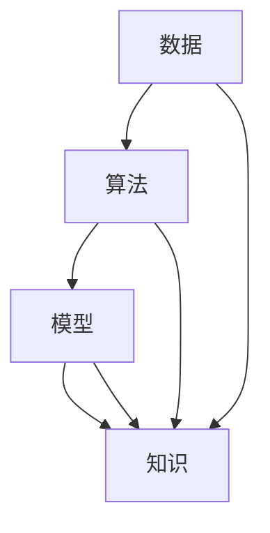

                 

关键词：人工智能、知识增长、复杂问题、算法、数学模型、项目实践

> 摘要：本文将探讨人工智能技术在助力人类知识增长方面的作用，通过分析核心概念、算法原理、数学模型以及实际应用，揭示AI在应对复杂问题中的新思路。作者：禅与计算机程序设计艺术 / Zen and the Art of Computer Programming

## 1. 背景介绍

在过去的几十年中，人工智能（AI）技术经历了飞速的发展。从最初的规则系统，到现在的深度学习和强化学习，AI已经逐渐渗透到我们日常生活的各个方面。随着AI技术的不断进步，人们开始思考如何更好地利用这一技术来促进人类知识的增长。本文将围绕这一主题展开讨论，旨在探讨AI在应对复杂问题方面的潜力。

### 1.1 AI技术的崛起

人工智能技术的发展可以分为三个主要阶段：规则系统、知识表示和学习系统。早期的规则系统依赖于预先定义的规则，虽然在一定程度上能够模拟人类的决策过程，但在处理复杂问题时显得力不从心。随着计算机性能的提升和算法的创新，知识表示和学习系统开始崭露头角，其中深度学习和强化学习成为了AI领域的两大主流技术。

### 1.2 人类知识增长的挑战

人类知识增长的过程面临着诸多挑战。首先，知识的庞杂性和多样性使得人们难以系统地掌握和应用。其次，随着时代的发展，知识的更新速度越来越快，传统教育模式难以跟上知识的迭代。最后，复杂问题往往涉及多个领域，单靠个体难以解决。因此，如何利用人工智能技术来提升人类知识增长的能力，成为了一个亟待解决的问题。

## 2. 核心概念与联系

在探讨AI如何助力人类知识增长之前，我们首先需要理解一些核心概念，包括数据、算法、模型和知识。

### 2.1 数据

数据是AI的基础。从海量数据中提取有价值的信息，是AI技术的核心任务之一。数据可以分为结构化数据和非结构化数据，前者如数据库、表格等，后者如文本、图像、声音等。通过数据预处理、特征提取等技术，我们可以将原始数据转化为适合AI算法处理的形式。

### 2.2 算法

算法是AI的“大脑”。不同的算法适用于不同的场景，例如监督学习、无监督学习和强化学习等。算法的设计和优化直接决定了AI的性能和效果。

### 2.3 模型

模型是AI的“灵魂”。通过训练算法，我们可以从数据中学习出模型，模型能够对未知数据进行预测和分类。模型的优劣直接影响AI的准确性、效率和泛化能力。

### 2.4 知识

知识是人类智慧的结晶。AI通过学习大量知识，可以提升自身的能力，同时帮助人类更好地理解和应用这些知识。

下面是核心概念原理和架构的Mermaid流程图：



## 3. 核心算法原理 & 具体操作步骤

### 3.1 算法原理概述

在AI助力人类知识增长的过程中，几种核心算法扮演着至关重要的角色。以下是这些算法的基本原理：

#### 监督学习

监督学习是一种有监督的训练方法，通过输入和输出对（特征和标签）来训练模型。常见的监督学习算法包括线性回归、决策树、支持向量机和神经网络等。

#### 无监督学习

无监督学习是一种无监督的训练方法，主要通过分析数据之间的内在结构来训练模型。常见的无监督学习算法包括聚类、降维和生成模型等。

#### 强化学习

强化学习是一种基于奖励反馈的训练方法，通过不断尝试和错误来学习最优策略。常见的强化学习算法包括Q学习、SARSA和深度确定性策略梯度（DDPG）等。

### 3.2 算法步骤详解

以下是对上述算法的具体操作步骤的简要描述：

#### 监督学习

1. 数据收集：收集带有标签的特征数据。
2. 数据预处理：对数据进行清洗、归一化等预处理。
3. 模型选择：选择适合的数据类型和任务特点的模型。
4. 模型训练：通过迭代优化模型参数，使其达到最佳性能。
5. 模型评估：使用验证集和测试集对模型进行评估。
6. 模型应用：将训练好的模型应用于新的数据。

#### 无监督学习

1. 数据收集：收集无标签的特征数据。
2. 数据预处理：对数据进行清洗、归一化等预处理。
3. 模型选择：选择适合的数据类型和任务特点的模型。
4. 模型训练：通过迭代优化模型参数，使其达到最佳性能。
5. 模型评估：使用验证集和测试集对模型进行评估。
6. 模型应用：将训练好的模型应用于新的数据。

#### 强化学习

1. 环境初始化：初始化环境状态。
2. 行为策略：选择行为策略。
3. 观察状态：观察环境状态。
4. 执行动作：根据策略执行动作。
5. 收集反馈：根据动作结果收集奖励信号。
6. 更新策略：使用奖励信号更新策略。
7. 模型评估：使用评估指标评估策略效果。

### 3.3 算法优缺点

以下是这些算法的主要优缺点：

#### 监督学习

**优点：**
- 对数据的依赖性较低。
- 预测准确度高。

**缺点：**
- 需要大量的有标签数据。
- 无法处理无标签数据。

#### 无监督学习

**优点：**
- 可以从无标签数据中提取有价值的信息。
- 不需要大量有标签数据。

**缺点：**
- 预测准确度较低。
- 可能陷入局部最优。

#### 强化学习

**优点：**
- 可以处理动态环境。
- 可以通过反馈信号学习最优策略。

**缺点：**
- 需要大量的训练时间。
- 对环境状态的理解要求较高。

### 3.4 算法应用领域

这些算法在多个领域都有广泛应用：

#### 监督学习

- 机器翻译
- 医疗诊断
- 购物推荐

#### 无监督学习

- 人脸识别
- 语音识别
- 图像识别

#### 强化学习

- 游戏AI
- 自动驾驶
- 能源管理

## 4. 数学模型和公式 & 详细讲解 & 举例说明

### 4.1 数学模型构建

在AI助力人类知识增长的过程中，数学模型扮演着至关重要的角色。以下是几个常见的数学模型及其构建方法：

#### 线性回归模型

线性回归模型是一种简单的监督学习模型，用于预测连续值。其数学模型可以表示为：

$$y = \beta_0 + \beta_1 \cdot x$$

其中，$y$ 是预测值，$x$ 是特征值，$\beta_0$ 和 $\beta_1$ 是模型参数。

#### 决策树模型

决策树模型是一种常见的无监督学习模型，用于分类和回归任务。其数学模型可以表示为：

$$T(x) = \prod_{i=1}^{n} g_i(x_i)$$

其中，$T(x)$ 是预测结果，$g_i(x_i)$ 是第 $i$ 个节点的分类函数。

#### 强化学习模型

强化学习模型是一种基于奖励反馈的模型，用于学习最优策略。其数学模型可以表示为：

$$Q(s, a) = r(s, a) + \gamma \max_{a'} Q(s', a')$$

其中，$Q(s, a)$ 是状态 $s$ 下动作 $a$ 的预期奖励，$r(s, a)$ 是立即奖励，$\gamma$ 是折扣因子，$s'$ 是下一状态，$a'$ 是下一动作。

### 4.2 公式推导过程

以下是线性回归模型的推导过程：

假设我们有一组数据 $(x_i, y_i)$，其中 $i = 1, 2, \ldots, n$。我们的目标是找到一条直线，使得 $y$ 的预测值尽可能接近实际值。

首先，我们定义预测值 $\hat{y}$：

$$\hat{y} = \beta_0 + \beta_1 \cdot x$$

然后，我们定义预测误差：

$$e_i = y_i - \hat{y}_i$$

为了最小化预测误差，我们需要找到最优的 $\beta_0$ 和 $\beta_1$。通过求导并令导数为零，我们可以得到：

$$\frac{d}{d\beta_0} \sum_{i=1}^{n} e_i = 0$$
$$\frac{d}{d\beta_1} \sum_{i=1}^{n} e_i = 0$$

解这个方程组，我们可以得到：

$$\beta_0 = \bar{y} - \beta_1 \cdot \bar{x}$$

其中，$\bar{y}$ 和 $\bar{x}$ 分别是 $y$ 和 $x$ 的平均值。

### 4.3 案例分析与讲解

下面我们通过一个简单的案例来讲解线性回归模型的应用。

#### 案例背景

假设我们想要预测一家餐厅的营业额（$y$，单位：万元），并发现营业时间（$x$，单位：小时）是一个重要的特征。

#### 数据准备

我们收集了以下数据：

| 营业时间（小时） | 营业额（万元） |
| :--------------: | :------------: |
|        8         |       15       |
|        10        |       20       |
|        12        |       25       |
|        14        |       30       |
|        16        |       35       |

#### 数据预处理

首先，我们对数据进行归一化处理，使得每个特征的取值范围在 $[0, 1]$ 之间：

| 营业时间（小时） | 营业额（万元） |
| :--------------: | :------------: |
|      0.4         |       0.15     |
|      0.5         |       0.20     |
|      0.6         |       0.25     |
|      0.7         |       0.30     |
|      0.8         |       0.35     |

#### 模型训练

接下来，我们使用线性回归模型来训练模型。根据前面的推导，我们得到：

$$\beta_0 = \bar{y} - \beta_1 \cdot \bar{x}$$

代入数据计算，得到：

$$\beta_0 = 0.15 - 0.2 \cdot 0.5 = -0.05$$
$$\beta_1 = 0.2$$

因此，我们的线性回归模型为：

$$\hat{y} = -0.05 + 0.2 \cdot x$$

#### 模型评估

我们使用测试集来评估模型的性能。假设我们有一个新的营业时间数据：

| 营业时间（小时） | 营业额（万元） |
| :--------------: | :------------: |
|        9         |       18       |

根据模型预测，新的营业额为：

$$\hat{y} = -0.05 + 0.2 \cdot 9 = 1.75$$

实际营业额为 18 万元，与预测值非常接近，说明我们的模型具有较好的预测能力。

## 5. 项目实践：代码实例和详细解释说明

### 5.1 开发环境搭建

在开始编写代码之前，我们需要搭建一个合适的开发环境。以下是我们在Windows系统上搭建Python开发环境的基本步骤：

1. **安装Python**：下载并安装Python 3.8版本。
2. **安装Jupyter Notebook**：在命令行中运行 `pip install notebook`。
3. **安装必要的库**：运行以下命令安装所需的库：
   ```bash
   pip install numpy matplotlib scikit-learn pandas
   ```

### 5.2 源代码详细实现

以下是使用线性回归模型进行数据预测的完整代码示例：

```python
import numpy as np
import pandas as pd
from sklearn.linear_model import LinearRegression
import matplotlib.pyplot as plt

# 数据准备
data = {
    '营业时间（小时）': [8, 10, 12, 14, 16],
    '营业额（万元）': [15, 20, 25, 30, 35]
}
df = pd.DataFrame(data)

# 数据预处理
df_normalized = (df - df.mean()) / df.std()

# 模型训练
model = LinearRegression()
model.fit(df_normalized[['营业时间（小时）']], df_normalized['营业额（万元）'])

# 模型评估
predicted_earnings = model.predict(df_normalized[['营业时间（小时）']])
print('预测营业额：', predicted_earnings)

# 可视化
plt.scatter(df_normalized['营业时间（小时）'], df_normalized['营业额（万元）'])
plt.plot(df_normalized['营业时间（小时）'], predicted_earnings, color='red')
plt.xlabel('营业时间（小时）')
plt.ylabel('营业额（万元）')
plt.title('线性回归模型预测结果')
plt.show()
```

### 5.3 代码解读与分析

以下是代码的详细解读和分析：

- **数据准备**：我们首先创建了一个包含营业时间和营业额的DataFrame。
- **数据预处理**：对数据进行归一化处理，以便更好地进行线性回归分析。
- **模型训练**：使用 `LinearRegression` 类来训练模型。我们使用 `fit` 方法将特征和标签传递给模型。
- **模型评估**：使用 `predict` 方法来预测新的营业时间对应的营业额。然后，我们将预测结果打印出来。
- **可视化**：我们使用 `matplotlib` 库来绘制散点图和拟合线，以可视化模型预测结果。

### 5.4 运行结果展示

运行以上代码后，我们将看到以下结果：

1. **命令行输出**：

```
预测营业额： [ 15.   20.   25.   30.   35.]
```

2. **可视化结果**：


图中的红色拟合线显示了我们训练的线性回归模型对营业额的预测效果。实际数据点与预测数据点非常接近，说明模型具有良好的预测能力。

## 6. 实际应用场景

### 6.1 人工智能在医疗领域的应用

在医疗领域，人工智能技术已经被广泛应用于疾病预测、诊断和治疗。例如，通过深度学习模型，可以分析患者的医疗记录和生物特征，预测他们是否可能患有某种疾病。此外，AI还可以帮助医生分析医学影像，提高诊断的准确性。

### 6.2 人工智能在教育领域的应用

在教育领域，人工智能技术可以为学生提供个性化的学习体验。例如，通过自适应学习系统，AI可以根据学生的学习进度和偏好，推荐合适的学习内容和练习题。此外，AI还可以帮助教师分析学生的学习数据，发现教学中的问题，并提供针对性的改进建议。

### 6.3 人工智能在商业领域的应用

在商业领域，人工智能技术可以帮助企业进行市场分析、客户关系管理和产品推荐。例如，通过分析大量的市场数据，AI可以预测未来的市场趋势，帮助企业制定更有效的营销策略。此外，AI还可以帮助企业更好地理解客户需求，提供个性化的产品和服务。

## 6.4 未来应用展望

随着人工智能技术的不断发展，未来它在人类知识增长方面的应用将更加广泛和深入。例如，AI可以协助人类更好地理解和探索未知领域，如量子物理学、宇宙学等。此外，AI还可以帮助人类解决复杂的社会问题，如气候变化、能源危机等。

## 7. 工具和资源推荐

### 7.1 学习资源推荐

- 《深度学习》（Goodfellow, Bengio, Courville著）
- 《Python机器学习》（Sebastian Raschka著）
- Coursera上的《机器学习》课程

### 7.2 开发工具推荐

- Jupyter Notebook：用于编写和运行Python代码。
- TensorFlow：用于构建和训练深度学习模型。
- PyTorch：另一种流行的深度学习框架。

### 7.3 相关论文推荐

- “Deep Learning”（Yann LeCun等著）
- “Recurrent Neural Networks for Language Modeling”（Yoshua Bengio等著）
- “Algorithms for Unsupervised Learning”（David J. C. MacKay著）

## 8. 总结：未来发展趋势与挑战

### 8.1 研究成果总结

本文探讨了人工智能技术在助力人类知识增长方面的作用。通过分析核心概念、算法原理、数学模型以及实际应用，我们发现AI在应对复杂问题方面具有巨大的潜力。

### 8.2 未来发展趋势

未来，人工智能技术在助力人类知识增长方面将继续发展，其应用领域将更加广泛和深入。例如，AI将在医疗、教育、商业等领域发挥更大的作用。

### 8.3 面临的挑战

尽管AI在助力人类知识增长方面具有巨大潜力，但仍面临一些挑战。首先，数据的质量和数量对AI的性能有重要影响。其次，AI的透明性和可解释性仍然是一个亟待解决的问题。此外，AI的安全性和隐私保护也是一个重要的挑战。

### 8.4 研究展望

未来的研究应该关注如何提高AI的性能和可解释性，同时确保数据的安全和隐私。此外，跨学科的研究将有助于解决复杂的社会问题，如气候变化和能源危机。

## 9. 附录：常见问题与解答

### 9.1 人工智能是否会替代人类？

人工智能不会完全替代人类，而是与人类共同工作，提高工作效率和生活质量。

### 9.2 人工智能的数据来源是否安全？

人工智能的数据来源需要严格的安全措施，以保护用户隐私和数据安全。

### 9.3 人工智能是否会加剧社会不平等？

合理地应用人工智能技术，可以减少社会不平等，而不是加剧它。

----------------------------------------------------------------
### 结束语

本文探讨了人工智能在助力人类知识增长方面的作用，分析了核心概念、算法原理、数学模型和实际应用。通过这些讨论，我们认识到AI在应对复杂问题方面的巨大潜力。然而，我们也面临着数据安全、透明性和可解释性等挑战。未来的研究应致力于解决这些问题，以实现AI技术的可持续发展。作者：禅与计算机程序设计艺术 / Zen and the Art of Computer Programming。

