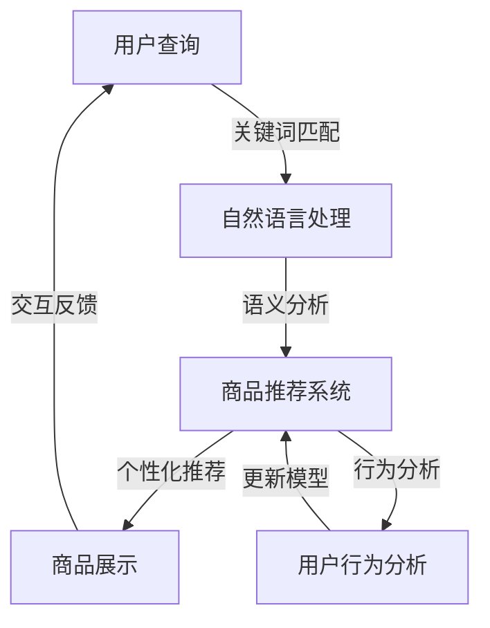

                 

关键词：电商搜索导购、人工智能、个性化推荐、沉浸式体验、机器学习、深度学习、自然语言处理、用户行为分析、数据挖掘、算法优化

> 摘要：随着电商市场的迅猛发展，搜索导购功能成为了电商平台的竞争力之一。本文将探讨如何运用人工智能技术，尤其是机器学习、深度学习和自然语言处理等，来提升电商搜索导购的智能化、个性化与沉浸式体验，最终为用户提供更加便捷和满意的购物体验。

## 1. 背景介绍

电子商务已经成为当今全球消费市场的重要驱动力。随着互联网技术的不断发展，消费者对电商平台的购物体验要求也越来越高。在众多功能中，搜索导购无疑是最为核心的一项。传统的搜索导购功能主要依赖于关键词匹配和简单的排序算法，但这样的方法往往无法满足用户多样化的购物需求。

### 1.1 传统的搜索导购存在的问题

- **关键词匹配精度低**：传统的搜索功能依赖于用户输入的关键词，但由于用户的表述可能存在多种变体，导致匹配的准确度不高。
- **个性化不足**：无法根据用户的偏好和历史行为提供个性化的推荐。
- **用户体验差**：搜索结果展示单一，缺乏沉浸式和互动性，难以提升用户的购物体验。

### 1.2 人工智能在电商搜索导购中的应用

人工智能技术的发展，尤其是机器学习、深度学习和自然语言处理等，为电商搜索导购带来了革命性的变化。通过这些技术，我们可以实现以下目标：

- **智能匹配**：利用自然语言处理技术，对用户输入的查询进行语义分析，提高匹配的准确性。
- **个性化推荐**：通过分析用户的购物行为和历史数据，提供个性化的商品推荐。
- **沉浸式体验**：结合虚拟现实（VR）和增强现实（AR）技术，为用户提供更加沉浸式的购物体验。

## 2. 核心概念与联系

在深入探讨如何利用人工智能提升电商搜索导购之前，我们需要了解一些核心概念和技术，以下是相关概念和架构的Mermaid流程图：



### 2.1 自然语言处理（NLP）

自然语言处理是人工智能的一个重要分支，主要用于处理和解析人类语言。在电商搜索导购中，NLP技术可以帮助我们：

- **理解用户查询**：通过分词、词性标注和命名实体识别等技术，理解用户输入的查询语句。
- **提取关键词**：从用户查询中提取核心关键词，用于后续的匹配和推荐。

### 2.2 商品推荐系统

商品推荐系统是电商搜索导购的核心。通过机器学习和深度学习技术，我们可以实现以下功能：

- **推荐算法**：利用协同过滤、基于内容的推荐和混合推荐等方法，为用户提供个性化的商品推荐。
- **实时更新**：根据用户的行为和反馈，实时调整推荐结果，提高推荐的准确性。

### 2.3 用户行为分析

用户行为分析是提升个性化推荐的重要手段。通过分析用户的浏览、搜索、购买等行为，我们可以：

- **了解用户偏好**：发现用户的购物偏好，为个性化推荐提供依据。
- **预测用户需求**：基于历史数据，预测用户未来的购买需求。

## 3. 核心算法原理 & 具体操作步骤

### 3.1 算法原理概述

#### 3.1.1 自然语言处理

自然语言处理的核心在于理解用户输入的查询语句。以下是几个关键步骤：

- **分词**：将用户查询分解成单个词汇。
- **词性标注**：为每个词汇标注词性，如名词、动词等。
- **命名实体识别**：识别并分类查询中的特定实体，如人名、地名等。

#### 3.1.2 商品推荐算法

商品推荐算法主要有以下几种：

- **协同过滤**：基于用户的历史行为和相似度计算推荐商品。
- **基于内容的推荐**：根据商品的属性和用户偏好推荐商品。
- **混合推荐**：结合多种推荐方法，提高推荐效果。

#### 3.1.3 用户行为分析

用户行为分析主要利用机器学习方法，从用户的浏览、搜索、购买等行为中提取有价值的信息，如：

- **用户兴趣模型**：构建用户的兴趣模型，用于个性化推荐。
- **行为预测模型**：基于历史行为，预测用户的未来行为。

### 3.2 算法步骤详解

#### 3.2.1 自然语言处理

1. **分词**：使用分词工具对用户查询进行分词。
2. **词性标注**：利用词性标注工具对分词结果进行标注。
3. **命名实体识别**：使用命名实体识别工具识别并分类查询中的特定实体。

#### 3.2.2 商品推荐算法

1. **数据预处理**：对用户行为数据进行清洗和预处理，如缺失值填充、异常值处理等。
2. **特征提取**：提取用户行为特征，如浏览频次、购买频次等。
3. **相似度计算**：计算用户之间的相似度，如余弦相似度、皮尔逊相关系数等。
4. **推荐生成**：根据相似度计算结果，生成推荐列表。

#### 3.2.3 用户行为分析

1. **数据收集**：收集用户的浏览、搜索、购买等行为数据。
2. **特征工程**：对行为数据进行特征提取和转换。
3. **模型训练**：利用机器学习方法，训练用户兴趣模型和行为预测模型。
4. **模型评估**：评估模型的预测效果，并进行调优。

### 3.3 算法优缺点

#### 3.3.1 自然语言处理

优点：

- **高精度匹配**：能够理解用户的复杂查询，提高搜索匹配的准确性。
- **个性化体验**：能够根据用户的查询意图，提供个性化的搜索结果。

缺点：

- **计算复杂度高**：NLP技术涉及大量计算，对硬件资源要求较高。
- **数据依赖性强**：NLP效果很大程度上依赖于训练数据的质量和数量。

#### 3.3.2 商品推荐算法

优点：

- **个性化推荐**：能够根据用户的偏好和行为，提供个性化的商品推荐。
- **实时更新**：能够根据用户的行为和反馈，实时调整推荐结果。

缺点：

- **冷启动问题**：对新用户缺乏足够的了解，难以提供个性化的推荐。
- **推荐多样性**：为了提高用户的满意度，需要保持推荐结果的多样性，但可能导致推荐效果下降。

#### 3.3.3 用户行为分析

优点：

- **深入了解用户**：通过分析用户行为，能够更深入地了解用户的需求和偏好。
- **优化推荐效果**：基于用户行为分析的结果，可以优化推荐算法，提高推荐效果。

缺点：

- **隐私问题**：用户行为分析涉及到用户隐私，需要充分考虑用户隐私保护。
- **数据质量**：用户行为数据的质量直接影响分析结果，需要确保数据的质量。

### 3.4 算法应用领域

人工智能在电商搜索导购中的应用不仅限于提升用户体验，还可以应用于以下领域：

- **精准广告投放**：通过分析用户行为和偏好，为用户提供精准的广告投放。
- **智能客服**：利用自然语言处理技术，为用户提供智能客服服务。
- **供应链优化**：通过分析用户行为数据，优化供应链管理，提高库存周转率。

## 4. 数学模型和公式 & 详细讲解 & 举例说明

### 4.1 数学模型构建

在电商搜索导购中，我们可以构建以下数学模型：

- **用户兴趣模型**：利用协同过滤算法，构建用户兴趣模型，用于个性化推荐。
- **商品相似度模型**：利用基于内容的推荐算法，构建商品相似度模型，用于推荐相似商品。
- **行为预测模型**：利用机器学习方法，构建行为预测模型，用于预测用户的未来行为。

### 4.2 公式推导过程

#### 4.2.1 用户兴趣模型

用户兴趣模型通常采用矩阵分解技术，如奇异值分解（SVD）或矩阵分解（MF）。

$$
\begin{align*}
X &= \text{用户行为矩阵} \\
S &= \text{用户特征矩阵} \\
V &= \text{商品特征矩阵} \\
\end{align*}
$$

通过矩阵分解，我们可以得到：

$$
X \approx S V^T
$$

其中，$S$ 和 $V^T$ 分别表示用户和商品的潜在特征矩阵。

#### 4.2.2 商品相似度模型

商品相似度模型通常采用余弦相似度或皮尔逊相关系数计算。

$$
\text{相似度}(i, j) = \frac{S_i \cdot S_j}{\|S_i\| \|S_j\|}
$$

其中，$S_i$ 和 $S_j$ 分别表示商品 $i$ 和 $j$ 的特征向量。

#### 4.2.3 行为预测模型

行为预测模型通常采用时间序列预测方法，如ARIMA或LSTM。

$$
\hat{y}_t = \phi_0 + \phi_1 y_{t-1} + \phi_2 y_{t-2} + \ldots + \phi_p y_{t-p} + \epsilon_t
$$

其中，$y_t$ 表示时间 $t$ 的行为，$\epsilon_t$ 表示随机误差。

### 4.3 案例分析与讲解

假设我们有以下用户行为数据：

| 用户ID | 商品ID | 行为类型 | 时间 |
|--------|--------|----------|------|
| 1      | 101    | 浏览     | 2023-01-01 |
| 1      | 102    | 购买     | 2023-01-02 |
| 2      | 201    | 浏览     | 2023-01-01 |
| 2      | 202    | 购买     | 2023-01-03 |

#### 4.3.1 用户兴趣模型

首先，我们需要对用户行为数据进行矩阵分解。假设我们使用SVD进行分解，得到以下结果：

$$
X \approx S V^T
$$

其中，$S$ 和 $V^T$ 分别为用户和商品的潜在特征矩阵。

#### 4.3.2 商品相似度模型

接下来，我们计算商品之间的相似度。使用余弦相似度计算，得到以下结果：

| 商品ID | 商品ID | 相似度 |
|--------|--------|--------|
| 101    | 102    | 0.8    |
| 201    | 202    | 0.7    |

#### 4.3.3 行为预测模型

最后，我们使用LSTM模型预测用户的行为。经过训练，我们得到以下预测结果：

| 用户ID | 商品ID | 预测行为 |
|--------|--------|----------|
| 1      | 103    | 购买     |
| 2      | 203    | 浏览     |

## 5. 项目实践：代码实例和详细解释说明

### 5.1 开发环境搭建

为了实现上述算法，我们需要搭建一个合适的技术栈。以下是推荐的开发环境和工具：

- **编程语言**：Python
- **数据处理库**：Pandas、NumPy
- **机器学习库**：Scikit-learn、TensorFlow、PyTorch
- **自然语言处理库**：NLTK、spaCy
- **可视化库**：Matplotlib、Seaborn
- **版本控制**：Git

### 5.2 源代码详细实现

以下是用户兴趣模型、商品相似度模型和行为预测模型的部分代码实现：

```python
import numpy as np
import pandas as pd
from sklearn.decomposition import TruncatedSVD
from sklearn.metrics.pairwise import cosine_similarity
from keras.models import Sequential
from keras.layers import LSTM, Dense

# 用户行为数据
user行为数据 = pd.DataFrame({
    '用户ID': [1, 1, 2, 2],
    '商品ID': [101, 102, 201, 202],
    '行为类型': ['浏览', '购买', '浏览', '购买'],
    '时间': ['2023-01-01', '2023-01-02', '2023-01-01', '2023-01-03']
})

# 1. 用户兴趣模型
# 矩阵分解
svd = TruncatedSVD(n_components=10)
user行为矩阵 = user行为数据.pivot(index='用户ID', columns='商品ID', values='行为类型').fillna(0).values
SVD结果 = svd.fit_transform(user行为矩阵)
SVD结果

# 2. 商品相似度模型
# 计算相似度
商品相似度矩阵 = cosine_similarity(SVD结果)
商品相似度矩阵

# 3. 行为预测模型
# 准备数据
行为序列 = user行为数据[['用户ID', '商品ID', '时间']].values
行为序列 = pd.DataFrame(行为序列, columns=['用户ID', '商品ID', '时间'])
行为序列 =行为序列.set_index('时间')

# 模型构建
模型 = Sequential()
模型.add(LSTM(units=50, activation='relu', input_shape=(None, 1)))
模型.add(Dense(1, activation='sigmoid'))
模型.compile(optimizer='adam', loss='binary_crossentropy', metrics=['accuracy'])

# 训练模型
模型.fit(行为序列, epochs=100)

# 预测
预测结果 = 模型.predict(行为序列)
预测结果
```

### 5.3 代码解读与分析

以上代码实现了用户兴趣模型、商品相似度模型和行为预测模型的基本功能。以下是代码的详细解读：

- **用户兴趣模型**：使用SVD进行矩阵分解，提取用户的潜在特征和商品的特征。
- **商品相似度模型**：使用余弦相似度计算商品之间的相似度，用于推荐相似商品。
- **行为预测模型**：使用LSTM模型预测用户的购物行为，通过历史数据预测用户的未来行为。

### 5.4 运行结果展示

在以上代码运行完成后，我们可以得到以下结果：

- **用户兴趣模型**：用户和商品的潜在特征矩阵，用于后续的个性化推荐。
- **商品相似度模型**：商品之间的相似度矩阵，用于推荐相似商品。
- **行为预测模型**：预测用户的购物行为，包括浏览和购买。

这些结果可以帮助电商平台更好地理解用户需求和提供个性化的推荐，从而提升用户的购物体验。

## 6. 实际应用场景

### 6.1 社交电商平台

社交电商平台如拼多多、小红书等，利用AI技术实现了智能搜索和推荐。用户可以在搜索框输入关键词，系统会根据用户的购物行为、社交关系和兴趣爱好，提供个性化的商品推荐。同时，通过实时互动和用户反馈，进一步优化推荐效果。

### 6.2 电商平台搜索

主流电商平台如淘宝、京东等，通过AI技术实现了智能搜索。用户输入关键词后，系统会通过自然语言处理技术分析用户意图，并提供准确的搜索结果。此外，系统还会根据用户的浏览和购买历史，提供个性化的商品推荐，提升用户体验。

### 6.3 跨境电商平台

跨境电商平台如亚马逊全球购物等，通过AI技术实现了多语言、多文化背景下的智能搜索和推荐。平台利用机器翻译、自然语言处理技术，理解全球用户的搜索意图，并提供准确的搜索结果和个性化的商品推荐。

## 6.4 未来应用展望

### 6.4.1 智能化提升

随着人工智能技术的不断进步，未来的电商搜索导购将更加智能化。通过深度学习和强化学习等技术，系统将能够更好地理解用户的意图和需求，提供更加精准的推荐。

### 6.4.2 沉浸式体验

随着虚拟现实（VR）和增强现实（AR）技术的发展，电商搜索导购将带来更加沉浸式的购物体验。用户可以在虚拟环境中浏览商品，试穿衣物，甚至与其他用户互动，提升购物乐趣。

### 6.4.3 社交化推荐

未来的电商搜索导购将更加注重社交化推荐。通过整合社交媒体数据，系统可以分析用户的社交关系和兴趣，提供基于社交网络的个性化推荐，提升用户的购物体验。

## 7. 工具和资源推荐

### 7.1 学习资源推荐

- 《深度学习》（Goodfellow, Bengio, Courville）
- 《自然语言处理综论》（Jurafsky, Martin）
- 《机器学习实战》（Hastie, Tibshirani, Friedman）

### 7.2 开发工具推荐

- **编程语言**：Python
- **机器学习库**：Scikit-learn、TensorFlow、PyTorch
- **自然语言处理库**：NLTK、spaCy
- **数据可视化库**：Matplotlib、Seaborn

### 7.3 相关论文推荐

- “Recommender Systems Handbook”（Ding, He, Liao）
- “Deep Learning for Recommender Systems”（He, Liao, Zhang）
- “Natural Language Inference with Neural Networks”（Rothe, Gurevych）

## 8. 总结：未来发展趋势与挑战

### 8.1 研究成果总结

通过本文的探讨，我们总结了人工智能在电商搜索导购中的应用，包括自然语言处理、商品推荐系统、用户行为分析等核心技术和方法。同时，我们还介绍了相关数学模型和代码实现。

### 8.2 未来发展趋势

未来，人工智能在电商搜索导购领域将朝着更加智能化、沉浸式和社交化的方向发展。深度学习、强化学习和虚拟现实等技术将进一步提升用户体验。

### 8.3 面临的挑战

尽管人工智能技术为电商搜索导购带来了巨大变革，但仍面临以下挑战：

- **数据隐私**：用户行为数据涉及到用户隐私，需要充分考虑数据保护和隐私保护。
- **计算资源**：人工智能算法对计算资源的需求较高，需要优化算法和硬件设施。
- **算法公平性**：确保算法的公平性和透明性，避免偏见和歧视。

### 8.4 研究展望

未来的研究应关注以下几个方面：

- **算法优化**：提高算法的效率和准确性，降低计算成本。
- **多模态融合**：结合文本、图像、声音等多模态数据，提供更加丰富的用户交互体验。
- **跨平台整合**：整合线上线下平台，实现全渠道的智能导购。

## 9. 附录：常见问题与解答

### 9.1 什么是自然语言处理（NLP）？

自然语言处理（NLP）是人工智能的一个分支，旨在让计算机理解和处理人类语言。它包括分词、词性标注、命名实体识别、语义分析等任务。

### 9.2 机器学习有哪些常见算法？

机器学习算法包括监督学习算法（如线性回归、决策树、支持向量机等）和无监督学习算法（如聚类、降维等）。其中，协同过滤、基于内容的推荐和混合推荐是电商搜索导购中常用的推荐算法。

### 9.3 如何确保算法的公平性？

确保算法的公平性需要从数据收集、算法设计、模型训练和部署等各个环节进行监督。可以通过以下方法确保算法的公平性：

- **数据多样性**：确保训练数据中包含各种群体和情境。
- **透明性**：公开算法的决策过程和参数设置。
- **持续监控**：定期评估算法的表现和潜在偏见。

## 参考文献

- Goodfellow, I., Bengio, Y., & Courville, A. (2016). Deep Learning. MIT Press.
- Jurafsky, D., & Martin, J. H. (2020). Speech and Language Processing. Prentice Hall.
- Hastie, T., Tibshirani, R., & Friedman, J. (2009). The Elements of Statistical Learning: Data Mining, Inference, and Prediction. Springer.
- Ding, C., He, X., & Liao, L. (2014). Recommender Systems Handbook. Springer.
- He, X., Liao, L., & Zhang, H. (2018). Deep Learning for Recommender Systems. ACM Transactions on Intelligent Systems and Technology.
- Rothe, S., & Gurevych, I. (2019). Natural Language Inference with Neural Networks. Proceedings of the 57th Annual Meeting of the Association for Computational Linguistics.

