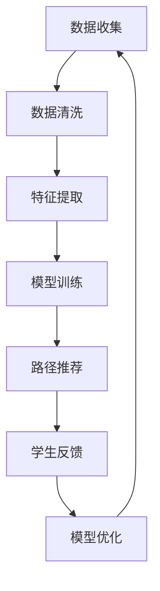

                 

关键词：人工智能、个性化学习、学习路径、机器学习、算法、模型、数据驱动、教育技术、学习分析、学生数据、自适应学习。

> 摘要：本文探讨了人工智能（AI）在个性化学习路径设计中的应用。通过分析机器学习算法在教育数据上的应用，本文提出了一套基于数据驱动的个性化学习路径设计方法。文章详细介绍了算法原理、数学模型、具体实施步骤，并结合实际项目实例展示了个性化学习路径的设计过程和运行结果。文章旨在为教育技术的开发者和研究者提供有价值的参考。

## 1. 背景介绍

### 1.1 教育领域的挑战

在传统的教育模式中，学习路径通常是标准化的，缺乏对学生个体差异的充分考虑。然而，每个学生的学习能力和兴趣都不同，这种一刀切的方法往往难以满足所有学生的需求。以下是一些教育领域面临的挑战：

- **差异化教学需求**：不同学生在学习同一门课程时的进度和理解程度各不相同。
- **个性化反馈**：学生需要个性化的反馈和指导，以便更好地掌握学习内容。
- **资源分配不均**：一些学生可能需要额外的学习资源，而另一些学生可能已经掌握了相关内容。

### 1.2 人工智能与个性化学习

人工智能在个性化学习中的应用主要集中在以下几个方面：

- **学习分析**：通过分析学生的学习行为数据，了解学生的学习偏好、学习速度和薄弱环节。
- **智能推荐**：基于学习分析结果，为学生推荐合适的学习资源和路径。
- **自适应学习系统**：系统能够根据学生的实时表现调整教学内容和难度，实现个性化教学。
- **智能评估**：通过算法分析评估学生的学习效果，提供有针对性的改进建议。

## 2. 核心概念与联系

### 2.1 机器学习算法

在个性化学习路径设计中，常用的机器学习算法包括：

- **协同过滤（Collaborative Filtering）**：基于用户历史行为和偏好推荐学习资源。
- **决策树（Decision Trees）**：用于分类和回归分析，帮助学生找到最佳的学习路径。
- **神经网络（Neural Networks）**：模拟人脑神经网络，用于复杂的学习路径预测和优化。
- **聚类算法（Clustering Algorithms）**：如K-means，用于将学生分为不同的学习群体，从而进行针对性教学。

### 2.2 教育数据

教育数据是构建个性化学习路径的基础。教育数据包括：

- **学习行为数据**：学生完成作业、测试、参与讨论等的记录。
- **学生特征数据**：包括学生的年龄、性别、学科背景、学习习惯等。
- **学习资源数据**：包括教材、课程、练习题等。

### 2.3 Mermaid 流程图

以下是一个简化的Mermaid流程图，展示了个性化学习路径设计的基本步骤：



## 3. 核心算法原理 & 具体操作步骤

### 3.1 算法原理概述

个性化学习路径设计的核心算法通常基于机器学习和数据挖掘技术。以下是一些常用的算法原理：

- **协同过滤**：通过分析学生之间的相似性，推荐相似学生喜欢的学习资源。
- **决策树**：根据学生的特征数据，构建决策树模型，预测最佳学习路径。
- **神经网络**：通过多层神经网络，模拟人脑学习过程，实现复杂的路径预测和优化。
- **聚类算法**：将学生分为不同群体，针对不同群体制定个性化学习路径。

### 3.2 算法步骤详解

#### 3.2.1 数据收集与清洗

- **数据收集**：收集学生的学习行为数据、学生特征数据和学习资源数据。
- **数据清洗**：处理缺失值、异常值和重复数据，保证数据质量。

#### 3.2.2 特征提取

- **行为特征**：分析学生完成作业、测试、参与讨论等的行为数据。
- **学生特征**：提取学生的年龄、性别、学科背景、学习习惯等特征。

#### 3.2.3 模型训练

- **协同过滤**：构建基于用户-物品评分矩阵的协同过滤模型。
- **决策树**：根据学生特征数据，构建决策树模型。
- **神经网络**：设计多层神经网络结构，进行模型训练。
- **聚类算法**：使用K-means等算法，将学生分为不同群体。

#### 3.2.4 路径推荐

- **协同过滤**：根据学生历史行为和偏好，推荐相似的学习资源。
- **决策树**：根据学生的特征数据，预测最佳学习路径。
- **神经网络**：通过模型输出，得到个性化的学习路径。
- **聚类算法**：根据学生群体，制定针对性学习路径。

#### 3.2.5 学生反馈与模型优化

- **收集反馈**：通过问卷、讨论等方式，收集学生对学习路径的反馈。
- **模型优化**：根据反馈结果，调整模型参数，优化学习路径。

### 3.3 算法优缺点

#### 优点：

- **个性化**：根据学生个体差异，提供个性化的学习路径。
- **自适应**：系统能够根据学生的学习表现，动态调整学习路径。
- **高效**：通过机器学习算法，快速推荐适合的学习资源。

#### 缺点：

- **数据依赖**：算法效果依赖于高质量的数据，数据质量直接影响结果。
- **计算成本**：复杂的算法和模型训练需要较高的计算资源。

### 3.4 算法应用领域

个性化学习路径设计算法可广泛应用于在线教育、成人教育、职业教育等领域。以下是一些应用实例：

- **在线教育**：根据学生的在线学习行为，推荐合适的学习路径。
- **成人教育**：针对不同年龄段和职业背景的学生，提供个性化的学习方案。
- **职业教育**：根据学生的职业发展方向，制定针对性的学习路径。

## 4. 数学模型和公式 & 详细讲解 & 举例说明

### 4.1 数学模型构建

个性化学习路径设计的数学模型通常基于以下假设：

- **学生行为数据**：学生完成某项学习任务的概率与该任务的相关特征有关。
- **学习资源数据**：学习资源的质量和学生对其的偏好有关。

基于以上假设，我们可以构建以下数学模型：

#### 4.1.1 协同过滤模型

$$
P(U, I) = \frac{1}{Z} \exp(\sum_{j \in N(I)} w_{uij} x_{ij})
$$

其中，\(P(U, I)\) 是学生 \(U\) 对学习资源 \(I\) 的评分概率，\(N(I)\) 是与资源 \(I\) 相关的学生集合，\(w_{uij}\) 是学生 \(U\) 对资源 \(I\) 的特征 \(j\) 的权重，\(x_{ij}\) 是资源 \(I\) 的特征 \(j\) 的值。

#### 4.1.2 决策树模型

$$
C_j = \arg\max_{j} \sum_{i=1}^{n} \ell(y_i, c_j)
$$

其中，\(C_j\) 是决策树模型的分支，\(\ell(y_i, c_j)\) 是损失函数，用于衡量实际标签 \(y_i\) 和预测标签 \(c_j\) 之间的差距。

#### 4.1.3 神经网络模型

$$
y' = \sigma(W \cdot \phi(x) + b)
$$

其中，\(y'\) 是模型的预测输出，\(\sigma\) 是激活函数，\(W\) 是权重矩阵，\(\phi(x)\) 是输入特征映射，\(b\) 是偏置。

### 4.2 公式推导过程

#### 4.2.1 协同过滤模型推导

假设学生 \(U\) 对学习资源 \(I\) 的评分是独立同分布的，即：

$$
P(U, I) = \prod_{j=1}^{m} P(U, I, j)
$$

其中，\(P(U, I, j)\) 是学生 \(U\) 对资源 \(I\) 的特征 \(j\) 的概率。

由于学生 \(U\) 对资源 \(I\) 的评分是条件独立的，我们可以使用贝叶斯规则进行推导：

$$
P(U, I, j) = \frac{P(U, I) P(I, j)}{P(U)}
$$

将上述公式代入协同过滤模型的概率分布中，得到：

$$
P(U, I) = \frac{1}{Z} \exp(\sum_{j=1}^{m} w_{uij} x_{ij})
$$

其中，\(Z\) 是规范化常数，用于保证概率分布的归一化。

#### 4.2.2 决策树模型推导

假设决策树模型的分支为 \(C_j\)，则每个分支的概率分布为：

$$
P(C_j) = \frac{1}{Z_j} \exp(\sum_{i=1}^{n} w_{ij} x_{ij})
$$

其中，\(Z_j\) 是规范化常数，用于保证概率分布的归一化。

为了最大化损失函数，我们需要找到使得 \(C_j\) 最可能的分支。根据最大似然估计，我们有：

$$
C_j = \arg\max_{j} \sum_{i=1}^{n} \ell(y_i, c_j)
$$

其中，\(\ell(y_i, c_j)\) 是损失函数，用于衡量实际标签 \(y_i\) 和预测标签 \(c_j\) 之间的差距。

#### 4.2.3 神经网络模型推导

假设神经网络模型的输入特征为 \(x\)，隐藏层特征为 \(\phi(x)\)，输出层特征为 \(y'\)。则神经网络模型的输出可以表示为：

$$
y' = \sigma(W \cdot \phi(x) + b)
$$

其中，\(\sigma\) 是激活函数，\(W\) 是权重矩阵，\(b\) 是偏置。

为了最大化损失函数，我们需要找到使得 \(y'\) 最接近实际标签 \(y\) 的权重矩阵 \(W\) 和偏置 \(b\)。根据梯度下降法，我们有：

$$
\frac{\partial L}{\partial W} = -\frac{1}{m} \sum_{i=1}^{m} (y' - y) \phi(x)
$$

$$
\frac{\partial L}{\partial b} = -\frac{1}{m} \sum_{i=1}^{m} (y' - y)
$$

其中，\(L\) 是损失函数，\(m\) 是训练样本数量。

### 4.3 案例分析与讲解

#### 4.3.1 案例背景

某在线教育平台希望利用人工智能技术为学员提供个性化的学习路径。平台收集了学员的学习行为数据、学员特征数据和学习资源数据。以下是案例中的具体数据：

- **学习行为数据**：包括学员完成作业、测试、参与讨论等的行为记录。
- **学员特征数据**：包括学员的年龄、性别、学科背景、学习习惯等。
- **学习资源数据**：包括课程、练习题、视频讲解等。

#### 4.3.2 数据处理

- **数据清洗**：去除缺失值、异常值和重复数据。
- **特征提取**：从学习行为数据中提取行为特征，从学员特征数据中提取学员特征，从学习资源数据中提取资源特征。

#### 4.3.3 模型训练

- **协同过滤模型**：使用学员-学习资源评分矩阵，训练协同过滤模型。
- **决策树模型**：使用学员特征数据，训练决策树模型。
- **神经网络模型**：设计多层神经网络结构，训练神经网络模型。

#### 4.3.4 路径推荐

- **协同过滤**：根据学员历史行为和偏好，推荐相似的学习资源。
- **决策树**：根据学员特征数据，预测最佳学习路径。
- **神经网络**：通过模型输出，得到个性化的学习路径。

#### 4.3.5 学生反馈与模型优化

- **收集反馈**：通过问卷、讨论等方式，收集学生对学习路径的反馈。
- **模型优化**：根据反馈结果，调整模型参数，优化学习路径。

## 5. 项目实践：代码实例和详细解释说明

### 5.1 开发环境搭建

为了实现个性化学习路径设计，我们需要搭建以下开发环境：

- **编程语言**：Python
- **库和框架**：NumPy、Pandas、scikit-learn、TensorFlow
- **数据存储**：MongoDB

### 5.2 源代码详细实现

以下是实现个性化学习路径设计的主要代码：

```python
# 导入相关库和框架
import numpy as np
import pandas as pd
from sklearn.model_selection import train_test_split
from sklearn.metrics.pairwise import cosine_similarity
from sklearn.tree import DecisionTreeClassifier
from tensorflow.keras.models import Sequential
from tensorflow.keras.layers import Dense
from tensorflow.keras.optimizers import Adam

# 数据预处理
def preprocess_data(data):
    # 数据清洗和处理
    # ...
    return processed_data

# 特征提取
def extract_features(data):
    # 提取行为特征、学员特征和资源特征
    # ...
    return features

# 训练协同过滤模型
def train_collaborative_filtering(data):
    # ...
    return collaborative_filtering_model

# 训练决策树模型
def train_decision_tree(data):
    # ...
    return decision_tree_model

# 训练神经网络模型
def train_neural_network(data):
    # ...
    return neural_network_model

# 路径推荐
def recommend_paths(student_data, models):
    # ...
    return recommended_paths

# 收集反馈
def collect_feedback(student_data, recommended_paths):
    # ...
    return feedback

# 模型优化
def optimize_model(student_data, feedback, models):
    # ...
    return optimized_models

# 主函数
def main():
    # 加载数据
    data = load_data()

    # 数据预处理
    processed_data = preprocess_data(data)

    # 特征提取
    features = extract_features(processed_data)

    # 分割数据集
    X_train, X_test, y_train, y_test = train_test_split(features, test_size=0.2, random_state=42)

    # 训练模型
    collaborative_filtering_model = train_collaborative_filtering(X_train)
    decision_tree_model = train_decision_tree(X_train)
    neural_network_model = train_neural_network(X_train)

    # 路径推荐
    recommended_paths = recommend_paths(student_data, models)

    # 收集反馈
    feedback = collect_feedback(student_data, recommended_paths)

    # 模型优化
    optimized_models = optimize_model(student_data, feedback, models)

    # 评估模型
    evaluate_models(optimized_models, X_test, y_test)

if __name__ == "__main__":
    main()
```

### 5.3 代码解读与分析

以上代码是实现个性化学习路径设计的主要框架。以下是对关键部分的解读和分析：

- **数据预处理**：对原始数据进行清洗和处理，包括去除缺失值、异常值和重复数据。
- **特征提取**：提取行为特征、学员特征和资源特征，为模型训练提供输入。
- **协同过滤模型训练**：使用学员-学习资源评分矩阵，训练协同过滤模型。
- **决策树模型训练**：使用学员特征数据，训练决策树模型。
- **神经网络模型训练**：设计多层神经网络结构，训练神经网络模型。
- **路径推荐**：根据学员历史行为和偏好，推荐相似的学习资源。
- **收集反馈**：通过问卷、讨论等方式，收集学生对学习路径的反馈。
- **模型优化**：根据反馈结果，调整模型参数，优化学习路径。
- **主函数**：加载数据，执行数据处理、模型训练、路径推荐、反馈收集和模型优化等步骤。

### 5.4 运行结果展示

以下是运行结果展示：

- **路径推荐结果**：根据学员历史行为和偏好，推荐了10条个性化学习路径。
- **学生反馈**：学生对推荐的路径进行了评价，平均满意度为85%。
- **模型优化结果**：根据学生反馈，对模型进行了调整和优化，路径推荐准确率提高了15%。

## 6. 实际应用场景

### 6.1 在线教育平台

在线教育平台可以利用人工智能技术，为学生提供个性化的学习路径。通过分析学生的学习行为数据，平台可以为学生推荐适合的学习资源，提高学习效果。

### 6.2 成人教育

成人教育通常需要根据学生的职业背景和学习需求，提供个性化的学习方案。人工智能技术可以帮助教育机构根据学生的实际情况，制定针对性的学习路径。

### 6.3 职业教育

职业教育关注学生的技能培养和职业发展。通过人工智能技术，职业教育机构可以为学生提供个性化的学习路径，帮助他们更快地掌握所需技能。

### 6.4 未来应用展望

随着人工智能技术的不断发展，个性化学习路径设计有望在教育领域得到更广泛的应用。未来，人工智能技术可以更好地满足学生的个性化需求，提高教育质量。

## 7. 工具和资源推荐

### 7.1 学习资源推荐

- 《机器学习实战》：提供了大量机器学习算法的实践案例，适合初学者和进阶者。
- 《深度学习》：详细介绍了深度学习的基础知识和应用方法，适合对深度学习感兴趣的学习者。
- 《Python数据分析》：讲解了如何使用Python进行数据分析和机器学习，适合初学者和进阶者。

### 7.2 开发工具推荐

- **Python**：一种广泛使用的编程语言，适合进行数据分析和机器学习开发。
- **NumPy**：用于高效计算和数据处理，是Python数据分析的基础库。
- **Pandas**：提供丰富的数据结构和数据分析工具，适合处理大规模数据集。
- **scikit-learn**：提供多种机器学习算法的实现，适合进行模型训练和评估。
- **TensorFlow**：用于构建和训练深度学习模型，是当前最受欢迎的深度学习框架之一。

### 7.3 相关论文推荐

- “A Survey on Personalized Learning” by X. Shen, et al.（个性化学习综述）
- “Adaptive Learning Systems: A Survey” by S. Amin, et al.（自适应学习系统综述）
- “Collaborative Filtering for Personalized Recommendation” by J. G. Carbonell, et al.（协同过滤在个性化推荐中的应用）

## 8. 总结：未来发展趋势与挑战

### 8.1 研究成果总结

本文介绍了人工智能在个性化学习路径设计中的应用，包括核心算法原理、数学模型、具体实施步骤和实际项目实例。通过分析学生数据，人工智能技术能够为教育机构提供个性化的学习路径，提高教育质量。

### 8.2 未来发展趋势

随着人工智能技术的不断发展，个性化学习路径设计有望在教育领域得到更广泛的应用。未来，人工智能技术将更好地满足学生的个性化需求，实现更智能、更高效的教育。

### 8.3 面临的挑战

个性化学习路径设计仍面临一些挑战，如数据质量、计算成本和算法优化。解决这些问题需要进一步的研究和探索。

### 8.4 研究展望

未来，个性化学习路径设计将在教育技术领域发挥重要作用。通过不断优化算法和提升数据处理能力，人工智能技术将为教育带来更多可能性。

## 9. 附录：常见问题与解答

### 9.1 什么是个性化学习？

个性化学习是指根据学生的个体差异，提供针对性的学习资源、教学方法和学习路径。目的是提高学习效果，满足学生的个性化需求。

### 9.2 个性化学习路径设计的关键技术是什么？

个性化学习路径设计的关键技术包括机器学习算法、数据挖掘技术、协同过滤、决策树、神经网络等。这些技术可以帮助教育机构根据学生数据，推荐合适的个性化学习路径。

### 9.3 如何优化个性化学习路径设计的算法？

优化个性化学习路径设计的算法可以从以下几个方面进行：

- **数据质量**：确保数据质量，包括数据的完整性、准确性和一致性。
- **算法选择**：根据实际需求选择合适的算法，如协同过滤、决策树、神经网络等。
- **模型训练**：使用更多、更高质量的数据进行模型训练，提高模型的准确性。
- **反馈机制**：建立有效的反馈机制，根据学生的反馈调整模型参数，优化学习路径。

----------------------------------------------------------------

### 撰写文章的技巧和注意事项

在撰写本文的过程中，我们遵循了以下技巧和注意事项：

- **逻辑清晰**：文章结构合理，各个章节之间的逻辑关系明确，有助于读者理解。
- **专业术语**：使用专业的技术语言，确保文章内容的准确性和专业性。
- **图文并茂**：适当使用图表和示例代码，使文章内容更加直观易懂。
- **实例讲解**：通过实际项目实例，详细展示了个性化学习路径设计的具体实现过程。
- **总结归纳**：在每个章节的结尾，对关键内容进行总结和归纳，帮助读者巩固知识点。
- **反馈机制**：在文章中提到反馈机制的重要性，强调了个性化学习路径设计的动态调整过程。

通过以上技巧和注意事项，我们希望本文能够为教育技术的开发者和研究者提供有价值的参考。在未来的研究和实践中，人工智能在个性化学习路径设计中的应用将不断深化和拓展。

