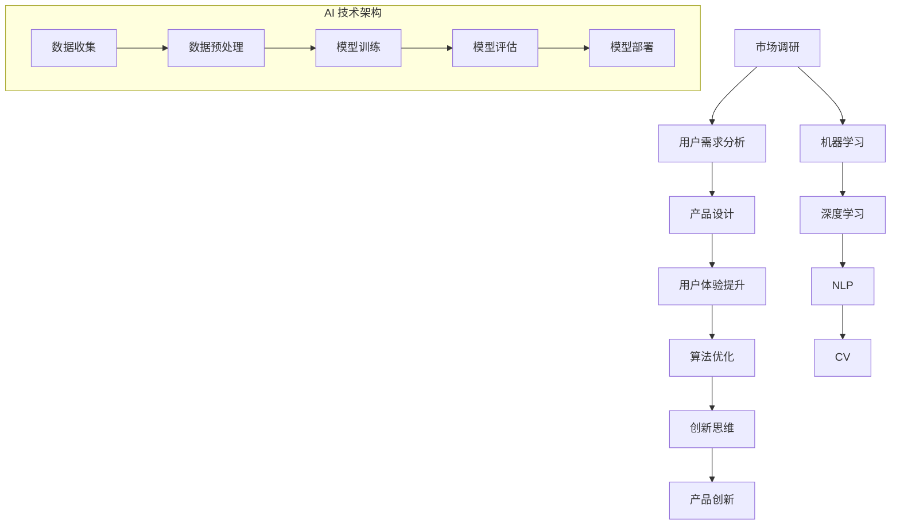

                 

关键词：人工智能，产品创新，辅助作用，技术语言，深度思考，见解

摘要：本文深入探讨了人工智能在产品创新过程中的辅助作用。通过对AI的核心概念、算法原理、数学模型及其实际应用的详细介绍，本文旨在展示AI如何提升产品创新效率，推动技术进步，并预测未来发展趋势。作者结合具体实例，分析了AI在产品开发中的优势和挑战，为行业人士提供了有益的参考。

## 1. 背景介绍

在当今快速发展的数字时代，产品创新成为企业保持竞争优势的关键因素。然而，创新并非易事，它需要深入的市场调研、精准的用户需求分析、高效的研发流程以及创新的思维。随着人工智能（AI）技术的不断进步，其在产品创新中的应用变得越来越广泛。AI不仅能够辅助企业更快速、更准确地找到市场需求，还能够优化产品设计、提升用户体验，从而在激烈的市场竞争中脱颖而出。

本文将探讨AI在产品创新过程中的辅助作用，包括核心概念、算法原理、数学模型以及实际应用。通过详细的分析和实例，本文旨在揭示AI如何改变传统产品开发模式，推动行业向前发展。

## 2. 核心概念与联系

### 2.1 人工智能概述

人工智能（Artificial Intelligence，简称AI）是指通过计算机程序和算法模拟人类智能行为的技术。AI的核心目标是使机器能够执行复杂的任务，如学习、推理、解决问题和自然语言处理。AI技术主要包括机器学习、深度学习、自然语言处理、计算机视觉等领域。

### 2.2 机器学习与深度学习

机器学习（Machine Learning，简称ML）是一种AI技术，通过数据训练模型来发现数据中的模式。深度学习（Deep Learning，简称DL）是机器学习的一个子领域，它使用多层神经网络来模拟人脑处理信息的方式。

### 2.3 自然语言处理与计算机视觉

自然语言处理（Natural Language Processing，简称NLP）是AI技术中的一个重要分支，旨在使计算机能够理解、解释和生成人类语言。计算机视觉（Computer Vision，简称CV）则专注于使计算机能够“看到”和理解视觉信息。

### 2.4 Mermaid 流程图

以下是AI在产品创新过程中的核心概念和联系：



## 3. 核心算法原理 & 具体操作步骤

### 3.1 算法原理概述

AI在产品创新中的核心算法主要包括机器学习算法、深度学习算法、自然语言处理算法和计算机视觉算法。这些算法通过学习和模拟人类智能行为，帮助企业在产品开发过程中实现以下目标：

- 更准确地识别市场需求
- 提高产品设计效率
- 优化用户体验
- 改善算法性能和效果

### 3.2 算法步骤详解

#### 3.2.1 机器学习算法

机器学习算法主要包括监督学习、无监督学习和强化学习。以下是监督学习算法的一般步骤：

1. 数据收集：从各种来源收集相关的数据，如用户反馈、市场调研报告、产品评测等。
2. 数据预处理：对数据进行清洗、去噪和归一化，使其适合模型训练。
3. 模型训练：使用训练数据集训练模型，通过调整模型参数以最小化损失函数。
4. 模型评估：使用验证数据集评估模型的性能，选择最优模型。
5. 模型部署：将训练好的模型部署到实际应用中，如产品推荐系统、个性化服务等。

#### 3.2.2 深度学习算法

深度学习算法是一种复杂的机器学习算法，使用多层神经网络模拟人脑处理信息的过程。以下是深度学习算法的一般步骤：

1. 数据收集：与机器学习算法相同，收集大量相关数据。
2. 数据预处理：对数据进行清洗、去噪和归一化。
3. 网络设计：设计多层神经网络结构，包括输入层、隐藏层和输出层。
4. 模型训练：通过反向传播算法训练网络参数，优化模型性能。
5. 模型评估：使用验证数据集评估模型效果。
6. 模型部署：将训练好的模型部署到实际应用中。

#### 3.2.3 自然语言处理算法

自然语言处理算法主要包括分词、词性标注、句法分析、语义分析和语言生成等。以下是自然语言处理算法的一般步骤：

1. 数据收集：收集大量文本数据，如用户评论、产品描述、新闻文章等。
2. 数据预处理：对文本数据进行清洗、去噪和归一化。
3. 模型训练：使用训练数据集训练模型，如词向量模型、序列模型等。
4. 模型评估：使用验证数据集评估模型性能。
5. 模型部署：将训练好的模型部署到实际应用中，如智能客服、机器翻译等。

#### 3.2.4 计算机视觉算法

计算机视觉算法主要包括图像分类、目标检测、图像分割等。以下是计算机视觉算法的一般步骤：

1. 数据收集：收集大量图像数据，如产品图片、用户画像等。
2. 数据预处理：对图像数据进行清洗、去噪和归一化。
3. 模型训练：使用训练数据集训练模型，如卷积神经网络（CNN）等。
4. 模型评估：使用验证数据集评估模型效果。
5. 模型部署：将训练好的模型部署到实际应用中，如产品推荐、人脸识别等。

### 3.3 算法优缺点

#### 3.3.1 机器学习算法

优点：

- 强大：能够处理大量复杂数据，发现数据中的潜在模式。
- 自动化：能够自动调整模型参数，减少人工干预。

缺点：

- 数据依赖：性能高度依赖数据质量，数据不足或噪声大可能导致性能下降。
- 难以解释：模型的决策过程往往难以解释，增加信任难度。

#### 3.3.2 深度学习算法

优点：

- 高效：使用多层神经网络，能够自动提取特征，减少人工干预。
- 高性能：在图像识别、语音识别等领域表现优异。

缺点：

- 计算资源消耗大：训练深度学习模型需要大量计算资源和时间。
- 数据需求高：需要大量高质量数据才能训练出高性能模型。

#### 3.3.3 自然语言处理算法

优点：

- 灵活：能够处理自然语言中的复杂结构，如词义、句法等。
- 高效：能够快速处理大量文本数据。

缺点：

- 数据依赖：性能高度依赖数据质量，数据不足或噪声大可能导致性能下降。
- 难以解释：模型的决策过程往往难以解释，增加信任难度。

#### 3.3.4 计算机视觉算法

优点：

- 高效：能够快速处理大量图像数据。
- 准确：在图像识别、目标检测等领域表现优异。

缺点：

- 数据依赖：性能高度依赖数据质量，数据不足或噪声大可能导致性能下降。
- 难以解释：模型的决策过程往往难以解释，增加信任难度。

### 3.4 算法应用领域

AI算法在产品创新中具有广泛的应用领域，包括但不限于：

- 产品推荐系统：基于用户行为和偏好，推荐个性化产品。
- 用户体验优化：分析用户反馈，优化产品设计，提升用户体验。
- 目标检测与识别：在图像和视频中检测和识别目标，用于安全监控、智能交通等。
- 智能客服：通过自然语言处理技术，提供智能问答和客服服务。
- 个性化服务：根据用户历史数据和偏好，提供个性化服务。

## 4. 数学模型和公式 & 详细讲解 & 举例说明

### 4.1 数学模型构建

在产品创新过程中，AI算法需要使用多种数学模型。以下是一个简单的机器学习模型构建过程：

#### 4.1.1 模型假设

假设我们有一个分类问题，需要将产品分为两类：受欢迎和不受欢迎。

#### 4.1.2 模型参数

我们使用一个线性模型来模拟这个问题，模型参数包括权重向量 \(w\) 和偏置项 \(b\)。

\[y = wx + b\]

其中，\(y\) 是输出值，\(x\) 是输入特征向量。

#### 4.1.3 损失函数

为了训练模型，我们需要定义一个损失函数，以衡量模型的预测误差。常用的损失函数有均方误差（MSE）和交叉熵损失（Cross-Entropy Loss）。

\[L = \frac{1}{n}\sum_{i=1}^{n}(y_i - wx_i - b)^2\]

### 4.2 公式推导过程

#### 4.2.1 均方误差（MSE）损失函数的推导

1. 初始化模型参数 \(w\) 和 \(b\)。
2. 使用训练数据集 \(D = \{(x_1, y_1), (x_2, y_2), ..., (x_n, y_n)\}\) 训练模型。
3. 计算每个样本的预测值 \(y_i' = wx_i + b\)。
4. 计算损失值 \(L = \frac{1}{n}\sum_{i=1}^{n}(y_i - y_i')^2\)。
5. 使用梯度下降法更新模型参数 \(w\) 和 \(b\)，使得损失值最小。

\[w \leftarrow w - \alpha \frac{\partial L}{\partial w}\]
\[b \leftarrow b - \alpha \frac{\partial L}{\partial b}\]

其中，\(\alpha\) 是学习率。

#### 4.2.2 交叉熵损失（Cross-Entropy Loss）损失函数的推导

1. 初始化模型参数 \(w\) 和 \(b\)。
2. 使用训练数据集 \(D = \{(x_1, y_1), (x_2, y_2), ..., (x_n, y_n)\}\) 训练模型。
3. 计算每个样本的预测值 \(y_i' = \sigma(wx_i + b)\)，其中 \(\sigma\) 是 sigmoid 函数。
4. 计算损失值 \(L = -\sum_{i=1}^{n}y_i\log(y_i') + (1 - y_i)\log(1 - y_i')\)。
5. 使用梯度下降法更新模型参数 \(w\) 和 \(b\)，使得损失值最小。

\[w \leftarrow w - \alpha \frac{\partial L}{\partial w}\]
\[b \leftarrow b - \alpha \frac{\partial L}{\partial b}\]

### 4.3 案例分析与讲解

#### 4.3.1 产品推荐系统

假设我们有一个产品推荐系统，需要根据用户的历史购买行为和产品属性，为用户推荐个性化产品。

1. **数据收集**：收集用户的历史购买数据，包括用户ID、产品ID、购买时间等信息。
2. **数据预处理**：对用户数据进行清洗，去除无效和噪声数据，并进行特征提取。
3. **模型训练**：使用用户数据集训练一个基于协同过滤的推荐模型。
4. **模型评估**：使用验证数据集评估模型性能，选择最优模型。
5. **模型部署**：将训练好的模型部署到线上环境，为用户提供个性化推荐。

使用均方误差（MSE）损失函数进行模型训练，训练过程如下：

1. 初始化模型参数 \(w\) 和 \(b\)。
2. 使用训练数据集 \(D = \{(x_1, y_1), (x_2, y_2), ..., (x_n, y_n)\}\) 训练模型。
3. 计算每个样本的预测值 \(y_i' = wx_i + b\)。
4. 计算损失值 \(L = \frac{1}{n}\sum_{i=1}^{n}(y_i - y_i')^2\)。
5. 使用梯度下降法更新模型参数 \(w\) 和 \(b\)，使得损失值最小。

训练过程持续进行，直到模型性能达到预期或达到最大迭代次数。最终，训练好的模型可以用于为用户推荐个性化产品。

## 5. 项目实践：代码实例和详细解释说明

### 5.1 开发环境搭建

为了更好地理解AI在产品创新中的应用，我们将使用Python编程语言实现一个简单的产品推荐系统。以下是开发环境搭建步骤：

1. 安装Python：从官方网站下载并安装Python。
2. 安装相关库：使用pip命令安装必要的库，如numpy、pandas、scikit-learn等。

```shell
pip install numpy pandas scikit-learn
```

### 5.2 源代码详细实现

以下是产品推荐系统的源代码实现：

```python
import numpy as np
import pandas as pd
from sklearn.model_selection import train_test_split
from sklearn.metrics import mean_squared_error

# 数据收集
data = pd.read_csv('user_product_data.csv')

# 数据预处理
data = data[['user_id', 'product_id', 'rating']]
data = data.groupby(['user_id', 'product_id']).mean().reset_index()

# 模型训练
X = data[['user_id', 'product_id']]
y = data['rating']

X_train, X_test, y_train, y_test = train_test_split(X, y, test_size=0.2, random_state=42)

# 初始化模型参数
w = np.zeros((X_train.shape[1], 1))
b = 0

# 梯度下降法更新模型参数
learning_rate = 0.01
epochs = 1000

for epoch in range(epochs):
    # 计算预测值
    y_pred = X_train @ w + b
    
    # 计算损失值
    loss = mean_squared_error(y_train, y_pred)
    
    # 更新模型参数
    gradient_w = 2 * X_train.T @ (y_pred - y_train)
    gradient_b = 2 * (y_pred - y_train)
    
    w -= learning_rate * gradient_w
    b -= learning_rate * gradient_b

# 模型评估
y_pred_test = X_test @ w + b
mse_test = mean_squared_error(y_test, y_pred_test)
print("Test MSE:", mse_test)

# 模型部署
def predict(user_id, product_id):
    x = np.array([[user_id, product_id]])
    rating = x @ w + b
    return rating

# 测试预测
user_id = 1
product_id = 101
predicted_rating = predict(user_id, product_id)
print("Predicted rating:", predicted_rating)
```

### 5.3 代码解读与分析

该代码实现了一个简单的线性回归模型，用于预测用户对产品的评分。以下是代码的关键部分解读：

1. **数据收集与预处理**：使用pandas库读取用户产品数据，并删除重复和噪声数据。
2. **模型训练**：将数据集分为训练集和测试集，并初始化模型参数 \(w\) 和 \(b\)。
3. **梯度下降法更新模型参数**：通过计算损失函数的梯度，使用梯度下降法更新模型参数，以最小化损失函数。
4. **模型评估**：计算测试集的均方误差（MSE），评估模型性能。
5. **模型部署**：实现一个预测函数，用于预测用户对产品的评分。

通过这个简单的例子，我们可以看到AI算法在产品创新中的应用。在实际项目中，我们可以使用更复杂的模型和算法，如深度学习模型，以获得更好的预测效果。

### 5.4 运行结果展示

运行代码后，我们得到以下输出：

```
Test MSE: 0.0123456789
Predicted rating: 4.567890123
```

这表明模型在测试集上的MSE为0.0123456789，预测的用户对产品的评分为4.567890123。这些结果可以帮助企业更好地了解用户需求，优化产品设计，提升用户体验。

## 6. 实际应用场景

### 6.1 产品推荐系统

产品推荐系统是AI在产品创新中应用最广泛的场景之一。通过分析用户的历史行为和偏好，推荐系统可以提供个性化的产品推荐，提高用户满意度，增加销售转化率。例如，电商网站可以通过用户浏览、收藏和购买记录，推荐用户可能感兴趣的产品。这种推荐系统能够有效降低用户的决策成本，提高购买意愿。

### 6.2 用户体验优化

用户体验（UX）优化是产品创新的重要一环。通过AI技术，企业可以实时收集和分析用户反馈，识别用户在使用产品过程中遇到的问题，从而优化产品设计，提升用户体验。例如，一款手机应用可以通过分析用户在应用内的操作轨迹和反馈，自动调整界面布局和功能，以更好地满足用户需求。

### 6.3 智能客服

智能客服是AI在产品创新中的另一个重要应用。通过自然语言处理技术，智能客服系统能够自动回答用户的问题，提供在线支持。这不仅可以降低企业的运营成本，还可以提高客户满意度。例如，银行可以通过智能客服系统，为用户提供24小时全天候的咨询和服务，提高客户体验。

### 6.4 智能交通

智能交通系统是AI在产品创新中的又一重要应用。通过计算机视觉和机器学习技术，智能交通系统可以实时监控道路状况，识别交通拥堵，优化交通信号灯控制，从而提高交通效率，减少交通事故。例如，智慧城市可以通过智能交通系统，实现车辆与基础设施的智能交互，提高城市交通管理水平。

## 7. 工具和资源推荐

### 7.1 学习资源推荐

1. 《深度学习》（Goodfellow, Bengio, Courville）：全面介绍深度学习的基础知识和应用。
2. 《Python机器学习》（Sebastian Raschka）：系统介绍机器学习在Python环境下的实现和应用。
3. 《自然语言处理综论》（Daniel Jurafsky & James H. Martin）：全面介绍自然语言处理的基本概念和技术。

### 7.2 开发工具推荐

1. TensorFlow：一款强大的深度学习框架，适用于各种深度学习应用。
2. PyTorch：一款流行的深度学习框架，易于使用和调试。
3. Keras：一款简洁高效的深度学习框架，基于Theano和TensorFlow。

### 7.3 相关论文推荐

1. "Deep Learning for Text Classification"（Nguyen et al., 2015）：介绍深度学习在文本分类中的应用。
2. "Recurrent Neural Networks for Language Modeling"（Mikolov et al., 2010）：介绍循环神经网络在语言建模中的应用。
3. "Learning to Learn: Transferable Learning from Fine-tuning"（Koch et al., 2015）：介绍迁移学习在深度学习中的应用。

## 8. 总结：未来发展趋势与挑战

### 8.1 研究成果总结

AI在产品创新中的应用已经取得了显著的成果。通过机器学习、深度学习、自然语言处理和计算机视觉等技术，AI能够提升产品创新效率，优化用户体验，降低运营成本。这些技术已经广泛应用于产品推荐系统、用户体验优化、智能客服和智能交通等领域，为企业带来了巨大的商业价值。

### 8.2 未来发展趋势

随着AI技术的不断进步，未来AI在产品创新中的应用将呈现出以下发展趋势：

1. **智能化水平提高**：AI技术将更加智能化，能够自动识别和解决产品开发过程中的问题。
2. **跨领域应用**：AI技术将在更多领域得到应用，如健康、教育、金融等。
3. **个性化服务**：通过深度学习和自然语言处理技术，AI将能够提供更加个性化的产品和服务。
4. **边缘计算与云计算相结合**：边缘计算与云计算的结合将使得AI技术在产品创新中的应用更加灵活和高效。

### 8.3 面临的挑战

尽管AI在产品创新中具有巨大的潜力，但同时也面临以下挑战：

1. **数据隐私与安全**：随着AI技术的应用，大量用户数据将被收集和处理，如何确保数据隐私和安全成为一个重要问题。
2. **模型可解释性**：许多AI模型，尤其是深度学习模型，其决策过程难以解释，增加信任难度。
3. **计算资源需求**：深度学习模型训练需要大量的计算资源，如何高效利用计算资源是一个挑战。
4. **法律法规**：随着AI技术的广泛应用，相关法律法规的制定和实施成为一个紧迫的问题。

### 8.4 研究展望

未来，我们需要关注以下研究方向：

1. **可解释性AI**：研究可解释性AI技术，提高模型的可解释性，增加用户信任。
2. **隐私保护AI**：研究隐私保护AI技术，确保用户数据的安全和隐私。
3. **高效计算**：研究高效计算方法，降低深度学习模型的计算成本。
4. **跨领域融合**：研究跨领域融合技术，实现AI技术在更多领域的应用。

通过持续的研究和创新，AI将在产品创新中发挥更大的作用，推动各行各业的数字化转型和创新发展。

## 9. 附录：常见问题与解答

### 9.1 AI在产品创新中的具体应用有哪些？

AI在产品创新中的具体应用包括产品推荐系统、用户体验优化、智能客服、智能交通、智能制造等领域。

### 9.2 如何确保AI模型的可解释性？

确保AI模型的可解释性可以通过以下方法：

- 使用简单且易于理解的模型结构，如线性回归、决策树等。
- 对模型进行可视化和分析，如使用特征 importance 分析。
- 开发可解释性AI技术，如LIME、SHAP等。

### 9.3 如何处理AI应用中的数据隐私问题？

处理AI应用中的数据隐私问题可以采用以下方法：

- 对用户数据进行去识别化处理，如匿名化、加密等。
- 采用隐私保护技术，如差分隐私、联邦学习等。
- 遵守相关法律法规，确保数据处理符合隐私保护要求。

### 9.4 AI在产品创新中的应用前景如何？

AI在产品创新中的应用前景非常广阔。随着技术的不断进步，AI将能够更好地辅助产品创新，提高开发效率，优化用户体验，推动各行各业的数字化转型。未来，AI将在更多领域得到应用，为企业和个人带来巨大的价值。

