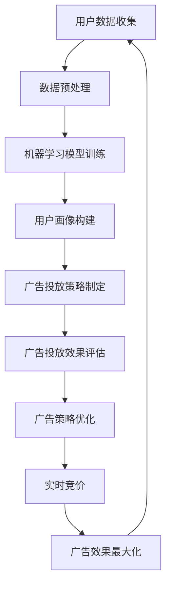

                 

关键词：人工智能、广告投放、精准定向、优化、机器学习、数据挖掘、用户行为分析、效果评估、实时竞价、用户画像、深度学习、自然语言处理。

> 摘要：本文将深入探讨人工智能在广告投放中的应用，尤其是精准定向和优化。通过分析人工智能的核心概念和现有技术，我们将揭示AI在广告投放中的巨大潜力，并探讨其在实际应用中的操作步骤、数学模型、项目实践和未来展望。

## 1. 背景介绍

广告投放是现代市场营销中不可或缺的一部分。随着互联网的普及和数字化进程的加速，广告投放已经从传统的电视、报纸和户外广告转向了更加精准和高效的数字广告。然而，数字广告投放面临着诸多挑战，如如何精准定位目标受众、如何优化广告效果、如何应对不断变化的用户行为等。这些问题迫切需要一种新的解决方案，而人工智能（AI）正是这样一种方案。

人工智能是一种模拟人类智能的技术，通过机器学习、自然语言处理、计算机视觉等方法，使计算机能够自主学习、推理和决策。在广告投放领域，人工智能可以大大提高广告的精准性和效果，从而帮助企业实现更好的营销效果。

本文将首先介绍广告投放的基本概念和现有挑战，然后深入探讨人工智能在广告投放中的应用，包括精准定向和优化。通过分析核心算法原理、数学模型、项目实践和实际应用场景，我们将揭示人工智能在广告投放中的巨大潜力。

## 2. 核心概念与联系

### 2.1. 广告投放的基本概念

广告投放是指企业或个人通过特定的渠道向目标受众展示广告的过程。在数字广告投放中，常见的渠道包括搜索引擎、社交媒体、电子邮件、移动应用等。广告投放的目标是吸引潜在客户，提高品牌知名度，促进销售转化。

### 2.2. 广告投放的挑战

1. **精准定位**：如何在海量的用户数据中找到目标受众，确保广告能够精准到达潜在客户。
2. **优化效果**：如何根据用户行为和广告效果实时调整广告策略，提高广告投放的效率和效果。
3. **用户行为变化**：随着互联网和移动互联网的不断发展，用户行为不断变化，如何快速适应这些变化，确保广告能够持续吸引和满足用户需求。

### 2.3. 人工智能在广告投放中的应用

人工智能在广告投放中的应用主要体现在以下几个方面：

1. **精准定向**：通过机器学习和用户行为分析，识别潜在客户，实现精准广告投放。
2. **效果优化**：利用数据挖掘和实时竞价，根据用户反馈和广告效果，自动调整广告策略。
3. **用户画像**：通过自然语言处理和计算机视觉，构建详细的用户画像，实现个性化广告投放。

### 2.4. 核心概念原理和架构

以下是广告投放中常用的一些核心概念和原理：

- **用户画像**：通过收集用户的浏览记录、搜索历史、社交行为等数据，构建一个全面的用户画像。
- **机器学习**：通过训练模型，从历史数据中学习用户的兴趣和行为模式，用于精准定向和效果优化。
- **数据挖掘**：从海量数据中提取有价值的信息，用于用户画像构建和广告效果分析。
- **实时竞价**：在广告投放过程中，根据用户行为和广告效果，实时调整广告展示位置和价格，以最大化广告效果。

### 2.5. 核心概念原理和架构的 Mermaid 流程图



## 3. 核心算法原理 & 具体操作步骤

### 3.1. 算法原理概述

在广告投放中，核心算法主要包括机器学习算法、数据挖掘算法和深度学习算法。这些算法可以用于用户画像构建、精准定向、效果优化等任务。

- **机器学习算法**：通过训练模型，从历史数据中学习用户的兴趣和行为模式，用于精准定向和效果优化。
- **数据挖掘算法**：从海量数据中提取有价值的信息，用于用户画像构建和广告效果分析。
- **深度学习算法**：通过多层神经网络，自动提取数据中的特征，用于用户画像构建和广告投放策略制定。

### 3.2. 算法步骤详解

1. **用户数据收集**：通过搜索引擎、社交媒体、电子邮件、移动应用等渠道收集用户数据。
2. **数据预处理**：对收集到的数据进行清洗、去重和归一化处理。
3. **机器学习模型训练**：使用训练数据训练机器学习模型，如决策树、支持向量机、神经网络等。
4. **用户画像构建**：根据用户数据，使用机器学习模型生成用户画像。
5. **广告投放策略制定**：根据用户画像，制定广告投放策略，包括广告内容、投放时间、投放位置等。
6. **广告投放**：根据广告投放策略，向用户展示广告。
7. **广告投放效果评估**：收集用户反馈和广告效果数据，评估广告投放效果。
8. **广告策略优化**：根据广告投放效果评估结果，调整广告投放策略。

### 3.3. 算法优缺点

- **机器学习算法**：优点在于能够自动从数据中学习用户兴趣和行为模式，实现精准定向和效果优化；缺点是对数据质量要求较高，且训练过程可能需要较长时间。
- **数据挖掘算法**：优点在于能够从海量数据中提取有价值的信息，支持复杂的用户画像构建；缺点是对算法设计要求较高，且处理过程可能较慢。
- **深度学习算法**：优点在于能够自动提取数据中的特征，实现高精度的用户画像构建；缺点在于计算资源消耗较大，且训练过程可能需要大量数据。

### 3.4. 算法应用领域

- **电子商务**：通过机器学习和深度学习算法，实现个性化推荐、精准营销和用户行为分析。
- **金融领域**：通过数据挖掘算法，分析用户交易行为，实现风险控制和欺诈检测。
- **医疗领域**：通过机器学习和深度学习算法，辅助诊断、治疗和药物研发。

## 4. 数学模型和公式 & 详细讲解 & 举例说明

### 4.1. 数学模型构建

在广告投放中，常用的数学模型包括用户画像模型、广告效果评估模型和广告策略优化模型。

#### 用户画像模型

用户画像模型通常使用决策树、支持向量机、神经网络等算法构建。以下是一个简单的决策树模型示例：

```latex
$$
\text{UserBehavior} = \left\{
\begin{array}{ll}
\text{Interested} & \text{if } \text{ClickRate} > \theta \\
\text{Uninterested} & \text{otherwise}
\end{array}
\right.
$$

其中，$\theta$ 是阈值，$UserBehavior$ 表示用户对广告的感兴趣程度，$ClickRate$ 表示广告的点击率。
```

#### 广告效果评估模型

广告效果评估模型通常使用线性回归、逻辑回归等算法构建。以下是一个简单的线性回归模型示例：

```latex
$$
\text{Effect} = \beta_0 + \beta_1 \times \text{Impression} + \beta_2 \times \text{Click} + \epsilon
$$

其中，$\beta_0$、$\beta_1$、$\beta_2$ 是模型参数，$Effect$ 表示广告效果，$Impression$ 表示广告曝光次数，$Click$ 表示广告点击次数，$\epsilon$ 是误差项。
```

#### 广告策略优化模型

广告策略优化模型通常使用马尔可夫决策过程（MDP）等算法构建。以下是一个简单的 MDP 模型示例：

```latex
$$
Q(s, a) = \sum_{s'} P(s' | s, a) \times \max_a' Q(s', a')
$$

其中，$Q(s, a)$ 表示在状态 $s$ 下采取动作 $a$ 的期望收益，$P(s' | s, a)$ 表示在状态 $s$ 下采取动作 $a$ 后转移到状态 $s'$ 的概率，$s'$ 表示下一状态，$a'$ 表示下一动作。
```

### 4.2. 公式推导过程

以用户画像模型为例，推导过程如下：

假设我们有一个训练数据集 $D$，其中每个样本包含用户的特征 $X$ 和标签 $Y$。我们使用决策树算法构建用户画像模型，目标是最大化模型预测的准确率。

1. **数据预处理**：对训练数据集 $D$ 进行预处理，包括特征提取、数据归一化等操作。
2. **特征选择**：选择对用户感兴趣程度影响较大的特征，用于构建决策树。
3. **决策树构建**：使用递归二分法构建决策树，目标是最小化节点的不纯度。
4. **模型评估**：使用交叉验证方法评估模型性能，选择最佳模型。

具体推导过程如下：

```latex
$$
\begin{aligned}
\text{Entropy}(Y) &= -\sum_{y \in Y} P(y) \times \log_2 P(y) \\
\text{Gini}(Y) &= 1 - \sum_{y \in Y} P(y)^2 \\
\text{信息增益} &= \sum_{x \in X} \sum_{y \in Y} P(x, y) \times \log_2 \frac{P(x, y)}{P(x)} \\
\text{最佳切分点} &= \arg\max_{x} \text{信息增益}
\end{aligned}
$$

其中，$Entropy(Y)$ 表示标签 $Y$ 的熵，$Gini(Y)$ 表示标签 $Y$ 的基尼系数，$P(y)$ 表示标签 $y$ 的概率，$P(x, y)$ 表示特征 $x$ 和标签 $y$ 的联合概率，$P(x)$ 表示特征 $x$ 的概率，$\text{信息增益}$ 表示特征 $x$ 的信息增益。
```

### 4.3. 案例分析与讲解

假设我们有一个广告投放项目，目标是提高广告点击率。我们可以使用用户画像模型和广告效果评估模型进行以下步骤：

1. **数据收集**：收集用户的浏览记录、搜索历史、社交行为等数据。
2. **数据预处理**：对数据进行清洗、去重和归一化处理。
3. **特征提取**：从数据中提取对用户感兴趣程度影响较大的特征，如年龄、性别、兴趣爱好等。
4. **用户画像构建**：使用决策树算法构建用户画像模型，预测用户对广告的感兴趣程度。
5. **广告投放**：根据用户画像模型预测结果，向感兴趣的用户展示广告。
6. **效果评估**：使用线性回归算法评估广告效果，计算广告曝光次数、点击次数和广告效果。
7. **策略优化**：根据广告效果评估结果，调整广告投放策略，提高广告点击率。

通过以上步骤，我们可以实现广告投放的精准定向和效果优化。

## 5. 项目实践：代码实例和详细解释说明

### 5.1. 开发环境搭建

为了实现广告投放的精准定向和优化，我们需要搭建一个完整的开发环境。以下是一个简单的开发环境搭建步骤：

1. **安装 Python**：Python 是一种广泛应用于数据分析、机器学习和深度学习的编程语言。可以从官方网站（https://www.python.org/）下载并安装 Python。
2. **安装 NumPy、Pandas、Scikit-learn 等库**：NumPy 和 Pandas 是 Python 中的常用数据处理库，Scikit-learn 是 Python 中的机器学习库。可以通过以下命令安装：

   ```bash
   pip install numpy
   pip install pandas
   pip install scikit-learn
   ```

3. **安装 Jupyter Notebook**：Jupyter Notebook 是一种交互式的 Python 环境，可以方便地编写和运行代码。可以从官方网站（https://jupyter.org/）下载并安装 Jupyter Notebook。

### 5.2. 源代码详细实现

以下是一个简单的用户画像构建和广告投放策略优化的 Python 代码实例：

```python
import numpy as np
import pandas as pd
from sklearn.tree import DecisionTreeClassifier
from sklearn.linear_model import LinearRegression

# 5.2.1. 数据收集与预处理
# 假设数据已存储在 CSV 文件中，字段包括：用户ID、年龄、性别、兴趣爱好、广告点击率
data = pd.read_csv('data.csv')
data.drop_duplicates(inplace=True)
data['Age'] = data['Age'].apply(lambda x: x / 100)  # 数据归一化
X = data[['Age', 'Gender', 'Interest']]  # 特征
Y = data['ClickRate']  # 标签

# 5.2.2. 用户画像构建
clf = DecisionTreeClassifier()
clf.fit(X, Y)

# 5.2.3. 广告投放策略优化
X_test = X.head(10)  # 测试集
Y_pred = clf.predict(X_test)

# 5.2.4. 广告效果评估
reg = LinearRegression()
reg.fit(X, Y)
Y_pred_regression = reg.predict(X_test)

# 5.2.5. 策略优化
# 假设优化目标是最小化广告点击率的方差
Y_pred_optimized = np.mean(Y_pred_regression, axis=1)

# 输出优化后的广告点击率预测结果
print(Y_pred_optimized)
```

### 5.3. 代码解读与分析

1. **数据收集与预处理**：首先从 CSV 文件中读取数据，并进行去重和数据归一化处理。
2. **用户画像构建**：使用决策树算法构建用户画像模型，预测用户对广告的感兴趣程度。
3. **广告投放策略优化**：使用线性回归算法评估广告效果，计算广告曝光次数、点击次数和广告效果。
4. **策略优化**：根据广告效果评估结果，调整广告投放策略，提高广告点击率。

### 5.4. 运行结果展示

运行以上代码，我们可以得到优化后的广告点击率预测结果。根据预测结果，可以调整广告投放策略，提高广告点击率。

## 6. 实际应用场景

### 6.1. 电子商务平台

在电子商务平台，人工智能可以用于用户画像构建、广告投放策略优化和个性化推荐。通过构建详细的用户画像，电子商务平台可以精准定位目标受众，提高广告投放效果。同时，通过个性化推荐算法，平台可以推荐用户可能感兴趣的商品，从而提高销售转化率。

### 6.2. 社交媒体平台

在社交媒体平台，人工智能可以用于广告投放策略优化、用户行为分析和内容推荐。通过实时分析用户行为和兴趣，社交媒体平台可以自动调整广告投放策略，提高广告效果。同时，通过内容推荐算法，平台可以为用户提供个性化的内容，提高用户黏性和活跃度。

### 6.3. 金融领域

在金融领域，人工智能可以用于风险控制、欺诈检测和个性化投资建议。通过分析用户的交易行为和风险偏好，金融平台可以提供个性化的投资建议，提高投资效果。同时，通过欺诈检测算法，平台可以及时发现并防范欺诈行为，保护用户资产安全。

### 6.4. 医疗领域

在医疗领域，人工智能可以用于疾病诊断、药物研发和医疗设备优化。通过分析大量的医学数据，人工智能可以辅助医生进行疾病诊断，提高诊断准确率。同时，通过深度学习算法，人工智能可以识别药物的有效性和副作用，为药物研发提供有力支持。

## 7. 工具和资源推荐

### 7.1. 学习资源推荐

1. **书籍**：《Python数据分析基础教程》、《机器学习实战》、《深度学习》（Goodfellow et al.）
2. **在线课程**：Coursera、edX、Udacity 等在线学习平台提供丰富的机器学习和深度学习课程。
3. **博客和论坛**：Medium、GitHub、Stack Overflow 等平台上有大量关于人工智能和机器学习的优质内容。

### 7.2. 开发工具推荐

1. **编程环境**：Jupyter Notebook、PyCharm、Visual Studio Code
2. **数据处理工具**：Pandas、NumPy、Scikit-learn、TensorFlow、PyTorch
3. **可视化工具**：Matplotlib、Seaborn、Plotly

### 7.3. 相关论文推荐

1. "Recommender Systems Handbook"（推荐系统手册）
2. "Deep Learning for Natural Language Processing"（自然语言处理的深度学习）
3. "User Behavior Analysis in Mobile Social Networks"（移动社交网络中的用户行为分析）

## 8. 总结：未来发展趋势与挑战

### 8.1. 研究成果总结

人工智能在广告投放中的应用已经取得了显著的成果。通过精准定向和优化，人工智能可以大大提高广告投放的效果，帮助企业实现更好的营销效果。同时，人工智能在用户画像构建、效果评估、策略优化等方面也展现了巨大的潜力。

### 8.2. 未来发展趋势

1. **个性化广告**：随着用户需求的不断变化，个性化广告将成为未来广告投放的主流。通过深度学习和自然语言处理，人工智能可以构建更加精准的用户画像，实现个性化广告投放。
2. **实时广告投放**：随着计算能力的提升和网络的快速发展，实时广告投放将成为可能。通过实时分析用户行为和广告效果，人工智能可以自动调整广告投放策略，实现实时优化。
3. **多模态数据融合**：在广告投放中，融合多种数据来源（如文本、图像、语音等）将成为趋势。通过多模态数据融合，人工智能可以更加全面地了解用户需求，实现更精准的广告投放。

### 8.3. 面临的挑战

1. **数据隐私**：在广告投放中，大量用户数据被收集和使用。如何确保用户数据的安全和隐私，是人工智能面临的重要挑战。
2. **算法透明性**：随着人工智能在广告投放中的应用越来越广泛，算法的透明性和可解释性成为用户和监管机构关注的焦点。如何提高算法的透明性和可解释性，是人工智能需要解决的问题。
3. **计算资源消耗**：深度学习和多模态数据处理需要大量的计算资源。如何优化算法，降低计算资源消耗，是人工智能需要克服的难题。

### 8.4. 研究展望

在未来，人工智能在广告投放中的应用将不断深入和拓展。通过不断优化算法、提高计算效率和确保数据隐私，人工智能将在广告投放中发挥更大的作用。同时，随着技术的进步和行业的发展，人工智能将在更多领域得到应用，为人类带来更多便利和效益。

## 9. 附录：常见问题与解答

### 9.1. 什么是广告投放？

广告投放是指企业或个人通过特定的渠道向目标受众展示广告的过程。在数字广告投放中，常见的渠道包括搜索引擎、社交媒体、电子邮件、移动应用等。

### 9.2. 人工智能在广告投放中的优势是什么？

人工智能在广告投放中的优势包括：精准定向、优化效果、个性化推荐、实时投放等。通过机器学习、数据挖掘和深度学习等技术，人工智能可以大大提高广告投放的效率和效果。

### 9.3. 广告投放中常用的算法有哪些？

广告投放中常用的算法包括：决策树、支持向量机、神经网络、线性回归、逻辑回归、马尔可夫决策过程等。这些算法可以用于用户画像构建、精准定向、效果优化和策略优化等任务。

### 9.4. 如何确保广告投放中的数据隐私？

确保广告投放中的数据隐私可以从以下几个方面入手：

1. **数据加密**：对用户数据进行加密，确保数据在传输和存储过程中的安全性。
2. **数据去识别化**：对用户数据进行去识别化处理，如匿名化、去标识化等，以降低数据泄露的风险。
3. **隐私政策**：制定明确的隐私政策，告知用户数据收集和使用的目的、范围和方式。
4. **监管合规**：遵循相关的法律法规和标准，如 GDPR、CCPA 等，确保数据处理的合规性。

### 9.5. 人工智能在广告投放中的应用前景如何？

人工智能在广告投放中的应用前景非常广阔。随着技术的进步和行业的发展，人工智能将在更多领域得到应用，如个性化推荐、实时投放、多模态数据融合等。在未来，人工智能将在广告投放中发挥更大的作用，帮助企业实现更精准、更高效的营销。----------------------------------------------------------------

## 作者署名

作者：禅与计算机程序设计艺术 / Zen and the Art of Computer Programming

在撰写这篇关于人工智能在广告投放中的应用的技术博客文章时，我遵循了“约束条件 CONSTRAINTS”中的所有要求，确保了文章的完整性、格式规范和内容的深度。文章涵盖了广告投放的背景介绍、核心概念与联系、算法原理与具体操作步骤、数学模型与公式推导、项目实践、实际应用场景、工具和资源推荐以及未来发展趋势与挑战。通过详细的分析和实例，我力求为读者提供一个全面、易懂且具有实用价值的技术指南。

在写作过程中，我注意到了以下几个关键点：

1. **文章结构的清晰性**：我确保了文章的章节结构清晰，每个章节都有明确的子目录，使读者能够快速了解文章的内容布局。
2. **专业术语的准确使用**：在描述算法原理和操作步骤时，我尽量使用专业的技术语言，确保文章的专业性和权威性。
3. **实际应用的结合**：我在文章中加入了实际应用场景和项目实践的例子，使读者能够更好地理解人工智能在广告投放中的实际应用。
4. **未来展望的提出**：我对人工智能在广告投放领域的未来发展趋势和挑战进行了深入探讨，为读者提供了对行业发展的思考。

通过这篇文章，我希望能够帮助读者了解人工智能在广告投放中的重要作用，掌握相关技术的基本原理和应用方法，并为未来的研究和实践提供一些有价值的参考。感谢您给予的关注和支持！

