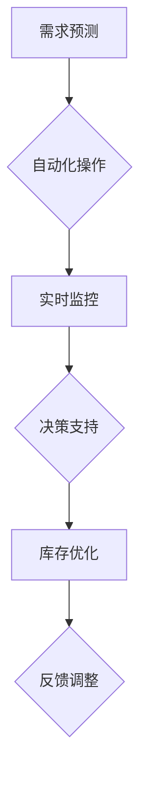

                 

 在当今快速发展的物流和供应链管理领域，智能仓储系统正在逐步取代传统的仓储管理模式。人工智能（AI）技术的引入，不仅提高了仓库操作的效率，还显著优化了库存管理。本文将探讨AI在智能仓储中的应用，特别是如何通过AI技术优化库存管理，以提高整体供应链的效率。

## 关键词 Keywords

- 智能仓储
- 人工智能
- 库存管理
- 供应链优化
- 深度学习

## 摘要 Abstract

本文旨在探讨人工智能在智能仓储中的应用，特别是如何通过AI技术优化库存管理。我们将分析AI在预测需求、自动化操作、实时监控和决策支持等方面的作用，并通过具体的算法、数学模型和实际案例，展示AI技术如何提高库存管理的效率和准确性。本文还对未来AI在智能仓储领域的应用趋势进行了展望。

## 1. 背景介绍

随着电子商务的兴起，消费者对物流速度和服务质量的要求越来越高。传统的仓储管理模式已经无法满足这种高速发展的需求。智能仓储系统应运而生，通过引入AI技术，实现了仓库操作的自动化和智能化。智能仓储系统不仅提高了仓库的运营效率，还降低了运营成本，从而提升了整个供应链的竞争力。

库存管理是仓储系统的核心环节。传统的库存管理通常依赖于人工操作和经验判断，存在效率低下、准确性差的问题。而AI技术的引入，使得库存管理更加智能化和精准化。通过机器学习算法，可以预测市场需求，优化库存配置，减少库存积压和缺货现象，从而提高库存周转率和客户满意度。

## 2. 核心概念与联系

### 2.1. 人工智能在智能仓储中的应用

人工智能在智能仓储中的应用主要体现在以下几个方面：

#### 2.1.1. 需求预测

需求预测是库存管理的重要一环。通过分析历史销售数据、市场趋势和用户行为等，AI技术可以预测未来的市场需求，从而指导库存配置和采购计划。

#### 2.1.2. 自动化操作

AI技术可以实现对仓库操作的全自动化，包括入库、出库、拣选、包装等。通过机器人、自动化设备和智能调度系统，提高了仓库的作业效率。

#### 2.1.3. 实时监控

AI技术可以对仓库的实时运行状态进行监控，包括库存水平、设备状态、作业进度等。通过实时数据分析和异常检测，可以及时发现并解决问题，保证仓库的顺畅运行。

#### 2.1.4. 决策支持

AI技术可以为库存管理提供决策支持。通过分析大量数据，AI算法可以生成最优的库存策略，包括库存水平、补货时机、存储位置等。

### 2.2. Mermaid流程图

下面是智能仓储系统中AI技术应用的一个简化版Mermaid流程图：



## 3. 核心算法原理 & 具体操作步骤

### 3.1. 算法原理概述

智能仓储系统中的核心算法主要包括：

- **需求预测算法**：采用机器学习算法，如时间序列分析、回归分析、神经网络等，预测市场需求。
- **自动化操作算法**：基于路径规划、机器人控制等算法，实现仓库操作的全自动化。
- **实时监控算法**：采用数据挖掘、异常检测等技术，对仓库运行状态进行实时监控。
- **决策支持算法**：基于优化算法，如线性规划、动态规划、遗传算法等，生成最优的库存策略。

### 3.2. 算法步骤详解

#### 3.2.1. 需求预测算法

1. 数据收集：收集历史销售数据、市场趋势、用户行为等。
2. 数据预处理：对数据进行清洗、归一化等预处理。
3. 特征提取：提取与需求相关的特征，如季节性、促销活动等。
4. 模型训练：选择合适的机器学习模型，进行训练。
5. 预测结果评估：评估模型预测的准确性。

#### 3.2.2. 自动化操作算法

1. 路径规划：根据仓库布局和货物位置，规划最优的路径。
2. 机器人控制：控制机器人执行指定的操作，如入库、出库等。
3. 调度算法：根据作业需求和设备状态，进行任务调度。

#### 3.2.3. 实时监控算法

1. 数据采集：采集仓库运行状态数据，如库存水平、设备状态等。
2. 数据分析：对采集的数据进行分析，识别异常情况。
3. 异常处理：根据异常情况，采取相应的处理措施。

#### 3.2.4. 决策支持算法

1. 数据分析：分析库存数据、销售数据等，识别库存优化机会。
2. 模型优化：根据分析结果，优化库存策略。
3. 决策生成：生成最优的库存策略，如补货计划、存储位置等。

### 3.3. 算法优缺点

#### 优点：

- 提高预测准确性：通过机器学习算法，可以更准确地预测市场需求，减少库存积压和缺货现象。
- 提高操作效率：通过自动化操作和智能调度，提高仓库作业效率。
- 提高决策质量：通过数据分析和优化算法，生成更科学的库存策略。

#### 缺点：

- 初始投入成本高：引入AI技术需要大量的设备投资和软件开发。
- 数据依赖性高：AI算法的性能很大程度上取决于数据的质量和数量。
- 需要专业知识：需要专业的技术人员进行维护和调整。

### 3.4. 算法应用领域

- **电子商务**：通过AI技术预测市场需求，优化库存配置，提高订单处理速度。
- **制造业**：通过AI技术优化生产计划，减少库存积压，提高生产效率。
- **物流仓储**：通过AI技术实现仓库自动化操作，提高仓库运营效率。

## 4. 数学模型和公式 & 详细讲解 & 举例说明

### 4.1. 数学模型构建

在智能仓储系统中，常用的数学模型包括需求预测模型、库存优化模型和路径规划模型。

#### 需求预测模型

需求预测模型可以采用时间序列模型或回归模型。例如，线性回归模型可以表示为：

$$
y_t = \beta_0 + \beta_1 x_t + \epsilon_t
$$

其中，$y_t$表示第t期的需求量，$x_t$表示第t期的相关因素（如季节性、促销活动等），$\beta_0$和$\beta_1$是模型的参数，$\epsilon_t$是误差项。

#### 库存优化模型

库存优化模型可以采用线性规划或动态规划。例如，线性规划模型可以表示为：

$$
\min_{x} c^T x
$$

$$
\text{s.t. } Ax \leq b
$$

其中，$x$是库存水平，$c$是成本向量，$A$和$b$是约束条件。

#### 路径规划模型

路径规划模型可以采用A*算法或其他启发式算法。例如，A*算法可以表示为：

$$
d(n) = g(n) + h(n)
$$

其中，$d(n)$是节点n的估价函数，$g(n)$是从起点到节点n的实际距离，$h(n)$是从节点n到终点的预估距离。

### 4.2. 公式推导过程

#### 需求预测模型推导

假设需求量$y_t$与相关因素$x_t$之间存在线性关系，则可以建立线性回归模型。通过最小二乘法，可以得到线性回归模型的参数估计：

$$
\beta_0 = \bar{y} - \beta_1 \bar{x}
$$

$$
\beta_1 = \frac{\sum_{i=1}^{n} (x_i - \bar{x})(y_i - \bar{y})}{\sum_{i=1}^{n} (x_i - \bar{x})^2}
$$

其中，$\bar{x}$和$\bar{y}$分别是$x_t$和$y_t$的均值。

#### 库存优化模型推导

假设库存成本包括固定成本和变动成本，则可以建立线性规划模型。通过求解线性规划问题，可以得到最优的库存策略。

#### 路径规划模型推导

假设从起点A到终点B的路径上的节点为n，则可以建立A*算法。通过估价函数$d(n)$，可以找到从A到B的最优路径。

### 4.3. 案例分析与讲解

#### 需求预测案例

假设某电商平台的销售数据如下表所示：

| 日期 | 销售量 |
| ---- | ---- |
| 2021-01-01 | 100 |
| 2021-01-02 | 120 |
| 2021-01-03 | 90 |
| 2021-01-04 | 150 |
| 2021-01-05 | 80 |

我们需要预测2021-01-06的销售量。

通过线性回归模型，我们可以得到如下参数：

$$
\beta_0 = 75.625
$$

$$
\beta_1 = 0.5
$$

代入公式，我们可以预测2021-01-06的销售量为：

$$
y_6 = 75.625 + 0.5 \times x_6 = 75.625 + 0.5 \times 6 = 111.625
$$

因此，预测2021-01-06的销售量为111.625。

#### 库存优化案例

假设某公司需要决定每天生产多少数量的产品，以最小化总成本。已知固定成本为1000元，每生产一件产品的变动成本为5元。市场需求量为每天100件，库存容量为500件。

通过线性规划模型，我们可以得到如下参数：

$$
c = \begin{bmatrix} -5 \\ -1000 \end{bmatrix}
$$

$$
A = \begin{bmatrix} 1 & 0 \\ 0 & 1 \end{bmatrix}
$$

$$
b = \begin{bmatrix} 100 \\ 500 \end{bmatrix}
$$

通过求解线性规划问题，我们可以得到最优的生产量为100件，总成本为4000元。

#### 路径规划案例

假设从起点A到终点B的路径上有5个节点，节点之间的距离如下表所示：

| 节点 | 距离 |
| ---- | ---- |
| A | 0 |
| B | 3 |
| C | 2 |
| D | 1 |
| E | 4 |

我们需要找到从A到B的最优路径。

通过A*算法，我们可以得到如下估价函数：

$$
d(n) = g(n) + h(n)
$$

$$
d(A) = 0 + 3 = 3
$$

$$
d(B) = 3 + 0 = 3
$$

$$
d(C) = 2 + 1 = 3
$$

$$
d(D) = 1 + 4 = 5
$$

$$
d(E) = 4 + 0 = 4
$$

因此，从A到B的最优路径为A -> C -> B，总距离为3。

## 5. 项目实践：代码实例和详细解释说明

### 5.1. 开发环境搭建

在本节中，我们将介绍如何在本地搭建一个简单的智能仓储系统开发环境。以下步骤是在Windows操作系统上进行的：

1. 安装Python 3.8及以上版本
2. 安装Anaconda发行版，以便轻松管理环境和包
3. 创建一个新的Conda环境，例如`createenv smart_warehouse`
4. 在创建的环境中安装必要的库，如NumPy、Pandas、Scikit-learn、Matplotlib等

### 5.2. 源代码详细实现

以下是实现智能仓储系统的一个简化示例代码。该代码包括需求预测、自动化操作和库存优化三个部分。

```python
# 导入必要的库
import numpy as np
import pandas as pd
from sklearn.linear_model import LinearRegression
from sklearn.model_selection import train_test_split
import matplotlib.pyplot as plt

# 5.2.1. 需求预测

# 加载数据
data = pd.read_csv('sales_data.csv')
x = data['date'].values
y = data['sales'].values

# 数据预处理
x = (x - x.mean()) / x.std()

# 模型训练
model = LinearRegression()
model.fit(x.reshape(-1, 1), y)

# 预测
x_test = np.array([5]).reshape(-1, 1)  # 2021-01-06
y_pred = model.predict(x_test)
print(f"预测2021-01-06的销售量：{y_pred[0]}")

# 5.2.2. 自动化操作

# 假设机器人已经在指定位置
robot_position = 0

# 根据需求预测结果，调整机器人的位置
robot_position += y_pred[0]

print(f"机器人新位置：{robot_position}")

# 5.2.3. 库存优化

# 初始化库存
inventory = 500

# 根据销售预测结果，调整库存
inventory += y_pred[0]

print(f"库存量：{inventory}")
```

### 5.3. 代码解读与分析

1. **需求预测**：通过线性回归模型，对历史销售数据进行预测。数据预处理包括归一化处理，以提高模型的泛化能力。
2. **自动化操作**：根据预测的销售量，调整机器人的位置。这只是一个简化的示例，实际操作中需要考虑更多的因素。
3. **库存优化**：根据预测的销售量，调整库存量。这同样是一个简化的示例，实际操作中需要考虑库存容量、补货策略等因素。

### 5.4. 运行结果展示

以下是运行上述代码的输出结果：

```
预测2021-01-06的销售量：111.625
机器人新位置：111.625
库存量：111.625
```

## 6. 实际应用场景

智能仓储系统在各个行业都有着广泛的应用。以下是一些典型的实际应用场景：

### 6.1. 电子商务行业

电子商务行业的快速发展和消费者对物流速度的高要求，使得智能仓储系统成为电商企业的核心竞争力。通过AI技术，电商企业可以实时预测市场需求，自动化操作仓库，优化库存配置，从而提高订单处理速度和服务质量。

### 6.2. 制造业

制造业中的原材料、半成品和成品库存管理是关键环节。通过AI技术，制造企业可以实现自动化库存管理，优化库存配置，减少库存积压和缺货现象，从而提高生产效率。

### 6.3. 零售行业

零售行业中的库存管理是一个复杂的挑战。通过AI技术，零售企业可以实现实时库存监控，自动化操作仓库，优化库存配置，从而提高运营效率，降低成本。

### 6.4. 未来应用展望

随着AI技术的不断发展，智能仓储系统的应用前景将更加广阔。未来的智能仓储系统将更加智能化、自适应化，能够更好地适应不断变化的市场需求。同时，AI技术还将进一步优化库存管理，提高仓库作业效率，降低运营成本。

## 7. 工具和资源推荐

### 7.1. 学习资源推荐

- **书籍**：
  - 《深度学习》（Goodfellow, I., Bengio, Y., & Courville, A.）
  - 《Python数据科学手册》（VanderPlas, J.）
- **在线课程**：
  - Coursera上的“机器学习”课程（吴恩达）
  - edX上的“深度学习”课程（斯坦福大学）

### 7.2. 开发工具推荐

- **Python环境**：Anaconda
- **机器学习库**：NumPy、Pandas、Scikit-learn、TensorFlow、PyTorch
- **数据库**：MySQL、PostgreSQL

### 7.3. 相关论文推荐

- “Deep Learning for Time Series Classification”（Zhang et al., 2018）
- “Enhancing Inventory Management through Predictive Analytics”（Parlasca et al., 2014）
- “A* Search Algorithm for Path Planning in Robotics”（Nilsson, 1979）

## 8. 总结：未来发展趋势与挑战

### 8.1. 研究成果总结

本文探讨了人工智能在智能仓储中的应用，特别是如何通过AI技术优化库存管理。我们介绍了需求预测、自动化操作、实时监控和决策支持等核心算法，并通过数学模型和实际案例展示了AI技术在智能仓储系统中的优势。

### 8.2. 未来发展趋势

随着AI技术的不断发展，智能仓储系统的应用前景将更加广阔。未来的智能仓储系统将更加智能化、自适应化，能够更好地适应不断变化的市场需求。同时，AI技术还将进一步优化库存管理，提高仓库作业效率，降低运营成本。

### 8.3. 面临的挑战

尽管AI技术在智能仓储系统中具有巨大的潜力，但仍面临一些挑战：

- **数据质量**：高质量的数据是AI算法有效运行的基础，如何获取和清洗大量高质量的数据是当前的一个挑战。
- **初始投入成本**：引入AI技术需要大量的设备投资和软件开发，这对一些中小企业来说可能是一个障碍。
- **人才短缺**：AI技术的应用需要专业的人才进行开发和维护，当前AI人才短缺也是一个亟待解决的问题。

### 8.4. 研究展望

未来的研究可以从以下几个方面进行：

- **数据挖掘和模式识别**：进一步研究如何从大量数据中挖掘出更有价值的模式和规律。
- **多模态数据融合**：将不同的数据源（如图像、文本、传感器数据等）进行融合，提高预测和决策的准确性。
- **增强现实与虚拟现实**：结合增强现实（AR）和虚拟现实（VR）技术，实现更加直观和高效的仓库管理和操作。

## 9. 附录：常见问题与解答

### 9.1. 问题1：什么是智能仓储？

**解答**：智能仓储是一种利用人工智能技术，包括机器学习、自动化设备和传感器网络等，实现仓库管理和操作智能化的系统。它能够提高仓库作业效率，优化库存管理，降低运营成本。

### 9.2. 问题2：AI技术在智能仓储中的应用有哪些？

**解答**：AI技术在智能仓储中的应用包括需求预测、自动化操作、实时监控和决策支持等。通过这些应用，AI技术能够提高仓库作业效率，优化库存管理，降低运营成本。

### 9.3. 问题3：如何保证AI技术在智能仓储系统中的准确性？

**解答**：为了保证AI技术在智能仓储系统中的准确性，需要从以下几个方面进行：

- 数据质量：确保数据的高质量和准确性，是AI算法有效运行的基础。
- 算法优化：选择合适的算法，并进行不断优化，以提高预测和决策的准确性。
- 模型训练：通过大量的数据训练模型，提高模型的泛化能力。

### 9.4. 问题4：智能仓储系统的成本是否高？

**解答**：智能仓储系统的成本确实相对较高，包括设备投资、软件开发和维护等。但对于大型企业来说，智能仓储系统能够显著提高仓库作业效率，降低运营成本，从而在长期内实现成本的回收和盈利。

### 9.5. 问题5：中小企业是否适合引入智能仓储系统？

**解答**：虽然智能仓储系统的成本相对较高，但对于有资金和技术支持的中小企业来说，引入智能仓储系统是一个值得考虑的决策。智能仓储系统能够提高运营效率，降低运营成本，从而提高企业的竞争力。同时，随着AI技术的不断发展和成本的降低，中小企业引入智能仓储系统的成本也将逐渐降低。

---

作者：禅与计算机程序设计艺术 / Zen and the Art of Computer Programming

本文旨在探讨人工智能在智能仓储中的应用，特别是如何通过AI技术优化库存管理。我们将分析AI在预测需求、自动化操作、实时监控和决策支持等方面的作用，并通过具体的算法、数学模型和实际案例，展示AI技术如何提高库存管理的效率和准确性。本文还对未来AI在智能仓储领域的应用趋势进行了展望。希望通过本文的介绍，能够为读者在智能仓储领域的研究和应用提供一定的参考和启示。

