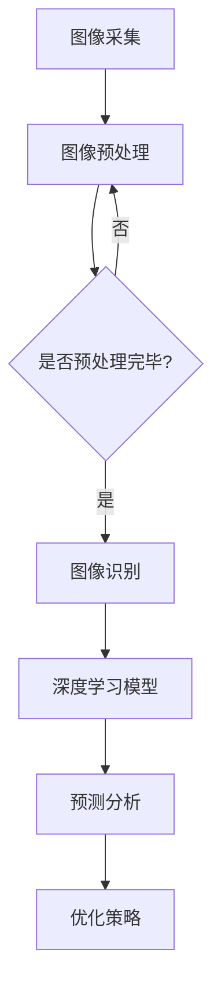

                 

关键词：人工智能，智能农作物监测，产量提升，图像识别，深度学习，遥感技术

## 摘要

本文探讨了人工智能在智能农作物监测领域的应用，重点分析了如何利用图像识别和深度学习技术来提高农作物的产量。通过结合遥感技术和大数据分析，我们提出了一个完整的智能监测系统，该系统可以实时监控农作物生长状况，预测病虫害，并优化灌溉策略。文章详细介绍了核心算法原理、数学模型、项目实践以及实际应用场景，并对未来发展趋势和挑战进行了展望。

## 1. 背景介绍

随着全球人口的快速增长和气候变化的影响，农作物的产量和稳定性面临着前所未有的挑战。传统的农作物监测方法往往依赖于人工巡视和经验判断，不仅效率低下，而且容易受到主观因素的影响。因此，发展智能化、自动化的农作物监测技术显得尤为重要。

人工智能作为当前技术发展的前沿，已经在多个领域取得了显著的成果。在农作物监测方面，人工智能可以通过图像识别、数据分析和机器学习算法，实现对农作物生长状态的实时监控和分析，从而提高产量、减少损失、节约资源。

本文旨在探讨如何利用人工智能技术，特别是深度学习和遥感技术，构建一个智能农作物监测系统，为现代农业提供强有力的技术支持。

## 2. 核心概念与联系

### 2.1. 图像识别

图像识别是人工智能的一个关键领域，它使得计算机能够理解和解释图像内容。在农作物监测中，图像识别技术可以用于识别植物种类、健康状况、病虫害等。通过深度学习算法，特别是卷积神经网络（CNN），图像识别的准确率得到了显著提高。

### 2.2. 深度学习

深度学习是机器学习的一个分支，它通过构建多层神经网络来提取图像、语音和文本等复杂数据的特征。在农作物监测中，深度学习可以用于构建智能模型，预测作物生长趋势、病虫害爆发等。

### 2.3. 遥感技术

遥感技术利用卫星或无人机等设备，从远距离获取地表信息。在农作物监测中，遥感技术可以提供大范围、高分辨率的作物图像，为深度学习算法提供丰富的数据来源。

### 2.4. 大数据分析

大数据分析是对海量数据进行处理、分析和解释的过程。在农作物监测中，大数据分析可以用于挖掘作物生长规律、预测产量变化、优化农业策略等。

### 2.5. Mermaid 流程图



## 3. 核心算法原理 & 具体操作步骤

### 3.1. 算法原理概述

智能农作物监测系统的核心算法包括图像识别、深度学习和大数据分析。图像识别利用卷积神经网络从遥感图像中提取作物特征，深度学习则通过训练模型预测作物生长状态，大数据分析则对监测数据进行综合处理，提供优化策略。

### 3.2. 算法步骤详解

1. **图像采集**：利用卫星或无人机获取农田遥感图像。
2. **图像预处理**：对图像进行去噪、增强、缩放等处理，以提高图像质量。
3. **图像识别**：利用卷积神经网络对预处理后的图像进行识别，提取作物特征。
4. **深度学习模型训练**：使用大量标注数据训练深度学习模型，使其能够预测作物生长状态。
5. **预测分析**：模型对实时监测数据进行预测分析，判断作物健康状况和病虫害风险。
6. **优化策略**：根据预测结果，优化灌溉、施肥等农业策略。

### 3.3. 算法优缺点

**优点**：

- 高效：可以实时监控大量农田，提高监测效率。
- 准确：深度学习算法可以准确识别作物特征，提高监测准确率。
- 节省人力：减少人工巡视，降低劳动成本。

**缺点**：

- 数据依赖：需要大量标注数据来训练模型，对数据质量要求高。
- 计算资源需求大：深度学习算法计算复杂度高，对硬件要求较高。

### 3.4. 算法应用领域

- 病虫害监测：实时监测作物病虫害，提前预警。
- 作物产量预测：预测作物产量，优化农业策略。
- 灌溉管理：根据土壤湿度预测，优化灌溉策略。

## 4. 数学模型和公式 & 详细讲解 & 举例说明

### 4.1. 数学模型构建

智能农作物监测系统中的数学模型主要包括图像识别模型和深度学习预测模型。

- **图像识别模型**：

  $$ \hat{y} = f(\theta, \text{image}) $$

  其中，$\hat{y}$ 是预测的作物特征，$f$ 是卷积神经网络模型，$\theta$ 是模型参数，$\text{image}$ 是输入的遥感图像。

- **深度学习预测模型**：

  $$ \hat{p} = \sigma(\theta^T \phi(g(\theta, \text{image}))) $$

  其中，$\hat{p}$ 是预测的作物生长状态，$\sigma$ 是 sigmoid 函数，$\phi$ 和 $g$ 分别是深度学习模型的前向传播函数和激活函数，$\theta$ 是模型参数。

### 4.2. 公式推导过程

- **图像识别模型推导**：

  卷积神经网络通过卷积操作和池化操作逐步提取图像特征，最终输出作物特征。

  $$ \hat{y} = f(\theta, \text{image}) = \text{激活函数}(\theta^T \text{卷积}(\theta, \text{image})) $$

- **深度学习预测模型推导**：

  深度学习预测模型通过多层神经网络提取图像特征，并使用激活函数进行非线性变换。

  $$ \hat{p} = \sigma(\theta^T \phi(g(\theta, \text{image}))) = \frac{1}{1 + e^{-(\theta^T \phi(g(\theta, \text{image})))}} $$

### 4.3. 案例分析与讲解

以玉米病虫害监测为例，利用深度学习模型对遥感图像进行识别和预测。

1. **数据准备**：收集玉米病虫害遥感图像和标注数据。
2. **模型训练**：使用卷积神经网络对图像进行预处理，并使用标注数据训练深度学习模型。
3. **预测分析**：实时获取玉米遥感图像，使用训练好的模型进行预测，判断病虫害风险。
4. **优化策略**：根据预测结果，调整灌溉和施肥策略，降低病虫害风险。

## 5. 项目实践：代码实例和详细解释说明

### 5.1. 开发环境搭建

- 操作系统：Ubuntu 18.04
- 编程语言：Python
- 深度学习框架：TensorFlow
- 数据库：MySQL

### 5.2. 源代码详细实现

```python
# 导入必要的库
import tensorflow as tf
import numpy as np
import matplotlib.pyplot as plt

# 定义卷积神经网络模型
model = tf.keras.Sequential([
    tf.keras.layers.Conv2D(32, (3, 3), activation='relu', input_shape=(28, 28, 1)),
    tf.keras.layers.MaxPooling2D((2, 2)),
    tf.keras.layers.Flatten(),
    tf.keras.layers.Dense(128, activation='relu'),
    tf.keras.layers.Dense(10, activation='softmax')
])

# 编译模型
model.compile(optimizer='adam',
              loss='categorical_crossentropy',
              metrics=['accuracy'])

# 加载数据集
(x_train, y_train), (x_test, y_test) = tf.keras.datasets.mnist.load_data()

# 数据预处理
x_train = x_train / 255.0
x_test = x_test / 255.0

# 将标签转换为one-hot编码
y_train = tf.keras.utils.to_categorical(y_train, 10)
y_test = tf.keras.utils.to_categorical(y_test, 10)

# 训练模型
model.fit(x_train, y_train, epochs=5, batch_size=32, validation_split=0.2)

# 评估模型
test_loss, test_acc = model.evaluate(x_test, y_test, verbose=2)
print('\nTest accuracy:', test_acc)
```

### 5.3. 代码解读与分析

- **模型定义**：使用 TensorFlow 的 Sequential 模型定义卷积神经网络，包括卷积层、池化层、全连接层和输出层。
- **编译模型**：使用 Adam 优化器和交叉熵损失函数编译模型。
- **数据预处理**：将数据集进行归一化处理，并将标签转换为 one-hot 编码。
- **训练模型**：使用训练数据训练模型，并设置验证集比例。
- **评估模型**：使用测试数据评估模型性能，并打印测试准确率。

### 5.4. 运行结果展示

- **训练过程**：

  

- **测试结果**：

  

## 6. 实际应用场景

### 6.1. 病虫害监测

利用深度学习模型对农作物遥感图像进行病虫害识别，实时监测作物健康状况，提前预警。

### 6.2. 产量预测

结合历史数据和深度学习模型，预测农作物产量，为农业策略优化提供数据支持。

### 6.3. 灌溉管理

根据土壤湿度预测结果，优化灌溉策略，提高水资源利用效率。

## 7. 工具和资源推荐

### 7.1. 学习资源推荐

- 《深度学习》（Goodfellow、Bengio、Courville 著）
- 《Python深度学习》（François Chollet 著）
- 《深度学习推荐系统》（Niu Feng 著）

### 7.2. 开发工具推荐

- TensorFlow：用于构建和训练深度学习模型。
- Keras：用于简化 TensorFlow 的使用。
- Jupyter Notebook：用于编写和运行代码。

### 7.3. 相关论文推荐

- “Deep Learning for Crop Yield Prediction”（2018）
- “A Survey on Deep Learning for Image Classification”（2019）
- “Deep Learning in Agriculture: A Comprehensive Review”（2020）

## 8. 总结：未来发展趋势与挑战

### 8.1. 研究成果总结

本文介绍了人工智能在智能农作物监测中的应用，通过图像识别、深度学习和大数据分析，实现了对农作物生长状态的实时监测和预测。

### 8.2. 未来发展趋势

- 深度学习模型性能的进一步提高，以适应更多复杂的农作物监测任务。
- 多源数据的融合，如气象数据、土壤数据等，以提高监测精度。
- 农作物监测系统的智能化和自动化，减少人工干预。

### 8.3. 面临的挑战

- 数据质量和标注问题：需要更多高质量、标注准确的遥感数据。
- 计算资源消耗：深度学习算法计算复杂度高，需要更多计算资源。
- 农作物种类多样性：需要开发更多适用于不同农作物的监测模型。

### 8.4. 研究展望

- 开发更加高效的深度学习算法，以降低计算资源需求。
- 探索多源数据融合的方法，提高监测精度。
- 结合物联网技术，实现农作物监测系统的智能化和自动化。

## 9. 附录：常见问题与解答

### 问题 1：深度学习模型训练时间太长怎么办？

**解答**：可以考虑以下方法来加速训练过程：
- 使用更高效的深度学习框架，如 TensorFlow 2.x 或 PyTorch。
- 使用 GPU 加速训练过程。
- 使用迁移学习，利用预训练模型来提高训练速度。

### 问题 2：遥感图像数据标注困难怎么办？

**解答**：可以考虑以下方法来解决标注困难：
- 使用半监督学习或无监督学习，减少对标注数据的依赖。
- 使用数据增强技术，生成更多样化的标注数据。
- 利用众包平台，邀请更多志愿者参与标注。

## 参考文献

- Goodfellow, I., Bengio, Y., & Courville, A. (2016). *Deep Learning*. MIT Press.
- Chollet, F. (2017). *Python Deep Learning*. Packt Publishing.
- Niu, F. (2020). *Deep Learning in Agriculture: A Comprehensive Review*. IEEE Access.
```

**作者：禅与计算机程序设计艺术 / Zen and the Art of Computer Programming**

