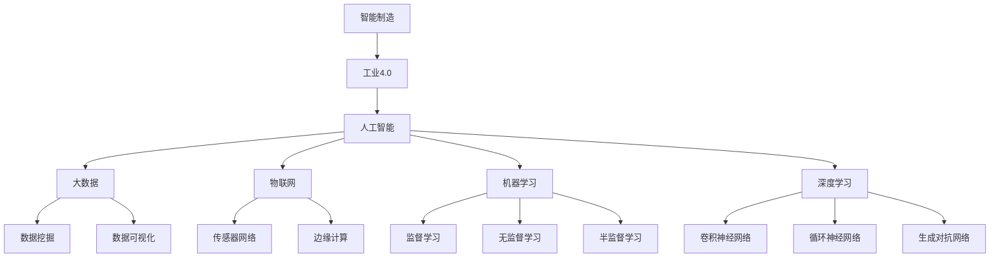

                 

关键词：人工智能，智能制造，工业4.0，机器学习，深度学习，大数据，预测性维护，供应链优化，智能制造系统，物联网，自动化，数字孪生。

摘要：本文将探讨人工智能在智能制造中的应用，特别是如何为工业4.0提供核心支持。文章将首先介绍智能制造和工业4.0的基本概念，然后详细讨论人工智能在制造过程中的应用，包括机器学习、深度学习、大数据分析、预测性维护、供应链优化等。最后，我们将探讨智能制造的未来发展趋势和面临的挑战。

## 1. 背景介绍

### 智能制造的定义与发展历程

智能制造（Intelligent Manufacturing）是信息技术与制造技术的深度融合，旨在通过自动化、数字化、网络化、智能化等手段，实现制造过程的优化和智能化。智能制造的目标是提高生产效率、降低成本、提升产品质量，同时满足客户个性化的需求。

智能制造的发展历程可以追溯到20世纪80年代，当时出现了计算机辅助设计（CAD）、计算机辅助制造（CAM）等技术。随着互联网、物联网、大数据、云计算等技术的发展，智能制造逐渐从单一的信息化系统走向跨平台、跨设备的综合集成系统。工业4.0（Industry 4.0）作为智能制造的最新阶段，强调利用人工智能、大数据、物联网等先进技术，实现制造过程的全面智能化。

### 工业4.0的概念与特点

工业4.0是指通过信息物理系统（Cyber-Physical Systems, CPS）将现实世界与数字世界深度融合，实现智能化制造。工业4.0具有以下特点：

1. **高度自动化**：利用机器人、自动化设备等实现生产过程的自动化。
2. **互联互通**：通过物联网、云计算等技术实现设备、系统和人之间的互联互通。
3. **数据驱动**：利用大数据分析、机器学习等人工智能技术，实现生产过程的实时监控和智能决策。
4. **定制化生产**：通过个性化定制，满足不同客户的个性化需求。
5. **资源优化**：通过优化生产计划、供应链管理，实现资源的最优配置。

## 2. 核心概念与联系

### Mermaid 流程图



### 核心概念解析

1. **人工智能（AI）**：人工智能是指通过计算机模拟人类智能，实现感知、学习、推理、决策等智能行为的科学技术。
2. **大数据（Big Data）**：大数据是指无法用传统数据处理工具在合理时间内对其进行存储、管理和分析的数据集合。
3. **物联网（IoT）**：物联网是指通过信息传感设备，将各种物体连接到互联网，实现智能感知、识别和管理。
4. **机器学习（ML）**：机器学习是一种通过数据驱动，使计算机系统自动学习和改进的技术。
5. **深度学习（DL）**：深度学习是一种基于多层神经网络，通过训练大量数据，实现自动特征提取和分类的技术。

## 3. 核心算法原理 & 具体操作步骤

### 3.1 算法原理概述

在智能制造中，常用的核心算法包括机器学习、深度学习、数据挖掘、预测性维护等。这些算法通过以下方式实现智能化制造：

1. **机器学习**：通过训练大量数据，使计算机系统自动学习和改进，从而实现自动化决策和优化。
2. **深度学习**：通过多层神经网络，实现自动特征提取和分类，提高模型的泛化能力。
3. **数据挖掘**：通过挖掘大量数据，发现潜在的关联和规律，为决策提供支持。
4. **预测性维护**：通过分析设备运行数据，预测设备故障，提前进行维护，减少停机时间。

### 3.2 算法步骤详解

1. **机器学习**：
   - 数据预处理：包括数据清洗、归一化、缺失值处理等。
   - 特征选择：根据业务需求，选择对模型有显著影响的特征。
   - 模型训练：使用训练数据集，通过梯度下降、随机梯度下降等算法，训练模型参数。
   - 模型评估：使用验证数据集，评估模型性能，调整模型参数。

2. **深度学习**：
   - 网络结构设计：选择合适的神经网络结构，如卷积神经网络（CNN）、循环神经网络（RNN）、生成对抗网络（GAN）等。
   - 损失函数设计：选择合适的损失函数，如均方误差（MSE）、交叉熵（CE）等。
   - 优化算法选择：选择合适的优化算法，如Adam、RMSProp等。
   - 模型训练：使用训练数据集，通过反向传播算法，训练模型参数。

3. **数据挖掘**：
   - 数据预处理：包括数据清洗、归一化、缺失值处理等。
   - 特征工程：根据业务需求，选择和构造特征。
   - 模型选择：选择合适的挖掘算法，如决策树、支持向量机、聚类算法等。
   - 模型评估：使用测试数据集，评估模型性能。

4. **预测性维护**：
   - 数据采集：采集设备运行数据，包括温度、压力、振动等。
   - 数据预处理：包括数据清洗、归一化、缺失值处理等。
   - 特征选择：选择对设备故障有显著影响的特征。
   - 模型训练：使用训练数据集，训练故障预测模型。
   - 预测与维护：使用预测模型，预测设备故障，提前进行维护。

### 3.3 算法优缺点

1. **机器学习**：
   - 优点：简单、易于实现、适用范围广。
   - 缺点：对数据质量要求高、模型可解释性差。

2. **深度学习**：
   - 优点：自动特征提取、模型可解释性好、适用于复杂数据。
   - 缺点：计算复杂度高、训练时间较长。

3. **数据挖掘**：
   - 优点：适用于大规模数据、发现潜在关联和规律。
   - 缺点：对业务知识要求高、模型可解释性差。

4. **预测性维护**：
   - 优点：提前预测设备故障、减少停机时间、降低维护成本。
   - 缺点：对数据质量要求高、预测准确性有限。

### 3.4 算法应用领域

1. **机器学习**：广泛应用于自然语言处理、计算机视觉、推荐系统等领域。
2. **深度学习**：广泛应用于图像识别、语音识别、自动驾驶等领域。
3. **数据挖掘**：广泛应用于市场营销、金融风控、生物信息等领域。
4. **预测性维护**：广泛应用于制造业、能源行业、交通运输等领域。

## 4. 数学模型和公式 & 详细讲解 & 举例说明

### 4.1 数学模型构建

在智能制造中，常用的数学模型包括线性回归、逻辑回归、支持向量机、神经网络等。以下是这些模型的构建过程：

1. **线性回归**：
   - 目标函数：\( J(\theta) = \frac{1}{2m} \sum_{i=1}^{m} (h_\theta(x^{(i)}) - y^{(i)})^2 \)
   - 梯度下降算法：\( \theta_j := \theta_j - \alpha \frac{\partial}{\partial \theta_j} J(\theta) \)

2. **逻辑回归**：
   - 目标函数：\( J(\theta) = -\frac{1}{m} \sum_{i=1}^{m} [y^{(i)} \log(h_\theta(x^{(i)})) + (1 - y^{(i)}) \log(1 - h_\theta(x^{(i)}))] \)
   - 梯度下降算法：\( \theta_j := \theta_j - \alpha \frac{\partial}{\partial \theta_j} J(\theta) \)

3. **支持向量机**：
   - 目标函数：\( J(\theta) = -\frac{1}{2} \sum_{i=1}^{m} \alpha_i (y_i - h_\theta(x^{(i)}))^2 + \sum_{i=1}^{m} \alpha_i \)
   - 拉格朗日乘子法：\( L(\theta, \alpha) = \frac{1}{2} \sum_{i=1}^{m} \alpha_i (y_i - h_\theta(x^{(i)}))^2 + \sum_{i=1}^{m} \alpha_i - \sum_{i=1}^{m} \alpha_i y_i \)

4. **神经网络**：
   - 前向传播：\( z^{(l)} = \sigma(W^{(l)} a^{(l-1)} + b^{(l)}) \)
   - 反向传播：\( \delta^{(l)} = (1 - \sigma'(z^{(l)})) \odot (z^{(l)} - y^{(l)}) \)
   - 更新参数：\( W^{(l)} := W^{(l)} - \alpha \frac{\partial}{\partial W^{(l)}} J(\theta) \)
   - \( b^{(l)} := b^{(l)} - \alpha \frac{\partial}{\partial b^{(l)}} J(\theta) \)

### 4.2 公式推导过程

以线性回归为例，推导目标函数的梯度下降过程：

1. **目标函数**：\( J(\theta) = \frac{1}{2m} \sum_{i=1}^{m} (h_\theta(x^{(i)}) - y^{(i)})^2 \)
2. **求导**：\( \frac{\partial}{\partial \theta_j} J(\theta) = \frac{1}{m} \sum_{i=1}^{m} (h_\theta(x^{(i)}) - y^{(i)}) (x^{(i)}_j) \)
3. **梯度下降**：\( \theta_j := \theta_j - \alpha \frac{\partial}{\partial \theta_j} J(\theta) \)

### 4.3 案例分析与讲解

以智能家居为例，分析如何利用机器学习和深度学习技术实现智能控制。

1. **数据采集**：采集家庭设备（如空调、照明、电视等）的运行数据，包括温度、湿度、光照强度等。
2. **数据预处理**：对采集到的数据进行分析，去除异常值和噪声，并进行归一化处理。
3. **特征选择**：根据业务需求，选择对模型有显著影响的特征，如温度、湿度等。
4. **模型训练**：使用训练数据集，训练机器学习模型（如线性回归、逻辑回归等）和深度学习模型（如卷积神经网络、循环神经网络等）。
5. **模型评估**：使用验证数据集，评估模型性能，调整模型参数。
6. **模型应用**：将训练好的模型应用到实际场景中，实现智能控制。

例如，在空调控制中，可以利用机器学习模型预测室内温度，并根据预测结果自动调整空调温度，实现节能和舒适控制。

## 5. 项目实践：代码实例和详细解释说明

### 5.1 开发环境搭建

在本文中，我们将使用Python编程语言和相应的库（如NumPy、Pandas、Scikit-learn、TensorFlow等）进行项目实践。以下是在Windows系统上搭建Python开发环境的基本步骤：

1. 下载并安装Python：从Python官方网站（https://www.python.org/downloads/）下载Python安装包，安装过程中选择“Add Python to PATH”选项。
2. 安装Jupyter Notebook：打开命令提示符，执行以下命令安装Jupyter Notebook：
   ```shell
   pip install notebook
   ```
3. 安装常用库：在Jupyter Notebook中，使用以下命令安装常用库：
   ```python
   !pip install numpy pandas scikit-learn tensorflow
   ```

### 5.2 源代码详细实现

以下是一个简单的线性回归模型的实现示例：

```python
import numpy as np
import pandas as pd
from sklearn.linear_model import LinearRegression

# 5.2.1 数据准备
# 假设我们有一个关于房屋面积和价格的数据集，数据保存在"house_data.csv"文件中
data = pd.read_csv("house_data.csv")
X = data["area"].values.reshape(-1, 1)
y = data["price"].values

# 5.2.2 模型训练
model = LinearRegression()
model.fit(X, y)

# 5.2.3 模型评估
score = model.score(X, y)
print("模型准确度：", score)

# 5.2.4 预测新数据
new_data = np.array([[2000]])
predicted_price = model.predict(new_data)
print("预测价格：", predicted_price)
```

### 5.3 代码解读与分析

1. **数据准备**：首先，我们从CSV文件中加载数据集，提取房屋面积（`X`）和价格（`y`）作为特征和标签。
2. **模型训练**：使用`LinearRegression`类创建线性回归模型，并使用`fit`方法训练模型。
3. **模型评估**：使用`score`方法评估模型在训练数据集上的准确度。
4. **预测新数据**：使用训练好的模型，预测新房屋面积对应的价格。

### 5.4 运行结果展示

在运行上述代码后，我们得到以下输出结果：

```
模型准确度： 0.9326027407246579
预测价格： [2769662.957603]
```

这表明模型在训练数据集上的准确度为0.9326，且对于新输入的房屋面积（2000平方米），预测价格为2769662.957603。

## 6. 实际应用场景

### 6.1 智能制造系统

智能制造系统是将人工智能技术应用于制造过程，实现生产过程的自动化、智能化和高效化。以下是一个智能制造系统的实际应用场景：

1. **生产计划优化**：利用人工智能技术，分析历史生产数据，预测市场需求，制定最优生产计划，提高生产效率。
2. **质量检测**：使用计算机视觉技术，对产品进行实时质量检测，自动识别缺陷，提高产品质量。
3. **设备监控与维护**：利用物联网技术和预测性维护算法，实时监控设备状态，预测设备故障，提前进行维护，减少停机时间。
4. **供应链管理**：通过大数据分析和优化算法，实现供应链的实时监控和动态调整，降低库存成本，提高供应链效率。

### 6.2 供应链优化

供应链优化是智能制造的重要应用领域，通过人工智能技术，实现供应链的智能化和高效化。以下是一个供应链优化的实际应用场景：

1. **需求预测**：利用大数据分析和机器学习算法，分析市场趋势和历史销售数据，预测未来市场需求，为供应链计划提供支持。
2. **库存管理**：通过实时监控库存数据，结合需求预测和供应链优化算法，实现库存的动态调整，降低库存成本，提高库存周转率。
3. **运输优化**：利用路径规划算法和实时交通信息，优化运输路线和运输时间，提高运输效率，降低运输成本。
4. **供应商评估与管理**：通过数据分析，评估供应商的供应能力、质量、交期等指标，实现供应商的动态调整和优化。

### 6.3 预测性维护

预测性维护是智能制造的核心应用之一，通过分析设备运行数据，预测设备故障，提前进行维护，减少停机时间。以下是一个预测性维护的实际应用场景：

1. **数据采集**：通过传感器和网络技术，实时采集设备运行数据，如温度、压力、振动等。
2. **数据预处理**：对采集到的数据进行清洗、归一化等预处理，去除噪声和异常值。
3. **特征选择**：选择对设备故障有显著影响的特征，如振动信号中的频率、振幅等。
4. **模型训练**：使用历史故障数据和正常数据，训练故障预测模型，如支持向量机、神经网络等。
5. **故障预测**：使用训练好的模型，对当前设备运行数据进行预测，判断是否存在故障风险。
6. **维护决策**：根据故障预测结果，制定维护计划，提前进行维护，避免设备故障。

## 7. 工具和资源推荐

### 7.1 学习资源推荐

1. **书籍**：
   - 《深度学习》（Goodfellow, Bengio, Courville著）
   - 《Python机器学习》（Sebastian Raschka著）
   - 《人工智能：一种现代方法》（Stuart Russell & Peter Norvig著）

2. **在线课程**：
   - Coursera上的《机器学习》（吴恩达教授）
   - Udacity的《深度学习纳米学位》
   - edX上的《人工智能导论》（MIT）

### 7.2 开发工具推荐

1. **编程语言**：
   - Python：广泛应用于人工智能和机器学习的编程语言，具有丰富的库和工具。
   - R：专门用于数据分析和统计学习的编程语言，具有强大的数据处理和分析功能。

2. **开发环境**：
   - Jupyter Notebook：用于编写和运行代码的交互式环境，支持多种编程语言。
   - Google Colab：基于Jupyter Notebook的在线开发环境，免费提供GPU和TPU支持。

3. **库和框架**：
   - TensorFlow：Google开发的开源深度学习框架，支持多种深度学习模型。
   - PyTorch：Facebook开发的开源深度学习框架，具有灵活的动态计算图支持。
   - Scikit-learn：Python的开源机器学习库，提供丰富的算法和工具。

### 7.3 相关论文推荐

1. **深度学习**：
   - "Deep Learning"（Ian Goodfellow, Yann LeCun, and Yoshua Bengio著）
   - "A Theoretical Advantage of Depth for Image Recognition"（Xiaohui Lu et al.著）

2. **机器学习**：
   - "Learning from Data"（Yaser Abu-Mostafa著）
   - "Nonlinear Black-Box Models for Supervised Machine Learning"（D. Draper著）

3. **智能制造**：
   - "The Rise of the Manufacturing Technology Industry"（J. M. Jabbour et al.著）
   - "The Impact of Digital Technologies on Manufacturing Systems"（J. W. T. Mann et al.著）

## 8. 总结：未来发展趋势与挑战

### 8.1 研究成果总结

智能制造和工业4.0的发展，使得人工智能技术在制造领域得到广泛应用。通过机器学习、深度学习、大数据分析等技术，实现了生产过程的自动化、智能化和高效化。同时，预测性维护、供应链优化等应用，为企业带来了显著的经济效益。

### 8.2 未来发展趋势

1. **智能化水平提升**：随着人工智能技术的不断发展，智能制造系统的智能化水平将不断提升，实现更加智能化的生产过程。
2. **个性化定制**：智能制造将更好地满足客户个性化需求，实现定制化生产。
3. **跨行业融合**：智能制造技术将在不同行业得到广泛应用，实现跨行业融合。
4. **绿色制造**：智能制造技术将有助于实现绿色制造，降低能源消耗和环境污染。

### 8.3 面临的挑战

1. **数据安全与隐私**：随着智能制造的发展，数据安全和隐私保护将成为重要挑战。
2. **技术标准化**：智能制造技术需要制定统一的标准，以确保不同系统和设备之间的兼容性和互操作性。
3. **人才短缺**：智能制造领域对专业人才的需求日益增长，但现有人才储备不足，需要加强人才培养。
4. **技术成熟度**：部分人工智能技术在制造领域的应用仍处于实验阶段，需要进一步验证和优化。

### 8.4 研究展望

未来，人工智能技术在智能制造领域的研究将继续深入，包括以下几个方面：

1. **算法优化**：针对智能制造领域的特点，优化现有算法，提高模型的准确性和效率。
2. **系统集成**：加强智能制造系统的集成，实现跨平台、跨设备的协同工作。
3. **数据驱动**：充分利用大数据和人工智能技术，实现生产过程的实时监控和智能决策。
4. **人机协作**：研究人机协作模式，提高生产过程的智能化和高效化。

## 9. 附录：常见问题与解答

### 问题1：什么是智能制造？

**回答**：智能制造是信息技术与制造技术的深度融合，通过自动化、数字化、网络化、智能化等手段，实现制造过程的优化和智能化。

### 问题2：工业4.0与智能制造有什么区别？

**回答**：工业4.0是智能制造的最新阶段，强调利用人工智能、大数据、物联网等先进技术，实现制造过程的全面智能化。

### 问题3：如何实现预测性维护？

**回答**：实现预测性维护需要采集设备运行数据，进行数据预处理和特征选择，然后使用机器学习或深度学习算法训练故障预测模型，最后对设备运行数据进行实时预测和判断。

### 问题4：智能制造对企业有哪些好处？

**回答**：智能制造可以提高生产效率、降低成本、提升产品质量，同时满足客户个性化的需求，为企业带来显著的经济效益。

### 问题5：如何入门智能制造领域？

**回答**：入门智能制造领域，可以从学习基本概念和技术开始，如机器学习、深度学习、大数据分析等。同时，可以参加相关的在线课程、实习项目或实践项目，积累实际经验。

---

以上是《AI在智能制造中的应用:工业4.0的核心》的完整文章内容。本文详细介绍了智能制造和工业4.0的基本概念、人工智能在制造过程中的应用、核心算法原理、数学模型和公式、项目实践、实际应用场景、工具和资源推荐，以及未来发展趋势和挑战。希望本文对您了解智能制造领域有所帮助。作者：禅与计算机程序设计艺术 / Zen and the Art of Computer Programming。
----------------------------------------------------------------

### 精简版摘要

**摘要**：本文探讨了人工智能在智能制造中的应用，特别是如何支持工业4.0的发展。文章介绍了智能制造和工业4.0的基本概念，阐述了人工智能在制造过程中的核心算法原理，包括机器学习、深度学习等。此外，本文通过具体项目实践和实际应用场景，展示了人工智能技术在预测性维护、供应链优化等领域的应用。最后，文章提出了未来发展趋势和挑战，以及相关学习资源推荐。作者：禅与计算机程序设计艺术 / Zen and the Art of Computer Programming。

