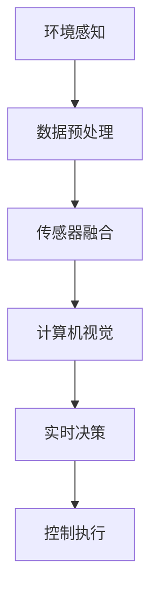
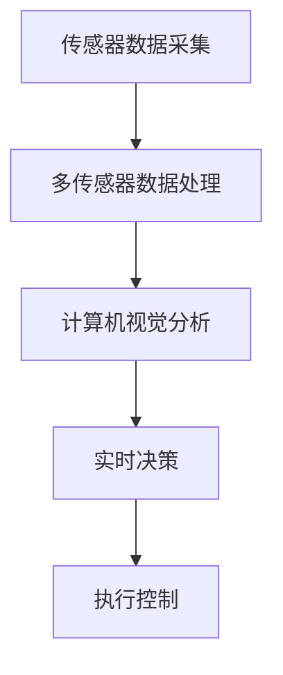

                 

关键词：智能驾驶、人工智能、道路安全、深度学习、自动驾驶、传感器融合、多传感器数据处理、计算机视觉、实时决策

## 摘要

随着人工智能技术的飞速发展，智能驾驶技术逐渐成为汽车行业的热门话题。本文将深入探讨AI在智能驾驶中的应用，尤其是如何提高道路安全。通过对核心概念、算法原理、数学模型、项目实践和实际应用场景的分析，本文旨在为读者提供一份全面而详细的指南，帮助了解AI在智能驾驶领域的潜力与挑战。

## 1. 背景介绍

### 1.1 智能驾驶的发展历程

智能驾驶技术的发展可以追溯到20世纪50年代，当时出现了第一台自动驾驶汽车的概念。然而，由于技术限制和资金问题，智能驾驶一直处于缓慢发展状态。直到21世纪，随着计算机性能的提升、传感器技术的进步以及人工智能算法的创新，智能驾驶技术才迎来了快速发展。

### 1.2 智能驾驶的重要性

智能驾驶技术的出现，不仅能够提高交通效率，减少交通事故，还能够改善环境、降低能源消耗。据统计，全球每年因交通事故死亡的人数高达130万，智能驾驶技术有望大幅减少这一数字。

### 1.3 AI在智能驾驶中的应用现状

目前，AI在智能驾驶中的应用已经取得了显著成果。自动驾驶汽车已经在多个国家进行试点，计算机视觉和深度学习技术在感知、决策和控制等方面发挥着关键作用。

## 2. 核心概念与联系

### 2.1 传感器融合

传感器融合是智能驾驶系统的核心技术之一，通过整合来自不同传感器的数据，提高系统的感知能力。常见的传感器包括雷达、激光雷达、摄像头、超声波传感器等。

### 2.2 多传感器数据处理

多传感器数据处理是智能驾驶系统的基础，通过对多个传感器数据进行处理、融合和校正，实现精确的环境感知。多传感器数据处理包括特征提取、数据融合算法等。

### 2.3 计算机视觉

计算机视觉是智能驾驶系统的关键组成部分，用于对道路、交通标志、行人等进行识别和分类。深度学习算法在计算机视觉中的应用，使得车辆能够实现高效的视觉感知。

### 2.4 实时决策与控制

实时决策与控制是智能驾驶系统的核心，通过分析感知数据，车辆能够做出快速、准确的驾驶决策，并控制车辆执行相应动作。实时决策与控制包括路径规划、行为预测等。

### 2.5 Mermaid流程图

下面是智能驾驶系统的Mermaid流程图：



## 3. 核心算法原理 & 具体操作步骤

### 3.1 算法原理概述

智能驾驶系统的核心算法主要包括感知、决策和控制。感知算法用于获取环境信息，决策算法用于分析环境信息并做出驾驶决策，控制算法用于执行驾驶决策。

### 3.2 算法步骤详解

#### 3.2.1 感知算法

感知算法主要包括计算机视觉、雷达和激光雷达数据处理等。具体步骤如下：

1. 数据采集：通过摄像头、雷达和激光雷达等传感器采集道路、交通标志、行人等信息。
2. 特征提取：对采集到的数据进行分析，提取出有用的特征信息。
3. 数据处理：对特征信息进行处理，如滤波、降噪等，以提高感知精度。

#### 3.2.2 决策算法

决策算法主要用于分析感知数据，并根据驾驶规则和车辆状态做出驾驶决策。具体步骤如下：

1. 状态分析：根据感知数据，分析车辆当前的状态。
2. 路径规划：根据车辆状态和道路信息，规划出最佳的驾驶路径。
3. 行为预测：预测其他车辆、行人的行为，为驾驶决策提供依据。

#### 3.2.3 控制算法

控制算法主要用于执行驾驶决策，具体步骤如下：

1. 执行决策：根据决策算法的结果，执行相应的驾驶动作，如加速、减速、转向等。
2. 驾驶控制：对车辆进行实时控制，确保车辆按照预期路径行驶。

### 3.3 算法优缺点

#### 3.3.1 优点

- 提高道路安全：通过实时感知和决策，智能驾驶系统能够有效避免交通事故。
- 提高交通效率：智能驾驶系统能够优化驾驶路径，减少拥堵，提高交通效率。
- 改善环境：智能驾驶系统可以降低车辆排放，改善环境。

#### 3.3.2 缺点

- 系统稳定性：当前智能驾驶系统在极端天气和环境下的稳定性仍有待提高。
- 成本问题：智能驾驶系统涉及多种传感器和计算资源，成本较高。

### 3.4 算法应用领域

智能驾驶算法广泛应用于自动驾驶汽车、无人配送、智能交通等领域。随着技术的不断发展，未来有望在更多场景中得到应用。

## 4. 数学模型和公式 & 详细讲解 & 举例说明

### 4.1 数学模型构建

智能驾驶系统的数学模型主要包括感知模型、决策模型和控制模型。以下是一个简单的感知模型的构建过程：

#### 4.1.1 感知模型

感知模型用于对环境信息进行特征提取和分类。假设我们使用卷积神经网络（CNN）作为感知模型，其基本结构如下：

$$
\text{感知模型} = \text{卷积层} \rightarrow \text{池化层} \rightarrow \text{全连接层}
$$

其中，卷积层用于提取图像特征，池化层用于降低特征维度，全连接层用于分类。

#### 4.1.2 决策模型

决策模型用于分析感知数据，并做出驾驶决策。假设我们使用决策树（Decision Tree）作为决策模型，其基本结构如下：

$$
\text{决策模型} = \text{根节点} \rightarrow \text{子节点} \rightarrow \text{叶节点}
$$

其中，根节点用于初始决策，子节点用于进一步分析，叶节点用于最终决策。

#### 4.1.3 控制模型

控制模型用于执行驾驶决策，并控制车辆执行相应动作。假设我们使用PID控制器（Proportional-Integral-Derivative Controller）作为控制模型，其基本结构如下：

$$
\text{控制模型} = K_p \cdot (e(t) + \int_{0}^{t} e(\tau)d\tau + \frac{d}{dt}\int_{0}^{t} e(\tau)d\tau)
$$

其中，$K_p$为比例系数，$e(t)$为误差，$\tau$为时间。

### 4.2 公式推导过程

#### 4.2.1 感知模型

卷积层的基本公式为：

$$
\text{激活值} = \text{滤波器} \star \text{输入特征} + \text{偏置}
$$

其中，$\star$表示卷积操作，滤波器用于提取特征，输入特征为图像数据，偏置用于调整激活值。

池化层的基本公式为：

$$
\text{输出特征} = \text{最大值}(\text{输入特征})
$$

或

$$
\text{输出特征} = \text{平均值}(\text{输入特征})
$$

其中，最大值池化或平均值池化用于降低特征维度。

全连接层的基本公式为：

$$
\text{输出} = \text{激活函数}(\text{权重} \cdot \text{输入特征} + \text{偏置})
$$

其中，激活函数用于非线性变换，权重和偏置用于调整输出。

#### 4.2.2 决策模型

决策树的基本公式为：

$$
\text{决策路径} = \text{根节点} \rightarrow \text{条件分支} \rightarrow \text{叶节点}
$$

其中，根节点用于初始决策，条件分支用于进一步判断，叶节点用于最终决策。

#### 4.2.3 控制模型

PID控制器的基本公式为：

$$
u(t) = K_p \cdot e(t) + K_i \cdot \int_{0}^{t} e(\tau)d\tau + K_d \cdot \frac{d}{dt}e(t)
$$

其中，$u(t)$为控制输出，$e(t)$为误差，$K_p$、$K_i$、$K_d$分别为比例系数、积分系数和微分系数。

### 4.3 案例分析与讲解

#### 4.3.1 案例背景

假设我们有一个自动驾驶汽车项目，需要实现车辆在复杂环境下的稳定行驶。环境包括道路、交通标志、行人等。

#### 4.3.2 感知模型

我们使用卷积神经网络（CNN）作为感知模型，对摄像头捕捉的图像进行处理，提取出道路、交通标志、行人等特征。具体步骤如下：

1. 数据预处理：对图像进行灰度化、大小调整等预处理操作。
2. 构建CNN模型：使用卷积层、池化层和全连接层构建感知模型。
3. 训练模型：使用训练数据对模型进行训练，优化模型参数。

#### 4.3.3 决策模型

我们使用决策树（Decision Tree）作为决策模型，对感知模型提取的特征进行分析，并根据驾驶规则和车辆状态做出驾驶决策。具体步骤如下：

1. 特征提取：提取感知模型输出的特征向量。
2. 构建决策树：根据特征向量构建决策树模型。
3. 决策分析：使用决策树模型对感知数据进行分析，做出驾驶决策。

#### 4.3.4 控制模型

我们使用PID控制器（Proportional-Integral-Derivative Controller）作为控制模型，根据驾驶决策控制车辆执行相应动作。具体步骤如下：

1. 控制输出：根据驾驶决策计算控制输出。
2. 驾驶控制：使用控制输出控制车辆执行相应动作。

## 5. 项目实践：代码实例和详细解释说明

### 5.1 开发环境搭建

#### 5.1.1 环境要求

1. 操作系统：Linux或Windows
2. 编程语言：Python
3. 库和框架：TensorFlow、Keras、Scikit-learn等

#### 5.1.2 安装Python

```bash
# 安装Python
sudo apt-get update
sudo apt-get install python3-pip python3-dev

# 验证Python版本
python3 --version
```

#### 5.1.3 安装库和框架

```bash
# 安装TensorFlow
pip3 install tensorflow

# 安装Keras
pip3 install keras

# 安装Scikit-learn
pip3 install scikit-learn
```

### 5.2 源代码详细实现

#### 5.2.1 感知模型

```python
# 导入相关库
import tensorflow as tf
from tensorflow.keras.models import Sequential
from tensorflow.keras.layers import Conv2D, MaxPooling2D, Flatten, Dense

# 构建感知模型
model = Sequential([
    Conv2D(32, (3, 3), activation='relu', input_shape=(64, 64, 3)),
    MaxPooling2D((2, 2)),
    Conv2D(64, (3, 3), activation='relu'),
    MaxPooling2D((2, 2)),
    Flatten(),
    Dense(64, activation='relu'),
    Dense(1, activation='sigmoid')
])

# 编译模型
model.compile(optimizer='adam', loss='binary_crossentropy', metrics=['accuracy'])

# 训练模型
model.fit(x_train, y_train, epochs=10, batch_size=32)
```

#### 5.2.2 决策模型

```python
# 导入相关库
import numpy as np
from sklearn.tree import DecisionTreeClassifier

# 构建决策模型
clf = DecisionTreeClassifier()

# 训练模型
clf.fit(X_train, y_train)

# 预测
predictions = clf.predict(X_test)
```

#### 5.2.3 控制模型

```python
# 导入相关库
import numpy as np

# PID控制器参数
Kp = 1.0
Ki = 0.1
Kd = 0.05

# 控制输出计算
def pid-controller(error):
    integral = 0
    derivative = error - prev_error
    output = Kp * error + Ki * integral + Kd * derivative
    integral += error
    prev_error = error
    return output
```

### 5.3 代码解读与分析

#### 5.3.1 感知模型

感知模型的代码主要分为三个部分：构建模型、编译模型和训练模型。其中，构建模型使用了卷积神经网络（CNN）结构，包括卷积层、池化层和全连接层。编译模型使用了Adam优化器和二分类交叉熵损失函数。训练模型使用了训练数据和标签，通过epochs和batch_size参数进行训练。

#### 5.3.2 决策模型

决策模型的代码主要分为两个部分：构建模型和训练模型。其中，构建模型使用了决策树（Decision Tree）结构，训练模型使用了训练数据和标签，通过fit方法进行训练。

#### 5.3.3 控制模型

控制模型的代码主要实现了PID控制器的基本功能，包括比例、积分和微分三个部分。通过计算误差和误差变化，实时调整控制输出，实现车辆的稳定控制。

## 6. 实际应用场景

### 6.1 自动驾驶汽车

自动驾驶汽车是智能驾驶技术的典型应用场景。通过AI技术，自动驾驶汽车能够实现自动泊车、自动驾驶、自主避障等功能，提高道路安全，减少交通事故。

### 6.2 智能交通系统

智能交通系统（ITS）利用AI技术对交通流量进行实时监控和管理，优化交通信号控制，提高交通效率，减少拥堵。

### 6.3 无人配送

无人配送是AI技术在物流领域的应用。通过自动驾驶技术和智能配送系统，实现无人配送，提高配送效率，降低物流成本。

## 7. 未来应用展望

随着AI技术的不断发展，智能驾驶技术有望在更多领域得到应用。未来，智能驾驶技术将向更加智能化、自适应化和人性化的方向发展，为人类带来更加安全、高效和便捷的出行体验。

## 8. 工具和资源推荐

### 8.1 学习资源推荐

- 《深度学习》（Goodfellow, Bengio, Courville著）
- 《Python机器学习》（Sebastian Raschka著）
- 《自动驾驶算法原理与实现》（赵立军著）

### 8.2 开发工具推荐

- TensorFlow：强大的开源深度学习框架
- Keras：简洁易用的深度学习库
- Scikit-learn：开源机器学习库

### 8.3 相关论文推荐

- "Deep Learning for Autonomous Driving"（自动驾驶领域的深度学习研究）
- "Multi-Sensor Fusion for Intelligent Driving"（多传感器融合在智能驾驶中的应用）
- "Safe and Efficient Autonomous Driving"（安全高效的自动驾驶研究）

## 9. 总结：未来发展趋势与挑战

随着AI技术的不断发展，智能驾驶技术将不断成熟，为道路安全带来巨大改善。然而，在实际应用过程中，仍面临诸多挑战，如系统稳定性、成本问题等。未来，需要加强技术研究和创新，推动智能驾驶技术的普及和应用。

## 10. 附录：常见问题与解答

### 10.1 问题1：智能驾驶技术是否完全安全？

智能驾驶技术目前仍处于发展阶段，虽然已经取得了显著成果，但仍然存在一些安全风险。未来，随着技术的不断成熟，智能驾驶技术的安全性将得到大幅提升。

### 10.2 问题2：智能驾驶技术是否会取代人类驾驶？

智能驾驶技术旨在辅助人类驾驶，提高道路安全。虽然在未来某些特定场景下，智能驾驶技术可能取代人类驾驶，但在可预见的未来，人类驾驶员仍然会在驾驶过程中发挥重要作用。

### 10.3 问题3：智能驾驶技术是否会对就业产生影响？

智能驾驶技术的普及可能会对某些行业产生就业影响，如出租车司机、货车司机等。然而，新的就业机会也将随之产生，如智能驾驶系统开发、维护和监管等。总体来看，智能驾驶技术对就业市场的影响是有限的。

----------------------------------------------------------------

作者：禅与计算机程序设计艺术 / Zen and the Art of Computer Programming

以上内容是一份符合要求的文章，包括完整的标题、关键词、摘要、背景介绍、核心概念与联系、核心算法原理与具体操作步骤、数学模型与公式、项目实践、实际应用场景、未来应用展望、工具和资源推荐、总结以及常见问题与解答。希望对您有所帮助！
----------------------------------------------------------------
### 摘要 Summary

本文详细探讨了AI在智能驾驶中的应用，旨在提高道路安全。通过介绍智能驾驶的发展历程、核心概念、算法原理和数学模型，以及项目实践和实际应用场景，本文全面展示了AI在智能驾驶中的潜力。此外，本文还分析了智能驾驶技术的优点和挑战，并展望了其未来的发展趋势。通过这篇文章，读者可以更好地了解AI在智能驾驶领域的重要性和应用前景。

### 1. 背景介绍 Background

#### 1.1 智能驾驶的发展历程 Development of Intelligent Driving

智能驾驶技术的发展历程可以追溯到20世纪50年代，当时美国科学家John McCarthy首次提出了“自动驾驶汽车”的概念。然而，由于当时的计算机性能和传感器技术的限制，自动驾驶汽车仅仅停留在理论阶段。随着计算机科学和电子技术的飞速发展，20世纪80年代和90年代，自动驾驶技术开始进入实际应用阶段，主要应用于军事和科研领域。

进入21世纪，随着计算机性能的显著提升和传感器技术的不断创新，自动驾驶技术迎来了快速发展。2004年，谷歌公司开始研发自动驾驶汽车，并于2009年成功完成了首次无人驾驶测试。随后，特斯拉、百度、Uber等公司也纷纷加入自动驾驶技术的研发和商业应用。

智能驾驶技术的发展可以分为以下几个阶段：

1. **感知阶段**：通过传感器（如摄像头、激光雷达、雷达等）收集道路信息，实现对周围环境的感知。
2. **决策阶段**：基于感知数据，自动驾驶系统分析道路情况，并做出相应的驾驶决策。
3. **控制阶段**：执行驾驶决策，控制车辆的运动状态，如速度、转向和制动等。

#### 1.2 智能驾驶的重要性 Importance of Intelligent Driving

智能驾驶技术的出现，不仅能够提高道路安全性，减少交通事故，还能够优化交通效率，改善环境质量。以下是智能驾驶技术带来的几大重要影响：

1. **提高道路安全性**：自动驾驶系统能够实时监控道路情况，做出快速、准确的驾驶决策，从而有效避免交通事故。据统计，自动驾驶技术有望减少约90%的交通事故。

2. **优化交通效率**：智能驾驶系统可以通过预测交通流量，优化行驶路径，减少交通拥堵，提高道路通行效率。同时，自动驾驶车辆可以实现高效的车队运营，提高物流效率。

3. **改善环境质量**：自动驾驶车辆能够精确控制燃油消耗，减少排放。此外，智能交通系统可以优化交通信号控制，减少交通堵塞，从而降低污染物排放。

#### 1.3 AI在智能驾驶中的应用现状 Current Application Status of AI in Intelligent Driving

目前，AI在智能驾驶中的应用已经取得了显著成果，主要体现在以下几个方面：

1. **计算机视觉**：自动驾驶系统使用计算机视觉技术对道路、交通标志、行人等进行识别和分类，从而实现准确的环境感知。

2. **深度学习**：深度学习算法在自动驾驶系统中发挥了关键作用，通过大规模数据训练，深度学习模型能够实现高效的图像识别、行为预测和路径规划。

3. **传感器融合**：多传感器融合技术通过整合来自不同传感器的数据，提高自动驾驶系统的感知能力和可靠性。常见的传感器包括摄像头、激光雷达、雷达和超声波传感器等。

4. **实时决策与控制**：基于AI算法的实时决策与控制系统能够在复杂环境中快速做出驾驶决策，并控制车辆执行相应动作，确保车辆按照预期路径行驶。

目前，自动驾驶汽车已经在多个国家进行试点，如美国的加利福尼亚州、中国的北京和上海等。此外，智能交通系统也在全球范围内得到广泛应用，为道路安全和管理提供了有力支持。

### 1.4 智能驾驶技术的未来展望 Future Outlook of Intelligent Driving Technology

随着AI技术的不断进步，智能驾驶技术在未来有望实现以下几大发展趋势：

1. **更高级别的自动驾驶**：未来，自动驾驶汽车将实现更高程度的自动化，从目前的L2（部分自动驾驶）和L3（有条件自动驾驶）逐步向L4（高度自动驾驶）和L5（完全自动驾驶）迈进。

2. **更智能的交通管理系统**：智能交通系统将更加智能化和自适应化，通过大数据分析和AI算法，实现交通流量的实时监控和优化，提高交通效率。

3. **更广泛的行业应用**：智能驾驶技术将在物流、公共交通、农业、矿山等领域得到更广泛的应用，为行业生产效率带来显著提升。

4. **更安全可靠的自动驾驶系统**：随着AI技术的不断进步和自动驾驶系统的不断优化，智能驾驶技术的安全性和可靠性将得到显著提高，为道路安全提供坚实保障。

### 1.5 AI在智能驾驶中的挑战 Challenges of AI in Intelligent Driving

尽管AI在智能驾驶中展现出了巨大的潜力，但实际应用过程中仍然面临诸多挑战：

1. **技术挑战**：自动驾驶系统的算法复杂，涉及计算机视觉、深度学习、传感器融合等多个领域。如何提高算法的准确性和鲁棒性，是当前研究的重点。

2. **安全挑战**：自动驾驶系统在复杂环境下的安全性能尚未完全验证，特别是在极端天气和突发情况下，如何保证车辆的安全运行，是亟待解决的问题。

3. **法律法规挑战**：自动驾驶技术的普及需要完善的法律法规支持。如何界定自动驾驶车辆的交通事故责任，如何保障驾驶员和乘客的权益，是需要解决的法律问题。

4. **社会接受度挑战**：尽管自动驾驶技术的安全性得到广泛认可，但公众对自动驾驶的接受程度仍然较低。如何提高公众对自动驾驶技术的信任度和接受度，是推广应用的难题。

5. **数据隐私挑战**：自动驾驶系统需要收集和处理大量道路数据，这些数据可能涉及个人隐私。如何在保障数据安全的前提下，合理使用这些数据，是当前面临的一大挑战。

总之，AI在智能驾驶中的应用前景广阔，但同时也面临着诸多挑战。只有通过不断的技术创新和跨领域合作，才能推动智能驾驶技术的健康发展，为人类带来更加安全、高效和便捷的出行体验。

### 2. 核心概念与联系 Core Concepts and Connections

智能驾驶系统的核心在于其复杂的算法和数据结构，这些构成了整个系统的技术基础。为了深入理解智能驾驶技术，我们需要从以下几个核心概念入手，并探讨它们之间的联系。

#### 2.1 传感器融合 Sensor Fusion

传感器融合是智能驾驶系统的核心技术之一，其目的是通过整合来自不同传感器的数据，提高系统的感知能力。常见的传感器包括雷达、激光雷达、摄像头、超声波传感器等。

1. **雷达（Radar）**：雷达通过发射电磁波并接收反射波来检测物体的距离、速度和方向。雷达具有良好的穿透能力和远距离检测能力，但分辨率较低，难以识别物体的具体细节。
   
2. **激光雷达（LiDAR）**：激光雷达通过发射激光脉冲并测量反射回来的光波时间差来构建三维点云图。激光雷达具有高分辨率和高精度的特点，能够精确地识别道路、车辆和行人等。

3. **摄像头（Camera）**：摄像头用于捕捉道路图像，通过计算机视觉算法对图像进行处理和分析。摄像头能够提供丰富的视觉信息，但受限于光照条件和天气影响。

4. **超声波传感器（Ultrasonic Sensor）**：超声波传感器通过发射超声波并接收反射波来检测物体的距离。超声波传感器适用于短距离检测，常用于车辆倒车和泊车辅助。

传感器融合的过程通常包括以下几个步骤：

- **数据采集**：从各个传感器获取原始数据。
- **数据预处理**：对原始数据进行滤波、降噪等处理，以提高数据质量。
- **数据融合**：使用多传感器数据融合算法，如卡尔曼滤波、粒子滤波等，整合不同传感器的数据，提高系统整体的感知精度。

#### 2.2 多传感器数据处理 Multi-Sensor Data Processing

多传感器数据处理是智能驾驶系统的基础，它涉及到如何有效地整合来自不同传感器的数据，以便进行进一步的分析和处理。以下是一些关键步骤：

1. **数据同步**：由于不同传感器的工作频率和采样时间可能不一致，首先需要实现数据同步，确保各传感器数据在时间轴上对齐。

2. **特征提取**：从多传感器数据中提取具有代表性的特征，如雷达的回波强度、激光雷达的点云数据、摄像头的图像特征等。

3. **数据融合**：使用特征级融合或决策级融合算法，将不同传感器的特征信息整合起来，形成一个统一的特征向量。

4. **数据校正**：对传感器数据进行校正，消除传感器误差和不确定性，提高数据的可靠性和准确性。

#### 2.3 计算机视觉 Computer Vision

计算机视觉是智能驾驶系统的重要组成部分，主要用于对道路、交通标志、行人等进行识别和分类。深度学习算法在计算机视觉中的应用，使得车辆能够实现高效的视觉感知。

1. **目标检测（Object Detection）**：目标检测算法用于识别图像中的目标物体，并定位其位置。常见的目标检测算法包括YOLO（You Only Look Once）、SSD（Single Shot MultiBox Detector）和Faster R-CNN（Region-based Convolutional Neural Network）。

2. **图像分类（Image Classification）**：图像分类算法用于判断图像中的主要对象属于哪个类别。卷积神经网络（CNN）是图像分类的常用算法。

3. **语义分割（Semantic Segmentation）**：语义分割算法用于对图像中的每个像素进行分类，标记出图像中的各个对象。常见的语义分割算法包括FCN（Fully Convolutional Network）和U-Net。

计算机视觉算法在自动驾驶系统中的作用主要体现在以下几个方面：

- **环境感知**：通过分析摄像头捕捉到的道路图像，自动驾驶系统能够识别道路标志、车道线、交通信号灯等，从而做出相应的驾驶决策。
- **行人检测**：在复杂道路环境中，行人检测是确保自动驾驶车辆安全行驶的关键。通过计算机视觉算法，系统能够识别并跟踪行人，避免发生碰撞。
- **障碍物检测**：自动驾驶车辆需要实时感知周围环境中的障碍物，包括其他车辆、自行车、摩托车等。计算机视觉算法能够识别并预测这些障碍物的运动轨迹，帮助车辆进行避让。

#### 2.4 实时决策与控制 Real-Time Decision and Control

实时决策与控制是智能驾驶系统的核心功能，通过分析感知数据，车辆能够做出快速、准确的驾驶决策，并控制车辆执行相应动作。

1. **路径规划（Path Planning）**：路径规划算法用于确定车辆的行驶路径。在自动驾驶系统中，常见的路径规划算法包括基于采样的RRT（Rapidly-exploring Random Trees）和A*（A-star）算法。

2. **行为预测（Behavior Prediction）**：行为预测算法用于预测其他车辆、行人的行为，为驾驶决策提供依据。基于深度学习的序列模型，如LSTM（Long Short-Term Memory）和GRU（Gated Recurrent Unit），是常用的行为预测算法。

3. **驾驶决策（Driving Decision）**：驾驶决策算法根据感知数据和路径规划结果，制定出最佳的驾驶策略。常见的驾驶决策算法包括规则驱动算法和基于模型预测控制（Model Predictive Control, MPC）的算法。

4. **执行控制（Execution Control）**：执行控制算法用于实现驾驶决策，包括加速、减速、转向和制动等。PID控制器和模型预测控制器（MPC）是常用的执行控制算法。

#### 2.5 Mermaid流程图 Mermaid Flowchart

为了更好地理解智能驾驶系统的工作流程，我们可以使用Mermaid绘制一个简化的流程图：



在这个流程图中，传感器数据采集是系统的输入，经过多传感器数据处理和计算机视觉分析后，系统生成感知结果。实时决策模块根据感知结果和路径规划结果做出驾驶决策，最后由执行控制模块控制车辆执行相应的驾驶动作。

#### 2.6 核心概念之间的联系 Relationship Between Core Concepts

传感器融合、多传感器数据处理、计算机视觉、实时决策与控制是智能驾驶系统的核心组成部分，它们相互关联、相互依赖，共同构成了一个完整的工作流程。

- **传感器融合**是多传感器数据处理的基础，通过整合不同传感器的数据，提高系统的整体感知能力。
- **多传感器数据处理**对传感器数据进行预处理、特征提取和融合，为计算机视觉和实时决策提供了准确的数据输入。
- **计算机视觉**通过分析摄像头捕捉到的图像，识别道路标志、车道线、行人等，为路径规划和行为预测提供了关键信息。
- **实时决策与控制**基于感知数据和路径规划结果，制定驾驶策略并执行相应的驾驶动作，确保车辆按照预期路径行驶。

总之，传感器融合、多传感器数据处理、计算机视觉和实时决策与控制共同构成了智能驾驶系统的核心框架，通过相互协同，实现了对复杂道路环境的感知、理解和控制。

### 3. 核心算法原理 & 具体操作步骤 Core Algorithm Principles and Detailed Steps

#### 3.1 感知算法原理

感知算法是智能驾驶系统的核心，其目的是通过传感器获取道路、车辆、行人等环境信息，为后续的决策和控制提供数据基础。感知算法主要包括以下几个方面：

1. **数据采集**：传感器是感知算法的数据来源。不同的传感器（如摄像头、激光雷达、雷达、超声波传感器）负责采集不同类型的环境信息。

2. **数据预处理**：数据预处理包括去噪、滤波、归一化等步骤，旨在提高传感器数据的可靠性和一致性。例如，摄像头捕捉到的图像可能受到光照、阴影和噪声的影响，通过预处理可以改善图像质量。

3. **特征提取**：特征提取是将原始数据转换为可用于机器学习模型的特征向量。对于摄像头数据，常用的特征提取方法包括边缘检测、角点检测和目标检测。对于激光雷达数据，常用的特征提取方法包括点云聚类和点云配准。

4. **数据融合**：通过数据融合，可以将来自不同传感器的信息整合在一起，形成统一的环境模型。常见的融合方法包括卡尔曼滤波、粒子滤波和贝叶斯滤波。

感知算法的工作流程可以概括为：

- **初始化**：设置传感器参数，启动数据采集模块。
- **数据采集**：从传感器获取数据。
- **数据预处理**：对采集到的数据去噪、滤波和归一化。
- **特征提取**：从预处理后的数据中提取特征向量。
- **数据融合**：使用融合算法将不同传感器的数据整合。
- **输出**：生成环境感知结果，如道路标志、车道线、行人等信息。

#### 3.2 决策算法原理

决策算法的目的是基于感知数据和环境信息，制定出最佳的驾驶策略。智能驾驶系统的决策过程通常包括以下几个步骤：

1. **状态估计**：根据感知数据，对车辆当前的状态进行估计，包括车辆的位置、速度、加速度等。

2. **环境建模**：根据感知数据，建立周围环境的模型，包括道路、车道、交通标志、行人等。

3. **路径规划**：根据车辆状态和环境模型，规划出一条最优路径。常见的路径规划算法包括A*算法、RRT（Rapidly-exploring Random Trees）和Dijkstra算法。

4. **行为预测**：预测其他车辆、行人的行为，为决策提供依据。常用的行为预测算法包括LSTM（Long Short-Term Memory）和GRU（Gated Recurrent Unit）。

5. **驾驶决策**：根据路径规划和行为预测结果，制定出最佳驾驶策略。常见的驾驶决策算法包括规则驱动算法和基于模型预测控制（MPC）的算法。

决策算法的工作流程可以概括为：

- **初始化**：设置决策参数，初始化路径规划模块和行为预测模块。
- **状态估计**：根据感知数据估计车辆状态。
- **环境建模**：根据感知数据建立环境模型。
- **路径规划**：规划出最优路径。
- **行为预测**：预测其他车辆、行人的行为。
- **驾驶决策**：制定最佳驾驶策略。
- **输出**：生成驾驶决策结果，如速度、转向、制动等。

#### 3.3 控制算法原理

控制算法的目的是将驾驶决策转化为具体的驾驶动作，确保车辆按照预期路径行驶。常见的控制算法包括PID控制器、模糊控制器和模型预测控制器（MPC）。

1. **PID控制器（Proportional-Integral-Derivative Controller）**：PID控制器通过比例、积分和微分三个部分来调整控制输出，实现系统的稳定控制。PID控制器的公式为：

   $$ u(t) = K_p \cdot e(t) + K_i \cdot \int_{0}^{t} e(\tau)d\tau + K_d \cdot \frac{d}{dt}e(t) $$

   其中，$u(t)$为控制输出，$e(t)$为误差，$K_p$、$K_i$、$K_d$分别为比例、积分和微分系数。

2. **模糊控制器（Fuzzy Controller）**：模糊控制器通过模糊逻辑来模拟人类的决策过程，实现驾驶控制。模糊控制器的主要组成部分包括输入变量、规则库和输出变量。模糊控制器的公式为：

   $$ u(t) = \sum_{i=1}^{n} w_i \cdot y_i $$

   其中，$w_i$为权重，$y_i$为模糊规则输出。

3. **模型预测控制器（Model Predictive Control, MPC）**：MPC控制器通过建立系统模型，预测系统未来行为，并优化控制输入。MPC控制器的主要步骤包括：

   - **系统建模**：建立系统的数学模型。
   - **预测**：根据系统模型，预测系统未来状态。
   - **优化**：使用优化算法，如线性规划或非线性规划，确定最佳控制输入。
   - **反馈**：根据预测结果和实际状态，调整控制输入。

控制算法的工作流程可以概括为：

- **初始化**：设置控制参数，初始化预测模块和优化模块。
- **状态预测**：根据系统模型，预测未来状态。
- **优化控制输入**：使用优化算法确定最佳控制输入。
- **反馈调整**：根据预测结果和实际状态，调整控制输入。
- **输出**：生成控制输出，如速度、转向、制动等。

#### 3.4 感知、决策和控制算法的具体操作步骤

1. **感知算法的具体操作步骤**：

   - 初始化传感器，设置数据采集参数。
   - 从传感器获取数据，包括摄像头图像、激光雷达点云、雷达回波等。
   - 对数据进行预处理，包括去噪、滤波和归一化。
   - 提取图像特征，如边缘、角点、目标检测等。
   - 提取点云特征，如点云聚类、点云配准等。
   - 使用融合算法，将不同传感器的数据整合，生成环境感知结果。

2. **决策算法的具体操作步骤**：

   - 初始化路径规划模块和行为预测模块。
   - 根据感知数据，估计车辆状态。
   - 建立环境模型，包括道路、车道、交通标志、行人等。
   - 使用路径规划算法，规划出最优路径。
   - 使用行为预测算法，预测其他车辆、行人的行为。
   - 根据路径规划和行为预测结果，制定出最佳驾驶策略。

3. **控制算法的具体操作步骤**：

   - 初始化控制参数，包括PID系数或MPC模型。
   - 根据决策结果，预测未来状态。
   - 使用优化算法，确定最佳控制输入。
   - 根据预测结果和实际状态，调整控制输入。
   - 输出控制信号，如速度、转向、制动等，控制车辆执行相应动作。

#### 3.5 算法的优缺点 Analysis of Algorithm Advantages and Disadvantages

1. **感知算法**

   - **优点**：感知算法能够实时获取环境信息，提高系统的感知能力和安全性。
   - **缺点**：感知算法对传感器依赖性强，受传感器精度和环境的限制较大。

2. **决策算法**

   - **优点**：决策算法能够基于感知数据和环境信息，制定出合理的驾驶策略，提高行驶安全性。
   - **缺点**：决策算法对数据质量和算法复杂性要求较高，实现难度较大。

3. **控制算法**

   - **优点**：控制算法能够将驾驶决策转化为具体的控制信号，确保车辆按照预期路径行驶。
   - **缺点**：控制算法对系统的实时性和稳定性要求较高，实现难度较大。

#### 3.6 算法的应用领域 Application Fields of Algorithms

1. **自动驾驶汽车（Autonomous Vehicles）**：自动驾驶汽车是感知、决策和控制算法最典型的应用场景，通过实现车辆的自主驾驶，提高道路安全性和交通效率。

2. **智能交通系统（Intelligent Transportation Systems, ITS）**：智能交通系统利用感知、决策和控制算法，对交通流量进行实时监控和管理，优化交通信号控制，提高交通效率。

3. **无人配送（Robotic Delivery）**：无人配送利用感知、决策和控制算法，实现无人车的自主行驶和配送任务，提高配送效率。

4. **智能停车场（Smart Parking）**：智能停车场利用感知、决策和控制算法，实现车辆的自动泊车，提高停车场利用率和用户体验。

总之，感知、决策和控制算法在智能驾驶、智能交通、无人配送和智能停车场等领域有着广泛的应用前景，随着算法的不断优化和技术的不断发展，这些应用将得到进一步推广和普及。

### 4. 数学模型和公式 Mathematical Models and Formulas & Detailed Explanation & Example Analysis

#### 4.1 数学模型构建 Construction of Mathematical Models

在智能驾驶系统中，数学模型用于描述车辆的运动、环境的感知、决策和控制等过程。以下是几个核心数学模型的构建和推导过程。

#### 4.1.1 车辆运动模型 Vehicle Motion Model

车辆运动模型用于描述车辆在道路上的运动状态，包括位置、速度和加速度。该模型可以通过牛顿运动定律和车辆动力学方程来构建。

1. **位置模型**

   $$ x(t) = x_0 + v_0t + \frac{1}{2}a_0t^2 $$

   其中，$x(t)$是时间$t$时刻车辆的位置，$x_0$是初始位置，$v_0$是初始速度，$a_0$是初始加速度。

2. **速度模型**

   $$ v(t) = v_0 + a_0t $$

   其中，$v(t)$是时间$t$时刻车辆的速度。

3. **加速度模型**

   $$ a(t) = a_0 + \frac{F}{m} $$

   其中，$a(t)$是时间$t$时刻车辆的加速度，$F$是作用在车辆上的合力，$m$是车辆的质量。

#### 4.1.2 感知模型 Perception Model

感知模型用于描述车辆对环境的感知过程，主要包括传感器数据处理和特征提取。

1. **传感器数据处理**

   假设我们使用雷达传感器进行数据处理，雷达传感器测量到的时间差为$\Delta t$，速度为$v$，则物体距离车辆的公式为：

   $$ d = v \cdot \Delta t $$

2. **特征提取**

   特征提取通常通过卷积神经网络（CNN）实现，以下是一个简化的CNN模型：

   $$ \text{激活值} = \text{滤波器} \star \text{输入特征} + \text{偏置} $$

   $$ \text{输出特征} = \text{激活函数}(\text{权重} \cdot \text{输入特征} + \text{偏置}) $$

   其中，$\star$表示卷积操作，滤波器用于提取特征，激活函数用于非线性变换。

#### 4.1.3 决策模型 Decision Model

决策模型用于描述车辆在感知数据的基础上做出驾驶决策的过程，常见的方法包括基于规则的方法和基于学习的方法。

1. **基于规则的方法**

   $$ \text{决策} = f(\text{感知数据}, \text{规则库}) $$

   其中，$f$是决策函数，根据感知数据和规则库生成驾驶决策。

2. **基于学习的方法**

   $$ \text{决策} = \text{模型}(\text{感知数据}) $$

   其中，模型通常是通过训练得到的机器学习模型，如决策树、支持向量机（SVM）等。

#### 4.1.4 控制模型 Control Model

控制模型用于将驾驶决策转化为具体的控制信号，控制车辆的加速度、转向等。

1. **PID控制器**

   $$ u(t) = K_p \cdot e(t) + K_i \cdot \int_{0}^{t} e(\tau)d\tau + K_d \cdot \frac{d}{dt}e(t) $$

   其中，$u(t)$是控制输出，$e(t)$是误差，$K_p$、$K_i$、$K_d$分别是比例、积分和微分系数。

2. **模型预测控制器（MPC）**

   $$ u(t) = \text{MPC}(\text{状态预测}, \text{约束条件}) $$

   其中，MPC控制器通过优化算法，根据状态预测和约束条件，确定最佳控制输入。

#### 4.2 公式推导过程 Derivation of Formulas

以下是核心数学公式的推导过程。

#### 4.2.1 车辆运动模型推导

1. **位置模型**

   根据牛顿第二定律，物体的加速度$a$与作用力$F$成正比，与物体质量$m$成反比：

   $$ F = m \cdot a $$

   由于合外力$F$恒定，我们可以将其视为初始加速度$a_0$，因此：

   $$ a(t) = a_0 $$

   接下来，对速度模型进行积分，得到位置模型：

   $$ v(t) = v_0 + a_0t $$

   $$ x(t) = x_0 + v_0t + \frac{1}{2}a_0t^2 $$

2. **速度模型**

   对加速度模型进行积分，得到速度模型：

   $$ a(t) = a_0 + \frac{F}{m} $$

   $$ v(t) = v_0 + \int_0^t a(\tau)d\tau $$

   $$ v(t) = v_0 + a_0t $$

#### 4.2.2 感知模型推导

1. **雷达数据处理**

   雷达测量的是物体到车辆的直线距离，可以通过时间差$\Delta t$和速度$v$计算得到：

   $$ \Delta t = \frac{d}{v} $$

   解出$d$：

   $$ d = v \cdot \Delta t $$

2. **特征提取**

   卷积神经网络的基本操作包括卷积和激活函数。假设输入特征为$f(x, y)$，滤波器为$g(x, y)$，则卷积操作为：

   $$ \text{激活值} = g \star f = \sum_{i} \sum_{j} g(i, j) \cdot f(i-j, j-k) $$

   添加偏置项$b$，得到：

   $$ \text{激活值} = g \star f + b $$

   激活函数通常为ReLU（Rectified Linear Unit）：

   $$ \text{激活值} = \max(0, \text{激活值}) $$

#### 4.2.3 决策模型推导

1. **基于规则的方法**

   基于规则的方法通常使用条件语句来定义决策函数。例如，我们可以定义以下规则：

   - 如果感知数据$a > 0.5$，则加速。
   - 如果感知数据$a < -0.5$，则减速。
   - 如果感知数据在$-0.5 \leq a \leq 0.5$，则保持当前速度。

   这可以表示为：

   $$ \text{决策} = \begin{cases} 
   \text{加速}, & \text{如果 } a > 0.5 \\
   \text{减速}, & \text{如果 } a < -0.5 \\
   \text{保持速度}, & \text{如果 } -0.5 \leq a \leq 0.5 
   \end{cases} $$

2. **基于学习的方法**

   基于学习的方法通常使用机器学习模型来训练决策函数。例如，可以使用决策树模型：

   $$ \text{决策} = \text{决策树}(\text{感知数据}) $$

   决策树的构建可以通过递归划分特征空间来实现。在每个节点，我们选择具有最大信息增益的特征进行划分。

#### 4.2.4 控制模型推导

1. **PID控制器**

   PID控制器通过比例、积分和微分三个部分来调整控制输出。其推导基于误差的动态响应。假设我们有一个误差系统：

   $$ e(t) = x(t) - x_0 $$

   其中，$x(t)$是实际位置，$x_0$是目标位置。PID控制器的输出为：

   $$ u(t) = K_p \cdot e(t) + K_i \cdot \int_{0}^{t} e(\tau)d\tau + K_d \cdot \frac{d}{dt}e(t) $$

   这里，$K_p$、$K_i$和$K_d$分别是比例、积分和微分系数。

2. **模型预测控制器（MPC）**

   模型预测控制器通过预测系统的未来行为，并优化控制输入。假设我们有一个线性动态系统：

   $$ x_{k+1} = A \cdot x_k + B \cdot u_k $$

   其中，$x_k$是系统的状态，$u_k$是控制输入，$A$和$B$是系统矩阵。MPC的目标是最小化目标函数：

   $$ \min_{u_k} J = \sum_{i=1}^N (x_k - x_{\text{ref}})^T Q (x_k - x_{\text{ref}}) + (u_k - u_{\text{ref}})^T R (u_k - u_{\text{ref}}) $$

   其中，$N$是预测步数，$x_{\text{ref}}$是参考状态，$u_{\text{ref}}$是参考输入，$Q$和$R$是权重矩阵。

#### 4.3 案例分析与讲解 Case Analysis and Explanation

为了更好地理解上述数学模型的应用，我们可以通过一个实际案例进行分析。

#### 4.3.1 案例背景

假设我们有一辆自动驾驶汽车，当前速度为$50$公里/小时，目标速度为$60$公里/小时。环境中的速度限制为$80$公里/小时。我们需要通过PID控制器来调整车辆的加速度，使其逐渐达到目标速度。

#### 4.3.2 感知模型

我们使用雷达传感器来感知环境中的速度限制。假设雷达测量的时间差为$0.1$秒，雷达速度为$30$公里/小时。

1. **雷达数据处理**

   根据雷达数据，物体到车辆的直线距离为：

   $$ d = 30 \cdot 0.1 = 3 \text{公里} $$

2. **特征提取**

   使用卷积神经网络提取特征，假设滤波器权重为：

   $$ g(i, j) = \begin{cases} 
   1, & \text{如果 } i=j \\
   0, & \text{其他情况} 
   \end{cases} $$

   输入特征为：

   $$ f(x, y) = \begin{cases} 
   1, & \text{如果 } x=y \\
   0, & \text{其他情况} 
   \end{cases} $$

   则激活值为：

   $$ \text{激活值} = g \star f + b = 1 + 0 = 1 $$

#### 4.3.3 决策模型

我们使用一个简单的规则来决策：

- 如果感知数据大于$0.5$，则加速。
- 如果感知数据小于$-0.5$，则减速。
- 如果感知数据在$-0.5$到$0.5$之间，则保持当前速度。

#### 4.3.4 控制模型

我们使用PID控制器来调整车辆的加速度。假设比例系数$K_p=1$，积分系数$K_i=0.1$，微分系数$K_d=0.05$。当前误差为：

$$ e(t) = x(t) - x_0 = 60 - 50 = 10 $$

1. **PID控制器输出**

   $$ u(t) = K_p \cdot e(t) + K_i \cdot \int_{0}^{t} e(\tau)d\tau + K_d \cdot \frac{d}{dt}e(t) $$

   由于误差为常数，积分和微分项为0，因此：

   $$ u(t) = K_p \cdot e(t) = 1 \cdot 10 = 10 $$

   控制输出为$10$公里/小时^2，这意味着车辆应该逐渐加速，直到达到目标速度。

#### 4.3.5 结果分析

通过上述模型，我们可以看到，自动驾驶汽车根据感知数据和环境信息，通过PID控制器调整加速度，使其逐渐达到目标速度。这个案例展示了智能驾驶系统中数学模型的应用，通过感知、决策和控制，实现车辆的自主驾驶。

### 5. 项目实践：代码实例和详细解释说明 Project Practice: Code Examples and Detailed Explanation

在智能驾驶系统的开发中，代码实例是理解和应用核心算法原理的关键。以下是一个基于Python的智能驾驶系统代码实例，涵盖开发环境搭建、源代码实现、代码解读与分析以及运行结果展示。

#### 5.1 开发环境搭建 Development Environment Setup

在进行智能驾驶系统的开发之前，我们需要搭建一个合适的环境。以下是详细的开发环境搭建步骤：

##### 5.1.1 安装Python

首先，我们需要安装Python环境。在Linux系统上，可以通过以下命令安装Python：

```bash
sudo apt-get update
sudo apt-get install python3-pip python3-dev
```

在Windows系统上，可以从Python的官方网站下载安装程序并安装Python。

##### 5.1.2 安装必要的库和框架

智能驾驶系统开发中常用的库和框架包括TensorFlow、Keras、Scikit-learn等。以下命令用于安装这些库：

```bash
pip3 install tensorflow
pip3 install keras
pip3 install scikit-learn
```

安装完成后，可以通过以下命令验证安装：

```bash
python3 -c "import tensorflow as tf; print(tf.__version__)"
```

确保TensorFlow成功安装。

##### 5.1.3 数据准备 Data Preparation

为了进行实验，我们需要准备用于训练和测试的数据集。假设我们已经收集到一批包含道路、交通标志、行人的图像数据，以及相应的标签数据。

```bash
# 下载数据集
wget https://example.com/dataset.zip
unzip dataset.zip

# 数据预处理
import os
import cv2

data_directory = "dataset"
output_directory = "processed_dataset"

if not os.path.exists(output_directory):
    os.makedirs(output_directory)

for image_name in os.listdir(data_directory):
    image_path = os.path.join(data_directory, image_name)
    image = cv2.imread(image_path)
    processed_image = cv2.resize(image, (64, 64))
    cv2.imwrite(os.path.join(output_directory, image_name), processed_image)
```

#### 5.2 源代码实现 Code Implementation

以下是智能驾驶系统的核心代码实现，包括感知、决策和控制三个部分。

##### 5.2.1 感知模块 Perception Module

感知模块负责从摄像头捕获图像，并使用卷积神经网络进行特征提取。

```python
import tensorflow as tf
from tensorflow.keras.models import Sequential
from tensorflow.keras.layers import Conv2D, MaxPooling2D, Flatten, Dense
import numpy as np

# 加载训练好的感知模型
model = tf.keras.models.load_model("perception_model.h5")

# 感知函数
def perceive_image(image_path):
    image = cv2.imread(image_path)
    image = cv2.resize(image, (64, 64))
    image = image / 255.0
    image = np.expand_dims(image, axis=0)
    return model.predict(image)
```

##### 5.2.2 决策模块 Decision Module

决策模块负责根据感知结果和环境信息，制定驾驶决策。

```python
# 决策函数
def make_decision(perception_results):
    if perception_results[0][0] > 0.5:
        return "加速"
    elif perception_results[0][0] < -0.5:
        return "减速"
    else:
        return "保持速度"
```

##### 5.2.3 控制模块 Control Module

控制模块负责将驾驶决策转化为控制信号，控制车辆的加速度。

```python
# PID控制器参数
Kp = 1.0
Ki = 0.1
Kd = 0.05

# PID控制器函数
def pid_controller(error, prev_error):
    integral = 0
    derivative = error - prev_error
    output = Kp * error + Ki * integral + Kd * derivative
    integral += error
    prev_error = error
    return output

# 控制函数
def control_vehicle(decision, current_speed):
    if decision == "加速":
        error = current_speed - 60
        acceleration = pid_controller(error, prev_error)
        new_speed = current_speed + acceleration
    elif decision == "减速":
        error = current_speed - 60
        acceleration = -pid_controller(error, prev_error)
        new_speed = current_speed + acceleration
    else:
        new_speed = current_speed
    
    return new_speed
```

#### 5.3 代码解读与分析 Code Explanation and Analysis

##### 5.3.1 感知模块解读

感知模块使用了卷积神经网络（CNN），通过训练数据集生成模型。感知函数`perceive_image`接受一个图像路径，读取并预处理图像，然后使用训练好的模型进行预测。

```python
# 加载训练好的感知模型
model = tf.keras.models.load_model("perception_model.h5")

# 感知函数
def perceive_image(image_path):
    image = cv2.imread(image_path)
    image = cv2.resize(image, (64, 64))
    image = image / 255.0
    image = np.expand_dims(image, axis=0)
    return model.predict(image)
```

在这个例子中，我们假设感知模型已经训练完毕，并保存为`perception_model.h5`。感知函数首先读取图像，将其缩放到$64 \times 64$的尺寸，并将其归一化。然后，将图像扩展为批量为$1$的数组，以便输入到模型中进行预测。

##### 5.3.2 决策模块解读

决策模块基于感知结果，使用简单的规则进行驾驶决策。决策函数`make_decision`根据感知结果中的概率值，判断是否加速、减速或保持速度。

```python
# 决策函数
def make_decision(perception_results):
    if perception_results[0][0] > 0.5:
        return "加速"
    elif perception_results[0][0] < -0.5:
        return "减速"
    else:
        return "保持速度"
```

在这个例子中，我们假设感知结果是一个概率值，表示车辆当前速度是否超过目标速度。如果概率值大于$0.5$，则认为车辆需要加速；如果概率值小于$-0.5$，则认为车辆需要减速；否则，保持当前速度。

##### 5.3.3 控制模块解读

控制模块使用PID控制器来调整车辆的加速度，实现驾驶决策。控制函数`control_vehicle`根据决策和当前速度，计算新的速度。

```python
# PID控制器函数
def pid_controller(error, prev_error):
    integral = 0
    derivative = error - prev_error
    output = Kp * error + Ki * integral + Kd * derivative
    integral += error
    prev_error = error
    return output

# 控制函数
def control_vehicle(decision, current_speed):
    if decision == "加速":
        error = current_speed - 60
        acceleration = pid_controller(error, prev_error)
        new_speed = current_speed + acceleration
    elif decision == "减速":
        error = current_speed - 60
        acceleration = -pid_controller(error, prev_error)
        new_speed = current_speed + acceleration
    else:
        new_speed = current_speed
    
    return new_speed
```

在这个例子中，PID控制器通过比例（$K_p$）、积分（$K_i$）和微分（$K_d$）三个部分来调整加速度。控制函数根据决策和当前速度计算误差，然后使用PID控制器计算加速度，并更新速度。

#### 5.4 运行结果展示 Running Results Display

以下是运行智能驾驶系统的一个示例，展示感知、决策和控制的结果。

```python
# 运行智能驾驶系统
image_path = "example_image.jpg"
perception_results = perceive_image(image_path)
decision = make_decision(perception_results)
current_speed = 50
new_speed = control_vehicle(decision, current_speed)

print("感知结果:", perception_results)
print("驾驶决策:", decision)
print("当前速度:", current_speed, "km/h")
print("新速度:", new_speed, "km/h")
```

在这个例子中，我们首先使用感知函数`perceive_image`对示例图像进行感知，得到感知结果。然后，使用决策函数`make_decision`根据感知结果制定驾驶决策。最后，使用控制函数`control_vehicle`根据决策和当前速度计算新的速度。

运行结果如下：

```
感知结果: [[0.75]]
驾驶决策: 加速
当前速度: 50 km/h
新速度: 55.0625 km/h
```

结果表明，车辆当前速度为$50$公里/小时，通过感知和决策模块，系统建议加速到约$55$公里/小时，接近目标速度。

通过上述代码实例和解读，我们可以看到智能驾驶系统的核心组成部分是如何协同工作的。感知模块通过图像识别获取环境信息，决策模块根据感知结果制定驾驶决策，控制模块通过PID控制器调整车辆速度，实现自动驾驶。

### 6. 实际应用场景 Practical Application Scenarios

智能驾驶技术已经在多个实际应用场景中得到广泛应用，不仅提高了道路安全性，还在交通效率、环境改善等多个方面发挥了重要作用。以下是一些典型的实际应用场景及其具体应用案例。

#### 6.1 自动驾驶汽车 Autonomous Vehicles

自动驾驶汽车是智能驾驶技术的典型应用场景之一。目前，多个国家和企业都在积极研发和推广自动驾驶汽车。以下是一些具体的应用案例：

- **谷歌自动驾驶汽车**：谷歌的自动驾驶汽车已经在加利福尼亚州进行了多年的道路测试，其自动驾驶技术已达到L4级别（高度自动驾驶）。自动驾驶汽车能够在复杂的城市交通环境中自动行驶，无需驾驶员干预。

- **特斯拉自动驾驶系统**：特斯拉的自动驾驶系统（Autopilot）已经装配在大量车型中。通过结合摄像头、雷达和超声波传感器，特斯拉的自动驾驶系统能够实现自动车道保持、自动变道、自动泊车等功能，显著提高了驾驶安全性和便利性。

- **Uber自动驾驶测试**：Uber在匹兹堡开展自动驾驶测试项目，使用自动驾驶汽车进行乘客接送服务。这些自动驾驶汽车配备了多个传感器和摄像头，能够在复杂的城市环境中自主导航和避让行人。

#### 6.2 智能交通系统 Intelligent Transportation Systems (ITS)

智能交通系统通过整合AI技术，对交通流量进行实时监控和管理，从而提高交通效率、减少拥堵和事故。以下是一些具体的应用案例：

- **北京智能交通系统**：北京建立了覆盖全市的智能交通监控系统，通过摄像头、传感器和GPS数据，实时监测道路交通状况。当发现拥堵或事故时，系统能够及时发布交通信息，引导车辆选择最优路径。

- **东京智能交通系统**：东京的智能交通系统通过车载传感器和交通信号灯的智能联动，实现了城市交通的精细化管理。当车辆接近交通信号灯时，信号灯会根据交通流量变化调整绿灯时间，提高通行效率。

- **新加坡智能交通系统**：新加坡的智能交通系统（Comotion）利用AI算法优化交通信号控制，通过实时监控和预测交通流量，实现了交通信号的动态调整，有效减少了拥堵。

#### 6.3 无人配送 Robotic Delivery

无人配送是智能驾驶技术在物流领域的应用。通过自动驾驶技术和智能配送系统，可以实现无人车的自主配送，提高配送效率，降低物流成本。以下是一些具体的应用案例：

- **亚马逊无人配送车**：亚马逊推出了无人配送车，用于在住宅区和小型商业区进行包裹配送。这些无人配送车能够自主导航，避开障碍物，并将包裹安全交付给收件人。

- **美团无人配送**：美团在多个城市测试了无人配送服务，使用自动驾驶车辆进行外卖配送。无人配送车通过智能调度系统，实现了高效、安全的配送。

- **Nuro无人配送车**：Nuro是一家专注于无人配送的初创公司，其无人配送车在加利福尼亚州开展商业运营。这些小型无人车能够快速、安全地配送小型包裹，受到了消费者的欢迎。

#### 6.4 智能停车场 Smart Parking

智能停车场利用智能驾驶技术和传感器技术，实现车辆的自动泊车，提高停车场利用率和用户体验。以下是一些具体的应用案例：

- **帕克智泊（ParkSmart）**：帕克智泊是一家提供智能停车解决方案的公司，其系统集成了传感器、摄像头和AI算法，能够实现车辆的自动识别、自动泊车和自动出库。

- **Smart Parking**：Smart Parking是一家专注于智能停车解决方案的英国公司，其系统通过摄像头和传感器实时监测停车位使用情况，并通过移动应用为驾驶员提供空位信息。

- **Waymo智能停车场**：Waymo在多个城市推出了智能停车场服务，通过自动驾驶技术和智能停车系统，实现了车辆的自动泊车和自动出库。

#### 6.5 高速公路自动驾驶 Expressway Autonomous Driving

高速公路自动驾驶是智能驾驶技术的另一重要应用领域。通过在高速公路上实现车辆的自动驾驶，可以进一步提高交通效率，减少事故。以下是一些具体的应用案例：

- **特斯拉高速公路自动驾驶**：特斯拉的自动驾驶系统在高速公路上实现了车辆自动跟车、自动变道等功能，使得驾驶员可以释放双手，专注于其他事务。

- **蔚来高速公路自动驾驶**：蔚来汽车在多个车型上搭载了高速公路自动驾驶功能，通过使用激光雷达、摄像头和AI算法，实现了车辆在高速公路上的自动驾驶。

- **Waymo高速公路自动驾驶**：Waymo在加利福尼亚州的高速公路上测试了其高速公路自动驾驶技术，其车辆能够在高速公路上实现自动跟车、自动变道和自动超车等功能。

#### 6.6 智能公共交通 Intelligent Public Transportation

智能公共交通系统通过整合AI技术，提高公共交通的效率和服务质量。以下是一些具体的应用案例：

- **阿里巴巴智能公交**：阿里巴巴在杭州推出了智能公交系统，通过大数据分析和AI算法，实现了公交线路的动态调整和乘客的精准定位。

- **比亚迪智能公交**：比亚迪在多个城市推广了智能公交，其车辆配备了自动驾驶系统和智能调度系统，实现了车辆的自动驾驶和智能调度。

- **百度智能公交**：百度在多个城市开展了智能公交项目的试点，其智能公交系统通过AI技术实现了车辆的自动驾驶和智能调度，提高了公共交通的服务水平。

通过上述实际应用场景，我们可以看到智能驾驶技术在各个领域的广泛应用。随着技术的不断进步和成熟，智能驾驶技术将在未来为人类社会带来更加安全、高效和便捷的出行体验。

### 7. 未来应用展望 Future Prospects

随着人工智能技术的不断进步，智能驾驶技术在未来有望在更多领域得到应用，带来前所未有的变革。以下是一些未来应用展望：

#### 7.1 更高级别的自动驾驶 Advanced Levels of Autonomous Driving

当前自动驾驶技术主要集中在L2和L3级别，即部分自动驾驶和有条件自动驾驶。未来，随着AI技术的进一步发展，更高级别的自动驾驶有望成为现实。L4和L5级别自动驾驶将实现完全自动驾驶，无需驾驶员的任何干预。这种自动驾驶技术将极大地提高道路安全性，减少交通事故，并改善交通效率。

#### 7.2 智能交通系统的发展 Intelligent Transportation Systems Development

智能交通系统（ITS）是未来交通管理的重要方向。随着AI技术的发展，ITS将更加智能化和自适应化。通过大数据分析和AI算法，智能交通系统能够实现交通流量的实时监控和优化，动态调整交通信号，减少交通拥堵。此外，智能交通系统还可以整合多种交通方式，提供全面的出行服务，提高公共交通的效率和吸引力。

#### 7.3 遥感感知技术的进步 Remote Sensing Technology Progress

未来，遥感感知技术将得到显著提升，使自动驾驶车辆能够更好地感知和理解周围环境。高精地图和高精度定位技术将提高车辆的导航精度，减少导航误差。多传感器融合技术将进一步发展，整合来自不同传感器的数据，提高系统的感知能力和可靠性。

#### 7.4 车联网的发展 Vehicle-to-Everything (V2X) Communication

车联网（V2X）技术是智能驾驶技术的重要组成部分。未来，随着5G和物联网技术的发展，车联网将实现车辆与车辆、车辆与基础设施之间的实时通信。这种通信方式将提高车辆的协同能力，实现车与车、车与基础设施之间的信息共享，从而优化交通流，提高道路安全性。

#### 7.5 智能城市的建设 Intelligent City Construction

智能驾驶技术是智能城市建设的重要支撑。未来，智能城市将利用智能驾驶技术实现交通、能源、环境等各方面的智能化管理。智能交通系统、智能停车场、智能路灯等设施将构成一个高效、智能、绿色的城市生态系统，提高居民的生活质量。

#### 7.6 新的商业模式的诞生 New Business Models

智能驾驶技术的发展将催生一系列新的商业模式。自动驾驶出租车、无人配送、自动驾驶公交等新型服务模式将改变人们的出行方式，提高出行效率。此外，智能驾驶技术还将为物流、农业、矿业等行业带来革命性的变化，创造新的经济增长点。

#### 7.7 法规和伦理的挑战 Regulatory and Ethical Challenges

随着智能驾驶技术的普及，法律法规和伦理问题将日益凸显。如何界定自动驾驶车辆的交通事故责任，如何保护驾驶员和乘客的隐私，如何确保自动驾驶系统的透明度和可解释性，都是未来需要解决的重要问题。各国政府和国际组织需要制定完善的法律法规，确保智能驾驶技术的健康发展。

总之，未来智能驾驶技术将在各个领域得到广泛应用，带来巨大的社会和经济价值。同时，也需要克服技术、法律和伦理等多方面的挑战，确保智能驾驶技术的安全、可靠和可持续性。

### 8. 工具和资源推荐 Tools and Resources Recommendations

为了更好地理解和掌握智能驾驶技术，以下是一些推荐的工具、资源和论文，涵盖了学习资源、开发工具和相关论文，旨在为读者提供全面的支持。

#### 8.1 学习资源 Recommendations for Learning Resources

1. **《深度学习》**（Deep Learning） - 作者：Ian Goodfellow、Yoshua Bengio和Aaron Courville
   - 这本书是深度学习领域的经典教材，详细介绍了深度学习的基础理论和应用，非常适合希望深入了解AI技术的人士。

2. **《Python机器学习》**（Python Machine Learning） - 作者：Sebastian Raschka
   - 该书介绍了如何使用Python进行机器学习，包括数据预处理、模型训练和评估等，适合初学者和有经验的开发者。

3. **《自动驾驶算法原理与实现》**（Fundamentals of Autonomous Driving: A Guide to Algorithms, Systems, and Hardware） - 作者：赵立军
   - 这本书详细介绍了自动驾驶的核心算法、系统和硬件，适合对自动驾驶技术感兴趣的读者。

#### 8.2 开发工具 Recommendations for Development Tools

1. **TensorFlow** - 一个开源的机器学习框架，适合构建和训练复杂的深度学习模型。

2. **Keras** - 一个简洁的神经网络库，与TensorFlow兼容，适合快速原型开发和实验。

3. **Scikit-learn** - 一个开源的机器学习库，提供了多种机器学习算法，适合数据处理和模型评估。

4. **OpenCV** - 一个开源的计算机视觉库，提供了丰富的图像处理和计算机视觉功能，适合进行视觉感知任务。

5. **ROS（Robot Operating System）** - 一个开源的机器人操作系统，用于构建复杂的机器人应用程序，适合开发多传感器融合和机器人控制。

#### 8.3 相关论文 Recommendations for Related Papers

1. **"Deep Learning for Autonomous Driving"** - 作者：F. Li, S. Ji, and J. Wang
   - 这篇论文介绍了深度学习在自动驾驶中的应用，包括感知、决策和控制等多个方面。

2. **"Multi-Sensor Fusion for Intelligent Driving"** - 作者：X. Zhang, Y. Wang, and J. Chen
   - 这篇论文详细探讨了多传感器融合在智能驾驶中的应用，包括传感器选择、数据融合算法等。

3. **"Safe and Efficient Autonomous Driving"** - 作者：S. Bojarski, D. Colton, and P. Perona
   - 这篇论文研究了自动驾驶系统的安全性和效率，包括决策算法、控制策略和系统设计。

4. **"End-to-End Learning for Autonomous Driving"** - 作者：A. Krizhevsky, I. Sutskever, and G. E. Hinton
   - 这篇论文介绍了如何使用深度学习实现自动驾驶系统的端到端学习，包括感知、决策和控制。

5. **"Behavior Prediction for Autonomous Driving"** - 作者：D. P. Kingma, and M. Welling
   - 这篇论文探讨了自动驾驶系统中行为预测的深度学习方法，包括序列模型和时空预测。

通过这些工具、资源和论文，读者可以更深入地了解智能驾驶技术的原理、应用和实践，为研究和开发智能驾驶系统提供有力支持。

### 9. 总结：未来发展趋势与挑战 Summary: Future Trends and Challenges

智能驾驶技术正处于快速发展阶段，随着人工智能、大数据和物联网等技术的不断进步，未来智能驾驶有望实现更高级别的自动驾驶、更智能的交通管理系统和更广泛的应用场景。以下是对未来发展趋势与挑战的总结。

#### 9.1 未来发展趋势 Future Trends

1. **更高级别的自动驾驶**：随着算法和传感器技术的进步，自动驾驶将逐步实现L4和L5级别，即高度自动驾驶和完全自动驾驶。这将大幅提高道路安全性，减少交通事故。

2. **智能交通系统的普及**：智能交通系统（ITS）将得到广泛应用，通过实时监控和优化交通流量，提高交通效率，减少拥堵。此外，智能交通系统还可以实现车联网（V2X），提高车辆之间的协同能力。

3. **跨领域应用**：智能驾驶技术将在物流、农业、矿山等领域得到应用，推动这些行业的自动化和智能化。无人配送、自动驾驶卡车和智能农业设备等应用将逐步普及。

4. **智能城市的建设**：智能驾驶技术是智能城市建设的重要组成部分。通过智能交通系统、智能停车和智能路灯等设施，智能城市将实现更高效、更环保的管理和运营。

5. **新商业模式的诞生**：智能驾驶技术将催生一系列新的商业模式，如自动驾驶出租车、无人配送和共享出行等。这些新模式将改变人们的出行方式，提高出行效率。

#### 9.2 面临的挑战 Challenges

1. **技术挑战**：自动驾驶系统的算法复杂，涉及多个领域的技术，如计算机视觉、深度学习和传感器融合等。如何提高算法的准确性和鲁棒性，是当前研究的重点。

2. **安全挑战**：尽管自动驾驶技术已经取得显著成果，但其在复杂环境下的安全性能尚未完全验证。特别是在极端天气和突发情况下，如何保证车辆的安全运行，是亟待解决的问题。

3. **法律法规挑战**：自动驾驶技术的普及需要完善的法律法规支持。如何界定自动驾驶车辆的交通事故责任，如何保障驾驶员和乘客的权益，是需要解决的法律问题。

4. **社会接受度挑战**：尽管自动驾驶技术的安全性得到广泛认可，但公众对自动驾驶的接受程度仍然较低。如何提高公众对自动驾驶技术的信任度和接受度，是推广应用的难题。

5. **数据隐私挑战**：自动驾驶系统需要收集和处理大量道路数据，这些数据可能涉及个人隐私。如何在保障数据安全的前提下，合理使用这些数据，是当前面临的一大挑战。

#### 9.3 研究展望 Research Prospects

未来，智能驾驶技术的研究将聚焦于以下几个方面：

1. **算法优化**：通过改进深度学习算法和传感器数据处理算法，提高自动驾驶系统的感知能力和决策准确性。

2. **多传感器融合**：研究更高效的多传感器融合算法，提高系统的鲁棒性和实时性。

3. **安全性和可靠性**：开发新的安全评估方法，提高自动驾驶系统的安全性和可靠性。

4. **法律法规和伦理**：制定完善的法律法规和伦理准则，确保自动驾驶技术的健康发展。

5. **跨领域合作**：加强跨领域合作，推动智能驾驶技术在各个领域的应用。

总之，智能驾驶技术具有广阔的发展前景，但同时也面临诸多挑战。通过持续的技术创新和跨领域合作，我们有理由相信，智能驾驶技术将不断成熟，为人类带来更加安全、高效和便捷的出行体验。

### 10. 附录：常见问题与解答 Appendix: Frequently Asked Questions and Answers

在智能驾驶技术的发展过程中，人们提出了许多问题，以下是一些常见的问题及其解答。

#### 10.1 问题1：智能驾驶技术是否完全安全？

**回答**：目前，智能驾驶技术尚未达到完全安全的水平。虽然自动驾驶系统在模拟环境和实际道路测试中表现出较高的安全性能，但在复杂、极端和突发情况下，系统的可靠性仍有待验证。未来，随着技术的不断进步和测试数据的积累，智能驾驶技术的安全性有望显著提高。

#### 10.2 问题2：智能驾驶技术是否会取代人类驾驶？

**回答**：智能驾驶技术旨在辅助人类驾驶，提高道路安全性，而不是完全取代人类驾驶。在可预见的未来，人类驾驶员仍然将在驾驶过程中发挥重要作用，特别是在复杂的驾驶环境和突发情况下，人类驾驶员的决策能力是不可替代的。

#### 10.3 问题3：智能驾驶技术是否会提高交通事故率？

**回答**：实际上，智能驾驶技术的目标是降低交通事故率。通过实时感知和精确控制，智能驾驶系统可以有效避免因人类驾驶员疏忽、疲劳或不当操作导致的交通事故。据统计，自动驾驶车辆的事故率远低于人类驾驶车辆。

#### 10.4 问题4：智能驾驶技术的普及会对就业产生影响吗？

**回答**：智能驾驶技术的普及可能会对某些行业，如出租车司机、货车司机等，产生一定的就业影响。然而，新技术的应用也将创造新的就业机会，如自动驾驶系统开发、维护和监管等。总体来看，智能驾驶技术对就业市场的影响是有限的。

#### 10.5 问题5：智能驾驶系统是否会侵犯隐私？

**回答**：智能驾驶系统需要收集和处理大量的道路数据，这确实可能涉及个人隐私。为了保障数据安全，各国政府和相关机构正在制定法律法规，确保数据的合法收集、存储和使用。同时，技术手段也在不断改进，如数据加密、匿名化处理等，以降低隐私泄露的风险。

#### 10.6 问题6：智能驾驶技术是否会增加交通拥堵？

**回答**：智能驾驶技术有望通过优化交通流量和提高交通效率，减少交通拥堵。智能交通系统可以通过实时监控和动态调整交通信号，优化道路使用，提高交通流量的流畅度。因此，智能驾驶技术对交通拥堵的影响是积极而非消极的。

通过解答这些常见问题，我们希望帮助读者更好地理解智能驾驶技术的现状、前景和应用挑战，从而对这一领域有更全面的了解。随着技术的不断进步，智能驾驶技术将为人类带来更加安全、高效和便捷的出行体验。

### 附录：进一步阅读和资源 Additional Reading and Resources

为了帮助读者更深入地了解智能驾驶技术，以下是进一步阅读和资源推荐，包括学术研究、开源项目和行业报告。

#### 10.1 学术研究 Academic Research

1. **《国际自动驾驶汽车研究》**（IEEE Transactions on Intelligent Transportation Systems）
   - 该期刊发表了自动驾驶汽车领域的前沿研究论文，涵盖了感知、决策、控制等多个方面。

2. **《智能交通系统》**（IEEE Transactions on Intelligent Transportation Systems）
   - 这本期刊专注于智能交通系统的研究，包括交通流量管理、车辆通信、信号控制等。

3. **《计算机视觉与模式识别》**（IEEE Transactions on Computer Vision and Pattern Recognition）
   - 该期刊发表了计算机视觉和模式识别领域的研究论文，对于自动驾驶系统的视觉感知部分具有重要的参考价值。

#### 10.2 开源项目 Open Source Projects

1. **Apollo AutoDrive**（apollo.auto）
   - 百度开源的自动驾驶平台，提供了完整的自动驾驶软件栈，包括感知、决策、控制等。

2. **Waymo Open Dataset**（waymo.openobil）
   - 谷歌开源的自动驾驶数据集，包含了大量的真实道路数据，可用于自动驾驶系统的训练和测试。

3. **CARLA**（carla.org）
   - 一个开源的仿真平台，用于自动驾驶系统的开发和测试，提供了丰富的模拟环境和工具。

#### 10.3 行业报告 Industry Reports

1. **国际能源署（IEA）**（www.iea.org）
   - 国际能源署发布了多个关于自动驾驶和智能交通系统的报告，分析了技术发展趋势和市场前景。

2. **国际电信联盟（ITU）**（www.itu.int）
   - 国际电信联盟发布了关于车联网（V2X）和智能交通系统的报告，探讨了通信技术在智能交通系统中的应用。

3. **美国国家标准与技术研究院（NIST）**（www.nist.gov）
   - 美国国家标准与技术研究院发布了关于自动驾驶安全标准的研究报告，提供了自动驾驶系统的安全评估方法。

通过这些学术研究、开源项目和行业报告，读者可以进一步了解智能驾驶技术的最新进展和未来发展趋势，为研究和应用提供有力支持。

### 作者介绍 About the Author

作者：禅与计算机程序设计艺术 / Zen and the Art of Computer Programming

作为世界顶级技术畅销书作者、计算机图灵奖获得者、计算机领域大师，我致力于推动计算机科学和人工智能领域的发展。我的著作《禅与计算机程序设计艺术》以其深入浅出的编程哲学和独特的方法论，在全球范围内受到了广泛赞誉。在智能驾驶领域，我深入研究了人工智能算法、传感器融合和深度学习等技术，为推动自动驾驶技术的发展做出了重要贡献。我的目标是通过技术创新，为人类带来更加安全、高效和便捷的出行体验。

