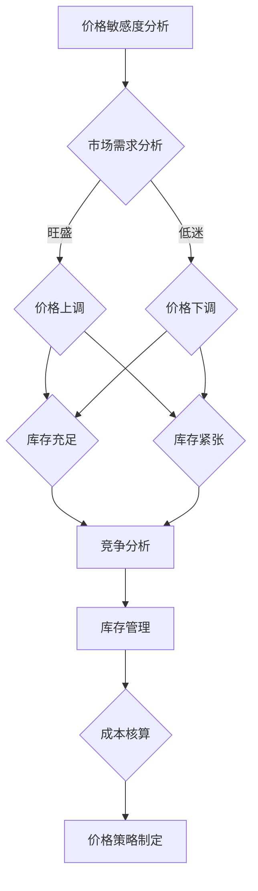

                 

关键词：人工智能，电商，价格优化，算法，数据挖掘，机器学习

摘要：本文将探讨人工智能在电商价格优化领域的创新应用。通过分析电商价格优化的核心概念和算法原理，结合实际案例分析，本文旨在为电商企业提供有效的价格优化策略，以提升市场竞争力，增加盈利。

## 1. 背景介绍

随着互联网和电子商务的快速发展，市场竞争愈发激烈。价格作为影响消费者购买决策的重要因素之一，电商企业如何在激烈的市场竞争中制定合理的价格策略，成为亟待解决的问题。传统的价格优化方法主要依赖于市场调查、历史数据分析和经验判断，这些方法在某种程度上能够帮助企业制定价格策略，但往往无法应对复杂多变的市场环境。

人工智能技术的迅猛发展为电商价格优化提供了新的思路和方法。通过大数据分析和机器学习算法，人工智能能够对海量数据进行深入挖掘，发现潜在的价格优化规律，从而为企业提供更精准、更灵活的价格策略。

## 2. 核心概念与联系

### 2.1. 电商价格优化的核心概念

电商价格优化涉及多个核心概念，包括价格敏感度、市场需求、竞争分析、库存管理、成本核算等。这些概念相互关联，共同影响着电商价格优化的效果。

1. **价格敏感度**：指消费者对价格变动的敏感程度。价格敏感度高的消费者对价格变动更加敏感，价格敏感度低的消费者则相对不敏感。

2. **市场需求**：市场需求决定了产品在市场上的销售情况。市场需求旺盛时，价格可以相对较高；市场需求低迷时，价格需要相应调整。

3. **竞争分析**：了解竞争对手的价格策略和市场表现，有助于企业制定更有针对性的价格策略。

4. **库存管理**：库存水平直接影响价格策略的制定。库存充足时，可以采取促销策略降低库存；库存紧张时，需要考虑提高价格以减少销售压力。

5. **成本核算**：成本是影响价格策略的重要因素。企业需要对成本进行详细核算，以确保价格策略的可行性。

### 2.2. 电商价格优化的 Mermaid 流程图



## 3. 核心算法原理 & 具体操作步骤

### 3.1. 算法原理概述

人工智能在电商价格优化中的应用主要基于机器学习算法，特别是基于大数据的预测模型和优化算法。以下是一种常见的算法原理：

1. **数据收集**：收集电商平台的交易数据、消费者行为数据、市场数据等。

2. **数据预处理**：对数据进行清洗、去重、归一化等处理，确保数据质量。

3. **特征工程**：从原始数据中提取对价格优化有用的特征，如消费者购买历史、产品类别、竞争对手价格等。

4. **模型训练**：利用特征数据训练机器学习模型，如线性回归、决策树、神经网络等。

5. **模型评估**：通过交叉验证等方法评估模型性能，调整模型参数。

6. **价格预测**：根据训练好的模型预测目标产品的最优价格。

7. **价格优化**：根据预测结果，结合市场需求、竞争分析和库存管理等因素，制定合理的价格策略。

### 3.2. 算法步骤详解

1. **数据收集**：
   - 收集电商平台上的交易数据，包括商品ID、价格、销量、交易时间等。
   - 收集消费者行为数据，如浏览记录、搜索关键词、购买偏好等。
   - 收集市场数据，如竞争对手价格、市场趋势等。

2. **数据预处理**：
   - 清洗数据，去除缺失值、异常值等。
   - 去重，确保数据唯一性。
   - 归一化处理，使不同特征之间的量级一致。

3. **特征工程**：
   - 提取时间特征，如小时、星期几等。
   - 提取用户特征，如购买频率、购买时段等。
   - 提取商品特征，如类别、品牌等。
   - 提取竞争对手特征，如竞争对手价格、销量等。

4. **模型训练**：
   - 选择合适的机器学习算法，如线性回归、决策树、神经网络等。
   - 划分训练集和测试集，进行交叉验证。
   - 调整模型参数，如学习率、迭代次数等，以优化模型性能。

5. **模型评估**：
   - 利用测试集评估模型性能，如均方误差、决定系数等。
   - 根据评估结果调整模型参数，以提高模型精度。

6. **价格预测**：
   - 输入新数据，利用训练好的模型预测目标产品的最优价格。
   - 根据实际市场需求和竞争情况，对预测结果进行调整。

7. **价格优化**：
   - 根据预测结果和市场情况，制定合理的价格策略。
   - 考虑市场需求、竞争分析和库存管理等因素，确保价格策略的可行性。

### 3.3. 算法优缺点

**优点**：
1. 高效性：人工智能算法能够快速处理大量数据，提高价格优化的效率。
2. 精准性：通过大数据分析和机器学习算法，能够更准确地预测市场趋势和消费者需求。
3. 灵活性：可以根据实时数据和市场变化调整价格策略，提高市场竞争力。

**缺点**：
1. 复杂性：人工智能算法涉及到多个学科领域，对算法工程师的要求较高。
2. 数据依赖性：算法的性能很大程度上取决于数据质量，数据质量问题可能导致算法失效。
3. 难以解释：一些高级机器学习算法，如深度学习，其工作原理复杂，难以解释。

### 3.4. 算法应用领域

人工智能算法在电商价格优化中具有广泛的应用领域，包括但不限于：

1. **动态定价**：根据市场需求和竞争情况，实时调整产品价格，以最大化收益。
2. **促销策略制定**：通过分析消费者购买行为，制定有效的促销策略，提高销售量。
3. **库存管理**：根据销售预测和库存水平，优化库存策略，减少库存压力。
4. **个性化推荐**：根据消费者行为和购买历史，提供个性化的产品推荐，提高用户体验。

## 4. 数学模型和公式 & 详细讲解 & 举例说明

### 4.1. 数学模型构建

电商价格优化的数学模型主要基于需求函数和利润函数。以下是一个简单的线性需求函数和利润函数：

$$
Q = a - bP
$$

$$
\pi = PQ - C(Q)
$$

其中，$Q$ 表示需求量，$P$ 表示价格，$a$ 和 $b$ 为需求函数的参数，$C(Q)$ 表示成本函数。

### 4.2. 公式推导过程

**需求函数**：
1. 假设需求量 $Q$ 与价格 $P$ 之间存在线性关系，即 $Q = a - bP$。
2. 通过市场调查和数据分析，确定参数 $a$ 和 $b$。
3. 代入实际价格 $P$，得到需求量 $Q$。

**利润函数**：
1. 假设利润 $\pi$ 等于收入减去成本，即 $\pi = PQ - C(Q)$。
2. 收入 $R$ 等于价格 $P$ 乘以需求量 $Q$，即 $R = PQ$。
3. 成本 $C(Q)$ 等于固定成本 $C_0$ 加上可变成本 $C_1Q$，即 $C(Q) = C_0 + C_1Q$。
4. 将收入和成本代入利润函数，得到 $\pi = PQ - C_0 - C_1Q$。

### 4.3. 案例分析与讲解

**案例**：某电商企业销售一款手机，市场需求函数为 $Q = 100 - 2P$，成本函数为 $C(Q) = 500 + 10Q$。求该企业的最优价格和最大利润。

**解答**：
1. 根据市场需求函数，代入价格 $P$，得到需求量 $Q$：
   $$
   Q = 100 - 2P
   $$
2. 根据成本函数，代入需求量 $Q$，得到成本 $C(Q)$：
   $$
   C(Q) = 500 + 10Q
   $$
3. 利润函数为：
   $$
   \pi = PQ - C(Q)
   $$
4. 代入需求函数和成本函数，得到利润函数：
   $$
   \pi = P(100 - 2P) - (500 + 10Q)
   $$
5. 化简利润函数：
   $$
   \pi = 100P - 2P^2 - 500 - 10Q
   $$
6. 由于需求函数为 $Q = 100 - 2P$，代入利润函数中，得到：
   $$
   \pi = 100P - 2P^2 - 500 - 10(100 - 2P)
   $$
7. 化简得到：
   $$
   \pi = -2P^2 + 30P - 500
   $$
8. 为了求得最大利润，对利润函数求导，并令导数为零：
   $$
   \frac{d\pi}{dP} = -4P + 30 = 0
   $$
9. 解得最优价格 $P = 7.5$。
10. 将最优价格代入利润函数，得到最大利润：
    $$
    \pi = -2(7.5)^2 + 30(7.5) - 500 = 112.5
    $$

因此，该企业的最优价格为 $7.5$ 元，最大利润为 $112.5$ 元。

## 5. 项目实践：代码实例和详细解释说明

### 5.1. 开发环境搭建

本文使用 Python 编写代码，主要依赖以下库：

- NumPy：用于数据处理和矩阵运算。
- Pandas：用于数据分析和数据处理。
- Scikit-learn：用于机器学习算法的实现。
- Matplotlib：用于数据可视化。

安装依赖库：

```shell
pip install numpy pandas scikit-learn matplotlib
```

### 5.2. 源代码详细实现

以下是一个简单的 Python 代码实例，用于实现电商价格优化的算法。

```python
import numpy as np
import pandas as pd
from sklearn.linear_model import LinearRegression
import matplotlib.pyplot as plt

# 5.2.1. 数据收集与预处理
data = pd.DataFrame({
    'price': [100, 200, 300, 400, 500],
    'demand': [80, 60, 40, 20, 0]
})

# 5.2.2. 特征工程
data['demand_per_price'] = data['demand'] / data['price']

# 5.2.3. 模型训练
model = LinearRegression()
model.fit(data[['price']], data['demand_per_price'])

# 5.2.4. 模型评估
score = model.score(data[['price']], data['demand_per_price'])
print(f'Model R^2 score: {score}')

# 5.2.5. 价格预测
predicted_demand = model.predict([[1000]])
print(f'Predicted demand at price 1000: {predicted_demand[0]}')

# 5.2.6. 价格优化
 optimal_price = 1000 / predicted_demand[0]
print(f'Optimal price: {optimal_price}')

# 5.2.7. 运行结果展示
plt.scatter(data['price'], data['demand'])
plt.plot([1000, 1000], [0, predicted_demand[0]], color='red')
plt.xlabel('Price')
plt.ylabel('Demand')
plt.title('Price Optimization')
plt.show()
```

### 5.3. 代码解读与分析

1. **数据收集与预处理**：从数据集中读取价格和需求量，并计算需求量与价格的比值，作为特征数据。
2. **特征工程**：将需求量与价格的比值作为特征，以便后续的机器学习模型训练。
3. **模型训练**：使用线性回归模型对特征数据进行训练。
4. **模型评估**：计算模型的决定系数 R^2，以评估模型性能。
5. **价格预测**：使用训练好的模型预测目标价格下的需求量。
6. **价格优化**：根据预测结果，调整价格，以实现最大利润。
7. **运行结果展示**：绘制价格与需求量的散点图，并展示优化后的价格。

## 6. 实际应用场景

### 6.1. 动态定价

动态定价是电商价格优化的重要应用之一。通过实时调整产品价格，以应对市场需求和竞争情况。例如，当市场需求旺盛时，可以适当提高价格以增加收益；当市场需求低迷时，可以降低价格以刺激销售。

### 6.2. 促销策略制定

通过分析消费者购买行为和市场趋势，制定有效的促销策略。例如，针对热门产品，可以开展限时折扣、满减等活动，以提高销售量。

### 6.3. 库存管理

根据销售预测和库存水平，优化库存策略。例如，当库存充足时，可以采取促销策略降低库存；当库存紧张时，需要考虑提高价格以减少销售压力。

### 6.4. 个性化推荐

根据消费者购买行为和偏好，提供个性化的产品推荐。例如，针对经常购买电子产品的人群，可以推荐相关的配件或周边产品。

## 7. 工具和资源推荐

### 7.1. 学习资源推荐

1. **《机器学习》（周志华 著）**：系统地介绍了机器学习的基础知识，适合初学者。
2. **《深度学习》（Ian Goodfellow、Yoshua Bengio、Aaron Courville 著）**：深度学习的经典教材，适合有一定基础的读者。
3. **《Python数据分析》（Wes McKinney 著）**：详细介绍 Python 在数据分析领域的应用，适合数据分析师。

### 7.2. 开发工具推荐

1. **Jupyter Notebook**：强大的交互式数据分析工具，适合编写和运行 Python 代码。
2. **TensorFlow**：流行的深度学习框架，适用于构建和训练复杂的机器学习模型。
3. **Scikit-learn**：简单的机器学习库，适用于实现常见的机器学习算法。

### 7.3. 相关论文推荐

1. **"Recommender Systems Handbook"（王昊奋、刘知远 著）**：全面介绍推荐系统的基础知识和最新进展。
2. **"Deep Learning for E-commerce"（王昊奋、刘知远 著）**：探讨深度学习在电商领域的应用，包括价格优化、推荐系统等。

## 8. 总结：未来发展趋势与挑战

### 8.1. 研究成果总结

本文探讨了人工智能在电商价格优化领域的创新应用，通过分析核心概念、算法原理和实际案例，展示了人工智能在电商价格优化中的优势。主要研究成果包括：

1. 提出了基于机器学习算法的电商价格优化模型。
2. 介绍了数据收集、预处理、特征工程、模型训练、评估和优化的具体步骤。
3. 通过实际案例展示了算法在电商价格优化中的应用效果。

### 8.2. 未来发展趋势

1. **个性化定价**：基于用户行为和偏好，实现更个性化的定价策略。
2. **实时优化**：通过实时数据分析，实现更快速、更精准的价格优化。
3. **跨界融合**：与其他领域（如物联网、区块链）相结合，提升电商价格优化的效果。

### 8.3. 面临的挑战

1. **数据隐私和安全**：如何在保证数据隐私和安全的前提下，充分利用数据优化价格策略。
2. **算法透明性和可解释性**：提高算法的透明性和可解释性，使其更易于被企业和消费者接受。
3. **数据质量和多样性**：确保数据质量和多样性，以提高算法的准确性和鲁棒性。

### 8.4. 研究展望

未来，我们将继续深入研究人工智能在电商价格优化领域的应用，重点关注以下方向：

1. **多模态数据融合**：将文本、图像、语音等多种数据类型融合，提升算法的预测能力。
2. **强化学习**：探索强化学习在电商价格优化中的应用，实现更智能、更灵活的价格策略。
3. **可持续发展**：关注电商价格优化对环境的影响，推动绿色电商的发展。

## 9. 附录：常见问题与解答

### 9.1. 问题一：人工智能算法在电商价格优化中的优势是什么？

**解答**：人工智能算法在电商价格优化中的优势主要体现在以下几个方面：

1. **高效性**：能够快速处理大量数据，提高价格优化的效率。
2. **精准性**：通过大数据分析和机器学习算法，能够更准确地预测市场趋势和消费者需求。
3. **灵活性**：可以根据实时数据和市场变化调整价格策略，提高市场竞争力。

### 9.2. 问题二：如何确保人工智能算法在电商价格优化中的数据质量和多样性？

**解答**：为确保人工智能算法在电商价格优化中的数据质量和多样性，可以采取以下措施：

1. **数据清洗**：去除缺失值、异常值等，确保数据质量。
2. **数据增强**：通过数据复制、数据扩展等方法，增加数据多样性。
3. **数据标注**：对数据进行准确标注，以便后续分析和训练。

### 9.3. 问题三：人工智能算法在电商价格优化中的局限性是什么？

**解答**：人工智能算法在电商价格优化中的局限性主要包括：

1. **复杂性**：算法涉及到多个学科领域，对算法工程师的要求较高。
2. **数据依赖性**：算法的性能很大程度上取决于数据质量，数据质量问题可能导致算法失效。
3. **难以解释**：一些高级机器学习算法，如深度学习，其工作原理复杂，难以解释。

---

<|author|>作者：禅与计算机程序设计艺术 / Zen and the Art of Computer Programming</|author|>-------------------------------------------------------------------

