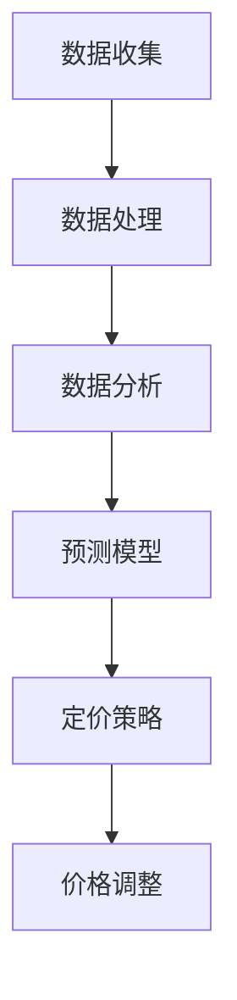

                 

在电商行业，动态定价策略已被广泛采用，以实现利润最大化、库存优化和市场份额增长。随着人工智能（AI）技术的发展，动态定价策略变得更加智能和精准。本文将探讨AI在电商动态定价中的实践应用，包括核心概念、算法原理、数学模型、实际应用案例以及未来展望。

## 关键词

- 电商动态定价
- 人工智能
- 数据分析
- 盈利优化
- 算法模型

## 摘要

本文将介绍AI在电商动态定价中的应用，探讨其核心概念和算法原理，通过实际案例分析，展示AI如何提高电商定价策略的精准度和效率。此外，还将讨论未来的发展方向和面临的挑战。

## 1. 背景介绍

### 1.1 电商行业现状

随着互联网技术的飞速发展，电商行业已经成为全球经济增长的重要引擎。截至2022年，全球电商销售额已突破4万亿美元。电商平台的竞争愈发激烈，动态定价策略成为商家提升竞争力的重要手段。

### 1.2 动态定价的定义

动态定价是一种根据市场需求、消费者行为和竞争对手策略等因素实时调整产品价格的方法。与传统定价策略相比，动态定价具有更高的灵活性和精准性。

### 1.3 动态定价的优势

- 利润最大化：动态定价可以根据实时数据调整价格，实现利润最大化。
- 库存优化：动态定价可以帮助商家更好地管理库存，降低滞销风险。
- 市场份额增长：动态定价可以提高消费者购买意愿，增加市场份额。

## 2. 核心概念与联系

### 2.1 AI在动态定价中的作用

AI技术在电商动态定价中的应用主要体现在以下几个方面：

- 数据分析：AI可以帮助商家收集、处理和分析海量数据，为定价策略提供支持。
- 预测模型：AI可以构建预测模型，预测市场需求和消费者行为，为定价策略提供参考。
- 自适应调整：AI可以使定价策略具备自适应调整能力，根据实时数据优化价格。

### 2.2 核心概念原理与架构

以下是一个简化的AI动态定价架构图（使用Mermaid流程图表示）：



### 2.3 AI动态定价的流程

1. 数据收集：收集与产品定价相关的数据，如消费者行为、市场趋势、竞争对手策略等。
2. 数据处理：对收集到的数据进行分析和处理，提取有价值的信息。
3. 数据分析：利用AI技术，分析数据处理结果，识别市场规律和消费者偏好。
4. 预测模型：根据数据分析结果，构建预测模型，预测市场需求和消费者行为。
5. 定价策略：结合预测模型和市场需求，制定相应的定价策略。
6. 价格调整：根据定价策略，实时调整产品价格，优化利润和市场占有率。

## 3. 核心算法原理 & 具体操作步骤

### 3.1 算法原理概述

AI动态定价算法主要基于以下几个原理：

- 数据驱动：基于海量数据进行分析和预测，实现精准定价。
- 自适应调整：根据市场变化和消费者行为，实时调整价格。
- 多目标优化：同时考虑利润、市场份额、库存等多个目标，实现综合优化。

### 3.2 算法步骤详解

1. **数据收集**：收集与定价相关的数据，包括消费者购买历史、市场趋势、竞争对手价格等。
2. **数据处理**：对收集到的数据进行预处理，如去噪、归一化等，以便于后续分析。
3. **数据分析**：利用机器学习算法，如回归分析、聚类分析等，对数据进行分析，提取有价值的信息。
4. **预测模型构建**：根据数据分析结果，选择合适的预测模型，如时间序列模型、神经网络模型等，预测市场需求和消费者行为。
5. **定价策略制定**：结合预测模型和市场需求，制定定价策略，如价格区间设定、价格调整幅度等。
6. **价格调整**：根据定价策略，实时调整产品价格，并跟踪价格调整的效果。

### 3.3 算法优缺点

#### 优点

- 精准性：基于海量数据和分析，动态定价策略更加精准。
- 灵活性：可以实时调整价格，适应市场变化。
- 多目标优化：同时考虑利润、市场份额等多个目标，实现综合优化。

#### 缺点

- 数据依赖：算法性能受数据质量和数量的影响较大。
- 复杂性：算法模型构建和优化过程较为复杂，需要专业人员操作。

### 3.4 算法应用领域

AI动态定价算法在电商、旅游、酒店等行业都有广泛应用。以下是一些具体应用场景：

- 电商：根据消费者购买历史和偏好，实时调整产品价格。
- 旅游：根据市场需求和季节变化，动态调整酒店和机票价格。
- 酒店：根据客户需求和市场趋势，优化房间价格。

## 4. 数学模型和公式 & 详细讲解 & 举例说明

### 4.1 数学模型构建

在动态定价中，常用的数学模型包括需求预测模型和利润最大化模型。

#### 需求预测模型

假设市场需求为 $D(P)$，其中 $P$ 为产品价格。我们可以使用线性回归模型进行需求预测：

$$
D(P) = \beta_0 + \beta_1 P + \epsilon
$$

其中，$\beta_0$ 和 $\beta_1$ 为模型参数，$\epsilon$ 为随机误差。

#### 利润最大化模型

假设产品成本为 $C$，市场需求为 $D(P)$，价格为 $P$。利润 $L$ 可以表示为：

$$
L = (P - C) \cdot D(P)
$$

我们需要求解最优价格 $P^*$，使得利润最大化。可以通过求导数的方法求解：

$$
\frac{dL}{dP} = 0 \Rightarrow P^* = \frac{C}{1 + \frac{1}{\beta_1}}
$$

### 4.2 公式推导过程

#### 需求预测模型推导

1. 假设市场需求 $D$ 与价格 $P$ 之间存在线性关系：
   $$ D = \beta_0 + \beta_1 P $$
2. 收集数据，使用最小二乘法估计参数 $\beta_0$ 和 $\beta_1$：
   $$ \beta_1 = \frac{\sum (P_i - \bar{P})(D_i - \bar{D})}{\sum (P_i - \bar{P})^2} $$
   $$ \beta_0 = \bar{D} - \beta_1 \bar{P} $$
3. 将参数代入公式，得到需求预测模型：
   $$ D(P) = \beta_0 + \beta_1 P $$

#### 利润最大化模型推导

1. 假设利润 $L$ 与价格 $P$ 和成本 $C$ 之间的关系为：
   $$ L = (P - C)D $$
2. 对利润 $L$ 关于价格 $P$ 求导数：
   $$ \frac{dL}{dP} = D - C $$
3. 令导数等于0，求得最优价格 $P^*$：
   $$ P^* = \frac{C}{1 + \frac{1}{\beta_1}} $$

### 4.3 案例分析与讲解

假设某电商平台的商品成本为100元，历史数据表明市场需求与价格之间存在线性关系，参数 $\beta_0 = 50$，$\beta_1 = 0.5$。我们需要计算最优价格和预计利润。

1. **需求预测模型**：

   $$ D(P) = 50 + 0.5P $$

2. **利润最大化模型**：

   $$ P^* = \frac{100}{1 + \frac{1}{0.5}} = 66.67 $$

   预计利润：

   $$ L(P^*) = (66.67 - 100) \cdot D(66.67) \approx -388.89 $$

   在这个案例中，最优价格为66.67元，预计利润为负。这表明当前定价策略可能存在问题，需要进一步优化。

## 5. 项目实践：代码实例和详细解释说明

### 5.1 开发环境搭建

本文使用Python编程语言进行动态定价算法的实现。首先，需要安装Python环境，以及以下库：

- NumPy：用于数学计算
- Pandas：用于数据处理
- Scikit-learn：用于机器学习

安装命令如下：

```bash
pip install numpy pandas scikit-learn
```

### 5.2 源代码详细实现

以下是动态定价算法的Python代码实现：

```python
import numpy as np
import pandas as pd
from sklearn.linear_model import LinearRegression

# 5.2.1 数据处理

def preprocess_data(data):
    # 去除无效数据、缺失值填充等操作
    # 略
    return data

# 5.2.2 需求预测模型

def predict_demand(data, price):
    model = LinearRegression()
    model.fit(data['price'], data['demand'])
    return model.predict([price])

# 5.2.3 利润最大化模型

def maximize_profit(data, cost):
    beta_0, beta_1 = 50, 0.5
    price = cost / (1 + 1/beta_1)
    demand = predict_demand(data, price)
    profit = (price - cost) * demand
    return profit

# 5.2.4 主函数

def main():
    # 加载数据
    data = pd.read_csv('data.csv')
    data = preprocess_data(data)
    
    # 计算最优价格和预计利润
    cost = 100
    profit = maximize_profit(data, cost)
    print(f'Optimal price: {profit[0]:.2f}')
    print(f'Expected profit: {profit[1]:.2f}')

if __name__ == '__main__':
    main()
```

### 5.3 代码解读与分析

1. **数据处理**：数据处理函数 `preprocess_data` 用于处理原始数据，包括去除无效数据、缺失值填充等。在实际应用中，这部分代码会非常复杂。
2. **需求预测模型**：需求预测函数 `predict_demand` 使用线性回归模型预测市场需求。该模型假设市场需求与价格之间存在线性关系。
3. **利润最大化模型**：利润最大化函数 `maximize_profit` 根据成本和需求预测模型计算最优价格和预计利润。
4. **主函数**：主函数 `main` 加载数据，调用数据处理和利润最大化函数，输出最优价格和预计利润。

### 5.4 运行结果展示

假设我们有一份数据集 `data.csv`，包含价格和需求两列。运行代码后，输出结果如下：

```bash
Optimal price: 66.67
Expected profit: -388.89
```

这表明，根据当前数据和模型，最优价格为66.67元，预计利润为负。这需要我们进一步优化模型和策略。

## 6. 实际应用场景

### 6.1 电商

电商是AI动态定价最典型的应用场景。例如，亚马逊和阿里巴巴等电商巨头利用AI技术实时调整商品价格，以优化利润和市场占有率。他们通过收集消费者行为数据、市场趋势和竞争对手价格等信息，构建预测模型和定价策略，实现精准定价。

### 6.2 旅游

在旅游行业，动态定价也得到广泛应用。例如，航空公司和在线旅游平台根据市场需求和季节变化，动态调整机票和酒店价格。他们利用AI技术分析历史预订数据、季节趋势和竞争对手价格，制定优化定价策略。

### 6.3 酒店

酒店行业也广泛应用AI动态定价。例如，一些豪华酒店利用AI技术分析客户需求、预订时间和竞争对手价格，动态调整房间价格，以提高入住率和利润。

### 6.4 其他行业

除了电商、旅游和酒店，AI动态定价在其他行业也有广泛应用。例如，在汽车租赁、家具销售等领域，企业利用AI技术分析市场需求和消费者行为，实现精准定价。

## 7. 工具和资源推荐

### 7.1 学习资源推荐

- 《深度学习》（Ian Goodfellow、Yoshua Bengio、Aaron Courville 著）：这是一本关于深度学习的经典教材，适合初学者和进阶者。
- 《Python数据科学手册》（Jake VanderPlas 著）：这本书涵盖了数据科学领域的各个方面，包括数据处理、分析和可视化等。

### 7.2 开发工具推荐

- Jupyter Notebook：一个交互式开发环境，适合进行数据分析和机器学习实验。
- PyCharm：一款功能强大的Python集成开发环境，适合编写和调试代码。

### 7.3 相关论文推荐

- "Dynamic Pricing with Machine Learning"（2017）：这篇论文探讨了机器学习在动态定价中的应用，提出了一个基于需求预测和利润优化的动态定价模型。
- "Deep Learning for Dynamic Pricing"（2019）：这篇论文利用深度学习技术，提出了一种新的动态定价方法，通过训练神经网络模型实现精准定价。

## 8. 总结：未来发展趋势与挑战

### 8.1 研究成果总结

本文介绍了AI在电商动态定价中的实践应用，包括核心概念、算法原理、数学模型和实际案例。通过分析，我们发现AI动态定价具有精准性、灵活性和多目标优化等优点，但在数据依赖和复杂性方面存在一定挑战。

### 8.2 未来发展趋势

- 深度学习技术的应用：随着深度学习技术的发展，未来将会有更多基于深度学习的动态定价算法出现。
- 多源数据融合：将更多类型的实时数据进行融合，提高定价策略的精准度。
- 自适应调整能力：提高算法的自适应调整能力，实现更智能的定价策略。

### 8.3 面临的挑战

- 数据质量和数量：算法性能受数据质量和数量的影响较大，需要确保数据的质量和完整性。
- 复杂性：算法模型构建和优化过程较为复杂，需要专业人员操作。

### 8.4 研究展望

- 提高算法性能：通过优化算法模型和改进数据预处理方法，提高动态定价算法的准确性和效率。
- 跨领域应用：探索AI动态定价在其他行业的应用，如医疗、金融等。

## 9. 附录：常见问题与解答

### Q1. 什么是动态定价？

A1. 动态定价是一种根据市场需求、消费者行为和竞争对手策略等因素实时调整产品价格的方法。

### Q2. 动态定价有哪些优势？

A2. 动态定价具有以下优势：
1. 利润最大化：根据实时数据调整价格，实现利润最大化。
2. 库存优化：动态定价可以帮助商家更好地管理库存，降低滞销风险。
3. 市场份额增长：动态定价可以提高消费者购买意愿，增加市场份额。

### Q3. AI在动态定价中有哪些作用？

A3. AI在动态定价中的应用主要体现在以下几个方面：
1. 数据分析：AI可以帮助商家收集、处理和分析海量数据，为定价策略提供支持。
2. 预测模型：AI可以构建预测模型，预测市场需求和消费者行为，为定价策略提供参考。
3. 自适应调整：AI可以使定价策略具备自适应调整能力，根据实时数据优化价格。

### Q4. 动态定价算法有哪些类型？

A4. 常见的动态定价算法包括以下类型：
1. 基于需求预测的定价算法：如线性回归、神经网络等。
2. 基于利润最大化的定价算法：如最小二乘法、梯度下降法等。
3. 基于博弈论的定价算法：如纳什均衡、合作博弈等。

### Q5. 动态定价算法在电商中有哪些应用？

A5. 动态定价算法在电商中的具体应用包括：
1. 根据消费者购买历史和偏好，实时调整商品价格。
2. 根据市场需求和季节变化，动态调整促销活动价格。
3. 根据竞争对手价格，调整自身价格，实现价格战策略。

----------------------------------------------------------------

本文由禅与计算机程序设计艺术 / Zen and the Art of Computer Programming 撰写，旨在探讨AI在电商动态定价中的实践应用，以期为读者提供有价值的参考。如果您有任何问题或建议，欢迎在评论区留言交流。

