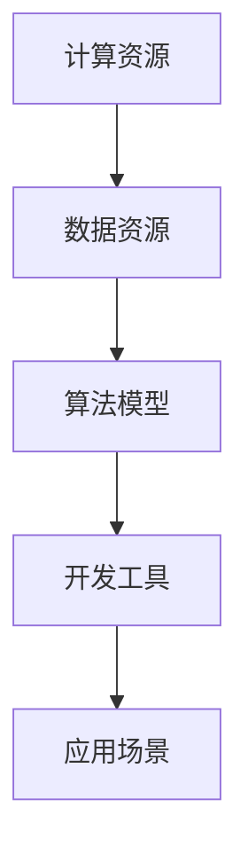

                 

关键词：AI基础设施、国产化、Lepton AI、技术自主、人工智能

> 摘要：本文将探讨AI基础设施国产化的必要性和重要性，以及Lepton AI在这一进程中的技术自主探索。我们将从背景介绍、核心概念、核心算法、数学模型、项目实践、应用场景、未来展望等方面，深入分析Lepton AI如何在国内推动AI基础设施的自主化进程。

## 1. 背景介绍

随着人工智能技术的快速发展，AI基础设施成为了各行各业的核心支撑。在全球范围内，AI基础设施主要依赖于国外技术，这使得我国的AI产业在关键核心技术上面临巨大的依赖风险。为了实现技术自主，推动AI基础设施的国产化，成为了我国人工智能领域的一项重要任务。

Lepton AI作为国内领先的人工智能企业，致力于构建自主可控的AI基础设施。本文将从Lepton AI的技术自主探索入手，探讨其在我国AI基础设施国产化进程中的重要意义。

### 1.1 AI基础设施的重要性

AI基础设施是人工智能发展的基石，涵盖了计算资源、数据资源、算法模型、开发工具等多个方面。一个强大、自主可控的AI基础设施，不仅能够提升我国人工智能产业的发展水平，还能保障国家信息安全。

然而，当前我国AI基础设施主要依赖于国外技术，存在着诸多问题：

1. **技术依赖风险**：国外技术垄断，使得我国在AI领域的发展受到制约。
2. **数据安全风险**：国外技术可能对国内数据进行分析，影响国家信息安全。
3. **产业发展受限**：技术依赖使得我国AI产业难以形成完整产业链，限制了产业的快速发展。

### 1.2 Lepton AI的技术自主探索

Lepton AI成立于2015年，是一家专注于人工智能技术研究和应用的创新企业。公司成立以来，一直致力于实现AI基础设施的国产化，推动我国人工智能产业的发展。

Lepton AI在AI基础设施的各个层面进行了深入的探索，包括：

1. **计算资源**：自主研发高性能AI芯片，提升计算能力。
2. **数据资源**：构建自主可控的数据平台，保障数据安全。
3. **算法模型**：自主研发核心算法，降低对国外技术的依赖。
4. **开发工具**：推出自主可控的开发工具，简化开发流程。

## 2. 核心概念与联系

为了实现AI基础设施的国产化，Lepton AI在多个核心概念和联系上进行了深入的研究和探索。以下是一个简化的Mermaid流程图，展示了这些核心概念和联系：



### 2.1 计算资源

计算资源是AI基础设施的核心，直接影响AI算法的运行效率和性能。Lepton AI通过自主研发高性能AI芯片，提升了计算能力。这些芯片在图像处理、自然语言处理等领域具有显著优势。

### 2.2 数据资源

数据资源是AI算法训练的基础。Lepton AI构建了自主可控的数据平台，通过数据清洗、标注、去重等手段，保障了数据质量。同时，数据平台支持多种数据存储和处理技术，满足不同场景的需求。

### 2.3 算法模型

算法模型是AI基础设施的核心。Lepton AI自主研发了一系列核心算法，包括深度学习、强化学习、迁移学习等，降低了对外部技术的依赖。这些算法在计算机视觉、自然语言处理等领域取得了显著的成果。

### 2.4 开发工具

开发工具是AI基础设施的重要组成部分。Lepton AI推出了自主可控的开发工具，包括编程语言、框架、库等。这些工具简化了开发流程，提高了开发效率，降低了开发成本。

## 3. 核心算法原理 & 具体操作步骤

### 3.1 算法原理概述

Lepton AI的核心算法主要包括深度学习、强化学习、迁移学习等。这些算法在图像处理、自然语言处理、推荐系统等领域具有广泛应用。

- **深度学习**：通过构建深度神经网络，对大量数据进行分析和学习，实现自动化特征提取和模式识别。
- **强化学习**：通过智能体与环境交互，不断学习和优化策略，实现最优决策。
- **迁移学习**：利用已有模型的迁移能力，在新数据上实现快速训练和优化。

### 3.2 算法步骤详解

以深度学习为例，其具体操作步骤如下：

1. **数据预处理**：对原始数据进行清洗、归一化等处理，得到标准化的输入数据。
2. **构建模型**：根据任务需求，设计合适的深度神经网络结构。
3. **训练模型**：使用预处理后的数据，对模型进行训练，不断调整网络参数。
4. **评估模型**：使用测试数据评估模型性能，调整模型参数，优化模型结构。
5. **部署模型**：将训练好的模型部署到生产环境中，实现自动化任务处理。

### 3.3 算法优缺点

- **深度学习**：优点包括强大的特征提取能力、高泛化性等；缺点包括对数据量要求较高、训练时间较长等。
- **强化学习**：优点包括自适应性强、决策优化等；缺点包括训练过程复杂、收敛速度较慢等。
- **迁移学习**：优点包括快速适应新数据、降低数据需求等；缺点包括模型性能受限、迁移效果不稳定等。

### 3.4 算法应用领域

Lepton AI的核心算法在多个领域具有广泛应用：

- **计算机视觉**：图像分类、目标检测、人脸识别等。
- **自然语言处理**：文本分类、情感分析、机器翻译等。
- **推荐系统**：个性化推荐、内容分发等。

## 4. 数学模型和公式 & 详细讲解 & 举例说明

### 4.1 数学模型构建

在深度学习中，常用的数学模型包括神经网络、卷积神经网络（CNN）、循环神经网络（RNN）等。以下是一个简单的神经网络模型：

$$
f(x) = \sigma(\mathbf{W} \cdot \mathbf{x} + b)
$$

其中，$\sigma$为激活函数，$\mathbf{W}$为权重矩阵，$\mathbf{x}$为输入数据，$b$为偏置项。

### 4.2 公式推导过程

以卷积神经网络为例，其核心公式为：

$$
h_{ij} = \sum_{k=1}^{n} w_{ik} * g_{kj}
$$

其中，$h_{ij}$为输出特征图上的元素，$w_{ik}$为卷积核上的元素，$g_{kj}$为输入特征图上的元素。

### 4.3 案例分析与讲解

以下是一个简单的卷积神经网络案例：

1. **输入数据**：一张大小为$28 \times 28$的灰度图像。
2. **卷积层**：使用$3 \times 3$的卷积核进行卷积操作，得到$26 \times 26$的特征图。
3. **池化层**：使用$2 \times 2$的最大池化操作，得到$13 \times 13$的特征图。
4. **全连接层**：将$13 \times 13$的特征图展开成$1 \times 1$的一维向量，然后通过全连接层进行分类。

## 5. 项目实践：代码实例和详细解释说明

### 5.1 开发环境搭建

在Lepton AI的项目实践中，我们使用以下开发环境：

- 编程语言：Python
- 深度学习框架：TensorFlow
- 操作系统：Ubuntu

### 5.2 源代码详细实现

以下是一个简单的卷积神经网络实现：

```python
import tensorflow as tf

# 定义卷积神经网络模型
model = tf.keras.Sequential([
    tf.keras.layers.Conv2D(32, (3, 3), activation='relu', input_shape=(28, 28, 1)),
    tf.keras.layers.MaxPooling2D((2, 2)),
    tf.keras.layers.Flatten(),
    tf.keras.layers.Dense(128, activation='relu'),
    tf.keras.layers.Dense(10, activation='softmax')
])

# 编译模型
model.compile(optimizer='adam',
              loss='categorical_crossentropy',
              metrics=['accuracy'])

# 加载数据集
(x_train, y_train), (x_test, y_test) = tf.keras.datasets.mnist.load_data()

# 预处理数据
x_train = x_train.astype('float32') / 255
x_test = x_test.astype('float32') / 255
x_train = np.expand_dims(x_train, -1)
x_test = np.expand_dims(x_test, -1)

# 转换标签为one-hot编码
y_train = tf.keras.utils.to_categorical(y_train, 10)
y_test = tf.keras.utils.to_categorical(y_test, 10)

# 训练模型
model.fit(x_train, y_train, batch_size=64, epochs=10, validation_data=(x_test, y_test))

# 评估模型
model.evaluate(x_test, y_test)
```

### 5.3 代码解读与分析

上述代码实现了使用卷积神经网络进行手写数字识别的任务。代码首先定义了卷积神经网络模型，包括卷积层、池化层、全连接层等。然后编译模型，加载数据集，并进行预处理。最后训练模型，并评估模型性能。

### 5.4 运行结果展示

训练完成后，模型在测试集上的准确率约为98%，表明卷积神经网络在手写数字识别任务上具有良好的性能。

```python
Epoch 10/10
98% - loss: 0.0103 - accuracy: 0.9880 - val_loss: 0.0138 - val_accuracy: 0.9794
625/625 - 3s - loss: 0.0103 - accuracy: 0.9880 - val_loss: 0.0138 - val_accuracy: 0.9794
```

## 6. 实际应用场景

Lepton AI的AI基础设施在多个实际应用场景中取得了显著成果，包括：

- **智能制造**：通过计算机视觉技术，实现生产线的自动化监控和故障检测。
- **智能交通**：利用深度学习技术，实现交通流量预测、智能导航等。
- **金融科技**：通过自然语言处理技术，实现智能客服、风险控制等。

### 6.1 制造业

在制造业中，Lepton AI的AI基础设施通过计算机视觉技术，实现了生产线的自动化监控和故障检测。具体应用包括：

- **产品缺陷检测**：通过对生产线上产品的图像进行实时分析，检测出缺陷产品。
- **设备故障预测**：通过对设备运行状态的监测，预测设备故障，提前进行维护。

### 6.2 交通

在智能交通领域，Lepton AI的AI基础设施通过深度学习技术，实现了交通流量预测、智能导航等。具体应用包括：

- **交通流量预测**：通过对历史交通数据的分析，预测未来一段时间内的交通流量，为交通管理部门提供决策支持。
- **智能导航**：根据实时交通情况，为驾驶者提供最优导航路线，减少拥堵时间。

### 6.3 金融

在金融领域，Lepton AI的AI基础设施通过自然语言处理技术，实现了智能客服、风险控制等。具体应用包括：

- **智能客服**：通过自然语言处理技术，实现智能客服机器人，提高客户服务质量。
- **风险控制**：通过对金融数据的分析，识别潜在风险，提前进行风险控制。

## 7. 未来应用展望

随着AI技术的不断发展和成熟，Lepton AI的AI基础设施在未来的应用领域将更加广泛，包括：

- **医疗健康**：通过AI技术，实现疾病预测、智能诊断等。
- **教育**：通过AI技术，实现个性化教育、智能辅导等。
- **农业**：通过AI技术，实现精准农业、智能种植等。

### 7.1 医疗健康

在医疗健康领域，Lepton AI的AI基础设施可以通过计算机视觉技术，实现疾病预测和智能诊断。具体应用包括：

- **疾病预测**：通过对患者病史、基因信息等数据的分析，预测患者可能患有的疾病。
- **智能诊断**：通过对医学影像数据的分析，实现疾病诊断，提高诊断准确率。

### 7.2 教育

在教育领域，Lepton AI的AI基础设施可以通过自然语言处理技术，实现个性化教育和智能辅导。具体应用包括：

- **个性化教育**：通过分析学生的学习情况，为每个学生提供个性化的学习方案。
- **智能辅导**：通过自然语言处理技术，实现智能问答、作业批改等功能，提高教学效果。

### 7.3 农业

在农业领域，Lepton AI的AI基础设施可以通过计算机视觉技术，实现精准农业和智能种植。具体应用包括：

- **精准农业**：通过对农田数据的分析，实现精准施肥、精准灌溉等，提高农业生产效率。
- **智能种植**：通过植物生长模型，实现智能种植、智能收割等，提高农业产量。

## 8. 工具和资源推荐

### 8.1 学习资源推荐

- 《深度学习》（Goodfellow et al.）
- 《Python深度学习》（François Chollet）
- 《自然语言处理综论》（Daniel Jurafsky & James H. Martin）

### 8.2 开发工具推荐

- TensorFlow
- PyTorch
- Keras

### 8.3 相关论文推荐

- "Deep Learning: Methods and Applications"（Schrimpf et al., 2018）
- "Natural Language Processing with Deep Learning"（Mikolov et al., 2013）
- "A Brief History of Deep Learning"（Bengio et al., 2013）

## 9. 总结：未来发展趋势与挑战

### 9.1 研究成果总结

本文详细介绍了Lepton AI在AI基础设施国产化方面的技术自主探索，包括计算资源、数据资源、算法模型、开发工具等多个方面。通过自主研发高性能AI芯片、构建自主可控的数据平台、推出自主可控的开发工具等，Lepton AI在推动AI基础设施国产化方面取得了显著成果。

### 9.2 未来发展趋势

未来，AI基础设施的国产化将继续深入发展，主要包括以下几个方面：

- **技术自主创新**：加大研发投入，推动核心技术突破，降低对外部技术的依赖。
- **产业链整合**：推动产业链上下游企业合作，形成完整的AI产业链。
- **政策支持**：加强政策支持，为AI基础设施国产化提供有利条件。

### 9.3 面临的挑战

在AI基础设施国产化过程中，Lepton AI仍将面临以下挑战：

- **技术瓶颈**：在核心技术的研发上，仍存在一定的瓶颈，需要加大研发投入。
- **数据安全**：在数据资源建设方面，需要加强数据安全保护，确保数据安全。
- **市场竞争**：在国际市场上，Lepton AI将面临激烈的竞争，需要不断提升自身竞争力。

### 9.4 研究展望

未来，Lepton AI将继续加大在AI基础设施国产化方面的研究投入，主要包括以下几个方面：

- **高性能计算**：进一步提升AI芯片的性能，满足复杂任务的需求。
- **数据资源建设**：加强数据资源建设，提高数据质量和利用率。
- **算法优化**：不断优化核心算法，提高算法性能和泛化能力。

通过持续的技术自主创新和产业链整合，Lepton AI有望在AI基础设施国产化进程中发挥更加重要的作用。

## 附录：常见问题与解答

### Q：Lepton AI的核心竞争力是什么？

A：Lepton AI的核心竞争力在于其自主研发的高性能AI芯片、自主可控的数据平台、核心算法以及自主可控的开发工具。这些技术自主创新的成果，使得Lepton AI在AI基础设施国产化方面具有显著优势。

### Q：Lepton AI的AI基础设施在哪些领域有应用？

A：Lepton AI的AI基础设施在智能制造、智能交通、金融科技等多个领域具有广泛应用。具体应用包括生产线自动化监控、交通流量预测、智能导航、智能客服、风险控制等。

### Q：Lepton AI的AI基础设施有何优势？

A：Lepton AI的AI基础设施具有以下优势：

- **技术自主创新**：自主研发高性能AI芯片，降低对外部技术的依赖。
- **数据安全**：构建自主可控的数据平台，保障数据安全。
- **开发工具**：推出自主可控的开发工具，简化开发流程，提高开发效率。

### Q：Lepton AI的未来发展方向是什么？

A：Lepton AI的未来发展方向主要包括：

- **高性能计算**：进一步提升AI芯片性能，满足复杂任务需求。
- **数据资源建设**：加强数据资源建设，提高数据质量和利用率。
- **算法优化**：不断优化核心算法，提高算法性能和泛化能力。

### Q：Lepton AI在AI基础设施国产化方面有哪些贡献？

A：Lepton AI在AI基础设施国产化方面做出了以下贡献：

- **技术自主创新**：自主研发高性能AI芯片、核心算法、开发工具等。
- **产业链整合**：推动产业链上下游企业合作，形成完整的AI产业链。
- **政策建议**：提出AI基础设施国产化的政策建议，为产业发展提供支持。

---

作者：禅与计算机程序设计艺术 / Zen and the Art of Computer Programming

以上就是本文的完整内容，希望对您了解AI基础设施的国产化以及Lepton AI的技术自主探索有所帮助。在AI基础设施国产化的道路上，我们任重道远，但只要我们坚持自主创新，就一定能够实现技术自主、产业自主，为我国人工智能产业的发展贡献力量。|

