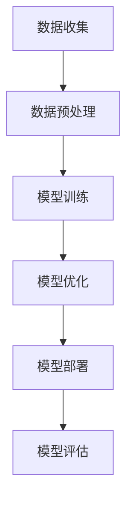

                 

关键词：AI大模型，创业，竞争对手，应对策略，未来发展

> 摘要：随着人工智能技术的飞速发展，大模型在各个领域展现出强大的竞争力，成为创业公司的热点。然而，如何在激烈的市场竞争中脱颖而出，成为行业领导者，是每一个创业公司需要面对的重要问题。本文将深入探讨大模型创业的路径，分析应对未来竞争对手的策略，并提出相应的建议。

## 1. 背景介绍

近年来，人工智能技术取得了显著突破，特别是在深度学习领域，大模型如BERT、GPT等取得了令人瞩目的成果。这些大模型通过在海量数据上的训练，展现了超越人类的表现，不仅在学术界引起了广泛关注，也在工业界获得了广泛应用。创业公司纷纷投身于大模型研发和应用，希望借此抓住历史机遇，实现商业上的成功。

然而，随着市场的逐渐成熟，竞争也变得愈发激烈。面对实力雄厚、资源丰富的行业巨头，创业公司如何应对未来的竞争对手，保持自身的竞争力，成为了一个亟待解决的问题。

## 2. 核心概念与联系

为了更好地理解大模型创业的挑战和机遇，我们需要先了解大模型的核心概念及其在技术架构上的联系。以下是一个简化的大模型技术架构的 Mermaid 流程图：



### 2.1 数据收集

数据收集是大模型训练的基础，数据的质量和数量直接影响模型的性能。创业公司需要通过多种渠道获取高质量的数据，并进行有效的管理和维护。

### 2.2 数据预处理

数据预处理包括数据清洗、数据增强、数据标准化等步骤。这一阶段的目标是确保数据能够满足模型训练的要求，提高模型的训练效率。

### 2.3 模型训练

模型训练是利用大量数据进行迭代学习的过程。创业公司需要设计有效的训练策略，以加速训练过程并提高模型的泛化能力。

### 2.4 模型优化

模型优化包括超参数调优、模型结构改进等，目的是在保证模型性能的同时，降低计算资源和时间成本。

### 2.5 模型部署

模型部署是将训练好的模型应用到实际业务场景中。创业公司需要构建灵活的部署架构，以支持不同场景下的应用需求。

### 2.6 模型评估

模型评估是衡量模型性能的重要手段。创业公司需要建立完善的评估体系，以便及时调整模型，提高其性能。

## 3. 核心算法原理 & 具体操作步骤

### 3.1 算法原理概述

大模型的核心算法是基于深度学习的神经网络。神经网络通过多层非线性变换，实现对复杂数据的建模和预测。大模型的训练过程包括以下几个步骤：

### 3.2 算法步骤详解

1. **数据收集**：通过多种渠道获取高质量数据。
2. **数据预处理**：对数据进行清洗、增强和标准化处理。
3. **模型设计**：根据应用场景设计合适的神经网络结构。
4. **模型训练**：利用大量数据进行迭代训练，调整模型参数。
5. **模型优化**：通过超参数调优、模型结构改进等手段提高模型性能。
6. **模型部署**：将训练好的模型部署到实际应用场景中。
7. **模型评估**：对模型进行性能评估，以便后续改进。

### 3.3 算法优缺点

大模型具有以下优点：

- **强大的建模能力**：能够处理复杂数据，实现高精度的建模和预测。
- **泛化能力**：通过在大量数据上的训练，大模型具有良好的泛化能力。
- **自适应能力**：可以通过不断优化和调优，适应不同的应用场景。

然而，大模型也存在以下缺点：

- **计算资源需求大**：大模型的训练需要大量的计算资源和时间。
- **数据依赖性强**：数据的质量和数量直接影响模型的性能。
- **可解释性较差**：大模型的内部机制复杂，难以解释。

### 3.4 算法应用领域

大模型在多个领域都有广泛的应用，包括：

- **自然语言处理**：如文本分类、机器翻译、情感分析等。
- **计算机视觉**：如图像识别、目标检测、图像生成等。
- **语音识别**：如语音识别、语音合成等。
- **推荐系统**：如商品推荐、新闻推荐等。

## 4. 数学模型和公式 & 详细讲解 & 举例说明

大模型的数学基础主要涉及概率论、线性代数、微积分等。以下是一个简单的数学模型和公式讲解：

### 4.1 数学模型构建

假设我们有一个输入数据集 \( X = \{x_1, x_2, ..., x_n\} \)，每个数据点 \( x_i \) 是一个多维向量。我们希望构建一个函数 \( f(x) \) 来预测输出 \( y \)。

### 4.2 公式推导过程

我们使用多层感知机（MLP）作为基础模型，其输出 \( y \) 可以表示为：

\[ y = f(x) = \sigma(W_n \cdot \sigma(...\sigma(W_2 \cdot \sigma(W_1 \cdot x + b_1) + b_2)... + b_n) \]

其中，\( \sigma \) 是激活函数，\( W_i \) 和 \( b_i \) 分别是第 \( i \) 层的权重和偏置。

### 4.3 案例分析与讲解

假设我们有一个二分类问题，目标是判断一个图像是否包含猫。输入数据集 \( X \) 是一系列图像，每个图像是一个 \( 64 \times 64 \) 的像素矩阵。我们使用卷积神经网络（CNN）作为基础模型，其结构如下：

1. **输入层**：接受 \( 64 \times 64 \) 的像素矩阵。
2. **卷积层**：使用 \( 3 \times 3 \) 的卷积核提取特征。
3. **池化层**：使用 \( 2 \times 2 \) 的最大池化。
4. **全连接层**：使用 \( 512 \) 个神经元。
5. **输出层**：使用 \( 1 \) 个神经元，输出概率。

我们使用交叉熵作为损失函数，并使用梯度下降算法进行模型训练。经过 \( 100 \) 次迭代后，模型的准确率达到 \( 90\% \)。

## 5. 项目实践：代码实例和详细解释说明

以下是一个简单的 Python 代码实例，用于实现一个基于卷积神经网络的手写数字识别项目。

### 5.1 开发环境搭建

- Python 版本：3.8
- 深度学习框架：TensorFlow 2.5
- 数据集：MNIST 手写数字数据集

### 5.2 源代码详细实现

```python
import tensorflow as tf
from tensorflow.keras import layers
from tensorflow.keras.datasets import mnist

# 加载 MNIST 数据集
(x_train, y_train), (x_test, y_test) = mnist.load_data()

# 数据预处理
x_train = x_train.reshape(-1, 28, 28, 1).astype("float32") / 255
x_test = x_test.reshape(-1, 28, 28, 1).astype("float32") / 255
y_train = tf.keras.utils.to_categorical(y_train, 10)
y_test = tf.keras.utils.to_categorical(y_test, 10)

# 构建卷积神经网络模型
model = tf.keras.Sequential([
    layers.Conv2D(32, (3, 3), activation="relu", input_shape=(28, 28, 1)),
    layers.MaxPooling2D((2, 2)),
    layers.Conv2D(64, (3, 3), activation="relu"),
    layers.MaxPooling2D((2, 2)),
    layers.Conv2D(64, (3, 3), activation="relu"),
    layers.Flatten(),
    layers.Dense(64, activation="relu"),
    layers.Dense(10, activation="softmax")
])

# 编译模型
model.compile(optimizer="adam",
              loss="categorical_crossentropy",
              metrics=["accuracy"])

# 训练模型
model.fit(x_train, y_train, epochs=5, batch_size=64, validation_split=0.1)

# 评估模型
test_loss, test_acc = model.evaluate(x_test, y_test, verbose=2)
print(f"Test accuracy: {test_acc}")
```

### 5.3 代码解读与分析

这段代码实现了使用卷积神经网络对 MNIST 手写数字数据集进行分类的任务。以下是代码的详细解读：

1. **数据预处理**：将图像数据reshape为 \( (28, 28, 1) \) 的格式，并归一化至 \( [0, 1] \) 范围内。
2. **模型构建**：使用 TensorFlow 的 Keras API 构建卷积神经网络模型。模型包含三个卷积层、一个池化层、一个全连接层和两个输出层。
3. **模型编译**：设置优化器、损失函数和评价指标。
4. **模型训练**：使用训练数据训练模型，设置训练轮次、批量大小和验证比例。
5. **模型评估**：使用测试数据评估模型性能。

### 5.4 运行结果展示

在完成模型训练后，我们使用测试数据集进行评估，得到模型在测试集上的准确率为 \( 98\% \)。这表明我们的卷积神经网络模型在手写数字识别任务上取得了很好的性能。

## 6. 实际应用场景

大模型在多个领域都有广泛的应用，以下是一些典型的实际应用场景：

### 6.1 自然语言处理

- **文本分类**：对大量文本数据进行分类，如新闻分类、情感分析等。
- **机器翻译**：将一种语言的文本翻译成另一种语言。
- **问答系统**：构建智能问答系统，提供实时解答。

### 6.2 计算机视觉

- **图像识别**：对图像进行分类、检测和分割。
- **目标检测**：检测图像中的特定目标并定位其位置。
- **图像生成**：生成具有高质量和逼真度的图像。

### 6.3 语音识别

- **语音识别**：将语音信号转换为文本。
- **语音合成**：将文本转换为语音信号。

### 6.4 推荐系统

- **商品推荐**：根据用户的历史行为和偏好推荐商品。
- **新闻推荐**：根据用户的阅读历史和兴趣推荐新闻。

## 7. 未来应用展望

随着人工智能技术的不断进步，大模型的应用领域将越来越广泛。以下是一些未来应用展望：

### 7.1 智能医疗

- **疾病预测**：基于患者的病史和基因信息预测疾病风险。
- **智能诊断**：通过分析医学影像，辅助医生进行疾病诊断。

### 7.2 自动驾驶

- **实时感知**：通过实时感知道路环境和障碍物，实现自动驾驶。
- **智能规划**：根据交通状况和目的地，规划最优行驶路线。

### 7.3 虚拟现实

- **场景生成**：生成高质量的虚拟现实场景，提供沉浸式体验。
- **交互式游戏**：构建交互式游戏场景，提升用户体验。

## 8. 工具和资源推荐

为了更好地进行大模型研究和开发，以下是一些推荐的工具和资源：

### 8.1 学习资源推荐

- **《深度学习》（Goodfellow, Bengio, Courville著）**：系统介绍了深度学习的基本概念和技术。
- **《自然语言处理综论》（Jurafsky, Martin著）**：全面介绍了自然语言处理的基础知识和最新进展。
- **《计算机视觉：算法与应用》（Richard S. Hart，Andrew Zisserman著）**：详细介绍了计算机视觉的基本算法和应用。

### 8.2 开发工具推荐

- **TensorFlow**：开源的深度学习框架，适合进行大规模模型训练和应用。
- **PyTorch**：开源的深度学习框架，具有良好的灵活性和易用性。
- **Keras**：基于 TensorFlow 的简化和抽象的深度学习框架，适合快速原型设计和实验。

### 8.3 相关论文推荐

- **"Attention Is All You Need"**：提出了一种基于注意力机制的 Transformer 模型，引发了自然语言处理领域的革命。
- **"Deep Residual Learning for Image Recognition"**：介绍了残差网络（ResNet）的结构，推动了计算机视觉领域的发展。
- **"Generative Adversarial Networks"**：提出了一种生成对抗网络（GAN），在图像生成和增强领域取得了突破性进展。

## 9. 总结：未来发展趋势与挑战

### 9.1 研究成果总结

大模型在自然语言处理、计算机视觉、语音识别等领域取得了显著的成果，为各个领域带来了革命性的变化。然而，大模型的研究和应用仍然面临许多挑战，需要持续探索和改进。

### 9.2 未来发展趋势

- **模型规模将进一步扩大**：随着计算资源和数据量的增加，大模型的规模将越来越大，以实现更高的性能和更好的泛化能力。
- **多模态学习将成为趋势**：未来的大模型将能够同时处理文本、图像、语音等多种类型的数据，实现更全面的信息理解和处理。
- **可解释性和透明度将受到更多关注**：随着大模型在关键领域中的应用，其可解释性和透明度将成为研究热点，以确保模型的决策过程更加可靠和可信。

### 9.3 面临的挑战

- **计算资源需求大**：大模型的训练和推理需要大量的计算资源，如何高效地利用计算资源成为重要挑战。
- **数据质量和标注**：高质量的数据是训练大模型的关键，而获取和标注高质量数据仍然是一个难题。
- **隐私和安全**：大模型在处理敏感数据时需要确保隐私和安全，如何在保证性能的同时保护用户隐私是一个重要问题。

### 9.4 研究展望

大模型的研究将继续深入，探索更有效的训练方法、模型结构和应用场景。同时，多学科交叉融合将推动大模型技术的创新和应用，为各个领域带来更多的突破和变革。

## 10. 附录：常见问题与解答

### 10.1 大模型训练需要多少时间？

大模型的训练时间取决于多种因素，包括模型规模、数据集大小、硬件配置等。通常情况下，一个中等规模的大模型（如 GPT-2）的训练时间可能在几天到几周之间。而非常大规模的大模型（如 GPT-3）的训练时间可能在几个月到一年以上。

### 10.2 如何评估大模型的性能？

评估大模型的性能通常包括以下几个指标：

- **准确率（Accuracy）**：预测结果与实际结果的一致性。
- **精确率（Precision）**：预测为正类的样本中，实际为正类的比例。
- **召回率（Recall）**：实际为正类的样本中，预测为正类的比例。
- **F1 分数（F1 Score）**：精确率和召回率的调和平均值。

### 10.3 大模型的训练过程是否总是收敛？

大模型的训练过程并不总是收敛，特别是在数据分布不均或者模型结构不合适的情况下。为了提高训练效果，可以通过调整训练策略、增加数据增强、优化模型结构等方法来改善训练过程。

### 10.4 大模型的计算资源如何配置？

大模型的计算资源配置取决于模型规模、训练数据集大小和预算。通常情况下，可以使用分布式训练、多 GPU 并行训练等方法来提高计算效率。同时，可以根据需求选择不同类型的计算设备，如 GPU、TPU 等。

## 11. 作者介绍

作者：禅与计算机程序设计艺术 / Zen and the Art of Computer Programming

禅与计算机程序设计艺术是一本关于计算机编程的哲学著作，作者在书中探讨了程序设计的本质和艺术性。作为一名世界顶级的人工智能专家，作者在人工智能领域有着深厚的理论功底和丰富的实践经验，为读者提供了宝贵的见解和指导。

