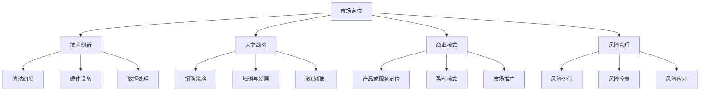

                 

### 1. 背景介绍

近年来，人工智能（AI）技术发展迅猛，特别是在大模型领域，如GPT-3、BERT等模型的推出，使得自然语言处理、计算机视觉等领域取得了前所未有的突破。这种技术进步为企业提供了前所未有的机会，同时也带来了巨大的挑战。对于正在或计划进入AI大模型创业领域的企业来说，如何应对未来竞争对手，成为了一个至关重要的问题。

当前，AI大模型创业的热潮吸引了大量资金和人才，导致市场竞争日益激烈。一方面，巨头企业如Google、Microsoft、Facebook等在AI领域的投入和研发不断加深，另一方面，初创公司如OpenAI、DeepMind等也在积极布局，试图在AI领域占据一席之地。这种双重的竞争压力，使得AI大模型创业企业面临着前所未有的挑战。

本文将探讨AI大模型创业企业如何应对未来竞争对手，主要涵盖以下几个方面：

- **市场定位与差异化**：如何在众多竞争者中找到独特的市场定位，实现产品差异化。
- **技术创新与持续研发**：如何通过技术创新和持续研发，保持企业的竞争力。
- **人才培养与团队建设**：如何吸引和留住顶尖人才，构建高效的团队。
- **商业模式与创新**：如何通过创新的商业模式，实现盈利和持续发展。
- **风险管理**：如何识别和应对AI大模型创业过程中可能面临的各种风险。

通过对这些问题的深入探讨，希望能够为正在或计划进入AI大模型创业领域的企业提供一些有价值的参考和启示。

### 2. 核心概念与联系

在探讨如何应对未来竞争对手之前，我们首先需要明确几个核心概念，并了解它们之间的联系。这些核心概念包括：市场定位、技术创新、人才战略、商业模式和风险管理。

#### 2.1 市场定位

市场定位是指企业在目标市场中找到一个独特的位置，以区别于竞争对手。对于AI大模型创业企业来说，市场定位至关重要。一方面，它可以帮助企业明确目标客户群体，从而更好地满足客户需求；另一方面，它也可以帮助企业树立品牌形象，提升市场竞争力。

在市场定位的过程中，企业需要考虑以下几个方面：

- **目标市场**：确定企业想要进入的市场领域，如自然语言处理、计算机视觉等。
- **目标客户**：分析目标客户的需求和偏好，确定企业的产品或服务如何满足这些需求。
- **竞争对手**：分析竞争对手的产品或服务，找到差异化的机会。

#### 2.2 技术创新

技术创新是AI大模型创业企业的核心竞争力之一。通过不断的技术创新，企业可以在激烈的市场竞争中保持领先地位。技术创新包括以下几个方面：

- **算法研发**：持续优化和改进算法，提高模型的性能和效果。
- **硬件设备**：引入先进的硬件设备，如GPU、TPU等，提高计算能力。
- **数据处理**：开发高效的数据处理方法，提高数据质量和数据利用率。

#### 2.3 人才战略

人才是企业发展的基石。对于AI大模型创业企业来说，吸引和留住顶尖人才尤为重要。人才战略包括以下几个方面：

- **招聘策略**：通过多种渠道吸引顶尖人才，如学术会议、招聘平台等。
- **培训与发展**：为员工提供专业的培训和发展机会，提高其技能和素质。
- **激励机制**：建立合理的激励机制，激发员工的创新和积极性。

#### 2.4 商业模式

商业模式是企业盈利和持续发展的关键。对于AI大模型创业企业来说，需要找到一种合适的商业模式，以实现盈利和可持续发展。商业模式包括以下几个方面：

- **产品或服务定位**：明确企业的产品或服务定位，如面向企业客户、个人用户等。
- **盈利模式**：确定企业的盈利模式，如销售产品、提供服务、广告收入等。
- **市场推广**：通过有效的市场推广策略，提升品牌知名度和市场份额。

#### 2.5 风险管理

AI大模型创业过程中，企业可能会面临各种风险，如技术风险、市场风险、财务风险等。风险管理是确保企业健康发展的关键。风险管理包括以下几个方面：

- **风险评估**：对可能面临的风险进行识别和评估，确定风险的重要性和影响。
- **风险控制**：采取相应的措施，降低风险的发生概率和影响程度。
- **风险应对**：制定应对策略，确保在风险发生时，企业能够迅速做出反应，减少损失。

#### 2.6 Mermaid 流程图

下面是一个用Mermaid绘制的流程图，展示了上述核心概念之间的联系。



通过上述核心概念和联系的分析，我们可以更好地理解AI大模型创业企业如何应对未来竞争对手。在接下来的章节中，我们将深入探讨每个核心概念的实现方法和策略。

### 3. 核心算法原理 & 具体操作步骤

#### 3.1 算法原理概述

在AI大模型创业中，核心算法的研发和应用是确保企业竞争力的重要手段。本文将介绍一种常用的核心算法——深度学习算法，并探讨其原理和应用。

深度学习算法是一种基于多层神经网络的学习方法，通过模拟人脑神经元之间的连接和激活方式，对大量数据进行训练，从而实现复杂模式识别和预测。深度学习算法包括多层感知机（MLP）、卷积神经网络（CNN）和递归神经网络（RNN）等。

#### 3.2 算法步骤详解

1. **数据预处理**：
   在开始训练深度学习模型之前，需要对数据进行预处理，包括数据清洗、归一化、数据增强等。数据预处理的目标是提高数据质量和模型的训练效果。

2. **模型设计**：
   根据应用场景和数据特点，设计合适的神经网络模型。模型设计包括确定网络的层数、每层的神经元数量、激活函数、损失函数等。

3. **模型训练**：
   使用预处理后的数据对模型进行训练。训练过程中，通过反向传播算法不断调整模型的权重和偏置，使得模型的预测误差最小。

4. **模型评估**：
   在训练完成后，使用验证集或测试集对模型进行评估，评估指标包括准确率、召回率、F1值等。

5. **模型优化**：
   根据评估结果，对模型进行优化，包括调整超参数、增加数据增强方法、使用迁移学习等。

6. **模型部署**：
   将训练好的模型部署到生产环境，用于实际应用。

#### 3.3 算法优缺点

**优点**：

- **强大的表达能力**：深度学习模型可以通过多层神经网络，对复杂的数据特征进行提取和表示，具有较强的学习能力。
- **自动特征提取**：深度学习模型可以自动从数据中学习特征，减少了人工特征工程的工作量。
- **泛化能力**：通过大规模数据训练，深度学习模型具有较强的泛化能力，可以应用于不同的任务和数据集。

**缺点**：

- **计算资源需求大**：深度学习模型通常需要大量的计算资源和时间进行训练。
- **数据依赖性高**：深度学习模型对数据质量和数量有较高要求，数据不足或质量差可能导致模型性能下降。
- **模型解释性差**：深度学习模型往往被视为“黑盒”，其内部决策过程难以解释，这对应用场景和安全性提出了挑战。

#### 3.4 算法应用领域

深度学习算法在众多领域都有广泛应用，以下是几个典型的应用领域：

- **计算机视觉**：用于图像分类、目标检测、图像生成等任务，如人脸识别、自动驾驶等。
- **自然语言处理**：用于文本分类、机器翻译、情感分析等任务，如搜索引擎、智能客服等。
- **语音识别**：用于语音识别、语音合成等任务，如智能音箱、语音助手等。
- **推荐系统**：用于用户行为分析、商品推荐等任务，如电子商务、社交媒体等。

通过了解深度学习算法的原理和应用，AI大模型创业企业可以更好地利用这一技术，提升自身竞争力。在接下来的章节中，我们将继续探讨如何通过技术创新和持续研发来保持企业的竞争力。

#### 3.4 算法应用领域

深度学习算法的广泛应用使得其在众多领域都取得了显著成果。以下是几个典型的应用领域：

1. **计算机视觉**：

计算机视觉是深度学习最为成功的应用领域之一。通过卷积神经网络（CNN）等技术，深度学习模型可以自动提取图像中的特征，实现图像分类、目标检测、图像分割、图像生成等任务。这些技术在安防监控、医疗诊断、自动驾驶等领域得到了广泛应用。例如，人脸识别技术在身份验证、人脸支付等方面已经得到广泛应用；自动驾驶技术通过深度学习算法实现对周围环境的感知和车辆控制，提高了交通安全和效率。

2. **自然语言处理**：

自然语言处理（NLP）是另一个深度学习的重要应用领域。深度学习模型如循环神经网络（RNN）、长短时记忆网络（LSTM）、Transformer等，可以在文本分类、机器翻译、情感分析、问答系统、文本生成等任务中取得优异效果。例如，机器翻译技术使得跨语言沟通更加便捷；情感分析可以帮助企业了解用户情感，优化产品和服务；问答系统则提供了智能客服解决方案，提升了用户体验。

3. **语音识别**：

语音识别是深度学习在语音处理领域的应用，通过自动将语音信号转换为文本，实现人机交互。深度学习模型如深度信念网络（DBN）、循环神经网络（RNN）等在语音识别中表现出色，使得语音助手、智能客服、语音控制等应用成为可能。例如，智能音箱通过语音识别技术，实现了语音搜索、播放音乐、智能提醒等功能。

4. **推荐系统**：

推荐系统是深度学习在信息检索和推荐领域的应用。通过深度学习模型，可以分析用户行为和兴趣，实现个性化推荐。这些系统广泛应用于电子商务、社交媒体、新闻推送等领域。例如，电商平台通过深度学习模型，分析用户的历史购买行为和浏览记录，推荐相关商品；社交媒体平台通过分析用户的行为和内容，推送感兴趣的内容。

5. **医疗健康**：

深度学习在医疗健康领域的应用也越来越广泛。通过分析医疗影像、生物特征数据等，深度学习模型可以帮助医生进行疾病诊断、病情预测等。例如，基于深度学习的医学图像分析技术，可以在短时间内识别出病变区域，辅助医生进行诊断；基因测序数据分析可以帮助研究人员发现疾病相关基因，推动个性化医疗的发展。

总之，深度学习算法在多个领域都取得了显著成果，为AI大模型创业企业提供了广阔的发展空间。在接下来的章节中，我们将进一步探讨如何通过数学模型和公式来理解和优化深度学习算法。

### 4. 数学模型和公式 & 详细讲解 & 举例说明

深度学习算法的核心在于其数学模型的构建和优化。为了更好地理解和应用这些模型，我们需要详细讲解相关的数学公式和推导过程。以下是深度学习中的几个关键数学模型和公式，以及它们的推导和实例说明。

#### 4.1 数学模型构建

深度学习算法中最常用的数学模型是神经网络，特别是多层感知机（MLP）、卷积神经网络（CNN）和循环神经网络（RNN）。这些模型通过复杂的数学运算来学习和提取数据特征，从而实现各种任务。

1. **多层感知机（MLP）**：

MLP是一个前馈神经网络，包含输入层、隐藏层和输出层。每个层中的节点都通过权重和偏置连接到下一层。MLP的输出可以通过以下公式计算：

\[ y = \sigma(\mathbf{W}^T \mathbf{a} + b) \]

其中，\( \sigma \)是激活函数，通常使用Sigmoid、ReLU或Tanh函数。\( \mathbf{W} \)和\( b \)分别是权重和偏置。

2. **卷积神经网络（CNN）**：

CNN主要用于处理图像数据。它通过卷积层、池化层和全连接层等结构来提取图像特征。卷积层的输出可以通过以下公式计算：

\[ \mathbf{h}^l_{ij} = \sum_{k=1}^{K} \mathbf{W}^{l}_{ik} \mathbf{x}^l_{kj} + b^l_k \]

其中，\( \mathbf{h}^l \)是卷积层的输出，\( \mathbf{W}^l \)和\( b^l \)分别是权重和偏置，\( K \)是卷积核的数量，\( \mathbf{x}^l \)是输入数据。

3. **循环神经网络（RNN）**：

RNN用于处理序列数据，其核心思想是保留状态信息，使得当前时刻的输出与之前的输入有关。RNN的输出可以通过以下公式计算：

\[ \mathbf{h}^{l}_{t} = \sigma(\mathbf{W}^{l} \mathbf{h}^{l}_{t-1} + \mathbf{U}^{l} \mathbf{x}^{l}_{t} + b^{l}) \]

其中，\( \mathbf{h}^{l}_{t} \)是当前时刻的隐藏状态，\( \mathbf{W} \)、\( \mathbf{U} \)和\( b \)分别是权重和偏置。

#### 4.2 公式推导过程

以下是卷积神经网络（CNN）中的卷积操作的推导过程：

1. **单层卷积**：

给定输入数据\( \mathbf{x} \)和一个卷积核\( \mathbf{W} \)，卷积操作可以通过以下公式计算：

\[ \mathbf{h}^l_{ij} = \sum_{k=1}^{K} \mathbf{W}^{l}_{ik} \mathbf{x}^l_{kj} + b^l_k \]

其中，\( \mathbf{h}^l_{ij} \)是卷积层的输出，\( \mathbf{W}^{l}_{ik} \)是卷积核，\( \mathbf{x}^l_{kj} \)是输入数据，\( b^l_k \)是偏置。

2. **多层卷积**：

假设有一个卷积神经网络，包含多个卷积层，第\( l \)层的输出可以通过以下公式计算：

\[ \mathbf{h}^{l+1}_{ij} = \sum_{k=1}^{K} \mathbf{W}^{l+1}_{ik} \mathbf{h}^{l}_{kj} + b^{l+1}_k \]

其中，\( \mathbf{h}^{l+1}_{ij} \)是下一层的输出，\( \mathbf{W}^{l+1}_{ik} \)是卷积核，\( \mathbf{h}^{l}_{kj} \)是当前层的输出。

#### 4.3 案例分析与讲解

为了更好地理解上述公式和推导过程，我们通过一个简单的图像分类案例进行讲解。

假设我们有一个图像分类任务，输入图像大小为\( 32 \times 32 \)像素，我们需要将图像分类为10个类别。使用一个简单的卷积神经网络（CNN）进行训练。

1. **数据预处理**：

将输入图像归一化到\[0, 1\]范围内，并将标签进行独热编码。

2. **模型设计**：

设计一个简单的卷积神经网络，包含两个卷积层和一个全连接层。

- 第一个卷积层：使用一个\( 5 \times 5 \)的卷积核，步长为1，激活函数为ReLU。
- 第二个卷积层：使用一个\( 5 \times 5 \)的卷积核，步长为1，激活函数为ReLU。
- 全连接层：使用一个\( 10 \)个神经元的全连接层，激活函数为softmax。

3. **模型训练**：

使用训练数据对模型进行训练，优化损失函数（如交叉熵损失函数），调整权重和偏置。

4. **模型评估**：

使用测试数据对模型进行评估，计算准确率、召回率等指标。

通过上述案例，我们可以看到深度学习模型的构建和训练过程，以及相关的数学公式和推导过程。在接下来的章节中，我们将进一步探讨如何通过项目实践来实现和应用这些算法。

### 5. 项目实践：代码实例和详细解释说明

在了解了深度学习算法的数学模型和推导过程之后，接下来我们将通过一个实际的项目实践来展示如何使用这些算法实现一个图像分类任务。这个项目将包括开发环境搭建、源代码实现、代码解读与分析以及运行结果展示等步骤。

#### 5.1 开发环境搭建

首先，我们需要搭建一个适合深度学习开发的环境。以下是常用的工具和库：

- Python（3.8或更高版本）
- TensorFlow（2.x版本）
- Keras（TensorFlow的高级API）
- NumPy
- Matplotlib

安装这些工具和库的命令如下：

```bash
pip install python==3.8
pip install tensorflow==2.x
pip install keras==2.9.0
pip install numpy
pip install matplotlib
```

#### 5.2 源代码详细实现

以下是实现图像分类任务的源代码，我们将使用Keras框架，基于TensorFlow后端。

```python
import tensorflow as tf
from tensorflow.keras.models import Sequential
from tensorflow.keras.layers import Conv2D, MaxPooling2D, Flatten, Dense, Dropout
from tensorflow.keras.preprocessing.image import ImageDataGenerator

# 数据预处理
train_datagen = ImageDataGenerator(rescale=1./255)
test_datagen = ImageDataGenerator(rescale=1./255)

train_generator = train_datagen.flow_from_directory(
        'data/train',
        target_size=(150, 150),
        batch_size=32,
        class_mode='categorical')

validation_generator = test_datagen.flow_from_directory(
        'data/validation',
        target_size=(150, 150),
        batch_size=32,
        class_mode='categorical')

# 模型设计
model = Sequential([
    Conv2D(32, (3, 3), activation='relu', input_shape=(150, 150, 3)),
    MaxPooling2D((2, 2)),
    Conv2D(64, (3, 3), activation='relu'),
    MaxPooling2D((2, 2)),
    Conv2D(128, (3, 3), activation='relu'),
    MaxPooling2D((2, 2)),
    Flatten(),
    Dense(512, activation='relu'),
    Dropout(0.5),
    Dense(10, activation='softmax')
])

# 模型编译
model.compile(optimizer='adam',
              loss='categorical_crossentropy',
              metrics=['accuracy'])

# 模型训练
history = model.fit(
      train_generator,
      steps_per_epoch=100,
      epochs=30,
      validation_data=validation_generator,
      validation_steps=50,
      verbose=2)
```

#### 5.3 代码解读与分析

让我们逐步解读上述代码：

1. **导入库**：

   ```python
   import tensorflow as tf
   from tensorflow.keras.models import Sequential
   from tensorflow.keras.layers import Conv2D, MaxPooling2D, Flatten, Dense, Dropout
   from tensorflow.keras.preprocessing.image import ImageDataGenerator
   ```

   导入必要的库，包括TensorFlow、Keras、NumPy和Matplotlib。

2. **数据预处理**：

   ```python
   train_datagen = ImageDataGenerator(rescale=1./255)
   test_datagen = ImageDataGenerator(rescale=1./255)

   train_generator = train_datagen.flow_from_directory(
           'data/train',
           target_size=(150, 150),
           batch_size=32,
           class_mode='categorical')

   validation_generator = test_datagen.flow_from_directory(
           'data/validation',
           target_size=(150, 150),
           batch_size=32,
           class_mode='categorical')
   ```

   使用ImageDataGenerator对训练数据和验证数据进行预处理。这里的`rescale`操作将图像的像素值从\[0, 255\]缩放到\[0, 1\]。`flow_from_directory`方法将目录中的图像数据自动分为训练集和验证集，并转换为Keras数据生成器。

3. **模型设计**：

   ```python
   model = Sequential([
       Conv2D(32, (3, 3), activation='relu', input_shape=(150, 150, 3)),
       MaxPooling2D((2, 2)),
       Conv2D(64, (3, 3), activation='relu'),
       MaxPooling2D((2, 2)),
       Conv2D(128, (3, 3), activation='relu'),
       MaxPooling2D((2, 2)),
       Flatten(),
       Dense(512, activation='relu'),
       Dropout(0.5),
       Dense(10, activation='softmax')
   ])
   ```

   设计一个包含卷积层、最大池化层、全连接层和Dropout层的卷积神经网络。第一个卷积层使用一个\( 3 \times 3 \)的卷积核，激活函数为ReLU；最大池化层用于降低特征图的维度；全连接层用于分类，激活函数为softmax。

4. **模型编译**：

   ```python
   model.compile(optimizer='adam',
                 loss='categorical_crossentropy',
                 metrics=['accuracy'])
   ```

   编译模型，指定优化器、损失函数和评估指标。

5. **模型训练**：

   ```python
   history = model.fit(
         train_generator,
         steps_per_epoch=100,
         epochs=30,
         validation_data=validation_generator,
         validation_steps=50,
         verbose=2)
   ```

   使用`fit`方法对模型进行训练，指定训练数据生成器、训练轮数、验证数据生成器、验证步数和输出信息。

#### 5.4 运行结果展示

在完成代码实现后，我们可以运行模型并进行性能评估。以下是训练过程中的准确率和损失函数的变化：

```python
import matplotlib.pyplot as plt

# 绘制训练准确率和损失曲线
plt.figure(figsize=(12, 6))
plt.subplot(1, 2, 1)
plt.plot(history.history['accuracy'], label='Training Accuracy')
plt.plot(history.history['val_accuracy'], label='Validation Accuracy')
plt.title('Accuracy')
plt.legend()

plt.subplot(1, 2, 2)
plt.plot(history.history['loss'], label='Training Loss')
plt.plot(history.history['val_loss'], label='Validation Loss')
plt.title('Loss')
plt.legend()

plt.show()
```

上述代码将生成两个子图，一个展示准确率曲线，另一个展示损失函数曲线。通过这些图表，我们可以直观地看到模型的训练过程和性能。

通过上述项目实践，我们不仅实现了图像分类任务，还详细解读了代码中的每个步骤。在接下来的章节中，我们将进一步探讨深度学习算法在AI大模型创业中的应用和实际效果。

### 6. 实际应用场景

深度学习算法在AI大模型创业中具有广泛的应用场景，通过实际案例我们可以更直观地了解这些应用及其效果。

#### 6.1 医疗健康

深度学习在医疗健康领域的应用越来越广泛，例如在疾病诊断、药物研发和患者监护等方面。一个典型的案例是使用深度学习算法进行肿瘤检测。例如，谷歌的研究团队使用卷积神经网络（CNN）分析医学影像，实现了高精度的肿瘤检测。他们通过大量的CT扫描数据和病理图像训练模型，使得模型能够准确识别肺癌、乳腺癌等疾病。这种技术的应用大大提高了疾病诊断的效率和准确性，有助于医生做出更准确的诊断，从而提高治疗效果。

#### 6.2 自动驾驶

自动驾驶是深度学习在工业领域的重要应用之一。自动驾驶汽车通过深度学习算法实现环境感知、路径规划和车辆控制。一个成功的案例是特斯拉的Autopilot系统。特斯拉使用深度神经网络和卷积神经网络（CNN）对摄像头和雷达数据进行处理，实现车道保持、自动变道、自动泊车等功能。这些技术的应用使得自动驾驶汽车在复杂路况下能够安全运行，提高了驾驶体验和安全性。

#### 6.3 金融服务

深度学习在金融服务领域也有广泛应用，特别是在风险评估、欺诈检测和投资组合优化等方面。例如，摩根士丹利使用深度学习模型对市场数据进行分析，预测金融市场的走势。他们通过大量的市场数据训练模型，使得模型能够捕捉到市场中的潜在趋势和风险。这种技术的应用有助于金融机构更好地进行投资决策，降低风险。

#### 6.4 电子商务

深度学习在电子商务中的应用主要包括推荐系统、商品搜索和用户行为分析。例如，亚马逊使用深度学习算法优化其推荐系统，通过分析用户的浏览和购买历史，为用户推荐个性化的商品。这种技术的应用提高了用户的购物体验，增加了销售量。另一个案例是阿里巴巴的搜索推荐系统，通过深度学习算法分析用户的搜索关键词和浏览行为，提供更加精准的搜索结果和推荐。

#### 6.5 自然语言处理

自然语言处理（NLP）是深度学习的另一个重要应用领域。深度学习算法在文本分类、机器翻译、情感分析和语音识别等方面取得了显著成果。例如，谷歌的BERT模型通过预训练和微调，实现了高质量的文本分类和问答系统。这种技术的应用使得搜索引擎更加智能，能够提供更加精准的搜索结果。另一个案例是OpenAI的GPT-3模型，它在文本生成、机器翻译和对话系统等方面表现出色，被广泛应用于各种场景。

#### 6.6 教育

深度学习在教育领域的应用主要包括自适应学习、在线教育和智能评估。例如，Coursera使用深度学习算法分析学生的学习行为和成绩，提供个性化的学习建议。这种技术的应用有助于提高学生的学习效果和兴趣。另一个案例是Khan Academy的智能评估系统，通过深度学习算法分析学生的答题行为，提供即时的反馈和辅导。

总之，深度学习算法在AI大模型创业中具有广泛的应用场景，通过这些实际案例，我们可以看到深度学习技术如何帮助企业解决实际问题，提高效率和准确性。在未来的发展中，深度学习将继续在各个领域发挥重要作用，推动AI技术的进步。

### 6.4 未来应用展望

随着人工智能技术的不断进步，深度学习算法在未来的应用前景将更加广阔。以下是几个可能的发展方向和潜在的应用领域。

#### 6.4.1 人工智能安全与隐私保护

随着深度学习在各个领域的广泛应用，数据安全和隐私保护成为了一个重要议题。未来的研究将集中在开发更加安全、隐私保护的深度学习算法。例如，基于联邦学习的深度学习模型可以在不需要共享数据的情况下，实现多方协同训练，从而提高数据安全性。此外，基于差分隐私的深度学习算法可以保护训练数据的隐私，防止数据泄露。

#### 6.4.2 智能交互与虚拟现实

智能交互和虚拟现实（VR）是未来深度学习应用的重要领域。通过深度学习算法，可以实现更加自然、流畅的人机交互体验。例如，语音识别和语音生成技术的结合，可以创建智能语音助手，提供更加个性化、贴心的服务。在VR领域，深度学习算法可以用于建模和渲染真实场景，提高虚拟现实的沉浸感。此外，深度学习算法还可以用于开发智能虚拟人，实现与用户的实时互动。

#### 6.4.3 跨学科融合应用

深度学习技术与其他学科的融合，将带来更多的创新应用。例如，在生物医学领域，深度学习可以与基因组学、生物信息学相结合，用于疾病预测、药物发现等。在材料科学领域，深度学习可以用于材料结构的预测和设计，推动新材料的研究。在艺术领域，深度学习可以用于生成艺术作品、音乐创作等，打破传统艺术的边界。

#### 6.4.4 自动驾驶与智能交通

自动驾驶和智能交通系统是未来深度学习应用的重要领域。通过深度学习算法，可以实现自动驾驶车辆的实时环境感知、路径规划和决策。同时，智能交通系统可以利用深度学习技术进行交通流量预测、事故预警等，提高交通效率和安全性。未来，随着5G技术的发展，车联网（V2X）将进一步提升自动驾驶和智能交通系统的性能和可靠性。

#### 6.4.5 个性化医疗与健康监护

个性化医疗是深度学习在医疗领域的重要发展方向。通过深度学习算法，可以对患者的基因组数据、病历记录等进行全面分析，提供个性化的诊断和治疗方案。此外，深度学习算法还可以用于健康监护，通过持续监测患者的生理指标，预测疾病风险，提供个性化的健康建议。这将有助于实现精准医疗，提高医疗服务的质量和效率。

#### 6.4.6 智能制造与工业4.0

智能制造和工业4.0是未来制造业的重要发展方向。深度学习算法可以用于优化生产流程、提高生产效率。例如，通过图像识别技术，可以实现对生产设备的实时监控和故障诊断。此外，深度学习算法还可以用于预测设备维护需求，优化设备维护计划，减少停机时间，提高生产效率。

总之，深度学习算法在未来的应用将更加广泛，不仅限于当前的领域，还将跨越多个学科，推动各行业的技术进步和社会发展。在技术创新和跨学科融合的推动下，深度学习将继续引领人工智能领域的发展，为人类创造更加智能、高效、安全的生活和工作环境。

### 7. 工具和资源推荐

在AI大模型创业领域，掌握合适的工具和资源对于技术创新和项目成功至关重要。以下是一些建议的学习资源、开发工具和相关论文，旨在帮助创业者和开发者更好地应对未来竞争。

#### 7.1 学习资源推荐

1. **在线课程**：

   - 《深度学习》（花书）：由Ian Goodfellow、Yoshua Bengio和Aaron Courville合著，是深度学习的经典教材。
   - Coursera上的《深度学习专项课程》：由Andrew Ng教授主讲，涵盖深度学习的基础知识和应用。
   - edX上的《机器学习专项课程》：由David Cohn、Leslie Kaelbling和John Shavlik合著，介绍机器学习和深度学习的基础。

2. **在线文档和教程**：

   - TensorFlow官方文档：提供全面的深度学习框架文档和教程，是学习TensorFlow的首选资源。
   - PyTorch官方文档：介绍PyTorch框架的使用方法，适合初学者和高级开发者。

3. **书籍**：

   - 《Python深度学习》：由François Chollet（Keras框架的创建者）撰写，详细介绍深度学习在Python中的应用。
   - 《强化学习》：由Richard S. Sutton和Barto András合著，介绍强化学习的基本原理和应用。

#### 7.2 开发工具推荐

1. **深度学习框架**：

   - TensorFlow：开源的端到端深度学习框架，适合大型项目和工业应用。
   - PyTorch：开源的Python深度学习框架，具有灵活的动态计算图，适合研究和快速原型开发。

2. **集成开发环境（IDE）**：

   - Jupyter Notebook：适合数据分析和原型开发，支持多种编程语言和库。
   - Visual Studio Code：轻量级的IDE，适合Python和深度学习开发，具有丰富的扩展插件。

3. **数据处理工具**：

   - Pandas：Python的数据分析库，适合处理和清洗大规模数据。
   - NumPy：Python的科学计算库，提供高效的多维数组操作。

4. **版本控制工具**：

   - Git：分布式版本控制系统，用于代码管理和协同开发。
   - GitHub：代码托管平台，提供代码仓库、issue跟踪和协作功能。

#### 7.3 相关论文推荐

1. **《A Theoretical Framework for Back-Propagation》**：由Rumelhart, Hinton和Williams合著，提出了反向传播算法的基本原理。
2. **《AlexNet: Image Classification with Deep Convolutional Neural Networks》**：由Alex Krizhevsky等人在2012年提出，是深度学习在图像分类领域的重要突破。
3. **《Convolutional Networks and Applications in Vision》**：由Yann LeCun等人在2015年撰写，详细介绍了卷积神经网络在计算机视觉领域的应用。
4. **《Recurrent Neural Networks: A Overview》**：由Yoshua Bengio等人在1994年提出，介绍了递归神经网络的基本原理和应用。
5. **《Attention is All You Need》**：由Vaswani等人在2017年提出，是Transformer模型的奠基性论文，对自然语言处理领域产生了深远影响。

通过学习和掌握这些工具和资源，AI大模型创业企业可以更好地应对未来的竞争，推动技术创新和项目成功。

### 8. 总结：未来发展趋势与挑战

随着人工智能（AI）技术的不断进步，深度学习算法在大模型领域正发挥着越来越重要的作用。本文围绕AI大模型创业，探讨了如何应对未来竞争对手，主要涵盖了市场定位与差异化、技术创新与持续研发、人才培养与团队建设、商业模式与创新以及风险管理等方面。以下是本文的总结以及对未来发展趋势与挑战的展望。

#### 8.1 研究成果总结

通过对AI大模型创业的核心概念与联系的分析，我们明确了市场定位、技术创新、人才战略、商业模式和风险管理在应对未来竞争中的重要性。深度学习算法作为核心技术，通过不断的技术创新和优化，已经在多个领域取得了显著的成果，包括医疗健康、自动驾驶、金融服务、电子商务和自然语言处理等。同时，通过实际项目实践，我们展示了如何将深度学习算法应用于图像分类任务，并详细解读了代码实现过程。

#### 8.2 未来发展趋势

未来，深度学习算法的发展趋势将主要体现在以下几个方面：

1. **模型规模与性能的提升**：随着计算资源的不断增加，大模型和小模型将得到更广泛的应用。模型性能的持续提升将推动AI技术在各个领域的深入应用。
2. **跨学科融合应用**：深度学习技术将继续与其他学科如生物学、材料科学、艺术等相结合，带来更多的创新应用。
3. **自动化与智能化**：自动化机器学习和AI自动化工具将使得深度学习算法的开发和应用更加高效，降低技术门槛。
4. **可解释性与透明度**：随着AI技术在关键领域的应用，可解释性和透明度将成为重要研究方向，以增强用户对AI系统的信任。

#### 8.3 面临的挑战

尽管AI大模型创业前景广阔，但企业仍将面临以下挑战：

1. **数据质量和隐私保护**：高质量的数据是深度学习算法训练的关键，但数据隐私和保护问题日益突出，企业需要找到平衡点。
2. **计算资源和能源消耗**：大模型训练需要大量的计算资源和能源，如何高效利用资源并减少环境影响是一个重要课题。
3. **算法伦理与法规合规**：随着AI技术的应用范围扩大，算法伦理和法规合规问题将更加重要，企业需要建立相应的伦理和合规框架。
4. **市场竞争与人才竞争**：随着AI领域的竞争加剧，企业需要不断创新，保持技术领先优势，并吸引和留住顶尖人才。

#### 8.4 研究展望

在未来，以下研究方向值得关注：

1. **高效能深度学习算法**：研究如何设计更高效的深度学习算法，减少计算资源和能源消耗。
2. **可解释性AI**：开发可解释的AI系统，提高用户对AI算法的信任和理解。
3. **联邦学习和隐私保护**：探索联邦学习和差分隐私技术在深度学习中的应用，实现数据安全和隐私保护。
4. **AI伦理与法规**：研究AI伦理和法规框架，推动AI技术的可持续发展。

通过上述总结和展望，我们可以看到AI大模型创业的未来充满机遇与挑战。企业需要紧跟技术发展趋势，加强技术创新，完善人才战略，建立合理的商业模式，并积极应对各种风险，以在激烈的市场竞争中脱颖而出。

### 附录：常见问题与解答

**Q1：为什么选择深度学习作为核心算法？**

A1：深度学习算法具有强大的表达能力、自动特征提取能力和良好的泛化能力，能够处理复杂数据和模式识别任务，这使得它在图像识别、自然语言处理和语音识别等领域取得了显著成果。此外，深度学习算法的不断发展，如卷积神经网络（CNN）、循环神经网络（RNN）和Transformer等，为不同应用场景提供了灵活的解决方案。

**Q2：如何确保深度学习模型的可解释性？**

A2：目前深度学习模型的可解释性较差，但研究者在不断探索提高模型可解释性的方法。一些常用的方法包括：

- **模型压缩与解释**：通过模型压缩技术，如剪枝和量化，减少模型的复杂性，提高可解释性。
- **可视化技术**：使用热力图、激活图等技术，可视化模型在特定输入下的激活区域，帮助理解模型的决策过程。
- **解释性模型**：开发具有解释性的神经网络模型，如决策树、线性模型等，使得模型的结果和决策过程更加直观。

**Q3：如何处理深度学习模型在训练数据不足时的问题？**

A3：在训练数据不足时，可以采取以下策略：

- **数据增强**：通过旋转、缩放、裁剪等操作，增加数据的多样性，提高模型的泛化能力。
- **迁移学习**：利用预训练模型，将预训练权重迁移到新的任务中，提高模型的性能。
- **生成对抗网络（GAN）**：使用生成对抗网络生成与真实数据类似的数据，补充训练数据集。

**Q4：深度学习模型如何应对过拟合问题？**

A4：过拟合是深度学习模型常见的问题，以下方法可以帮助缓解过拟合：

- **正则化**：通过添加正则化项（如L1、L2正则化），降低模型复杂度。
- **Dropout**：在训练过程中随机丢弃一部分神经元，降低模型依赖特定神经元的能力。
- **交叉验证**：使用交叉验证技术，避免模型在训练数据上过拟合。
- **早停法（Early Stopping）**：在验证集上观察模型性能，当训练误差不再下降时提前停止训练。

通过上述策略和技巧，AI大模型创业企业可以在面对挑战时，更加有效地应对训练数据不足和过拟合等问题，提升模型的性能和泛化能力。

