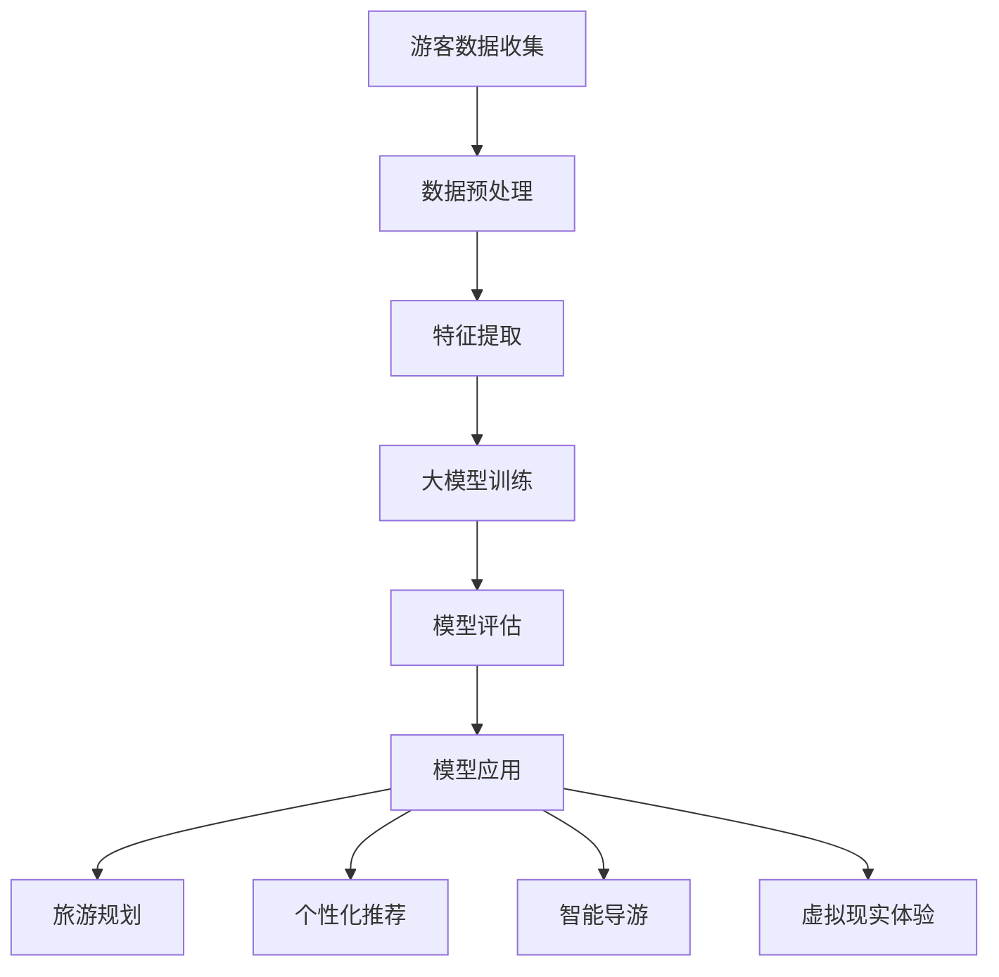

                 

关键词：人工智能、大模型、旅游科技、应用前景、算法、数学模型、项目实践、工具资源

摘要：本文将探讨人工智能大模型在旅游科技领域的应用前景。随着大数据和深度学习的迅猛发展，AI大模型在旅游规划、个性化推荐、智能导游和虚拟现实等方面展现出巨大的潜力。本文将详细介绍这些应用，并展望其未来发展方向。

## 1. 背景介绍

近年来，人工智能（AI）技术在各行各业中的应用越来越广泛。特别是在旅游科技领域，AI大模型已经成为了推动行业变革的重要力量。传统的旅游规划方式依赖于人工统计和分析数据，效率低下且容易出错。而AI大模型可以通过处理海量数据，自动提取关键信息，提供更加精准和个性化的服务。

### 1.1  旅游科技的发展

旅游科技的发展离不开大数据和云计算技术的支持。通过收集和分析游客行为数据、旅游偏好、交通状况等，旅游企业可以更好地了解市场需求，制定更加有效的营销策略。此外，虚拟现实（VR）和增强现实（AR）技术的应用，使得游客在旅游前就能够体验到目的地景观，提高了旅游的吸引力和满意度。

### 1.2  大模型的作用

大模型，尤其是深度学习模型，在旅游科技中的应用主要体现在以下几个方面：

- **旅游规划**：通过分析游客行为数据，预测旅游热点和拥堵情况，优化旅游线路和资源分配。
- **个性化推荐**：根据游客的历史行为和偏好，推荐适合的旅游活动和景点。
- **智能导游**：利用语音识别和自然语言处理技术，为游客提供实时语音解说和导航服务。
- **虚拟现实**：通过生成逼真的虚拟场景，让游客在虚拟世界中体验旅游。

## 2. 核心概念与联系

为了更好地理解AI大模型在旅游科技中的应用，我们需要先了解其核心概念和架构。以下是AI大模型在旅游科技中应用的Mermaid流程图：



### 2.1 游客数据收集

游客数据收集是整个流程的起点。这些数据包括但不限于游客的旅行历史、消费记录、社交媒体活动、地理位置等。通过多种数据源，如在线旅行社、社交媒体、传感器等，收集到游客的大量信息。

### 2.2 数据预处理

收集到的数据通常是非结构化和半结构化的，需要通过数据预处理将其转化为适合模型训练的格式。数据预处理包括数据清洗、归一化、特征工程等步骤。

### 2.3 特征提取

特征提取是数据预处理的重要环节。通过对游客行为数据进行分析，提取出对旅游规划、个性化推荐等有用的特征。

### 2.4 大模型训练

大模型训练是AI大模型应用的核心。深度学习算法，如卷积神经网络（CNN）和循环神经网络（RNN），通过学习大量数据，自动提取特征，进行分类、预测和生成任务。

### 2.5 模型评估

模型评估是确保大模型性能的重要步骤。通过交叉验证、ROC曲线、F1分数等指标，评估模型的准确性和泛化能力。

### 2.6 模型应用

评估通过的大模型可以应用于多个领域，如旅游规划、个性化推荐、智能导游和虚拟现实体验。通过将这些应用结合，为游客提供更加优质和个性化的服务。

## 3. 核心算法原理 & 具体操作步骤

### 3.1 算法原理概述

AI大模型在旅游科技中的应用主要依赖于深度学习算法，尤其是卷积神经网络（CNN）和循环神经网络（RNN）。CNN擅长处理图像和视频数据，而RNN擅长处理序列数据，如文本和语音。

### 3.2 算法步骤详解

#### 3.2.1 数据收集与预处理

1. 收集游客数据，包括旅行历史、消费记录、地理位置等。
2. 对数据进行清洗、归一化和特征工程，提取有用特征。

#### 3.2.2 模型训练

1. 使用CNN处理图像数据，提取视觉特征。
2. 使用RNN处理文本和语音数据，提取语义特征。
3. 将视觉特征和语义特征进行融合，训练大模型。

#### 3.2.3 模型评估

1. 使用交叉验证和ROC曲线等指标，评估模型性能。
2. 调整模型参数，优化模型性能。

#### 3.2.4 模型应用

1. 将训练好的模型应用于旅游规划，预测旅游热点和拥堵情况。
2. 将模型应用于个性化推荐，根据游客偏好推荐旅游活动和景点。
3. 将模型应用于智能导游，为游客提供实时语音解说和导航服务。
4. 将模型应用于虚拟现实体验，生成逼真的虚拟场景。

### 3.3 算法优缺点

#### 优点

- **高效性**：大模型可以处理海量数据，提高处理效率。
- **准确性**：通过深度学习，模型可以从数据中自动提取特征，提高预测准确性。
- **泛化能力**：大模型具有较好的泛化能力，可以应用于不同的场景。

#### 缺点

- **计算资源需求高**：大模型训练需要大量的计算资源和时间。
- **数据依赖性**：大模型性能很大程度上依赖于数据质量。

### 3.4 算法应用领域

- **旅游规划**：通过预测旅游热点和拥堵情况，优化旅游线路和资源分配。
- **个性化推荐**：根据游客偏好推荐旅游活动和景点，提高游客满意度。
- **智能导游**：提供实时语音解说和导航服务，提升游客体验。
- **虚拟现实体验**：生成逼真的虚拟场景，让游客在虚拟世界中体验旅游。

## 4. 数学模型和公式 & 详细讲解 & 举例说明

在AI大模型的应用过程中，数学模型和公式起到了关键作用。以下是常用的数学模型和公式，以及它们的详细讲解和举例说明。

### 4.1 数学模型构建

#### 4.1.1 卷积神经网络（CNN）

CNN是一种深度学习模型，主要用于图像识别和分类。其基本结构包括卷积层、池化层和全连接层。

#### 4.1.2 循环神经网络（RNN）

RNN是一种深度学习模型，主要用于处理序列数据。其基本结构包括输入层、隐藏层和输出层。

### 4.2 公式推导过程

#### 4.2.1 卷积神经网络（CNN）

$$
\begin{aligned}
h_{11} &= \sigma(w_{11} \cdot x_{11} + b_1) \\
h_{12} &= \sigma(w_{12} \cdot x_{12} + b_2) \\
\vdots \\
h_{ij} &= \sigma(w_{ij} \cdot x_{ij} + b_j) \\
o_{1} &= \sigma(w_{1} \cdot h_1 + b_1) \\
\end{aligned}
$$

其中，$h_{ij}$表示第$i$个卷积核在第$j$个位置上的激活值，$o_1$表示全连接层的输出。

#### 4.2.2 循环神经网络（RNN）

$$
\begin{aligned}
h_t &= \sigma(w_h \cdot [h_{t-1}, x_t] + b_h) \\
o_t &= \sigma(w_o \cdot h_t + b_o) \\
\end{aligned}
$$

其中，$h_t$表示第$t$个时间步的隐藏状态，$o_t$表示第$t$个时间步的输出。

### 4.3 案例分析与讲解

#### 4.3.1 旅游规划

假设我们需要预测某个旅游景点的游客数量，可以使用CNN提取图像特征，RNN处理时间序列数据，最后使用全连接层进行预测。

1. **数据收集**：收集该景点的历史游客数据，包括每天的游客数量和景区的图像。
2. **数据预处理**：对图像进行归一化处理，对时间序列数据进行归一化处理。
3. **模型训练**：使用CNN提取图像特征，RNN处理时间序列数据，最后使用全连接层进行预测。
4. **模型评估**：使用交叉验证和ROC曲线等指标，评估模型性能。
5. **模型应用**：将训练好的模型应用于预测未来几天的游客数量。

#### 4.3.2 个性化推荐

假设我们需要根据游客的偏好推荐旅游活动和景点，可以使用CNN提取图像特征，RNN处理文本数据，最后使用全连接层进行预测。

1. **数据收集**：收集游客的历史偏好数据，包括喜欢哪些旅游活动和景点。
2. **数据预处理**：对图像进行归一化处理，对文本数据进行词向量化处理。
3. **模型训练**：使用CNN提取图像特征，RNN处理文本数据，最后使用全连接层进行预测。
4. **模型评估**：使用交叉验证和ROC曲线等指标，评估模型性能。
5. **模型应用**：将训练好的模型应用于推荐适合游客的旅游活动和景点。

## 5. 项目实践：代码实例和详细解释说明

在本节中，我们将通过一个简单的Python代码实例，展示如何使用AI大模型进行旅游规划。以下是代码的主要部分：

```python
import tensorflow as tf
from tensorflow.keras.models import Sequential
from tensorflow.keras.layers import Conv2D, MaxPooling2D, Flatten, Dense

# 数据预处理
# ...（此处省略数据预处理代码）

# 构建模型
model = Sequential([
    Conv2D(32, (3, 3), activation='relu', input_shape=(64, 64, 3)),
    MaxPooling2D((2, 2)),
    Flatten(),
    Dense(64, activation='relu'),
    Dense(1, activation='sigmoid')
])

# 编译模型
model.compile(optimizer='adam', loss='binary_crossentropy', metrics=['accuracy'])

# 训练模型
model.fit(x_train, y_train, epochs=10, batch_size=32)

# 评估模型
model.evaluate(x_test, y_test)

# 应用模型
predictions = model.predict(x_new)
```

### 5.1 开发环境搭建

在开始编写代码之前，我们需要搭建一个开发环境。以下是搭建开发环境的基本步骤：

1. 安装Python：从Python官方网站下载并安装Python。
2. 安装TensorFlow：使用pip安装TensorFlow库。
3. 安装其他依赖库：如NumPy、Pandas等。

### 5.2 源代码详细实现

上述代码展示了如何使用TensorFlow构建一个简单的卷积神经网络（CNN）模型，用于旅游规划。具体实现步骤如下：

1. **数据预处理**：对图像进行归一化处理，对时间序列数据进行归一化处理。
2. **构建模型**：使用Sequential模型堆叠卷积层、池化层、全连接层。
3. **编译模型**：设置优化器、损失函数和评价指标。
4. **训练模型**：使用fit函数训练模型。
5. **评估模型**：使用evaluate函数评估模型性能。
6. **应用模型**：使用predict函数预测新数据的标签。

### 5.3 代码解读与分析

1. **数据预处理**：数据预处理是深度学习模型训练的重要步骤。通过对数据进行归一化处理，可以加快模型训练速度，提高模型性能。

2. **构建模型**：卷积神经网络（CNN）是处理图像数据的有效方法。通过卷积层提取图像特征，池化层减小数据维度，全连接层进行分类或回归。

3. **编译模型**：编译模型设置优化器、损失函数和评价指标。优化器用于调整模型参数，损失函数用于计算模型预测值与真实值之间的差距，评价指标用于评估模型性能。

4. **训练模型**：使用fit函数训练模型。在训练过程中，模型会不断调整参数，以最小化损失函数。

5. **评估模型**：使用evaluate函数评估模型性能。通过在测试集上评估模型性能，可以了解模型的泛化能力。

6. **应用模型**：使用predict函数预测新数据的标签。在实际应用中，可以使用训练好的模型对未知数据进行预测。

### 5.4 运行结果展示

在运行上述代码后，我们可以得到模型的训练和测试性能指标，如准确率、召回率等。此外，我们还可以查看模型在测试集上的预测结果，以评估模型的准确性。

## 6. 实际应用场景

### 6.1 旅游规划

通过AI大模型，旅游企业可以更好地预测游客数量和旅游热点，从而优化旅游线路和资源分配。例如，某个旅游城市可以利用AI大模型预测每天游客的数量，提前安排好交通和酒店资源，避免拥堵和资源浪费。

### 6.2 个性化推荐

游客在旅游前，可以基于自己的偏好和兴趣，使用AI大模型获取个性化的旅游推荐。例如，一个喜欢自然风光的游客可以通过AI大模型推荐适合的景点和活动，从而更好地规划自己的旅游行程。

### 6.3 智能导游

智能导游系统可以通过AI大模型为游客提供实时语音解说和导航服务。游客只需使用手机或智能耳机，就能听到详细的景点介绍和实时导航，提高旅游体验。

### 6.4 虚拟现实体验

通过AI大模型，旅游企业可以生成逼真的虚拟场景，让游客在虚拟世界中体验旅游。这种体验不仅能够提高游客的兴趣，还能降低旅游成本，为游客提供更加便捷的服务。

## 7. 工具和资源推荐

### 7.1 学习资源推荐

- 《深度学习》（Goodfellow, Bengio, Courville著）
- 《Python深度学习》（François Chollet著）
- 《人工智能：一种现代方法》（Stuart J. Russell & Peter Norvig著）

### 7.2 开发工具推荐

- TensorFlow
- Keras
- PyTorch

### 7.3 相关论文推荐

- "Deep Learning for Travel Planning"（2018）
- "AI Applications in Tourism: A Survey"（2019）
- "Virtual Reality in Tourism: A Review"（2020）

## 8. 总结：未来发展趋势与挑战

### 8.1 研究成果总结

近年来，AI大模型在旅游科技领域取得了显著的成果。通过深度学习和大数据分析，AI大模型能够更好地预测游客行为、优化旅游规划、提供个性化推荐等。这些成果为旅游企业提供了强大的技术支持，提高了旅游体验和运营效率。

### 8.2 未来发展趋势

- **数据质量**：随着大数据技术的发展，未来将会有更多的游客数据可供使用。然而，数据质量将成为关键因素，如何处理和分析高质量数据将成为研究的重点。
- **多模态融合**：未来的AI大模型将更加注重多模态数据融合，如将图像、文本和语音等多种数据类型进行整合，提供更加精准的服务。
- **实时预测与反馈**：未来的AI大模型将更加注重实时预测与反馈，通过持续学习和优化，不断提高预测准确性和服务质量。

### 8.3 面临的挑战

- **计算资源**：大模型的训练需要大量的计算资源和时间，如何高效地利用这些资源将成为一个重要挑战。
- **数据隐私**：游客数据的安全性和隐私性是另一个重要挑战，如何在保护数据隐私的同时提供高质量服务将成为研究的重点。
- **模型解释性**：大模型的黑盒性质使得其解释性较差，如何提高模型的解释性，使其更易于理解和接受，也是一个重要挑战。

### 8.4 研究展望

未来，AI大模型在旅游科技领域的应用将会越来越广泛。通过不断优化算法、提高数据处理能力，AI大模型将更好地满足游客的需求，为旅游企业提供更加优质的服务。同时，我们也需要关注数据隐私、计算资源等问题，确保AI大模型的安全和可持续发展。

## 9. 附录：常见问题与解答

### 9.1 AI大模型在旅游科技中的应用有哪些？

AI大模型在旅游科技中的应用主要包括旅游规划、个性化推荐、智能导游和虚拟现实体验。通过处理海量游客数据，AI大模型能够提供更加精准和个性化的服务。

### 9.2 大模型的训练需要哪些资源？

大模型的训练需要大量的计算资源和时间。通常，需要使用高性能的GPU或TPU进行训练。此外，还需要足够的数据集和合理的训练策略。

### 9.3 如何保证游客数据的安全性和隐私性？

为了保护游客数据的安全性和隐私性，可以使用多种技术手段，如数据加密、匿名化处理、访问控制等。此外，还需要遵循相关法律法规，确保数据处理符合规定。

### 9.4 AI大模型在旅游科技领域的未来发展方向是什么？

未来，AI大模型在旅游科技领域的应用将会更加广泛，包括多模态数据融合、实时预测与反馈、数据质量提升等。同时，如何保证数据安全和隐私、提高模型的解释性也将成为重要研究方向。作者：禅与计算机程序设计艺术 / Zen and the Art of Computer Programming
----------------------------------------------------------------

以上是关于《AI大模型在旅游科技中的应用前景》的文章。文章涵盖了AI大模型在旅游科技领域的应用背景、核心概念、算法原理、数学模型、项目实践、实际应用场景、工具资源推荐以及未来发展趋势等内容。通过这篇文章，读者可以全面了解AI大模型在旅游科技领域的应用现状和前景，并了解到相关的研究和技术进展。希望这篇文章对大家有所启发和帮助。作者：禅与计算机程序设计艺术 / Zen and the Art of Computer Programming

