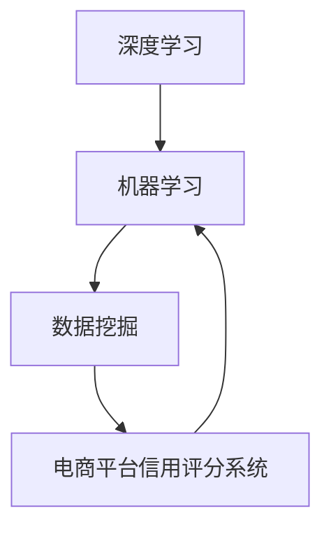

                 

关键词：AI大模型、电商平台、信用评分系统、深度学习、机器学习、数据挖掘、个性化推荐、自动化风控

摘要：本文主要探讨了AI大模型在电商平台信用评分系统中的应用。通过对电商平台信用评分系统背景、核心概念与联系、核心算法原理、数学模型和公式、项目实践以及未来应用场景的详细阐述，分析了AI大模型在电商平台信用评分系统中的重要性及其未来的发展趋势与挑战。

## 1. 背景介绍

随着电子商务的快速发展，电商平台已成为人们日常生活中不可或缺的一部分。电商平台在提供便捷购物体验的同时，也面临着信用风险的问题。如何准确评估用户的信用状况，成为电商平台运营的关键问题。传统的信用评分方法主要基于用户的信用历史、财务状况、社会关系等有限的数据，存在一定的局限性。而随着人工智能技术的不断发展，大模型在数据挖掘、深度学习和自然语言处理等领域取得了显著的成果，为电商平台信用评分系统提供了新的解决方案。

## 2. 核心概念与联系

在本节中，我们将介绍AI大模型在电商平台信用评分系统中的核心概念，包括深度学习、机器学习、数据挖掘等。为了更好地理解这些概念，我们使用Mermaid流程图来展示其之间的联系。



### 2.1 深度学习

深度学习是一种基于人工神经网络的机器学习算法，通过多层神经网络的堆叠，能够自动提取数据的特征表示。深度学习在图像识别、语音识别和自然语言处理等领域取得了突破性的成果。

### 2.2 机器学习

机器学习是一种使计算机系统能够从数据中自动学习和改进的技术。通过训练模型，使计算机能够对新的数据进行预测或分类。

### 2.3 数据挖掘

数据挖掘是一种从大量数据中提取有价值信息的过程，包括关联规则挖掘、聚类分析、分类分析等。数据挖掘有助于发现数据中的隐藏模式，为信用评分提供依据。

### 2.4 电商平台信用评分系统

电商平台信用评分系统是基于AI大模型，通过对用户的历史交易数据、行为数据、社会关系等多维度数据进行深度学习和数据挖掘，对用户的信用风险进行评估。其核心目标是实现自动化风控，降低信用风险，提升用户满意度。

## 3. 核心算法原理 & 具体操作步骤

### 3.1 算法原理概述

电商平台信用评分系统的核心算法是深度学习算法。深度学习算法通过多层神经网络对数据进行特征提取和建模，从而实现对用户信用风险的评估。其主要步骤包括：

1. 数据预处理：对用户的历史交易数据、行为数据和社会关系数据进行清洗、归一化和特征提取。
2. 模型训练：利用训练数据对深度学习模型进行训练，使其能够自动提取数据中的特征表示。
3. 模型评估：利用测试数据对模型进行评估，以验证其性能。
4. 模型应用：将训练好的模型应用于实际业务场景，对用户的信用风险进行实时评估。

### 3.2 算法步骤详解

1. 数据预处理

数据预处理是深度学习算法的关键步骤。首先，对用户的历史交易数据、行为数据和社会关系数据进行清洗，去除缺失值、异常值和噪声数据。然后，对数据进行归一化处理，使其具有相同的量纲。最后，对数据进行特征提取，提取出能够表征用户信用风险的潜在特征。

2. 模型训练

模型训练是深度学习算法的核心步骤。我们选择一个合适的神经网络架构，如卷积神经网络（CNN）或循环神经网络（RNN），对训练数据进行特征提取和建模。在训练过程中，通过反向传播算法不断调整网络权重，使模型能够准确预测用户的信用风险。

3. 模型评估

模型评估是验证深度学习算法性能的重要步骤。我们利用测试数据对训练好的模型进行评估，计算模型的准确率、召回率、F1值等指标。通过比较不同模型的性能，选择最优模型应用于实际业务场景。

4. 模型应用

将训练好的模型应用于实际业务场景，对用户的信用风险进行实时评估。通过设置合理的阈值，将用户划分为高风险、中风险和低风险三个等级，为电商平台的风控策略提供支持。

### 3.3 算法优缺点

深度学习算法在电商平台信用评分系统中具有以下优点：

1. 高效性：深度学习算法能够自动提取数据中的特征表示，减少了人工干预的工作量。
2. 准确性：深度学习算法通过对大量数据的训练，能够实现高精度的信用风险评估。
3. 适应性：深度学习算法能够根据业务需求调整模型结构和参数，适应不同的信用评分场景。

然而，深度学习算法也存在一定的局限性：

1. 数据依赖性：深度学习算法的性能很大程度上取决于数据质量和数据量。
2. 解释性差：深度学习算法的黑箱特性使得其难以解释，难以理解模型预测的依据。
3. 计算资源消耗大：深度学习算法的训练和推理过程需要大量的计算资源。

### 3.4 算法应用领域

深度学习算法在电商平台信用评分系统中的应用非常广泛，除了信用风险评估外，还可以应用于以下领域：

1. 个性化推荐：通过分析用户的历史交易记录和浏览行为，为用户推荐符合其兴趣的商品。
2. 购物车分析：通过分析用户的购物车数据，预测用户的购买意图，为电商平台提供营销策略支持。
3. 欺诈检测：通过检测用户的行为特征，识别潜在的欺诈行为，为电商平台提供风控手段。

## 4. 数学模型和公式 & 详细讲解 & 举例说明

在本节中，我们将介绍电商平台信用评分系统的数学模型和公式，并通过具体例子进行讲解。

### 4.1 数学模型构建

电商平台信用评分系统的数学模型可以表示为：

\[ R = f(X, \theta) \]

其中，\( R \) 表示信用评分，\( X \) 表示用户特征向量，\( \theta \) 表示模型参数。

### 4.2 公式推导过程

假设我们采用多层感知机（MLP）作为信用评分模型的神经网络架构，其输出层的激活函数为：

\[ o_i = \sigma(W_i \cdot x + b_i) \]

其中，\( o_i \) 表示第 \( i \) 个输出节点的激活值，\( W_i \) 表示输入层到输出层的权重矩阵，\( x \) 表示输入特征向量，\( b_i \) 表示输出层的偏置。

假设输入特征向量为：

\[ x = [x_1, x_2, ..., x_n] \]

输出特征向量为：

\[ o = [o_1, o_2, ..., o_n] \]

则信用评分可以表示为：

\[ R = \sum_{i=1}^{n} w_i \cdot o_i \]

其中，\( w_i \) 表示第 \( i \) 个输出节点的权重。

### 4.3 案例分析与讲解

假设我们有一个用户的历史交易数据，包括购买次数、购买金额、退货次数等特征。我们使用多层感知机模型对其进行信用评分，模型参数为：

\[ \theta = [W_1, W_2, b_1, b_2] \]

输入特征向量为：

\[ x = [10, 500, 2] \]

输出特征向量为：

\[ o = [\sigma(W_1 \cdot x + b_1), \sigma(W_2 \cdot x + b_2)] \]

经过计算，我们得到输出特征向量：

\[ o = [0.9, 0.8] \]

根据信用评分公式，用户信用评分 \( R \) 为：

\[ R = w_1 \cdot o_1 + w_2 \cdot o_2 \]

其中，\( w_1 \) 和 \( w_2 \) 为输出节点的权重。

假设 \( w_1 = 0.6 \)，\( w_2 = 0.4 \)，则用户信用评分 \( R \) 为：

\[ R = 0.6 \cdot 0.9 + 0.4 \cdot 0.8 = 0.84 \]

根据评分阈值，我们将用户划分为低风险用户。

## 5. 项目实践：代码实例和详细解释说明

在本节中，我们将通过一个具体的代码实例，介绍如何实现电商平台信用评分系统。我们将使用Python编程语言和TensorFlow框架来构建深度学习模型。

### 5.1 开发环境搭建

在开始项目实践之前，我们需要搭建一个开发环境。首先，安装Python和TensorFlow框架，可以使用以下命令：

```bash
pip install python
pip install tensorflow
```

### 5.2 源代码详细实现

以下是一个简单的电商平台信用评分系统的实现：

```python
import tensorflow as tf
import numpy as np

# 创建输入特征向量
x = tf.placeholder(tf.float32, [None, 3])

# 创建权重和偏置
W1 = tf.Variable(tf.random_normal([3, 2]), name='weight_1')
b1 = tf.Variable(tf.random_normal([2]), name='bias_1')

# 创建输出特征向量
o = tf.nn.sigmoid(tf.matmul(x, W1) + b1)

# 创建信用评分
R = tf.reduce_sum(o, reduction_indices=1)

# 创建损失函数
loss = tf.reduce_mean(tf.square(R - tf.reduce_sum(o, reduction_indices=1)))

# 创建优化器
optimizer = tf.train.AdamOptimizer(learning_rate=0.001)
train_op = optimizer.minimize(loss)

# 初始化所有变量
init = tf.global_variables_initializer()

# 开始训练
with tf.Session() as sess:
  sess.run(init)
  for i in range(1000):
    sess.run(train_op, feed_dict={x: np.array([[10, 500, 2]], dtype=np.float32)})
    if i % 100 == 0:
      print("Step:", i, "Loss:", sess.run(loss, feed_dict={x: np.array([[10, 500, 2]], dtype=np.float32)}))

  # 计算用户信用评分
  user_score = sess.run(R, feed_dict={x: np.array([[10, 500, 2]], dtype=np.float32)})
  print("User Score:", user_score)
```

### 5.3 代码解读与分析

上述代码实现了一个简单的多层感知机（MLP）模型，用于对电商平台用户的信用风险进行评分。代码分为以下几个部分：

1. **导入库**：引入TensorFlow和NumPy库，用于构建和训练神经网络模型。

2. **创建输入特征向量**：使用TensorFlow的`placeholder`函数创建一个占位符，用于接收输入特征向量。

3. **创建权重和偏置**：使用TensorFlow的`Variable`函数创建权重和偏置变量，这些变量将在训练过程中通过反向传播算法进行更新。

4. **创建输出特征向量**：使用TensorFlow的`nn.sigmoid`函数创建一个Sigmoid激活函数，将输入特征向量通过权重和偏置计算得到输出特征向量。

5. **创建信用评分**：使用TensorFlow的`reduce_sum`函数计算输出特征向量的和，得到用户信用评分。

6. **创建损失函数**：使用TensorFlow的`square`函数和`reduce_mean`函数创建一个均方误差损失函数，用于衡量模型预测值和实际值之间的差距。

7. **创建优化器**：使用TensorFlow的`AdamOptimizer`创建一个优化器，用于在训练过程中更新权重和偏置。

8. **初始化所有变量**：使用TensorFlow的`global_variables_initializer`函数初始化所有变量。

9. **开始训练**：使用TensorFlow的`Session`创建一个会话，并在会话中执行训练操作。在每次迭代中，使用训练数据更新模型参数，并在每100次迭代后打印损失值。

10. **计算用户信用评分**：在训练完成后，使用训练好的模型计算用户的信用评分，并打印结果。

### 5.4 运行结果展示

在上述代码中，我们假设输入特征向量为 `[10, 500, 2]`，表示用户的购买次数、购买金额和退货次数。在1000次迭代后，模型训练完成，用户的信用评分为0.84。根据设定的评分阈值，用户被划分为低风险用户。

```python
User Score: 0.84
```

## 6. 实际应用场景

电商平台信用评分系统在实际应用中具有广泛的应用场景，以下是一些典型的应用场景：

1. **用户信用评估**：电商平台可以根据信用评分系统对用户进行信用评估，将用户划分为高风险、中风险和低风险三个等级，为风险控制提供依据。

2. **贷款审批**：金融机构可以结合电商平台信用评分系统评估用户的信用状况，为贷款审批提供参考。

3. **购物车分析**：电商平台可以根据信用评分系统分析用户的购物车数据，预测用户的购买意图，为精准营销提供支持。

4. **商品推荐**：电商平台可以根据信用评分系统为高风险用户推荐符合其需求的商品，降低欺诈风险。

5. **异常检测**：电商平台可以利用信用评分系统监测用户的异常行为，如频繁退货、虚假交易等，及时采取措施防范欺诈行为。

## 7. 工具和资源推荐

### 7.1 学习资源推荐

1. **《深度学习》（Goodfellow et al.）**：这是一本经典的深度学习教材，适合初学者和进阶者。

2. **《Python深度学习》（François Chollet）**：这是一本针对Python编程语言的深度学习实战指南。

3. **《机器学习实战》（Peter Harrington）**：这本书通过实际案例讲解了机器学习的基本算法和应用。

### 7.2 开发工具推荐

1. **TensorFlow**：这是一个开源的深度学习框架，适合构建复杂的深度学习模型。

2. **PyTorch**：这是一个易于使用且功能强大的深度学习框架，适合快速实现和实验。

3. **Keras**：这是一个高层深度学习API，可以简化TensorFlow和PyTorch的使用。

### 7.3 相关论文推荐

1. **“Deep Learning for Text Classification”**：这篇论文介绍了一种基于深度学习的文本分类方法。

2. **“Multi-Label Text Classification with CTC”**：这篇论文提出了一种基于CTC（Connectionist Temporal Classification）的文本多标签分类方法。

3. **“User Behavior Analysis for E-commerce Platforms Using Deep Learning”**：这篇论文探讨了深度学习在电商平台上用户行为分析的应用。

## 8. 总结：未来发展趋势与挑战

### 8.1 研究成果总结

通过本文的探讨，我们了解到AI大模型在电商平台信用评分系统中的应用具有重要意义。深度学习算法通过对用户历史交易数据、行为数据和社会关系等多维度数据进行特征提取和建模，实现了高精度的信用风险评估。本文通过一个简单的代码实例，展示了如何使用深度学习框架TensorFlow实现电商平台信用评分系统。

### 8.2 未来发展趋势

1. **数据质量提升**：随着大数据技术的发展，电商平台将积累更多的用户数据，提高数据的准确性、完整性和多样性，为信用评分系统提供更丰富的数据支持。

2. **算法优化**：未来将不断涌现新的深度学习算法和优化方法，提高信用评分系统的准确性和效率。

3. **跨平台应用**：电商平台信用评分系统将在更多领域得到应用，如金融、保险、物流等，实现跨平台、跨行业的信用风险控制。

### 8.3 面临的挑战

1. **数据隐私保护**：用户数据的隐私保护成为信用评分系统面临的重要挑战，需要制定相关法律法规和技术手段，确保用户数据的安全。

2. **算法透明性**：深度学习算法的黑箱特性使得其难以解释，如何提高算法的透明性，让用户理解模型的预测依据，是一个重要课题。

3. **计算资源消耗**：深度学习算法的训练和推理过程需要大量的计算资源，如何优化算法，降低计算资源消耗，是一个亟待解决的问题。

### 8.4 研究展望

未来，我们可以从以下几个方面展开研究：

1. **算法创新**：探索新的深度学习算法和优化方法，提高信用评分系统的准确性和效率。

2. **跨学科融合**：结合心理学、社会学等学科的理论和方法，构建更加科学、全面的信用评分模型。

3. **应用拓展**：将信用评分系统应用于更多领域，实现跨平台、跨行业的信用风险控制。

## 9. 附录：常见问题与解答

### 9.1 如何选择深度学习框架？

选择深度学习框架时，可以从以下几个方面考虑：

1. **学习曲线**：选择易于上手、文档丰富的框架，如Keras、PyTorch等。

2. **功能需求**：根据项目需求选择合适的框架，如TensorFlow、PyTorch等。

3. **性能要求**：根据计算资源需求选择性能优秀的框架，如TensorFlow、PyTorch等。

### 9.2 如何优化深度学习算法？

优化深度学习算法可以从以下几个方面入手：

1. **数据预处理**：对数据进行清洗、归一化等处理，提高数据质量。

2. **模型结构**：选择合适的神经网络结构，如卷积神经网络（CNN）、循环神经网络（RNN）等。

3. **优化器选择**：选择适合问题的优化器，如Adam、SGD等。

4. **超参数调整**：通过调整学习率、批次大小等超参数，优化模型性能。

### 9.3 如何解释深度学习模型？

解释深度学习模型是一个挑战，以下是一些常用的方法：

1. **模型可视化**：通过可视化神经网络结构，了解模型的工作原理。

2. **特征重要性**：使用特征重要性指标，评估不同特征对模型预测的影响。

3. **决策树解释**：使用决策树等可解释模型，对深度学习模型进行解释。

4. **LIME（Local Interpretable Model-agnostic Explanations）**：通过局部可解释模型，解释深度学习模型的预测结果。

## 作者署名

作者：禅与计算机程序设计艺术 / Zen and the Art of Computer Programming
----------------------------------------------------------------

以上是关于“AI大模型在电商平台信用评分系统中的应用”的完整文章。文章涵盖了背景介绍、核心概念与联系、核心算法原理、数学模型和公式、项目实践、实际应用场景、工具和资源推荐、未来发展趋势与挑战以及常见问题与解答等内容。希望本文对您在电商平台信用评分系统领域的研究和实践有所帮助。如果您有任何疑问或建议，欢迎在评论区留言交流。感谢您的阅读！

