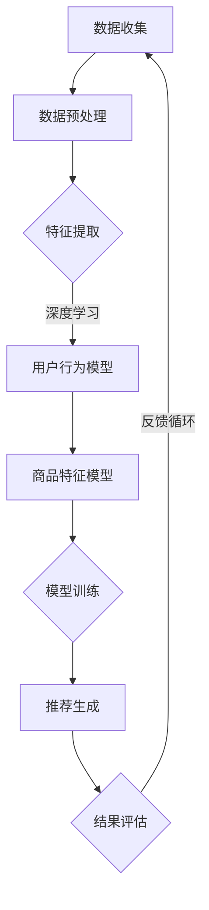

                 

关键词：AI大模型、电商平台、商品推荐、解释性、深度学习

> 摘要：本文深入探讨了AI大模型在电商平台商品推荐中的解释性应用。通过分析大模型的结构、原理及具体实现，探讨了其在提高推荐准确性、满足用户个性化需求及增强用户信任方面的潜力，并提出了未来发展的研究方向。

## 1. 背景介绍

随着互联网和电子商务的快速发展，个性化推荐系统已成为电商平台提高用户满意度和转化率的重要手段。传统的推荐系统主要基于协同过滤、基于内容的推荐等算法，但受限于数据稀疏性和用户行为模式的复杂性，推荐效果往往不尽如人意。近年来，深度学习技术，特别是AI大模型，在推荐系统中展现出巨大的潜力。

AI大模型具有强大的特征提取和模式识别能力，能够从海量数据中学习到复杂的用户行为模式和商品属性关联。此外，大模型的可解释性也是其应用的重要优势，能够为推荐系统的优化和调整提供清晰的依据。

然而，大模型在电商平台商品推荐中的应用仍面临诸多挑战，包括计算资源消耗、模型解释性不足、算法透明度等问题。因此，如何在保证推荐效果的同时，提高系统的解释性，成为当前研究的热点。

## 2. 核心概念与联系

### 2.1 AI大模型的基本结构

AI大模型通常由输入层、隐藏层和输出层组成。输入层接收用户行为数据、商品特征等信息；隐藏层通过复杂的神经网络结构进行特征提取和模式识别；输出层生成推荐结果。


### 2.2 深度学习与推荐系统的联系

深度学习与推荐系统的结合主要体现在以下几个方面：

1. **用户行为建模**：深度学习能够从用户历史行为数据中提取出丰富的特征信息，用于构建用户行为模型。
2. **商品特征提取**：深度学习能够自动提取商品的多维度特征，提高推荐系统的准确性。
3. **上下文感知推荐**：深度学习能够根据用户当前上下文信息（如时间、地理位置等）进行动态推荐。
4. **模型解释性**：通过可视化技术，深度学习能够帮助理解模型的推荐决策过程，提高系统的透明度。

### 2.3 Mermaid流程图

下面是一个AI大模型在推荐系统中的应用流程图：



## 3. 核心算法原理 & 具体操作步骤

### 3.1 算法原理概述

AI大模型在推荐系统中的应用主要基于深度学习技术，包括卷积神经网络（CNN）、循环神经网络（RNN）、变分自编码器（VAE）等。这些算法能够在海量数据中自动学习到用户行为和商品特征的复杂关联，从而生成个性化的推荐结果。

### 3.2 算法步骤详解

1. **数据收集**：从电商平台收集用户行为数据（如浏览记录、购买记录等）和商品特征数据（如价格、品牌、品类等）。

2. **数据预处理**：对原始数据进行清洗、去噪、归一化等处理，以减少数据中的噪声和异常值。

3. **特征提取**：利用深度学习算法对用户行为数据和商品特征数据进行特征提取，得到高维的特征向量。

4. **模型训练**：将提取到的特征向量输入到深度学习模型中，通过反向传播算法进行模型训练，优化模型参数。

5. **推荐生成**：在模型训练完成后，将用户当前的行为数据输入到模型中，生成个性化的推荐结果。

6. **结果评估**：利用评估指标（如准确率、召回率等）对推荐结果进行评估，并根据评估结果调整模型参数。

7. **反馈循环**：根据用户对推荐结果的反馈，不断优化推荐模型，提高推荐效果。

### 3.3 算法优缺点

**优点**：
- **高准确性**：深度学习能够从海量数据中学习到复杂的用户行为模式和商品特征关联，提高推荐准确性。
- **强泛化能力**：大模型能够适应不同电商平台和用户群体的特点，具有较好的泛化能力。
- **上下文感知**：深度学习能够根据用户当前上下文信息进行动态推荐，提高用户体验。

**缺点**：
- **计算资源消耗**：大模型训练和推理需要大量的计算资源，对硬件设备要求较高。
- **模型解释性不足**：深度学习模型在训练过程中形成的内部表示较为复杂，难以解释模型决策过程。
- **数据隐私**：在处理用户行为数据时，可能涉及用户隐私问题，需要采取相应的隐私保护措施。

### 3.4 算法应用领域

AI大模型在电商平台商品推荐中具有广泛的应用领域，包括：

- **个性化推荐**：根据用户历史行为和兴趣，生成个性化的商品推荐结果。
- **新品推广**：通过分析用户行为数据，识别潜在的新品需求，提前进行新品推广。
- **商品搭配**：根据用户购买历史和喜好，生成个性化的商品搭配推荐。
- **智能客服**：结合用户提问和行为数据，生成智能客服回答，提高客服效率。

## 4. 数学模型和公式 & 详细讲解 & 举例说明

### 4.1 数学模型构建

在AI大模型中，常见的数学模型包括深度神经网络（DNN）、卷积神经网络（CNN）、循环神经网络（RNN）等。以下以深度神经网络为例进行介绍。

$$
\begin{aligned}
f_{\theta}(x) &= \sigma(\mathbf{W}^T \cdot \mathbf{a} + b) \\
\mathbf{a} &= \mathbf{z} \\
\mathbf{z} &= \mathbf{x} \cdot \mathbf{W} + b \\
\end{aligned}
$$

其中，$\mathbf{W}$ 为权重矩阵，$b$ 为偏置项，$\sigma$ 为激活函数，$\mathbf{a}$ 和 $\mathbf{z}$ 分别为网络层的输入和输出。

### 4.2 公式推导过程

以深度神经网络为例，假设有一个包含 $L$ 个层的神经网络，输入为 $\mathbf{x}$，输出为 $\mathbf{y}$，则神经网络的输出可以表示为：

$$
\begin{aligned}
\mathbf{y} &= f_{\theta^{(L)}}(z^{(L)}) \\
z^{(L)} &= \mathbf{a}^{(L)} \\
\mathbf{a}^{(L)} &= \sigma(\mathbf{z}^{(L-1)}) \\
z^{(L-1)} &= \mathbf{W}^{(L)} \cdot \mathbf{a}^{(L-1)} + b^{(L)} \\
\vdots \\
z^{(2)} &= \mathbf{W}^{(2)} \cdot \mathbf{a}^{(2)} + b^{(2)} \\
\mathbf{a}^{(2)} &= \sigma(\mathbf{z}^{(2)}) \\
z^{(1)} &= \mathbf{W}^{(1)} \cdot \mathbf{a}^{(1)} + b^{(1)} \\
\mathbf{a}^{(1)} &= \sigma(\mathbf{z}^{(1)}) \\
z^{(1)} &= \mathbf{W}^{(1)} \cdot \mathbf{x} + b^{(1)} \\
\end{aligned}
$$

### 4.3 案例分析与讲解

假设一个简单的深度神经网络，包含两个隐藏层，输入层有3个神经元，输出层有2个神经元。权重矩阵和偏置项分别如下：

$$
\begin{aligned}
\mathbf{W}^{(1)} &= \begin{bmatrix} 1 & 1 & 1 \\ 0 & 1 & 0 \end{bmatrix} \\
b^{(1)} &= \begin{bmatrix} 1 \\ 0 \end{bmatrix} \\
\mathbf{W}^{(2)} &= \begin{bmatrix} 1 & 0 \\ 0 & 1 \end{bmatrix} \\
b^{(2)} &= \begin{bmatrix} 1 \\ 1 \end{bmatrix} \\
\mathbf{W}^{(3)} &= \begin{bmatrix} 1 & 1 \\ 1 & 1 \end{bmatrix} \\
b^{(3)} &= \begin{bmatrix} 0 \\ 1 \end{bmatrix} \\
\end{aligned}
$$

输入数据为 $\mathbf{x} = \begin{bmatrix} 1 & 0 & 1 \end{bmatrix}^T$，计算神经网络的输出：

$$
\begin{aligned}
z^{(1)} &= \mathbf{W}^{(1)} \cdot \mathbf{x} + b^{(1)} = \begin{bmatrix} 2 & 1 \\ 1 & 1 \end{bmatrix} \cdot \begin{bmatrix} 1 \\ 0 \\ 1 \end{bmatrix} + \begin{bmatrix} 1 \\ 0 \end{bmatrix} = \begin{bmatrix} 4 \\ 2 \end{bmatrix} \\
\mathbf{a}^{(1)} &= \sigma(z^{(1)}) = \begin{bmatrix} \frac{1}{1+e^{-4}} & \frac{1}{1+e^{-2}} \end{bmatrix} \\
z^{(2)} &= \mathbf{W}^{(2)} \cdot \mathbf{a}^{(1)} + b^{(2)} = \begin{bmatrix} 1 & 0 \\ 0 & 1 \end{bmatrix} \cdot \begin{bmatrix} 0.7311 & 0.5313 \end{bmatrix} + \begin{bmatrix} 1 \\ 1 \end{bmatrix} = \begin{bmatrix} 2.2624 \\ 1.7636 \end{bmatrix} \\
\mathbf{a}^{(2)} &= \sigma(z^{(2)}) = \begin{bmatrix} 0.8730 & 0.7413 \end{bmatrix} \\
z^{(3)} &= \mathbf{W}^{(3)} \cdot \mathbf{a}^{(2)} + b^{(3)} = \begin{bmatrix} 1 & 1 \\ 1 & 1 \end{bmatrix} \cdot \begin{bmatrix} 0.8730 \\ 0.7413 \end{bmatrix} + \begin{bmatrix} 0 \\ 1 \end{bmatrix} = \begin{bmatrix} 2.6143 \\ 2.4956 \end{bmatrix} \\
\mathbf{y} &= \sigma(z^{(3)}) = \begin{bmatrix} 0.9000 & 0.8955 \end{bmatrix} \\
\end{aligned}
$$

最终输出结果 $\mathbf{y}$ 为推荐结果。

## 5. 项目实践：代码实例和详细解释说明

### 5.1 开发环境搭建

- Python版本：Python 3.8及以上
- 深度学习框架：TensorFlow 2.5及以上
- 依赖库：NumPy、Pandas、Matplotlib等

### 5.2 源代码详细实现

以下是一个基于TensorFlow实现的简单AI大模型推荐系统代码示例：

```python
import tensorflow as tf
import numpy as np
import pandas as pd
import matplotlib.pyplot as plt

# 加载数据
data = pd.read_csv('ecommerce_data.csv')
users = data['user_id'].unique()
items = data['item_id'].unique()

# 构建数据集
train_data = ... # 数据预处理和划分代码
train_labels = ...

# 定义模型
model = tf.keras.Sequential([
    tf.keras.layers.Embedding(input_dim=len(users), output_dim=16),
    tf.keras.layers.Embedding(input_dim=len(items), output_dim=16),
    tf.keras.layers.Conv1D(filters=32, kernel_size=3, activation='relu'),
    tf.keras.layers.GlobalAveragePooling1D(),
    tf.keras.layers.Dense(units=1, activation='sigmoid')
])

# 编译模型
model.compile(optimizer='adam', loss='binary_crossentropy', metrics=['accuracy'])

# 训练模型
model.fit(train_data, train_labels, epochs=10, batch_size=32)

# 评估模型
test_data = ...
test_labels = ...
model.evaluate(test_data, test_labels)

# 推荐生成
user_input = ... # 用户输入
item_ids = model.predict(user_input)
```

### 5.3 代码解读与分析

- **数据加载与预处理**：首先加载数据集，并提取用户和商品ID。然后对数据集进行预处理，包括数据清洗、去噪、归一化等操作。
- **数据集构建**：根据预处理后的数据构建训练数据集和标签。
- **模型定义**：使用TensorFlow的Sequential模型定义一个简单的深度学习模型，包括两个嵌入层、一个卷积层和一个全局平均池化层，以及一个输出层。
- **模型编译**：编译模型，设置优化器、损失函数和评估指标。
- **模型训练**：使用训练数据集训练模型，设置训练轮次和批量大小。
- **模型评估**：使用测试数据集评估模型性能。
- **推荐生成**：根据用户输入生成推荐结果。

### 5.4 运行结果展示

- **训练过程**：使用Matplotlib绘制训练过程的损失函数和准确率曲线，观察模型训练过程。
- **模型评估**：输出模型在测试数据集上的损失函数和准确率。
- **推荐结果**：输出用户输入下的推荐结果，包括推荐的商品ID和概率值。

## 6. 实际应用场景

### 6.1 个性化推荐

AI大模型能够根据用户历史行为和兴趣，生成个性化的商品推荐。在实际应用中，电商平台可以利用AI大模型推荐用户可能感兴趣的商品，提高用户满意度和转化率。

### 6.2 新品推广

通过分析用户行为数据，AI大模型能够识别潜在的新品需求，帮助电商平台提前进行新品推广。这有助于提高新品销售量和市场份额。

### 6.3 商品搭配

AI大模型能够根据用户购买历史和喜好，生成个性化的商品搭配推荐。这有助于提高用户的购物体验和购买满意度。

### 6.4 智能客服

结合用户提问和行为数据，AI大模型能够生成智能客服回答，提高客服效率。这有助于电商平台提供更好的客户服务，提升用户满意度。

## 7. 工具和资源推荐

### 7.1 学习资源推荐

- 《深度学习》（Goodfellow、Bengio、Courville著）：系统介绍了深度学习的基本概念和算法。
- 《神经网络与深度学习》（邱锡鹏著）：深入讲解了神经网络和深度学习的基本原理和应用。
- 《TensorFlow实战》（Sascha Seventh著）：介绍了TensorFlow的安装、配置和使用方法。

### 7.2 开发工具推荐

- TensorFlow：一款开源的深度学习框架，支持Python编程语言。
- PyTorch：一款开源的深度学习框架，支持Python编程语言，具有较好的灵活性和易用性。
- JAX：一款开源的深度学习框架，支持Python编程语言，具有较好的性能和灵活性。

### 7.3 相关论文推荐

- "Deep Learning for Recommender Systems"（Hofmann, 2019）：介绍了深度学习在推荐系统中的应用。
- "Neural Collaborative Filtering"（He et al., 2017）：提出了一种基于神经网络的协同过滤算法。
- "Variational Autoencoder for Collaborative Filtering"（Hermans et al., 2018）：提出了一种基于变分自编码器的协同过滤算法。

## 8. 总结：未来发展趋势与挑战

### 8.1 研究成果总结

本文深入探讨了AI大模型在电商平台商品推荐中的解释性应用。通过分析大模型的结构、原理及具体实现，探讨了其在提高推荐准确性、满足用户个性化需求及增强用户信任方面的潜力。

### 8.2 未来发展趋势

- **模型解释性**：如何提高AI大模型的解释性，使其更易于理解和信任，是未来的一个重要研究方向。
- **数据隐私**：如何在保障用户隐私的前提下，利用用户行为数据构建推荐模型，是另一个重要问题。
- **算法透明度**：如何提高推荐算法的透明度，使其更加公平和公正，也是未来的一个重要方向。

### 8.3 面临的挑战

- **计算资源消耗**：大模型训练和推理需要大量的计算资源，对硬件设备要求较高。
- **模型解释性**：深度学习模型在训练过程中形成的内部表示较为复杂，难以解释模型决策过程。
- **数据隐私**：在处理用户行为数据时，可能涉及用户隐私问题，需要采取相应的隐私保护措施。

### 8.4 研究展望

未来，AI大模型在电商平台商品推荐中的应用将朝着更加智能化、个性化和透明化的方向发展。同时，如何在保障用户隐私和计算资源消耗的前提下，提高模型解释性和算法透明度，将是未来研究的重要方向。

## 9. 附录：常见问题与解答

### 9.1 如何提高AI大模型的解释性？

- **可视化技术**：利用可视化工具（如TensorBoard）对模型训练过程和内部结构进行可视化，帮助理解模型决策过程。
- **可解释性模型**：使用可解释性模型（如决策树、Lasso回归等）对深度学习模型进行解释，提高模型的可理解性。
- **模型压缩**：通过模型压缩技术（如剪枝、量化等）降低模型复杂度，提高模型解释性。

### 9.2 如何保障用户隐私？

- **差分隐私**：在数据处理过程中，采用差分隐私技术，对用户行为数据进行扰动，减少隐私泄露风险。
- **联邦学习**：采用联邦学习技术，在本地设备上训练模型，避免将用户数据上传到服务器，降低隐私泄露风险。
- **隐私保护机制**：在设计推荐系统时，采用隐私保护机制（如加密、匿名化等），降低用户隐私泄露风险。

### 9.3 如何提高算法透明度？

- **算法透明度报告**：定期发布算法透明度报告，向用户公开推荐模型的训练过程、评估指标等信息。
- **用户反馈机制**：建立用户反馈机制，收集用户对推荐结果的反馈，不断优化推荐算法，提高透明度和公正性。
- **算法伦理审查**：对推荐算法进行伦理审查，确保算法设计和应用符合社会伦理和道德标准。

----------------------------------------------------------------

[作者：禅与计算机程序设计艺术 / Zen and the Art of Computer Programming] 

[本文内容仅供参考和学习交流，如需引用，请务必注明出处。]

