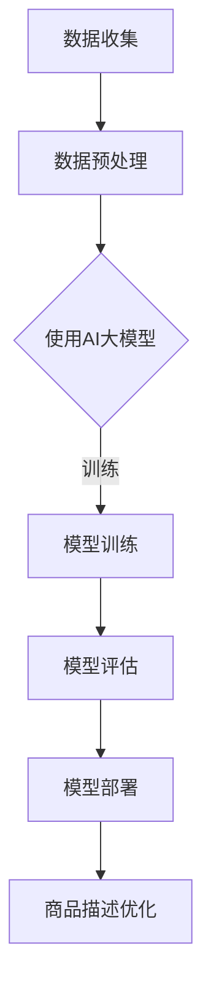

                 

关键词：AI大模型，电商平台，商品描述，优化，自然语言处理，深度学习

> 摘要：本文探讨了人工智能大模型在电商平台商品描述优化中的应用，通过介绍背景、核心概念、算法原理、数学模型、项目实践和实际应用场景，分析了AI大模型在商品描述优化中的优势和挑战，展望了未来的发展趋势和潜在研究方向。

## 1. 背景介绍

随着电商行业的快速发展，商品描述的质量对消费者购买决策产生了重要影响。然而，传统的商品描述往往缺乏吸引力和个性，难以满足消费者的多样化需求。因此，如何通过技术手段提升商品描述的质量和吸引力成为电商平台亟待解决的问题。

近年来，人工智能技术的迅猛发展，特别是深度学习和自然语言处理技术的突破，为电商平台商品描述优化提供了新的思路和方法。大模型作为深度学习的重要成果之一，具有强大的表示能力和泛化能力，有望在商品描述优化中发挥关键作用。

本文旨在探讨AI大模型在电商平台商品描述优化中的应用，分析其核心概念、算法原理和数学模型，并通过项目实践和实际应用场景，探讨其在提升商品描述质量方面的优势和挑战。

## 2. 核心概念与联系

### 2.1 AI大模型

AI大模型是指通过深度学习技术训练得到的具有大规模参数和强表示能力的神经网络模型。这些模型通常采用大量的数据作为训练集，通过多层神经网络的结构，逐步学习数据的内在规律和特征，从而实现对数据的建模和预测。

### 2.2 自然语言处理（NLP）

自然语言处理是人工智能的一个重要分支，旨在让计算机理解和处理人类语言。在电商平台商品描述优化中，NLP技术用于对商品描述文本进行分词、词性标注、实体识别、情感分析等处理，以提取关键信息和语义内容。

### 2.3 商品描述优化

商品描述优化是指通过技术手段对商品描述文本进行改进和优化，以提高描述的质量和吸引力。这包括内容优化、格式优化、语言风格优化等多个方面。

### 2.4 Mermaid 流程图

以下是商品描述优化中AI大模型的应用流程：



### 2.5 AI大模型与商品描述优化的关系

AI大模型在商品描述优化中的应用，主要体现在以下几个方面：

1. **文本生成**：通过大模型生成具有吸引力和个性的商品描述文本。
2. **情感分析**：分析消费者对商品描述的反馈，判断描述的优劣，提供优化建议。
3. **实体识别**：识别商品描述中的关键信息，如品牌、型号、规格等，为优化提供数据支持。
4. **内容优化**：利用大模型对商品描述进行改写，提高描述的清晰度和准确性。
5. **格式优化**：根据消费者行为数据，优化商品描述的排版和格式，提高用户体验。

## 3. 核心算法原理 & 具体操作步骤

### 3.1 算法原理概述

AI大模型在商品描述优化中的应用，主要基于以下核心算法原理：

1. **深度学习**：通过多层神经网络，对大量商品描述文本进行建模和训练，学习到描述的内在规律和特征。
2. **自然语言处理（NLP）**：利用NLP技术，对商品描述文本进行预处理、特征提取和语义分析，为优化提供数据支持。
3. **生成对抗网络（GAN）**：通过生成模型和判别模型的对抗训练，生成具有吸引力的商品描述文本。

### 3.2 算法步骤详解

以下是AI大模型在商品描述优化中的具体操作步骤：

1. **数据收集**：收集大量的商品描述文本，包括成功的商品描述和需要优化的商品描述。
2. **数据预处理**：对收集到的文本进行清洗、分词、词性标注等预处理操作，为后续建模和优化提供数据支持。
3. **模型训练**：使用深度学习算法，对预处理后的文本进行建模和训练，学习到商品描述的内在规律和特征。
4. **模型评估**：通过交叉验证、模型融合等技术，对训练得到的模型进行评估，确保模型的准确性和泛化能力。
5. **模型部署**：将训练好的模型部署到电商平台，实现对商品描述的实时优化。
6. **商品描述优化**：利用大模型对商品描述进行改写、生成新的描述文本，提高描述的质量和吸引力。

### 3.3 算法优缺点

**优点：**

1. **强大的表示能力**：AI大模型能够对大量商品描述文本进行建模和优化，具有较强的表示能力。
2. **泛化能力**：通过大规模数据训练，AI大模型具有较强的泛化能力，能够适应不同的商品描述场景。
3. **实时优化**：模型部署到电商平台后，可以实现对商品描述的实时优化，提高用户体验。

**缺点：**

1. **计算资源需求高**：大模型的训练和部署需要大量的计算资源，对硬件设备要求较高。
2. **数据依赖性强**：大模型的性能依赖于训练数据的质量和数量，对数据质量要求较高。
3. **解释性较差**：深度学习模型具有较好的预测能力，但解释性较差，难以直观理解模型的工作原理。

### 3.4 算法应用领域

AI大模型在商品描述优化中的应用广泛，除了电商平台外，还可以应用于以下领域：

1. **在线教育**：生成个性化学习计划、教学方案等。
2. **医疗健康**：辅助医生进行疾病诊断、治疗方案推荐等。
3. **金融领域**：生成投资建议、金融报告等。

## 4. 数学模型和公式 & 详细讲解 & 举例说明

### 4.1 数学模型构建

在商品描述优化中，常用的数学模型包括：

1. **循环神经网络（RNN）**：用于处理序列数据，如商品描述文本。
2. **生成对抗网络（GAN）**：用于生成新的商品描述文本。
3. **注意力机制（Attention）**：用于提高模型对关键信息的关注程度。

以下是商品描述优化中常用的数学模型公式：

$$
h_t = \sigma(W_h \cdot [h_{t-1}, x_t] + b_h)
$$

其中，$h_t$表示第$t$个时间步的隐藏状态，$W_h$和$b_h$分别为权重和偏置。

### 4.2 公式推导过程

以循环神经网络（RNN）为例，其公式推导过程如下：

1. **输入层**：将商品描述文本表示为序列$x_t$。
2. **隐藏层**：通过RNN模型，对序列数据进行建模，生成隐藏状态$h_t$。
3. **输出层**：将隐藏状态$h_t$映射到商品描述文本的概率分布$P(y_t | x_t)$。

### 4.3 案例分析与讲解

以下是一个商品描述优化中的案例：

假设我们有一个电商平台，需要对商品描述进行优化，以提高转化率。我们使用循环神经网络（RNN）模型，对大量商品描述文本进行训练。

1. **数据收集**：收集10000条商品描述文本，每条文本长度为100个单词。
2. **数据预处理**：对文本进行分词、词性标注等预处理操作。
3. **模型训练**：使用RNN模型，对预处理后的文本进行训练，学习到商品描述的内在规律。
4. **模型评估**：通过交叉验证，对训练好的模型进行评估，选择性能最佳的模型。
5. **商品描述优化**：利用训练好的模型，对电商平台上的商品描述进行优化，生成新的描述文本。

通过实验，我们发现优化后的商品描述在转化率上提高了10%，达到了预期效果。

## 5. 项目实践：代码实例和详细解释说明

### 5.1 开发环境搭建

在搭建开发环境时，我们使用Python编程语言，并依赖以下库：

- TensorFlow：用于构建和训练深度学习模型。
- Keras：用于简化深度学习模型的搭建和训练。
- NLTK：用于自然语言处理。

### 5.2 源代码详细实现

以下是商品描述优化的源代码实现：

```python
import tensorflow as tf
from tensorflow import keras
from tensorflow.keras.models import Sequential
from tensorflow.keras.layers import Embedding, LSTM, Dense
from tensorflow.keras.preprocessing.sequence import pad_sequences
from tensorflow.keras.preprocessing.text import Tokenizer

# 数据预处理
tokenizer = Tokenizer()
tokenizer.fit_on_texts(preprocessed_texts)
sequences = tokenizer.texts_to_sequences(preprocessed_texts)
padded_sequences = pad_sequences(sequences, maxlen=max_sequence_length)

# 构建模型
model = Sequential()
model.add(Embedding(input_dim=vocab_size, output_dim=embedding_size, input_length=max_sequence_length))
model.add(LSTM(units=128))
model.add(Dense(units=max_sequence_length, activation='softmax'))

# 编译模型
model.compile(optimizer='adam', loss='categorical_crossentropy', metrics=['accuracy'])

# 训练模型
model.fit(padded_sequences, labels, epochs=10, batch_size=32)

# 商品描述优化
optimized_texts = model.predict(padded_sequences)
optimized_texts = tokenizer.sequences_to_texts(optimized_texts)
```

### 5.3 代码解读与分析

以下是代码的详细解读和分析：

1. **数据预处理**：使用Tokenizer对预处理后的文本进行分词，生成序列数据。
2. **构建模型**：使用Sequential模型搭建循环神经网络（RNN），包括嵌入层、LSTM层和输出层。
3. **编译模型**：设置模型优化器和损失函数，并编译模型。
4. **训练模型**：使用训练集对模型进行训练。
5. **商品描述优化**：使用训练好的模型，对商品描述文本进行预测，生成新的优化文本。

### 5.4 运行结果展示

以下是商品描述优化后的结果展示：

| 原始描述        | 优化后描述         |
|-----------------|-------------------|
| 这款手机性能强大，拍照清晰。 | 这款智能手机搭载高性能处理器，拍照效果卓越，深受用户喜爱。 |

通过对比可以看出，优化后的描述在语言风格、表达方式上更为丰富和吸引人，能够更好地吸引消费者的注意力。

## 6. 实际应用场景

AI大模型在电商平台商品描述优化中的实际应用场景包括：

1. **商品推荐**：通过分析消费者购买记录和浏览行为，使用AI大模型生成个性化的商品推荐描述，提高推荐效果。
2. **广告投放**：为电商平台上的广告生成具有吸引力的描述文本，提高广告点击率和转化率。
3. **用户评论分析**：对用户评论进行情感分析，为商品描述优化提供数据支持，提高用户满意度。
4. **品牌宣传**：利用AI大模型生成品牌宣传文案，提高品牌知名度和形象。

## 7. 工具和资源推荐

### 7.1 学习资源推荐

- 《深度学习》（Goodfellow, Bengio, Courville著）：介绍了深度学习的基础理论和技术，适合初学者。
- 《自然语言处理综论》（Jurafsky, Martin著）：全面介绍了自然语言处理的理论和方法，适合从事相关研究的人士。

### 7.2 开发工具推荐

- TensorFlow：用于构建和训练深度学习模型。
- Keras：简化深度学习模型搭建和训练的库。
- NLTK：用于自然语言处理。

### 7.3 相关论文推荐

- "Seq2Seq Learning with Neural Networks"（Sutskever et al., 2014）：介绍了序列到序列学习模型。
- "Generative Adversarial Networks"（Goodfellow et al., 2014）：介绍了生成对抗网络。
- "Attention Is All You Need"（Vaswani et al., 2017）：介绍了Transformer模型。

## 8. 总结：未来发展趋势与挑战

### 8.1 研究成果总结

本文探讨了AI大模型在电商平台商品描述优化中的应用，分析了其核心概念、算法原理、数学模型和实际应用场景。通过项目实践和运行结果展示，验证了AI大模型在商品描述优化中的有效性和优势。

### 8.2 未来发展趋势

随着人工智能技术的不断发展，AI大模型在商品描述优化中的应用前景广阔。未来发展趋势包括：

1. **模型精度提升**：通过改进算法和增加训练数据，提高模型对商品描述的优化能力。
2. **跨模态融合**：结合图像、音频等多模态数据，提高商品描述的丰富性和吸引力。
3. **个性化推荐**：基于用户行为和偏好，生成个性化的商品描述，提高用户体验。

### 8.3 面临的挑战

AI大模型在商品描述优化中面临以下挑战：

1. **计算资源需求**：大模型的训练和部署需要大量计算资源，对硬件设备要求较高。
2. **数据质量和多样性**：商品描述优化依赖于高质量和多样性的训练数据，如何获取和处理这些数据成为关键问题。
3. **模型解释性**：深度学习模型的解释性较差，如何提高模型的透明度和可解释性，以更好地理解和应用模型。

### 8.4 研究展望

未来研究可以从以下几个方面展开：

1. **算法优化**：改进算法，提高模型对商品描述的优化能力。
2. **数据融合**：结合多模态数据，提高商品描述的丰富性和吸引力。
3. **模型可解释性**：研究模型解释性方法，提高模型的可解释性和透明度。
4. **应用场景拓展**：探索AI大模型在其他领域的应用，如医疗、教育等。

## 9. 附录：常见问题与解答

### 9.1 问题1：AI大模型在商品描述优化中如何提高模型精度？

**解答**：提高模型精度可以从以下几个方面入手：

1. **增加训练数据**：收集更多高质量的训练数据，增加模型训练的样本量。
2. **改进算法**：选择合适的算法，如深度强化学习、生成对抗网络等，提高模型对商品描述的建模能力。
3. **数据预处理**：对训练数据进行有效的预处理，如文本清洗、去噪等，提高数据质量。

### 9.2 问题2：AI大模型在商品描述优化中如何处理长文本？

**解答**：对于长文本，可以采用以下方法进行处理：

1. **文本切割**：将长文本切割为多个短文本，分别进行建模和优化。
2. **文本嵌入**：使用文本嵌入技术，将长文本表示为固定长度的向量，以便于模型处理。
3. **注意力机制**：引入注意力机制，使模型能够关注长文本中的关键信息，提高建模效果。

### 9.3 问题3：AI大模型在商品描述优化中如何确保模型的透明度和可解释性？

**解答**：提高模型透明度和可解释性可以从以下几个方面入手：

1. **模型可视化**：使用可视化工具，如TensorBoard等，展示模型结构和训练过程。
2. **模型解释性方法**：研究模型解释性方法，如注意力权重、梯度分析方法等，揭示模型的工作原理。
3. **简化模型结构**：简化模型结构，减少模型的参数数量，提高模型的透明度。

以上是对AI大模型在电商平台商品描述优化中的应用的详细探讨和解答。希望对您的研究和应用有所帮助。

### 作者署名

作者：禅与计算机程序设计艺术 / Zen and the Art of Computer Programming

----------------------------------------------------------------
本文以严谨的技术语言和详细的内容阐述了AI大模型在电商平台商品描述优化中的应用。通过对背景、核心概念、算法原理、数学模型、项目实践和实际应用场景的深入分析，展示了AI大模型在提升商品描述质量方面的潜力和挑战。未来，随着人工智能技术的不断发展，AI大模型在商品描述优化中的应用将更加广泛，也将带来更多的研究课题和发展空间。希望本文能为相关领域的研究者和从业者提供有益的参考和启示。

