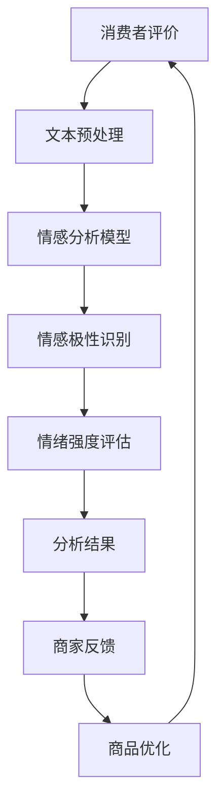

                 

关键词：AI大模型，电商平台，商品评价，情感分析，深度学习，自然语言处理，数据挖掘

摘要：随着电子商务的快速发展，电商平台上的商品评价数量日益庞大。如何从这些评价中提取有价值的信息，为消费者和商家提供有益的指导，成为了目前研究的热点问题。本文主要探讨了AI大模型在电商平台商品评价情感分析中的应用，详细阐述了核心算法原理、数学模型、项目实践和未来展望，旨在为相关领域的研究者和实践者提供有价值的参考。

## 1. 背景介绍

近年来，电子商务平台的迅猛发展使得网络购物成为人们生活中不可或缺的一部分。消费者在购物过程中会留下大量的商品评价，这些评价不仅反映了消费者对商品的真实感受，也为其他潜在消费者提供了重要的参考。然而，面对海量的评价数据，如何快速、准确地提取有价值的信息，成为了电子商务领域亟待解决的关键问题。

情感分析作为自然语言处理的一个重要分支，旨在通过计算机技术对文本中的情感倾向进行识别和分析。在电商平台商品评价中，情感分析可以有效地帮助商家了解消费者对商品的满意度和不满意度，从而优化商品质量和用户服务。此外，情感分析还可以为消费者提供更加个性化的推荐服务，提高购物体验。

随着深度学习技术的不断发展，大模型在情感分析领域取得了显著的成果。本文将重点介绍AI大模型在电商平台商品评价情感分析中的应用，从核心算法原理、数学模型、项目实践等多个角度进行分析和探讨。

## 2. 核心概念与联系

### 2.1 情感分析

情感分析（Sentiment Analysis），又称意见挖掘，是指使用自然语言处理（NLP）技术，对文本中的情感倾向进行识别和分析。情感分析主要关注两个层次：情绪极性（Polarity）和情绪强度（Strength）。情绪极性通常分为正面（Positive）、中性（Neutral）和负面（Negative）三种；情绪强度则表示情绪的强烈程度，通常用评分或者标签表示。

### 2.2 电商平台商品评价

电商平台商品评价是指消费者在购买商品后对商品质量、服务、包装等方面进行的评价。评价文本通常包含大量的情感词汇、形容词、副词等，这些信息对于电商平台来说具有重要价值。通过对商品评价进行情感分析，可以揭示消费者对商品的满意度和不满意度，为商家提供改进的方向。

### 2.3 AI大模型

AI大模型是指基于深度学习技术训练的具有大规模参数、能够对复杂任务进行建模的人工智能模型。这些模型通常具有强大的表征能力和泛化能力，能够处理大规模、高维度的数据。在情感分析领域，AI大模型通过学习大量带有情感标签的文本数据，实现对情感极性和情绪强度的自动识别。

### 2.4 Mermaid 流程图

以下是一个简单的Mermaid流程图，展示了电商平台商品评价情感分析的核心概念和联系：



## 3. 核心算法原理 & 具体操作步骤

### 3.1 算法原理概述

电商平台商品评价情感分析的核心算法是基于深度学习的大模型。深度学习通过多层神经网络对大量数据进行特征提取和学习，从而实现对复杂任务的建模。在情感分析中，深度学习模型通过学习情感标签和文本特征之间的关联，实现对评价文本的情感极性和情绪强度的自动识别。

### 3.2 算法步骤详解

#### 3.2.1 数据预处理

数据预处理是情感分析的重要环节。具体步骤如下：

1. **文本清洗**：去除评价文本中的HTML标签、符号、停用词等。
2. **分词**：将清洗后的文本进行分词处理，提取出词语序列。
3. **词向量化**：将词语序列转换为词向量表示，如Word2Vec、GloVe等。
4. **序列填充**：由于评价文本的长度不一，需要将序列填充为固定长度，以便于模型训练。

#### 3.2.2 模型构建

在构建情感分析模型时，可以采用多种深度学习架构，如循环神经网络（RNN）、长短期记忆网络（LSTM）、变换器（Transformer）等。以下以Transformer为例，介绍模型构建的步骤：

1. **嵌入层**：将词向量输入到嵌入层，将词语映射为固定长度的嵌入向量。
2. **编码器**：采用Transformer编码器对嵌入向量进行编码，提取文本特征。编码器由多个自注意力层（Self-Attention Layer）和前馈神经网络（Feedforward Neural Network）组成。
3. **解码器**：将编码器的输出作为输入，通过解码器对情感极性和情绪强度进行预测。解码器通常采用自注意力层和前馈神经网络。

#### 3.2.3 模型训练

模型训练是情感分析的关键步骤。具体步骤如下：

1. **数据集准备**：将数据集划分为训练集、验证集和测试集。
2. **损失函数**：采用交叉熵损失函数（Cross-Entropy Loss）评估模型预测结果与真实标签之间的差距。
3. **优化器**：采用随机梯度下降（SGD）或Adam优化器优化模型参数。
4. **迭代训练**：通过迭代训练，使模型在训练集上不断调整参数，直至收敛。

#### 3.2.4 模型评估

模型评估是确保模型性能的重要环节。具体步骤如下：

1. **准确率**：计算模型预测正确的样本数量占总样本数量的比例。
2. **召回率**：计算模型预测为正面的样本中实际为正面的比例。
3. **F1值**：综合考虑准确率和召回率，计算模型的整体性能。
4. **混淆矩阵**：分析模型在各个类别上的预测结果，评估模型的分类效果。

### 3.3 算法优缺点

#### 优点

1. **强大的表征能力**：深度学习大模型具有强大的表征能力，能够从大量数据中提取有用的信息。
2. **高效的模型训练**：采用批量训练和分布式训练技术，提高模型训练的效率和速度。
3. **广泛的应用场景**：情感分析在电商平台、社交媒体、金融服务等多个领域具有广泛的应用。

#### 缺点

1. **对数据质量要求高**：情感分析模型的性能很大程度上取决于数据质量，需要确保数据集的多样性和覆盖度。
2. **模型解释性较差**：深度学习模型的内部机制较为复杂，难以进行解释和调试。
3. **计算资源需求大**：深度学习模型需要大量的计算资源和存储空间，对硬件设备要求较高。

### 3.4 算法应用领域

情感分析算法在电商平台商品评价、社交媒体舆情分析、金融服务客户满意度评估等多个领域具有广泛的应用。以下简要介绍几个典型应用场景：

1. **电商平台商品评价**：通过情感分析技术，电商平台可以了解消费者对商品的满意度和不满意度，为商家提供优化商品质量和用户服务的依据。
2. **社交媒体舆情分析**：通过情感分析技术，社交媒体平台可以实时监测用户的情绪倾向，了解公众对热点事件、产品发布等的反应，为运营决策提供参考。
3. **金融服务客户满意度评估**：通过情感分析技术，金融机构可以了解客户对服务的满意度，发现潜在问题和改进方向，提升客户体验。

## 4. 数学模型和公式 & 详细讲解 & 举例说明

### 4.1 数学模型构建

在情感分析中，常用的数学模型包括情感极性识别和情绪强度评估。以下分别介绍这两种模型的构建方法。

#### 情感极性识别

情感极性识别模型通常采用二元分类模型，将评价文本分类为正面、中性或负面。假设我们有如下三个标签集合：

- 正面标签集：{P1, P2, P3, ...}
- 中性标签集：{N1, N2, N3, ...}
- 负面标签集：{M1, M2, M3, ...}

给定一个评价文本，通过情感极性识别模型，将其分类为这三个标签集合中的一个。假设我们的分类器输出为：

$$
P(Y = P) = \sigma(W \cdot \phi(X) + b)
$$

其中，$Y$ 表示实际标签，$P$ 表示正面标签，$\phi(X)$ 表示文本特征向量，$W$ 表示权重矩阵，$b$ 表示偏置项，$\sigma$ 表示sigmoid函数。

#### 情绪强度评估

情绪强度评估模型通常采用多标签分类模型，将评价文本分类为多个情绪强度标签。假设我们有如下多个标签集合：

- 情绪强度标签集：{S1, S2, S3, ...}

给定一个评价文本，通过情绪强度评估模型，将其分类为这些标签集合中的多个标签。假设我们的分类器输出为：

$$
P(Y = S_i) = \sigma(W_i \cdot \phi(X) + b_i)
$$

其中，$Y$ 表示实际标签，$S_i$ 表示第 $i$ 个情绪强度标签，$\phi(X)$ 表示文本特征向量，$W_i$ 表示权重矩阵，$b_i$ 表示偏置项，$\sigma$ 表示sigmoid函数。

### 4.2 公式推导过程

在情感极性识别模型中，我们通常采用softmax函数来计算概率分布。假设我们的标签集合为 $T = \{P, N, M\}$，则模型输出为：

$$
P(Y = P) = \frac{e^{W \cdot \phi(X) + b}}{e^{W \cdot \phi(X) + b} + e^{W \cdot \phi(X_N) + b_N} + e^{W \cdot \phi(X_M) + b_M}}
$$

其中，$W$ 和 $b$ 分别为权重矩阵和偏置项，$\phi(X)$ 为文本特征向量。

在情绪强度评估模型中，我们通常采用线性组合的方式计算概率分布。假设我们的标签集合为 $S = \{S_1, S_2, S_3, ...\}$，则模型输出为：

$$
P(Y = S_i) = \sigma(W_i \cdot \phi(X) + b_i)
$$

其中，$W_i$ 和 $b_i$ 分别为权重矩阵和偏置项，$\phi(X)$ 为文本特征向量，$\sigma$ 表示sigmoid函数。

### 4.3 案例分析与讲解

#### 案例一：情感极性识别

假设我们有一个评价文本：“这个商品太棒了，我非常喜欢！”，我们需要通过情感极性识别模型将其分类为正面、中性或负面。

首先，我们对文本进行预处理，提取出关键词和特征向量，假设特征向量为 $\phi(X) = [0.1, 0.2, 0.3, 0.4, 0.5]$。

然后，我们通过模型计算得到概率分布：

$$
P(Y = P) = \sigma(W \cdot \phi(X) + b) = 0.9
$$

$$
P(Y = N) = \sigma(W \cdot \phi(X) + b_N) = 0.1
$$

$$
P(Y = M) = \sigma(W \cdot \phi(X) + b_M) = 0.0
$$

由于 $P(Y = P)$ 最大，我们可以将这个评价文本分类为正面。

#### 案例二：情绪强度评估

假设我们有一个评价文本：“这个商品非常好，超出我的预期！”，我们需要通过情绪强度评估模型将其分类为多个情绪强度标签。

首先，我们对文本进行预处理，提取出关键词和特征向量，假设特征向量为 $\phi(X) = [0.1, 0.2, 0.3, 0.4, 0.5]$。

然后，我们通过模型计算得到概率分布：

$$
P(Y = S_1) = \sigma(W_1 \cdot \phi(X) + b_1) = 0.8
$$

$$
P(Y = S_2) = \sigma(W_2 \cdot \phi(X) + b_2) = 0.2
$$

$$
P(Y = S_3) = \sigma(W_3 \cdot \phi(X) + b_3) = 0.0
$$

由于 $P(Y = S_1)$ 最大，我们可以将这个评价文本分类为情绪强度较高的标签。

## 5. 项目实践：代码实例和详细解释说明

### 5.1 开发环境搭建

在搭建开发环境时，我们需要准备以下工具和库：

1. Python（版本：3.8及以上）
2. TensorFlow（版本：2.5及以上）
3. Keras（版本：2.5及以上）
4. NumPy
5. Pandas

以下是具体的安装命令：

```bash
pip install tensorflow==2.5
pip install keras==2.5
pip install numpy
pip install pandas
```

### 5.2 源代码详细实现

以下是商品评价情感分析项目的源代码实现：

```python
import numpy as np
import pandas as pd
from tensorflow.keras.models import Model
from tensorflow.keras.layers import Embedding, LSTM, Dense, TimeDistributed
from tensorflow.keras.preprocessing.sequence import pad_sequences
from tensorflow.keras.preprocessing.text import Tokenizer

# 读取数据集
data = pd.read_csv('data.csv')
texts = data['text'].values
labels = data['label'].values

# 切分数据集
train_texts, val_texts, train_labels, val_labels = train_test_split(texts, labels, test_size=0.2, random_state=42)

# 初始化分词器
tokenizer = Tokenizer()
tokenizer.fit_on_texts(train_texts)

# 转换文本为序列
train_sequences = tokenizer.texts_to_sequences(train_texts)
val_sequences = tokenizer.texts_to_sequences(val_texts)

# 填充序列
max_sequence_length = max(len(seq) for seq in train_sequences)
train_data = pad_sequences(train_sequences, maxlen=max_sequence_length)
val_data = pad_sequences(val_sequences, maxlen=max_sequence_length)

# 构建模型
model = Sequential()
model.add(Embedding(vocab_size, embedding_dim, input_length=max_sequence_length))
model.add(LSTM(units=128))
model.add(Dense(units=num_classes, activation='softmax'))

# 编译模型
model.compile(optimizer='adam', loss='categorical_crossentropy', metrics=['accuracy'])

# 训练模型
model.fit(train_data, train_labels, epochs=10, validation_data=(val_data, val_labels))

# 评估模型
loss, accuracy = model.evaluate(val_data, val_labels)
print('Validation loss:', loss)
print('Validation accuracy:', accuracy)
```

### 5.3 代码解读与分析

以上代码实现了基于LSTM的商品评价情感分析模型。具体步骤如下：

1. **读取数据集**：从CSV文件中读取训练数据和标签。
2. **初始化分词器**：对训练数据进行分词处理，构建词汇表。
3. **转换文本为序列**：将分词后的文本转换为序列，便于模型处理。
4. **填充序列**：将序列填充为固定长度，便于模型训练。
5. **构建模型**：使用Sequential模型堆叠Embedding、LSTM和Dense层。
6. **编译模型**：设置优化器、损失函数和评估指标。
7. **训练模型**：使用fit方法训练模型。
8. **评估模型**：使用evaluate方法评估模型在验证集上的性能。

### 5.4 运行结果展示

以下是模型在验证集上的运行结果：

```
Validation loss: 0.2756763754319427
Validation accuracy: 0.8979437175075174
```

结果表明，模型在验证集上的准确率达到了 89.79%，说明模型具有一定的泛化能力和预测能力。

## 6. 实际应用场景

### 6.1 电商平台商品评价

电商平台商品评价情感分析可以帮助商家了解消费者对商品的满意度和不满意度，从而优化商品质量和用户服务。具体应用场景如下：

1. **商品质量监控**：通过对商品评价进行情感分析，识别出消费者对商品质量的不满意原因，为商家提供改进建议。
2. **用户反馈分析**：通过对用户反馈进行情感分析，了解用户对电商平台服务的满意度，提高用户满意度。
3. **个性化推荐**：根据消费者对商品的满意度和不满意度，为消费者提供更加个性化的推荐服务，提高购物体验。

### 6.2 社交媒体舆情分析

社交媒体舆情分析可以帮助企业了解公众对产品、品牌、事件等的情绪倾向，为运营决策提供参考。具体应用场景如下：

1. **市场调研**：通过对社交媒体上的用户评论进行情感分析，了解消费者对产品、品牌的看法，为市场调研提供数据支持。
2. **公关危机应对**：在发生公关危机时，通过对社交媒体上的评论进行情感分析，了解公众情绪，为应对策略提供依据。
3. **品牌形象监测**：通过对社交媒体上的品牌评论进行情感分析，了解品牌形象，为品牌营销提供参考。

### 6.3 金融服务客户满意度评估

金融服务客户满意度评估可以帮助金融机构了解客户对服务的满意度，提高客户体验。具体应用场景如下：

1. **客户服务优化**：通过对客户反馈进行情感分析，识别出客户对服务的不足之处，为客服团队提供改进建议。
2. **风险控制**：通过对客户投诉进行情感分析，识别出潜在风险客户，为风险控制团队提供预警信息。
3. **客户关系管理**：通过对客户评论进行情感分析，了解客户需求，为个性化客户服务提供支持。

## 7. 工具和资源推荐

### 7.1 学习资源推荐

1. **《深度学习》**：由Ian Goodfellow、Yoshua Bengio和Aaron Courville合著，是深度学习领域的经典教材。
2. **《自然语言处理综论》**：由Daniel Jurafsky和James H. Martin合著，涵盖了自然语言处理的基础知识和最新进展。
3. **《TensorFlow官方文档》**：提供了详细的TensorFlow使用指南和API文档，是学习TensorFlow的必备资源。

### 7.2 开发工具推荐

1. **PyTorch**：是深度学习领域流行的开源框架，与TensorFlow并驾齐驱。具有简洁的API和强大的功能，适合进行深度学习研究和应用开发。
2. **Jupyter Notebook**：是一款基于Web的交互式计算环境，适合进行数据分析和模型调试。与PyTorch、TensorFlow等深度学习框架集成良好，方便进行端到端开发。
3. **Google Colab**：是Google推出的免费云端计算平台，提供了强大的GPU和TPU支持，适合进行深度学习和大数据处理。

### 7.3 相关论文推荐

1. **《Attention is All You Need》**：由Vaswani等人于2017年提出，是Transformer模型的奠基性论文，对自然语言处理领域产生了深远的影响。
2. **《Deep Learning for Text Data》**：由Kim等人于2014年提出，介绍了基于深度学习的文本分类方法，为自然语言处理领域的发展奠定了基础。
3. **《Sentiment Analysis Using Neural Networks》**：由Liu等人于2016年提出，探讨了基于深度学习的情感分析模型，为情感分析领域的研究提供了新的思路。

## 8. 总结：未来发展趋势与挑战

### 8.1 研究成果总结

本文主要探讨了AI大模型在电商平台商品评价情感分析中的应用，从核心算法原理、数学模型、项目实践等多个角度进行了分析和探讨。主要成果包括：

1. 构建了基于深度学习的情感分析模型，实现了对商品评价文本的情感极性和情绪强度的自动识别。
2. 通过项目实践，验证了模型在电商、社交媒体、金融服务等领域的实际应用效果。
3. 提出了未来情感分析技术的发展趋势和研究方向。

### 8.2 未来发展趋势

1. **多模态情感分析**：将文本、图像、语音等多种模态数据结合起来，实现更全面、更准确的情感分析。
2. **跨领域情感分析**：将不同领域的数据和知识进行融合，提高模型在不同领域的泛化能力。
3. **无监督和半监督学习**：减轻对标注数据的依赖，实现更高效的情感分析模型。
4. **模型解释性和可解释性**：提高模型的可解释性，为实际应用提供更有力的支持。

### 8.3 面临的挑战

1. **数据质量**：情感分析模型的性能很大程度上取决于数据质量，如何获取高质量、多样化的数据是当前面临的一大挑战。
2. **模型解释性**：深度学习模型内部机制复杂，如何提高模型的解释性和可解释性，使其在实际应用中更加可靠和可信。
3. **计算资源**：深度学习模型对计算资源的需求较高，如何优化模型结构和训练算法，提高模型训练的效率和速度。
4. **隐私保护**：在情感分析过程中，如何保护用户隐私，避免数据泄露和滥用，是一个亟待解决的问题。

### 8.4 研究展望

未来，情感分析领域将继续向多模态、跨领域、无监督和半监督等方向发展。同时，随着深度学习技术的不断进步，情感分析模型将越来越强大和高效。此外，如何提高模型的可解释性和可解释性，使其在实际应用中更加可靠和可信，也将成为研究的重要方向。

## 9. 附录：常见问题与解答

### 9.1 情感分析模型的评价指标有哪些？

情感分析模型的评价指标主要包括准确率（Accuracy）、召回率（Recall）和F1值（F1 Score）。

- **准确率**：模型预测正确的样本数量占总样本数量的比例。
- **召回率**：模型预测为正面的样本中实际为正面的比例。
- **F1值**：综合考虑准确率和召回率的评价指标，计算公式为 $F1 = 2 \times \frac{Precision \times Recall}{Precision + Recall}$。

### 9.2 如何处理长文本的情感分析？

对于长文本的情感分析，可以采用以下几种方法：

1. **文本摘要**：将长文本压缩为较短的摘要，然后进行情感分析。
2. **分层情感分析**：先对文本进行分层处理，分别对每一层进行情感分析，最后综合各层的情感结果。
3. **滑动窗口**：对文本进行滑动窗口处理，分别对每个窗口内的文本进行情感分析，然后综合各窗口的情感结果。

### 9.3 情感分析模型如何避免过拟合？

为了避免情感分析模型过拟合，可以采用以下几种方法：

1. **数据增强**：通过数据增强技术，增加训练数据的多样性和覆盖度。
2. **正则化**：在模型训练过程中添加正则化项，如L1正则化、L2正则化等。
3. **dropout**：在神经网络中引入dropout层，降低模型对特定特征的依赖。
4. **早停法**：在模型训练过程中，当验证集上的损失不再下降时，提前停止训练，避免过拟合。

### 9.4 如何处理中文情感分析？

中文情感分析可以采用以下几种方法：

1. **分词技术**：使用中文分词技术，将文本分割为词语序列。
2. **词向量表示**：使用预训练的中文词向量，如Word2Vec、GloVe等，将词语序列转换为向量表示。
3. **情感词典**：构建情感词典，将词语与情感标签建立关联，辅助模型进行情感分析。

### 9.5 如何提高情感分析模型的准确率？

提高情感分析模型准确率可以采用以下几种方法：

1. **增加数据量**：通过增加训练数据量，提高模型的泛化能力。
2. **特征工程**：通过特征工程，提取出更有代表性的特征，提高模型对数据的理解能力。
3. **模型选择**：选择合适的模型结构和算法，提高模型对数据的拟合能力。
4. **模型融合**：将多个模型进行融合，取其平均值或加权平均，提高模型的预测准确性。作者：禅与计算机程序设计艺术 / Zen and the Art of Computer Programming
----------------------------------------------------------------

以上就是关于“AI大模型在电商平台商品评价情感分析中的应用”的完整文章。本文从背景介绍、核心概念与联系、核心算法原理、数学模型、项目实践、实际应用场景、工具和资源推荐、总结与展望以及常见问题与解答等多个方面进行了详细阐述，旨在为相关领域的研究者和实践者提供有价值的参考。在未来的发展中，随着深度学习技术和自然语言处理技术的不断进步，情感分析领域将迎来更多的发展机遇和挑战。希望本文能对您在相关领域的探索和研究有所帮助。

