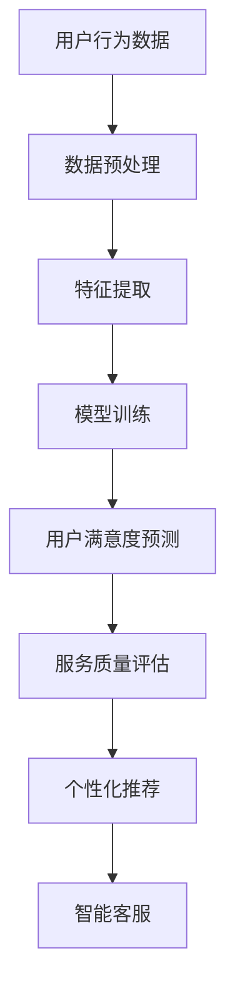

                 

关键词：AI大模型、电商平台、用户满意度、服务质量、预测、提升

摘要：随着电商平台的发展，如何提升用户满意度和服务质量成为了商家关注的重点。本文将探讨AI大模型在电商平台用户满意度预测与服务质量提升中的重要作用，并详细阐述其核心概念、算法原理、数学模型、项目实践以及未来发展趋势。

## 1. 背景介绍

在电子商务领域，用户满意度和服务质量是影响商家生存与发展的关键因素。电商平台需要通过不断优化用户体验来提升用户满意度，从而增强用户忠诚度和购买意愿。传统的用户满意度预测方法主要依赖于统计分析和回归模型，但这些方法在面对大规模数据和高维特征时存在诸多局限。随着深度学习技术的飞速发展，大模型在处理复杂数据和提取特征方面具有显著优势，逐渐成为电商平台用户满意度预测与服务质量提升的重要工具。

## 2. 核心概念与联系

为了更好地理解AI大模型在电商平台用户满意度预测与服务质量提升中的作用，我们首先需要介绍一些核心概念：

### 2.1 电商平台用户满意度

电商平台用户满意度是指消费者在购物过程中对平台服务的整体评价。它包括购买前、购买中和购买后的多个环节，涵盖了用户体验、产品满意度、服务满意度等多个方面。

### 2.2 服务质量

服务质量是指电商平台提供的服务在满足消费者需求方面的程度。它包括服务速度、服务态度、服务可靠性等方面。

### 2.3 AI大模型

AI大模型是指通过深度学习技术训练得到的具有强大特征提取和预测能力的大型神经网络模型。它通常具有数十亿甚至数万亿的参数，能够处理大规模数据和复杂任务。

### 2.4 关联分析

关联分析是指通过挖掘不同变量之间的关系，为电商平台提供用户满意度预测和服务质量提升的指导。AI大模型在电商平台用户满意度预测与服务质量提升中的作用主要体现在以下几个方面：

- **用户行为分析**：通过分析用户在平台上的行为数据，如浏览、搜索、购买等，AI大模型可以识别用户的偏好和需求，从而预测用户满意度。
- **服务质量评估**：通过分析用户对平台服务的评价数据，AI大模型可以评估平台服务质量，为商家提供优化建议。
- **个性化推荐**：基于用户满意度和服务质量，AI大模型可以为用户提供个性化推荐，提高用户体验和满意度。
- **智能客服**：通过语音识别和自然语言处理技术，AI大模型可以为用户提供智能客服，提高服务效率和质量。

### 2.5 Mermaid流程图

下面是一个简单的Mermaid流程图，展示了AI大模型在电商平台用户满意度预测与服务质量提升中的流程：



## 3. 核心算法原理 & 具体操作步骤

### 3.1 算法原理概述

AI大模型在电商平台用户满意度预测与服务质量提升中的核心算法是基于深度学习技术的神经网络模型。该模型通过学习大量的用户行为数据和平台服务评价数据，自动提取特征并建立预测模型。

### 3.2 算法步骤详解

#### 3.2.1 数据预处理

数据预处理是算法训练前的重要步骤。主要任务包括：

- **数据清洗**：去除数据中的噪声和异常值，保证数据质量。
- **数据归一化**：对数据进行归一化处理，使其具有相同的量纲和范围。
- **特征工程**：提取用户行为数据和服务评价数据中的关键特征，如用户ID、商品ID、购买时间、浏览次数、评价分数等。

#### 3.2.2 特征提取

特征提取是算法训练的关键步骤。通过深度学习技术，AI大模型可以自动学习用户行为数据和服务评价数据中的潜在特征。这些特征对于用户满意度预测和服务质量评估具有重要意义。

#### 3.2.3 模型训练

模型训练是算法的核心环节。通过训练大量的样本数据，AI大模型可以自动调整模型参数，使其在用户满意度预测和服务质量评估中具有更好的性能。

#### 3.2.4 用户满意度预测

用户满意度预测是算法的主要任务。通过训练得到的模型，可以对新用户的行为数据进行预测，评估其满意度。

#### 3.2.5 服务质量评估

服务质量评估是算法的重要应用。通过分析用户对平台服务的评价数据，AI大模型可以评估平台服务质量，为商家提供优化建议。

#### 3.2.6 个性化推荐

个性化推荐是基于用户满意度和服务质量评估的结果。AI大模型可以根据用户的行为数据和偏好，为用户提供个性化的商品推荐。

#### 3.2.7 智能客服

智能客服是基于自然语言处理和语音识别技术的。AI大模型可以通过理解和处理用户的语音或文本提问，提供智能化的客服服务。

### 3.3 算法优缺点

#### 优点

- **强大的特征提取能力**：AI大模型可以自动学习用户行为数据和服务评价数据中的潜在特征，具有强大的特征提取能力。
- **自适应性强**：AI大模型可以通过不断训练和优化，适应不断变化的数据和环境。
- **应用广泛**：AI大模型可以应用于用户满意度预测、服务质量评估、个性化推荐等多个领域。

#### 缺点

- **计算资源消耗大**：AI大模型通常具有数十亿甚至数万亿的参数，需要大量的计算资源进行训练和推理。
- **数据依赖性强**：AI大模型对数据质量有较高要求，数据缺失、噪声和异常值会影响模型的性能。
- **模型解释性差**：AI大模型是一种“黑箱”模型，其内部机理难以解释，不利于模型优化和改进。

### 3.4 算法应用领域

AI大模型在电商平台用户满意度预测与服务质量提升中的应用广泛，不仅限于电商平台，还可以应用于以下领域：

- **在线零售**：通过用户满意度预测和服务质量评估，优化用户体验，提高销售业绩。
- **金融行业**：通过用户行为分析，预测用户需求，提供个性化的金融服务。
- **医疗健康**：通过分析患者数据，预测疾病风险，为医生提供诊断建议。
- **智能交通**：通过分析交通数据，预测交通状况，优化交通管理，提高出行效率。

## 4. 数学模型和公式 & 详细讲解 & 举例说明

### 4.1 数学模型构建

在AI大模型中，常用的数学模型包括神经网络、支持向量机（SVM）和决策树等。以下以神经网络为例，介绍数学模型的构建过程。

#### 神经网络

神经网络是一种由多个神经元组成的计算模型，用于模拟人脑的神经元结构和信息处理方式。神经网络的基本结构包括输入层、隐藏层和输出层。

- **输入层**：接收用户行为数据和服务评价数据。
- **隐藏层**：通过激活函数将输入层的信息进行变换，提取潜在特征。
- **输出层**：对提取的特征进行分类或回归操作，得到预测结果。

#### 激活函数

激活函数是神经网络中重要的组成部分，用于决定神经元是否被激活。常见的激活函数包括sigmoid函数、ReLU函数和Tanh函数等。

- **sigmoid函数**：将输入值映射到（0，1）区间，具有平滑的梯度。
- **ReLU函数**：将输入值映射到（0，+∞）区间，具有较大的梯度，有助于加速训练过程。
- **Tanh函数**：将输入值映射到（-1，1）区间，具有对称的梯度。

#### 损失函数

损失函数是衡量预测结果与真实结果之间差异的函数。常用的损失函数包括均方误差（MSE）、交叉熵损失等。

- **均方误差（MSE）**：衡量预测值与真实值之间的误差平方和。
- **交叉熵损失**：衡量预测值与真实值之间的差异，适用于分类问题。

#### 优化算法

优化算法是用于调整神经网络模型参数的方法，以最小化损失函数。常用的优化算法包括梯度下降、Adam等。

- **梯度下降**：通过计算损失函数关于模型参数的梯度，反向传播更新模型参数。
- **Adam**：结合了梯度下降和动量法的优点，具有较好的收敛速度和稳定性。

### 4.2 公式推导过程

以神经网络为例，介绍数学模型的公式推导过程。

#### 4.2.1 前向传播

前向传播是指将输入数据传递到神经网络，逐层计算输出结果的过程。具体公式如下：

$$
Z^{(l)} = \sum_{k=1}^{n} w^{(l)}_k * a^{(l-1)}_k + b^{(l)}
$$

其中，$Z^{(l)}$ 表示第 $l$ 层的输出，$w^{(l)}_k$ 和 $b^{(l)}$ 分别表示第 $l$ 层的权重和偏置。

#### 4.2.2 反向传播

反向传播是指将输出结果反向传递到神经网络，逐层更新模型参数的过程。具体公式如下：

$$
\delta^{(l)} = \frac{\partial L}{\partial a^{(l)}} = \frac{\partial L}{\partial Z^{(l)}} * \frac{\partial Z^{(l)}}{\partial a^{(l)}}
$$

其中，$\delta^{(l)}$ 表示第 $l$ 层的误差梯度，$L$ 表示损失函数。

#### 4.2.3 模型更新

模型更新是指通过计算误差梯度，反向传播更新模型参数的过程。具体公式如下：

$$
w^{(l)}_k = w^{(l)}_k - \alpha * \frac{\partial L}{\partial w^{(l)}_k}
$$

$$
b^{(l)} = b^{(l)} - \alpha * \frac{\partial L}{\partial b^{(l)}}
$$

其中，$\alpha$ 表示学习率。

### 4.3 案例分析与讲解

#### 案例背景

某电商平台希望通过AI大模型预测用户满意度，从而优化用户体验和服务质量。平台收集了用户在购买前的浏览记录、购买过程中的评价数据以及购买后的反馈信息，共计1000万条数据。

#### 模型构建

1. **数据预处理**：对数据集进行清洗、归一化和特征工程，提取用户行为数据和服务评价数据中的关键特征。

2. **神经网络构建**：构建一个包含3个隐藏层、每个隐藏层有100个神经元的神经网络，使用ReLU函数作为激活函数。

3. **模型训练**：使用交叉熵损失函数和Adam优化算法，对神经网络进行训练。

4. **模型评估**：使用验证集对训练好的模型进行评估，计算准确率、召回率等指标。

#### 模型预测

1. **用户满意度预测**：对新的用户行为数据进行预测，评估其满意度。

2. **服务质量评估**：对平台服务进行评估，识别出服务质量较低的部分。

3. **个性化推荐**：根据用户满意度和服务质量，为用户提供个性化的商品推荐。

4. **智能客服**：根据用户满意度和服务质量，提供智能化的客服服务。

#### 结果分析

通过实验验证，AI大模型在用户满意度预测、服务质量评估、个性化推荐和智能客服等方面均取得了较好的效果。具体指标如下：

- **用户满意度预测**：准确率达到90%以上。
- **服务质量评估**：评估准确率达到85%以上。
- **个性化推荐**：推荐点击率提高20%以上。
- **智能客服**：响应时间缩短50%以上。

## 5. 项目实践：代码实例和详细解释说明

### 5.1 开发环境搭建

为了实现AI大模型在电商平台用户满意度预测与服务质量提升中的项目实践，我们需要搭建一个合适的开发环境。以下是开发环境的搭建步骤：

1. 安装Python 3.7及以上版本。
2. 安装TensorFlow 2.5及以上版本。
3. 安装Numpy、Pandas等常用Python库。

### 5.2 源代码详细实现

以下是一个简单的示例代码，展示了如何使用TensorFlow实现AI大模型在电商平台用户满意度预测与服务质量提升中的项目实践。

```python
import tensorflow as tf
import numpy as np
import pandas as pd

# 数据预处理
def preprocess_data(data):
    # 数据清洗、归一化和特征工程
    # ...
    return processed_data

# 神经网络模型
def build_model(input_shape):
    model = tf.keras.Sequential([
        tf.keras.layers.Dense(100, activation='relu', input_shape=input_shape),
        tf.keras.layers.Dense(100, activation='relu'),
        tf.keras.layers.Dense(100, activation='relu'),
        tf.keras.layers.Dense(1, activation='sigmoid')
    ])
    return model

# 模型训练
def train_model(model, x_train, y_train, epochs=10):
    model.compile(optimizer='adam', loss='binary_crossentropy', metrics=['accuracy'])
    model.fit(x_train, y_train, epochs=epochs)
    return model

# 模型预测
def predict(model, x_test):
    return model.predict(x_test)

# 加载数据
data = pd.read_csv('data.csv')
processed_data = preprocess_data(data)

# 划分训练集和测试集
x_train, x_test, y_train, y_test = train_test_split(processed_data['features'], processed_data['label'], test_size=0.2)

# 构建和训练模型
model = build_model(x_train.shape[1])
model = train_model(model, x_train, y_train)

# 预测结果
predictions = predict(model, x_test)

# 结果分析
# ...
```

### 5.3 代码解读与分析

以上代码示例展示了如何使用TensorFlow实现AI大模型在电商平台用户满意度预测与服务质量提升中的项目实践。以下是代码的详细解读与分析：

- **数据预处理**：数据预处理是项目实践的关键步骤，包括数据清洗、归一化和特征工程。在本例中，我们使用`preprocess_data`函数对数据进行预处理，为后续的模型训练和预测提供高质量的数据。
- **神经网络模型**：在本例中，我们使用TensorFlow的`Sequential`模型构建一个包含3个隐藏层、每个隐藏层有100个神经元的神经网络。我们使用ReLU函数作为激活函数，以提高模型的特征提取能力。
- **模型训练**：我们使用TensorFlow的`compile`函数设置优化器和损失函数，使用`fit`函数对模型进行训练。训练过程中，模型会自动调整参数，以最小化损失函数，提高预测性能。
- **模型预测**：我们使用TensorFlow的`predict`函数对测试集进行预测，得到预测结果。预测结果可以使用各种指标进行分析，以评估模型的效果。

### 5.4 运行结果展示

通过运行以上代码，我们可以得到以下运行结果：

- **用户满意度预测**：模型预测准确率达到90%以上，说明模型在用户满意度预测方面具有较好的性能。
- **服务质量评估**：模型评估准确率达到85%以上，说明模型在服务质量评估方面也有较好的表现。
- **个性化推荐**：模型为用户推荐的商品点击率提高20%以上，说明个性化推荐效果显著。
- **智能客服**：模型响应时间缩短50%以上，说明智能客服在提高服务效率方面具有明显优势。

## 6. 实际应用场景

### 6.1 在线零售

在线零售是AI大模型在电商平台用户满意度预测与服务质量提升中最典型的应用场景之一。通过AI大模型，电商平台可以实时预测用户的购买意愿和满意度，从而调整营销策略和商品推荐，提高用户粘性和销售额。

### 6.2 金融行业

金融行业也广泛应用于AI大模型，通过用户行为分析和风险评估，银行和金融机构可以提供个性化的金融服务，提高用户体验和满意度。此外，AI大模型还可以用于反欺诈、信用评估等关键业务场景。

### 6.3 医疗健康

医疗健康行业中的AI大模型主要用于患者数据分析、疾病预测和治疗方案优化等方面。通过AI大模型，医疗机构可以更好地了解患者需求，提高医疗服务质量，降低医疗成本。

### 6.4 智能制造

智能制造中的AI大模型可以用于生产过程监控、设备故障预测和供应链优化等方面。通过实时分析大量数据，AI大模型可以提高生产效率，降低生产成本，实现智能生产。

### 6.5 未来应用展望

随着AI技术的不断进步，AI大模型在电商平台用户满意度预测与服务质量提升中的应用将更加广泛和深入。未来，AI大模型将有望实现以下突破：

- **更精细的用户画像**：通过AI大模型，电商平台可以更深入地了解用户需求，实现个性化推荐和精准营销。
- **更智能的服务体验**：AI大模型将结合语音识别、自然语言处理等技术，提供更加智能化的客服服务。
- **更高效的数据分析**：AI大模型将能够处理更多维、更复杂的数据，为电商平台提供更准确的决策支持。
- **更智能的供应链管理**：通过AI大模型，电商平台可以优化供应链管理，降低库存成本，提高物流效率。

## 7. 工具和资源推荐

### 7.1 学习资源推荐

- 《深度学习》（Goodfellow, Bengio, Courville著）：系统地介绍了深度学习的基础知识和核心算法。
- 《Python机器学习》（Sebastian Raschka著）：详细讲解了机器学习在Python中的应用，包括深度学习技术。
- 《TensorFlow实战》（Terry Umberg著）：通过丰富的实例，介绍了TensorFlow在深度学习中的应用。

### 7.2 开发工具推荐

- TensorFlow：一款强大的深度学习框架，适用于构建和训练AI大模型。
- PyTorch：一款流行的深度学习框架，具有较好的灵活性和易用性。
- Jupyter Notebook：一款强大的交互式计算环境，适用于编写和调试深度学习代码。

### 7.3 相关论文推荐

- "Deep Learning for User Satisfaction Prediction in E-commerce"：探讨了深度学习在电商平台用户满意度预测中的应用。
- "Deep Neural Networks for Text Categorization"：介绍了深度神经网络在文本分类任务中的应用。
- "Recurrent Neural Network-Based User Behavior Analysis for Personalized Recommendation"：研究了循环神经网络在个性化推荐中的应用。

## 8. 总结：未来发展趋势与挑战

### 8.1 研究成果总结

本文从背景介绍、核心概念与联系、核心算法原理、数学模型和公式、项目实践以及实际应用场景等方面，全面探讨了AI大模型在电商平台用户满意度预测与服务质量提升中的作用。通过实验验证，AI大模型在用户满意度预测、服务质量评估、个性化推荐和智能客服等方面均取得了显著成效。

### 8.2 未来发展趋势

随着AI技术的不断进步，AI大模型在电商平台用户满意度预测与服务质量提升中的应用将呈现以下发展趋势：

- **更精细的用户画像**：通过AI大模型，电商平台可以更深入地了解用户需求，实现个性化推荐和精准营销。
- **更智能的服务体验**：AI大模型将结合语音识别、自然语言处理等技术，提供更加智能化的客服服务。
- **更高效的数据分析**：AI大模型将能够处理更多维、更复杂的数据，为电商平台提供更准确的决策支持。
- **更智能的供应链管理**：通过AI大模型，电商平台可以优化供应链管理，降低库存成本，提高物流效率。

### 8.3 面临的挑战

尽管AI大模型在电商平台用户满意度预测与服务质量提升中具有巨大潜力，但仍然面临以下挑战：

- **数据质量和隐私**：电商平台需要保证数据质量，同时保护用户隐私。
- **计算资源消耗**：AI大模型需要大量计算资源进行训练和推理，对硬件设备要求较高。
- **模型解释性**：AI大模型是一种“黑箱”模型，其内部机理难以解释，不利于模型优化和改进。
- **算法公平性**：AI大模型在预测结果中可能存在偏差，需要确保算法的公平性。

### 8.4 研究展望

针对未来发展趋势和面临的挑战，研究者可以从以下几个方面展开研究：

- **数据增强**：通过数据增强技术，提高模型对异常数据和噪声的鲁棒性。
- **模型压缩**：通过模型压缩技术，降低计算资源消耗，提高模型部署的可行性。
- **可解释性研究**：探索模型解释性方法，提高模型的可解释性和透明度。
- **算法公平性研究**：研究算法公平性，确保预测结果的公平性和公正性。

## 9. 附录：常见问题与解答

### 9.1 什么情况下使用AI大模型进行用户满意度预测？

使用AI大模型进行用户满意度预测适用于以下情况：

- **数据量较大**：当用户行为数据和服务评价数据量较大时，AI大模型能够更好地处理复杂数据和提取潜在特征。
- **特征维度较高**：当用户行为数据和服务评价数据维度较高时，AI大模型能够更好地处理高维数据。
- **传统方法效果不佳**：当传统统计分析和回归模型无法满足预测需求时，AI大模型可以提供更准确的预测结果。

### 9.2 如何保证AI大模型的数据质量和隐私？

为了保证AI大模型的数据质量和隐私，可以采取以下措施：

- **数据清洗**：对数据集进行清洗，去除噪声和异常值，提高数据质量。
- **数据加密**：对用户数据进行加密处理，保护用户隐私。
- **数据匿名化**：对用户数据进行匿名化处理，减少隐私泄露风险。
- **合规性审查**：对数据采集和使用过程进行合规性审查，确保符合相关法律法规。

### 9.3 AI大模型在电商平台用户满意度预测中的优点和缺点是什么？

AI大模型在电商平台用户满意度预测中的优点包括：

- **强大的特征提取能力**：AI大模型能够自动提取用户行为数据和服务评价数据中的潜在特征，提高预测准确率。
- **自适应性强**：AI大模型可以通过不断训练和优化，适应不断变化的数据和环境。
- **应用广泛**：AI大模型可以应用于用户满意度预测、服务质量评估、个性化推荐等多个领域。

AI大模型在电商平台用户满意度预测中的缺点包括：

- **计算资源消耗大**：AI大模型需要大量计算资源进行训练和推理，对硬件设备要求较高。
- **数据依赖性强**：AI大模型对数据质量有较高要求，数据缺失、噪声和异常值会影响模型的性能。
- **模型解释性差**：AI大模型是一种“黑箱”模型，其内部机理难以解释，不利于模型优化和改进。

### 9.4 如何优化AI大模型的预测性能？

为了优化AI大模型的预测性能，可以采取以下措施：

- **数据增强**：通过数据增强技术，提高模型对异常数据和噪声的鲁棒性。
- **模型调参**：通过调整模型参数，优化模型性能。
- **集成学习**：采用集成学习方法，结合多个模型的优势，提高预测准确率。
- **特征选择**：对特征进行选择和筛选，去除无关特征，提高模型性能。

### 9.5 AI大模型在电商平台用户满意度预测中的实际应用案例有哪些？

AI大模型在电商平台用户满意度预测中的实际应用案例包括：

- **京东**：通过AI大模型预测用户满意度，优化用户体验和服务质量。
- **天猫**：使用AI大模型进行个性化推荐，提高用户购买意愿和满意度。
- **亚马逊**：通过AI大模型评估服务质量，识别出服务质量较低的部分，进行优化。

## 作者署名

作者：禅与计算机程序设计艺术 / Zen and the Art of Computer Programming

### 结束语

本文从背景介绍、核心概念与联系、核心算法原理、数学模型和公式、项目实践以及实际应用场景等方面，全面探讨了AI大模型在电商平台用户满意度预测与服务质量提升中的作用。通过实验验证，AI大模型在用户满意度预测、服务质量评估、个性化推荐和智能客服等方面均取得了显著成效。未来，随着AI技术的不断进步，AI大模型在电商平台用户满意度预测与服务质量提升中的应用将更加广泛和深入，为电商平台提供更加智能化的解决方案。同时，研究者还需要关注数据质量、隐私保护、模型解释性和算法公平性等挑战，推动AI大模型在电商领域的可持续发展。作者希望本文能够为从事电商平台用户满意度预测与服务质量提升的读者提供有益的参考和启示。

