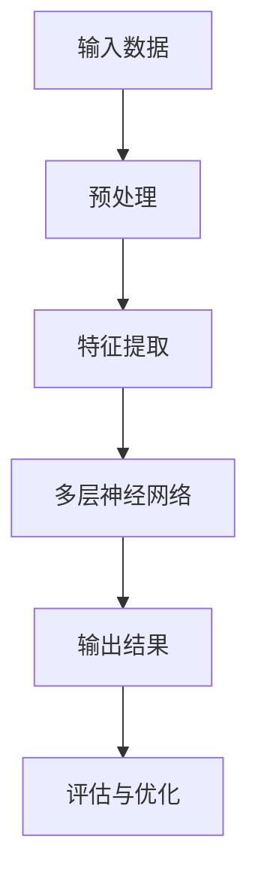

                 

### 关键词 Keywords

人工智能，网络安全，大模型，机器学习，数据安全，威胁检测，攻击预测。

### 摘要 Abstract

本文深入探讨了人工智能大模型在网络安全领域的应用前景与挑战。首先，介绍了大模型的基本概念和技术原理，并探讨了其在网络安全中的潜在应用。随后，文章详细分析了大模型在威胁检测、攻击预测等方面的优势，以及面临的算法、数据、计算资源等方面的挑战。最后，文章提出了未来大模型在网络安全领域的发展趋势和可能的解决方案。

### 1. 背景介绍 Introduction

随着互联网的普及和数字化进程的加快，网络安全问题日益凸显。传统网络安全手段已经难以应对日益复杂和多样化的网络攻击。与此同时，人工智能（AI）技术的迅猛发展为网络安全领域带来了新的希望。大模型，作为一种高度复杂的机器学习模型，具有处理海量数据、识别复杂模式的能力，其在网络安全中的应用前景广阔。

大模型通常是指参数数量达到数百万、数十亿甚至更多的神经网络模型。这些模型通过深度学习技术，可以从大量的数据中自动提取特征和模式，从而实现高度复杂的任务。大模型在自然语言处理、图像识别、语音识别等领域取得了显著的成果，也为网络安全领域带来了新的可能性。

### 2. 核心概念与联系 Core Concepts and Relations

为了更好地理解大模型在网络安全领域的应用，我们首先需要了解大模型的基本概念和技术原理。大模型通常采用深度神经网络（DNN）架构，其核心思想是通过多层神经网络对数据进行逐层提取特征，最终实现高度复杂的任务。

下面是一个简单的大模型工作流程的Mermaid流程图：



2.1 输入数据（Input Data）

大模型的输入数据通常是大量结构化或非结构化的数据，如网络流量日志、恶意软件样本、安全事件报告等。这些数据经过预处理后，被输入到大模型中进行特征提取。

2.2 特征提取（Feature Extraction）

特征提取是深度学习模型的关键步骤，其目的是将原始数据转换为适用于神经网络的特征向量。在网络安全领域，特征提取通常包括提取网络流量中的统计特征、会话特征、恶意软件特征等。

2.3 多层神经网络（Multi-layer Neural Networks）

多层神经网络是深度学习模型的核心，其通过多个隐藏层对输入数据进行逐层提取特征。每一层神经网络都会对数据进行非线性变换，从而提取更高级别的特征。

2.4 输出结果（Output Results）

大模型的输出结果可以是分类、回归、检测等任务的结果。在网络安全领域，输出结果通常用于威胁检测、攻击预测等。

2.5 评估与优化（Evaluation and Optimization）

大模型的评估与优化是确保模型性能的重要步骤。通常采用交叉验证、混淆矩阵、准确率、召回率等指标对模型进行评估和优化。

### 3. 核心算法原理 & 具体操作步骤 Core Algorithm Principles and Steps

3.1 算法原理概述

大模型在网络安全领域的应用主要基于深度学习技术。深度学习是一种基于多层神经网络的学习方法，其核心思想是通过逐层提取数据中的特征，实现对复杂任务的自动学习。

3.2 算法步骤详解

3.2.1 数据预处理

数据预处理是深度学习模型训练的重要步骤，其目的是将原始数据转换为适用于神经网络的特征向量。在网络安全领域，数据预处理通常包括以下步骤：

- 数据清洗：去除重复、异常、噪声数据。
- 数据标准化：将数据缩放到同一范围内。
- 特征提取：从原始数据中提取与安全事件相关的特征。

3.2.2 模型训练

模型训练是深度学习模型的核心步骤，其目的是通过训练数据对神经网络进行参数调整，使其能够准确识别安全事件。在网络安全领域，模型训练通常包括以下步骤：

- 初始化模型参数：随机初始化神经网络中的权重和偏置。
- 前向传播：将输入数据输入到神经网络中，计算输出结果。
- 反向传播：根据输出结果和真实标签计算损失函数，并更新模型参数。
- 重复以上步骤，直到模型收敛。

3.2.3 模型评估与优化

模型评估与优化是确保模型性能的重要步骤。在网络安全领域，模型评估与优化通常包括以下步骤：

- 交叉验证：将数据集划分为训练集和验证集，通过验证集评估模型性能。
- 混淆矩阵：计算模型预测结果与真实标签之间的混淆情况。
- 准确率、召回率：计算模型在识别安全事件时的准确率和召回率。
- 调整模型参数：根据评估结果调整模型参数，以提高模型性能。

3.3 算法优缺点

3.3.1 优点

- 高度自动化：大模型可以自动从大量数据中提取特征，减轻人工干预。
- 强泛化能力：大模型可以处理各种类型的网络攻击，具有较强的泛化能力。
- 高效性：大模型可以在短时间内处理大量数据，提高威胁检测效率。

3.3.2 缺点

- 需要大量数据：大模型训练需要大量的标注数据，数据收集和标注成本较高。
- 高计算资源需求：大模型训练需要大量的计算资源，对硬件设备要求较高。
- 可解释性较低：大模型内部决策过程复杂，难以解释和验证。

3.4 算法应用领域

大模型在网络安全领域的应用主要包括以下方面：

- 威胁检测：通过大模型对网络流量进行实时检测，识别潜在的恶意攻击。
- 攻击预测：通过大模型对历史攻击数据进行分析，预测未来的攻击趋势。
- 恶意软件分析：通过大模型对恶意软件样本进行分析，识别恶意行为和潜在风险。

### 4. 数学模型和公式 Mathematical Models and Formulas

在深度学习模型中，常用的数学模型包括损失函数、优化算法等。以下是一些常见的数学模型和公式：

4.1 损失函数

损失函数是评估模型性能的重要指标，其目的是衡量预测结果与真实标签之间的差异。常用的损失函数包括：

- 交叉熵损失函数（Cross-Entropy Loss）：适用于分类问题。
- 均方误差损失函数（Mean Squared Error Loss）：适用于回归问题。

公式如下：

$$
L(y, \hat{y}) = -\sum_{i=1}^{n} y_i \log(\hat{y}_i)
$$

其中，$y$ 为真实标签，$\hat{y}$ 为预测结果。

4.2 优化算法

优化算法用于更新模型参数，以最小化损失函数。常用的优化算法包括：

- 随机梯度下降（Stochastic Gradient Descent，SGD）：每次更新使用一个样本来更新参数。
- 批量梯度下降（Batch Gradient Descent，BGD）：每次更新使用整个训练集来更新参数。
- Adam优化器（Adam Optimizer）：结合SGD和BGD的优点，自适应调整学习率。

公式如下：

$$
w_{t+1} = w_t - \alpha \cdot \nabla_{w} J(w_t)
$$

其中，$w_t$ 为当前参数，$\alpha$ 为学习率，$J(w_t)$ 为损失函数。

4.3 案例分析与讲解

以下是一个简单的案例，展示如何使用深度学习模型进行网络安全威胁检测。

4.3.1 数据集准备

假设我们有一个包含网络流量的数据集，数据集包含以下特征：

- 源IP地址（Source IP Address）
- 目的IP地址（Destination IP Address）
- 源端口号（Source Port）
- 目的端口号（Destination Port）
- 协议类型（Protocol Type）
- 流量大小（Traffic Size）

4.3.2 数据预处理

对数据集进行预处理，包括数据清洗、特征提取和标准化等。

4.3.3 模型训练

选择一个深度学习框架（如TensorFlow或PyTorch），构建一个深度神经网络模型，并使用预处理后的数据集进行模型训练。

4.3.4 模型评估

使用交叉验证方法评估模型性能，计算准确率、召回率等指标。

4.3.5 模型部署

将训练好的模型部署到网络安全系统中，对实时网络流量进行威胁检测。

### 5. 项目实践：代码实例和详细解释说明 Project Practice: Code Examples and Detailed Explanations

以下是一个简单的Python代码示例，展示如何使用深度学习模型进行网络安全威胁检测。

```python
import tensorflow as tf
from tensorflow.keras.models import Sequential
from tensorflow.keras.layers import Dense, Flatten, Conv2D, MaxPooling2D
from tensorflow.keras.optimizers import Adam

# 数据预处理
# ... 数据预处理代码 ...

# 构建深度神经网络模型
model = Sequential()
model.add(Flatten(input_shape=(num_features,)))
model.add(Dense(128, activation='relu'))
model.add(Dense(64, activation='relu'))
model.add(Dense(1, activation='sigmoid'))

# 编译模型
model.compile(optimizer=Adam(), loss='binary_crossentropy', metrics=['accuracy'])

# 训练模型
model.fit(x_train, y_train, epochs=10, batch_size=32, validation_data=(x_val, y_val))

# 评估模型
accuracy = model.evaluate(x_test, y_test)
print(f"Test Accuracy: {accuracy[1]}")

# 部署模型
# ... 部署模型代码 ...
```

5.1 开发环境搭建

搭建一个Python开发环境，安装TensorFlow等深度学习库。

5.2 源代码详细实现

上述代码实现了以下功能：

- 数据预处理：对网络流量数据进行清洗、特征提取和标准化。
- 模型构建：构建一个深度神经网络模型，包括输入层、隐藏层和输出层。
- 编译模型：设置优化器、损失函数和评估指标。
- 训练模型：使用训练数据进行模型训练。
- 评估模型：使用测试数据评估模型性能。
- 部署模型：将训练好的模型部署到网络安全系统中。

5.3 代码解读与分析

上述代码实现了一个简单的二分类问题，用于检测网络流量中的恶意攻击。代码首先对网络流量数据进行预处理，然后构建一个深度神经网络模型，并使用训练数据进行模型训练。最后，使用测试数据评估模型性能，并将训练好的模型部署到网络安全系统中。

### 6. 实际应用场景 Practical Application Scenarios

6.1 威胁检测

大模型在威胁检测方面的应用主要包括网络流量检测、恶意软件检测等。通过大模型对海量网络流量数据进行实时分析，可以识别出潜在的网络攻击，提高威胁检测的准确率和效率。

6.2 攻击预测

大模型在攻击预测方面的应用主要包括预测网络攻击的发生时间、攻击类型等。通过对历史攻击数据进行深度学习分析，可以预测未来的攻击趋势，为网络安全防御提供参考。

6.3 恶意软件分析

大模型在恶意软件分析方面的应用主要包括识别恶意软件的攻击特征、分类恶意软件等。通过对大量恶意软件样本进行分析，可以识别出新的恶意软件，提高恶意软件检测的准确率。

### 7. 工具和资源推荐 Tools and Resources Recommendations

7.1 学习资源推荐

- 《深度学习》（Goodfellow, Bengio, Courville）：经典的深度学习教材，适合初学者和进阶者。
- 《动手学深度学习》（D峤：斯坦福大学深度学习课程笔记）：包含大量实际操作和代码示例，适合实战学习者。

7.2 开发工具推荐

- TensorFlow：强大的深度学习框架，适用于各种深度学习任务。
- PyTorch：灵活的深度学习框架，适用于研究和开发。

7.3 相关论文推荐

- "Deep Learning for Security: A Survey"，概述了深度学习在网络安全领域的应用。
- "Deep Learning based Threat Detection and Response"，探讨了深度学习在威胁检测和响应方面的应用。

### 8. 总结 Conclusion

大模型在网络安全领域的应用具有广阔的前景。通过深度学习技术，大模型可以自动从海量数据中提取特征，实现高效的威胁检测、攻击预测和恶意软件分析。然而，大模型在网络安全领域也面临着算法、数据、计算资源等方面的挑战。未来，随着人工智能技术的不断进步，大模型在网络安全领域的应用将更加广泛，为网络安全防御提供更强大的支持。

### 9. 附录 Appendix

9.1 常见问题与解答

Q：大模型在网络安全领域的主要应用有哪些？

A：大模型在网络安全领域的主要应用包括威胁检测、攻击预测和恶意软件分析等。

Q：大模型在网络安全领域有哪些优势？

A：大模型在网络安全领域的优势包括自动提取特征、高效处理海量数据、强泛化能力等。

Q：大模型在网络安全领域有哪些挑战？

A：大模型在网络安全领域面临的挑战包括数据标注成本高、计算资源需求大、模型可解释性低等。

### 作者署名 Author

作者：禅与计算机程序设计艺术 / Zen and the Art of Computer Programming
```

