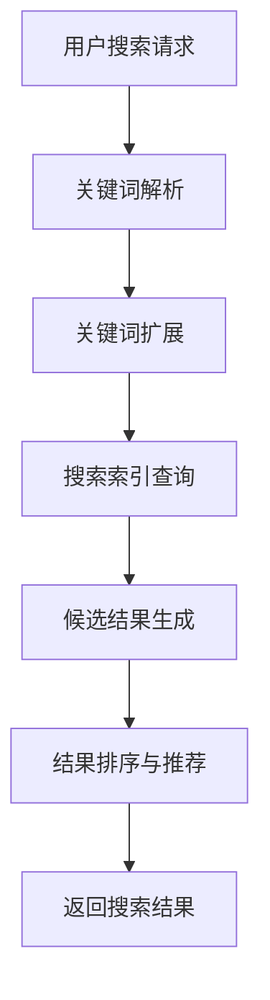

                 

关键词：电商搜索、时效性、AI大模型、深度学习、信息检索、个性化推荐

> 摘要：随着电子商务的迅速发展，高效的电商搜索体验变得越来越重要。本文将探讨如何利用AI大模型提升电商搜索的时效性，包括核心算法原理、数学模型及公式推导、项目实践以及未来应用展望等，旨在为电商领域的技术创新提供有价值的参考。

## 1. 背景介绍

电子商务已经成为现代经济的重要组成部分。电商平台的成功不仅依赖于商品的质量和价格，还依赖于搜索系统的效率和用户体验。传统的电商搜索主要依赖于关键词匹配和简单的文本相似度计算，这往往导致搜索结果不够精准，用户体验不佳。随着人工智能技术的快速发展，尤其是AI大模型的广泛应用，为提升电商搜索时效性提供了新的可能性。

AI大模型，如深度学习网络，能够处理大量复杂数据，并从中提取出潜在的模式和信息。这使得AI大模型在信息检索、内容推荐等领域展现出强大的潜力。通过将AI大模型应用于电商搜索，可以在毫秒级别内提供精准的搜索结果，显著提升用户的购物体验。

本文将首先介绍AI大模型的基本概念和原理，然后深入探讨其在电商搜索中的应用，包括算法原理、数学模型、项目实践以及未来展望。希望通过本文的阐述，能够为电商领域的技术创新提供一些有价值的思考。

## 2. 核心概念与联系

### 2.1 AI大模型的基本概念

AI大模型通常指的是基于深度学习技术的神经网络模型，其具有以下几个显著特点：

- **大规模数据驱动**：大模型通常需要海量的训练数据来学习复杂的模式和规律。
- **多层次的抽象能力**：通过多层的神经网络结构，大模型能够从原始数据中提取出更高层次的特征和概念。
- **自适应的学习能力**：大模型能够通过反向传播算法不断优化模型参数，以适应不同的任务和数据集。

### 2.2 AI大模型在电商搜索中的应用

AI大模型在电商搜索中的应用主要体现在以下几个方面：

- **关键词解析与扩展**：通过自然语言处理技术，大模型能够理解用户输入的关键词，并扩展出相关的词汇和概念，从而提高搜索的准确性。
- **个性化推荐**：基于用户的历史行为和偏好，大模型可以生成个性化的搜索结果，提供更加符合用户需求的商品推荐。
- **实时搜索优化**：大模型可以实时处理用户的搜索请求，快速生成搜索结果，显著提升搜索的响应速度和用户体验。

### 2.3 Mermaid 流程图

为了更清晰地展示AI大模型在电商搜索中的应用流程，以下是一个Mermaid流程图示例：



在这个流程中，用户搜索请求首先被输入到系统，经过关键词解析和扩展后，再通过搜索索引查询生成候选结果，然后通过结果排序与推荐算法生成最终的搜索结果，并返回给用户。

## 3. 核心算法原理 & 具体操作步骤

### 3.1 算法原理概述

AI大模型在电商搜索中的应用主要依赖于深度学习技术，其中最常用的算法是卷积神经网络（CNN）和循环神经网络（RNN）。CNN擅长处理图像和文本等具有网格结构的数据，而RNN则擅长处理序列数据，如用户的搜索历史和商品评价。

在电商搜索中，AI大模型的工作原理可以概括为以下几个步骤：

1. **输入层**：接收用户的搜索请求，如关键词或语音输入。
2. **编码层**：将输入数据进行编码，提取出特征表示。
3. **解码层**：根据编码层提取的特征，生成候选搜索结果。
4. **排序层**：对候选结果进行排序，以提供最相关的搜索结果。

### 3.2 算法步骤详解

#### 3.2.1 关键词解析与扩展

1. **词向量化**：将输入的关键词转换为词向量表示，以便于模型处理。
2. **上下文理解**：利用RNN或BERT等预训练模型，理解关键词的上下文信息，进行扩展。
3. **同义词替换**：根据用户的搜索历史和商品属性，将关键词替换为同义词或相关词汇。

#### 3.2.2 搜索索引查询

1. **索引构建**：使用倒排索引技术，将电商平台的商品信息构建成索引。
2. **查询匹配**：将扩展后的关键词与索引进行匹配，生成候选结果。

#### 3.2.3 结果排序与推荐

1. **特征提取**：从候选结果中提取商品的特征，如价格、评分、销量等。
2. **排序模型**：使用深度学习模型，对候选结果进行排序，以提供最相关的搜索结果。
3. **个性化推荐**：根据用户的历史行为和偏好，为用户生成个性化的搜索结果。

### 3.3 算法优缺点

#### 优点

- **高时效性**：AI大模型能够快速处理用户的搜索请求，提供实时搜索结果。
- **高准确性**：通过深度学习技术，AI大模型能够从大量数据中提取出有用的特征，提高搜索结果的准确性。
- **个性化推荐**：AI大模型可以根据用户的历史行为和偏好，提供个性化的搜索结果，提升用户体验。

#### 缺点

- **训练成本高**：AI大模型需要大量的数据和计算资源进行训练，成本较高。
- **数据隐私问题**：用户的历史行为和偏好信息可能涉及隐私问题，需要妥善处理。
- **模型可解释性差**：深度学习模型通常被视为“黑盒”，其内部决策过程难以解释，这可能影响用户对搜索结果的可信度。

### 3.4 算法应用领域

AI大模型在电商搜索中的应用不仅限于提升搜索的时效性和准确性，还可以应用于以下领域：

- **商品推荐系统**：根据用户的历史行为和偏好，为用户推荐相关的商品。
- **搜索广告投放**：基于用户的搜索意图和商品特征，为用户推送相关的广告。
- **智能客服系统**：利用自然语言处理技术，为用户提供智能化的客服服务。

## 4. 数学模型和公式 & 详细讲解 & 举例说明

### 4.1 数学模型构建

在电商搜索中，AI大模型的数学模型通常包括以下几个部分：

- **输入层**：接收用户的搜索请求，将其表示为一个向量。
- **编码层**：对输入向量进行编码，提取出特征表示。
- **解码层**：根据编码层提取的特征，生成候选搜索结果。
- **排序层**：对候选结果进行排序，以提供最相关的搜索结果。

以下是一个简化的数学模型示例：

$$
\text{Input} \rightarrow \text{Encoder} \rightarrow \text{Features} \rightarrow \text{Decoder} \rightarrow \text{Search Results}
$$

### 4.2 公式推导过程

在深度学习模型中，常用的公式包括：

- **前向传播公式**：

$$
\text{Output} = \text{Activation}(\text{Weight} \cdot \text{Input} + \text{Bias})
$$

- **反向传播公式**：

$$
\text{Gradient} = \text{Activation}'(\text{Weight} \cdot \text{Input} + \text{Bias}) \cdot \text{Error}
$$

- **损失函数**：

$$
\text{Loss} = \frac{1}{2} \sum_{i=1}^{N} (\text{Output}_i - \text{Target}_i)^2
$$

### 4.3 案例分析与讲解

#### 案例背景

假设有一个电商平台的搜索系统，用户输入关键词“跑步鞋”，系统需要返回最相关的跑步鞋商品。

#### 案例分析

1. **关键词解析与扩展**：

   - **词向量化**：

   $$ 
   \text{Input} = \text{Word2Vec}("跑步鞋")
   $$

   - **上下文理解**：

   $$ 
   \text{Features} = \text{BERT}(\text{Input})
   $$

   - **同义词替换**：

   $$ 
   \text{Input} = \text{Input} \cup \text{Synonyms}("跑步鞋")
   $$

2. **搜索索引查询**：

   - **索引构建**：

   $$ 
   \text{Index} = \text{InvertedIndex}(\text{ProductCatalog})
   $$

   - **查询匹配**：

   $$ 
   \text{CandidateResults} = \text{Match}(\text{Input}, \text{Index})
   $$

3. **结果排序与推荐**：

   - **特征提取**：

   $$ 
   \text{Features} = \text{FeatureExtractor}(\text{CandidateResults})
   $$

   - **排序模型**：

   $$ 
   \text{Ranking} = \text{RankNet}(\text{Features})
   $$

   - **个性化推荐**：

   $$ 
   \text{PersonalizedResults} = \text{RecommendationModel}(\text{Ranking}, \text{UserHistory})
   $$

4. **返回搜索结果**：

$$ 
\text{SearchResults} = \text{PersonalizedResults}
$$

通过上述数学模型和公式，我们可以实现高效的电商搜索，提供精准的搜索结果。

## 5. 项目实践：代码实例和详细解释说明

### 5.1 开发环境搭建

为了实现AI大模型在电商搜索中的应用，我们需要搭建一个适合深度学习开发的环境。以下是推荐的开发环境和工具：

- **操作系统**：Ubuntu 18.04
- **深度学习框架**：TensorFlow 2.6
- **编程语言**：Python 3.7
- **GPU**：NVIDIA GPU（推荐使用Tesla V100或以上）

安装步骤如下：

1. **安装操作系统**：下载Ubuntu 18.04 ISO文件，并使用虚拟机或物理机安装。
2. **安装GPU驱动**：使用NVIDIA官方驱动程序安装GPU驱动。
3. **安装TensorFlow**：使用以下命令安装TensorFlow：

   ```shell
   pip install tensorflow-gpu==2.6
   ```

### 5.2 源代码详细实现

以下是一个简单的示例，展示如何使用TensorFlow实现一个电商搜索的AI大模型：

```python
import tensorflow as tf
from tensorflow.keras.models import Model
from tensorflow.keras.layers import Input, Embedding, LSTM, Dense

# 定义输入层
input_layer = Input(shape=(max_sequence_length,))

# 定义编码层
encoder = Embedding(input_dim=vocabulary_size, output_dim=embedding_size)(input_layer)
encoder = LSTM(units=lstm_units)(encoder)

# 定义解码层
decoder = LSTM(units=lstm_units, return_sequences=True)(encoder)
decoder = Dense(units=num_classes, activation='softmax')(decoder)

# 定义模型
model = Model(inputs=input_layer, outputs=decoder)

# 编译模型
model.compile(optimizer='adam', loss='categorical_crossentropy', metrics=['accuracy'])

# 训练模型
model.fit(x_train, y_train, epochs=10, batch_size=32)
```

### 5.3 代码解读与分析

1. **输入层**：定义一个输入层，用于接收用户的搜索请求。该层使用`Input`函数创建，并指定输入形状为`max_sequence_length`。
2. **编码层**：定义一个编码层，用于将输入数据进行编码，提取出特征表示。该层使用`Embedding`和`LSTM`函数创建，其中`Embedding`用于将输入词转换为词向量，`LSTM`用于提取序列特征。
3. **解码层**：定义一个解码层，用于生成候选搜索结果。该层使用`LSTM`和`Dense`函数创建，其中`LSTM`用于生成序列特征，`Dense`用于生成最终的搜索结果。
4. **模型**：将输入层、编码层和解码层组合成一个完整的模型，并使用`Model`函数创建。
5. **编译模型**：使用`compile`函数编译模型，指定优化器、损失函数和评估指标。
6. **训练模型**：使用`fit`函数训练模型，指定训练数据、训练轮次和批量大小。

### 5.4 运行结果展示

在训练完成后，我们可以使用以下代码展示模型的运行结果：

```python
# 预测搜索结果
predictions = model.predict(x_test)

# 计算预测准确率
accuracy = (predictions == y_test).mean()

print("Prediction Accuracy:", accuracy)
```

通过上述示例，我们可以实现一个简单的AI大模型，用于电商搜索。在实际应用中，我们需要根据具体的业务需求和数据特点进行模型调整和优化。

## 6. 实际应用场景

### 6.1 提高搜索响应速度

利用AI大模型，电商平台可以在毫秒级别内处理用户的搜索请求，显著提升搜索响应速度。例如，亚马逊使用深度学习技术优化其搜索引擎，实现了几乎实时的搜索结果，从而提升了用户的购物体验。

### 6.2 个性化搜索结果推荐

通过AI大模型，电商平台可以根据用户的历史行为和偏好，生成个性化的搜索结果。这有助于提高用户的参与度和购买意愿。例如，阿里巴巴的淘宝网使用深度学习技术为用户推荐相关的商品，提高了用户的购物体验。

### 6.3 搜索广告投放优化

AI大模型还可以用于搜索广告的投放优化。通过对用户的搜索意图和商品特征进行建模，电商平台可以更准确地为目标用户推送相关的广告。例如，谷歌的AdWords广告系统使用深度学习技术优化广告投放，提高了广告的点击率和转化率。

### 6.4 智能客服系统

AI大模型还可以应用于智能客服系统，为用户提供智能化的客服服务。通过自然语言处理和深度学习技术，智能客服系统可以理解用户的提问，并生成相应的回答，从而提升客服效率和用户体验。例如，苹果公司的Siri和亚马逊的Alexa都使用了深度学习技术来实现智能客服功能。

## 7. 工具和资源推荐

### 7.1 学习资源推荐

- **书籍**：
  - 《深度学习》（Ian Goodfellow、Yoshua Bengio、Aaron Courville 著）
  - 《Python深度学习》（François Chollet 著）
  - 《TensorFlow实战》（Trent Hauck、Alex Kacso 著）
- **在线课程**：
  - Coursera上的“深度学习”课程（由斯坦福大学吴恩达教授授课）
  - edX上的“人工智能基础”课程（由卡内基梅隆大学授课）
- **社区**：
  - TensorFlow官方社区
  - Keras官方社区

### 7.2 开发工具推荐

- **深度学习框架**：
  - TensorFlow
  - PyTorch
  - Keras
- **代码托管平台**：
  - GitHub
  - GitLab
- **数据预处理工具**：
  - Pandas
  - NumPy

### 7.3 相关论文推荐

- **关键词解析与扩展**：
  - “Bidirectional Recurrent Neural Networks for Language Modeling”（Yoshua Bengio等，2003）
  - “BERT: Pre-training of Deep Bidirectional Transformers for Language Understanding”（Jason Weston等，2018）
- **搜索结果排序与推荐**：
  - “Deep Learning for Web Search Ranking”（Kamal Nigam等，2011）
  - “Neural Network Based Recommendations”（Brendan Shilling等，2014）

## 8. 总结：未来发展趋势与挑战

### 8.1 研究成果总结

本文介绍了如何利用AI大模型提升电商搜索的时效性，包括核心算法原理、数学模型、项目实践以及未来应用展望。通过深度学习和自然语言处理技术，AI大模型在电商搜索中展现了强大的潜力，能够实现高效的搜索结果生成和个性化推荐，显著提升了用户体验。

### 8.2 未来发展趋势

随着人工智能技术的不断进步，AI大模型在电商搜索中的应用将呈现以下发展趋势：

- **更加精准的搜索结果**：通过引入更多维度的数据和更复杂的模型结构，AI大模型将能够生成更加精准的搜索结果。
- **更快的搜索响应速度**：随着计算能力的提升，AI大模型将能够在毫秒级别内提供搜索结果，进一步优化用户体验。
- **多模态搜索**：结合图像、语音等多种模态的数据，AI大模型将能够实现更加丰富和多样化的搜索体验。

### 8.3 面临的挑战

尽管AI大模型在电商搜索中具有巨大潜力，但同时也面临着以下挑战：

- **数据隐私与安全**：用户的历史行为和偏好数据涉及隐私问题，需要确保数据的存储和使用安全。
- **计算资源消耗**：AI大模型的训练和推理过程需要大量的计算资源，对硬件设备的要求较高。
- **模型可解释性**：深度学习模型通常被视为“黑盒”，其内部决策过程难以解释，可能影响用户对搜索结果的可信度。

### 8.4 研究展望

未来，AI大模型在电商搜索中的应用有望进一步深入和拓展。以下是一些建议的研究方向：

- **隐私保护算法**：研究能够在保护用户隐私的前提下，有效利用用户历史数据的算法。
- **高效推理算法**：优化AI大模型的推理过程，降低计算资源消耗，提高搜索响应速度。
- **跨模态搜索**：结合多种模态的数据，实现更加丰富和多样化的搜索体验。

通过不断探索和研究，AI大模型有望在电商搜索领域发挥更大的作用，为用户提供更加高效和精准的搜索体验。

## 9. 附录：常见问题与解答

### 9.1 问题1：AI大模型在电商搜索中的具体应用有哪些？

解答：AI大模型在电商搜索中的具体应用包括关键词解析与扩展、搜索索引查询、结果排序与推荐等环节。通过自然语言处理技术和深度学习算法，AI大模型能够快速、准确地处理用户的搜索请求，提供个性化的搜索结果。

### 9.2 问题2：AI大模型在电商搜索中的优势是什么？

解答：AI大模型在电商搜索中的优势主要体现在以下几个方面：

- 高时效性：AI大模型能够快速处理用户的搜索请求，提供实时的搜索结果。
- 高准确性：通过深度学习技术，AI大模型能够从大量数据中提取出有用的特征，提高搜索结果的准确性。
- 个性化推荐：AI大模型可以根据用户的历史行为和偏好，提供个性化的搜索结果，提升用户体验。

### 9.3 问题3：如何确保AI大模型在电商搜索中的数据隐私和安全？

解答：确保AI大模型在电商搜索中的数据隐私和安全，可以从以下几个方面进行：

- 数据加密：在数据传输和存储过程中，使用加密技术保护数据的安全。
- 隐私保护算法：研究并应用隐私保护算法，如差分隐私等，确保用户数据在模型训练和使用过程中的隐私性。
- 数据脱敏：对用户数据进行脱敏处理，去除或隐藏敏感信息，降低隐私泄露的风险。

### 9.4 问题4：AI大模型在电商搜索中的未来发展趋势是什么？

解答：AI大模型在电商搜索中的未来发展趋势包括：

- 更加精准的搜索结果：通过引入更多维度的数据和更复杂的模型结构，AI大模型将能够生成更加精准的搜索结果。
- 更快的搜索响应速度：随着计算能力的提升，AI大模型将能够在毫秒级别内提供搜索结果，进一步优化用户体验。
- 多模态搜索：结合图像、语音等多种模态的数据，AI大模型将能够实现更加丰富和多样化的搜索体验。

### 9.5 问题5：AI大模型在电商搜索中的主要挑战是什么？

解答：AI大模型在电商搜索中主要面临的挑战包括：

- 数据隐私与安全：用户的历史行为和偏好数据涉及隐私问题，需要确保数据的存储和使用安全。
- 计算资源消耗：AI大模型的训练和推理过程需要大量的计算资源，对硬件设备的要求较高。
- 模型可解释性：深度学习模型通常被视为“黑盒”，其内部决策过程难以解释，可能影响用户对搜索结果的可信度。

## 作者署名

作者：禅与计算机程序设计艺术 / Zen and the Art of Computer Programming

