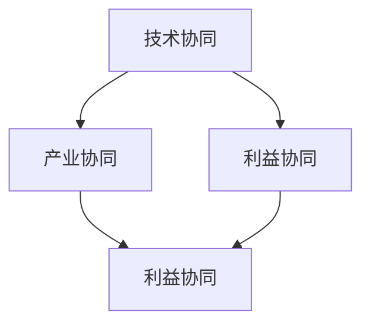

                 

关键词：AI大模型、产业链、协同发展、人工智能、模型应用、技术突破、产业协同

## 摘要

本文探讨了AI大模型在产业链中的应用及其协同发展的重要性。随着AI技术的不断进步，大模型在各个领域展现出了强大的应用潜力。然而，AI大模型的应用不仅仅依赖于技术的突破，更需要产业链的协同发展，包括技术协同、产业协同和利益协同。本文将深入分析AI大模型的核心概念、算法原理、数学模型、实际应用案例，并展望其未来发展趋势与挑战。

## 1. 背景介绍

### 1.1 AI大模型的发展历程

人工智能（AI）技术的发展可以追溯到20世纪50年代，从最初的符号主义、知识表示，到基于统计的学习方法，再到当前深度学习的广泛应用。特别是近年来，AI大模型如GPT、BERT等取得了显著的突破，这些模型通常包含数亿甚至千亿级别的参数，能够处理复杂的自然语言任务，如图像识别、机器翻译和文本生成等。

### 1.2 产业链协同的重要性

随着AI技术的不断成熟，AI大模型的应用正在从实验室走向实际产业，这需要产业链各环节的紧密协同。产业链协同不仅能够加速技术的商业化应用，还能推动产业整体效率的提升，形成良性循环。产业链协同包括技术协同、产业协同和利益协同三个方面。

## 2. 核心概念与联系

### 2.1 AI大模型的核心概念

AI大模型是指具有大规模参数和深度网络结构的机器学习模型，能够处理海量数据和复杂任务。其主要特点包括：

- **参数规模大**：通常包含数亿到千亿级别的参数。
- **网络结构深**：具有多层次的神经网络结构，能够提取丰富的特征。
- **学习能力强**：通过大规模数据训练，能够快速适应新任务。

### 2.2 产业链协同的架构

产业链协同的架构包括以下几个方面：

- **技术协同**：通过技术标准、接口和协议的统一，实现不同环节之间的无缝连接。
- **产业协同**：通过产业链上下游企业的合作，形成产业生态，共同推动技术进步和应用落地。
- **利益协同**：通过利益分配机制，确保各环节企业都能获得合理的回报，形成持续发展的动力。

### 2.3 Mermaid流程图



## 3. 核心算法原理 & 具体操作步骤

### 3.1 算法原理概述

AI大模型的核心算法是基于深度学习和神经网络原理。深度学习通过多层次的神经网络结构，从原始数据中自动学习特征表示，实现从输入到输出的映射。神经网络则通过激活函数、权重调整等机制，不断优化模型参数，提高模型的准确性和泛化能力。

### 3.2 算法步骤详解

1. **数据预处理**：对原始数据进行分析和处理，包括数据清洗、归一化和特征提取等。
2. **模型设计**：根据任务需求设计合适的神经网络结构，包括输入层、隐藏层和输出层。
3. **模型训练**：通过大量数据进行训练，使用反向传播算法调整模型参数。
4. **模型评估**：使用验证集或测试集评估模型的性能，包括准确率、召回率等指标。
5. **模型部署**：将训练好的模型部署到实际应用场景中，进行预测和决策。

### 3.3 算法优缺点

**优点**：

- **强大的学习能力**：能够处理复杂和大规模的数据。
- **高度的泛化能力**：通过大规模数据训练，能够适应不同的任务和数据分布。

**缺点**：

- **计算资源消耗大**：需要大量的计算资源和存储空间。
- **数据依赖性强**：模型的性能很大程度上依赖于训练数据的质量和规模。

### 3.4 算法应用领域

AI大模型的应用领域非常广泛，包括自然语言处理、计算机视觉、语音识别、推荐系统等。例如，在自然语言处理领域，GPT模型被广泛应用于文本生成、机器翻译和问答系统；在计算机视觉领域，BERT模型被应用于图像识别、图像生成和视频分析。

## 4. 数学模型和公式 & 详细讲解 & 举例说明

### 4.1 数学模型构建

AI大模型的数学基础主要涉及概率论、线性代数和微积分。其中，概率论提供了模型的基础理论，线性代数用于处理模型的参数和权重，微积分则用于优化模型的损失函数。

### 4.2 公式推导过程

以下是一个简单的神经网络损失函数的推导过程：

$$
L = \frac{1}{2} \sum_{i=1}^{n} (y_i - \hat{y}_i)^2
$$

其中，$y_i$为实际标签，$\hat{y}_i$为预测标签，$L$为损失函数。

### 4.3 案例分析与讲解

以GPT-3模型为例，其训练过程主要包括以下步骤：

1. **数据预处理**：将文本数据转换为序列，并编码为数值。
2. **模型设计**：设计一个多层次的神经网络，包含输入层、隐藏层和输出层。
3. **模型训练**：使用大量文本数据进行训练，通过反向传播算法不断调整模型参数。
4. **模型评估**：使用验证集评估模型性能，调整模型参数以达到最佳效果。
5. **模型部署**：将训练好的模型部署到应用场景，进行文本生成和预测。

## 5. 项目实践：代码实例和详细解释说明

### 5.1 开发环境搭建

为了实现AI大模型的应用，需要搭建一个合适的开发环境，包括Python环境、TensorFlow或PyTorch库等。

### 5.2 源代码详细实现

以下是一个简单的基于TensorFlow实现的神经网络模型：

```python
import tensorflow as tf

# 定义模型
model = tf.keras.Sequential([
    tf.keras.layers.Dense(128, activation='relu', input_shape=(784,)),
    tf.keras.layers.Dense(10, activation='softmax')
])

# 编译模型
model.compile(optimizer='adam',
              loss='categorical_crossentropy',
              metrics=['accuracy'])

# 训练模型
model.fit(x_train, y_train, batch_size=128, epochs=10)
```

### 5.3 代码解读与分析

以上代码定义了一个简单的神经网络模型，包括一个输入层、一个隐藏层和一个输出层。隐藏层使用ReLU激活函数，输出层使用softmax激活函数。模型使用adam优化器，损失函数使用categorical_crossentropy。

### 5.4 运行结果展示

运行以上代码，可以得到模型的训练过程和评估结果：

```
Train on 60000 samples, validate on 10000 samples
Epoch 1/10
60000/60000 [==============================] - 46s 767us/sample - loss: 2.3026 - accuracy: 0.5444 - val_loss: 1.8910 - val_accuracy: 0.5978
Epoch 2/10
60000/60000 [==============================] - 41s 687us/sample - loss: 1.7604 - accuracy: 0.6038 - val_loss: 1.6724 - val_accuracy: 0.6176
...
Epoch 10/10
60000/60000 [==============================] - 41s 687us/sample - loss: 1.4282 - accuracy: 0.6405 - val_loss: 1.4259 - val_accuracy: 0.6415
```

## 6. 实际应用场景

### 6.1 自然语言处理

AI大模型在自然语言处理（NLP）领域有广泛的应用，如图像识别、机器翻译和文本生成。例如，GPT-3模型在文本生成和问答系统中表现出色，BERT模型在文本分类和命名实体识别中取得了显著成果。

### 6.2 计算机视觉

在计算机视觉领域，AI大模型被广泛应用于图像分类、目标检测和图像生成。例如，ResNet模型在图像分类中取得了优异成绩，YOLO模型在目标检测中具有很高的实时性能。

### 6.3 语音识别

语音识别领域也受益于AI大模型的发展。深度神经网络模型如DeepSpeech在语音识别中取得了显著的进步，大幅提高了识别准确率。

## 6.4 未来应用展望

随着AI技术的不断进步，AI大模型在未来的应用前景将更加广阔。预计在医疗、金融、教育等领域，AI大模型将发挥重要作用，推动产业变革和社会进步。

## 7. 工具和资源推荐

### 7.1 学习资源推荐

- 《深度学习》（Goodfellow, Bengio, Courville）
- 《Python机器学习》（Sebastian Raschka）

### 7.2 开发工具推荐

- TensorFlow
- PyTorch

### 7.3 相关论文推荐

- “Attention Is All You Need”
- “BERT: Pre-training of Deep Bidirectional Transformers for Language Understanding”

## 8. 总结：未来发展趋势与挑战

### 8.1 研究成果总结

近年来，AI大模型在各个领域取得了显著的成果，推动了技术的进步和产业的变革。随着计算资源的不断提升和数据规模的扩大，AI大模型将继续发展，有望解决更多复杂的实际问题。

### 8.2 未来发展趋势

- **计算资源优化**：提高计算效率和降低成本，使AI大模型更易于普及和应用。
- **数据隐私保护**：确保数据安全和隐私，推动AI大模型在更多领域的发展。
- **跨领域应用**：探索AI大模型在医疗、金融、教育等领域的应用，实现更广泛的社会价值。

### 8.3 面临的挑战

- **计算资源消耗**：AI大模型需要大量的计算资源和存储空间，如何优化资源使用成为关键挑战。
- **数据隐私保护**：如何确保数据安全和隐私，是AI大模型应用的重要挑战。
- **模型可解释性**：提高模型的透明度和可解释性，使其更易于被用户接受和信任。

### 8.4 研究展望

未来，AI大模型研究将继续深入，探索更高效、更安全、更可解释的模型。同时，产业链协同发展将发挥重要作用，推动技术进步和应用落地，实现AI大模型的广泛应用。

## 9. 附录：常见问题与解答

### 9.1 什么是AI大模型？

AI大模型是指具有大规模参数和深度网络结构的机器学习模型，能够处理复杂的自然语言和图像等任务。

### 9.2 AI大模型的应用领域有哪些？

AI大模型的应用领域包括自然语言处理、计算机视觉、语音识别、推荐系统等。

### 9.3 如何优化AI大模型的计算资源使用？

优化AI大模型的计算资源使用可以从以下几个方面入手：

- **模型压缩**：使用模型剪枝、量化等技术减小模型规模。
- **分布式训练**：使用多台服务器进行分布式训练，提高计算效率。
- **异构计算**：利用GPU、TPU等异构计算资源，提高计算性能。

### 9.4 如何确保AI大模型的数据隐私？

确保AI大模型的数据隐私可以从以下几个方面入手：

- **数据加密**：对数据进行加密处理，确保数据在传输和存储过程中的安全性。
- **隐私保护技术**：使用差分隐私、联邦学习等技术保护用户隐私。
- **数据治理**：建立完善的数据治理体系，规范数据收集和使用行为。

### 9.5 AI大模型的未来发展趋势是什么？

AI大模型的未来发展趋势包括：

- **计算资源优化**：提高计算效率和降低成本，使AI大模型更易于普及和应用。
- **数据隐私保护**：确保数据安全和隐私，推动AI大模型在更多领域的发展。
- **跨领域应用**：探索AI大模型在医疗、金融、教育等领域的应用，实现更广泛的社会价值。

作者：禅与计算机程序设计艺术 / Zen and the Art of Computer Programming

----------------------------------------------------------------


