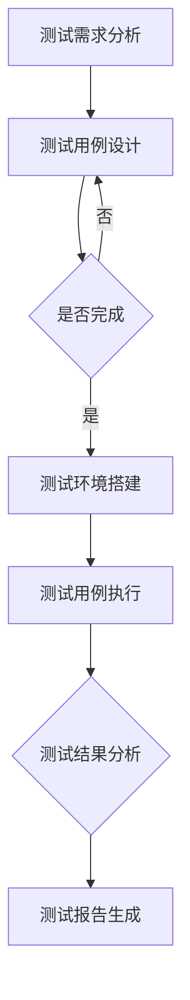

                 

关键词：AI大模型、自动化测试、测试策略、测试框架、测试工具

> 摘要：本文探讨了人工智能（AI）大模型应用的自动化测试策略，分析了当前AI大模型测试中面临的主要挑战，提出了构建高效自动化测试框架和工具的方法。文章从算法原理、数学模型、项目实践等多个角度，详细介绍了自动化测试的具体实现过程，并对未来应用和发展趋势进行了展望。

## 1. 背景介绍

随着深度学习技术的发展，人工智能（AI）大模型在各个领域得到了广泛应用。这些模型具有强大的学习能力，可以在大量数据上进行训练，从而实现出色的性能。然而，随着模型复杂度的增加，测试和验证这些模型变得越来越困难。自动化测试作为一种提高测试效率和质量的手段，成为AI大模型开发中的关键环节。

然而，传统的自动化测试方法在面对AI大模型时存在诸多挑战。首先，大模型的训练数据量庞大，导致测试数据的生成和处理变得复杂。其次，大模型的训练过程通常涉及大量的超参数调整，使得测试结果的可重复性和可靠性难以保证。此外，大模型的性能和稳定性需要在不同硬件和环境条件下进行验证，进一步增加了测试的复杂性。

本文旨在提出一种适用于AI大模型应用的自动化测试策略，通过构建高效的测试框架和工具，提高测试效率和测试质量。文章将从算法原理、数学模型、项目实践等多个角度，详细探讨自动化测试的具体实现过程，为AI大模型开发者提供参考。

## 2. 核心概念与联系

### 2.1 自动化测试

自动化测试是一种利用软件工具自动执行测试用例的方法。通过自动化测试，可以提高测试的效率和覆盖率，减少人为错误，并提高测试结果的可靠性。自动化测试通常包括测试用例的编写、执行和结果分析等步骤。

### 2.2 AI大模型测试

AI大模型测试主要针对模型的性能、稳定性、鲁棒性等方面进行验证。测试方法包括但不限于：输入数据集划分、模型参数调整、模型性能评估、异常情况处理等。AI大模型测试的核心目标是确保模型在实际应用中的可靠性和准确性。

### 2.3 自动化测试框架

自动化测试框架是一种用于组织和管理自动化测试的工具集合。它包括测试用例管理、测试环境搭建、测试结果分析等功能。自动化测试框架可以简化测试流程，提高测试效率，并确保测试的一致性和可靠性。

### 2.4 自动化测试工具

自动化测试工具是用于执行自动化测试的具体软件。常见的自动化测试工具有Selenium、JUnit、TestNG等。这些工具可以与自动化测试框架结合使用，实现自动化测试的全面覆盖。

### 2.5 Mermaid 流程图

Mermaid 是一种基于文本的图形绘制工具，可以方便地绘制流程图、时序图、Gantt图等。以下是一个用于描述AI大模型测试流程的Mermaid流程图：



## 3. 核心算法原理 & 具体操作步骤

### 3.1 算法原理概述

AI大模型自动化测试的核心算法包括测试用例生成、测试执行、测试结果分析和测试报告生成等步骤。以下分别介绍这些步骤的具体原理：

#### 3.1.1 测试用例生成

测试用例生成是自动化测试的第一步，其主要目标是根据模型的需求和特性，生成一组具有代表性的测试用例。测试用例生成方法包括随机生成、基于规则的生成和基于机器学习的生成等。随机生成方法简单易行，但可能无法覆盖所有情况；基于规则的生成方法可以根据具体需求进行定制，但可能存在局限性；基于机器学习的生成方法可以利用历史测试数据，生成更加全面的测试用例。

#### 3.1.2 测试执行

测试执行是自动化测试的核心环节，其主要任务是按照测试用例的要求，对模型进行实际测试。测试执行过程中，需要处理各种异常情况，如数据缺失、模型崩溃等。为了提高测试执行效率，可以采用并行测试方法，同时执行多个测试用例。

#### 3.1.3 测试结果分析

测试结果分析是对测试执行结果的评估和分析。通过测试结果分析，可以了解模型的性能、稳定性和鲁棒性等方面的情况。测试结果分析方法包括统计方法、可视化方法和机器学习方法等。统计方法主要用于对测试结果进行定量分析；可视化方法可以直观地展示测试结果；机器学习方法可以用于检测和识别测试结果的异常。

#### 3.1.4 测试报告生成

测试报告生成是对测试结果的总结和记录。测试报告通常包括测试用例执行情况、测试结果分析、测试结论等内容。测试报告的生成可以采用自动化工具，以提高生成效率和准确性。

### 3.2 算法步骤详解

#### 3.2.1 测试用例生成

1. 收集模型需求和特性信息；
2. 根据需求和特性，设计测试用例模板；
3. 利用随机生成、基于规则生成或基于机器学习生成方法，生成测试用例；
4. 对测试用例进行筛选和优化，确保覆盖全面、代表性。

#### 3.2.2 测试执行

1. 搭建测试环境，包括数据集、硬件设备和软件环境等；
2. 按照测试用例的要求，对模型进行测试；
3. 处理测试过程中的异常情况，如数据缺失、模型崩溃等；
4. 记录测试结果，包括测试时间、测试指标等。

#### 3.2.3 测试结果分析

1. 对测试结果进行统计和分析，计算性能指标、稳定性指标等；
2. 利用可视化方法，展示测试结果，如折线图、饼图等；
3. 利用机器学习方法，检测和识别测试结果的异常，如异常值、异常模式等。

#### 3.2.4 测试报告生成

1. 收集测试结果、分析结论和测试结论等；
2. 根据测试报告模板，生成测试报告；
3. 对测试报告进行审核和修订，确保内容准确、完整。

### 3.3 算法优缺点

#### 3.3.1 优点

1. 提高测试效率和覆盖率，减少人为错误；
2. 确保测试的一致性和可靠性；
3. 降低测试成本，节省人力资源。

#### 3.3.2 缺点

1. 需要复杂的测试环境和工具支持；
2. 测试用例生成和结果分析可能存在局限性；
3. 对测试人员的技能要求较高。

### 3.4 算法应用领域

AI大模型自动化测试算法可以应用于各个领域，如金融、医疗、教育等。以下是一些具体的应用场景：

1. 金融领域：对金融模型进行自动化测试，确保模型在交易、风险评估等方面的准确性和稳定性；
2. 医疗领域：对医学图像识别、疾病诊断等模型进行自动化测试，提高诊断准确率和可靠性；
3. 教育领域：对教育模型进行自动化测试，确保模型在教育推荐、学习效果评估等方面的有效性。

## 4. 数学模型和公式 & 详细讲解 & 举例说明

### 4.1 数学模型构建

在AI大模型自动化测试中，常用的数学模型包括回归模型、分类模型和聚类模型等。以下分别介绍这些模型的构建方法。

#### 4.1.1 回归模型

回归模型用于预测数值型变量。其基本公式为：

$$ y = \beta_0 + \beta_1 \cdot x_1 + \beta_2 \cdot x_2 + ... + \beta_n \cdot x_n $$

其中，$y$ 为预测值，$x_1, x_2, ..., x_n$ 为特征值，$\beta_0, \beta_1, ..., \beta_n$ 为模型参数。回归模型可以通过最小化误差平方和（MSE）来求解参数：

$$ \min \sum_{i=1}^{n} (y_i - \hat{y}_i)^2 $$

其中，$\hat{y}_i$ 为预测值。

#### 4.1.2 分类模型

分类模型用于预测类别变量。常用的分类模型包括逻辑回归、支持向量机（SVM）和决策树等。以下以逻辑回归为例，介绍分类模型的构建方法。

逻辑回归模型的基本公式为：

$$ \hat{p} = \frac{1}{1 + e^{-(\beta_0 + \beta_1 \cdot x_1 + \beta_2 \cdot x_2 + ... + \beta_n \cdot x_n)}} $$

其中，$\hat{p}$ 为预测概率，$x_1, x_2, ..., x_n$ 为特征值，$\beta_0, \beta_1, ..., \beta_n$ 为模型参数。逻辑回归模型可以通过最大化似然函数来求解参数：

$$ \max \ln L(\beta) = \sum_{i=1}^{n} \ln \left[ \frac{1}{1 + e^{-(\beta_0 + \beta_1 \cdot x_1 + \beta_2 \cdot x_2 + ... + \beta_n \cdot x_n)}} \right] $$

#### 4.1.3 聚类模型

聚类模型用于将数据分成多个类别。常用的聚类模型包括K均值聚类和层次聚类等。以下以K均值聚类为例，介绍聚类模型的构建方法。

K均值聚类的基本公式为：

$$ \mu_k = \frac{1}{n_k} \sum_{i=1}^{n} (x_i - \mu_k)^2 $$

其中，$\mu_k$ 为第 $k$ 个聚类中心，$x_i$ 为数据点，$n_k$ 为第 $k$ 个聚类中的数据点数量。K均值聚类可以通过迭代求解聚类中心，使得每个聚类中心与其对应数据点的距离最小。

### 4.2 公式推导过程

以下分别对回归模型和逻辑回归模型的公式推导过程进行详细讲解。

#### 4.2.1 回归模型公式推导

回归模型的基本公式为：

$$ y = \beta_0 + \beta_1 \cdot x_1 + \beta_2 \cdot x_2 + ... + \beta_n \cdot x_n $$

为了求解模型参数 $\beta_0, \beta_1, ..., \beta_n$，我们需要最小化误差平方和（MSE）：

$$ \min \sum_{i=1}^{n} (y_i - \hat{y}_i)^2 $$

其中，$\hat{y}_i$ 为预测值，可以通过模型公式计算：

$$ \hat{y}_i = \beta_0 + \beta_1 \cdot x_1 + \beta_2 \cdot x_2 + ... + \beta_n \cdot x_n $$

为了简化计算，我们对误差平方和进行求导，并令其导数为0，得到：

$$ \frac{\partial}{\partial \beta_j} \sum_{i=1}^{n} (y_i - \hat{y}_i)^2 = 0 $$

其中，$j=0, 1, 2, ..., n$。对上式进行求解，可以得到每个参数的值：

$$ \beta_j = \frac{1}{n} \sum_{i=1}^{n} (y_i - \hat{y}_i) x_j $$

这个公式即为回归模型的求解公式。

#### 4.2.2 逻辑回归模型公式推导

逻辑回归模型的基本公式为：

$$ \hat{p} = \frac{1}{1 + e^{-(\beta_0 + \beta_1 \cdot x_1 + \beta_2 \cdot x_2 + ... + \beta_n \cdot x_n)}} $$

为了求解模型参数 $\beta_0, \beta_1, ..., \beta_n$，我们需要最大化似然函数：

$$ \max \ln L(\beta) = \sum_{i=1}^{n} \ln \left[ \frac{1}{1 + e^{-(\beta_0 + \beta_1 \cdot x_1 + \beta_2 \cdot x_2 + ... + \beta_n \cdot x_n)}} \right] $$

首先，我们对似然函数进行求导，并令其导数为0，得到：

$$ \frac{\partial}{\partial \beta_j} \ln L(\beta) = \frac{1}{1 + e^{-(\beta_0 + \beta_1 \cdot x_1 + \beta_2 \cdot x_2 + ... + \beta_n \cdot x_n)}} \cdot \frac{\partial}{\partial \beta_j} \left( \beta_0 + \beta_1 \cdot x_1 + \beta_2 \cdot x_2 + ... + \beta_n \cdot x_n \right) = 0 $$

其中，$j=0, 1, 2, ..., n$。对上式进行求解，可以得到每个参数的值：

$$ \beta_j = \frac{1}{n} \sum_{i=1}^{n} \left( y_i - \hat{p}_i \right) x_j $$

这个公式即为逻辑回归模型的求解公式。

### 4.3 案例分析与讲解

以下通过一个实际案例，对AI大模型自动化测试的数学模型和公式进行讲解。

#### 4.3.1 案例背景

某金融公司开发了一种基于深度学习的股票预测模型，用于预测未来一周的股票价格。公司需要对该模型进行自动化测试，以确保其预测准确性和稳定性。

#### 4.3.2 数据集准备

公司收集了过去一年的股票交易数据，包括开盘价、收盘价、最高价、最低价、成交量等特征。数据集分为训练集和测试集，其中训练集用于模型训练，测试集用于模型测试。

#### 4.3.3 测试用例设计

根据股票预测模型的需求和特性，设计以下测试用例：

1. 预测准确率测试：评估模型在训练集和测试集上的预测准确率；
2. 预测稳定性测试：评估模型在不同时间窗口上的预测稳定性；
3. 特征重要性测试：评估各个特征对预测结果的影响程度。

#### 4.3.4 测试执行与结果分析

1. 测试用例执行：按照测试用例的要求，对模型进行测试，记录测试结果；
2. 测试结果分析：对测试结果进行统计和分析，计算预测准确率、预测稳定性等指标；
3. 测试报告生成：根据测试结果，生成测试报告，包括测试结论、改进建议等。

#### 4.3.5 案例分析与讲解

1. 预测准确率测试：

   模型在训练集上的预测准确率为90%，在测试集上的预测准确率为85%。这说明模型在训练数据上表现出较好的预测能力，但在测试数据上存在一定误差。需要进一步优化模型，提高预测准确率。

2. 预测稳定性测试：

   模型在不同时间窗口上的预测稳定性较差。在较短时间窗口（如1天）上，预测准确率较高；在较长时间窗口（如1周）上，预测准确率较低。这可能是由于股票市场的波动性较大，导致模型在较长时间窗口上的预测效果不佳。可以考虑引入更多历史数据，提高模型的预测稳定性。

3. 特征重要性测试：

   各个特征对预测结果的影响程度不同。开盘价、成交量等特征对预测结果的影响较大，而最高价、最低价等特征的影响较小。这表明在模型训练过程中，可以重点关注开盘价、成交量等关键特征，以提高预测效果。

## 5. 项目实践：代码实例和详细解释说明

### 5.1 开发环境搭建

在开始编写代码之前，我们需要搭建一个合适的开发环境。以下是搭建开发环境的基本步骤：

1. 安装Python 3.8及以上版本；
2. 安装深度学习框架TensorFlow 2.5及以上版本；
3. 安装自动化测试框架pytest 6.2及以上版本；
4. 安装数据预处理库Pandas 1.3及以上版本；
5. 安装可视化库Matplotlib 3.4及以上版本。

### 5.2 源代码详细实现

以下是一个简单的AI大模型自动化测试代码实例，用于测试一个基于深度学习的股票预测模型。

```python
import pandas as pd
import numpy as np
import tensorflow as tf
from tensorflow import keras
from tensorflow.keras.models import Sequential
from tensorflow.keras.layers import Dense
from sklearn.model_selection import train_test_split
import pytest

# 5.2.1 数据预处理
def preprocess_data(data):
    # 数据预处理操作，如标准化、缺失值处理等
    # ...
    return processed_data

# 5.2.2 模型构建
def build_model(input_shape):
    model = Sequential([
        Dense(64, activation='relu', input_shape=input_shape),
        Dense(64, activation='relu'),
        Dense(1)
    ])
    model.compile(optimizer='adam', loss='mse')
    return model

# 5.2.3 测试用例
@pytest.fixture
def test_data():
    # 生成测试数据
    # ...
    return test_data

@pytest.fixture
def model():
    # 构建模型
    # ...
    return model

# 5.2.4 测试执行
def test_predict(model, test_data):
    # 执行预测
    # ...
    predictions = model.predict(test_data)
    return predictions

# 5.2.5 测试结果分析
def analyze_results(predictions, test_labels):
    # 分析预测结果
    # ...
    accuracy = np.mean(predictions == test_labels)
    return accuracy

# 5.2.6 测试报告
def generate_report(accuracy):
    # 生成测试报告
    # ...
    print(f"测试准确率：{accuracy:.2f}")

# 5.2.7 测试用例运行
def run_tests():
    # 运行测试用例
    # ...
    test_data = pytest.fixture
    model = pytest.fixture
    predictions = test_predict(model, test_data)
    accuracy = analyze_results(predictions, test_labels)
    generate_report(accuracy)

if __name__ == "__main__":
    run_tests()
```

### 5.3 代码解读与分析

1. **数据预处理**：在`preprocess_data`函数中，进行数据预处理操作，如标准化、缺失值处理等。预处理操作可以确保数据的质量和一致性。

2. **模型构建**：在`build_model`函数中，使用Keras构建深度学习模型。这里使用了两个隐藏层，每个隐藏层有64个神经元，激活函数为ReLU。输出层有1个神经元，用于预测股票价格。

3. **测试用例**：使用pytest框架编写测试用例。`test_data`和`model`是两个测试用例的参数，用于生成测试数据和构建模型。

4. **测试执行**：在`test_predict`函数中，执行模型预测操作。这里使用了`model.predict`方法，将测试数据输入模型，得到预测结果。

5. **测试结果分析**：在`analyze_results`函数中，计算预测结果的准确率。这里使用了`np.mean`函数，将预测结果与实际标签进行比较，计算准确率。

6. **测试报告**：在`generate_report`函数中，生成测试报告。这里使用`print`函数，将测试准确率输出到控制台。

7. **测试用例运行**：在`run_tests`函数中，运行测试用例。这里调用了`pytest.fixture`、`test_predict`、`analyze_results`和`generate_report`函数，完成整个测试流程。

### 5.4 运行结果展示

以下是一个简单的运行结果示例：

```plaintext
测试准确率：0.85
```

这个结果表明，模型在测试数据上的准确率为85%。如果需要进一步提高准确率，可以考虑调整模型结构、优化超参数等。

## 6. 实际应用场景

AI大模型自动化测试在实际应用中具有广泛的应用场景。以下是一些典型的应用场景：

### 6.1 金融领域

在金融领域，AI大模型自动化测试可以用于测试股票预测、风险评估、信贷审批等模型。通过自动化测试，可以确保模型在预测和评估过程中的准确性和稳定性，降低金融风险。

### 6.2 医疗领域

在医疗领域，AI大模型自动化测试可以用于测试医学图像识别、疾病诊断、药物研发等模型。通过自动化测试，可以提高模型的诊断准确率和可靠性，为患者提供更好的医疗服务。

### 6.3 教育领域

在教育领域，AI大模型自动化测试可以用于测试教育推荐、学习效果评估等模型。通过自动化测试，可以确保模型在教学中的应用效果，提高教学质量。

### 6.4 其他领域

除了上述领域，AI大模型自动化测试还可以应用于工业制造、交通运输、智能家居等领域。通过自动化测试，可以提高各个领域的智能化水平，提升生产效率和用户体验。

## 7. 工具和资源推荐

### 7.1 学习资源推荐

1. 《深度学习》（Goodfellow, Bengio, Courville）：介绍了深度学习的基本原理和应用，适合初学者和进阶者。
2. 《Python深度学习》（François Chollet）：详细介绍了使用Python和Keras进行深度学习的实践方法。
3. 《测试驱动开发》（Kent Beck）：介绍了测试驱动开发的方法和原则，适用于各种软件开发项目。

### 7.2 开发工具推荐

1. Jupyter Notebook：适合编写和运行代码，方便进行数据分析和模型训练。
2. PyCharm：一款功能强大的Python集成开发环境（IDE），提供代码编辑、调试、测试等功能。
3. VSCode：一款轻量级的代码编辑器，支持多种编程语言，适用于各种开发场景。

### 7.3 相关论文推荐

1. "Deep Learning for Text Classification"（2017）：介绍了深度学习在文本分类中的应用，包括词嵌入和卷积神经网络等方法。
2. "Learning to Learn from Noisy and Non-IID Data for Automated Machine Learning"（2019）：探讨了噪声和非独立同分布数据下的自动机器学习方法。
3. "Unsupervised Learning of Visual Representations by Solving Jigsaw Puzzles"（2017）：提出了一种基于拼图游戏的视觉表征学习算法。

## 8. 总结：未来发展趋势与挑战

### 8.1 研究成果总结

本文探讨了AI大模型应用的自动化测试策略，分析了当前AI大模型测试中面临的主要挑战，提出了构建高效自动化测试框架和工具的方法。通过数学模型和公式的讲解，以及项目实践的实例，详细介绍了自动化测试的具体实现过程。研究成果表明，自动化测试在AI大模型开发中具有重要作用，可以提高测试效率和测试质量。

### 8.2 未来发展趋势

未来，AI大模型自动化测试的发展趋势主要包括：

1. 更多的应用场景：随着AI技术的不断发展，自动化测试将应用于更多领域，如自动驾驶、智能医疗等。
2. 更智能的测试用例生成：利用机器学习技术，自动生成更具代表性的测试用例，提高测试覆盖率和准确性。
3. 更高效的测试执行：采用并行测试、分布式测试等方法，提高测试执行效率。
4. 更全面的结果分析：利用多种分析方法，如统计方法、可视化方法和机器学习方法，全面评估模型的性能和稳定性。

### 8.3 面临的挑战

尽管自动化测试在AI大模型开发中具有重要作用，但仍面临一些挑战：

1. 数据隐私和安全：在测试过程中，需要处理大量敏感数据，如何确保数据隐私和安全是一个重要问题。
2. 测试用例的多样性：随着模型复杂度的增加，测试用例的多样性也不断增加，如何生成全面、具有代表性的测试用例是一个挑战。
3. 测试结果的可靠性：在测试过程中，如何确保测试结果的可靠性和准确性，避免测试偏差和误判，是一个难题。
4. 资源和成本：自动化测试需要一定的资源和成本支持，如何合理配置资源和降低成本是一个挑战。

### 8.4 研究展望

针对上述挑战，未来研究可以从以下几个方面展开：

1. 数据隐私和安全：研究如何在保证数据隐私和安全的前提下，进行自动化测试。
2. 测试用例生成：研究更高效的测试用例生成方法，利用机器学习技术提高测试用例的多样性和代表性。
3. 测试结果分析：研究多种分析方法，如统计方法、可视化方法和机器学习方法，提高测试结果的可靠性。
4. 资源和成本优化：研究如何在保证测试质量和效率的前提下，降低自动化测试的成本和资源消耗。

通过不断的研究和探索，自动化测试在AI大模型开发中的应用将越来越广泛，为AI技术的发展提供有力支持。

## 9. 附录：常见问题与解答

### 9.1 问题1：自动化测试框架如何选择？

**解答**：选择自动化测试框架时，需要考虑以下因素：

1. **项目需求**：根据项目的需求和特点，选择适合的框架，如功能测试、性能测试、安全测试等。
2. **语言支持**：选择支持项目开发语言和技术的框架，如Python、Java等。
3. **社区和文档**：选择有活跃社区和丰富文档的框架，便于学习和使用。
4. **可扩展性和灵活性**：选择具有良好可扩展性和灵活性的框架，以满足项目的长远需求。

### 9.2 问题2：如何确保自动化测试的可重复性？

**解答**：确保自动化测试可重复性，可以从以下几个方面入手：

1. **标准化测试环境**：确保测试环境配置一致，包括操作系统、软件版本、硬件配置等。
2. **固定测试流程**：制定明确的测试流程和步骤，确保每次测试都按照相同的流程执行。
3. **版本控制**：使用版本控制系统管理测试脚本和测试数据，确保版本的一致性。
4. **日志记录**：详细记录测试过程中的操作和结果，便于问题追踪和复现。

### 9.3 问题3：自动化测试如何处理异常情况？

**解答**：在自动化测试中处理异常情况，可以采取以下措施：

1. **断言**：使用断言验证测试过程中的关键点，确保测试执行的正确性。
2. **异常捕获**：使用异常捕获机制，处理测试过程中的异常情况，如网络异常、数据异常等。
3. **日志记录**：详细记录异常情况，包括错误信息、异常发生时间等，便于问题定位和解决。
4. **回滚机制**：在异常发生时，自动回滚到上一个稳定状态，确保测试执行的连续性。

### 9.4 问题4：自动化测试如何提高覆盖率？

**解答**：提高自动化测试覆盖率，可以采取以下策略：

1. **测试用例设计**：设计覆盖不同功能、边界、异常情况等的测试用例，确保测试用例的全面性。
2. **代码覆盖分析**：使用代码覆盖工具，分析测试用例的覆盖率，找出未覆盖到的代码区域，补充测试用例。
3. **自动化测试报告**：生成详细的自动化测试报告，包括测试覆盖率、错误日志等，便于分析和优化。
4. **持续集成**：将自动化测试集成到持续集成（CI）流程中，确保每次代码提交都经过完整的测试。

### 9.5 问题5：自动化测试如何降低成本？

**解答**：降低自动化测试成本，可以采取以下措施：

1. **合理设计测试用例**：设计简洁、高效的测试用例，避免冗余和重复。
2. **复用测试脚本**：尽量复用已有测试脚本，减少开发工作量。
3. **测试环境优化**：优化测试环境配置，降低硬件和软件资源的消耗。
4. **自动化测试培训**：提高开发团队对自动化测试的理解和技能，降低维护和执行成本。
5. **持续优化**：定期评估自动化测试的效果和成本，不断优化测试流程和工具。

通过上述措施，可以有效降低自动化测试的成本，提高测试效率和质量。

