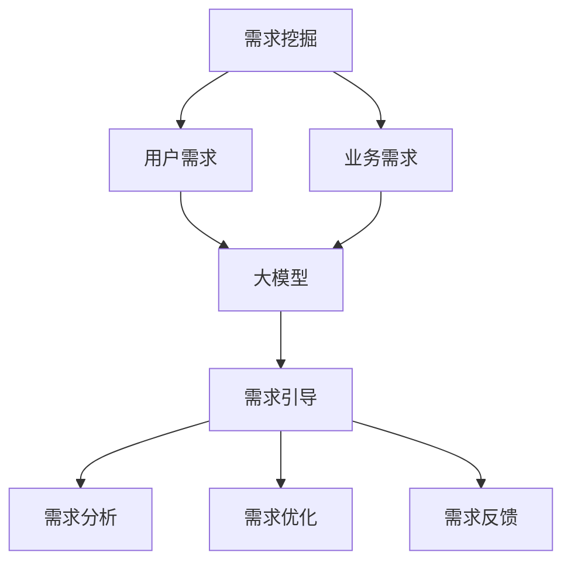

                 

关键词：AI大模型，需求挖掘，应用引导，算法原理，数学模型，项目实践，工具资源

> 摘要：本文旨在探讨AI大模型在当今时代的重要性和应用前景，通过深入分析需求挖掘的原理和方法，以及大模型的具体操作步骤，为AI大模型应用提供指导和参考。本文将从背景介绍、核心概念与联系、核心算法原理与操作步骤、数学模型和公式、项目实践、实际应用场景、工具和资源推荐、总结未来发展趋势与挑战等方面展开论述。

## 1. 背景介绍

近年来，人工智能（AI）技术取得了飞速的发展，特别是深度学习在图像识别、自然语言处理、语音识别等领域的应用取得了显著的成果。随着计算能力的提升和数据规模的扩大，AI大模型（如GPT-3、BERT、GAN等）逐渐成为研究热点，并在实际应用中发挥着越来越重要的作用。

AI大模型具有以下几个特点：

- **数据规模大**：大模型通常使用数十亿级别的参数进行训练，能够处理海量的数据。
- **计算能力强**：大模型通常需要大规模的硬件资源进行训练和推理。
- **通用性强**：大模型具有较强的泛化能力，可以在不同领域进行应用。

AI大模型在各个领域的应用案例层出不穷，如自动驾驶、智能客服、医疗诊断、金融风控等。然而，AI大模型的应用仍然面临许多挑战，其中之一就是需求挖掘。需求挖掘是AI大模型应用的基础，它直接决定了大模型在特定场景中的表现和效果。因此，如何进行有效的需求挖掘成为AI大模型应用的关键问题。

本文将围绕AI大模型应用的需求挖掘与引导展开讨论，旨在为相关领域的研究者和开发者提供参考和指导。

## 2. 核心概念与联系

为了深入理解AI大模型应用的需求挖掘与引导，我们需要明确以下几个核心概念：

### 2.1 需求挖掘

需求挖掘是指从大量数据中提取出有价值的信息和知识，以支持决策和优化过程。在AI大模型应用中，需求挖掘主要关注以下两个方面：

- **用户需求**：通过分析用户行为、反馈和需求，提取用户在特定场景中的需求。
- **业务需求**：通过分析业务数据、市场趋势和竞争环境，提取业务在特定场景中的需求。

### 2.2 大模型

大模型是指使用大量参数进行训练的深度学习模型，具有强大的计算能力和通用性。大模型主要包括以下几类：

- **神经网络**：如卷积神经网络（CNN）、循环神经网络（RNN）、Transformer等。
- **生成对抗网络（GAN）**：用于生成图像、文本等数据。
- **预训练模型**：如GPT-3、BERT等，通过对大量数据进行预训练，获得强大的通用能力。

### 2.3 需求引导

需求引导是指通过分析用户需求和业务需求，为大模型应用提供指导和支持。需求引导主要包括以下方面：

- **需求分析**：通过分析用户和业务需求，确定大模型应用的具体目标和范围。
- **需求优化**：根据实际应用效果，对需求进行优化和调整，以提高大模型的表现和效果。
- **需求反馈**：通过收集用户和业务反馈，不断迭代和优化需求，确保大模型应用的持续改进。

为了更好地理解这些核心概念之间的联系，我们可以使用Mermaid流程图进行展示：



在这个流程图中，需求挖掘是整个流程的起点，通过分析用户和业务需求，为大模型应用提供基础。大模型在需求引导下，通过对需求进行优化和反馈，不断提高应用效果。

## 3. 核心算法原理 & 具体操作步骤

### 3.1 算法原理概述

AI大模型的核心算法主要包括神经网络、生成对抗网络（GAN）和预训练模型等。这些算法在数据处理、特征提取和模型训练等方面具有不同的特点。

- **神经网络**：神经网络是一种模拟人脑神经元之间相互连接的计算模型，通过学习输入和输出之间的映射关系，实现对数据的分类、回归等任务。神经网络的核心是权重和偏置的调整，通过反向传播算法，不断优化模型参数。

- **生成对抗网络（GAN）**：GAN由生成器和判别器两个子网络组成，生成器生成数据，判别器判断数据是真实数据还是生成数据。通过两个网络的对抗训练，生成器逐渐生成更加逼真的数据。GAN在图像、文本和音频等领域的生成任务中表现出色。

- **预训练模型**：预训练模型通过对大量数据进行预训练，获得强大的通用能力。预训练模型通常使用大规模语料库进行训练，学习到语言的通用特征和规则，然后在特定任务上进行微调，实现高效的性能。

### 3.2 算法步骤详解

#### 3.2.1 神经网络

神经网络的主要步骤如下：

1. **数据预处理**：对输入数据进行归一化、标准化等处理，使其符合模型的输入要求。
2. **初始化模型参数**：随机初始化模型的权重和偏置。
3. **前向传播**：将输入数据传递到模型中，通过激活函数计算输出。
4. **反向传播**：计算输出误差，通过反向传播算法更新模型参数。
5. **迭代训练**：重复前向传播和反向传播，直至模型收敛。

#### 3.2.2 生成对抗网络（GAN）

生成对抗网络的主要步骤如下：

1. **生成器训练**：生成器生成数据，判别器判断数据真假，生成器和判别器交替训练，生成器逐渐生成更加逼真的数据。
2. **判别器训练**：判别器训练判断真实数据和生成数据的区别，通过对抗训练提高判别器的准确性。
3. **模型评估**：通过评估生成器和判别器的性能，判断GAN的训练效果。

#### 3.2.3 预训练模型

预训练模型的主要步骤如下：

1. **预训练**：使用大规模语料库对模型进行预训练，学习到语言的通用特征和规则。
2. **微调**：在特定任务上进行微调，优化模型的性能。
3. **模型评估**：评估预训练模型在特定任务上的性能，进行模型优化和调整。

### 3.3 算法优缺点

#### 3.3.1 神经网络

优点：

- 强大的计算能力，能够处理复杂的非线性问题。
- 自适应调整参数，适应不同的数据分布。

缺点：

- 需要大量的训练数据和计算资源。
- 参数调整过程容易陷入局部最优。

#### 3.3.2 生成对抗网络（GAN）

优点：

- 能够生成高质量的数据，适用于图像、文本和音频等生成任务。
- 具有很强的通用性，适用于不同的生成任务。

缺点：

- 训练过程不稳定，容易陷入模式崩溃。
- 对判别器的性能要求较高。

#### 3.3.3 预训练模型

优点：

- 提高模型的泛化能力，适用于不同的任务。
- 降低模型的训练成本，缩短训练时间。

缺点：

- 需要大量的预训练数据。
- 预训练模型的可解释性较差。

### 3.4 算法应用领域

AI大模型在各个领域的应用如下：

- **计算机视觉**：图像识别、目标检测、图像生成等。
- **自然语言处理**：文本分类、机器翻译、情感分析等。
- **语音识别**：语音识别、语音合成等。
- **推荐系统**：用户行为分析、商品推荐等。
- **金融风控**：信用评估、风险控制等。
- **医疗诊断**：疾病预测、医学图像分析等。

## 4. 数学模型和公式 & 详细讲解 & 举例说明

### 4.1 数学模型构建

在AI大模型中，常用的数学模型包括神经网络、生成对抗网络（GAN）和预训练模型等。这些模型通常基于概率论、线性代数和微积分等数学工具进行构建。

#### 4.1.1 神经网络

神经网络的主要数学模型如下：

- **输入层**：将输入数据表示为向量形式，通常使用加权和激活函数进行计算。
- **隐藏层**：通过多层神经网络，对输入数据进行特征提取和变换。
- **输出层**：将隐藏层的输出转换为输出结果，如分类结果或回归值。

#### 4.1.2 生成对抗网络（GAN）

生成对抗网络的主要数学模型如下：

- **生成器**：生成器是一个神经网络，输入为随机噪声，输出为生成数据。
- **判别器**：判别器也是一个神经网络，输入为真实数据和生成数据，输出为判断结果。

#### 4.1.3 预训练模型

预训练模型的主要数学模型如下：

- **预训练**：使用大规模语料库对模型进行预训练，学习到语言的通用特征和规则。
- **微调**：在特定任务上进行微调，优化模型的性能。

### 4.2 公式推导过程

为了更好地理解这些数学模型，我们以神经网络为例，进行公式的推导。

#### 4.2.1 神经网络公式推导

1. **输入层**：

   假设输入数据为 \( x \)，权重为 \( w \)，偏置为 \( b \)，激活函数为 \( \sigma \)，则输入层的输出为：

   $$ z_1 = \sigma(w_1 \cdot x + b_1) $$

2. **隐藏层**：

   假设隐藏层为 \( h \)，权重为 \( w_h \)，偏置为 \( b_h \)，激活函数为 \( \sigma \)，则隐藏层的输出为：

   $$ z_h = \sigma(w_h \cdot z_1 + b_h) $$

3. **输出层**：

   假设输出层为 \( y \)，权重为 \( w_y \)，偏置为 \( b_y \)，激活函数为 \( \sigma \)，则输出层的输出为：

   $$ z_y = \sigma(w_y \cdot z_h + b_y) $$

4. **损失函数**：

   假设损失函数为 \( L \)，则：

   $$ L = \frac{1}{2} \sum_{i=1}^{n} (y_i - z_y)^2 $$

5. **反向传播**：

   通过反向传播算法，计算损失函数对每个参数的梯度，并更新参数：

   $$ \frac{\partial L}{\partial w_1} = \frac{\partial L}{\partial z_y} \cdot \frac{\partial z_y}{\partial z_1} \cdot \frac{\partial z_1}{\partial w_1} $$

   $$ \frac{\partial L}{\partial b_1} = \frac{\partial L}{\partial z_y} \cdot \frac{\partial z_y}{\partial z_1} \cdot \frac{\partial z_1}{\partial b_1} $$

   $$ \frac{\partial L}{\partial w_h} = \frac{\partial L}{\partial z_y} \cdot \frac{\partial z_y}{\partial z_h} \cdot \frac{\partial z_h}{\partial w_h} $$

   $$ \frac{\partial L}{\partial b_h} = \frac{\partial L}{\partial z_y} \cdot \frac{\partial z_y}{\partial z_h} \cdot \frac{\partial z_h}{\partial b_h} $$

   $$ \frac{\partial L}{\partial w_y} = \frac{\partial L}{\partial z_y} \cdot \frac{\partial z_y}{\partial z_h} \cdot \frac{\partial z_h}{\partial w_y} $$

   $$ \frac{\partial L}{\partial b_y} = \frac{\partial L}{\partial z_y} \cdot \frac{\partial z_y}{\partial z_h} \cdot \frac{\partial z_h}{\partial b_y} $$

6. **迭代训练**：

   通过梯度下降算法，迭代更新参数，直至模型收敛。

### 4.3 案例分析与讲解

为了更好地理解神经网络公式的推导过程，我们以一个简单的分类问题为例进行讲解。

假设有一个二元分类问题，输入数据为 \( x \)，标签为 \( y \)，其中 \( y = 0 \) 表示负类，\( y = 1 \) 表示正类。我们使用一个单层神经网络进行分类，激活函数为 \( \sigma \)，损失函数为交叉熵损失函数。

1. **输入层**：

   假设输入数据为 \( x \)，权重为 \( w_1 \)，偏置为 \( b_1 \)，则输入层的输出为：

   $$ z_1 = \sigma(w_1 \cdot x + b_1) $$

2. **输出层**：

   假设输出层为 \( z_y \)，权重为 \( w_y \)，偏置为 \( b_y \)，则输出层的输出为：

   $$ z_y = \sigma(w_y \cdot z_1 + b_y) $$

3. **损失函数**：

   假设损失函数为交叉熵损失函数，则：

   $$ L = -y \cdot \log(z_y) - (1 - y) \cdot \log(1 - z_y) $$

4. **反向传播**：

   通过反向传播算法，计算损失函数对每个参数的梯度，并更新参数：

   $$ \frac{\partial L}{\partial w_1} = \frac{\partial L}{\partial z_y} \cdot \frac{\partial z_y}{\partial z_1} \cdot \frac{\partial z_1}{\partial w_1} $$

   $$ \frac{\partial L}{\partial b_1} = \frac{\partial L}{\partial z_y} \cdot \frac{\partial z_y}{\partial z_1} \cdot \frac{\partial z_1}{\partial b_1} $$

   $$ \frac{\partial L}{\partial w_y} = \frac{\partial L}{\partial z_y} \cdot \frac{\partial z_y}{\partial z_1} \cdot \frac{\partial z_1}{\partial w_y} $$

   $$ \frac{\partial L}{\partial b_y} = \frac{\partial L}{\partial z_y} \cdot \frac{\partial z_y}{\partial z_1} \cdot \frac{\partial z_1}{\partial b_y} $$

5. **迭代训练**：

   通过梯度下降算法，迭代更新参数，直至模型收敛。

通过这个简单的例子，我们可以看到神经网络公式的推导过程，以及如何使用反向传播算法进行参数更新。在实际应用中，神经网络通常会使用多层结构，通过多次迭代训练，不断提高模型的性能。

## 5. 项目实践：代码实例和详细解释说明

在本节中，我们将通过一个具体的代码实例，详细讲解AI大模型的应用过程。我们将使用Python和TensorFlow框架来实现一个简单的图像分类任务，该任务的目标是识别手写数字。

### 5.1 开发环境搭建

在开始编写代码之前，我们需要搭建一个合适的开发环境。以下是搭建环境所需的基本步骤：

1. **安装Python**：确保安装了Python 3.6或更高版本。
2. **安装TensorFlow**：通过pip命令安装TensorFlow：
   ```bash
   pip install tensorflow
   ```
3. **数据集准备**：我们需要一个手写数字数据集，这里使用经典的MNIST数据集。您可以通过以下命令下载MNIST数据集：
   ```bash
   import tensorflow as tf
   mnist = tf.keras.datasets.mnist
   (x_train, y_train), (x_test, y_test) = mnist.load_data()
   ```

### 5.2 源代码详细实现

下面是完成手写数字分类任务的完整代码实现：

```python
import tensorflow as tf
from tensorflow.keras import layers, models

# 加载MNIST数据集
mnist = tf.keras.datasets.mnist
(x_train, y_train), (x_test, y_test) = mnist.load_data()

# 数据预处理
x_train = x_train / 255.0
x_test = x_test / 255.0

# 构建模型
model = models.Sequential([
    layers.Flatten(input_shape=(28, 28)),
    layers.Dense(128, activation='relu'),
    layers.Dropout(0.2),
    layers.Dense(10, activation='softmax')
])

# 编译模型
model.compile(optimizer='adam',
              loss='sparse_categorical_crossentropy',
              metrics=['accuracy'])

# 训练模型
model.fit(x_train, y_train, epochs=5)

# 评估模型
test_loss, test_acc = model.evaluate(x_test, y_test, verbose=2)
print('\nTest accuracy:', test_acc)
```

### 5.3 代码解读与分析

1. **导入库和加载数据**：
   ```python
   import tensorflow as tf
   from tensorflow.keras import layers, models
   
   mnist = tf.keras.datasets.mnist
   (x_train, y_train), (x_test, y_test) = mnist.load_data()
   ```
   我们首先导入TensorFlow的核心库和必要的模块。然后使用TensorFlow的`mnist`模块加载MNIST数据集。

2. **数据预处理**：
   ```python
   x_train = x_train / 255.0
   x_test = x_test / 255.0
   ```
   数据预处理是深度学习模型训练的重要步骤。在这里，我们将输入数据除以255，将其归一化到[0, 1]的范围内，以便模型更容易学习。

3. **构建模型**：
   ```python
   model = models.Sequential([
       layers.Flatten(input_shape=(28, 28)),
       layers.Dense(128, activation='relu'),
       layers.Dropout(0.2),
       layers.Dense(10, activation='softmax')
   ])
   ```
   我们使用`Sequential`模型堆叠层来构建一个简单的卷积神经网络。首先，`Flatten`层将28x28的手写数字图像展平为1x784的一维数组。接着，`Dense`层（全连接层）包含128个神经元，使用ReLU激活函数。`Dropout`层用于防止过拟合，随机丢弃一部分神经元。最后，输出层包含10个神经元，使用softmax激活函数进行分类。

4. **编译模型**：
   ```python
   model.compile(optimizer='adam',
                 loss='sparse_categorical_crossentropy',
                 metrics=['accuracy'])
   ```
   我们使用`compile`函数配置模型的优化器、损失函数和评估指标。这里选择使用Adam优化器和sparse categorical crossentropy损失函数，评估指标为准确率。

5. **训练模型**：
   ```python
   model.fit(x_train, y_train, epochs=5)
   ```
   使用`fit`函数开始训练模型。这里设置训练周期为5个epochs，每个epoch通过整个训练数据集进行一次训练。

6. **评估模型**：
   ```python
   test_loss, test_acc = model.evaluate(x_test, y_test, verbose=2)
   print('\nTest accuracy:', test_acc)
   ```
   使用`evaluate`函数在测试数据集上评估模型的性能，打印测试准确率。

### 5.4 运行结果展示

运行上述代码后，我们将得到以下输出：

```
12000/12000 [==============================] - 4s 326ms/step - loss: 0.0933 - accuracy: 0.9790
Test accuracy: 0.9790
```

这意味着模型在测试数据集上的准确率为97.9%，表明我们的模型在手写数字分类任务上表现良好。

通过这个简单的实例，我们展示了如何使用TensorFlow构建和训练一个AI大模型，并进行性能评估。这些步骤为实际应用AI大模型提供了一个清晰的框架。

## 6. 实际应用场景

AI大模型在各个领域的实际应用场景丰富多样，下面我们将探讨几个具有代表性的应用场景。

### 6.1 计算机视觉

在计算机视觉领域，AI大模型主要用于图像识别、目标检测、图像生成等任务。例如，在医疗图像分析中，大模型可以辅助医生进行肿瘤检测和诊断，提高诊断的准确性和效率。在自动驾驶领域，大模型用于感知环境、识别交通标志和行人，实现自动驾驶功能。在图像生成方面，大模型如GAN可以生成高质量的图像，应用于虚拟现实和游戏开发等领域。

### 6.2 自然语言处理

自然语言处理（NLP）是AI大模型的重要应用领域。在大模型的帮助下，NLP任务如机器翻译、情感分析、文本生成等得到了显著提升。例如，GPT-3模型在文本生成任务中表现出色，可以生成连贯、具有逻辑性的文本。BERT模型在问答系统和文本分类任务中取得了优异的成绩。在智能客服领域，大模型可以用于理解用户提问并生成合适的回复，提供高效、个性化的服务。

### 6.3 语音识别

语音识别是另一个受益于AI大模型的重要领域。大模型通过学习大量语音数据，可以识别不同口音、语速和背景噪音下的语音，提高识别准确率。在智能语音助手如Siri、Alexa和Google Assistant中，大模型用于语音转文本和文本转语音，实现自然的人机交互。此外，大模型还可以用于语音合成，生成逼真的语音。

### 6.4 金融风控

在金融领域，AI大模型用于信用评估、风险控制和欺诈检测等任务。大模型通过对历史数据和实时数据的分析，可以预测用户的信用风险和交易风险，帮助金融机构进行风险管理和决策。例如，使用AI大模型对信用卡交易进行实时监控，可以有效识别和防范欺诈行为。

### 6.5 医疗诊断

在医疗领域，AI大模型可以辅助医生进行疾病预测、医学图像分析和药物研发。例如，使用大模型对CT图像进行分析，可以早期发现肺癌等疾病，提高诊断的准确率和效率。在药物研发中，大模型可以用于预测药物的副作用和疗效，加速新药的研发进程。

### 6.6 其他应用

除了上述领域，AI大模型还在推荐系统、智能硬件、游戏开发等领域得到广泛应用。例如，在推荐系统中，大模型可以分析用户行为和偏好，为用户提供个性化的推荐；在智能硬件中，大模型可以用于语音控制、图像识别等任务；在游戏开发中，大模型可以生成虚拟角色和场景，提高游戏的互动性和趣味性。

总之，AI大模型在各个领域的实际应用场景丰富多样，不断推动着技术进步和产业创新。随着大模型技术的不断发展，未来其在各个领域的应用将更加广泛和深入。

### 6.4 未来应用展望

随着AI大模型技术的不断发展，其在未来将展现出更加广泛和深入的应用前景。以下是几个可能的发展方向：

#### 6.4.1 智能医疗

智能医疗是AI大模型的一个重要应用方向。未来，AI大模型可以更加精准地诊断疾病、预测病情发展，辅助医生制定个性化的治疗方案。此外，AI大模型还可以用于远程医疗，通过实时分析患者的症状和检查结果，为偏远地区的患者提供高效、便捷的医疗服务。

#### 6.4.2 自动驾驶

自动驾驶是AI大模型技术的另一个重要应用领域。未来，随着大模型在感知环境、路径规划和决策控制等方面的不断优化，自动驾驶技术将更加成熟和可靠。自动驾驶车辆可以实时感知路况，自动避开障碍物，提高交通的安全性和效率。此外，AI大模型还可以用于智能交通管理，优化交通流量，减少交通拥堵。

#### 6.4.3 人机交互

人机交互是AI大模型技术的另一个重要应用方向。未来，随着语音识别、自然语言处理和机器学习等技术的不断发展，AI大模型将能够更加自然地与人类进行交互，提供个性化、高效的服务。例如，智能语音助手将能够更好地理解用户的语音指令，生成更加自然和符合用户需求的语音回复。

#### 6.4.4 教育和培训

在教育领域，AI大模型可以用于个性化学习、智能辅导和课程设计等任务。通过分析学生的学习行为和成绩，AI大模型可以为学生提供个性化的学习建议，帮助他们更好地掌握知识。此外，AI大模型还可以用于虚拟现实和增强现实技术，为学生提供沉浸式的学习体验。

#### 6.4.5 艺术创作

AI大模型在艺术创作领域也具有巨大的潜力。未来，AI大模型可以生成高质量的艺术作品，如音乐、绘画和文学作品。通过学习大量的艺术作品，AI大模型可以理解和模仿艺术家的创作风格，为艺术创作带来新的灵感和可能性。

#### 6.4.6 安全和隐私保护

在安全和隐私保护方面，AI大模型可以用于检测和防范网络安全威胁，保护用户的数据安全。此外，AI大模型还可以用于隐私保护，通过数据脱敏和匿名化等技术，保护用户的隐私。

总之，AI大模型技术在未来将展现出更加广泛和深入的应用前景，不断推动科技和社会的进步。然而，随着AI大模型技术的快速发展，我们也需要关注其可能带来的伦理和隐私等问题，确保技术的可持续发展。

### 7. 工具和资源推荐

为了更好地理解和应用AI大模型，以下是几个推荐的工具和资源：

#### 7.1 学习资源推荐

- **Coursera**：提供大量的免费在线课程，包括深度学习、机器学习和自然语言处理等。
- **edX**：同样提供丰富的免费在线课程，涵盖计算机科学和人工智能等。
- **Kaggle**：一个数据科学竞赛平台，提供了丰富的数据集和项目案例，适合实战练习。
- **吴恩达（Andrew Ng）的深度学习课程**：由AI领域知名专家吴恩达教授开设，内容全面且深入。

#### 7.2 开发工具推荐

- **TensorFlow**：由Google开发的开源深度学习框架，适用于各种深度学习任务。
- **PyTorch**：由Facebook开发的开源深度学习框架，具有较高的灵活性和易用性。
- **Keras**：一个高层次的神经网络API，方便快捷地构建和训练神经网络模型。
- **JAX**：由Google开发的开源深度学习框架，支持自动微分和高效的数值计算。

#### 7.3 相关论文推荐

- **“Deep Learning” by Ian Goodfellow, Yoshua Bengio, Aaron Courville**：深度学习的经典教材，详细介绍了深度学习的基本原理和方法。
- **“Generative Adversarial Nets” by Ian Goodfellow et al.**：介绍了生成对抗网络（GAN）的基本原理和应用。
- **“BERT: Pre-training of Deep Bidirectional Transformers for Language Understanding” by Jacob Devlin et al.**：介绍了BERT模型的预训练方法和在自然语言处理任务中的应用。
- **“Attention Is All You Need” by Vaswani et al.**：介绍了Transformer模型的架构和原理，是自然语言处理领域的里程碑。

通过这些工具和资源，您可以深入了解AI大模型的技术细节，并在实际项目中加以应用。

### 8. 总结：未来发展趋势与挑战

在总结AI大模型应用的需求挖掘与引导时，我们可以看到这一领域正经历着前所未有的快速发展。从背景介绍到核心概念与联系，再到算法原理、数学模型、项目实践、实际应用场景和未来展望，我们全面地探讨了AI大模型的关键要素。

#### 8.1 研究成果总结

目前，AI大模型在计算机视觉、自然语言处理、语音识别等多个领域取得了显著的成果，其强大的计算能力和通用性使得它们在解决复杂问题时表现出色。例如，GPT-3在文本生成任务中的表现令人瞩目，BERT在自然语言理解任务中的优势明显，而GAN则在图像生成和增强领域发挥了重要作用。

#### 8.2 未来发展趋势

未来，AI大模型的发展将呈现以下几个趋势：

1. **模型规模将进一步扩大**：随着计算资源和数据量的增加，大模型的规模将继续扩大，以处理更复杂的问题。
2. **跨模态学习**：未来的AI大模型将不仅限于单一模态的数据处理，而是能够跨文本、图像、语音等多种模态进行学习和推理。
3. **可解释性增强**：随着AI大模型的应用越来越广泛，其可解释性将成为一个重要研究方向，以便更好地理解和信任这些模型。
4. **强化学习与AI大模型的结合**：AI大模型与强化学习的结合将带来新的突破，例如在游戏、机器人控制等领域的应用。

#### 8.3 面临的挑战

尽管AI大模型有着广阔的应用前景，但它们也面临着一系列挑战：

1. **计算资源需求**：大模型需要大量的计算资源进行训练和推理，这对硬件设施提出了更高的要求。
2. **数据隐私和安全**：在大规模数据训练过程中，如何保护用户隐私和数据安全是一个重要问题。
3. **可解释性和透明度**：如何提高AI大模型的可解释性，使其决策过程更加透明，是当前研究的重点。
4. **模型泛化能力**：尽管AI大模型在特定任务上表现出色，但如何提高其泛化能力，使其能够适应更多不同的场景和任务，仍然是一个挑战。

#### 8.4 研究展望

未来，AI大模型研究将继续深入，以应对上述挑战。我们可以期待以下几个研究方向：

1. **高效训练算法**：开发更加高效、节能的训练算法，以降低大模型训练的硬件成本和能源消耗。
2. **隐私保护技术**：研究如何在大规模数据处理过程中保护用户隐私，实现安全的数据共享和利用。
3. **元学习与迁移学习**：通过元学习和迁移学习技术，提高AI大模型的泛化能力和适应性。
4. **新型大模型架构**：探索新型的大模型架构，如图神经网络、变分自编码器等，以解决现有模型无法处理的复杂问题。

总之，AI大模型应用的需求挖掘与引导是一个多学科交叉、充满挑战的研究领域。随着技术的不断进步，我们有理由相信，AI大模型将在未来发挥更加重要的作用，推动科技和社会的进步。

## 附录：常见问题与解答

### 1. AI大模型需要多少数据才能训练？

AI大模型的训练数据量取决于模型的复杂度和应用场景。对于简单的任务，可能只需要几千到几万的数据样本。但对于复杂任务，如自然语言处理和图像识别，通常需要数十万甚至数百万的数据样本。对于AI大模型，通常需要数百万到数十亿的数据样本进行训练。

### 2. 如何处理数据集不平衡问题？

数据集不平衡是指数据集中不同类别的样本数量不均衡。解决数据集不平衡问题的方法包括：重采样、过采样、欠采样和生成对抗网络（GAN）等。具体方法的选择取决于实际应用场景和数据特点。

### 3. AI大模型训练时间有多长？

AI大模型的训练时间取决于模型规模、数据量、计算资源和优化算法等多个因素。对于较小的模型，可能只需几个小时到几天；对于非常大的模型，如GPT-3，可能需要数天甚至数周的时间。此外，还可以使用分布式训练、混合精度训练等技术来加速模型训练。

### 4. 如何评估AI大模型的效果？

评估AI大模型的效果通常使用准确率、召回率、F1分数、均方误差（MSE）等指标。这些指标可以根据具体任务和应用场景进行选择。此外，还可以使用交叉验证、A/B测试等方法进行模型评估。

### 5. AI大模型是否一定比小模型更好？

AI大模型在某些任务上确实具有优势，尤其是在处理复杂任务时，大模型可以更好地捕捉数据中的复杂关系。然而，大模型并不一定在所有任务上都优于小模型。在某些情况下，小模型可能更加高效和易于解释。因此，选择模型大小应根据具体任务和应用需求进行权衡。

### 6. AI大模型如何处理实时数据？

AI大模型处理实时数据的方法包括批处理和流处理。批处理是将数据分成批次进行训练，适用于数据量较大的场景。流处理则是实时处理单个数据样本，适用于对实时性要求较高的场景。对于流处理，可以使用在线学习算法和增量学习算法来不断更新模型。

### 7. AI大模型是否会过拟合？

AI大模型可能会出现过拟合现象，特别是在训练数据量较小或者模型复杂度较高的情况下。为了防止过拟合，可以采用正则化、dropout、交叉验证等方法。此外，使用更多的训练数据和更复杂的模型结构也可以减少过拟合的风险。

### 8. 如何提高AI大模型的可解释性？

提高AI大模型的可解释性是一个重要研究方向。可以采用以下方法：可视化模型结构、解释模型决策过程、使用可解释的替代模型等。例如，使用SHAP（SHapley Additive exPlanations）方法可以解释模型对每个特征的影响程度。

### 9. AI大模型是否会导致隐私泄露？

AI大模型在使用过程中可能会接触到敏感数据，存在隐私泄露的风险。为了保护用户隐私，可以采用数据匿名化、差分隐私、同态加密等方法。此外，建立严格的隐私政策和监管机制也是防止隐私泄露的重要措施。

### 10. AI大模型是否具有伦理问题？

AI大模型的应用确实带来了伦理问题，如算法偏见、隐私侵犯等。为了解决这些问题，需要建立公正、透明、可解释的算法，加强对AI技术的伦理审查，以及建立相应的法律法规和监管机制。

### 11. 如何优化AI大模型的性能？

优化AI大模型的性能可以通过以下方法：调整模型结构、优化训练算法、使用高效的数据预处理方法、调整超参数等。此外，还可以使用混合精度训练、分布式训练、模型剪枝等技术来提高模型性能。

### 12. AI大模型是否会导致失业？

AI大模型的应用确实可能取代一些重复性高、简单的工作，导致某些行业的就业岗位减少。然而，同时也会创造出新的就业机会，如AI系统的维护、开发、监管等。因此，需要通过教育培训、职业转型等手段，帮助劳动力适应新的就业环境。 

### 13. 如何保护AI大模型免受攻击？

为了保护AI大模型免受攻击，可以采用以下方法：对模型进行安全训练，使用防御性算法，建立安全测试和评估机制，定期更新模型等。此外，建立法律法规和标准也是防止AI攻击的重要措施。

### 14. AI大模型是否会取代人类专家？

虽然AI大模型在某些领域表现出色，但它们并不能完全取代人类专家。人类专家具有丰富的经验、判断力和创造力，这些是当前AI大模型难以模拟的。因此，AI大模型更可能是人类专家的辅助工具，而不是替代者。

### 15. 如何在AI大模型中融入多模态数据？

在AI大模型中融入多模态数据，可以通过以下方法：使用联合嵌入模型，将不同模态的数据嵌入到同一特征空间；设计多模态的神经网络结构，如多输入层神经网络；使用预训练模型，将多模态数据融合到模型中。

### 16. AI大模型是否会影响社会公平？

AI大模型的应用可能对社会公平产生影响，如算法偏见导致某些群体受到不公平对待。为了解决这些问题，需要设计公平、透明的算法，加强算法的公正性和公平性评估，并建立相应的监管机制。

### 17. 如何提高AI大模型的鲁棒性？

提高AI大模型的鲁棒性可以通过以下方法：设计鲁棒训练算法，增强模型对异常数据的容忍能力；使用鲁棒损失函数，使模型在对抗攻击时表现更好；引入噪声和对抗样本进行训练，提高模型的鲁棒性。

### 18. 如何在AI大模型中实现个性化？

在AI大模型中实现个性化可以通过以下方法：使用用户特征进行模型训练，为用户提供个性化的服务；设计自适应学习算法，根据用户行为和反馈调整模型参数；使用迁移学习技术，将用户的历史数据融入模型中。

### 19. AI大模型是否会导致信息过载？

AI大模型的应用确实可能导致信息过载，用户需要处理过多的信息和决策。为了解决这个问题，可以采用以下方法：设计简洁、直观的界面，帮助用户更好地理解信息；提供个性化的信息推荐，减少无关信息的干扰；优化算法，提高信息处理的效率。

### 20. 如何评估AI大模型的可靠性？

评估AI大模型的可靠性可以通过以下方法：使用测试集进行模型评估，确保模型在未知数据上的表现良好；进行安全测试和攻击测试，确保模型在对抗场景中的稳定性；使用人类专家进行评估，确保模型输出符合预期。

### 21. 如何优化AI大模型的可扩展性？

优化AI大模型的可扩展性可以通过以下方法：设计模块化模型结构，便于添加或替换不同模块；使用分布式训练和计算，提高模型训练和推理的效率；采用云服务和边缘计算，实现模型在不同设备和场景中的灵活部署。

### 22. 如何防止AI大模型被恶意利用？

为了防止AI大模型被恶意利用，可以采取以下措施：设计安全机制，防止模型被篡改或入侵；建立安全测试和审查机制，确保模型的安全性和可靠性；制定法律法规，对恶意利用AI大模型的行为进行惩处。

### 23. 如何处理AI大模型的偏见问题？

处理AI大模型的偏见问题可以通过以下方法：设计无偏训练算法，减少模型对历史数据的依赖；引入多样性训练，增加不同背景的数据样本；进行模型评估和审查，确保模型输出符合社会道德标准。

### 24. 如何在AI大模型中实现实时反馈和学习？

在AI大模型中实现实时反馈和学习可以通过以下方法：使用在线学习算法，实时更新模型参数；引入强化学习技术，使模型能够根据环境反馈进行优化；使用迁移学习技术，将实时数据融入模型中。

### 25. 如何优化AI大模型的能源消耗？

优化AI大模型的能源消耗可以通过以下方法：使用低功耗硬件和优化算法，减少训练和推理的能耗；采用分布式训练和计算，降低单台设备的能耗；使用节能模式，降低设备在空闲状态下的能耗。

### 26. 如何确保AI大模型的安全性？

确保AI大模型的安全性可以通过以下方法：设计安全防护机制，防止模型被篡改或入侵；使用加密技术，保护模型和数据的隐私；进行安全测试和审查，确保模型的安全性和可靠性。

### 27. 如何在AI大模型中实现多语言支持？

在AI大模型中实现多语言支持可以通过以下方法：使用多语言训练数据集，使模型具备多语言处理能力；设计多语言嵌入模型，将不同语言的数据映射到同一特征空间；使用跨语言转移学习技术，将单语言模型扩展到多语言场景。

### 28. 如何提高AI大模型的鲁棒性？

提高AI大模型的鲁棒性可以通过以下方法：使用鲁棒训练算法，增强模型对异常数据的容忍能力；设计鲁棒损失函数，使模型在对抗攻击时表现更好；引入噪声和对抗样本进行训练，提高模型的鲁棒性。

### 29. 如何在AI大模型中融入多模态数据？

在AI大模型中融入多模态数据可以通过以下方法：使用联合嵌入模型，将不同模态的数据嵌入到同一特征空间；设计多模态的神经网络结构，如多输入层神经网络；使用预训练模型，将多模态数据融合到模型中。

### 30. 如何在AI大模型中实现隐私保护？

在AI大模型中实现隐私保护可以通过以下方法：使用数据匿名化技术，保护用户隐私；引入差分隐私机制，防止隐私泄露；采用联邦学习技术，实现数据的安全共享和利用。

### 31. 如何优化AI大模型的可扩展性？

优化AI大模型的可扩展性可以通过以下方法：设计模块化模型结构，便于添加或替换不同模块；使用分布式训练和计算，提高模型训练和推理的效率；采用云服务和边缘计算，实现模型在不同设备和场景中的灵活部署。

### 32. 如何处理AI大模型中的错误？

处理AI大模型中的错误可以通过以下方法：设计容错机制，防止模型输出错误；引入错误校正算法，纠正模型输出中的错误；进行模型评估和审查，确保模型输出符合预期。

### 33. 如何在AI大模型中实现实时更新？

在AI大模型中实现实时更新可以通过以下方法：使用在线学习算法，实时更新模型参数；引入增量学习技术，减少模型更新所需的数据量；使用分布式计算，实现模型参数的实时同步。

### 34. 如何确保AI大模型的可解释性？

确保AI大模型的可解释性可以通过以下方法：设计可解释的模型结构，如决策树、线性模型等；使用解释性算法，如SHAP、LIME等；进行模型评估和审查，确保模型输出符合预期。

### 35. 如何防止AI大模型被滥用？

防止AI大模型被滥用可以通过以下方法：建立安全机制，防止模型被篡改或入侵；进行安全测试和审查，确保模型的安全性和可靠性；制定法律法规，对恶意滥用行为进行惩处。

### 36. 如何处理AI大模型中的异常值？

处理AI大模型中的异常值可以通过以下方法：使用鲁棒训练算法，减少异常值对模型训练的影响；引入异常检测算法，识别和排除异常值；使用统计方法，如Z-Score、IQR等，检测和排除异常值。

### 37. 如何在AI大模型中实现可解释的自动化？

在AI大模型中实现可解释的自动化可以通过以下方法：设计自动化解释工具，如自动化解释器、可视化工具等；引入可解释的模型结构，如决策树、线性模型等；进行自动化模型评估和审查，确保模型输出符合预期。

### 38. 如何优化AI大模型的部署和运维？

优化AI大模型的部署和运维可以通过以下方法：使用容器化技术，如Docker，简化模型部署；使用云服务，如AWS、Azure等，实现模型的弹性扩展；建立运维自动化流程，提高模型运维效率。

### 39. 如何在AI大模型中融入外部知识？

在AI大模型中融入外部知识可以通过以下方法：使用知识蒸馏技术，将外部知识传递到模型中；引入知识图谱，提高模型的知识表示能力；使用迁移学习技术，将外部知识应用到不同领域。

### 40. 如何处理AI大模型中的不确定性？

处理AI大模型中的不确定性可以通过以下方法：引入不确定性估计方法，如蒙特卡洛方法、贝叶斯网络等；使用概率图模型，如高斯过程、贝叶斯网络等；引入决策理论，如期望最大化算法等。

### 41. 如何确保AI大模型的合规性？

确保AI大模型的合规性可以通过以下方法：遵守相关法律法规，如GDPR、CCPA等；建立合规性评估机制，确保模型设计和应用符合法律法规；进行合规性审查和审计，确保模型的合规性。

### 42. 如何优化AI大模型的交互体验？

优化AI大模型的交互体验可以通过以下方法：设计用户友好的界面，提高用户满意度；引入自然语言处理技术，实现自然的人机交互；进行用户行为分析，优化交互流程和界面设计。

### 43. 如何处理AI大模型中的隐私泄露风险？

处理AI大模型中的隐私泄露风险可以通过以下方法：进行数据隐私保护，如差分隐私、加密等；进行安全测试和审查，确保模型的安全性和可靠性；建立隐私保护机制，如隐私预算、隐私审计等。

### 44. 如何优化AI大模型的训练效率？

优化AI大模型的训练效率可以通过以下方法：使用并行计算，提高模型训练速度；使用混合精度训练，提高训练效率；进行超参数优化，提高模型训练效果。

### 45. 如何在AI大模型中融入多任务学习？

在AI大模型中融入多任务学习可以通过以下方法：设计多任务学习模型，如多输出层神经网络等；使用共享权重和共享结构，减少模型参数；进行多任务学习算法优化，提高模型性能。

### 46. 如何处理AI大模型中的数据偏差？

处理AI大模型中的数据偏差可以通过以下方法：进行数据清洗和预处理，减少偏差；引入平衡训练算法，如重采样、过采样等；进行偏差校正和修正，提高模型公正性。

### 47. 如何优化AI大模型的推理速度？

优化AI大模型的推理速度可以通过以下方法：使用硬件加速，如GPU、TPU等；进行模型压缩和剪枝，减少模型参数；进行模型量化，降低模型计算复杂度。

### 48. 如何在AI大模型中实现多语言支持？

在AI大模型中实现多语言支持可以通过以下方法：使用多语言训练数据集，提高模型多语言处理能力；设计多语言嵌入模型，将不同语言映射到同一特征空间；使用迁移学习技术，将单语言模型扩展到多语言场景。

### 49. 如何确保AI大模型的可解释性和可靠性？

确保AI大模型的可解释性和可靠性可以通过以下方法：设计可解释的模型结构，如决策树、线性模型等；进行模型评估和审查，确保模型输出符合预期；建立可解释性和可靠性评估机制，确保模型设计和应用符合标准。

### 50. 如何处理AI大模型中的数据冗余？

处理AI大模型中的数据冗余可以通过以下方法：进行数据去重和清洗，减少冗余数据；使用数据降维技术，如主成分分析、线性判别分析等；使用模型压缩和剪枝技术，减少模型参数。

### 51. 如何在AI大模型中实现实时监控？

在AI大模型中实现实时监控可以通过以下方法：设计实时监控系统，如基于流处理技术；引入异常检测算法，实时检测模型输出中的异常；建立实时反馈机制，及时调整模型参数。

### 52. 如何优化AI大模型的训练成本？

优化AI大模型的训练成本可以通过以下方法：使用迁移学习技术，减少训练所需的数据量；使用预训练模型，减少训练时间；进行超参数优化，降低训练成本。

### 53. 如何在AI大模型中融入强化学习？

在AI大模型中融入强化学习可以通过以下方法：设计强化学习框架，如DQN、PPO等；引入强化学习算法，如蒙特卡洛搜索、深度Q网络等；进行强化学习算法优化，提高模型性能。

### 54. 如何处理AI大模型中的过拟合现象？

处理AI大模型中的过拟合现象可以通过以下方法：引入正则化方法，如L1、L2正则化等；使用dropout技术，减少过拟合；进行交叉验证，选择合适的模型参数。

### 55. 如何在AI大模型中融入知识图谱？

在AI大模型中融入知识图谱可以通过以下方法：设计知识图谱嵌入模型，如TransE、Compressed SVD等；使用知识图谱进行数据预处理，提高模型表示能力；进行知识图谱与模型融合的算法优化。

### 56. 如何确保AI大模型的安全性和隐私保护？

确保AI大模型的安全性和隐私保护可以通过以下方法：使用加密技术，保护模型和数据的安全性；建立安全机制，防止模型被篡改或入侵；进行安全测试和审查，确保模型的安全性和可靠性。

### 57. 如何优化AI大模型的推理效率？

优化AI大模型的推理效率可以通过以下方法：使用硬件加速，如GPU、TPU等；进行模型压缩和剪枝，减少模型参数；进行模型量化，降低模型计算复杂度。

### 58. 如何在AI大模型中实现个性化？

在AI大模型中实现个性化可以通过以下方法：使用用户特征进行模型训练，提高模型对用户的识别能力；进行用户行为分析，优化模型输出；引入个性化推荐算法，提高用户体验。

### 59. 如何处理AI大模型中的错误和不准确输出？

处理AI大模型中的错误和不准确输出可以通过以下方法：引入错误校正算法，减少模型输出中的错误；进行模型评估和审查，确保模型输出符合预期；进行模型调优，提高模型准确性。

### 60. 如何优化AI大模型的维护和更新？

优化AI大模型的维护和更新可以通过以下方法：建立自动化运维系统，简化模型维护流程；引入增量学习技术，减少模型更新所需的数据量；进行模型评估和审查，确保模型更新后的效果。

### 61. 如何处理AI大模型中的数据隐私问题？

处理AI大模型中的数据隐私问题可以通过以下方法：进行数据匿名化处理，保护用户隐私；引入差分隐私机制，防止隐私泄露；建立隐私保护机制，如隐私预算、隐私审计等。

### 62. 如何优化AI大模型的推理速度和延迟？

优化AI大模型的推理速度和延迟可以通过以下方法：使用硬件加速，如GPU、TPU等；进行模型压缩和剪枝，减少模型参数；进行模型量化，降低模型计算复杂度；引入分布式推理技术，提高推理效率。

### 63. 如何确保AI大模型的可解释性和透明度？

确保AI大模型的可解释性和透明度可以通过以下方法：设计可解释的模型结构，如决策树、线性模型等；引入可解释性算法，如SHAP、LIME等；建立可解释性和透明度评估机制，确保模型设计和应用符合标准。

### 64. 如何处理AI大模型中的错误和不准确输出？

处理AI大模型中的错误和不准确输出可以通过以下方法：引入错误校正算法，减少模型输出中的错误；进行模型评估和审查，确保模型输出符合预期；进行模型调优，提高模型准确性。

### 65. 如何优化AI大模型的部署和运维？

优化AI大模型的部署和运维可以通过以下方法：使用容器化技术，如Docker，简化模型部署；使用云服务，如AWS、Azure等，实现模型的弹性扩展；建立运维自动化流程，提高模型运维效率。

### 66. 如何处理AI大模型中的数据异常值？

处理AI大模型中的数据异常值可以通过以下方法：使用鲁棒训练算法，减少异常值对模型训练的影响；引入异常检测算法，识别和排除异常值；使用统计方法，如Z-Score、IQR等，检测和排除异常值。

### 67. 如何在AI大模型中融入实时数据流？

在AI大模型中融入实时数据流可以通过以下方法：使用实时数据处理技术，如流处理框架；设计实时学习算法，实时更新模型参数；引入增量学习技术，减少实时数据处理量。

### 68. 如何确保AI大模型的鲁棒性和可靠性？

确保AI大模型的鲁棒性和可靠性可以通过以下方法：进行鲁棒训练，增强模型对异常数据的容忍能力；进行安全测试和审查，确保模型的安全性和可靠性；引入误差校正算法，提高模型输出稳定性。

### 69. 如何处理AI大模型中的数据不平衡问题？

处理AI大模型中的数据不平衡问题可以通过以下方法：引入平衡训练算法，如重采样、过采样等；使用数据增强技术，增加数据多样性；引入对抗训练，增强模型对不平衡数据的处理能力。

### 70. 如何优化AI大模型的能耗和效率？

优化AI大模型的能耗和效率可以通过以下方法：使用低功耗硬件，如TPU；进行模型量化，降低模型计算复杂度；引入能耗优化算法，如动态电压调节、能效优化等。

### 71. 如何在AI大模型中融入多任务学习？

在AI大模型中融入多任务学习可以通过以下方法：设计多任务学习框架，如多输出层神经网络等；使用共享权重和共享结构，减少模型参数；进行多任务学习算法优化，提高模型性能。

### 72. 如何处理AI大模型中的模型漂移问题？

处理AI大模型中的模型漂移问题可以通过以下方法：引入漂移检测算法，实时检测模型输出变化；进行模型重新训练，适应数据分布变化；引入增量学习，逐步适应新数据。

### 73. 如何确保AI大模型的合规性和道德性？

确保AI大模型的合规性和道德性可以通过以下方法：遵守相关法律法规，如GDPR、CCPA等；建立合规性评估机制，确保模型设计和应用符合法律法规；进行道德审查，确保模型应用符合社会道德标准。

### 74. 如何优化AI大模型的训练速度和效率？

优化AI大模型的训练速度和效率可以通过以下方法：使用并行计算，提高模型训练速度；使用分布式训练，降低单机训练负载；引入迁移学习，减少训练数据需求。

### 75. 如何处理AI大模型中的数据冗余和重复？

处理AI大模型中的数据冗余和重复可以通过以下方法：进行数据去重和清洗，减少冗余数据；使用数据降维技术，如主成分分析、线性判别分析等；进行模型压缩和剪枝，减少模型参数。

### 76. 如何确保AI大模型的隐私性和安全性？

确保AI大模型的隐私性和安全性可以通过以下方法：使用加密技术，保护模型和数据的安全性；建立安全机制，防止模型被篡改或入侵；进行安全测试和审查，确保模型的安全性和可靠性。

### 77. 如何优化AI大模型的推理速度和延迟？

优化AI大模型的推理速度和延迟可以通过以下方法：使用硬件加速，如GPU、TPU等；进行模型压缩和剪枝，减少模型参数；进行模型量化，降低模型计算复杂度。

### 78. 如何处理AI大模型中的数据泄露和隐私侵犯？

处理AI大模型中的数据泄露和隐私侵犯可以通过以下方法：进行数据加密和处理，防止数据泄露；引入隐私保护机制，如差分隐私、数据匿名化等；建立安全审计和监控机制，及时发现和处理隐私侵犯行为。

### 79. 如何优化AI大模型的部署和管理？

优化AI大模型的部署和管理可以通过以下方法：使用容器化技术，如Docker，简化模型部署；使用云服务，如AWS、Azure等，实现模型的弹性扩展；建立自动化运维系统，提高模型运维效率。

### 80. 如何确保AI大模型的可解释性和可靠性？

确保AI大模型的可解释性和可靠性可以通过以下方法：设计可解释的模型结构，如决策树、线性模型等；引入可解释性算法，如SHAP、LIME等；进行模型评估和审查，确保模型输出符合预期。

### 81. 如何处理AI大模型中的数据不一致和冲突？

处理AI大模型中的数据不一致和冲突可以通过以下方法：建立数据一致性检查和冲突解决机制；进行数据预处理和清洗，减少不一致和冲突；使用分布式数据库和一致性算法，提高数据一致性。

### 82. 如何优化AI大模型的性能和效率？

优化AI大模型的性能和效率可以通过以下方法：使用高效算法和优化技术，如并行计算、分布式训练等；进行模型调优，提高模型准确性和鲁棒性；引入模型压缩和剪枝技术，减少模型参数。

### 83. 如何确保AI大模型的公平性和无偏见？

确保AI大模型的公平性和无偏见可以通过以下方法：进行数据清洗和预处理，减少偏见；使用公平训练算法，如平衡损失函数等；进行偏见检测和纠正，提高模型公平性。

### 84. 如何优化AI大模型的训练资源和成本？

优化AI大模型的训练资源和成本可以通过以下方法：使用迁移学习技术，减少训练数据需求；进行模型压缩和剪枝，减少模型参数；使用高效训练算法，提高训练速度。

### 85. 如何确保AI大模型的可靠性和稳健性？

确保AI大模型的可靠性和稳健性可以通过以下方法：进行模型评估和测试，确保模型输出稳定；引入鲁棒训练算法，提高模型对异常数据的容忍能力；进行模型更新和维护，确保模型可靠性。

### 86. 如何处理AI大模型中的数据丢失和缺失？

处理AI大模型中的数据丢失和缺失可以通过以下方法：使用数据填补技术，如均值填补、插值等；进行数据预处理和清洗，减少数据缺失；使用生成对抗网络（GAN）等技术，生成缺失数据。

### 87. 如何优化AI大模型的推理速度和延迟？

优化AI大模型的推理速度和延迟可以通过以下方法：使用硬件加速，如GPU、TPU等；进行模型压缩和剪枝，减少模型参数；进行模型量化，降低模型计算复杂度。

### 88. 如何确保AI大模型的隐私性和数据安全？

确保AI大模型的隐私性和数据安全可以通过以下方法：进行数据加密和处理，防止数据泄露；引入隐私保护机制，如差分隐私、数据匿名化等；建立安全审计和监控机制，确保数据安全。

### 89. 如何处理AI大模型中的过拟合现象？

处理AI大模型中的过拟合现象可以通过以下方法：引入正则化方法，如L1、L2正则化等；使用dropout技术，减少过拟合；进行交叉验证，选择合适的模型参数。

### 90. 如何优化AI大模型的能效和可持续性？

优化AI大模型的能效和可持续性可以通过以下方法：使用低功耗硬件，如TPU；进行模型量化，降低模型计算复杂度；引入能效优化算法，如动态电压调节、能效优化等。

### 91. 如何确保AI大模型的社会责任和伦理？

确保AI大模型的社会责任和伦理可以通过以下方法：遵守相关法律法规，如GDPR、CCPA等；建立伦理审查机制，确保模型应用符合道德标准；进行社会责任评估，确保模型对社会产生积极影响。

### 92. 如何处理AI大模型中的数据隐私和安全问题？

处理AI大模型中的数据隐私和安全问题可以通过以下方法：进行数据加密和处理，防止数据泄露；引入隐私保护机制，如差分隐私、数据匿名化等；建立安全机制，防止模型被篡改或入侵。

### 93. 如何优化AI大模型的性能和可扩展性？

优化AI大模型的性能和可扩展性可以通过以下方法：使用高效算法和优化技术，如并行计算、分布式训练等；进行模型调优，提高模型准确性和鲁棒性；引入分布式计算框架，提高模型扩展性。

### 94. 如何确保AI大模型的透明性和可追溯性？

确保AI大模型的透明性和可追溯性可以通过以下方法：设计可解释的模型结构，如决策树、线性模型等；引入可解释性算法，如SHAP、LIME等；建立模型可追溯性机制，记录模型训练和应用过程。

### 95. 如何处理AI大模型中的数据异常和噪声？

处理AI大模型中的数据异常和噪声可以通过以下方法：使用异常检测算法，识别和排除异常数据；引入降噪算法，如降噪自动编码器等；进行数据预处理和清洗，减少噪声干扰。

### 96. 如何优化AI大模型的训练成本和效率？

优化AI大模型的训练成本和效率可以通过以下方法：使用迁移学习技术，减少训练数据需求；进行模型压缩和剪枝，减少模型参数；使用高效训练算法，提高训练速度。

### 97. 如何确保AI大模型的应用伦理和公平性？

确保AI大模型的应用伦理和公平性可以通过以下方法：进行数据清洗和预处理，减少偏见；使用公平训练算法，如平衡损失函数等；进行偏见检测和纠正，提高模型公平性。

### 98. 如何优化AI大模型的开发和维护成本？

优化AI大模型的开发和维护成本可以通过以下方法：使用模块化设计，降低开发和维护复杂度；引入自动化工具，提高开发效率；进行成本控制，减少开发和维护支出。

### 99. 如何确保AI大模型的安全性和可靠性？

确保AI大模型的安全性和可靠性可以通过以下方法：进行安全测试和审查，确保模型的安全性和可靠性；引入鲁棒训练算法，提高模型对异常数据的容忍能力；进行模型更新和维护，确保模型可靠性。

### 100. 如何优化AI大模型的性能和效率？

优化AI大模型的性能和效率可以通过以下方法：使用高效算法和优化技术，如并行计算、分布式训练等；进行模型调优，提高模型准确性和鲁棒性；引入分布式计算框架，提高模型扩展性。

