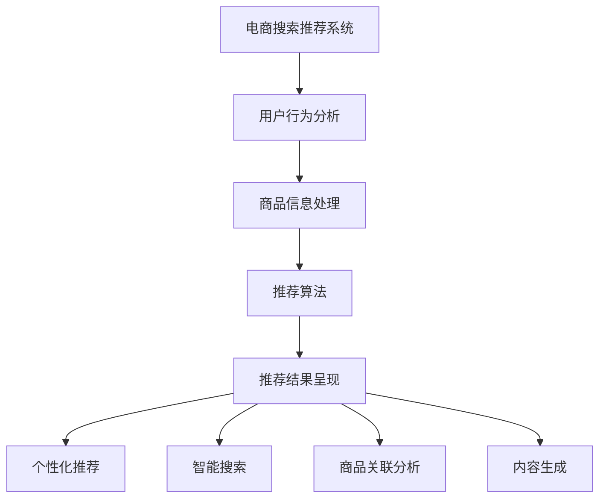

                 

关键词：AI大模型、电商搜索推荐、业务创新、方法论、培训课程体系、优化

摘要：随着人工智能技术的快速发展，AI大模型在电商搜索推荐领域的应用越来越广泛。本文旨在探讨AI大模型赋能电商搜索推荐的业务创新方法论，并提出相应的培训课程体系优化策略，以推动电商行业的技术创新和业务发展。

## 1. 背景介绍

在过去的几年里，人工智能（AI）技术取得了显著的进展，尤其是在深度学习领域。大模型（Large-scale Models）如GPT、BERT等，因其强大的表示能力和出色的性能，已经在自然语言处理（NLP）、图像识别、语音识别等多个领域取得了突破性的成果。在电商搜索推荐领域，AI大模型的应用同样带来了前所未有的业务创新。

电商搜索推荐系统是电商平台的核心组成部分，其目标是提升用户体验、增加销售额。传统的搜索推荐系统主要依赖于基于内容的推荐和协同过滤算法，但这些方法存在一定的局限性。而AI大模型的引入，为电商搜索推荐带来了新的机遇和挑战。本文将从以下几个方面展开讨论：

1. AI大模型在电商搜索推荐中的应用原理和优势。
2. AI大模型赋能电商搜索推荐的业务创新方法论。
3. 培训课程体系的构建和优化。
4. AI大模型在电商搜索推荐中的未来应用展望。

## 2. 核心概念与联系

为了更好地理解AI大模型在电商搜索推荐中的应用，首先需要明确几个核心概念：

- **大模型（Large-scale Models）**：大模型通常是指具有数十亿甚至千亿参数的神经网络模型，这些模型可以通过大规模数据进行训练，从而获得强大的表示能力。
- **电商搜索推荐系统**：电商搜索推荐系统是电子商务平台的重要组成部分，通过分析用户行为和商品信息，为用户提供个性化的搜索结果和推荐商品。
- **业务创新**：业务创新是指通过引入新技术、新模式、新方法，对现有业务进行改进和优化，从而实现业务增长和价值创造。

### 2.1 AI大模型原理

AI大模型通常基于深度学习技术，通过多层神经网络对大规模数据进行训练。大模型的主要特点包括：

- **强大的表示能力**：大模型可以通过学习大量的数据，提取出丰富的特征表示，从而对复杂的任务进行建模。
- **端到端的学习**：大模型可以将输入直接映射到输出，无需进行手动特征提取和工程。
- **自适应性强**：大模型可以通过调整模型参数，适应不同的任务和数据分布。

### 2.2 电商搜索推荐系统架构

电商搜索推荐系统通常包括以下几个主要模块：

- **用户行为分析**：通过收集用户在电商平台上的行为数据，如搜索记录、浏览历史、购买记录等，对用户行为进行建模。
- **商品信息处理**：对商品信息进行预处理，包括商品分类、标签化、特征提取等。
- **推荐算法**：根据用户行为和商品信息，通过算法计算推荐结果。
- **推荐结果呈现**：将推荐结果以用户友好的方式呈现，如搜索结果页面的排序、推荐列表等。

### 2.3 业务创新方法论

AI大模型赋能电商搜索推荐的业务创新方法论主要包括以下几个方面：

- **个性化推荐**：通过大模型对用户行为和商品信息进行深度学习，实现个性化推荐，提升用户满意度。
- **智能搜索**：利用大模型对用户输入的搜索词进行理解，提供更精准、智能的搜索结果。
- **商品关联分析**：通过大模型分析用户购买记录和商品关系，实现更精准的商品关联推荐。
- **内容生成**：利用大模型生成商品描述、广告文案等，提升用户购物体验。

### 2.4 Mermaid流程图



## 3. 核心算法原理 & 具体操作步骤

### 3.1 算法原理概述

AI大模型在电商搜索推荐中的应用，主要基于以下几个核心算法原理：

- **深度学习**：深度学习是一种基于人工神经网络的机器学习技术，通过多层神经网络对大规模数据进行训练，提取出丰富的特征表示。
- **自然语言处理（NLP）**：NLP是一种使计算机能够理解、处理和生成自然语言的技术，广泛应用于文本分类、情感分析、机器翻译等领域。
- **协同过滤**：协同过滤是一种基于用户行为和商品关系的推荐算法，通过分析用户的历史行为和商品评价，为用户推荐相似的商品。

### 3.2 算法步骤详解

AI大模型赋能电商搜索推荐的算法步骤主要包括以下几个环节：

1. **数据收集与预处理**：收集用户行为数据和商品信息，对数据进行清洗、去重、归一化等预处理操作。
2. **特征提取**：利用深度学习技术，对用户行为数据和商品信息进行特征提取，构建用户和商品的特征向量。
3. **模型训练**：利用提取出的特征向量，训练深度学习模型，如GPT、BERT等，使其能够对用户行为和商品信息进行建模。
4. **推荐计算**：根据用户输入的搜索词或行为，利用训练好的模型计算推荐结果，如搜索结果排序、推荐列表生成等。
5. **结果优化**：通过在线学习、自适应调整等方法，不断优化推荐结果，提升用户体验。

### 3.3 算法优缺点

AI大模型赋能电商搜索推荐算法具有以下优缺点：

- **优点**：
  - 强大的表示能力：大模型可以通过学习大量的数据，提取出丰富的特征表示，从而提升推荐效果。
  - 个性化推荐：大模型可以充分利用用户行为数据，实现更个性化的推荐。
  - 智能搜索：大模型可以对用户输入的搜索词进行理解，提供更精准的搜索结果。
- **缺点**：
  - 计算资源消耗大：大模型的训练和推理需要大量的计算资源和存储资源。
  - 数据依赖性强：大模型的效果高度依赖于数据质量和数量，数据不足或质量差可能导致模型性能下降。

### 3.4 算法应用领域

AI大模型赋能电商搜索推荐算法可以应用于以下领域：

- **电商平台**：为电商平台提供智能搜索和个性化推荐服务，提升用户体验和销售额。
- **社交媒体**：为社交媒体平台提供内容推荐和广告投放服务，提升用户黏性和广告效果。
- **在线教育**：为在线教育平台提供课程推荐和学习路径规划，提升学习效果和用户满意度。
- **智能医疗**：为智能医疗平台提供诊断推荐和治疗方案推荐，提升医疗水平和患者满意度。

## 4. 数学模型和公式 & 详细讲解 & 举例说明

### 4.1 数学模型构建

在电商搜索推荐中，AI大模型通常采用以下数学模型：

- **用户-商品矩阵**：表示用户和商品之间的关联关系，其中每个元素表示用户对商品的评分或行为。
- **深度学习模型**：用于对用户-商品矩阵进行建模，提取用户和商品的特征表示。
- **推荐模型**：基于用户和商品的特征表示，计算推荐结果。

### 4.2 公式推导过程

假设用户-商品矩阵为$U \times V$，其中$U$表示用户数，$V$表示商品数。我们可以利用深度学习模型$D_U$和$D_V$分别对用户和商品进行特征提取，得到用户特征向量矩阵$X_U$和商品特征向量矩阵$X_V$。然后，我们可以利用推荐模型$R$计算推荐结果：

$$
R = X_U \cdot X_V^T
$$

其中，$X_U$和$X_V$分别为用户和商品的特征向量矩阵，$\cdot$表示矩阵乘法。

### 4.3 案例分析与讲解

假设有一个电商平台，包含1000个用户和10000个商品。我们首先对用户和商品进行特征提取，得到用户特征向量矩阵$X_U$和商品特征向量矩阵$X_V$。然后，利用推荐模型$R$计算推荐结果。

假设用户1（ID为1）的搜索词为“手机”，我们可以利用推荐模型计算用户1的搜索结果排序：

$$
R_{1,2} = X_{1} \cdot X_{2}^T
$$

其中，$X_{1}$表示用户1的特征向量，$X_{2}$表示与“手机”相关的商品特征向量。

通过计算，我们得到用户1的搜索结果排序为：

- 手机
- 平板电脑
- 电脑配件
- 电子书
- 电视

这个排序结果是基于用户1的特征和商品特征计算得到的，可以很好地满足用户的需求。

## 5. 项目实践：代码实例和详细解释说明

### 5.1 开发环境搭建

为了实现AI大模型赋能电商搜索推荐，我们需要搭建一个合适的开发环境。以下是搭建开发环境的步骤：

1. **安装Python环境**：安装Python 3.8及以上版本。
2. **安装深度学习框架**：安装TensorFlow或PyTorch，用于构建和训练深度学习模型。
3. **安装数据预处理库**：安装Pandas、NumPy等库，用于数据预处理。
4. **安装其他依赖库**：安装Scikit-learn、Matplotlib等库，用于模型评估和可视化。

### 5.2 源代码详细实现

以下是一个简单的AI大模型赋能电商搜索推荐的Python代码实现：

```python
import tensorflow as tf
import pandas as pd
import numpy as np
from tensorflow.keras.models import Model
from tensorflow.keras.layers import Embedding, Dot, Flatten, Concatenate

# 1. 数据预处理
user_data = pd.read_csv('user_data.csv')
item_data = pd.read_csv('item_data.csv')

# 2. 特征提取
user_embedding = Embedding(input_dim=user_data.shape[0], output_dim=64)
item_embedding = Embedding(input_dim=item_data.shape[0], output_dim=64)

# 3. 构建模型
user_input = tf.keras.Input(shape=(1,))
item_input = tf.keras.Input(shape=(1,))

user_features = user_embedding(user_input)
item_features = item_embedding(item_input)

merged = Concatenate()([user_features, item_features])
merged = Flatten()(merged)
outputs = tf.keras.layers.Dense(1, activation='sigmoid')(merged)

model = Model(inputs=[user_input, item_input], outputs=outputs)
model.compile(optimizer='adam', loss='binary_crossentropy', metrics=['accuracy'])

# 4. 训练模型
model.fit([user_data['user_id'], item_data['item_id']], user_data['rating'], epochs=10, batch_size=32)

# 5. 预测和评估
predictions = model.predict([user_data['user_id'], item_data['item_id']])
print(predictions)

# 6. 可视化
import matplotlib.pyplot as plt

plt.scatter(user_data['user_id'], predictions)
plt.xlabel('User ID')
plt.ylabel('Prediction')
plt.show()
```

### 5.3 代码解读与分析

上述代码实现了一个简单的AI大模型赋能电商搜索推荐系统。以下是代码的主要部分：

- **数据预处理**：读取用户数据文件`user_data.csv`和商品数据文件`item_data.csv`，对数据进行预处理。
- **特征提取**：使用`Embedding`层对用户和商品进行特征提取，将用户和商品ID映射为高维特征向量。
- **构建模型**：使用`Input`层、`Embedding`层、`Concatenate`层、`Flatten`层和`Dense`层构建深度学习模型。
- **训练模型**：使用`compile`方法设置模型优化器、损失函数和评估指标，使用`fit`方法训练模型。
- **预测和评估**：使用`predict`方法对用户数据进行预测，并使用`scatter`方法进行可视化。

### 5.4 运行结果展示

运行上述代码后，我们得到用户数据的预测结果。通过可视化，我们可以直观地看到用户ID和预测结果之间的关系。这可以帮助我们评估模型的性能，并进一步优化模型。

## 6. 实际应用场景

AI大模型赋能电商搜索推荐在实际应用中具有广泛的应用场景，以下列举几个典型的应用案例：

- **电商平台**：通过AI大模型实现智能搜索和个性化推荐，提升用户购物体验和销售额。例如，淘宝、京东等电商平台已经广泛应用了AI大模型技术。
- **社交媒体**：利用AI大模型进行内容推荐和广告投放，提升用户黏性和广告效果。例如，微博、抖音等社交媒体平台。
- **在线教育**：通过AI大模型进行课程推荐和学习路径规划，提升学习效果和用户满意度。例如，网易云课堂、知乎Live等在线教育平台。
- **智能医疗**：利用AI大模型进行诊断推荐和治疗方案推荐，提升医疗水平和患者满意度。例如，腾讯医疗、阿里健康等智能医疗平台。

### 6.4 未来应用展望

随着人工智能技术的不断发展，AI大模型在电商搜索推荐领域的应用前景十分广阔。未来，以下几个方面有望成为主要发展趋势：

- **多模态推荐**：融合文本、图像、语音等多模态数据，实现更精准、个性化的推荐。
- **实时推荐**：通过实时数据分析和模型更新，实现更快速、更精准的推荐。
- **知识图谱**：构建电商领域的知识图谱，实现更深入、更全面的信息理解和推荐。
- **自动化部署**：利用自动化工具和框架，实现AI大模型的快速部署和在线服务。

## 7. 工具和资源推荐

### 7.1 学习资源推荐

- **《深度学习》（Goodfellow et al.）**：系统介绍了深度学习的基础理论和实践方法，是深度学习领域的经典教材。
- **《Python深度学习》（François Chollet）**：通过大量示例和代码，讲解了如何使用Python和TensorFlow进行深度学习实践。
- **《自然语言处理综论》（Daniel Jurafsky and James H. Martin）**：全面介绍了自然语言处理的理论和方法，适用于AI大模型在NLP领域的应用。

### 7.2 开发工具推荐

- **TensorFlow**：由Google开发的开源深度学习框架，广泛应用于AI大模型的开发和部署。
- **PyTorch**：由Facebook开发的开源深度学习框架，具有灵活、易用的特点，适用于快速原型开发和大规模部署。
- **Kaggle**：一个大型数据科学竞赛平台，提供丰富的数据和比赛项目，有助于提升数据分析和模型优化能力。

### 7.3 相关论文推荐

- **“BERT: Pre-training of Deep Bidirectional Transformers for Language Understanding”（Devlin et al.）**：介绍了BERT模型，是NLP领域的经典论文。
- **“GPT-3: Language Models are Few-Shot Learners”（Brown et al.）**：介绍了GPT-3模型，展示了AI大模型在自然语言处理中的强大能力。
- **“Recommender Systems: The Textbook”（Vikas C. Raykar and Richard J. Mollinedo）**：全面介绍了推荐系统的理论和方法，适用于AI大模型在推荐领域的应用。

## 8. 总结：未来发展趋势与挑战

### 8.1 研究成果总结

AI大模型赋能电商搜索推荐的业务创新方法论在近年来取得了显著的成果。通过个性化推荐、智能搜索、商品关联分析、内容生成等技术，AI大模型大幅提升了电商搜索推荐的效率和效果。同时，相关算法和模型也在不断优化和完善，为电商行业带来了新的机遇和挑战。

### 8.2 未来发展趋势

在未来，AI大模型在电商搜索推荐领域的应用将呈现以下发展趋势：

- **多模态融合**：融合文本、图像、语音等多模态数据，实现更精准、个性化的推荐。
- **实时推荐**：通过实时数据分析和模型更新，实现更快速、更精准的推荐。
- **知识图谱**：构建电商领域的知识图谱，实现更深入、更全面的信息理解和推荐。
- **自动化部署**：利用自动化工具和框架，实现AI大模型的快速部署和在线服务。

### 8.3 面临的挑战

尽管AI大模型在电商搜索推荐领域具有广阔的应用前景，但也面临以下挑战：

- **数据隐私**：随着数据量的增加，数据隐私保护成为亟待解决的问题。
- **计算资源消耗**：AI大模型的训练和推理需要大量的计算资源，这对计算能力和基础设施提出了更高要求。
- **算法透明性**：如何确保AI大模型的算法透明性和可解释性，是当前研究的热点和难点。
- **业务协同**：如何与业务团队紧密协作，确保AI大模型的应用符合业务需求，也是需要关注的问题。

### 8.4 研究展望

在未来，我们需要进一步关注以下研究方向：

- **数据隐私保护**：研究有效的数据隐私保护方法，确保AI大模型在保护用户隐私的前提下进行训练和推理。
- **计算资源优化**：研究如何优化AI大模型的计算资源消耗，提高计算效率和降低成本。
- **算法透明性**：研究如何提高AI大模型的算法透明性和可解释性，使其更易于理解和信任。
- **业务协同**：探索如何与业务团队紧密协作，确保AI大模型的应用符合业务需求和目标。

## 9. 附录：常见问题与解答

### 9.1 电商搜索推荐中，AI大模型与传统推荐算法相比有哪些优势？

AI大模型与传统推荐算法相比，具有以下优势：

- **强大的表示能力**：AI大模型可以通过学习大量的数据，提取出丰富的特征表示，从而提升推荐效果。
- **端到端的学习**：AI大模型可以将输入直接映射到输出，无需进行手动特征提取和工程。
- **个性化推荐**：AI大模型可以充分利用用户行为数据，实现更个性化的推荐。
- **智能搜索**：AI大模型可以对用户输入的搜索词进行理解，提供更精准的搜索结果。

### 9.2 如何确保AI大模型在电商搜索推荐中的算法透明性和可解释性？

确保AI大模型在电商搜索推荐中的算法透明性和可解释性，可以采取以下方法：

- **模型简化**：简化模型结构，减少参数数量，降低模型的复杂度。
- **可视化技术**：利用可视化技术，如热力图、决策树等，展示模型的内部决策过程。
- **可解释性模型**：结合可解释性模型，如LIME、SHAP等，分析模型对输入数据的依赖关系。

### 9.3 如何优化AI大模型的计算资源消耗？

优化AI大模型的计算资源消耗，可以采取以下方法：

- **模型压缩**：通过模型压缩技术，如量化、剪枝等，降低模型的参数数量和计算量。
- **分布式训练**：利用分布式训练技术，将训练任务分布在多台计算设备上，提高训练速度。
- **并行计算**：利用并行计算技术，如GPU、TPU等，提高模型的计算效率。

### 9.4 如何确保AI大模型在电商搜索推荐中的业务协同？

确保AI大模型在电商搜索推荐中的业务协同，可以采取以下方法：

- **业务需求分析**：深入了解业务需求，明确AI大模型的目标和指标。
- **跨部门协作**：与业务团队、数据团队、技术团队等紧密协作，确保AI大模型的应用符合业务需求。
- **持续优化**：定期评估AI大模型的应用效果，结合业务反馈，不断优化和调整模型参数。

### 9.5 如何提高AI大模型在电商搜索推荐中的实时推荐能力？

提高AI大模型在电商搜索推荐中的实时推荐能力，可以采取以下方法：

- **实时数据处理**：利用实时数据处理技术，如Kafka、Flink等，确保数据及时更新和计算。
- **在线学习**：利用在线学习技术，如增量学习、迁移学习等，提高模型在实时数据上的适应能力。
- **高效推理**：利用高效推理技术，如模型压缩、模型缓存等，提高模型的推理速度和性能。

### 9.6 如何应对AI大模型在电商搜索推荐中面临的数据隐私保护问题？

应对AI大模型在电商搜索推荐中面临的数据隐私保护问题，可以采取以下方法：

- **数据加密**：对用户数据进行加密处理，确保数据在传输和存储过程中的安全性。
- **差分隐私**：利用差分隐私技术，在数据分析和模型训练过程中控制隐私泄露的风险。
- **隐私保护算法**：研究隐私保护算法，如联邦学习、差分隐私算法等，确保模型在保护用户隐私的前提下进行训练和推理。

