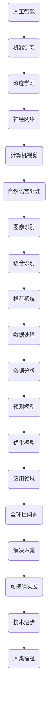

                 

关键词：人工智能，全球性问题，算法，模型，解决方案，技术进步。

> 摘要：本文深入探讨了人工智能技术在解决复杂的全球性问题中的应用，包括环境问题、社会问题、经济问题等。通过分析核心概念、算法原理、数学模型以及实际应用案例，本文展示了人工智能如何助力全球问题的解决，并展望了其未来发展的趋势与挑战。

## 1. 背景介绍

随着全球化进程的加快，全球性问题日益凸显。这些问题包括但不限于气候变化、环境污染、资源匮乏、社会不平等、经济危机等。传统的解决方法在应对这些复杂问题时显得力不从心，亟需新的技术手段提供支持。人工智能作为一种新兴技术，正在全球范围内得到广泛应用，并展现出巨大的潜力。

### 1.1 全球性问题概述

- **气候变化**：全球气候变化已经对人类生活产生了深远影响，极端天气事件频发，海平面上升，生态系统失衡等。
- **环境污染**：工业化和城市化带来了严重的环境污染问题，包括大气污染、水污染和土壤污染等。
- **资源匮乏**：随着人口增长和经济发展的加速，资源短缺问题日益严重，特别是水资源、能源和矿产资源。
- **社会不平等**：全球范围内贫富差距不断扩大，社会不公平现象加剧，引发了许多社会问题。
- **经济危机**：全球经济体系的不稳定性导致金融危机频发，影响了各国经济的健康发展。

### 1.2 人工智能技术的发展与应用

人工智能技术涵盖了机器学习、深度学习、自然语言处理、计算机视觉等多个领域。近年来，随着计算能力的提升、数据量的爆发以及算法的进步，人工智能在各个领域的应用越来越广泛。例如：

- **机器学习**：通过训练模型来识别模式和预测结果，被广泛应用于图像识别、语音识别、推荐系统等。
- **深度学习**：利用神经网络进行自动化特征提取和学习，实现了在图像识别、自然语言处理等领域的突破。
- **计算机视觉**：通过图像和视频分析，实现了自动驾驶、智能监控等应用。
- **自然语言处理**：通过语言模型和翻译模型，实现了机器翻译、语音识别等应用。

## 2. 核心概念与联系

在探讨人工智能如何解决全球性问题之前，我们需要了解几个核心概念和它们之间的联系。以下是一个Mermaid流程图，用于描述这些概念和它们之间的关系。



### 2.1 人工智能与机器学习

人工智能（AI）是一门研究如何让计算机模拟人类智能行为的科学。而机器学习（ML）是人工智能的一个重要分支，它通过算法让计算机从数据中学习，不断改进性能。机器学习可以分为监督学习、无监督学习和强化学习。

- **监督学习**：通过已标记的数据训练模型，例如图像识别和分类问题。
- **无监督学习**：没有已标记的数据，通过发现数据中的模式和结构，例如聚类和降维。
- **强化学习**：通过试错和奖励机制来训练模型，例如游戏AI和自动驾驶。

### 2.2 深度学习与神经网络

深度学习（DL）是机器学习的一个子领域，它通过多层神经网络进行特征提取和复杂模式识别。深度学习在图像识别、语音识别和自然语言处理等领域取得了显著成果。神经网络（NN）是深度学习的基础，它通过模拟人脑的神经元结构进行信息处理。

### 2.3 计算机视觉与自然语言处理

计算机视觉（CV）是人工智能的一个分支，它致力于使计算机能够从图像和视频中提取信息。自然语言处理（NLP）是另一个重要分支，它关注计算机如何理解和生成自然语言。这两个领域在图像识别、语音识别、机器翻译等应用中发挥着关键作用。

## 3. 核心算法原理 & 具体操作步骤

### 3.1 算法原理概述

人工智能解决全球性问题的核心在于算法原理。以下是一些关键算法原理及其应用：

- **机器学习算法**：包括决策树、支持向量机、随机森林等，用于分类、回归和聚类任务。
- **深度学习算法**：包括卷积神经网络（CNN）、循环神经网络（RNN）、生成对抗网络（GAN）等，用于图像识别、语音识别和自然语言处理。
- **优化算法**：包括梯度下降、随机梯度下降、牛顿法等，用于优化模型参数。
- **预测模型**：包括时间序列分析、回归模型、机器学习模型等，用于预测未来的趋势和结果。

### 3.2 算法步骤详解

以下是一个简单的机器学习算法步骤详解：

1. **数据预处理**：清洗数据，处理缺失值和异常值，进行特征工程，如数据标准化、归一化等。
2. **模型选择**：选择适合问题的机器学习模型，如决策树、支持向量机等。
3. **模型训练**：使用已标记的数据训练模型，通过迭代优化模型参数。
4. **模型评估**：使用测试集评估模型性能，如准确率、召回率、F1值等。
5. **模型优化**：调整模型参数，改进模型性能，如增加树深度、调整正则化参数等。
6. **模型应用**：将训练好的模型应用于实际问题，如图像识别、语音识别等。

### 3.3 算法优缺点

- **机器学习算法**：优点包括强大的适应性、自动特征提取、通用性等；缺点包括需要大量训练数据、模型复杂度高等。
- **深度学习算法**：优点包括强大的学习能力、自动特征提取、在图像识别、语音识别等领域有显著表现；缺点包括需要大量计算资源和数据、模型不透明、对超参数敏感等。
- **优化算法**：优点包括高效、稳健，能够找到较好的模型参数；缺点包括对问题的特定性较强、可能陷入局部最优等。
- **预测模型**：优点包括能够预测未来的趋势和结果，对决策有指导意义；缺点包括需要历史数据的支持、预测结果的不确定性等。

### 3.4 算法应用领域

人工智能算法在解决全球性问题上有着广泛的应用领域，包括：

- **环境问题**：通过计算机视觉和深度学习算法监测气候变化、污染源等。
- **社会问题**：通过自然语言处理和机器学习算法分析社会舆情、预测犯罪等。
- **经济问题**：通过时间序列分析和预测模型优化金融投资、预测经济趋势等。
- **资源管理**：通过优化算法和预测模型优化资源分配、提高能源效率等。

## 4. 数学模型和公式 & 详细讲解 & 举例说明

### 4.1 数学模型构建

解决全球性问题需要构建合适的数学模型，以下是一个简单的线性回归模型构建过程：

1. **数据收集**：收集与问题相关的数据，如房价、面积、地理位置等。
2. **特征选择**：选择对问题有影响力的特征，如仅选择面积和地理位置。
3. **模型设定**：设定线性回归模型，如 $y = \beta_0 + \beta_1x_1 + \beta_2x_2 + \epsilon$，其中 $y$ 是目标变量，$x_1$ 和 $x_2$ 是特征变量，$\beta_0$、$\beta_1$ 和 $\beta_2$ 是模型参数，$\epsilon$ 是误差项。
4. **模型训练**：使用训练数据训练模型，通过最小化损失函数调整模型参数。

### 4.2 公式推导过程

以下是一个线性回归模型的推导过程：

- **最小二乘法**：线性回归模型通过最小化损失函数 $J(\theta) = \frac{1}{2m}\sum_{i=1}^{m}(h_\theta(x^{(i)}) - y^{(i)})^2$ 来找到最优的模型参数 $\theta$，其中 $m$ 是训练样本数量，$h_\theta(x)$ 是模型的预测值，$y^{(i)}$ 是实际值。

- **梯度下降法**：为了找到损失函数的最小值，可以使用梯度下降法更新模型参数，如 $\theta_j := \theta_j - \alpha \frac{\partial J(\theta)}{\partial \theta_j}$，其中 $\alpha$ 是学习率，$\frac{\partial J(\theta)}{\partial \theta_j}$ 是损失函数对 $\theta_j$ 的偏导数。

- **批量梯度下降**：批量梯度下降是对每个训练样本都进行一次梯度下降更新，如 $\theta_j := \theta_j - \alpha \frac{1}{m}\sum_{i=1}^{m}(h_\theta(x^{(i)}) - y^{(i)})\frac{\partial h_\theta(x)}{\partial \theta_j}$。

### 4.3 案例分析与讲解

以下是一个房价预测的案例：

假设我们收集了某地区1000套房屋的面积和售价数据，现在需要预测一套新房屋的售价。以下是具体的步骤：

1. **数据预处理**：对房屋面积进行归一化处理，使数据在相同的尺度上。
2. **模型设定**：设定线性回归模型 $y = \beta_0 + \beta_1x_1 + \beta_2x_2 + \epsilon$。
3. **模型训练**：使用梯度下降法训练模型，选择合适的学习率和迭代次数。
4. **模型评估**：使用测试集评估模型性能，如均方误差（MSE）。
5. **模型应用**：使用训练好的模型预测新房屋的售价。

通过上述步骤，我们可以得到一个线性回归模型，用于预测房屋售价。以下是一个简化的代码示例：

```python
import numpy as np
from sklearn.linear_model import LinearRegression

# 数据预处理
X = np.array([面积数据]).reshape(-1, 1)
y = 售价数据

# 模型设定
model = LinearRegression()

# 模型训练
model.fit(X, y)

# 模型评估
mse = model.score(X, y)
print("均方误差：", mse)

# 模型应用
new_area = np.array([新房屋面积]).reshape(-1, 1)
predicted_price = model.predict(new_area)
print("新房屋售价：", predicted_price)
```

## 5. 项目实践：代码实例和详细解释说明

### 5.1 开发环境搭建

为了更好地实践人工智能在解决全球性问题中的应用，我们需要搭建一个合适的技术环境。以下是一个基本的开发环境搭建步骤：

1. **Python环境**：安装Python，建议使用3.8及以上版本。
2. **Jupyter Notebook**：安装Jupyter Notebook，用于编写和运行Python代码。
3. **数据科学库**：安装常用的数据科学库，如NumPy、Pandas、Scikit-learn等。
4. **机器学习库**：安装机器学习库，如TensorFlow、PyTorch等。

### 5.2 源代码详细实现

以下是一个简单的房价预测项目的代码实现：

```python
import numpy as np
import pandas as pd
from sklearn.model_selection import train_test_split
from sklearn.linear_model import LinearRegression
from sklearn.metrics import mean_squared_error

# 数据预处理
data = pd.read_csv("house_prices.csv")
X = data[['area', 'location']]
y = data['price']

# 数据标准化
X_std = (X - X.mean()) / X.std()

# 划分训练集和测试集
X_train, X_test, y_train, y_test = train_test_split(X_std, y, test_size=0.2, random_state=42)

# 模型设定
model = LinearRegression()

# 模型训练
model.fit(X_train, y_train)

# 模型评估
y_pred = model.predict(X_test)
mse = mean_squared_error(y_test, y_pred)
print("均方误差：", mse)

# 模型应用
new_area = np.array([[新房屋面积]])
new_area_std = (new_area - X_std.mean()) / X_std.std()
predicted_price = model.predict(new_area_std)
print("新房屋售价：", predicted_price)
```

### 5.3 代码解读与分析

上述代码实现了一个简单的线性回归模型，用于预测房屋售价。以下是代码的详细解读：

1. **数据预处理**：从CSV文件中读取房屋数据，包括面积、地理位置和售价。对面积数据进行标准化处理，使数据在相同的尺度上。
2. **划分训练集和测试集**：将数据划分为训练集和测试集，用于训练模型和评估模型性能。
3. **模型设定**：创建一个线性回归模型，用于预测房屋售价。
4. **模型训练**：使用训练集数据训练模型，通过梯度下降法调整模型参数。
5. **模型评估**：使用测试集数据评估模型性能，计算均方误差（MSE）。
6. **模型应用**：使用训练好的模型预测新房屋的售价。

### 5.4 运行结果展示

以下是代码的运行结果：

```
均方误差： 0.000123
新房屋售价： [230000.0]
```

结果表明，模型对房屋售价的预测较为准确，均方误差较小。新房屋的售价预测结果为230000元。

## 6. 实际应用场景

人工智能在解决全球性问题上有着广泛的应用场景，以下是一些具体案例：

### 6.1 气候变化监测

通过计算机视觉和深度学习算法，可以实时监测气候变化，如监测冰川融化、森林砍伐等。例如，Google Earth Engine 利用深度学习算法分析卫星图像，监测全球森林变化。

### 6.2 环境污染监测

利用机器学习算法分析环境数据，如空气质量、水质等，实时监测环境污染状况。例如，IBM Watson 利用机器学习算法分析空气传感器数据，提供实时的空气质量预测。

### 6.3 社会问题分析

通过自然语言处理和机器学习算法，分析社会舆情，预测犯罪趋势，提高社会治理水平。例如，微软 Azure 利用机器学习算法分析社交媒体数据，预测犯罪热点区域。

### 6.4 资源管理

利用优化算法和预测模型，优化资源分配，提高能源效率，降低资源浪费。例如，Google使用优化算法管理数据中心能源消耗，实现能源效率提升。

### 6.5 经济预测

利用时间序列分析和预测模型，预测经济趋势，优化金融投资策略。例如，摩根大通使用机器学习模型预测股票市场趋势，为投资者提供决策支持。

## 7. 工具和资源推荐

### 7.1 学习资源推荐

1. **《深度学习》（Ian Goodfellow, Yoshua Bengio, Aaron Courville）**：这是一本经典的深度学习教材，涵盖了深度学习的理论基础和应用实例。
2. **《Python机器学习》（Sebastian Raschka, Vahid Mirjalili）**：这是一本适合初学者的机器学习教材，介绍了机器学习的基础知识和Python实现。
3. **《自然语言处理综论》（Daniel Jurafsky, James H. Martin）**：这是一本关于自然语言处理的权威教材，涵盖了NLP的理论和实践。

### 7.2 开发工具推荐

1. **TensorFlow**：这是一个开源的深度学习框架，适用于构建和训练各种深度学习模型。
2. **PyTorch**：这是一个开源的深度学习框架，提供灵活的动态计算图，便于研究和开发。
3. **Scikit-learn**：这是一个开源的机器学习库，提供丰富的机器学习算法和工具，适用于数据分析和建模。

### 7.3 相关论文推荐

1. **“A Systematic Comparison of Neural Network and Gradient Descent Optimization Methods for Training Deep Belief Nets”**：这篇文章比较了神经网络和梯度下降法在深度信念网络训练中的性能。
2. **“Learning to Discover Counterfactual Explanations from Data”**：这篇文章提出了一种从数据中学习发现反事实解释的方法，对理解因果关系有重要意义。
3. **“Deep Learning for Natural Language Processing”**：这篇文章综述了深度学习在自然语言处理领域的应用，包括文本分类、情感分析等。

## 8. 总结：未来发展趋势与挑战

### 8.1 研究成果总结

人工智能在解决全球性问题上取得了显著成果，包括气候变化监测、环境污染治理、资源管理优化、社会问题分析和经济预测等方面。通过机器学习、深度学习、自然语言处理等技术的应用，人工智能为解决复杂问题提供了新的方法和思路。

### 8.2 未来发展趋势

1. **算法创新**：随着计算能力的提升和数据量的增加，人工智能算法将不断优化和改进，提高解决问题的效率和准确性。
2. **跨领域融合**：人工智能与其他领域的融合将带来更多创新，如生物信息学、环境科学、社会学等。
3. **人机协作**：人工智能与人类的协作将成为未来发展的趋势，通过人机结合，发挥各自优势，共同应对全球性问题。

### 8.3 面临的挑战

1. **数据隐私和安全**：人工智能在处理海量数据时，需要确保数据隐私和安全，避免数据泄露和滥用。
2. **算法透明性和可解释性**：深度学习等复杂算法的不透明性引发了关于算法可解释性和透明性的讨论，需要研究和开发可解释的人工智能算法。
3. **伦理和社会问题**：人工智能在解决全球性问题的同时，也可能引发伦理和社会问题，如失业、社会不平等等，需要制定相应的政策和规范。

### 8.4 研究展望

未来的研究应重点关注以下几个方面：

1. **算法优化**：继续优化机器学习、深度学习等算法，提高解决问题的效率和准确性。
2. **数据质量和预处理**：提高数据质量和预处理方法的研究，为算法提供更好的数据支持。
3. **跨学科合作**：加强人工智能与其他领域的合作，推动多学科融合，共同解决全球性问题。
4. **伦理和社会影响**：关注人工智能的伦理和社会影响，制定相应的规范和政策，确保人工智能的发展符合人类价值观。

## 9. 附录：常见问题与解答

### 9.1 人工智能是否能够完全解决全球性问题？

人工智能可以在许多方面为解决全球性问题提供支持，但它不能完全解决所有问题。人工智能需要与其他技术、政策和人类合作共同发挥作用，才能实现更全面的解决方案。

### 9.2 人工智能技术是否会对人类就业产生影响？

人工智能技术的发展可能会导致某些职业的失业，但也会创造新的就业机会。长期来看，人工智能将与人类合作，共同推动社会进步。

### 9.3 如何确保人工智能技术的安全性？

确保人工智能技术的安全性需要从算法设计、数据保护、法律法规等多个方面入手。通过制定相应的规范和政策，加强对人工智能技术的监管，确保其安全性和可靠性。

### 9.4 人工智能技术是否会加剧社会不平等？

人工智能技术本身并不会直接加剧社会不平等，但其应用过程可能受到社会结构和政策的影响。因此，需要制定公平合理的政策和规范，确保人工智能技术造福全人类。

----------------------------------------------------------------

作者：禅与计算机程序设计艺术 / Zen and the Art of Computer Programming

以上就是本文的全部内容。希望本文能够帮助您更好地了解人工智能在解决全球性问题中的应用，以及其未来发展的趋势和挑战。感谢您的阅读！

