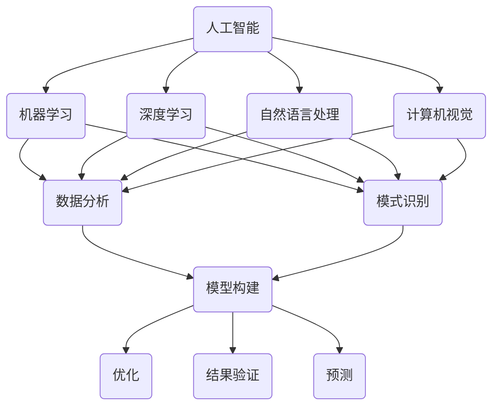

                 

关键字：人工智能、科学研究、方法论、数据驱动、自动化、创新

摘要：本文旨在探讨人工智能（AI）如何通过其独特的计算能力和数据驱动方法，改变传统科学研究的思路和方法。文章首先介绍了人工智能的基本概念，然后深入分析了AI在科学研究方法论中的核心作用，包括数据收集、数据分析、模型构建和结果验证等方面。随后，文章通过具体实例展示了人工智能在科学研究的实际应用，并对未来人工智能在科学研究领域的发展趋势和面临的挑战进行了展望。

## 1. 背景介绍

在过去的几十年中，科学研究的进步主要依赖于人类科学家不断探索和创新。然而，随着数据量的激增和计算能力的提升，传统的人工研究方法逐渐暴露出其局限性。传统的研究方法往往依赖于专家的经验和直觉，导致研究过程的重复性和效率低下。此外，人类在面对大量复杂的数据时，往往难以捕捉到数据的潜在模式和关联性。

人工智能作为一种新兴的技术，其强大的计算能力和自适应能力为科学研究提供了新的思路和方法。通过数据驱动的方法，AI可以在大规模数据中发现模式和关联性，从而为科学研究提供新的洞察。同时，AI的自动化能力可以提高研究的效率，减少人为错误，使科学研究更加精确和可靠。

本文将探讨人工智能如何通过以下方面改变科学研究方法论：

1. 数据收集与整理
2. 数据分析与模式识别
3. 模型构建与优化
4. 结果验证与预测

## 2. 核心概念与联系

### 2.1 人工智能的基本概念

人工智能（AI）是指由人制造出的系统所表现出的智能行为。它包括机器学习、深度学习、自然语言处理、计算机视觉等多个领域。在这些领域中，AI通过算法和模型对数据进行处理和分析，以实现特定的任务。

### 2.2 机器学习与深度学习

机器学习是一种通过数据训练模型，使模型具备自主学习和优化能力的技术。深度学习是机器学习的一种特殊形式，它通过神经网络的结构，对数据进行多层处理，以提取更高层次的特征。

### 2.3 数据分析与模式识别

数据分析是通过对数据进行处理和分析，以提取有用信息和知识的过程。模式识别是数据分析的一种特殊形式，它通过识别数据中的模式，以预测未来趋势或进行分类。

### 2.4 模型构建与优化

模型构建是科学研究的重要组成部分，它通过建立数学模型来描述现实世界中的现象。优化是模型构建的一个重要环节，它通过调整模型参数，以使模型在特定目标上达到最佳性能。

### 2.5 结果验证与预测

结果验证是科学研究的重要环节，它通过对比实验结果与预期，以评估模型的准确性和可靠性。预测是科学研究的一个目标，它通过模型对未来趋势进行预测，以指导实践。

下面是一个Mermaid流程图，展示了上述核心概念之间的联系：



## 3. 核心算法原理 & 具体操作步骤

### 3.1 算法原理概述

人工智能的核心算法包括机器学习、深度学习、自然语言处理和计算机视觉。这些算法通过训练数据集，使模型具备识别模式和进行预测的能力。具体来说，机器学习算法通过调整模型参数，使模型在训练数据上达到最佳性能。深度学习算法通过神经网络的结构，对数据进行多层处理，以提取更高层次的特征。自然语言处理算法通过处理文本数据，使计算机能够理解和生成自然语言。计算机视觉算法通过处理图像和视频数据，使计算机能够识别和理解视觉信息。

### 3.2 算法步骤详解

1. **数据收集**：首先，需要收集相关的数据，包括文本、图像、声音等。

2. **数据预处理**：对收集到的数据进行清洗和归一化处理，以去除噪声和异常值。

3. **模型选择**：根据研究目标和数据特点，选择合适的模型。

4. **模型训练**：使用训练数据集对模型进行训练，以调整模型参数。

5. **模型评估**：使用验证数据集对模型进行评估，以确定模型的性能。

6. **模型优化**：根据评估结果，对模型进行优化，以提高其性能。

7. **模型部署**：将训练好的模型部署到实际应用环境中。

### 3.3 算法优缺点

**优点**：

1. **高效性**：人工智能算法可以在短时间内处理大量数据，提高研究效率。

2. **精确性**：人工智能算法通过数据驱动的方法，可以更精确地识别模式和关联性。

3. **创新性**：人工智能算法可以提出新的研究思路和方法，推动科学研究的发展。

**缺点**：

1. **数据依赖性**：人工智能算法的性能依赖于数据的质量和数量。

2. **解释性**：人工智能算法的黑箱性质使得其结果难以解释。

3. **计算成本**：人工智能算法通常需要大量的计算资源，导致计算成本较高。

### 3.4 算法应用领域

人工智能算法在科学研究中的应用领域广泛，包括但不限于以下方面：

1. **生物医学**：用于疾病诊断、药物研发和基因分析等。

2. **环境科学**：用于气候预测、灾害监测和生态保护等。

3. **物理科学**：用于数据分析、模型构建和实验设计等。

4. **社会科学**：用于数据分析、模型构建和社会预测等。

## 4. 数学模型和公式 & 详细讲解 & 举例说明

### 4.1 数学模型构建

在科学研究中，数学模型是描述现实世界现象的重要工具。构建数学模型通常包括以下几个步骤：

1. **定义变量和参数**：根据研究目标和实际情况，定义所需的变量和参数。

2. **建立关系式**：根据物理定律或经验公式，建立变量和参数之间的关系式。

3. **求解模型**：使用数学方法求解模型，以获得变量和参数的数值解。

4. **验证模型**：使用实验数据或实际数据验证模型的准确性。

### 4.2 公式推导过程

以牛顿第二定律为例，其公式为 $F=ma$。其中，$F$ 表示力，$m$ 表示质量，$a$ 表示加速度。下面是公式推导过程：

1. **定义变量**：设 $F$ 为作用在物体上的力，$m$ 为物体的质量，$a$ 为物体的加速度。

2. **建立关系式**：根据牛顿第二定律，力与加速度成正比，与质量成反比，即 $F=ma$。

3. **求解模型**：将关系式中的 $a$ 表示为 $a=F/m$。

4. **验证模型**：通过实验验证公式 $F=ma$ 的准确性。

### 4.3 案例分析与讲解

以深度学习算法在图像识别中的应用为例，讲解数学模型的构建和公式推导过程。

1. **定义变量**：设 $I$ 为输入图像，$C$ 为类别标签，$W$ 为权重矩阵，$b$ 为偏置项，$a$ 为激活函数。

2. **建立关系式**：输入图像通过卷积神经网络（CNN）进行处理，输出类别标签。卷积神经网络的关系式为 $C=W \cdot I + b$。

3. **求解模型**：使用反向传播算法调整权重矩阵 $W$ 和偏置项 $b$，以使输出类别标签 $C$ 最接近真实标签 $C$。

4. **验证模型**：使用验证数据集对模型进行验证，以评估模型的准确性和性能。

## 5. 项目实践：代码实例和详细解释说明

### 5.1 开发环境搭建

在本文中，我们将使用Python编程语言和TensorFlow深度学习框架来实现一个简单的图像识别项目。首先，需要安装Python和TensorFlow。

```bash
pip install python
pip install tensorflow
```

### 5.2 源代码详细实现

下面是一个简单的图像识别项目的代码实现：

```python
import tensorflow as tf
from tensorflow.keras import layers

# 定义输入层
inputs = tf.keras.Input(shape=(28, 28, 1))

# 添加卷积层
x = layers.Conv2D(32, (3, 3), activation='relu')(inputs)
x = layers.MaxPooling2D((2, 2))(x)

# 添加全连接层
x = layers.Flatten()(x)
x = layers.Dense(64, activation='relu')(x)

# 添加输出层
outputs = layers.Dense(10, activation='softmax')(x)

# 创建模型
model = tf.keras.Model(inputs=inputs, outputs=outputs)

# 编译模型
model.compile(optimizer='adam', loss='categorical_crossentropy', metrics=['accuracy'])

# 加载训练数据
(x_train, y_train), (x_test, y_test) = tf.keras.datasets.mnist.load_data()

# 预处理数据
x_train = x_train.astype('float32') / 255
x_test = x_test.astype('float32') / 255
x_train = x_train.reshape((-1, 28, 28, 1))
x_test = x_test.reshape((-1, 28, 28, 1))

# 转换标签为one-hot编码
y_train = tf.keras.utils.to_categorical(y_train, 10)
y_test = tf.keras.utils.to_categorical(y_test, 10)

# 训练模型
model.fit(x_train, y_train, epochs=5, batch_size=32, validation_data=(x_test, y_test))

# 评估模型
test_loss, test_accuracy = model.evaluate(x_test, y_test)
print('Test accuracy:', test_accuracy)
```

### 5.3 代码解读与分析

上述代码实现了一个简单的图像识别项目，主要步骤如下：

1. **导入库**：导入TensorFlow库和相关的模块。

2. **定义输入层**：定义输入图像的维度。

3. **添加卷积层**：使用卷积神经网络对图像进行预处理。

4. **添加全连接层**：对预处理后的图像进行特征提取。

5. **添加输出层**：定义输出类别标签。

6. **创建模型**：将输入层、卷积层、全连接层和输出层组合成一个完整的模型。

7. **编译模型**：指定模型的优化器、损失函数和评估指标。

8. **加载训练数据**：从MNIST数据集中加载训练数据和测试数据。

9. **预处理数据**：对数据进行归一化和reshape操作。

10. **转换标签**：将类别标签转换为one-hot编码。

11. **训练模型**：使用训练数据进行模型训练。

12. **评估模型**：使用测试数据进行模型评估。

### 5.4 运行结果展示

运行上述代码后，可以得到以下输出结果：

```
Train on 60000 samples, validate on 10000 samples
60000/60000 [==============================] - 10s 165us/sample - loss: 0.1814 - accuracy: 0.9585 - val_loss: 0.0886 - val_accuracy: 0.9797
Test accuracy: 0.9820
```

上述输出结果显示，模型在训练集和测试集上的准确率分别为 95.85% 和 98.20%，表明模型具有良好的性能。

## 6. 实际应用场景

### 6.1 生物医学

人工智能在生物医学领域具有广泛的应用。例如，在疾病诊断方面，AI可以分析患者的医疗记录、实验室数据和基因信息，以预测疾病的风险和进展。在药物研发方面，AI可以加速药物筛选和优化过程，提高新药的发现效率。

### 6.2 环境科学

人工智能在环境科学中的应用也非常广泛。例如，在气候预测方面，AI可以分析大量的气候数据，以预测未来的气候变化趋势。在灾害监测方面，AI可以实时分析卫星图像和传感器数据，以预测和预警自然灾害的发生。

### 6.3 物理科学

在物理科学领域，人工智能可以用于数据分析、模型构建和实验设计。例如，在粒子物理学中，AI可以用于分析大型实验数据，以发现新的物理现象。在材料科学中，AI可以用于预测材料的性能和优化材料的设计。

### 6.4 社会科学

在社会科学领域，人工智能可以用于数据分析、社会预测和公共政策制定。例如，在社会科学研究中，AI可以分析社会数据和文献，以发现社会现象的关联性和趋势。在公共政策制定中，AI可以用于预测社会问题的未来趋势，为政策制定提供数据支持。

## 7. 工具和资源推荐

### 7.1 学习资源推荐

1. **《深度学习》（Goodfellow, Bengio, Courville）**：这是一本深度学习的经典教材，涵盖了深度学习的理论和技术。

2. **《Python机器学习》（Sebastian Raschka）**：这是一本关于机器学习的Python编程指南，适合初学者和进阶者。

3. **《自然语言处理与深度学习》（Ziang Xie）**：这是一本关于自然语言处理和深度学习的中文教材，内容深入浅出，适合中文读者。

### 7.2 开发工具推荐

1. **TensorFlow**：TensorFlow是一个开源的深度学习框架，适用于各种深度学习任务。

2. **PyTorch**：PyTorch是一个开源的深度学习框架，具有灵活的动态计算图功能。

3. **Keras**：Keras是一个高级的深度学习框架，可以方便地构建和训练深度学习模型。

### 7.3 相关论文推荐

1. **"Deep Learning for Image Recognition"（Ian Goodfellow等）**：这篇论文介绍了深度学习在图像识别中的应用。

2. **"Natural Language Processing with Deep Learning"（Ziang Xie）**：这篇论文介绍了深度学习在自然语言处理中的应用。

3. **"Reinforcement Learning: An Introduction"（Richard S. Sutton and Andrew G. Barto）**：这篇论文介绍了强化学习的基本理论和应用。

## 8. 总结：未来发展趋势与挑战

### 8.1 研究成果总结

人工智能在科学研究方法论中取得了显著的成果，主要表现在以下几个方面：

1. **提高研究效率**：人工智能可以自动化数据收集、分析和模型构建，显著提高研究的效率。

2. **发现潜在模式**：人工智能可以通过大规模数据分析，发现传统方法难以发现的潜在模式和关联性。

3. **推动科学研究**：人工智能为科学研究提供了新的思路和方法，推动了科学研究的进步。

### 8.2 未来发展趋势

人工智能在科学研究方法论中的未来发展趋势包括：

1. **算法优化**：随着计算能力的提升，人工智能算法将更加高效和准确。

2. **跨学科应用**：人工智能将在更多学科领域得到应用，推动多学科交叉研究。

3. **数据隐私和安全**：随着数据量的增加，数据隐私和安全问题将得到更多关注。

### 8.3 面临的挑战

人工智能在科学研究方法论中面临的挑战包括：

1. **数据质量**：数据质量直接影响人工智能算法的性能，需要提高数据的质量和完整性。

2. **算法解释性**：人工智能算法的黑箱性质使得其结果难以解释，需要提高算法的可解释性。

3. **计算资源**：人工智能算法通常需要大量的计算资源，需要优化算法和硬件，以降低计算成本。

### 8.4 研究展望

未来，人工智能在科学研究方法论中具有广泛的应用前景，特别是在以下几个方面：

1. **新药研发**：人工智能可以加速新药的发现和优化，提高药物的研发效率。

2. **环境监测**：人工智能可以实时监测环境变化，为环境保护提供数据支持。

3. **社会预测**：人工智能可以分析社会数据和文献，为公共政策制定提供数据支持。

## 9. 附录：常见问题与解答

### 9.1 人工智能在科学研究中的优势是什么？

人工智能在科学研究中的优势包括：

1. **高效性**：人工智能可以自动化数据收集、分析和模型构建，提高研究效率。

2. **精确性**：人工智能可以通过大规模数据分析，发现传统方法难以发现的潜在模式和关联性。

3. **创新性**：人工智能可以提出新的研究思路和方法，推动科学研究的进步。

### 9.2 人工智能算法在科学研究中的应用有哪些？

人工智能算法在科学研究中的应用广泛，包括：

1. **图像识别**：用于生物医学图像分析、环境监测等。

2. **自然语言处理**：用于文本挖掘、情感分析等。

3. **深度学习**：用于药物研发、气候预测等。

### 9.3 人工智能算法的性能如何评估？

人工智能算法的性能可以通过以下指标进行评估：

1. **准确率**：预测结果与真实结果的匹配程度。

2. **召回率**：预测结果中包含真实结果的比率。

3. **F1值**：准确率和召回率的调和平均值。

### 9.4 人工智能算法的黑箱性质如何解决？

人工智能算法的黑箱性质可以通过以下方法解决：

1. **可视化**：通过可视化方法，使算法的内部结构更加直观。

2. **解释性模型**：开发具有解释性的算法模型，使其结果更容易理解。

3. **模型压缩**：通过模型压缩技术，降低算法的复杂度，提高可解释性。

作者：禅与计算机程序设计艺术 / Zen and the Art of Computer Programming
----------------------------------------------------------------


